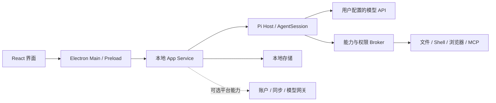

<p align="center">
  
</p>

<h1 align="center">openerx</h1>

<p align="center">
  <strong>让 AI 不止于对话，走进你的日常工作。</strong><br />
  开源、本地优先的个人 AI 工作空间。
</p>

<p align="center">
  <a href="https://github.com/openerserver/openerx/releases"></a>
  <a href="LICENSE"></a>
  
</p>

<p align="center">
  <a href="https://github.com/openerserver/openerx/releases/latest">下载客户端</a> ·
  <a href="#快速上手">快速上手</a> ·
  <a href="#从源码运行">从源码运行</a> ·
  <a href="#开发文档">开发文档</a> ·
  <a href="https://github.com/openerserver/openerx/issues">反馈问题</a>
</p>

---

**openerx 是一款运行在 Windows 和 macOS 上的 AI 桌面客户端。** 它把对话、项目、文件、工具、Skill 和记忆组织在同一个工作空间中，让你通过自然语言提出需求，并在授权范围内调用本机能力、处理资料、执行任务和查看成果。

默认使用你自己的模型 API：配置兼容 OpenAI Chat Completions 的服务地址、API Key 和模型 ID 即可开始，不要求注册 openerx 账号，也不需要先部署平台服务器。

> 本地优先，不等于完全离线。桌面端负责本地任务与工具执行；使用远程模型或第三方工具时，相关请求与上下文仍会发送给你配置的服务。

## 能做什么

| 能力 | 你可以怎样使用 |
| --- | --- |
| **对话与成果** | 围绕一项任务持续交流，查看生成过程、历史记录以及可预览、保存和再次使用的成果。 |
| **个人项目** | 把相关对话、项目说明和多个本机目录放在一起，为持续工作保留上下文；也可以不建项目，直接聊天。 |
| **文件与本机工具** | 结合附件和授权工作目录处理资料，并通过受权限管理的工具执行本地操作。 |
| **模型接入** | 使用自己的 OpenAI-compatible API；模型的工具调用、图片理解等能力取决于所接入的服务。 |
| **联网搜索与浏览器操作** | 搜索公开信息，使用独立浏览器，或在明确授权后操作 Chrome 标签页；系统浏览器模式依赖平台权限。 |
| **MCP 工具扩展** | 连接本机或远程 MCP 服务，把外部工具接入同一工作流程。 |
| **Skill 技能** | 使用内置、个人或工作区 Skill，把可复用的任务方法带入对话。 |
| **长期记忆** | 保存跨对话有用的偏好与信息，并通过设置查看、管理和删除记忆。 |
| **本地自动化 · Alpha** | 将任务保存为一次性、每日或每周自动化，查看运行历史与结果；需要桌面执行主机和应用保持运行。 |

### 从这些任务开始

下面是可以尝试的任务描述，不代表对所有文件格式、网站或模型的兼容性保证：

> “阅读我选中的项目资料，整理一份摘要，把待确认的问题单独列出来。”

> “基于这个目录里的文件生成一份工作周报，先给我检查，再保存到指定位置。”

> “搜索这个主题的公开资料，比较几个方案，并保留来源。”

> “把这套重复任务保存为每周自动化，完成后让我检查运行结果。”

任务能否完成取决于模型能力、文件内容、已启用工具和你授予的权限。涉及重要文件或外部操作时，请先检查结果。

## 下载与安装

前往 [Releases](https://github.com/openerserver/openerx/releases/latest) 获取最新公开版本。

以下为 **v2.0.5** 的下载入口；后续版本请以 Releases 页面为准。

| 系统 | 平台要求 | 下载 |
| --- | --- | --- |
| Windows | Windows 10 及以上，x64 | [Windows 安装程序](https://github.com/openerserver/openerx/releases/download/v2.0.5/openerxSetup.exe) |
| macOS | macOS 14 及以上，Apple Silicon / arm64 | [DMG 安装包](https://github.com/openerserver/openerx/releases/download/v2.0.5/openerx-2.0.5-arm64.dmg) · [ZIP 应用包](https://github.com/openerserver/openerx/releases/download/v2.0.5/openerx-darwin-arm64-2.0.5.zip) |

下载后可使用同一 Release 提供的 `.sha256` 文件校验完整性。签名、公证、自动更新及其他架构的支持情况，以对应版本的发布说明和实际附件为准；不要为了安装应用关闭系统安全防护。

当前下载入口面向桌面端。仓库中的移动伴随端代码不等于已经在 App Store 或 Google Play 上架。

## 快速上手

### 1. 配置模型

打开客户端，进入 **设置 → 模型**，填写你所使用的模型服务信息：

| 配置项 | 说明 |
| --- | --- |
| API 地址 | 支持 OpenAI-compatible Chat Completions 的服务地址。 |
| API Key | 由你的模型服务商提供的密钥；安装包不内置密钥。 |
| 模型 ID | 该服务实际提供的模型名称；需要执行工具任务时，请确认模型支持工具调用。 |

测试连接并保存后，即可发送第一条消息。未完成配置时，客户端会引导你配置模型，而不是自动切换到托管服务。

**客户端开源不代表模型调用免费。** API 的可用性、额度与费用由你选择的服务商决定。

### 2. 开始对话，按需添加资料

直接新建对话即可开始。需要处理文件时，添加相关附件或选择工作目录，只授权任务真正需要的范围。

对于持续进行的工作，可以创建个人项目，设置项目说明、主目录和附加目录，再把相关对话归入项目。

### 3. 启用需要的工具

在 **设置 → 工具** 中配置浏览器、MCP 等能力。首次使用涉及本机文件、系统操作或外部服务的能力时，按界面提示检查权限与连接状态。

模型能调用哪些工具，取决于当前平台支持、工具配置和有效授权；安装 Skill 或连接 MCP 不意味着自动获得所有权限。

## 工具与扩展

### MCP：连接你的工具

在 **设置 → 工具 → 添加工具** 中手动填写服务配置，或通过 **JSON 导入** 粘贴 `mcpServers` 配置。

支持本机 **STDIO** 和远程 **Streamable HTTP**；可配置启动参数、环境变量、工作目录、请求头以及 Bearer / OAuth 认证。界面提供 Context7 和 GitHub 快捷配置，其中 GitHub 默认使用只读接口。

添加后可以测试连接、查看工具列表、编辑配置、启停或移除服务。STDIO 服务所需的运行环境仍需在本机安装；请只连接可信服务。

详细配置与使用边界见 [MCP 管理说明](docs/v2/2026-09-15-mcp-management.md)。

### Skill：复用任务方法

Skill 用于组织可重复使用的任务指引与工作方法。openerx 支持内置、个人和工作区 Skill，适合把常用流程带入后续任务，而不必每次重新描述。

Skill 与工具是不同层次：前者描述任务方法，后者提供实际执行能力。使用来自外部的 Skill 前，应检查其内容和需要调用的工具。

### 浏览器：隔离环境，或授权已有标签页

浏览器能力提供独立 Chromium、已授权 Chrome 标签页和系统辅助功能等接入方式。可以为独立任务使用隔离的浏览器环境，也可以通过扩展明确授权一个已有 Chrome 标签页。

Chrome 扩展需要配对和逐标签页授权。敏感输入、文件上传下载及未支持的页面操作可能需要你接管；不同后端和操作系统的能力并不完全相同。

配置方式和已知限制见 [浏览器控制接入说明](docs/v2/19-browser-multibackend-implementation.md)。

### 自动化：在自己的电脑上执行重复任务

本地自动化已提供 Alpha 主链路，包括一次性、每日和每周调度，以及管理界面和运行历史。

**自动化不是云端代跑服务。** 电脑关机、休眠、注销或 openerx 进程退出后，任务不会继续执行。需要交互或审批的操作，也不会因为启用了自动化而绕过确认。

当前实现范围与后续验收项见 [自动化执行说明](docs/v2/22-codex-style-automation-execution-plan.md)。

## 本地使用与可选平台能力

| 模式 | 适用方式 | 依赖 |
| --- | --- | --- |
| **独立桌面 / BYOK，默认** | 使用自己的模型 API，在本机开展对话和工具任务。 | 本机客户端、模型服务及按需配置的工具；不依赖 openerx 平台登录。 |
| **托管平台，可选** | 接入另行配置的平台模型、账户、同步和计费服务。 | 已部署并配置的平台端点及对应服务。 |
| **Remote Companion，需单独配置与验证** | 通过移动端控制、审批和审阅桌面任务。 | 配对、远程服务及在线桌面执行主机；手机不运行 Pi 或本地工具。 |

账户同步、Remote、支付、商店分发与签名更新具有各自的部署和验收要求，不应把仓库存在相关实现理解为默认安装后全部可用。

默认部署行为以 [独立桌面 / BYOK 说明](docs/v2/22-standalone-byok-deployment.md) 为准；它已取代早期文档中“只能使用平台模型”的限制。

## 隐私与权限

**密钥与配置。** 默认 BYOK API Key 使用操作系统保护的本地凭证存储，不应写入普通配置文件、源码或公开 Issue。MCP 的敏感配置也通过本机加密存储保存。

**数据流向。** 使用远程模型时，发送给模型的消息、相关文件内容与工具结果可能离开本机；连接远程 MCP 或开启平台能力时，也会产生对应的数据交换。本地优先不是“所有数据永不离开设备”的承诺。

**执行范围。** 本地能力通过权限管理与 Broker 边界执行。建议只授权必要目录，在批量修改、Shell 和自动化任务前备份重要数据，不运行来源不明的工具或 Skill。

**记忆管理。** 长期记忆可以帮助跨对话延续上下文，但可能出错。可在设置中管理记忆；需要稳定执行的工作规则，更适合写入项目说明或受控 Skill，而不是仅依赖记忆。

## 从源码运行

### 环境要求

| 依赖 | 要求 |
| --- | --- |
| Node.js | `>= 24.3.0` |
| npm | `>= 11.0.0`；仓库声明的包管理器为 `npm@11.3.0`。 |
| Git | 用于获取源码。 |
| 开发系统 | Windows 或 macOS；原生辅助程序、打包与签名还需要对应平台工具链。 |

请使用仓库根目录的 npm workspace 和 `package-lock.json` 安装依赖。

```bash
git clone https://github.com/openerserver/openerx.git
cd openerx
npm ci
npm run dev:desktop
```

`dev:desktop` 启动 Electron 桌面开发环境，界面由 Vite 提供热更新。日常 UI 调试使用这条命令即可，不必反复生成安装包。

<details>
<summary><strong>可选：联调本地平台与 DeepSeek</strong></summary>

默认 BYOK 桌面使用不需要这一步。只有开发平台模型、账户或相关服务时，才需要配置本地平台环境。

先将根目录的 `.env.example` 复制为 `.env`。

macOS 终端：

```bash
cp .env.example .env
```

Windows PowerShell：

```powershell
Copy-Item .env.example .env
```

在 `.env` 中填写真实的 `DEEPSEEK_API_KEY`，并根据需要调整模型与其他开发参数，然后执行：

```bash
npm run dev:v2
```

`dev:v2` 是 `dev:deepseek` 的别名：它启动本地平台服务，再启动桌面客户端。平台默认监听本机 `127.0.0.1:4099`。

可单独运行真实模型连通性测试：

```bash
npm run test:deepseek -- "只回答：连接成功"
```

该测试会调用真实 API，可能消耗服务额度。`.env.example` 中的密钥用于服务端开发路径，不要传给 Renderer，不要提交真实 `.env`，也不要把示例登录和支付配置用于生产环境。

</details>

### 检查与测试

以下命令均从仓库根目录执行：

| 命令 | 用途 |
| --- | --- |
| `npm run lint:v2` | 运行 Biome 检查。 |
| `npm run typecheck:v2` | 检查各 workspace 的 TypeScript 类型。 |
| `npm run test:v2` | 运行 workspace 与 V2 单元、夹具测试。 |
| `npm run test:e2e:v2` | 运行桌面端到端测试，需要相应桌面环境。 |
| `npm run version:check` | 检查产品版本是否一致。 |
| `npm run check:v2` | 执行综合检查，包含边界、内置 Skill、发布准备、源码检查、测试、构建与产物校验。 |

`check:v2` 不是单纯的快速 lint：它还涉及 Electron 打包、产物与原生签名检查。平台专属测试和发布校验需要对应环境；本地测试通过也不等同于完成所有发布验收。

### 构建与打包

```bash
# 生成桌面应用包
npm run package:v2

# 在完成上述构建后，生成当前平台的分发产物
npm run make --workspace @openerx/desktop
```

`package:v2` 调用 Electron Forge 的 `package`，不等同于生成安装程序。`make` 的具体产物取决于平台和 Forge 配置；正式分发的签名、公证及证书需另外配置。

构建产物位于 `apps/desktop/out/`。打包前应退出正在使用旧构建产物的应用。

清理调试产物时，先预览再执行：

```bash
npm run clean:desktop
npm run clean:desktop -- --apply
```

清理范围与平台注意事项见 [Desktop 开发说明](apps/desktop/README.md)。

## 架构概览

桌面端使用 **Electron + React + TypeScript + Vite**。Agent 运行时由 **Pi** 提供，openerx 负责桌面宿主、产品状态、工具权限和能力集成，而不是再实现一套 Agent Loop。

下面是简化的逻辑关系图：



### 仓库结构

```text
openerx/
├── apps/
│   ├── desktop/          # Electron Main、Preload、React Renderer
│   ├── app-service/      # 本地业务服务入口
│   ├── sync-service/     # 同步队列与适配
│   └── mobile/           # 移动 Remote Companion
├── packages/
│   ├── app-service/      # 共享业务服务实现
│   ├── contracts/        # 类型与跨模块合同
│   ├── domain/           # 领域模型
│   ├── pi-host/          # Pi AgentSession 宿主与事件投影
│   ├── tool-sdk/         # 工具能力与权限边界
│   ├── skills/           # Skill 能力
│   ├── storage/          # 本地持久化
│   ├── remote-host/      # 桌面远程执行宿主
│   ├── remote-protocol/  # 远程协议
│   └── release/          # 发布清单与校验
├── services/             # 可选平台服务
├── scripts/              # 开发、检查、构建与发布脚本
├── tests/                # 集成与回归测试
└── docs/                 # 架构、专项说明与验证记录
```

上图省略了部分共享包。当前主线以个人 AI 桌面工作空间为中心，旧企业控制平面不属于当前构建入口。

## 开发文档

| 主题 | 入口 |
| --- | --- |
| 桌面开发与 MCP 使用 | [Desktop README](apps/desktop/README.md) · [MCP 管理](docs/v2/2026-09-15-mcp-management.md) |
| 模型与部署 | [独立桌面 / BYOK](docs/v2/22-standalone-byok-deployment.md) |
| 项目与长期记忆 | [个人项目](docs/v2/26-personal-projects-plan.md) · [记忆系统](docs/v2/24-memory-system-method.md) |
| 浏览器与自动化 | [浏览器控制](docs/v2/19-browser-multibackend-implementation.md) · [本地自动化](docs/v2/22-codex-style-automation-execution-plan.md) |
| 架构与 Remote | [总体架构](docs/v2/14-overall-architecture.md) · [移动远程控制](docs/v2/15-remote-control-contract.md) |
| 完整文档索引 | [V2 文档](docs/v2/README.md) |

部分历史文档保留了 UWA 等旧名称、早期产品约束或阶段性计划。开源产品名称统一为 **openerx**；阅读时请区分方案、实现记录与发布验证，并优先参考后续专项修订及当前代码。品牌与兼容标识说明见 [名称与升级兼容记录](docs/OPENERX_BRAND_UPGRADE_20260910.md)。

## 参与贡献

欢迎通过 [Issues](https://github.com/openerserver/openerx/issues) 反馈问题、讨论功能，也欢迎提交 Pull Request。

报告问题时，请提供应用版本、操作系统与架构、复现步骤、预期行为和脱敏后的日志。不要上传 API Key、访问令牌、完整用户配置目录或私人文件。

提交代码前，请先阅读相关模块文档，运行与改动范围匹配的检查和测试，并在 Pull Request 中说明验证环境与尚未验证的平台。新增功能应同步更新使用说明；涉及权限、存储或协议变化时，应补充相应测试。

## 许可证

本项目采用 [Apache License 2.0](LICENSE)。第三方依赖及随附组件遵循各自的许可证。
