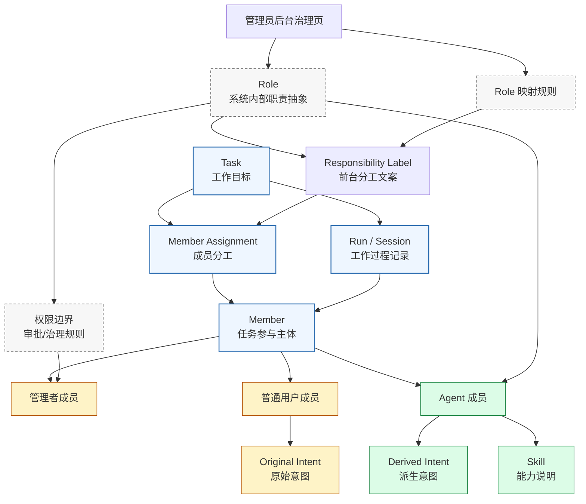
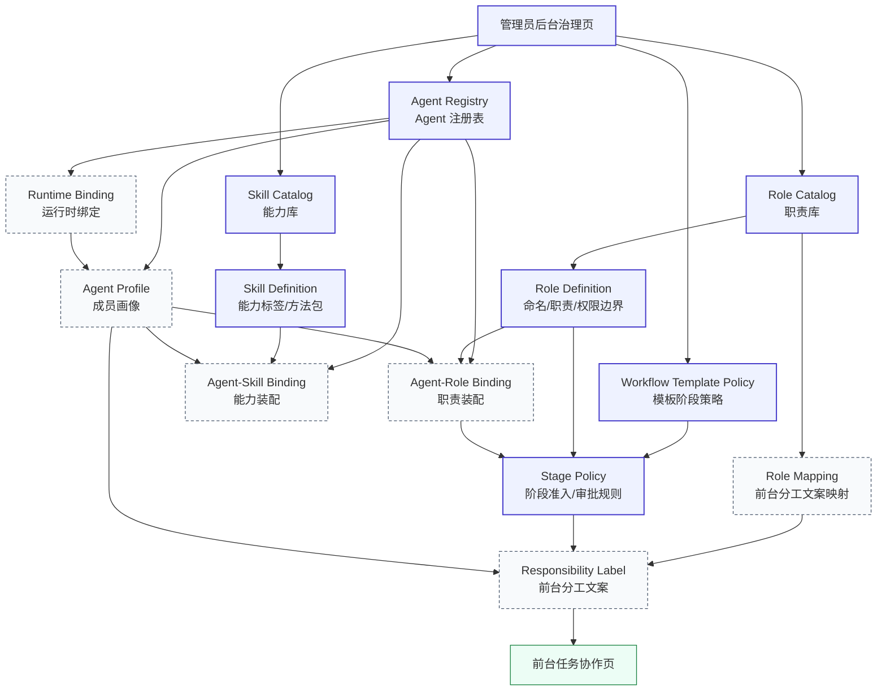
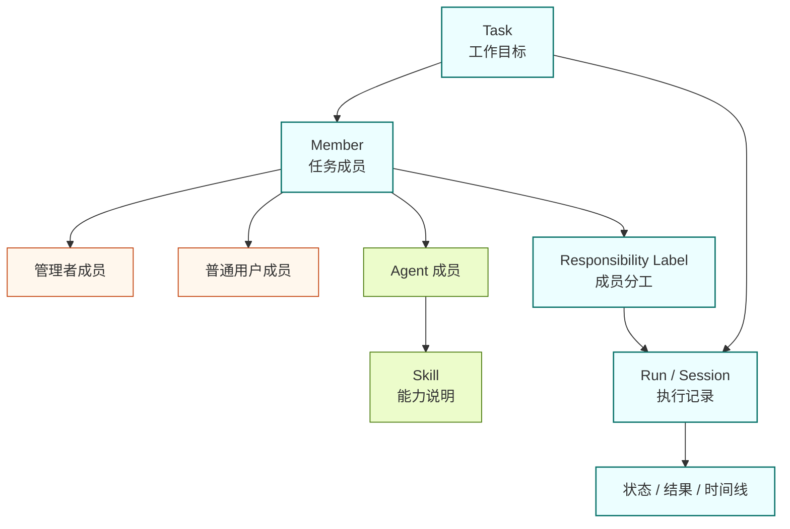

# Agent 成员模型讨论收敛记录

> 适用范围：OpenerX 产品概念收敛、对象模型讨论、前台心智统一
>
> 目标：把本轮关于任务、成员、Agent、Skill、Role、普通用户、管理者及前台产品模型的连续讨论整理成一份独立文档，供后续产品、前端、后端与治理设计统一参考

## 1. 文档定位

本文档不是新的实现规范，也不是最终技术清单。

它的作用是把一整轮概念讨论沉淀成一份可复用的讨论记录，回答以下问题：

- 任务与 Agent 应该如何区分
- Agent 与 Role 的关系是什么
- Role 是否有必要保留
- Skill、Role、Agent 三者各自承担什么语义
- 用户、普通成员、管理者、Agent 成员之间如何统一
- 为什么前台应以 Agent 为主，而不是以 Role 为主
- 为什么普通用户成员与 Agent 成员应尽量统一
- 这套讨论最后收敛成什么样的产品模型

相关正式文档：

- [docs/organization-oriented-agent-operating-model.md](docs/organization-oriented-agent-operating-model.md)
- [docs/organization-oriented-agent-frontend-information-architecture.md](docs/organization-oriented-agent-frontend-information-architecture.md)
- [docs/organization-oriented-agent-technical-checklist.md](docs/organization-oriented-agent-technical-checklist.md)
- [docs/development-role-agents-plan.md](docs/development-role-agents-plan.md)
- [docs/boss-agent-design.md](docs/boss-agent-design.md)（历史文档）

## 2. 讨论起点：任务没有问题，Agent 才是概念冲突点

本轮讨论的起点是：

- 任务这个概念本身没有问题
- 真正不稳定的是 Agent 概念

任务已经相对清楚，它回答的是：

- 要做什么
- 为什么做
- 做到什么算完成
- 当前推进状态是什么

而 Agent 在旧讨论中同时被理解为：

- 岗位成员
- 运行时执行体
- 某个模型配置
- 某次执行记录
- 某类流程节点

这导致 Agent 语义过载。

因此整个讨论的核心工作，是把 Agent 重新收敛成一个稳定的前台产品概念。

## 3. 第一轮结论：Agent 不是任务、不是模型、不是 run

第一轮讨论达成的核心结论是：

Agent 最适合被定义为：

> 完成任务时可被长期信任、可被持续调用、可被评价表现的工作成员。

也就是说：

- 任务回答“做什么”
- Agent 回答“谁来做”
- Run 回答“这一次是怎么做的”

这一步的意义在于把 Agent 从下面这些概念中剥离出来：

1. 不是任务本身
2. 不是 Skill 本身
3. 不是 runtime agent name
4. 不是某个 Hook 节点
5. 不是一次执行记录

## 4. 第二轮结论：Agent 与 Role 的区别

当继续讨论 Agent 与 Role 时，结论逐渐变得更清楚：

- Role 定义职责
- Agent 定义承担职责的主体

更准确地说：

- Role 是职责槽位
- Agent 是具体上岗的成员

举例：

- `developer` 是 Role
- “开发 Agent Alpha” 是 Agent

同一个 Role 下可以有多个 Agent。

因此，Role 与 Agent 的区别不在于技术能力强弱，而在于：

- Role 解决“该由谁负责什么”
- Agent 解决“当前由哪个成员以什么方式来承担这个职责”

还需要进一步强调：

- Role 不定义成员是谁
- Role 不直接定义成员拥有什么能力
- Role 主要定义成员在当前组织与任务上下文中，被允许承担什么责任、进入哪些环节、触发哪些动作、使用哪些权限范围

换句话说：

- Agent 是成员主体
- Skill 是能力说明
- Role 是责任边界与权限约束

所以，Role 限制的不是“成员身份”，而是“成员可行动作、可参与阶段、可调用能力范围与责任归属”。

## 5. 第三轮结论：Role 不应成为前台主概念

虽然 Role 在系统内是有价值的，但继续讨论后形成的结论是：

Role 可以保留，但不应成为用户必须先理解的前台主概念。

原因有三点：

1. 对用户来说，先理解 Agent 比先理解 Role 更自然。
2. 如果前台过早暴露 Role，产品会退化成“组织结构配置系统”。
3. 用户真正关心的是“谁在参与、谁擅长什么、谁正在做什么”，而不是“内部职责抽象是否严整”。

因此收敛后的建议是：

- 前台以 Agent 为主
- Skill 作为 Agent 的能力说明
- Role 退到系统内部，主要服务于治理、编排、权限和统计

进一步收敛后，还增加了一条明确约束：

- Role 的建立、命名、权限边界和适用范围，应由管理员在后台治理页面决定
- 前台普通成员不直接创建 Role，也不直接编辑 Role

## 6. 第四轮结论：Skill、Role、Agent 的关系

在进一步讨论 Skill 时，得到了三者之间更稳定的划分：

### 6.1 Skill

Skill 回答：

- 会什么
- 擅长什么
- 能处理什么问题

Skill 更像：

- 能力模块
- 方法论包
- 知识包
- 作业规范

### 6.2 Role

Role 回答：

- 该负责什么
- 在流程里承担什么责任
- 哪些权限和审批要求与此职责位绑定

Role 更像：

- 职责位
- 责任模板
- 组织里的岗位槽位

### 6.3 Agent

Agent 回答：

- 谁在承担这个职责
- 这个成员携带哪些 Skill
- 它如何工作、如何协作、如何被治理

Agent 更像：

- 可持续参与任务的成员
- 被系统调度的工作主体
- 可被评价表现和可靠性的协作单元

进一步压缩成一句：

- Skill 是能力
- Role 是职责
- Agent 是成员

## 7. 第五轮结论：Role 是否可以删除

接着讨论了一个关键问题：

如果前台以 Agent 为主，那 Role 是否可以完全删除，只保留 Agent 与 Skill。

收敛后的结论是：

1. 如果产品是单 Agent 为主、用户直接选 Agent 处理任务，可以弱化甚至删除前台 Role。
2. 但如果系统要做模板、审批、分工、多人协作、统计、责任替换，系统内部最好保留 Role。
3. 最优解不是“删除 Role”，而是“弱化 Role 的前台存在感”。

也就是说：

- 前台主要让用户看到 Agent 与 Skill
- 系统内部继续保留 Role 作为责任抽象

## 8. 第六轮结论：用户是否也应该被看作 Agent

继续往前推后，问题变成：

- 用户
- Agent
- Role

三者之间到底是什么关系。

讨论中一个重要转折点是：

从系统抽象上，用户与 Agent 都是“任务参与者”；
但从产品上，不建议直接把用户叫成 Agent。

这一步形成了一个中间结论：

- 产品层：不要把用户直接当普通 Agent
- 系统层：可以把用户与 Agent 都看作同一上层对象

于是出现了统一抽象：成员或参与者。

## 9. 第七轮结论：成员统一模型

随后讨论进一步收敛成：

前台不再优先区分“人”和“Agent”，而优先统一成“成员”。

成员分为：

1. 管理者成员
2. 普通用户成员
3. Agent 成员

这样做的价值是：

- 统一任务成员列表
- 统一任务分工
- 统一消息流
- 统一时间线
- 统一协作动作
- 统一活动状态

这一步是整个讨论里非常关键的收敛点。

## 10. 第八轮结论：管理者、普通用户、Agent 成员如何区分

当管理者被单独拿出来后，进一步讨论形成了下面的划分：

### 10.1 管理者成员

管理者成员负责：

- 授权
- 监督
- 审批
- 最终责任兜底

### 10.2 普通用户成员

普通用户成员负责：

- 提出原始意图
- 补充业务上下文
- 参与任务协作
- 提供反馈与确认

### 10.3 Agent 成员

Agent 成员负责：

- 承接派生意图
- 自动分析
- 自动实施
- 自动审查
- 自动推进任务

这一轮讨论的结论是：

普通用户成员与 Agent 成员的关键区别不是“谁更聪明”，而是：

- 普通用户成员拥有真实业务意图与上下文
- Agent 成员拥有被授权的执行能力与自动化能力

## 11. 第九轮结论：普通用户成员与 Agent 成员应尽量一致

继续推进后，又形成了一个更强的产品原则：

> 除意图来源与身份来源外，普通用户成员与 Agent 成员应在任务协作模型中尽量一致。

这是整个讨论里最重要的结论之一。

这意味着：

- 普通用户成员可以像 Agent 成员一样出现在成员列表中
- 两者都可以承担分工
- 两者都可以有任务活动记录
- 两者都可以出现在时间线中
- 两者都可以参与协作与交接

两者只保留两个底层差异：

1. `identitySource`
   - human
   - agent

2. `intentSource`
   - original
   - derived

如果再加一条弱差异，可以保留：

3. 默认工作模式
   - 普通用户成员更偏 `interactive`
   - Agent 成员更偏 `automated`

但在前台层面，连这条都可以弱化。

## 12. 第十轮结论：最终前台产品模型

在完成以上讨论后，最终收敛出的前台产品模型是：

1. Task
2. Member
3. Agent
4. Skill
5. Run / Session

其中：

- Task：工作目标
- Member：统一任务参与主体
- Agent：成员中的自动化成员
- Skill：成员能力说明
- Run / Session：某个成员在任务中的一次工作过程

Role 不再是前台主概念，而退到系统内部。

## 13. 最终统一关系

把整轮讨论压缩成最简关系，可以写成：

### 13.1 任务与成员

- 任务是工作目标
- 成员是任务参与主体

### 13.2 成员与 Agent

- Agent 是成员中的自动化成员
- 用户成员与 Agent 成员在协作模型上尽量统一

### 13.3 Skill 与 Agent

- Skill 是 Agent 的能力说明，不是主体本身

### 13.4 Role 与 Agent

- Role 是系统内部职责抽象
- Agent 是当前承担这些职责的成员
- Role 由管理员在后台页面建立和维护

### 13.5 管理者与普通用户

- 管理者成员负责治理
- 普通用户成员负责原始意图与上下文

### 13.6 Agent 与普通用户的核心差异

- 普通用户成员主要产生原始意图
- Agent 成员主要承接和扩展派生意图

除此之外，两者尽量保持一致。

### 13.7 名词关系结构图

这张图表达的是：

- `Task` 是工作目标
- `Member` 是统一参与主体
- `Manager`、`User`、`Agent` 都是成员类型
- `Agent` 携带 `Skill`
- `Role` 是系统内部职责抽象，不直接作为前台主概念
- `Role` 由管理员在后台治理页建立，并映射成前台可见的 `Responsibility Label`
- 前台任务协作真正消费的是 `Member Assignment`，而不是原始 `Role`
- `Run / Session` 记录的是成员在任务中的工作过程
- 普通用户成员更接近 `Original Intent`，Agent 成员更接近 `Derived Intent`

### 13.8 后台治理图

这张图表达的是：

- 后台治理的起点是管理员
- 管理员维护三类核心库：`Role Catalog`、`Skill Catalog`、`Agent Registry`
- `Role Definition` 定义职责、权限边界和适用范围
- `Skill Definition` 定义能力标签和方法包
- `Agent Profile` 是 Agent 的后台画像对象
- `Agent-Role Binding` 和 `Agent-Skill Binding` 决定某个 Agent 被装配成什么样
- `Runtime Binding` 决定 Agent 最终如何连接到底层执行环境
- `Workflow Template Policy` 与 `Stage Policy` 决定模板阶段需要哪些职责位和审批规则
- `Role Mapping` 把后台 Role 映射为前台可读的“分工文案”
- 前台最终消费的是 `Responsibility Label`，而不是原始后台 Role 结构

### 13.9 前台视角图

这张图只保留用户在前台直接能理解和能看到的对象：

- `Task`：工作目标
- `Member`：任务成员
- `Agent`：成员中的自动化成员
- `Skill`：Agent 的能力说明
- `Run / Session`：执行记录

它刻意不画后台对象，例如：

- `Role`
- `Role Mapping`
- `Template Policy`
- `Runtime Binding`

因为这些都不属于前台用户需要直接理解的对象。

因此，前台用户默认看到的是：

- 任务是什么
- 谁在参与
- 哪些参与者是 Agent
- 这些 Agent 擅长什么
- 当前执行记录是什么
- 每个成员当前负责什么

## 14. 讨论形成的最终产品原则

经过整轮讨论，最终形成的产品原则如下：

1. 前台必须以任务和成员为中心。
2. 前台必须以 Agent 为主，而不是以 Role 为主。
3. Skill 是成员能力说明，不是任务主体。
4. Role 可以保留，但默认内收，不作为前台必须理解的主概念。
5. Role 的建立与维护属于管理员后台治理职责，而不是前台协作动作。
6. 管理者成员、普通用户成员、Agent 成员统一归入成员体系。
7. 普通用户成员与 Agent 成员除意图来源与身份来源外尽量一致。
8. Run / Session 是工作过程，不应再与 Agent 主体混淆。

## 15. 对应到正式方案的结果

本轮讨论最终已经收敛成正式方案文档，见：

- [docs/organization-oriented-agent-operating-model.md](docs/organization-oriented-agent-operating-model.md)

可以把本文档理解为：

- 这份文档：讨论收敛过程记录
- 主方案文档：收敛后的正式产品表达

## 16. 总结

本轮讨论最重要的价值，不是继续发明更多概念，而是把原本混杂的几个对象彻底拉开：

- 任务不是 Agent
- Agent 不是 Skill
- Skill 不是 Role
- Role 不是前台主概念
- 普通用户成员不是弱化版管理者
- 普通用户成员也不需要被直接命名成 Agent
- 但普通用户成员与 Agent 成员在前台协作模型中应尽量统一

最终收敛后的产品心智是：

- 任务是工作目标
- 成员是参与主体
- Agent 是系统里的自动化成员
- Skill 是成员能力说明
- 管理者成员负责治理
- 普通用户成员提供原始意图与上下文
- Role 退到系统内部

## 17. 当前补充结论：不再单独存在老板层

在上述讨论收敛后，又进一步确认了一条更强的产品约束：

1. 不再单独存在“老板层”。
2. 所谓“老板”在产品上直接并入管理员体系。
3. 原先归到“老板 Agent”或“老板经营层”的职责，应收回为管理员成员的治理与经营职责。

这意味着：

- 不再把老板作为单独一层产品角色
- 不再把老板经营视图作为独立前台层级
- 任务经营、审批兜底、升级处理等能力统一放在管理员成员侧表达

在这一修正后，前台成员关系进一步简化为：

- 管理者成员
- 普通用户成员
- Agent 成员

其中：

- 管理者成员同时承担原先讨论中“老板”对应的治理与经营职责
- Agent 成员继续承担自动化执行与协作职责
- 普通用户成员继续承担原始意图和业务上下文职责

因此，后续若遇到“老板 Agent”“老板经营层”“老板参与方式”等表达，应优先理解为历史讨论阶段的中间概念，而不是当前最终产品模型中的正式对象。

如果后续需要继续推进实现，应优先以正式方案文档为准，再把对象模型映射到技术清单、前端信息架构和数据结构中。