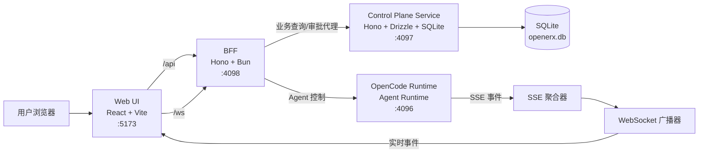

# OpenerX 当前系统架构说明

## 1. 文档目的

本文档面向产品、研发、测试和运维团队，描述当前 OpenerX 控制平面的实际系统架构。内容基于当前代码实现整理，重点回答三个问题：

- 系统由哪些组件组成
- 组件之间如何协作
- 当前架构的已知问题和后续演进方向是什么

本文档描述的是“当前实现”，不是目标蓝图。

相关补充文档：

- [OpenCode 关注边界说明](./opencode-focus-boundary.md)
- [运行架构图](./runtime-process-architecture.md)

## 2. 系统定位

OpenerX 当前实现是一个面向 AI Agent 任务执行的控制平面系统。它的职责不是直接承载所有智能体执行逻辑，而是围绕任务执行提供以下能力：

- 用户登录与访问控制
- 项目、环境、用户、策略等控制面配置管理
- 审批、审计、成本、预算等治理能力
- 面向前端的任务视图、Agent 控制和实时事件聚合
- 对外部 OpenCode Runtime 的适配与控制

从职责边界看，系统由“控制平面服务 + 前端聚合层 + Web UI + 外部运行时”四部分组成。

关于 OpenCode 能力边界，需要单独强调：当前系统关注的是 OpenCode Runtime 接入、协议稳定性以及插件生态兼容性，而不是 OpenCode 桌面端产品能力，详见 [OpenCode 关注边界说明](./opencode-focus-boundary.md)。

## 3. 逻辑分层

### 3.1 Web UI

Web UI 是一个 React 单页应用，负责提供登录、仪表盘、任务详情、审批处理和 Agent 控制界面。

- 技术栈：React 19、React Router、Zustand、Vite
- 主要职责：页面渲染、用户交互、登录态维护、实时事件展示
- 开发态端口：5173

前端默认不直接访问控制平面服务，而是通过 `/api` 和 `/ws` 访问 BFF。

### 3.2 BFF 聚合层

BFF 是面向前端的后端聚合层，承担统一鉴权校验、接口转发、数据适配、实时事件聚合和 Agent 控制封装。

- 技术栈：Bun、Hono
- 默认端口：4098
- 主要职责：
  - 代理认证接口（login/refresh/me），转发至控制平面服务
  - 校验前端 JWT
  - 将任务、审批等查询代理到控制平面服务
  - 对接 OpenCode Runtime，执行暂停、恢复、注入指导、终止等控制动作
  - 将 OpenCode Runtime 的 SSE 事件转为系统统一事件，并通过 WebSocket 推送给前端
  - WebSocket 连接建立时验证 JWT，绑定用户身份与项目范围
  - 通过 `cpFetch` 统一回源控制平面服务，带 requestId 透传与日志

这层的角色是“前端统一入口 + 运行时适配器”，不承载业务主数据存储。

### 3.3 控制平面服务

控制平面服务是系统的业务核心与数据主服务，负责主数据管理和治理能力落库。

- 技术栈：Bun、Hono、Drizzle ORM、SQLite
- 默认端口：4097
- 主要职责：
  - 登录认证与 JWT 签发
  - 组织、项目、环境、用户、策略等主数据管理
  - 审批单管理
  - 审计事件记录与查询
  - 成本与预算配置管理

它是当前系统中最接近“系统记录源”的一层。

### 3.4 OpenCode Runtime

OpenCode Runtime 是外部运行时，不属于当前仓库的控制平面核心代码，但从当前实现看，它是 Agent 会话执行、消息处理和部分任务状态来源。

- 默认地址：4096
- 主要职责：
  - 管理 agent/session 生命周期
  - 提供消息发送与中断能力
  - 输出 SSE 事件流

当前系统与 OpenCode Runtime 的关系是“控制平面治理 + 运行时执行”分离。

## 4. 运行时组件关系

## 5. 核心模块划分

### 5.1 控制平面服务模块

控制平面服务当前已聚合以下模块：

- auth：登录、刷新 token、获取当前用户
- orgs：组织管理
- projects：项目管理
- envs：环境管理
- users：用户管理
- policies：策略模板管理
- audit：审计事件查询
- cost：成本数据与预算视图
- approvals：审批单查询与处理

这些模块通过统一 Hono 路由挂载到 `/api/*` 下，构成控制平面的主业务 API。

### 5.2 BFF 模块

BFF 当前主要包含五类能力：

- realtime：实时状态、会话订阅、事件广播、DAG 同步触发
- agent-control：暂停、恢复、注入指导、终止、消息读取、session 续跑
- tasks：面向前端的任务视图聚合、graph 同步、pipeline 查询、session 历史
- config：Agent/Skill/Command/Model/MCP/插件生命周期/编排策略/恢复策略配置管理
- approvals：审批代理与响应透传

其中 tasks 和 approvals 更偏向业务代理；realtime 和 agent-control 更偏向运行时适配；config 提供运行时配置的 UI 治理入口。

### 5.3 前端页面与状态模块

前端当前主要包含：

- Login：登录页
- Dashboard：仪表盘，展示任务、审批和事件流
- TaskDetail：任务详情页，展示任务图（DAG 可视化）、Agent 控制台、编排决策、规划流水线、会话历史和任务事件
- Settings：配置页（模型、Agent、Skill、命令、MCP 服务、安全基线、插件生命周期、编排策略、恢复策略）

状态管理拆分为：

- auth store：登录态与用户信息持久化
- realtime store：WebSocket 长连接、事件缓存和订阅管理

## 6. 数据模型概览

SQLite 中当前的核心表包括：

**治理元数据**：
- organizations：组织
- projects：项目
- environments：环境
- users：用户
- project_roles：项目级角色
- sessions：运行会话映射
- policy_templates：策略模板
- audit_events：审计事件
- cost_records：成本记录
- approval_tickets：审批单
- budget_configs：预算配置

**任务编排模型**（运行时 DAG 镜像）：
- task_nodes：DAG 任务节点（对齐 task-graph-plugin 的 TaskNode 字段）
- task_edges：DAG 依赖边（blocks / informs）
- agent_runs：Agent 执行记录
- plugins：插件元数据与生命周期状态
- tasks 表新增 category（意图分类）和 strategy（编排策略）字段

模型设计覆盖"治理侧元数据与追踪"和"运行时编排穿透"两个方向。详见 [oh-my-openagent 实现说明](./oh-my-openagent-implementation.md)。

## 7. 关键业务链路

### 7.1 登录与鉴权链路

1. 用户在 Web UI 发起登录。
2. 请求经 BFF `/api/auth/login` 转发至控制平面服务。
3. 控制平面服务校验用户名密码并签发 JWT。
4. BFF 透传 JWT 给前端，前端持久化 token 和用户信息。
5. 后续前端请求统一带 Bearer Token。
6. BFF 和控制平面服务都基于相同密钥校验 JWT。

当前实现中，JWT 是共享密钥自校验模式。前端所有认证请求统一走 BFF，认证链路已闭合。

### 7.2 任务查询链路

1. 前端请求 BFF 的任务接口。
2. BFF 将请求转发到控制平面服务的审计接口。
3. BFF 把返回结果整理为前端使用的数据结构。
4. 前端再结合实时事件流展示任务状态。

这说明当前“任务视图”相当大程度上是从审计事件反推出来的，而不是由独立任务域模型直接提供。

### 7.3 实时事件链路

1. OpenCode Runtime 输出 SSE 事件。
2. BFF 中的 SSE 聚合器订阅运行时事件。
3. 事件被转换为统一的 `RealtimeEvent`。
4. WebSocket 广播器把事件按任务或项目范围分发给前端。
5. 前端将事件写入本地状态，用于仪表盘和任务页渲染。

当前前端对任务活动、Agent 活动、事件流的展示高度依赖该实时链路。

### 7.4 审批治理链路

1. 某些高风险动作触发审批单创建。
2. 审批单由控制平面服务持久化。
3. 前端通过 BFF 查询待审批列表。
4. 审批人执行批准或拒绝。
5. 控制平面服务更新审批单状态并记录审计事件。

这条链路体现了系统当前的治理核心定位。

## 8. 部署拓扑

当前仓库中已经提供 VM 部署配置，说明预期生产形态是：

- Nginx 作为入口
- Web UI 静态文件由 Nginx 直接提供
- `/api` 与 `/ws` 统一转发到 BFF
- BFF 再回源控制平面服务或连接 OpenCode Runtime
- 控制平面服务与 BFF 以 systemd 服务运行

这意味着外部访问入口只有一个，前端无需感知后端内部拆分。

## 9. 当前架构判断

从代码实现看，当前系统已经从纯治理侧控制面向"运行时穿透"方向演进：

- 治理能力（审批、审计、成本、策略）已成熟
- 运行时 DAG 穿透已实现（task-graph-plugin → dag-sync → SQLite 镜像）
- 编排可视化已落地（意图分类、规划流水线、编排决策面板）
- 插件生命周期控制面已闭合（启用/禁用/安装/卸载/兼容性检查）
- 连续执行机制已暴露到 UI（session 历史、续跑、恢复策略）
- BFF 和控制平面边界已形成，职责划分清晰

因此，当前架构可定义为：

> 一个以审批、审计、成本为治理内核，以运行时 DAG 穿透、编排可视化和插件治理为编排内核的 AI Agent 控制平面系统。

详细的运行时穿透能力实现，见 [oh-my-openagent 实现说明](./oh-my-openagent-implementation.md)。

## 10. 现状问题清单

### 10.1 ✅ 认证入口边界已闭合

BFF 已增加 `/api/auth/login`、`/api/auth/refresh`、`/api/auth/me` 代理路由，统一转发至控制平面服务。前端无直连控制平面服务的残留。

### 10.2 ✅ BFF 与控制平面职责边界已明确

BFF 的职责已收缩为：

- 认证代理（转发控制平面）
- 前端聚合查询（任务、审批）
- 运行时控制（agent pause/resume/terminate/guidance）
- 实时事件聚合与广播

控制平面服务的职责为：

- 认证与 JWT 签发
- 主数据管理（组织、项目、环境、用户、策略）
- 审批、审计、成本、预算

所有回源调用通过 `cpFetch` 统一封装，带 requestId 透传。

### 10.3 任务域模型不够独立

当前任务接口主要通过审计事件查询来构造任务列表和任务详情。这种方式能快速跑通展示，但存在几个问题：

- 任务状态语义不稳定
- 查询性能会随着审计数据增长变差
- 前端需要自行推导较多展示状态
- “任务事实”和“任务日志”被混在一起

长期看，任务应当具备独立存储与查询模型。

### 10.4 ✅ 实时链路已绑定用户上下文

WebSocket 连接建立时已验证 JWT，绑定 userId 和项目范围。无效 token 的连接会被拒绝（close 4401）。事件广播按项目和任务订阅进行过滤，`subscribe_task` 指令包含项目级权限校验。

### 10.5 ✅ 运行时状态已建立控制面镜像

运行时 DAG 状态通过 dag-sync 机制同步到控制面数据库（task_nodes、task_edges、agent_runs），节点状态集与 task-graph-plugin 保持一致。意图分类和编排策略通过 tasks.category/strategy 字段持久化。

仍需注意：实时事件与 DB 镜像之间可能存在短暂不一致窗口，前端采用"API 主数据 + 实时事件增量"策略降低影响。

### 10.6 持久化层仍以 SQLite 为主

SQLite 适合当前原型和单机部署，但如果进入多人协作、长时间运行和高频审计写入场景，会逐步暴露限制：

- 并发写入能力有限
- 运营与备份策略受限
- 面向报表与分析的扩展性较弱

### 10.7 审批、预算、策略尚未与编排内核完全打通

从现有模型看，这些治理能力已经建模，但与真实运行时编排过程之间更像“旁路集成”，而不是“内核约束”。

这意味着系统已经能记录和展示治理事件，但未必已经实现治理规则对运行时的强约束闭环。

## 11. 改进建议

### 11.1 先修复认证入口闭环

短期优先级最高的动作是统一前端认证入口。

建议二选一：

- 方案 A：在 BFF 增加 `/api/auth/*` 路由，并转发到控制平面服务
- 方案 B：将前端认证接口改为直连控制平面服务，但这会破坏“前端仅访问 BFF”的一致性

从整体架构一致性看，更推荐方案 A。

### 11.2 明确 BFF 与控制平面的边界

建议形成一个明确原则：

- 控制平面服务负责主数据、策略、审批、审计、成本等系统记录源
- BFF 只面向前端暴露聚合接口、实时接口和运行时控制接口
- 前端不再直接感知控制平面服务存在

这样可以避免路由分散和权限口径不一致。

### 11.3 为任务建立独立领域模型

建议新增独立任务域对象与持久化结构，例如：

- tasks
- task_nodes
- agent_runs
- task_transitions

审计事件继续保留为日志和合规记录，但不再承担主查询职责。

### 11.4 统一状态源与状态同步策略

建议定义清楚：

- 运行时负责什么状态
- 控制平面负责什么状态
- 哪些状态需要回写落库
- 前端页面应以哪个接口或事件作为最终准信号

如果不建立统一规则，后续会越来越依赖前端推导状态，复杂度会快速上升。

### 11.5 加强实时通道的鉴权与隔离

建议在 WebSocket 建链和订阅时显式绑定：

- 用户身份
- 项目范围
- 租户范围
- 订阅资源范围

同时增加服务端订阅校验，不应只依赖前端传递 taskId。

### 11.6 为治理能力建立强约束闭环

建议把以下判断前置到真正的执行流程中，而不是仅记录结果：

- 高风险动作必须审批
- 预算超阈值必须阻断或降级
- 策略模板必须在运行前展开并注入执行上下文

这样系统才能从“事后审计”升级到“事中治理”。

### 11.7 预留数据库演进路径

短期仍可继续使用 SQLite，但建议尽早保证以下抽象稳定：

- ORM schema
- 数据访问层边界
- 迁移脚本规范
- 备份恢复流程

这样未来迁移到 PostgreSQL 时成本会显著降低。

## 12. 推荐的下一阶段架构目标

如果按当前代码继续演进，比较合理的下一阶段目标是：

1. 前端仅访问 BFF，补齐 auth 聚合接口。
2. 控制平面服务成为唯一主数据与治理记录源。
3. BFF 成为唯一前端聚合入口和运行时适配层。
4. 任务、节点、Agent Run 建立独立模型，不再依赖审计事件反推。
5. 审批、预算、策略从“展示型治理”升级为“执行前强约束治理”。

达到这一阶段后，系统会从“可演示原型”更接近“可持续演进的控制平面”。

## 13. 总结

当前 OpenerX 已经具备一个 AI 控制平面的关键骨架：

- 有明确的前后端分层
- 有治理能力模型
- 有运行时适配能力
- 有实时事件展示链路

但它仍处在从原型走向稳定平台的中间阶段。最关键的工作不是继续堆叠页面，而是先把认证边界、任务模型、状态一致性和治理闭环四个基础面收紧。

这四项做好之后，系统才能稳定承载更复杂的 Agent 编排和更严格的治理要求。