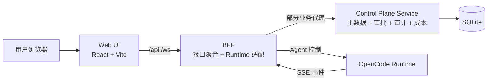
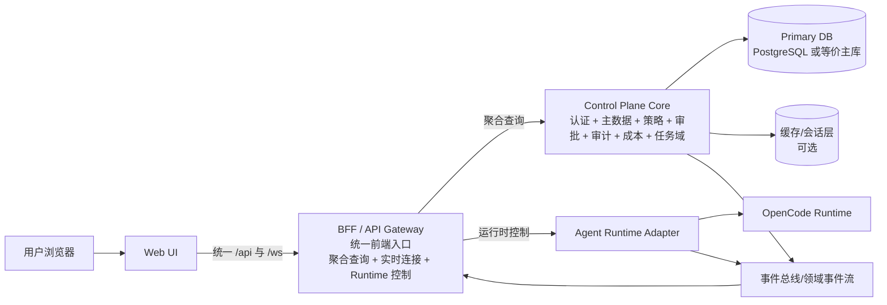
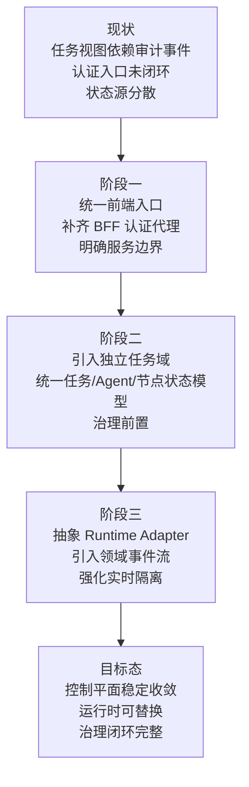

# OpenerX 目标架构演进图

## 1. 文档目的

本文档用于说明 OpenerX 从当前实现演进到目标架构的方向，重点回答三个问题：

- 当前架构卡在哪里
- 目标架构希望收敛成什么形态
- 需要按什么顺序推进演进

这份文档适合用于架构评审、阶段规划和团队同步。

相关补充文档：

- [OpenCode 关注边界说明](./opencode-focus-boundary.md)

## 2. 演进原则

目标架构不是简单增加更多服务，而是先把边界收紧，再把能力做实。演进原则如下：

- 前端只连一个统一入口
- 控制平面成为唯一治理与主数据记录源
- BFF 成为唯一前端聚合与运行时适配层
- 任务域从审计日志中独立出来
- 审批、预算、策略从事后记录升级为事前约束
- 实时链路按用户、项目、任务范围做严格隔离

其中，OpenCode 相关能力边界采用单独文档管理：OpenerX 关注 OpenCode 作为运行时与插件生态底座的能力，不以桌面产品形态建设为目标，详见 [OpenCode 关注边界说明](./opencode-focus-boundary.md)。

## 3. 当前架构图

### 当前架构特点

- 前端访问入口基本统一到 BFF
- 控制平面已承载治理相关核心能力
- BFF 已承担运行时适配职责
- 任务视图仍较多依赖审计事件反推
- 认证入口和状态源仍未完全收敛

## 4. 目标架构图

### 目标架构特点

- Web UI 只访问 BFF，不再感知后端内部拆分
- BFF 只承担聚合、适配和前端友好协议，不承载主业务事实存储
- 控制平面核心统一承载认证、任务、审批、审计、成本和策略
- 运行时通过独立适配层接入，避免前端或控制平面直接绑定某一运行时实现
- 领域事件流成为实时推送和状态同步的标准通道
- 持久化层升级为适合多人协作和高频写入的主库

## 5. 现状到目标态的关键变化

## 6. 建议的分阶段演进路线

### 阶段一：边界收敛

目标：先把系统入口和职责边界收紧，不再继续扩大模糊区域。

建议动作：

- 在 BFF 增加 `/api/auth/*`，补齐认证闭环
- 明确“前端只能访问 BFF”的约束
- 约定控制平面只提供主数据和治理事实接口
- 约定 BFF 只提供前端聚合与运行时适配接口
- 为接口划分增加文档和命名规范

阶段结果：

- 架构边界对团队变得清晰
- 登录、业务查询、实时连接统一从 BFF 进入
- 后续重构不会继续扩大耦合面

## 7. 阶段二：任务域独立

目标：把任务相关事实从审计日志中剥离出来，建立明确的任务主模型。

建议动作：

- 新增任务域模型，如 tasks、task_nodes、agent_runs
- 将任务状态、节点状态、Agent Run 状态定义为显式状态机
- 审计事件仅承担追踪和合规职责
- 前端任务页优先从任务域接口读取，不再主要依赖日志拼装

阶段结果：

- 任务查询语义清晰
- 页面状态展示更稳定
- 审计与业务主模型职责分离

## 8. 阶段三：治理前置化

目标：让审批、预算和策略成为执行前约束，而不是执行后记录。

建议动作：

- 在执行前显式校验策略模板
- 在高风险动作前强制审批
- 在预算超阈值时阻断、限流或降级
- 把治理结果与任务状态机联动

阶段结果：

- 系统从“事后可见”升级为“事中可控”
- 治理能力真正进入执行链路

## 9. 阶段四：运行时解耦与事件化

目标：降低对单一运行时实现的耦合，并建立稳定的状态同步机制。

建议动作：

- 将 OpenCode 对接逻辑封装为标准 Runtime Adapter
- 明确运行时事件到领域事件的映射规范
- 把 BFF 的 WebSocket 推送建立在统一事件流之上
- 对实时订阅增加基于用户、项目、任务的权限隔离

阶段结果：

- 运行时替换和扩展成本下降
- 实时链路更稳定
- 多租户或多项目隔离更可靠

## 10. 推荐的目标能力分布

### Web UI

- 页面交互
- 可视化展示
- 本地轻状态管理
- 不承载业务规则判断

### BFF

- 统一鉴权入口
- 聚合查询模型
- 前端协议适配
- WebSocket/SSE 出口
- Runtime 控制代理

### Control Plane Core

- 用户与认证
- 组织、项目、环境、策略
- 任务与 Agent Run 主模型
- 审批、审计、成本、预算
- 治理规则执行

### Runtime Adapter

- 会话生命周期控制
- 消息与中断控制
- 运行时事件标准化
- 与具体运行时实现隔离

## 11. 一页式汇总结论

目标架构的核心不是“拆更多服务”，而是把现有三层收敛成更稳定的四个职责面：

- Web UI：只负责展示与交互
- BFF：只负责前端入口、聚合和适配
- Control Plane Core：只负责业务事实与治理规则
- Runtime Adapter：只负责连接外部 Agent Runtime

如果按这个方向推进，OpenerX 会从当前的原型控制平面，逐步演进为一个可持续扩展、治理闭环清晰、运行时可替换的 AI 控制平台。