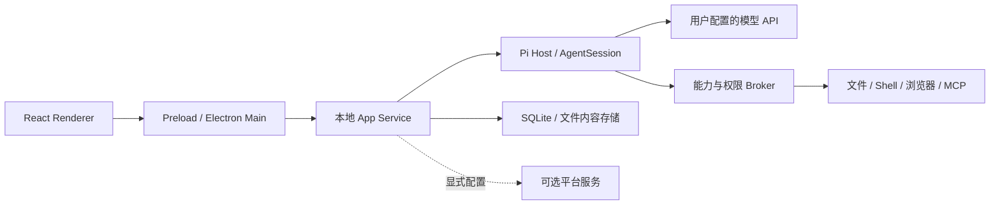

# 架构说明

openerx 使用 Electron、React、TypeScript 与 Vite。Pi 提供 AgentSession 及模型执行循环，应用负责产品状态、工具权限和桌面集成。

## 模块职责

| 路径 | 职责 |
| --- | --- |
| `apps/desktop` | Electron Main、Preload、React Renderer、原生集成及打包。 |
| `packages/app-service` | 对话、项目、文件、模型、工具和自动化的本地业务编排。 |
| `packages/contracts` | 进程协议、数据校验和公共类型。 |
| `packages/pi-host` | Pi AgentSession 宿主、模型适配与工具事件转换。 |
| `packages/tool-sdk` | 能力、权限策略、各类工具适配器。 |
| `packages/storage` | SQLite 迁移、业务仓储与本地状态。 |
| `packages/file-service` | 文件内容、附件与成果处理。 |
| `packages/skills` | Skill 资源、生命周期和内置资源快照。 |
| `packages/remote-host`、`packages/remote-protocol` | 桌面远程宿主与协议。 |
| `packages/release` | 更新清单、版本及发布验证。 |
| `services` | 可选身份、同步、模型网关、计费及远程服务。 |
| `apps/mobile` | 可选移动伴随端，不承担本机工具执行。 |

## 数据与权限

Renderer 只能使用受限 Bridge；Main 管理窗口、系统凭据和受监督的子进程。App Service 持有本地业务真值，Pi Host 收到明确的执行上下文，通过 Broker 请求能力。工具输出作为模型上下文返回，业务状态和成果由应用层保存。

默认 BYOK 请求从本机发往所选厂商。平台模式是显式配置的可选路径，不是默认桌面运行的前置条件。远程连接依赖在线桌面执行主机，手机不运行第二套 AgentSession。

跨模块共享代码放在 `packages/`。生产 Pi 依赖集中在 `packages/pi-host`，应用和服务不能直接导入兄弟实现。`check:boundaries:v2` 和 `check:release-graph:v2` 检查这些约束。

安全边界与报告方式见 [安全说明](../SECURITY.md)。
