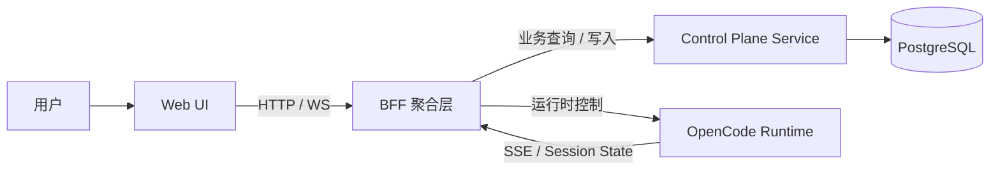
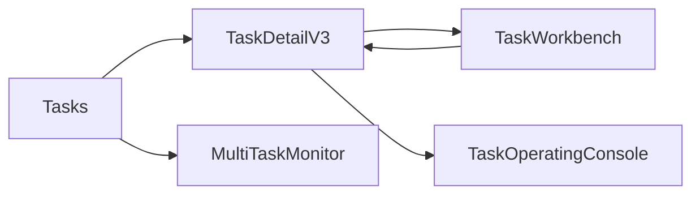
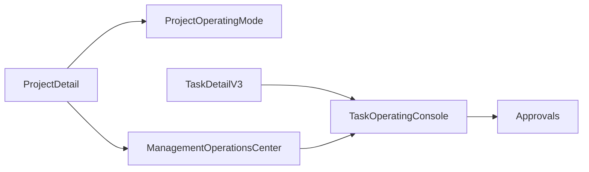
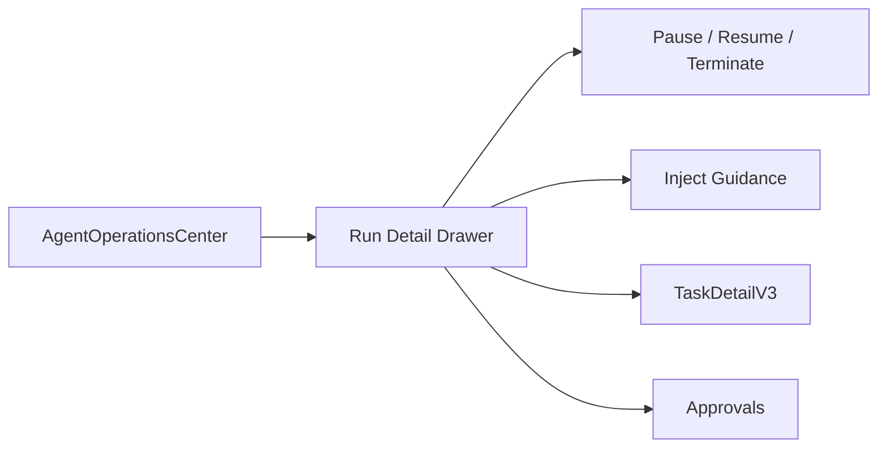

# 成员优先架构设计

> 适用范围：OpenerX 控制平面、BFF、Web UI、外部运行时，以及成员优先模型下的前后台边界设计
>
> 目标：给出一份基于当前有效方案的统一架构设计，作为后续页面重写、接口收敛、命名迁移和模块拆分的架构依据

## 1. 文档定位

本文档不是“当前实现说明”，也不是“纯产品概念说明”。

它解决的是中间层问题：

- 在当前项目已经具备的实现基础上
- 按照成员优先、前后台分层、管理介入替代旧老板层的方向
- 系统整体应该采用什么样的架构边界与模块划分

因此，本文档同时承接三类输入：

- 当前实现现状
- 当前有效产品模型
- 当前已确定的前端重写边界

相关文档：

- [organization-oriented-agent-operating-model.md](organization-oriented-agent-operating-model.md)
- [organization-oriented-agent-frontend-information-architecture.md](organization-oriented-agent-frontend-information-architecture.md)
- [organization-oriented-agent-technical-checklist.md](organization-oriented-agent-technical-checklist.md)
- [member-first-frontend-reimplementation-plan.md](member-first-frontend-reimplementation-plan.md)
- [current-implementation-functional-overview.md](current-implementation-functional-overview.md)

## 2. 架构目标

本轮架构设计的核心目标有五个：

1. 前台心智统一到 `Task / Member / Agent / Skill / Run`
2. `Role` 退到后台治理层，不再成为前台主对象
3. 管理介入替代旧“老板层”命名与建模
4. 保留当前已成熟的任务主链和运行链路
5. 允许前端页面推倒重写，但不要求后端与运行时同时推倒

换句话说，本轮不是重建整套系统，而是重新定义：

- 哪些是前台协作对象
- 哪些是后台治理对象
- 哪些是运行时对象
- 哪些兼容层允许暂时存在

## 3. 架构原则

### 3.1 前后台对象分层

前台只承载用户能直接理解的对象：

- Task
- Member
- Agent
- Skill
- Run / Session
- Management Intervention Result

后台治理层承载内部约束对象：

- Role
- Role Mapping
- Workflow Template Policy
- Stage Policy
- Permission Boundary
- Management Participation Policy

运行时层承载执行对象：

- Runtime Session
- Agent Run
- SSE Event
- Runtime Guidance
- Runtime Control Command

### 3.2 前台不直接消费原始治理结构

前台只展示：

- 成员分工
- 职责说明
- 当前动作
- 执行记录
- 管理介入结果

前台不应直接展示：

- 原始 Role 标识
- Role 绑定结构
- 后台策略对象 JSON
- runtime 内部会话细节作为主心智

### 3.3 页面可以重写，系统主链尽量不断

本轮允许前端页面推倒重写，但后端和运行主链遵循：

- 接口可复用
- 数据模型可逐步迁移
- 旧字段可保留 alias
- BFF 可以承担一段时间的命名适配与 view model 转换

因此，架构上应允许：

- 页面快速切换到新对象模型
- 后端内部在一段时间内继续承载旧命名

### 3.4 `TaskDetailV3` 作为任务主链锚点

当前任务主链应以：

- [../control-plane/web-ui/src/pages/Tasks.vue](../control-plane/web-ui/src/pages/Tasks.vue)
- [../control-plane/web-ui/src/pages/TaskDetailV3.vue](../control-plane/web-ui/src/pages/TaskDetailV3.vue)
- [../control-plane/web-ui/src/pages/TaskWorkbench.vue](../control-plane/web-ui/src/pages/TaskWorkbench.vue)
- [../control-plane/web-ui/src/pages/MultiTaskMonitor.vue](../control-plane/web-ui/src/pages/MultiTaskMonitor.vue)

作为前台协作主轴。

旧 [../control-plane/web-ui/src/pages/TaskDetail.vue](../control-plane/web-ui/src/pages/TaskDetail.vue) 只作为迁移兼容对象存在，不再作为主力任务心智来源。

## 4. 总体架构

这张图下，四层分工应明确如下：

### 4.1 Web UI

Web UI 是用户工作界面，不是系统记录源。

它负责：

- 任务协作页面
- 页面状态与交互
- 将 BFF 返回的数据组织成前台协作视图
- 将管理介入结果、执行记录、任务状态可视化

它不负责：

- 直接拼装后端治理规则
- 直接解释 runtime 原始协议
- 直接维护 Role 等内部对象的真实约束逻辑

### 4.2 BFF 聚合层

BFF 是本轮架构里最关键的过渡层。

它负责：

- 统一前端入口
- 将控制平面服务与运行时的多个数据源聚合成前台 view model
- 做旧字段到新字段的命名映射
- 做任务级 / 项目级 / Agent 级聚合读取
- 负责 WebSocket 广播和 SSE 事件适配

它应重点承担：

- `boss*` -> `management*` 的兼容映射
- 前台 `Task / Member / Agent / Skill / Run` 视图装配
- 运行时对象与前台对象的解耦

### 4.3 控制平面服务

控制平面服务是：

- 主业务数据服务
- 治理配置存储层
- 审批、审计、项目、用户、模板等后台对象的系统记录源

它负责：

- 项目、用户、组织、审批、审计、模板、策略、任务记录等主数据
- 前后台治理对象的持久化
- task-domain projection 和持久化读链

它不应直接承担：

- 前端页面视图拼装
- runtime SSE 面向前端的直接输出

### 4.4 外部运行时

OpenCode Runtime 负责：

- Agent Session 生命周期
- 消息协议
- SSE 事件输出
- 暂停 / 恢复 / 终止 / 指令注入

它是执行层，不是前台主模型来源。

尤其对 `execution trace` 来说：

- Runtime 负责执行与事件
- 对外公开 trace 读链应以 task-domain projection / conversation 持久化为准

## 5. 领域划分

建议当前系统按五个领域理解：

### 5.1 任务协作域

核心对象：

- Task
- Member
- Agent
- Skill
- Run
- Timeline

核心目标：

- 让用户围绕任务协作完成工作

典型页面：

- Tasks
- TaskDetailV3
- TaskWorkbench
- MultiTaskMonitor

### 5.2 管理介入域

核心对象：

- Management Participation Mode
- Management Decision
- Escalation
- Manual Override
- Approval Bridge

核心目标：

- 承载项目级和任务级的治理介入

典型页面：

- TaskOperatingConsole
- ManagementOperationsCenter
- Approvals

### 5.3 治理配置域

核心对象：

- Workflow Template
- Role
- Role Mapping
- Stage Policy
- Model Routing
- Recommendation Profile

核心目标：

- 让管理员定义系统约束，而不是让普通用户理解这些对象

典型页面：

- Settings
- OrganizationOperatingSettings
- RoleGovernanceSettings
- WorkflowTemplatesAdmin
- WorkflowTemplateEditor
- ChatSettings

### 5.4 项目资源域

核心对象：

- Project
- Repository
- Credential
- Member Binding
- Project Policy

核心目标：

- 管理项目资源容器及其附属治理配置

典型页面：

- Projects
- ProjectDetail
- ProjectPolicies

### 5.5 运行处置域

核心对象：

- Agent Run
- Runtime Session
- Queue
- Intervention Action
- Health / Failure / Analytics

核心目标：

- 跨任务观察和处置运行问题

典型页面：

- AgentOperationsCenter

## 6. 前端架构设计

## 6.1 页面分层

前端建议采用四层：

1. 协作层
2. 项目层
3. 治理层
4. 运行处置层

### 协作层

面向普通用户和日常协作者：

- Tasks
- TaskDetailV3
- TaskWorkbench
- MultiTaskMonitor

### 项目层

面向项目资源和项目范围治理：

- Projects
- ProjectDetail
- ProjectPolicies

### 治理层

面向管理员：

- Settings
- OrganizationOperatingSettings
- RoleGovernanceSettings
- WorkflowTemplatesAdmin
- WorkflowTemplateEditor
- ChatSettings

### 运行处置层

面向跨任务观察和管理介入：

- TaskOperatingConsole
- AgentOperationsCenter
- ManagementOperationsCenter
- Approvals

## 6.2 页面保留与重写边界

当前已明确：

### 保留主链页面

- Tasks
- TaskDetailV3
- TaskWorkbench
- MultiTaskMonitor
- ChatSettings

### 待定页面

- Projects
- ProjectDetail
- Users

### 重写页面

- Settings
- OrganizationOperatingSettings
- ProjectOperatingMode
- TaskOperatingConsole
- TaskOperatingOverride
- RecommendedScenarios
- BossOperationsCenter -> ManagementOperationsCenter
- AgentConsolePage -> AgentOperationsCenter
- ProjectOrchestration
- ProjectWorkflowTemplate
- ProjectRoleExecution

## 6.3 前端状态设计

前端状态建议分为三层：

### UI State

仅服务页面本身：

- 面板展开
- tab / drawer / filter
- loading / selection / local draft

### View Model State

由 BFF 返回、面向页面对象模型：

- Task View
- Task Timeline View
- Management Intervention View
- Agent Operations Queue View
- Project Governance View

### Session / Identity State

跨页面共享：

- auth store
- realtime store
- selected project / selected task context

## 7. BFF 架构设计

BFF 是本轮最重要的架构缓冲层，应按聚合职责拆成以下模块：

### 7.1 task-view

负责：

- 任务详情聚合
- 任务 timeline 聚合
- TaskDetailV3 所需视图

### 7.2 task-operations

负责：

- 任务运行档位
- 管理介入记录
- 升级请求
- 任务级覆盖

### 7.3 project-governance

负责：

- 项目运行档位
- 项目模板与治理视图
- 项目级管理介入总览

### 7.4 agent-operations

负责：

- Agent Run 队列聚合
- 运行健康度
- 分析视图
- 暂停 / 恢复 / 终止 / guidance 注入

### 7.5 settings-governance

负责：

- 平台配置
- Role 治理
- 模板治理
- ChatSettings 适配

## 7.2 BFF 映射职责

BFF 应显式承担字段映射：

- `bossParticipationMode` -> `managementParticipationMode`
- `BossDecisionRecord` -> `ManagementDecisionRecord`
- `bossDecisions` -> `managementDecisions`

以及对象映射：

- runtime session -> run view
- internal role binding -> responsibility label view
- template / policy -> readable governance summary

## 8. 控制平面服务架构设计

控制平面服务应继续作为主业务与治理数据层，但要在语义上收敛：

### 8.1 保持主数据职责

继续负责：

- 用户
- 组织
- 项目
- 环境
- 审批
- 审计
- 工作流模板
- 项目配置
- 任务记录

### 8.2 后台治理对象内收

继续保留：

- Role
- Role Mapping
- Policy
- Template
- Approval Rule

但后续不应要求前台直接以这些对象为主视图。

### 8.3 对外读模型分层

建议控制平面服务对外至少区分：

- record model
- governance model
- task projection model

而不是把内部表结构直接暴露给 BFF 或页面。

## 9. 数据与命名迁移设计

## 9.1 命名策略

当前系统允许旧字段存在，但新设计统一采用：

- managementParticipationMode
- managementDecision
- managementIntervention
- agentOperations

旧 `boss*` 命名：

- 只允许存在于兼容层
- 不允许作为新页面主命名
- 不允许继续扩散到新文档与新组件

## 9.2 数据迁移策略

建议分三步：

1. 页面先切 view model 新命名
2. BFF 做字段 alias 映射
3. 后端 / 数据模型再逐步收缩旧命名

## 10. 关键交互链路

### 10.1 任务协作链路

### 10.2 管理介入链路

### 10.3 运行处置链路

## 11. 推荐实施顺序

### Phase 1

先固化前台主链：

- 保持 Tasks / TaskDetailV3 / TaskWorkbench / MultiTaskMonitor / ChatSettings 稳定
- 停止旧 `TaskDetail` 扩张

### Phase 2

重写治理与运行页面：

- Settings
- OrganizationOperatingSettings
- TaskOperatingConsole
- AgentOperationsCenter
- ManagementOperationsCenter

### Phase 3

重写项目治理页面：

- ProjectOperatingMode
- ProjectOrchestration
- ProjectWorkflowTemplate
- ProjectRoleExecution

### Phase 4

收缩兼容层：

- 清理旧 `boss*` 命名
- 清理旧页面入口
- 决定 `TaskDetail`、`BossOperationsCenter` 等旧页面是否完全退出

## 12. 总结

这份架构设计的核心不是重新定义技术栈，而是重新定义边界：

- 前台协作对象是什么
- 后台治理对象是什么
- 运行时对象是什么
- 哪一层负责做旧模型到新模型的转换

在当前项目里，最关键的架构决定有三条：

1. `TaskDetailV3` 成为任务主链锚点
2. BFF 成为命名迁移与 view model 收敛的核心层
3. 前端页面允许推倒重写，但任务主链、审批主链和运行主链不应断裂
