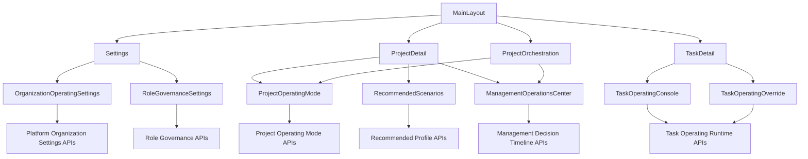
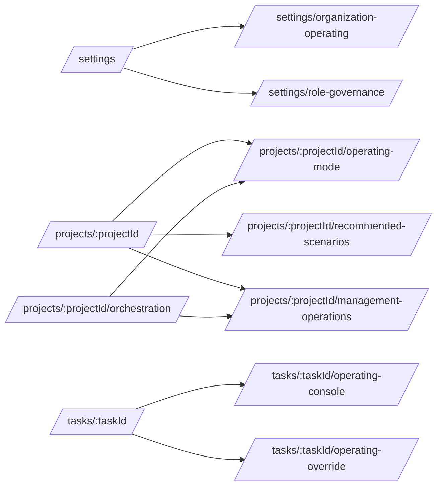

# 组织架构化 Agent 方案前端信息架构图

> 适用范围：组织架构化 Agent 方案的前端导航、页面边界与入口结构设计
>
> 目标：在尽量不修改现有页面主体结构的前提下，通过新增页面和最小入口挂接，完成第 1 期到第 3 期前端承载方案

## 1. 设计原则

前端信息架构遵循以下原则：

- 新能力优先放到新增页面和新增路由中承载
- 现有页面只承担最小入口挂接，不承担复杂表单和大块新布局重构
- 平台级、项目级、任务级、管理介入级四类视图分层清晰，避免一个页面同时承载全部语义
- 路由命名延续现有 `settings`、`projects/:projectId/*`、`tasks/:taskId/*` 风格
- Role 属于后台治理对象，由管理员维护；前台任务协作页面默认只展示成员分工，不直接暴露原始 Role
- 前台协作页面的显式规则是：用户只看见“谁负责什么、现在能做什么、已经做了什么”，不直接看见后台原始 Role 对象

相关文档：

- [docs/organization-oriented-agent-dev-task-list.md](docs/organization-oriented-agent-dev-task-list.md)
- [docs/organization-oriented-agent-technical-checklist.md](docs/organization-oriented-agent-technical-checklist.md)

## 2. 页面分层

建议将新增页面分为四层：

1. 平台设置层
2. 项目运行层
3. 任务运行层
4. 管理介入层

### 2.1 平台设置层

页面：

- `OrganizationOperatingSettings`
- `RoleGovernanceSettings`

职责：

- 管理平台默认 `collaborationMode`
- 管理平台默认 `autopilotLevel`
- 管理平台默认管理员介入规则（现有实现若仍使用 `bossParticipationMode` 字段，应视为待重命名的历史兼容字段）
- 管理推荐场景与升级规则

`RoleGovernanceSettings` 职责：

- 由管理员建立和维护 Role
- 管理 Role 的命名、职责描述、权限边界和适用范围
- 管理 Role 到前台“分工文案”的映射规则
- 管理 Role 与 Agent、Skill、模板阶段之间的绑定关系

### 2.2 项目运行层

页面：

- `ProjectOperatingMode`

职责：

- 展示项目当前运行档位
- 展示项目覆盖是否生效
- 展示模板来源、推荐来源和管理员介入方式
- 提供项目级默认档位编辑入口

### 2.3 任务运行层

页面：

- `TaskOperatingConsole`
- `TaskOperatingOverride`
- `RecommendedScenarios`

职责：

- `TaskOperatingConsole`：查看任务运行档位、管理员决策、升级请求、阶段摘要
- `TaskOperatingOverride`：编辑任务级运行覆盖
- `RecommendedScenarios`：创建任务前按推荐场景选择运行模式

补充约束：

- 任务运行层页面默认只展示成员、分工、记录和管理员介入信息
- 不把后台原始 Role 结构直接暴露给普通成员
- 前台呈现统一落在“分工文案”“职责说明”“可执行动作”“执行记录”四类信息上，不直接展示原始 Role 标识、Role 结构或 Role 绑定细节

### 2.4 管理介入层

页面：

- `ManagementOperationsCenter`

职责：

- 展示管理员决策时间线
- 展示阶段推进历史
- 展示升级请求与人工覆盖历史
- 为第 3 期模板切换、异常接管和管理介入视图预留统一入口

## 3. 路由结构建议

建议新增以下路由：

1. `/settings/organization-operating`
路由名：`OrganizationOperatingSettings`

2. `/settings/role-governance`
路由名：`RoleGovernanceSettings`

3. `/projects/:projectId/operating-mode`
路由名：`ProjectOperatingMode`

4. `/projects/:projectId/management-operations`
路由名：`ManagementOperationsCenter`

5. `/tasks/:taskId/operating-console`
路由名：`TaskOperatingConsole`

6. `/tasks/:taskId/operating-override`
路由名：`TaskOperatingOverride`

7. `/projects/:projectId/recommended-scenarios`
路由名：`RecommendedScenarios`

## 4. 现有页面入口挂接点

现有页面仅增加入口，不承担新能力主体内容。

### 4.1 设置页

现有页面：

- [control-plane/web-ui/src/pages/Settings.vue](control-plane/web-ui/src/pages/Settings.vue)

最小挂接：

- 增加“组织运行策略”入口卡片
- 点击后跳转到 `/settings/organization-operating`
- 增加“Role 治理”入口卡片
- 点击后跳转到 `/settings/role-governance`

### 4.2 项目编排页

现有页面：

- [control-plane/web-ui/src/pages/ProjectOrchestration.vue](control-plane/web-ui/src/pages/ProjectOrchestration.vue)

最小挂接：

- 增加“组织运行视图”入口
- 增加“管理介入视图”入口

### 4.3 项目详情页

现有页面：

- [control-plane/web-ui/src/pages/ProjectDetail.vue](control-plane/web-ui/src/pages/ProjectDetail.vue)

最小挂接：

- 增加项目级组织运行入口
- 增加“创建任务前设置运行模式”入口

### 4.4 任务详情页

现有页面：

- [control-plane/web-ui/src/pages/TaskDetail.vue](control-plane/web-ui/src/pages/TaskDetail.vue)

最小挂接：

- 增加“组织运行详情”入口
- 增加“任务运行覆盖”入口
- 页面中展示的职责信息统一使用“分工文案”，不直接展示后台原始 Role 标识

## 5. 信息架构图

## 6. 路由关系图

## 7. 页面职责矩阵

| 页面 | 层级 | 主要读接口 | 主要写接口 | 是否第 1 期上线 |
| --- | --- | --- | --- | --- |
| `OrganizationOperatingSettings` | 平台设置层 | `/config/orchestration-strategy` 或 `/config/organization-settings` | `/config/orchestration-strategy` 或 `/config/organization-settings` | 是 |
| `RoleGovernanceSettings` | 平台设置层 | `/config/roles`、`/config/role-mappings` | `/config/roles`、`/config/role-mappings` | 是 |
| `ProjectOperatingMode` | 项目运行层 | `/projects/:projectId`、`/projects/:projectId/orchestration-view` | `/api/projects/:projectId` | 是 |
| `TaskOperatingConsole` | 任务运行层 | `/tasks/:taskId`、`/tasks/:taskId/management-decisions`、`/tasks/:taskId/escalations` | 无或轻量操作 | 是 |
| `TaskOperatingOverride` | 任务运行层 | `/tasks/:taskId` | `/tasks/:taskId` | 第 2 期 |
| `RecommendedScenarios` | 任务运行层 | `/config/recommended-operating-profiles`、`/projects/:projectId` | `/tasks` | 第 2 期 |
| `ManagementOperationsCenter` | 管理介入层 | `/projects/:projectId/management-decisions`、`/projects/:projectId/orchestration-view` | 第 3 期视情况增加 | 第 3 期 |

## 8. 第 1 期最小导航闭环

第 1 期建议只先接入三条新增页面：

1. `OrganizationOperatingSettings`
2. `RoleGovernanceSettings`
3. `ProjectOperatingMode`
4. `TaskOperatingConsole`

这样可以最小化现有页面改动，同时先形成平台治理、项目查看、任务查看三层闭环。

## 9. 总结

这套前端信息架构的核心，不是把新能力塞进老页面，而是把组织架构化能力拆成独立可演进的视图层。同时明确区分：Role 属于后台治理对象，Agent、成员分工和执行记录属于前台协作对象。这样做能降低现有页面回归风险，也能让第 1 期到第 3 期逐步扩展时保持清晰的信息边界。
