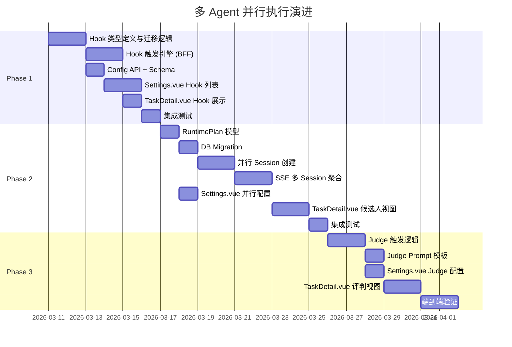

# 多 Agent 并行执行与通用生命周期 Hook 架构方案

> 适用范围：OpenerX 控制平面任务执行能力演进
>
> 目标：从当前"单 Agent 执行 + 固定执行前/执行后 Hook"模式，演进为"多 Agent 并行执行 + 通用生命周期 Hook + 聚合评判"模式
> 状态说明：本文档中把 `task-graph-plugin`、`taskNodes`、`taskEdges` 作为执行落地层的部分已经过时。
>
> 当前主方案已收口到 Workflow Stage、RuntimePlan、Hook 与 parallel/sequential execution，不再依赖独立 DAG 兼容层。请与 [docs/dag-node-execution-plan-v2.md](docs/dag-node-execution-plan-v2.md) 对照阅读。
>
> 历史口径说明（2026-04-05）：本文里涉及 `agent_runs` 字段扩展、DDL 和执行事实落库的段落，同样属于删除前设计上下文。当前 schema 已删除 `agent_runs` 物理表；兼容 `agentRunId` 视图已改由 canonical task-domain 表投影提供。

## 1. 文档目标

本文档回答以下问题：

- 当前执行模型的限制在哪里
- 目标模型要收敛成什么形态
- 分几个阶段推进，每阶段改什么
- 每阶段涉及哪些数据模型、API、前端变更
- 如何保持向后兼容

## 2. 现状分析

### 2.1 当前执行链路

```text
用户创建任务 → 意图分类 (classifyIntent)
             → 选择单个执行 Agent (selectExecutionAgent — 取 suggestedAgents[0])
             → 可选：执行前 Hook (runPreExecutionHooks)
             → 创建 OpenCode Session → 单 Agent 执行
             → SSE 事件聚合
             → 任务完成后可选：执行后 Hook (triggerPostExecutionHooks)
```

### 2.2 当前限制

| 维度 | 当前状态 | 限制说明 |
| ---- | -------- | -------- |
| Hook 类型 | 固定执行前 / 执行后两个治理入口 | 不能加中间态 Hook（暂停前、失败后、续跑前等） |
| 执行模式 | 单 Agent 执行 (`tasks.agentRunId` 为单值) | `classifyIntent()` 返回多个 `suggestedAgents` 但只取第一个 |
| 评估方式 | 执行后 Hook 仅评估单次执行结果 | 无法对比多个 Agent 结果，无法做聚合裁决 |
| 策略配置 | `OrchestrationStrategy` 中 Hook 字段固定 | 新增 Hook 点必须改类型定义 + 全量迁移 |

### 2.3 相关代码位置

| 模块 | 文件 | 职责 |
| ---- | ---- | ---- |
| 编排策略 | `web-ui-bff/src/lib/orchestration-strategy.ts` | Hook 类型定义、策略读写、模板渲染 |
| 意图分类 | `web-ui-bff/src/lib/intent-classifier.ts` | 任务分类、`suggestedAgents` 计算 |
| 任务执行 | `web-ui-bff/src/modules/tasks/routes.ts` | 执行前 Hook、Session 创建、PATCH 更新 |
| 事件聚合 | `web-ui-bff/src/modules/realtime/sse-aggregator.ts` | 执行后 Hook 触发、SSE 事件广播 |
| 配置 API | `web-ui-bff/src/modules/config/routes.ts` | `GET/PUT /orchestration-strategy` |
| 前端设置 | `web-ui/src/pages/Settings.vue` | 生命周期 Hook UI 配置 |
| 数据模型 | `service/src/db/schema.ts` | `tasks`、`agentRuns`、`taskNodes`、`taskEdges` 表 |

## 3. 目标模型

### 3.1 三层能力目标

```text
┌─────────────────────────────────────────────────────┐
│  Phase 3: 聚合评判                                    │
│  多 Agent 结果对比 → Judge Agent 裁决 → 选择最优      │
├─────────────────────────────────────────────────────┤
│  Phase 2: 多 Agent 并行执行                           │
│  任务 Fan-out → N 个 Agent 独立执行 → 结果汇聚         │
├─────────────────────────────────────────────────────┤
│  Phase 1: 通用生命周期 Hook                           │
│  任意生命周期点挂 Agent Hook → 动态配置 → 自动触发       │
└─────────────────────────────────────────────────────┘
```

### 3.2 目标执行链路

```text
用户创建任务 → 意图分类
             → Hook: pre-execution (0..N 个)
             → Fan-out: 分配给 N 个 Agent 并行执行
             → 各 Agent 独立 Session → 独立 SSE 事件流
             → Hook: on-pause / on-failure / pre-resume (按需)
             → 所有 Agent 完成
             → Hook: post-execution (0..N 个)
             → 聚合评判: Judge Agent 对比所有结果
             → 选择最优结果作为任务输出
```

## 4. Phase 1：通用生命周期 Hook（历史设计阶段）

> 历史注记：本节记录最初把固定前后 Hook 泛化为通用生命周期 Hook 的设计思路。
> 当前阅读时，应将其视为设计来源与能力边界说明，而不是待执行排期。

### 4.1 目标

历史目标是将固定的执行前 / 执行后治理入口泛化为可配置的 Hook 数组，支持任意生命周期触发点。

### 4.1.1 权限边界

- 生命周期 Hook 编排策略属于系统级运行时配置，不下放到项目级或个人级设置。
- 仅系统管理员可查看和修改该策略，当前角色边界为 `platform_admin` / `org_admin`。
- 非管理员只能消费任务执行结果与评审产物，不能在 UI 或 API 中调整 Hook、执行模式、聚合评判策略。

### 4.1.2 设计校正：管理员模板制，而不是全局开关堆叠

历史设计校正是：避免方案退化成“多几个系统开关”，并将编排能力抽象为“管理员发布工作流模板，普通使用者只能选择模板、不能编辑模板”。

- 系统管理员负责维护模板库、Hook、安全边界、并行上限、Judge 策略。
- 项目管理员和普通成员不能修改模板内容，但可以在被授权的范围内为任务选择模板。
- 模板必须支持至少三类执行形态：单执行、并行赛马、顺序接力。
- 默认模板仍可按意图分类自动匹配，但自动匹配的对象应是模板，而不是单个 Agent。

### 4.2 Hook 触发点枚举

```typescript
type HookTrigger =
  | "pre-execution"      // 任务执行前
  | "post-execution"     // 任务完成后
  | "on-failure"         // 任务失败时
  | "on-pause"           // 任务暂停时
  | "pre-resume"         // 续跑前
  | "on-cancel";         // 任务取消时
```

### 4.3 数据模型变更

#### orchestration-strategy.ts 类型变更

```typescript
// 新增：通用 Hook 定义
export interface LifecycleHook {
  id: string;                // 唯一标识，如 "pre-review-default"
  trigger: HookTrigger;      // 触发点
  enabled: boolean;
  agent: string;             // 执行 Hook 的 Agent
  model: string;             // 空字符串表示用默认
  promptTemplate: string;
  timeoutMs: number;
  order: number;             // 同一 trigger 下的执行顺序
}

export interface HookDecision {
  action:
    | "allow"
    | "deny"
    | "rewrite-prompt"
    | "request-approval"
    | "switch-model"
    | "spawn-followup";
  reason?: string;
  rewrittenPrompt?: string;
  targetModel?: string;
  followupTemplateId?: string;
}

export interface WorkflowTemplateStep {
  id: string;
  type: "hook" | "execution" | "judge" | "merge" | "approval";
  mode?: "single" | "parallel" | "pipeline";
  agent?: string;
  agents?: string[];
  model?: string;
  hooks?: string[];
  dependsOn?: string[];
  enabled: boolean;
}

export interface WorkflowTemplate {
  id: string;
  name: string;
  description: string;
  category?: string;
  enabled: boolean;
  selectableByProjects: boolean;
  maxParallelCandidates?: number;
  defaultJudgeStrategy?: "judge-pick" | "highest-score" | "merge" | "manual";
  steps: WorkflowTemplateStep[];
}

// 演进后的策略接口
export interface OrchestrationStrategy {
  categoryTemplateMap: Record<string, string[]>;
  categoryModelMap: Record<string, string>;
  enablePipeline: boolean;
  hooks: LifecycleHook[];    // 统一承载执行前 / 执行后等生命周期 Hook
  templates: WorkflowTemplate[];
  categoryAgentMap?: Record<string, string[]>;
}
```

#### PersistedTaskStrategy 变更

```typescript
export interface HookExecutionRecord {
  hookId: string;
  trigger: HookTrigger;
  status: "completed" | "failed" | "skipped";
  agent: string;
  model?: string;
  prompt: string;
  result?: string;
  error?: string;
  sessionId?: string;
  decision?: HookDecision;
  completedAt: string;
}

export interface PersistedTaskStrategy {
  selectedTemplateId?: string;
  complexity?: string;
  suggestedAgents?: string[];
  requiresPlan?: boolean;
  confidence?: number;
  selectedAgent?: string;
  effectiveModel?: string;

  // Phase 1：Hook 执行记录替代固定字段
  hookExecutions?: HookExecutionRecord[];

  [key: string]: unknown;
}
```

### 4.4 向后兼容迁移策略

`readOrchestrationStrategy()` 中保留旧字段读取迁移逻辑：

```typescript
function migrateToHooks(raw: any): LifecycleHook[] {
  if (raw.hooks) return raw; // 已迁移

  const hooks: LifecycleHook[] = [];

  if (raw.preExecutionReview) {
    hooks.push({
      id: "legacy-pre-execution",
      trigger: "pre-execution",
      enabled: raw.preExecutionReview.enabled,
      agent: raw.preExecutionReview.agent,
      model: raw.preExecutionReview.model,
      promptTemplate: raw.preExecutionReview.promptTemplate,
      timeoutMs: raw.preExecutionReview.timeoutMs,
      order: 0,
    });
  }

  if (raw.postExecutionReview) {
    hooks.push({
      id: "legacy-post-execution",
      trigger: "post-execution",
      enabled: raw.postExecutionReview.enabled,
      agent: raw.postExecutionReview.agent,
      model: raw.postExecutionReview.model,
      promptTemplate: raw.postExecutionReview.promptTemplate,
      timeoutMs: raw.postExecutionReview.timeoutMs,
      order: 0,
    });
  }

  return hooks;
}
```

### 4.5 API 变更

| 端点 | 变更 |
| ---- | ---- |
| `PUT /orchestration-strategy` | Schema 使用 `hooks` / `templates` / `judge`；仅系统管理员可调用 |
| `GET /orchestration-strategy` | 返回迁移后的 hooks 结构；仅系统管理员可调用 |
| `GET /api/tasks/:id` | `strategy` JSON 中使用 `hookExecutions`；历史设计里任务顶层可带 `executionPlan`，但当前主路径已不再依赖或对外暴露该字段 |

### 4.6 BFF 触发逻辑变更

#### tasks/routes.ts — 执行前

```typescript
// 执行前 Hook 统一入口
async function runLifecycleHooks(
  trigger: HookTrigger,
  task: Task,
  context: HookContext,
): Promise<HookExecutionRecord[]> {
  const strategy = readOrchestrationStrategy();
  const hooks = strategy.hooks
    .filter(h => h.trigger === trigger && h.enabled)
    .sort((a, b) => a.order - b.order);

  const records: HookExecutionRecord[] = [];
  for (const hook of hooks) {
    const prompt = renderPromptTemplate(hook.promptTemplate, context);
    const result = await runDetachedPrompt(/*...*/);
    records.push({ hookId: hook.id, trigger, /* ... */ });
  }
  return records;
}
```

#### sse-aggregator.ts — 执行后/失败/暂停

```typescript
// 执行后/失败后等 Hook 统一入口
// 根据事件类型自动匹配 trigger
private async triggerLifecycleHooks(trigger: HookTrigger, taskId: string) {
  const records = await runLifecycleHooks(trigger, task, buildHookContext(task));
  // PATCH task strategy + emit task.hooks.updated
}
```

### 4.7 前端变更 (Settings.vue)

历史前端草案是将固定的"执行前 / 执行后"治理表单改为动态 Hook 列表：

该入口继续保留在系统设置页，仅系统管理员可见、可编辑；非管理员不展示策略配置入口。

```text
编排策略 → 生命周期 Hook
┌──────────────────────────────────────────┐
│ [+ 添加 Hook]                             │
│                                          │
│ ┌─ pre-execution: 执行前 Hook (默认) ───┐ │
│ │ Agent: prometheus-enterprise          │ │
│ │ Model: (默认)      超时: 15000ms      │ │
│ │ [启用] [编辑] [删除]                   │ │
│ └────────────────────────────────────────┘ │
│                                          │
│ ┌─ post-execution: 执行后 Hook (默认) ───┐ │
│ │ Agent: oracle-enterprise              │ │
│ │ Model: (默认)      超时: 15000ms      │ │
│ │ [启用] [编辑] [删除]                   │ │
│ └────────────────────────────────────────┘ │
│                                          │
│ ┌─ on-failure: 失败分析 ────────────────┐ │
│ │ Agent: prometheus-enterprise          │ │
│ │ [启用] [编辑] [删除]                   │ │
│ └────────────────────────────────────────┘ │
└──────────────────────────────────────────┘
```

### 4.8 TaskDetail.vue 变更

历史 TaskDetail 草案是展示 `hookExecutions` 数组，每条记录显示：trigger、agent、status、result 摘要。

## 5. Phase 2：多 Agent 并行执行（历史设计阶段）

> 历史注记：本节记录最初把“单 Agent 执行”提升为模板驱动的 single / parallel / pipeline 三种执行形态的设计。
> 其中一部分语义后来被 task domain runs / snapshots 吸收，因此这里更适合作为历史方案背景阅读。

### 5.1 目标

历史目标是让一个任务不再只对应“选一个 Agent 去执行”，而是对应一个工作流模板。模板至少支持三种执行形态：

- 单执行：一个主执行 Agent，适合稳态生产任务。
- 并行赛马：多个 candidate 独立执行，适合探索最优解。
- 顺序接力：规划、实现、审查、收尾等步骤按依赖串联，适合多角色协作。

### 5.2 执行计划模型

```typescript
// 历史方案中的 RuntimePlan（曾附加在任务上，兼容字段名为 executionPlan）
export interface RuntimePlan {
  templateId: string;
  mode: "single" | "parallel" | "pipeline";
  steps: ExecutionStep[];
  candidates: ExecutionCandidate[];
}

export interface ExecutionStep {
  id: string;
  type: "hook" | "execution" | "judge" | "merge" | "approval";
  status: "pending" | "running" | "completed" | "failed" | "blocked";
  dependsOn?: string[];
  outputRef?: string;
}

export interface ExecutionCandidate {
  agent: string;
  model?: string;                      // 可覆盖默认
  role?: "planner" | "executor" | "reviewer" | "judge" | "merger";
  sessionId?: string;                  // 执行后回填
  agentRunId?: string;                 // 执行后回填
  status: "pending" | "running" | "completed" | "failed";
  result?: string;
  startedAt?: string;
  finishedAt?: string;
}
```

### 5.3 数据模型变更

#### tasks 表变更

```sql
-- 新增列
ALTER TABLE tasks ADD COLUMN execution_mode TEXT DEFAULT 'single';
-- 'single' | 'parallel'

ALTER TABLE tasks ADD COLUMN execution_plan TEXT;
-- JSON: RuntimePlan
```

`tasks.agentRunId` 在 `parallel` 模式下不再使用（保留向后兼容），改读 `execution_plan` 中各 candidate 的 `agentRunId`。

#### agentRuns 表变更

```sql
-- 新增列：标记该 run 是否为 parallel 中的候选
ALTER TABLE agent_runs ADD COLUMN candidate_index INTEGER;
-- NULL = 单执行, 0/1/2/... = 并行执行中的索引
```

### 5.4 执行链路变更

**tasks/routes.ts — POST /:taskId/execute**

```typescript
// 替代原 selectExecutionAgent() 只取第一个
function buildRuntimePlan(
  classification: IntentClassification,
  strategy: OrchestrationStrategy,
  selectedTemplateId?: string,
): RuntimePlan {
  const template = resolveWorkflowTemplate(strategy, classification.category, selectedTemplateId);

  if (template.mode === "single") {
    return {
      templateId: template.id,
      mode: "single",
      steps: template.steps.map((step) => ({ id: step.id, type: step.type, status: "pending" })),
      candidates: [{ agent: template.steps.find((step) => step.type === "execution")?.agent!, status: "pending" }],
    };
  }

  if (template.mode === "parallel") {
    const maxCandidates = template.maxParallelCandidates ?? 3;
    const agents = template.steps.find((step) => step.type === "execution")?.agents || [];
    return {
      templateId: template.id,
      mode: "parallel",
      steps: template.steps.map((step) => ({ id: step.id, type: step.type, status: "pending" })),
      candidates: agents.slice(0, maxCandidates).map((agent) => ({
        agent,
        role: "executor" as const,
        status: "pending" as const,
      })),
    };
  }

  return {
    templateId: template.id,
    mode: "pipeline",
    steps: template.steps.map((step) => ({ id: step.id, type: step.type, status: "pending", dependsOn: step.dependsOn })),
    candidates: template.steps
      .filter((step) => step.type === "execution" && step.agent)
      .map((step) => ({
        agent: step.agent!,
        role: "executor" as const,
        status: "pending" as const,
      })),
  };
}
```

#### 并行 Session 创建

```typescript
// Fan-out: 为每个 candidate 创建独立 Session
async function executeParallel(
  taskId: string, plan: RuntimePlan, prompt: string, options: ExecOptions,
): Promise<RuntimePlan> {
  const results = await Promise.allSettled(
    plan.candidates.map(async (candidate, index) => {
      const sessionResult = await createSession(taskId, options.projectId, prompt, {
        agent: candidate.agent,
        model: candidate.model ? parseModelString(candidate.model) : options.model,
        repoContext: options.repoContext,
      });
      return { index, sessionResult };
    }),
  );

  // 回填 sessionId / agentRunId / status
  for (const r of results) {
    if (r.status === "fulfilled") {
      const { index, sessionResult } = r.value;
      plan.candidates[index].sessionId = sessionResult.sessionId;
      plan.candidates[index].status = sessionResult.ok ? "running" : "failed";
    }
  }
  return plan;
}
```

#### 顺序接力执行

```typescript
async function executePipeline(
  taskId: string,
  plan: RuntimePlan,
  prompt: string,
  options: ExecOptions,
): Promise<RuntimePlan> {
  for (const step of plan.steps) {
    if (step.type !== "execution") continue;
    const candidate = plan.candidates.find((item) => item.agent === resolveStepAgent(step));
    const input = buildStepInput(prompt, step, plan);
    const sessionResult = await createSession(taskId, options.projectId, input, {
      agent: candidate?.agent,
      model: candidate?.model ? parseModelString(candidate.model) : options.model,
      repoContext: options.repoContext,
    });
    patchStepAndCandidate(plan, step.id, candidate?.agent, sessionResult);
    if (!sessionResult.ok) break;
  }
  return plan;
}
```

### 5.5 SSE 事件聚合变更

`SSEAggregator` 需要同时跟踪多个 Session 的事件流：

```typescript
// 在 parallel 模式下，为每个 candidate session 注册监听
for (const candidate of plan.candidates) {
  if (candidate.sessionId) {
    this.subscribeSession(candidate.sessionId, taskId, candidate.agent);
  }
}
```

任务完成判定：**所有** candidate 都到达终态（completed / failed）后，才触发 post-execution Hook。

### 5.6 策略配置变更

```typescript
export interface OrchestrationStrategy {
  // ...existing
  templates: WorkflowTemplate[];     // 新增：管理员维护模板库
  hooks: LifecycleHook[];
}
```

### 5.7 前端变更

#### Settings.vue（Phase 2）

历史 Settings 草案是将原来的“按分类配置 Agent”升级为“模板库 + 分类默认模板映射”：

```text
编排策略 → 工作流模板
┌──────────────────────────────────────────┐
│ 模板: 标准单执行                           │
│ 类型: single                              │
│ 步骤: pre-hook -> execute -> post-hook    │
├──────────────────────────────────────────┤
│ 模板: 双 Agent 赛马                        │
│ 类型: parallel                            │
│ 步骤: pre-hook -> parallel execute -> judge │
├──────────────────────────────────────────┤
│ 模板: 规划-实现-审查接力                   │
│ 类型: pipeline                            │
│ 步骤: planner -> executor -> reviewer     │
└──────────────────────────────────────────┘
```

#### TaskDetail.vue（Phase 2）

历史 TaskDetail 草案是在 `execution_mode === 'parallel'` 时切换为多 candidate 视图：

```text
任务详情 → 执行候选
┌──────────────────────────────────────────┐
│ Candidate 1: hephaestus-enterprise       │
│ Status: ✅ completed  耗时: 45s           │
│ [查看 Session] [查看结果]                  │
├──────────────────────────────────────────┤
│ Candidate 2: prometheus-enterprise       │
│ Status: ✅ completed  耗时: 62s           │
│ [查看 Session] [查看结果]                  │
├──────────────────────────────────────────┤
│ Candidate 3: oracle-enterprise           │
│ Status: ❌ failed     耗时: 30s           │
│ [查看 Session] [查看错误]                  │
└──────────────────────────────────────────┘
│                                          │
│ 🏆 最优结果: Candidate 1 (Judge 评选)      │
└──────────────────────────────────────────┘
```

## 6. Phase 3：聚合评判（Judge，历史设计阶段）

> 历史注记：本节记录最初把并行/接力执行结果交给 Judge 或 Merge 步骤处理的设计。
> 当前代码路径已经不再沿用其中部分 `executionPlan` 持久化语义，因此本节应视为历史评审方案说明。

### 6.1 目标

历史目标是在并行赛马或顺序接力结束后，引入 Judge 或 Merge 步骤，对多个结果做“选优、合成或人工建议”，而不是只选一个赢家。

### 6.2 Judge 模型

```typescript
export interface JudgeConfig {
  enabled: boolean;
  agent: string;              // Judge Agent
  model: string;
  promptTemplate: string;     // 内置对比评判 prompt
  timeoutMs: number;
  selectionStrategy: "judge-pick" | "highest-score" | "merge" | "manual";
  // judge-pick: 完全由 Judge Agent 决定
  // highest-score: Judge Agent 给每个打分，取最高
  // merge: Judge / Merger 将多个结果合成为最终输出
  // manual: Judge Agent 给建议，人工最终决定
}
```

### 6.3 Judge 触发流程

```text
所有 candidate 到达终态
    ↓
收集每个 candidate 的 result / changesSummary / sessionMessages
    ↓
渲染 Judge prompt（含所有 candidate 结果对比）
    ↓
创建 Judge Session → Judge Agent 执行
    ↓
解析 Judge 输出 → 提取选择结果 + 评分 + 理由
    ↓
PATCH task: 写入 judgeResult + 设置 winnerCandidateIndex
    ↓
emit task.judge-evaluation.completed
```

### 6.4 数据模型变更

```typescript
// 存储在 task.strategy JSON 中
export interface JudgeResult {
  status: "completed" | "failed" | "skipped";
  sessionId?: string;
  winnerIndex?: number;         // 选中的 candidate 索引
  scores?: number[];            // 每个 candidate 的评分（0-100）
  reasoning: string;            // Judge 的评判理由
  mergedSummary?: string;       // merge 模式下的合成摘要
  completedAt: string;
}

// RuntimePlan 扩展
export interface RuntimePlan {
  mode: "single" | "parallel";
  candidates: ExecutionCandidate[];
  judge?: JudgeConfig;
  judgeResult?: JudgeResult;
  winnerCandidateIndex?: number;   // 最终使用的 candidate 索引
  finalOutputMode?: "winner" | "merged" | "manual";
}
```

### 6.5 Judge Prompt 模板

```text
你是 OpenerX 聚合评判 Agent。以下是同一个任务交给 {{candidateCount}} 个不同 Agent 执行的结果。
请根据 selectionStrategy 决定是选出最佳结果，还是将多个结果合成为最终输出。

任务标题: {{taskTitle}}
任务需求: {{taskPrompt}}

{{#each candidates}}
--- Candidate {{index}}: {{agent}} ---
状态: {{status}}
执行结果:
{{result}}

代码变更摘要:
{{changesSummary}}
{{/each}}

请按以下格式输出:
1. 每个 Candidate 的评分(0-100)和简要评价
2. 最终决策: Candidate X / Merge / Manual
3. 选择或合成理由
4. 如为 Merge，请给出最终合成摘要
```

### 6.6 策略配置变更

```typescript
export interface OrchestrationStrategy {
  // ...existing
  judge: JudgeConfig;           // 新增
  hooks: LifecycleHook[];
  templates: WorkflowTemplate[];
}
```

### 6.7 前端变更

#### Settings.vue（Phase 3）

历史 Settings 草案新增了"聚合评判"配置区：

```text
编排策略 → 聚合评判
┌──────────────────────────────────────────┐
│ 聚合评判:  [开启/关闭]                     │
│ Judge Agent: [prometheus-enterprise]      │
│ 选择策略:  [Judge 决定 / 最高分 / 合成 / 人工] │
│ 超时: [30000 ms]                          │
│ Prompt 模板:                              │
│ ┌──────────────────────────────────────┐  │
│ │ 你是 OpenerX 聚合评判 Agent...       │  │
│ └──────────────────────────────────────┘  │
└──────────────────────────────────────────┘
```

#### TaskDetail.vue（Phase 3）

历史 TaskDetail 草案是在 candidate 列表下方增加 Judge 评判结果区：

```text
任务详情 → 评判结果
┌──────────────────────────────────────────┐
│ Judge Agent: prometheus-enterprise       │
│ 状态: ✅ completed                        │
│                                          │
│ Candidate 1 (hephaestus): 85分           │
│   "代码质量高，测试覆盖完整"               │
│                                          │
│ Candidate 2 (prometheus): 72分           │
│   "方案合理但缺少错误处理"                 │
│                                          │
│ 🏆 选择 Candidate 1                      │
│ 理由: 实现更完整、代码风格一致...           │
└──────────────────────────────────────────┘
```

## 7. 与 OpenCode 底层能力对齐

本方案不是替换 OpenCode Runtime，而是站在其已有原语之上补齐企业控制面的编排语义、权限边界和可审计性。

### 7.1 可直接复用的 Runtime 原语

| 能力 | OpenCode 现状 | 方案中的角色 |
| ---- | ---- | -------- |
| Session / Sub-session | Runtime 已支持创建会话、子会话、向指定 agent dispatch prompt | 作为单执行、并行赛马、顺序接力的最小执行单元 |
| Agent 专长分工 | 现有 enterprise agents、commands、skills 已具备多角色协作基础 | 作为工作流模板中的步骤参与者 |
| DAG / 依赖图 | task-graph-plugin 已支持节点、依赖、blocked / waiting_approval / retry 状态机 | 作为 RuntimePlan / pipeline step 的运行时落地结构 |
| 生命周期事件 | 已有 `session.idle`、`session.error`、`tool.execute.before`、`tool.execute.after` 等事件 | 作为 Hook 触发与状态同步的底层信号 |
| Guidance / Resume | 已支持 pause、inject guidance、resume | 作为 `pre-resume`、失败补救、人工介入的恢复原语 |
| Prompt/System 变换 | 插件钩子支持 `chat.system.transform`、工具执行前后拦截 | 作为 Hook 执行和上下文注入的底层入口 |

### 7.2 必须由 OpenerX 自建的能力

| 能力 | 为什么不能只靠 OpenCode | OpenerX 需要提供什么 |
| ---- | ---- | -------- |
| 管理员模板库 | OpenCode 现有 command 更像脚本，不是统一模板中心 | `WorkflowTemplate` 持久化、版本化、启停、审计 |
| 权限边界 | Runtime 不理解平台内的系统管理员 / 项目管理员 / 普通成员 | 模板可见性、可选性、只读与编辑权限控制 |
| 结构化 Hook 决策 | Runtime Hook 更偏插件回调，不是企业语义决策对象 | `HookDecision` 协议、决策记录、拒绝/改写/审批/切模型语义 |
| Judge / Merge 结果模型 | Runtime 没有统一 winner / merge / manual 裁决模型 | `JudgeResult`、`winnerCandidateIndex`、`mergedSummary` |
| 多 Session 聚合视图 | Runtime 当前以全局 SSE 为主，会话级观测粒度不足 | BFF 聚合、TaskDetail 多 candidate 视图、执行态解释 |
| 控制面审计与治理 | Runtime 状态偏执行期本地状态，不承担企业审计职责 | 审批记录、策略变更记录、任务治理摘要 |

### 7.3 历史责任分层草案

> 历史注记：这一小节仍然有参考价值，因为它解释了哪些语义应留在 Control Plane，哪些应继续依赖 Runtime 原语。

```text
OpenerX Control Plane / BFF
  ├─ 模板管理
  ├─ 权限控制
  ├─ Hook / Judge 结构化语义
  ├─ 多 session 聚合与审计
  └─ 项目与任务级可见性

OpenCode Runtime
  ├─ session / sub-session 执行
  ├─ agent prompt dispatch
  ├─ tool execution + plugin hooks
  ├─ DAG 节点状态推进
  └─ SSE 事件广播
```

这意味着 BFF 不应重复实现 Runtime 已有的 session、子会话、DAG 状态机，而应把这些原语包装成控制面可理解的模板实例、任务状态和审计事件。

### 7.4 对 Phase 设计的具体映射

#### Phase 1 — 通用 Hook

- 复用 OpenCode 的插件 Hook 与 guidance 注入能力。
- OpenerX 负责将 Hook 提升为管理员可配置对象，并把结果持久化为 `HookExecutionRecord` 与 `HookDecision`。
- `on-failure`、`pre-resume` 等触发点可以基于 Runtime 事件映射，而不是要求 Runtime 原生理解这些企业语义。

#### Phase 2 — 多 Agent 执行

- 并行赛马与顺序接力都复用 Runtime 的 sub-session 和 dispatch 原语。
- pipeline 的依赖与阻塞状态尽可能落到 task-graph-plugin，而不是在 BFF 里重复造第二套 DAG 引擎。
- OpenerX 负责在任务维度聚合多个 session 的状态、输出和异常，并对外暴露单一任务视图。

#### Phase 3 — 聚合评判

- Judge / Merge 本身仍可由 Runtime 中的普通 agent session 执行。
- 但评判策略、结果解析、winner/merge/manual 的统一模型必须由 OpenerX 定义。
- 如果 Judge 失败，OpenerX 需要明确 fallback 策略，例如退回人工选择，而不是把失败语义泄漏给 Runtime。

### 7.5 不下沉到 Runtime 的内容

- 不把管理员模板权限直接塞进 OpenCode 插件层；Runtime 不应该感知控制面租户和角色模型。
- 不把任务级审计、审批流、模板版本治理下沉到 command / plugin 文件，否则会形成“脚本即策略”的隐性耦合。
- 不在 Runtime 里单独再造一套 Judge / Merge 持久化格式；控制面应保持最终解释权。

### 7.6 实施原则

1. 优先复用：session、sub-session、task graph、事件流、guidance/resume 直接复用 OpenCode。
2. 控制面收口：模板、权限、结构化决策、审计、聚合结果全部由 OpenerX 统一建模。
3. 避免双重状态机：Runtime 管执行态，Control Plane 管业务态，不做两套并列编排引擎。

## 8. MVP 落地边界（历史范围裁剪）

历史范围裁剪口径是：将当时的方案限制在“管理员模板制 + 单执行 / 并行赛马 + 基础 Hook + 基础 Judge”，避免一期范围膨胀。

### 8.1 MVP 必做范围

- 管理员维护模板库，但一期只支持两类模板：`single`、`parallel`。
- 任务执行仍以单任务单入口为准，不引入 end-user 自定义编排 DSL。
- 模板选择先由系统按分类映射自动完成；任务创建时的手动模板选择延后。
- Hook 一期只支持 `pre-execution` 与 `post-execution` 两个触发点。
- Hook 结果先落为结构化记录；强控制语义中仅开放 `rewrite-prompt`，`deny` / `request-approval` / `spawn-followup` 延后。
- Judge 一期只支持 `judge-pick` 与 `highest-score` 两种模式。
- TaskDetail 一期只展示模板、candidate、hook 执行记录、judge 结果，不做复杂 pipeline 可视化。

### 8.2 MVP 暂不做的内容

- 顺序接力 `pipeline` 模板。
- `merge` 与 `manual` 两种 Judge 输出模式。
- 项目级模板授权矩阵与模板自选 UI。
- 通用审批节点、失败后自动派生 follow-up 流程。
- Runtime 内部脚本式 command 与控制面模板的双向同步。

### 8.3 MVP 目标状态

```text
管理员配置模板库
  ↓
系统按任务分类匹配默认模板
  ↓
single: 1 个执行 agent + 可选前后 hook
parallel: 2~3 个 candidate 并行 + 可选前后 hook + 基础 judge
  ↓
TaskDetail 展示执行记录、候选结果和最终裁决
```

## 9. 按文件实施清单

> 历史注记：本节是最初的 MVP 实施矩阵。
> 当前更适合把它理解为“设计来源 + 已落地项对照”，而不是仍待逐项执行的当前开发清单。

### 9.1 BFF 与运行时适配层

| 文件 | 当前状态 | MVP 改动 |
| ---- | ---- | -------- |
| `control-plane/web-ui-bff/src/lib/orchestration-strategy.ts` | 仅支持 `categoryAgentMap`、固定前后评审 | 历史 MVP 目标是补齐 `WorkflowTemplate`、`HookExecutionRecord`、`JudgeResult`、`RuntimePlan`；当前更应把这行视为设计来源说明 |
| `control-plane/web-ui-bff/src/modules/config/routes.ts` | `GET/PUT /orchestration-strategy` 仍是旧 schema | 历史 MVP 目标是改为模板库 schema；当前是否继续推进应以现有编排配置面为准 |
| `control-plane/web-ui-bff/src/modules/tasks/routes.ts` | 仍是分类后选一个 agent 执行 | 历史 MVP 目标是补齐模板解析、single/parallel 执行分支与基础 pre-hook 记录；其中 `executionPlan` 持久化语义现已退役 |
| `control-plane/web-ui-bff/src/modules/realtime/sse-aggregator.ts` | 只围绕单 session 完成检测和执行后治理 | 历史 MVP 目标是增加多 session 聚合、parallel 终态判定、post-hook 持久化和基础 judge 触发 |
| `control-plane/web-ui/src/pages/TaskDetail.vue` | 展示 `selectedAgent`、`suggestedAgents`、固定治理结果 | 历史 MVP 目标是展示模板信息、candidate 列表、judge 结果和 hook 执行记录 |
| `tests/web-ui-bff/hooks-integration.test.ts` | 只覆盖固定执行前/执行后治理 | 历史 MVP 目标是扩展到模板兼容迁移、single 模式、parallel 模式基础 judge |

### 9.2 控制面服务与存储层

> 历史语境补充：下表反映的是最初 MVP 讨论时对控制面 service/schema 的观察与改造意图。
> 当前阅读时，应优先以现有 task-domain migrations、task runs / snapshots / conversation 表结构为准，而不是把这里的 `tasks.executionPlan`、`executionMode` 一类描述当作现行 schema 事实。

| 文件 | 当前状态 | MVP 改动 |
| ---- | ---- | -------- |
| `control-plane/service/src/db/schema.ts` | `tasks` 只有 `sessionId`、`agentRunId`、`strategy` | 历史阶段曾新增 `executionMode`、`executionPlan`；当前主路径应以 task domain runs / snapshots 为准，不再扩展 `executionPlan` 语义 |
| `control-plane/service/src/modules/tasks/routes.ts` | PATCH schema 可更新 `strategy`，但没有 execution fields | 历史阶段曾放宽控制面持久化 `executionMode`、`executionPlan`；当前不应再把 `executionPlan` 作为正式 GET/PATCH 字段 |
| `control-plane/service/drizzle/*` | 历史阶段当时尚无多执行 migration | 历史阶段曾计划新增 `tasks.execution_mode`、`tasks.execution_plan`、`agent_runs.candidate_index`；当前阅读时应结合现有 migration 实际状态，不再把这行视为待办 |

### 9.3 Web UI

| 文件 | 当前状态 | MVP 改动 |
| ---- | ---- | -------- |
| `control-plane/web-ui/src/pages/Settings.vue` | 仍是分类到 agent + 固定治理表单 | 改成模板库管理视图，但一期只支持 single/parallel 两种模板与生命周期 hook 配置 |
| `control-plane/web-ui/src/lib/api.ts` | orchestration strategy 类型仍是旧结构 | 更新前端类型与 API payload；增加 runtime plan / judge result 类型 |
| `control-plane/web-ui/src/pages/TaskDetail.vue` | 展示 `selectedAgent`、`suggestedAgents`、基础治理信息 | 增加模板信息、candidate 列表、judge 结果、hook 执行记录 |

### 9.4 测试与回归

| 文件 | 当前状态 | MVP 改动 |
| ---- | ---- | -------- |
| `tests/web-ui-bff/hooks-integration.test.ts` | 只覆盖固定执行前/执行后治理 | 历史 MVP 目标是扩展到模板兼容迁移、single 模式、parallel 模式基础 judge |
| `tests/web-ui-bff/user-management.test.ts` | 已覆盖 orchestration strategy 管理员权限 | 保持并补模板制 schema 的管理员权限回归 |
| `tests/web-ui/*` | TaskDetail 与 Settings 仍基于旧编排 UI | 增加模板页渲染、candidate 展示、judge 展示、旧数据兼容测试 |

### 9.5 历史实施顺序

1. 先改 BFF 类型与兼容读写。
2. 再补控制面字段和 migration。
3. 然后接入 tasks execute / sse aggregator。
4. 最后更新 Settings 与 TaskDetail。
5. 全程保持 single 模式可回退且不回归。

## 10. DB Migration 汇总（历史草案）

> 历史注记：本节保留最初的 migration 草案作为设计来源。
> 其中涉及 `tasks.execution_plan` 的部分已不应再视为当前主路径事实，应结合现有 task domain schema 与 migration 实际状态阅读。

### Phase 1

无表结构变更。Hook 配置存储在 `orchestration-strategy.json` 文件中，Hook 执行记录存储在 `tasks.strategy` JSON 列中。

### Phase 2

```sql
-- 0008_multi_agent_execution.sql
ALTER TABLE tasks ADD COLUMN execution_mode TEXT DEFAULT 'single';
ALTER TABLE tasks ADD COLUMN execution_plan TEXT; -- JSON
ALTER TABLE agent_runs ADD COLUMN candidate_index INTEGER;
```

### Phase 3

无表结构变更。Judge 结果存储在 `tasks.execution_plan` JSON 中（`judgeResult` 字段）。

## 11. 实施顺序与依赖（历史排期草案）



## 12. 风险与缓解

> 历史注记：这里列的是方案提出当时的风险清单，仍可作为背景参考，但不等于当前剩余风险全集。

| 风险 | 影响 | 缓解措施 |
| ---- | ---- | -------- |
| 并行执行成本翻倍 | Token 消耗随 candidate 数线性增长 | 策略配置 `maxParallelCandidates` 上限；默认关闭 |
| 并行 Session 超时不一致 | 某个 candidate 卡住导致整体等待 | 每个 candidate 独立超时；先到先展示 |
| Judge Agent 偏好固定 | Judge 可能总倾向选择特定 Agent | 支持多种选择策略；提供人工覆盖与 merge 输出 |
| 向后兼容断裂 | 旧格式策略文件无法读取 | Phase 1 自动迁移逻辑 + 双读兼容 |
| OpenCode 并发 Session 限制 | Runtime 可能不支持高并发 | 先验证 Runtime 并发能力；必要时加排队 |
| 模板库膨胀失控 | 系统管理员堆叠过多近似模板，用户难选 | 模板分级治理：标准模板、实验模板、废弃模板 |
| Hook 决策不可解释 | 自动拒绝或改写 prompt 引发不透明感 | 持久化结构化 `decision`，在 TaskDetail 展示决策原因 |

## 13. 验收标准（历史阶段验收）

### Phase 1 验收

- [ ] 旧格式 `orchestration-strategy.json` 读取时自动迁移为 hooks 数组
- [ ] Settings 页可以维护模板库，并在模板内添加/编辑/删除/排序任意 Hook
- [ ] pre-execution / post-execution Hook 功能与迁移前行为一致
- [ ] on-failure Hook 在任务失败时自动触发
- [ ] TaskDetail 展示所有 Hook 执行记录与结构化决策
- [ ] check:all 全绿

### Phase 2 验收

- [ ] 任务可以基于模板进入单执行、并行赛马或顺序接力三种模式
- [ ] 每个 candidate 有独立 Session 和 agentRun 记录
- [ ] SSE 事件流正确聚合多个 Session 的事件
- [ ] TaskDetail 展示所有 candidate 或 pipeline step 的执行状态和结果
- [ ] 单 Agent 模式（默认）行为完全不变
- [ ] check:all 全绿

### Phase 3 验收

- [ ] 并行执行完成后自动触发 Judge Agent
- [ ] Judge 输出被解析为结构化评分和选择结果
- [ ] TaskDetail 展示评判结果、评分、理由，以及 merge 输出摘要
- [ ] 支持 judge-pick / highest-score / merge / manual 四种选择策略
- [ ] check:all 全绿
