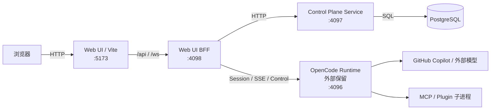

# OpenerX PostgreSQL 迁移与现状运行说明

> 状态说明：本文收录的是 PostgreSQL 迁移阶段的运行边界与决策背景。文中把外部 OpenCode Runtime `:4096` 视为既有运行前提的部分，应按当时迁移基线理解，不再代表今天的默认 runtime backend。
>
> 当前默认 backend 已切到 `pi-mono` runtime-provider；OpenCode `:4096` 只保留历史/回退兼容语境。当前实现请优先参考 [runtime/current-implementation-index.md](../runtime/current-implementation-index.md) 和 [architecture-overview.md](../architecture/architecture-overview.md)。

## 1. 目标

本说明用于收口 OpenerX 控制面的 PostgreSQL 迁移结果，并明确当前运行边界。当前目标只有一条：

1. 将当前控制面主数据存储从 SQLite 切换到 PostgreSQL，并保持现有多进程运行形态。

这里的“3 个运行进程”定义为：

- Control Plane Service :4097
- Web UI BFF :4098
- Web UI Dev / 静态托管层 :5173

当前外部 OpenCode Runtime :4096 不纳入本次范围。原因很直接：它不是简单的 API 代理层，而是独立的会话执行运行时，包含 SSE、session lifecycle、provider 调用、插件和 MCP 进程拉起职责。

当前确认保留的运行形态是：

- 1 个 PostgreSQL 数据库
- 1 个 Control Plane Service 进程 :4097
- 1 个 Web UI BFF 进程 :4098
- 1 个 Web UI Dev / 静态托管层 :5173
- 1 个外部 OpenCode Runtime 进程 :4096

本次决策是：数据库迁移继续保持为正式路径；Control Plane、BFF、UI 托管层不再继续推进合并，后续保持现状并按需要做局部优化。

## 2. 触发原因

本次重构不是风格调整，而是由当前架构的结构性问题触发。

### 2.1 SQLite 已经成为控制面扩展瓶颈

当前控制面数据库直接使用 SQLite 文件，入口集中在：

- control-plane/service/src/db/index.ts
- control-plane/service/src/db/migrate.ts
- control-plane/service/src/db/seed.ts

当前已出现的现实问题：

- 多个 Bun 进程并发打开同一 DB 文件时会触发 SQLITE_BUSY / SQLITE_BUSY_RECOVERY。
- 需要通过 PRAGMA busy_timeout 和 WAL 降级兼容，说明问题已经不是“偶发误报”，而是文件级锁模型与当前运行方式存在天然张力。
- 随着 runtime ledger、审计、成本、治理总览、审批、项目配置等写路径继续增加，单文件锁竞争会继续放大。

SQLite 适合轻量嵌入、单进程或低并发写入，不适合当前这个“控制面 + BFF + runtime 协调 + 持续治理写入”的形态继续演进。

### 2.2 4097 / 4098 / 5173 的三层控制面边界已经开始内耗

当前运行架构见：

- docs/architecture/runtime-process-architecture.md
- docs/architecture/architecture-overview.md

现状问题：

- BFF 到 Control Plane 通过 cpFetch 做本地回源，形成“同机进程间 HTTP 回环”。
- 前端必须依赖 Vite dev server、BFF、Control Plane 三者都正常，任何一个挂掉都会形成级联失败。
- 当前 VS Code task 中 4097、4098、5173 都要分别拉起和重启，运维面和开发排障面都偏重。
- 配置读写和运行时适配逻辑散落在 BFF，中台主数据在 Control Plane，导致边界既不彻底解耦，也没有真正收敛。

### 2.3 当前“控制面 + BFF”分层收益已经低于成本

最初拆出 BFF 是合理的，因为它负责：

- JWT 校验
- 前端接口整形
- OpenCode Runtime 适配
- WebSocket / SSE 聚合

但随着功能增长，BFF 已经不只是“边缘适配层”，而是承担了大量核心业务路径：

- paid execution guard
- runtime usage ledger sync
- task execute / continue / resume 主路径控制
- chat settings / config / opencode.json 读写

这意味着：

- 真正的业务核心并没有只留在 Control Plane。
- BFF 与 Control Plane 的边界已经不是“业务层 / 边缘层”，而更像“两个部分重叠的后端”。

继续维持两个 Hono 服务，只会让演进成本越来越高。

## 3. 当前目标架构

### 3.1 目标拓扑



### 3.2 当前职责边界

当前多进程职责保持如下：

- Web UI / Vite :5173 负责前端开发态 HMR 与静态资源托管。
- Web UI BFF :4098 负责前端接口整形、Runtime 适配、WebSocket / SSE 聚合，以及部分控制面编排逻辑。
- Control Plane Service :4097 负责主数据、认证、任务、审批、审计、成本、治理等核心业务与 PostgreSQL 读写。
- OpenCode Runtime :4096 继续保持外部运行时边界。

这里不再追求把上述职责硬收敛到单一 server 入口，而是接受当前边界，优先保证 PostgreSQL 唯一路径、历史数据迁移能力与运行稳定性。

### 3.3 当前代码组织说明

当前代码组织继续保持现有多项目结构：

```text
control-plane/service/      # 主业务与 PostgreSQL 数据层
control-plane/web-ui-bff/   # 前端 BFF 与 runtime adapter
control-plane/web-ui/       # 前端界面与 Vite 开发服务器
control-plane/app/          # 已存在的统一 app 实验入口，仅保留作兼容/验证资产
```

这里的关键是边界清晰：生产与开发默认仍以 `service + bff + ui (+ runtime)` 为准，不再把 `control-plane/app` 视为后续必须替代的目标形态。

## 4. PostgreSQL 替换方案

### 4.1 数据库选型建议

目标数据库是 PostgreSQL。

在 Bun 环境下，推荐优先采用：

- postgres.js
- drizzle-orm/postgres-js

原因：

- 与 Bun 兼容性更直接。
- 与当前 Drizzle ORM 迁移成本低于完全重写 ORM 层。
- 连接池、事务和 prepared statement 行为比 SQLite 文件锁模型更适合当前控制面。

如果团队必须统一使用 node-postgres，也可以采用：

- pg
- drizzle-orm/node-postgres

但从当前仓库的 Bun 使用方式看，postgres.js 更贴合现状。

### 4.2 数据访问层改造范围

当前直接耦合 SQLite 的入口主要包括：

- control-plane/service/src/db/index.ts
- control-plane/service/src/db/migrate.ts
- control-plane/service/src/db/seed.ts
- control-plane/service/src/db/runtime-schema.ts
- control-plane/service/src/db/sqlite-config.ts

其中 sqlite-config.ts 是 SQLite 耦合最深的文件，包含 `PRAGMA busy_timeout / journal_mode / foreign_keys` 配置以及 `isSqliteBusyError()` 错误判断（检测 errno=5/261、SQLITE_BUSY code、"database is locked" 消息）。PG 迁移后应整体替换为 PG 连接池配置。

#### 4.2.1 双轨 Schema 必须统一收归

当前存在严重的"双轨定义"问题：

- schema.ts 用 Drizzle 声明式定义了 ~26 张表（`sqliteTable()`）
- runtime-schema.ts 用**原生 `sqlite.exec()` DDL** 额外定义了 ~15 张表（`workbenchLayouts`、`roleAgents`、`workflowTemplates`、`taskWorkflowRuns`、`bossDecisions`、`humanEscalations` 等）
- 两处还有 ~5 张表**重复定义**（`paidExecutionLeases`、`runtimeUsageLedgers`、`runtimeUsageLedgerSteps`、`runtimeUsageBaselines`、`projectTaskRelations` 同时出现在两处）
- `ensureColumn()` 使用 `PRAGMA table_info()` 做列检测，PG 中必须改用 `information_schema.columns`

PG 迁移时，必须将 runtime-schema.ts 中所有独立表全部收入 Drizzle `pgTable()` 声明，消除双轨定义，统一由 drizzle-kit generate migration。

#### 4.2.2 Migrations 目录当前为空

`control-plane/service/src/db/migrations/` 是空目录。当前根本没有使用 Drizzle 标准迁移流程，所有建表逻辑都靠 runtime-schema.ts 的 `CREATE TABLE IF NOT EXISTS` 在启动时执行。

因此 PG 迁移的第一步应该是：基于当前 schema.ts + runtime-schema.ts 的全量表定义，使用 `drizzle-kit generate` 生成**首个基线 migration**，而不是"转换现有 migration"。

推荐改造方式不是在现有文件里继续堆 if/else，而是重建一个 PG 原生的数据层：

1. 新建通用 DB client
2. 改用 PostgreSQL Drizzle driver
3. 将 runtime-schema.ts 中所有表收入 Drizzle pgTable 声明
4. 用 drizzle-kit generate 生成首个基线 migration
5. 消除 ensureRuntimeTables / ensureColumn 等启动时补表机制

建议的新结构：

- db/client.ts: 初始化 postgres 连接和 drizzle 实例
- db/schema.ts: 继续保留 Drizzle schema 定义，但转换为 PG dialect，**包含原 runtime-schema.ts 中所有表**
- db/migrate.ts: 使用 drizzle-kit / postgres migration
- db/seed.ts: 使用 PG client 和事务执行 seed

### 4.3 schema 转换要点

SQLite 到 PostgreSQL 不是简单替换 driver，必须审视以下差异：

1. 时间字段
   - 当前很多字段以 text ISO string 保存。
   - 建议逐步改为 timestamptz。

2. JSON 字段
   - 当前不少结构以 text JSON 或 json string 形式存储。
   - PostgreSQL 应优先改为 jsonb。

3. 自增与主键
   - 当前主键大量为 text id，这一部分可以保留，不必强制改成 bigint。

4. 布尔和值类型
   - SQLite 对布尔支持宽松，PG 需要明确 boolean / integer / numeric 类型边界。

5. 索引策略
   - runtime_usage_ledgers
   - runtime_usage_ledger_steps
   - audit_events
   - tasks
   - approvals
   - paid_execution_leases
   这些写多查多表必须补全组合索引，而不能只照搬 SQLite 时代的轻索引策略。

### 4.4 数据迁移建议

推荐采用“一次性切换 + 校验回放”，而不是长期双写。

原因：

- 当前仓库仍处于快速演进阶段，双写会显著增加复杂度。
- SQLite 与 PostgreSQL 的 SQL 语义差异较大，长期双写容易引入隐性分叉。

建议迁移流程：

1. 冻结控制面写流量
2. 导出 SQLite 数据
3. 执行字段规范化转换
4. 导入 PostgreSQL
5. 执行一致性校验
6. 切换应用 DATABASE_URL
7. 只读保留 SQLite 快照作为回滚证据

推荐的数据迁移脚本能力：

- 按表导出 JSONL / CSV
- 对 datetime('now') 这类历史脏值做归一化
- 对 JSON string 字段做 parse 后入库 jsonb
- 生成行数、主键覆盖率、关键外键覆盖率报告

### 4.5 事务与并发策略

切换到 PostgreSQL 后，应同步调整写入策略：

1. 所有跨多表写入的业务路径必须显式事务化
   - 任务创建
   - 审批更新
   - runtime ledger sync
   - cost record + audit 联动写入
   - paid execution lease 签发 / 撤销

2. 对热点写路径做幂等键设计
   - runtime_usage_ledger step sync
   - 审计去重
   - 成本记录去重

3. 避免继续依赖“启动时补表”的 compatibility bootstrap
   - SQLite 时代的 ensureRuntimeTables 是兼容性补丁，不应继续成为 PG 常态。

## 5. 保持现状的运行原则

### 5.1 当前原则

既然决定不再继续合并多个进程，后续原则调整为：

1. PostgreSQL 是唯一标准运行数据库。
2. `service + bff + ui + runtime` 继续作为标准运行拓扑。
3. 不再以消除本机 HTTP 回源为近期目标。
4. 现有 API 路径、端口边界和前端接入方式保持稳定。
5. 后续优化以稳定性、测试覆盖、配置治理和历史数据迁移可审计为主，不再以单进程收敛为导向。

### 5.2 接口边界维持策略

当前前端已经消费的大量接口位于：

- control-plane/web-ui-bff/src/index.ts
- control-plane/web-ui-bff/src/modules/*

当前策略是继续保持这些接口为外部 API 面，不做大规模路径调整。

Control Plane 继续作为独立 HTTP 服务存在：

- control-plane/service/src/index.ts

也就是说：

- 保留 `BFF -> Control Plane` 的现有回源模式
- 保留 `Browser -> 5173 -> 4098 -> 4097` 的默认排障思路
- 不再把 `cpFetch` 清理列为当前阶段目标

### 5.3 UI 托管策略

`5173` 继续作为标准前端开发入口存在。

当前说明：

1. 开发态
   - `control-plane/web-ui` 继续通过 Vite HMR 提供前端调试体验
   - `5173` 仍是日常开发和问题复现的标准前台入口

2. 运行态
   - 不要求把 UI 托管统一收进单个 app
   - 若存在 `control-plane/app` 相关能力，仅视为兼容/实验资产，不再作为统一替代目标

### 5.4 realtime 与 Runtime 适配边界

当前 WebSocket、SSE 聚合和 runtime 事件转换仍主要位于 BFF：

- control-plane/web-ui-bff/src/modules/realtime/sse-aggregator.ts
- control-plane/web-ui-bff/src/modules/realtime/routes.ts

这些逻辑继续保留在 BFF 内，不再规划迁入统一 app。

### 5.5 runtime 配置与文件边界处理

当前大量配置和 chat settings 逻辑直接读写：

- opencode-fork/opencode.json
- opencode-fork/.opencode/state

相关代码主要在：

- control-plane/web-ui-bff/src/modules/config/routes.ts
- control-plane/web-ui-bff/src/modules/chat-settings/routes.ts
- control-plane/web-ui-bff/src/modules/chat-settings/config-patch-applier.ts

这些逻辑继续保留在 BFF 侧；如后续需要做边界治理，目标也应是局部抽服务，而不是为进程合并做预处理。

## 6. 推荐实施路径

### Phase 0. 冻结目标边界

当前边界重新定义为：

1. PostgreSQL 迁移继续作为正式方向。
2. OpenCode Runtime 继续保持外置。
3. Control Plane、Web UI BFF、Web UI 不再继续推进合并。

这一步已经确认，后续文档、脚本、测试和排障说明都应以此为准。

### Phase 1. PostgreSQL 基础替换

目标：让控制面在不改 API 契约的前提下，先稳定切到 PG。

工作项：

1. 引入 postgres.js 与 Drizzle PG driver
2. 重建 db client，整体替换 sqlite-config.ts 为 PG 连接池配置
3. 将 schema.ts（~26 表）和 runtime-schema.ts（~15 表）合并为统一的 Drizzle pgTable 声明
4. 用 drizzle-kit generate 从合并后的 schema 生成首个基线 migration（当前 migrations 目录为空）
5. 迁移 seed，原生 SQL 更新为 PG 语法
6. 导入历史 SQLite 数据
7. 跑全量 typecheck / service tests / BFF regression

完成标准：

- 4097 服务在 PG 上可独立稳定运行
- 不再依赖 SQLite 文件与 runtime table bootstrap
- runtime-schema.ts 中的双轨表定义全部收归 Drizzle schema，ensureRuntimeTables / ensureColumn 机制消除

### Phase 1 当前完成度评估

截至 2026-03-17，PostgreSQL 基础替换的状态应定义为：**Phase 1 已完成**。

已完成：

- 已引入 `postgres.js` 与 `drizzle-orm/postgres-js`，控制面运行时只保留 PostgreSQL 主路径。
- `db/index.ts`、`schema.ts`、`migrate.ts`、`seed.ts` 已收口为 PostgreSQL 实现；`runtime-schema.ts`、`sqlite-client.ts`、`sqlite-config.ts`、`schema.sqlite.ts` 已退出运行时代码。
- 已将启动期补表逻辑转为正式 schema 与 migration，新增 PostgreSQL 索引迁移 `drizzle-pg/0002_purple_lorna_dane.sql`。
- 已补齐离线 SQLite 快照迁移链路：`db:export:sqlite`、`db:transform:sqlite-export`、`db:import:pg`、`db:validate:pg`、`db:migrate:sqlite-snapshot`。
- 2026-03-21 起，SQLite 快照迁移链已进一步收口：`transform-export` 会把 legacy `tasks` / `sessions` 事实合成到 `project_tree_nodes` / `project_tree_branches`，`tasks` / `sessions` 不再作为 PostgreSQL 导入目标表前提。
- 已完成一次真实 SQLite 快照演练，产物落在 `tmp/sqlite-pg-migration-phase1/`，演练链路覆盖导出、规范化、导入和一致性校验。
- 已在 PostgreSQL 唯一路径下完成根级 typecheck、app health check、BFF execution 相关回归，以及完整 service test 回归。

当前判定：

- PostgreSQL 已是唯一标准运行数据库，SQLite 仅保留为离线历史数据迁移输入。
- Phase 1 的代码收口、运维脚本补齐和验证闭环均已完成。

### Phase 1 收尾 Checklist

下面的 checklist 已全部完成，用于记录 Phase 1 收口的最终状态。

#### A. 清理 SQLite 运行主路径

- [x] 从 `db/index.ts` 中移除 `sqlite` / `postgres` 双分支，统一以 PostgreSQL client 作为默认且唯一主路径。
- [x] 移除 `sqlite-client.ts` 在运行时入口中的直接依赖，确保控制面默认启动不会再打开 SQLite 文件。
- [x] 将 `bun:sqlite` 和 `drizzle-orm/bun-sqlite` 从控制面主运行路径中彻底移除。
- [x] 明确保留 SQLite 仅用于离线迁移的脚本边界，运行时代码不再引用 SQLite helper。

验收口径：

- [x] `DATABASE_DIALECT=postgres` 成为唯一标准运行配置。
- [x] 正常启动、测试、seed、migrate 不再依赖 SQLite runtime 对象。

#### B. 删除启动期补表与兼容 bootstrap

- [x] 将 `runtime-schema.ts` 的剩余表定义与列补齐逻辑完全收归到 Drizzle schema / migration。
- [x] 删除 `ensureRuntimeTables()` 与 `ensureColumn()` 及其调用链。
- [x] 从 `db/migrate.ts` 中删除“迁移失败后 fallback 到 runtime bootstrap”的兼容分支。
- [x] 确认运行时建表行为只通过正式 migration 完成，不再通过启动代码隐式创建。

验收口径：

- [x] 全新 PostgreSQL 库仅通过 `db:migrate:pg` 即可获得完整 schema。
- [x] 应用首次启动时不再打印或触发任何 runtime compatibility table 相关日志。

#### C. 收口 schema 与 seed

- [x] 将 `schema.ts` 从“按 dialect 切换 sqlite/pg schema”收口为 PostgreSQL 主 schema 导出。
- [x] 移除 `schema.sqlite.ts` 中不再需要的导出与类型桥接，避免新代码继续误接 SQLite 表定义。
- [x] 从 `seed.ts` 中删除 `sqlite_master`、`PRAGMA table_info`、旧时间字段修复等 SQLite 专属分支。
- [x] 确认 seed 逻辑只面向 PostgreSQL 当前 schema，不再维护双栈兼容行为。

验收口径：

- [x] `db:seed:pg` 不包含任何 SQLite 条件逻辑。
- [x] schema 导出关系清晰，不再依赖 runtime dialect 做表定义切换。

#### D. 补齐历史数据迁移链路

- [x] 增加 SQLite 导出脚本，支持按表导出 JSONL。
- [x] 增加字段规范化转换步骤，覆盖历史 timestamp 字段、JSON string 字段、布尔值和脏数据清理。
- [x] 增加 PostgreSQL 导入脚本与一键迁移流程。
- [x] 增加一致性校验脚本，覆盖表行数、主键覆盖率、关键外键覆盖率与抽样核对。
- [x] 产出一次真实 SQLite 快照迁移记录，作为正式切换前的演练基线。

验收口径：

- [x] 能从一份 SQLite 快照自动完成导出、转换、导入、校验。
- [x] 校验结果可重复执行，且有明确失败输出与人工介入点说明。

#### E. 最终验证与文档收口

- [x] 在纯 PostgreSQL 路径下重新执行 typecheck、service tests、BFF execution 相关回归和 app 侧 execution 回归。
- [x] 更新 `.env.example`、启动脚本和相关说明，明确 PostgreSQL 为默认运行数据库。
- [x] 在本方案文档中将 Phase 1 状态从“收尾中”更新为“完成”，前提是以上 checklist 全部通过。

验收口径：

- [x] 代码层面不再存在 SQLite 作为主运行前提。
- [x] 运维层面具备清晰的导入、验证说明。
- [x] 测试层面已在 PostgreSQL 唯一路径下完成一轮 service 全量 + BFF execution 相关回归。

### Phase 2. 停止推进进程合并

当前结论：

1. 不再继续推进 `Control Plane + BFF + UI` 合并。
2. 不再以消除 `cpFetch` 或统一对外端口为里程碑。
3. `control-plane/app` 仅保留为兼容/实验资产，不作为默认路线。

### Phase 3. 继续做局部稳定性优化

后续工作重点应调整为：

1. 保持 PostgreSQL 路径下的回归测试完整。
2. 持续修正文档、脚本、任务系统与实际运行形态的偏差。
3. 在现有多进程架构下修复具体问题，例如代理目标、历史数据展示、stale 状态恢复、测试收集遗漏等。
4. 对必须治理的边界问题做局部抽象，而不是以进程合并为前提展开重构。

### Phase 4. 运维与切换说明继续有效

SQLite -> PostgreSQL 的正式切换 runbook、回滚 runbook 与演练要求继续有效；取消的是进程合并路线，不是 PostgreSQL 迁移路线。

## 7. 具体代码改造清单

### 7.1 数据层

重点改造：

- control-plane/service/src/db/index.ts
- control-plane/service/src/db/migrate.ts
- control-plane/service/src/db/seed.ts
- control-plane/service/src/db/runtime-schema.ts
- control-plane/service/src/db/schema.ts
- control-plane/service/src/db/sqlite-config.ts

建议结果：

- bun:sqlite 全部退出主路径
- drizzle-orm/bun-sqlite 改为 PG driver
- sqlite-config.ts 整体替换为 PG 连接池配置
- runtime-schema.ts 中 ~15 张表全部收入 Drizzle pgTable 声明
- 消除 ~5 张表的双轨重复定义
- ensureRuntimeTables / ensureColumn 启动时补表机制移除
- 首个基线 migration 由 drizzle-kit generate 生成

### 7.2 本机 HTTP 回源清理

当前状态说明：

- control-plane/web-ui-bff/src/lib/control-plane-client.ts
- 所有依赖 cpFetch 的 BFF 模块

`cpFetch` 被 18+ 个文件、约 100+ 个独立调用点使用，覆盖所有核心业务路径。既然不再继续推进进程合并，这部分不再作为当前阶段的清理目标，而应视为现有架构的一部分。

后续只在以下场景做局部修改：

1. 明确存在性能或稳定性问题。
2. 某条路径需要减少回源层级以便排障。
3. 某模块需要抽离公共逻辑，但不要求改变进程边界。

### 7.3 现有入口与服务边界

当前保持如下入口划分：

- `control-plane/service/src/index.ts` 继续承载 Control Plane HTTP 服务。
- `control-plane/web-ui-bff/src/index.ts` 继续承载 BFF、WebSocket、SSE 聚合与 Runtime 适配。
- `control-plane/web-ui` 继续承载前端开发入口。
- `control-plane/app` 不作为默认入口，只保留为兼容/实验资产。

### 7.4 UI 托管与脚本现状

当前标准运行形态应明确为多进程：

- 根目录 `package.json`、VS Code tasks、检查脚本若存在单入口 app 路径，应视为兼容或实验路径，不再作为文档推荐默认值。
- 日常开发与排障仍以 `start-control-plane-service`、`start-web-ui-bff`、`start-web-ui` 以及对应端口为准。
- 如保留 `start-app`、`dev:app`、`build:app` 等脚本，应在文档中明确标注为非默认路径。

### 7.4.1 脚本与任务说明

当前建议按下面矩阵理解：

1. 标准开发脚本
   - `dev:service` / `start-control-plane-service`
   - `dev:bff` / `start-web-ui-bff`
   - `dev:ui` / `start-web-ui`

2. 兼容脚本
   - `dev:app` / `start-app`
   - 仅用于兼容验证、迁移演练或局部实验，不作为默认依赖

3. 检查脚本
   - health、smoke、集成测试说明要明确标注自己依赖的是哪一组端口，不再默认假设已经收敛为单入口

### 7.5 Auth 边界说明

当前 Service 和 BFF 的 auth 行为有本质差异：

- JWT 验证：Service 与 BFF 都有。
- DB 查 `accountStatus`：Service 有，BFF 没有。
- DB 查 `tokenVersion`：Service 有，BFF 没有。
- `system:` 前缀跳过 DB 查询：Service 有，BFF 没有。

当前文档应接受这一现实差异，并在需要时分别说明，不再把“全局 auth 合并”作为后续默认目标。

### 7.6 环境变量治理

当前环境变量治理目标改为“减少混乱，但不强制消灭多进程变量”：

1. `JWT_SECRET`、`CORS_ORIGIN` 等重叠配置可继续收口，但前提是不能打破当前多进程部署。
2. `CONTROL_PLANE_URL`、`BFF_PORT`、`PORT` 等变量继续视为有效现状变量。
3. `OPENCODE_URL` 与 `OPENCODE_BASE_URL` 的命名关系应在文档中明确，但不要求立即通过进程合并消除。

### 7.7 后台定时任务说明

BFF 独有以下后台任务，Service 无后台任务：

1. `startPeriodicReconcile()` — `setInterval` 每 5 分钟执行，检查 running task 是否过期/完成，当前通过 `cpFetch` 查询和更新 CP Service
2. `reconcileRunningTasksOnStartup()` — 启动时一次性清理
3. SSE 重连定时器 — SSE 连接断开后自动重连 OpenCode Runtime

这些逻辑继续保留在 BFF 进程内；后续若要优化，也以局部稳定性调整为主，不以迁入统一 app 为目标。

### 7.8 测试策略

当前测试仍存在明确的双后端职责分层假设：

- service tests 直接调用 `TEST_CP_URL`（默认 `4097`）
- web-ui-bff tests 直接调用 `TEST_BFF_URL`（默认 `4098`）
- e2e tests 同时依赖 `PLAYWRIGHT_BFF_URL` 与 `PLAYWRIGHT_CONTROL_PLANE_URL`

既然保持多进程现状，测试策略也应保持对应关系：

1. 不强制把所有测试重写为单入口 app 测试。
2. 继续允许 `TEST_CP_URL` 与 `TEST_BFF_URL` 并存。
3. 回归重点放在 PostgreSQL 路径、BFF 与 UI 集成、真实执行链路，以及当前标准开发拓扑的可用性。

### 7.9 健康检查与就绪语义

当前检查脚本与任务系统应继续区分 `4097/health` 与 `4098/health` 的服务语义，不再默认假设存在单一入口即可覆盖全部健康状态。

建议至少区分三类检查：

1. Service 自身存活与数据库 readiness
2. BFF 自身存活与 Runtime 依赖状态
3. 前端入口与代理链路可用性

### 7.10 文档联动更新清单

当前有多份文档把单入口或进程合并写成默认方向。既然路线已经调整，这些文档后续应同步改成“PG 已切换，多进程保持现状”：

- `docs/architecture/architecture-overview.md`
- `docs/architecture/runtime-process-architecture.md`
- `docs/architecture/api-boundary.md`
- `docs/opencode-internals.md`
- `docs/operations/integration-test-10x-report.md`
- 任何仍把单入口 app 视为既定目标的设计文档

## 8. 风险与取舍

### 8.1 当前主要收益已经落在 PostgreSQL 迁移

SQLite -> PostgreSQL 已经解决了最关键的文件锁与运行时写入扩展问题。继续强推进程合并的收益已不足以覆盖当前改造成本与回归风险。

### 8.2 当前主要风险在文档与实际运行形态不一致

当前更现实的风险不是“不够单进程”，而是：

- 脚本默认路径与团队实际使用路径不一致
- 文档仍把单入口 app 写成既定目标
- 测试和排障说明混杂了两套路由与端口假设

### 8.3 不再以“半迁移到单进程”作为可接受状态

既然已经决定停止推进进程合并，就不应继续让默认脚本、默认文档和默认 runbook 假设系统会很快切到单入口。否则会长期制造误导。

## 9. 验收标准

本说明的最低验收标准调整为：

### 9.1 PostgreSQL 替换完成标准

1. 控制面不再依赖 SQLite 文件。
2. 所有核心表完成 PostgreSQL migration。
3. 任务、审批、审计、成本、治理、runtime ledger 能在 PG 上正常读写。
4. 启动过程不再包含 SQLite compatibility bootstrap。

### 9.2 当前多进程运行完成标准

1. `4097`、`4098`、`5173`、`4096` 的职责边界在文档中表述一致。
2. 默认启动、排障、健康检查说明与当前实际运行形态一致。
3. 不再把单入口 app 作为默认前提写入脚本说明、runbook 或验收口径。

### 9.3 质量门槛

1. 根目录 typecheck 通过。
2. paid execution regression 通过。
3. runtime ledger 与 governance 相关测试通过。
4. 至少一组真实执行集成验证通过。
5. PostgreSQL 路径下不再出现 SQLite 锁竞争类故障。
6. 当前标准拓扑下的 health、smoke、集成验证说明完整可执行。

### 9.4 运维切换完成标准

1. 已形成正式切换 runbook。
2. 已形成正式回滚 runbook。
3. 至少完成一次 PostgreSQL 目标库迁移演练。
4. SQLite 快照、PG 导入校验、smoke check、真实执行验证都有记录。

## 10. 切换与回滚 Runbook

### 10.1 切换前准备

1. 确认冻结窗口与回滚负责人。
2. 备份 SQLite 文件并记录快照路径、生成时间、文件校验值。
3. 准备 PostgreSQL 数据库、连接串、权限与 migration 执行账号。
4. 准备当前多进程运行所需 `.env`，确认 `PORT / BFF_PORT / CONTROL_PLANE_URL / OPENCODE_URL / JWT_SECRET / DATABASE_URL` 已对齐。
5. 确认 OpenCode Runtime `:4096` 可独立健康运行。
6. 明确本次切换目标库必须是“干净目标库”，不要直接把当前长期运行的 `openerx` 数据库当作 SQLite 快照的镜像校验基准；该库已发生后续运行态写入，会与规范化快照出现预期差异。

### 10.1.1 已完成的正式演练基线

- 已在干净目标库 `openerx_sqlite_rehearsal_20260318` 上完成一次完整 SQLite -> PostgreSQL 导入演练。
- 演练产物位于 `tmp/sqlite-pg-clean-rehearsal/run-2026-03-17T22-48-31.917Z/`，包含 `run-summary.json` 与 `validation-report.json`。
- 已验证 PostgreSQL 目标库可被当前控制面链路使用；后续是否通过 `app` 还是 `service + bff + ui` 启动，不再作为本说明默认路线的一部分。

### 10.2 正式切换步骤

1. 冻结控制面写流量。
2. 导出并快照 SQLite 数据，记录输入文件路径和校验值，保留为只读证据。
3. 创建一个新的干净 PostgreSQL 目标库，例如 `openerx_pg_cutover_<timestamp>`。
4. 在目标库上执行基线 migration：`cd control-plane/service && DATABASE_URL=postgres://127.0.0.1:5432/<target_db> bun run db:migrate`。
5. 在同一目标库上执行完整快照迁移：`DATABASE_URL=postgres://127.0.0.1:5432/<target_db> bun run db:migrate:sqlite-snapshot`，或在仓库根目录执行 `DATABASE_URL=postgres://127.0.0.1:5432/<target_db> bun run db:migrate:sqlite-snapshot`。
6. 检查迁移产物中的 `run-summary.json` 与 `validation-report.json`，确认关键表行数、主键和外键校验全部通过。
7. 按当前标准拓扑启动 `service + bff + ui + runtime`，并让它们共同指向目标 PostgreSQL 库。
8. 分别执行健康检查与 smoke check，至少覆盖：Control Plane、BFF、登录、项目列表、任务列表、dashboard。
9. 执行至少一组真实执行集成验证，确认运行时 `:4096` 依赖、执行落库、治理统计与审计链路正常。
10. 记录本次切换耗时、人工介入点、异常与处置。
11. 验证通过后解除冻结，并保留 SQLite 快照、迁移产物目录和目标库名称作为审计记录。

### 10.2.1 推荐 smoke check 最小命令集

1. 登录并拿 token：`curl -X POST http://127.0.0.1:4098/api/auth/login -H 'Content-Type: application/json' -d '{"username":"admin","password":"admin123!"}'`
2. 项目列表：`curl http://127.0.0.1:4098/api/projects -H "Authorization: Bearer <token>"`
3. 任务列表：`curl 'http://127.0.0.1:4098/api/tasks?limit=5' -H "Authorization: Bearer <token>"`
4. dashboard：`curl 'http://127.0.0.1:4098/api/dashboard/governance-overview?range=24h' -H "Authorization: Bearer <token>"`
5. 如需完整放行标准，再补 `4097/health`、任务详情、审批列表与 realtime 连接验证。

### 10.3 回滚触发条件

出现以下任一条件时应进入回滚评估：

- PG migration 失败且无法快速修复
- 关键表校验不一致
- `4097` 或 `4098` 任一核心服务无法通过 readiness
- 登录、任务执行、审批、dashboard 任一核心路径不可用
- 真实执行集成验证失败且无法在窗口内修复
- 迁移后数据库需要依赖手工修表、补数据或跳过校验才能继续推进

### 10.4 回滚步骤

1. 重新冻结控制面写流量。
2. 停止 `service + bff + ui` 相关进程。
3. 恢复旧 `.env` 与旧脚本入口。
4. 恢复 SQLite 快照。
5. 按旧拓扑启动 `service + bff + ui`。
6. 检查 `4097/health`、`4098/health`、`5173` 页面可达。
7. 执行旧架构 smoke check，确认核心路径恢复。
8. 保留失败的 PostgreSQL 目标库、迁移产物目录和相关日志，供后续问题分析，不在回滚窗口内继续修复。
9. 回滚窗口内不对失败目标库继续写入，避免污染二次排查证据。

## 11. 推荐结论

当前推荐结论调整为：

1. PostgreSQL 迁移路线继续保留并作为正式标准。
2. Control Plane Service、Web UI BFF、Web UI 托管层保持现有多进程形态，不再继续推进合并。
3. OpenCode Runtime 继续保持外部边界，不把 `4096` 强行并入控制面。

这代表当前路线已经从“PG + 单进程”调整为“PG + 保持现状”。

后续优化重点应是：

1. 文档与脚本一致性。
2. PostgreSQL 路径下的稳定性与可验证性。
3. 当前多进程架构中的具体缺陷修复，而不是再启动一轮大规模边界重组。
