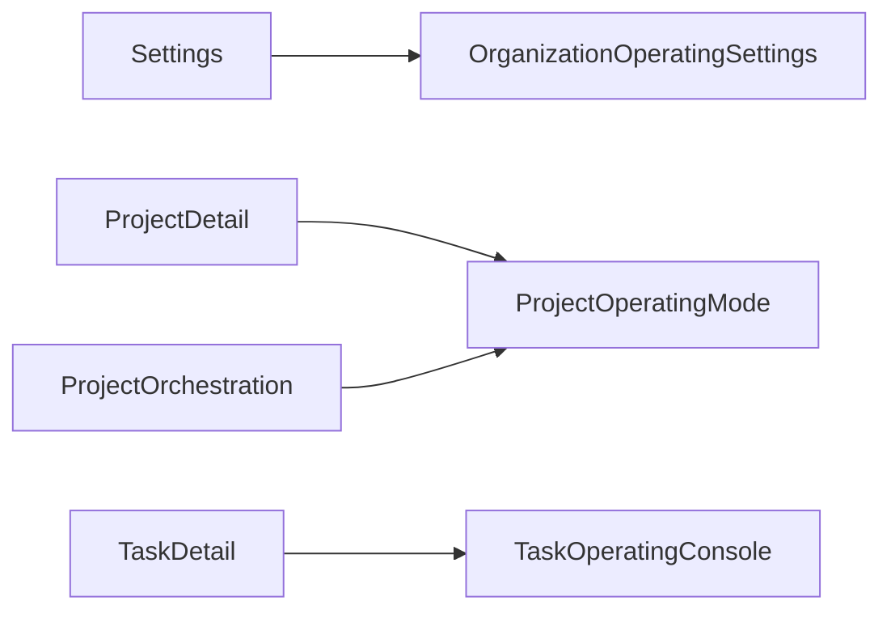

# 组织架构化 Agent 方案第 1 期前端页面草案

> 适用范围：组织架构化 Agent 方案第 1 期前端落地
>
> 目标：明确第 1 期新增页面、路由、页面职责、核心模块和 API 交互清单，作为前端实现起稿依据

## 1. 第 1 期范围

第 1 期前端只实现三张新增页面，并在现有页面上做最小入口挂接：

1. `OrganizationOperatingSettings`
2. `ProjectOperatingMode`
3. `TaskOperatingConsole`

不在第 1 期实现：

- `TaskOperatingOverride`
- `RecommendedScenarios`
- `BossOperationsCenter`

这些页面留到第 2 期和第 3 期再接入。

## 2. 新增路由草案

建议在 [control-plane/web-ui/src/router/index.ts](control-plane/web-ui/src/router/index.ts) 中新增：

1. `/settings/organization-operating`
组件：`../pages/OrganizationOperatingSettings.vue`

2. `/projects/:projectId/operating-mode`
组件：`../pages/ProjectOperatingMode.vue`

3. `/tasks/:taskId/operating-console`
组件：`../pages/TaskOperatingConsole.vue`

## 3. 新增页面清单

### 3.1 OrganizationOperatingSettings

建议文件：

- [control-plane/web-ui/src/pages/OrganizationOperatingSettings.vue](control-plane/web-ui/src/pages/OrganizationOperatingSettings.vue)

页面目标：

- 管理平台默认协作模式
- 管理平台默认自动托管等级
- 管理平台默认老板参与方式
- 预留推荐场景与升级规则展示位

页面结构草案：

1. 页面头部
内容：标题、副标题、返回设置页入口

2. 默认运行档位卡片
内容：

- 默认 `collaborationMode`
- 默认 `autopilotLevel`
- 默认 `bossParticipationMode`

1. 平台约束卡片
内容：

- 是否允许项目覆盖
- 是否允许任务覆盖
- 是否要求 `L2` 人工批准

1. 推荐场景预览卡片
内容：

- 小任务
- 跨系统改造
- 生产发布
- 安全修复

第 1 期控件草案：

- `a-page-header`
- `a-card`
- `a-form`
- `a-select`
- `a-switch`
- `a-table`
- `a-button`

### 3.2 ProjectOperatingMode

建议文件：

- [control-plane/web-ui/src/pages/ProjectOperatingMode.vue](control-plane/web-ui/src/pages/ProjectOperatingMode.vue)

页面目标：

- 展示项目当前运行档位
- 展示项目是否覆盖平台默认值
- 展示当前模板来源和推荐来源
- 提供项目级默认档位编辑能力

页面结构草案：

1. 页面头部
内容：项目名、返回项目详情、返回项目编排入口

2. 当前运行档位总览卡片
内容：

- 当前 `collaborationMode`
- 当前 `autopilotLevel`
- 当前 `bossParticipationMode`
- 来源：平台默认 / 项目默认

1. 模板与编排来源卡片
内容：

- 当前模板
- 模板来源
- 推荐来源

1. 项目默认档位编辑卡片
内容：

- 协作模式选择
- 自动托管等级选择
- 老板参与方式选择
- 是否允许混合模式升级

1. 说明卡片
内容：

- 当前配置如何影响任务运行
- 第 2 期会接入的推荐场景和任务级覆盖说明

### 3.3 TaskOperatingConsole

建议文件：

- [control-plane/web-ui/src/pages/TaskOperatingConsole.vue](control-plane/web-ui/src/pages/TaskOperatingConsole.vue)

页面目标：

- 展示任务当前运行档位
- 展示老板最近决策
- 展示升级请求
- 展示阶段摘要或当前阶段状态

页面结构草案：

1. 页面头部
内容：任务标题、返回任务详情入口

2. 当前运行档位卡片
内容：

- `collaborationMode`
- `autopilotLevel`
- `bossParticipationMode`
- 运行来源

1. 老板决策时间线卡片
内容：

- 最近 5 到 10 条决策
- 决策类型
- 决策原因
- 时间

1. 升级请求卡片
内容：

- 是否存在升级请求
- 请求原因
- 当前状态

1. 阶段状态卡片
内容：

- 当前阶段
- 当前阶段状态
- 是否阻断

## 4. 现有页面最小挂接清单

### 4.1 设置页入口

现有页面：

- [control-plane/web-ui/src/pages/Settings.vue](control-plane/web-ui/src/pages/Settings.vue)

第 1 期只新增：

- 一个“组织运行策略”入口卡片
- 跳转到 `/settings/organization-operating`

### 4.2 项目页入口

现有页面：

- [control-plane/web-ui/src/pages/ProjectDetail.vue](control-plane/web-ui/src/pages/ProjectDetail.vue)
- [control-plane/web-ui/src/pages/ProjectOrchestration.vue](control-plane/web-ui/src/pages/ProjectOrchestration.vue)

第 1 期只新增：

- “组织运行视图”入口
- 跳转到 `/projects/:projectId/operating-mode`

### 4.3 任务页入口

现有页面：

- [control-plane/web-ui/src/pages/TaskDetail.vue](control-plane/web-ui/src/pages/TaskDetail.vue)

第 1 期只新增：

- “组织运行详情”入口
- 跳转到 `/tasks/:taskId/operating-console`

## 5. API 交互清单

### 5.1 OrganizationOperatingSettings

读接口：

1. `GET /config/orchestration-strategy`
用途：读取 `organizationSettings`、`recommendedProfiles`

写接口：

1. `PUT /config/orchestration-strategy`
用途：更新平台默认运行策略

前端 API 建议新增：

1. 在 [control-plane/web-ui/src/lib/api.ts](control-plane/web-ui/src/lib/api.ts) 扩展 `OrchestrationStrategy`
2. 新增或复用 `getOrchestrationStrategy()`
3. 新增或复用 `updateOrchestrationStrategy()`

### 5.2 ProjectOperatingMode

读接口：

1. `GET /api/projects/:projectId`
用途：读取项目 settings

2. `GET /projects/:projectId/orchestration-view`
用途：读取当前模板、项目编排视图和扩展摘要

写接口：

1. `PATCH /api/projects/:projectId`
用途：更新项目默认运行档位

前端 API 建议新增：

1. 在 [control-plane/web-ui/src/lib/api.ts](control-plane/web-ui/src/lib/api.ts) 补 `ProjectOrganizationSettings` 类型
2. 扩展现有 `getProject` / `updateProject` 返回与入参
3. 保留 `getProjectOrchestrationView()` 用于解释性展示

### 5.3 TaskOperatingConsole

读接口：

1. `GET /api/tasks/:taskId`
用途：读取任务 strategy 中的运行档位字段

2. `GET /api/tasks/:taskId/boss-decisions`
用途：读取老板决策记录

3. `GET /api/tasks/:taskId/escalations`
用途：读取升级请求记录

前端 API 建议新增：

1. 在 [control-plane/web-ui/src/lib/api.ts](control-plane/web-ui/src/lib/api.ts) 增加 `BossDecisionRecord` 类型
2. 增加 `HumanEscalationRequest` 类型
3. 增加 `getTaskBossDecisions(taskId)`
4. 增加 `getTaskEscalations(taskId)`

## 6. 状态管理建议

### 6.1 页面级状态

第 1 期建议优先使用页面内 `ref` / `reactive` 管理，不急于引入新 store。

适合页面内管理的状态：

- 加载状态
- 表单状态
- 只在单页内生效的筛选状态

### 6.2 可复用状态

若后续多个页面共享，可在第 2 期考虑扩展：

- [control-plane/web-ui/src/stores/project.ts](control-plane/web-ui/src/stores/project.ts)
- [control-plane/web-ui/src/stores/task-monitor.ts](control-plane/web-ui/src/stores/task-monitor.ts)

## 7. 页面间跳转关系

## 8. 第 1 期新增文件清单

建议新增：

1. `control-plane/web-ui/src/pages/OrganizationOperatingSettings.vue`
2. `control-plane/web-ui/src/pages/ProjectOperatingMode.vue`
3. `control-plane/web-ui/src/pages/TaskOperatingConsole.vue`

建议修改：

1. [control-plane/web-ui/src/router/index.ts](control-plane/web-ui/src/router/index.ts)
2. [control-plane/web-ui/src/lib/api.ts](control-plane/web-ui/src/lib/api.ts)
3. [control-plane/web-ui/src/pages/Settings.vue](control-plane/web-ui/src/pages/Settings.vue)
4. [control-plane/web-ui/src/pages/ProjectDetail.vue](control-plane/web-ui/src/pages/ProjectDetail.vue)
5. [control-plane/web-ui/src/pages/ProjectOrchestration.vue](control-plane/web-ui/src/pages/ProjectOrchestration.vue)
6. [control-plane/web-ui/src/pages/TaskDetail.vue](control-plane/web-ui/src/pages/TaskDetail.vue)

## 9. 第 1 期验收口径

满足以下条件即可认为第 1 期前端草案进入可实施状态：

1. 三个新增页面的路由、职责和 API 已明确
2. 现有页面只保留最小入口挂接，不承载复杂新布局
3. 平台、项目、任务三层视图语义清晰，没有混放
4. API 交互清单足够支撑前后端并行开发

## 10. 总结

第 1 期前端页面草案的重点，不是一次性把组织架构化能力完整做满，而是先用三张新增页面把平台设置、项目查看、任务查看三层闭环跑通，并把未来第 2 期、第 3 期的扩展空间预留出来。
