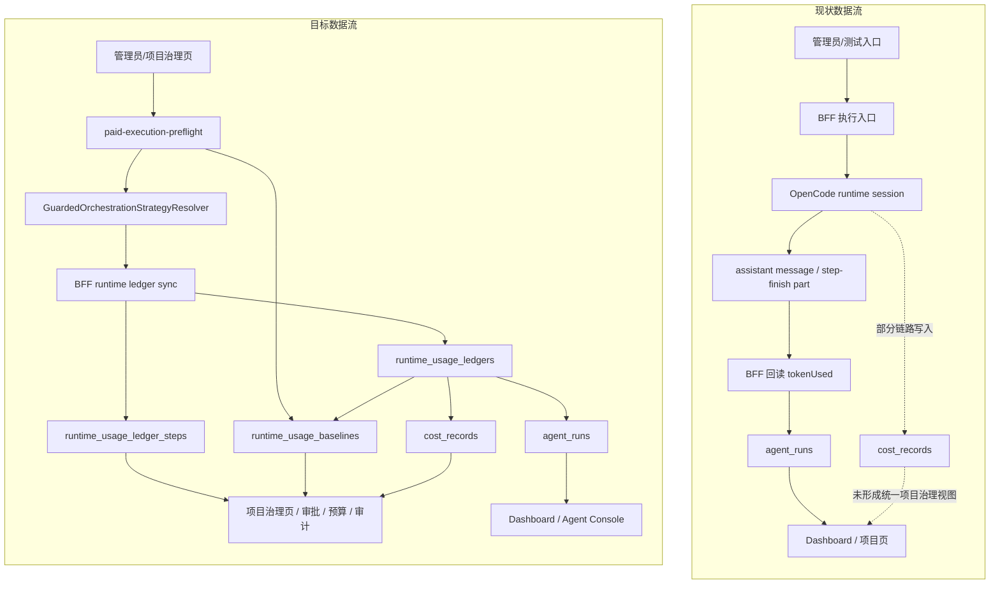

# 付费模型请求强约束治理方案

## 1. 文档目标

本文档用于解决一个明确问题：

- 由于测试误触发或编排配置残留，系统可能在短时间内对付费模型发起大量真实请求，造成不可接受的成本放大。

本方案的目标不是“更好地观察成本”，而是把约束前置到执行前和执行中，形成真正的硬闸，确保类似事件未来不能再次以同样方式发生。

本文档覆盖：

- 事故根因归纳
- 强制治理原则
- 运行前、运行中、运行后的控制点
- 测试环境与真实执行隔离方案
- 分阶段落地计划与验收标准

相关文档：

- [docs/architecture-overview.md](docs/architecture-overview.md)
- [docs/approval-standards-management-plan.md](docs/approval-standards-management-plan.md)
- [docs/multi-agent-hook-architecture.md](docs/multi-agent-hook-architecture.md)
- [docs/dashboard-provider-token-stats-plan.md](docs/dashboard-provider-token-stats-plan.md)
- [docs/raw-audit-trace-plan.md](docs/raw-audit-trace-plan.md)
- [tests/README.md](../tests/README.md)

> 状态更新（2026-04-05）：本文中大量 `agent_runs` 提法属于删除前设计上下文。当前 schema 已删除 `agent_runs` 物理表；Dashboard provider token 聚合已改为读取 `runtime_usage_ledgers`，`agentRunId` 仅作为兼容标识继续存在。因此，本文凡把 `agent_runs` 写成“当前稳定真值源”或“现行运营主表”的段落，都应按历史口径理解，当前实现应以 `runtime_usage_ledgers`、`runtime_usage_ledger_steps` 与 canonical task-domain 表为准。

## 2. 背景与事故复盘

本次问题不是单点故障，而是多个因素叠加后产生的请求放大：

1. 真实执行集成测试会串行触发多组真实运行用例。
2. 编排策略存在持久化状态，测试会继承当前策略，而不是总是从安全默认值开始。
3. 并行候选、judge、post-hook 会把一次逻辑执行放大成多次真实模型调用。
4. 当前系统虽已有成本、预算、审批、审计基础，但尚未把“付费模型请求上限”做成执行前硬约束。
5. 当前默认更偏“可配置”和“可观察”，不够“默认安全”。

从现状可见，以下路径尤其危险：

- BFF 真实执行集成脚本 [control-plane/web-ui-bff/package.json](../control-plane/web-ui-bff/package.json)
- 真实执行测试入口 [tests/README.md](../tests/README.md)
- 持久化编排策略默认载体 [opencode-fork/.opencode/state/orchestration-strategy.json](../opencode-fork/.opencode/state/orchestration-strategy.json)
- 设置页中的并行模板、judge、hooks 配置 [control-plane/web-ui/src/pages/Settings.vue](../control-plane/web-ui/src/pages/Settings.vue)

因此，这个问题的本质不是“某次测试点错了”，而是：

**系统缺少一条面向付费模型的执行级强约束链路。**

## 3. 目标

本方案要求未来系统满足以下结果：

1. 非显式授权场景下，测试环境不得对付费模型发起批量真实请求。
2. 即使有人误开并行、judge、hooks，也不能在未通过预算校验时放大成真实付费流量。
3. 每次真实付费执行都必须可追溯到：谁触发、为何允许、预计上限、实际消耗、何时被中止。
4. 一旦请求数或成本出现异常突增，系统必须自动熔断，而不是继续运行。
5. 默认配置必须偏向单执行、低成本、可回滚，而不是高吞吐实验模式。

## 4. 非目标

本方案不做以下事情：

- 不以“事后报表”替代“事前阻断”
- 不依赖人工记忆来避免误操作
- 不把所有付费模型彻底禁用
- 不要求每次正常开发都走人工审批
- 不公开内部策略配方或模型路由细节

## 5. 核心原则

### 5.1 默认安全优先于默认灵活

只要当前执行上下文无法明确证明“这次请求是受控且被允许的”，系统就应默认拒绝真实付费模型调用。

### 5.2 预算约束必须前置到执行前

预算、审批、模型等级判断必须在会话创建前完成，不能等模型已经请求出去再记账。

### 5.3 付费流量必须以执行预算而不是页面配置来管控

设置页上的模板、hook、judge、并行数都只是配置来源，真正决定能否执行的应是统一的执行预算评估器。

### 5.4 测试环境必须默认隔离真实付费能力

测试默认跑 mock、免费模型或低成本模型。只有显式开启的“真实执行窗口”才允许接触付费模型。

### 5.5 熔断必须是自动动作

一旦命中阈值，系统应直接拒绝后续请求、终止剩余 candidate、写入审计事件，并给出明确原因。

### 5.6 先估后发必须可见

在任何真实付费请求真正发出前，管理员都应先看到一份保守预估，至少包括：

- 预计会发起多少次模型请求
- 预计输入 token 范围
- 预计输出 token 范围
- 预计总 token 上界
- 预计成本区间
- 这些估算是由哪些放大因子推导出来的

这不是可选增强，而是执行许可的一部分。管理员看不到预估，就不应允许高成本真实执行继续发出。

## 6. 风险来源拆解

### 6.1 测试脚本层风险

当前完整真实执行脚本会连续运行 4 组真实用例：

- completion sync
- identity execute
- hooks integration
- workflow evaluation

它们在单次入口中叠加，天然存在请求次数和运行时间放大。

### 6.2 编排层风险

现有多 Agent 编排设计允许：

- parallel candidate
- judge
- pre/post hook
- pipeline 扩展链路

其中并行 candidate 的成本随候选数近似线性增长，[docs/multi-agent-hook-architecture.md](docs/multi-agent-hook-architecture.md) 已明确指出这一风险，但当前缺少强制执行的上限机制。

### 6.3 持久化状态风险

编排策略存储在状态文件中，测试和日常运行都会读取该状态。如果系统未在高风险入口上附加安全覆盖层，非默认策略会泄漏进测试流量。

### 6.4 治理闭环不足

现有架构已经具备：

- 成本记录
- 预算配置
- 审批标准
- 审计事件

但根据 [docs/architecture-overview.md](docs/architecture-overview.md) 的判断，这些能力尚未与运行时内核形成强约束闭环。

## 7. 方案总览

本方案新增一条从“配置入口”到“请求发出”之间的统一治理链：

1. 模型分级与环境策略
2. 执行前成本预估
3. 真实执行白名单/租约
4. 编排放大保护
5. 运行中熔断
6. 审计与告警

其核心思路是：

**所有付费模型请求都必须先经过一层独立的 Paid Model Guard，而不是直接相信当前 orchestration strategy。**

## 8. 详细方案

### 8.1 建立模型分级与环境准入策略

新增统一的模型治理配置 `ModelExecutionPolicy`，至少包含：

- `providerId`
- `modelId`
- `costTier`: `free | low | medium | high | premium`
- `isPaid`
- `allowedEnvironments`: `dev | test | staging | prod`
- `defaultDecision`: `allow | require-lease | require-approval | deny`
- `maxRequestsPerRun`
- `maxEstimatedCostUsdPerRun`
- `maxParallelCandidates`
- `allowJudge`
- `allowHooks`

其中：

- `test` 环境下对 `isPaid = true` 的模型默认不应是 `allow`
- 高成本模型应默认 `require-lease` 或 `require-approval`
- 未命中策略的模型默认按 `deny` 处理

### 8.2 引入执行前预算评估器

在 BFF 创建真实运行前增加 `ExecutionCostGuard`，输入为：

- 当前环境
- 任务类型
- 测试/用户触发来源
- 模型策略
- orchestration strategy
- 命中的 workflow template
- hook 数量
- judge 是否启用
- candidate 数量
- 预计测试套件数量

输出为：

- `allow`
- `allow-with-downgrade`
- `require-approval`
- `deny`

同时输出一份 `ExecutionPreflightEstimate`，供管理员和系统共同使用。建议至少包含：

- `estimatedRequestsMin`
- `estimatedRequestsMax`
- `estimatedInputTokensMin`
- `estimatedInputTokensMax`
- `estimatedOutputTokensMin`
- `estimatedOutputTokensMax`
- `estimatedTotalTokensMin`
- `estimatedTotalTokensMax`
- `estimatedCostUsdMin`
- `estimatedCostUsdMax`
- `drivers`: 触发本次估算的关键因子列表
- `assumptions`: 使用的基线假设
- `guardDecision`
- `guardReason`

评估器必须计算一个保守上界，而不是乐观值。建议公式：

$$
estimatedRequests = baseExecutions \times candidateMultiplier \times hookMultiplier + judgeRequests
$$

建议同时给出 token 预估：

$$
estimatedTotalTokensUpperBound = estimatedRequests \times baselineTokensPerRequest \times safetyFactor
$$

其中：

- `baselineTokensPerRequest` 来自最近同模型、同任务类型、同执行模式的历史中位数
- 若无历史数据，则采用该模型策略中的保守默认值
- `safetyFactor` 默认应大于 1，用于覆盖 prompt 漂移、上下文增长和失败重试

其中：

- `baseExecutions` 是本次入口预计会触发的真实执行次数
- `candidateMultiplier` 至少为 `max(1, enabledParallelCandidates)`
- `hookMultiplier` 至少为 `1 + enabledHookExecutions`
- `judgeRequests` 在启用时至少记为 `1`

`drivers` 中应至少明确展示：

- 命中的 workflow template
- parallel candidate 数
- 是否启用 judge
- 会产生模型调用的 hook 数量
- 入口是单任务、单测试还是整组 suite
- 当前选中的 provider / model

若 `estimatedRequests` 或 `estimatedCost` 超过当前策略阈值，则直接拒绝，不允许进入 runtime。

管理员视角的关键要求是：

1. 不是只看到“允许/拒绝”。
2. 而是要在执行前看到“为什么大约会打这么多次模型、为什么大约会吃这么多 token”。
3. 对高成本请求，必须显式展示上界，而不是只展示平均值。

### 8.3 为真实付费执行增加“租约”机制

对测试环境的真实付费执行增加短时租约 `PaidExecutionLease`，没有租约不得执行。

建议字段：

- `leaseId`
- `createdBy`
- `reason`
- `environment`
- `allowedProviders`
- `allowedModels`
- `maxRequests`
- `maxCostUsd`
- `expiresAt`
- `scope`: `single-run | time-window | suite`

关键规则：

1. `test` 环境中，真实付费执行必须绑定有效租约。
2. 租约默认只允许单次运行，不允许无限复用。
3. 租约到期或额度耗尽后，后续请求自动拒绝。
4. 没有租约时，即使脚本设置 `RUN_EXECUTION_INTEGRATION=1`，也不能请求付费模型。

### 8.4 对编排策略增加付费模型安全覆盖层

当执行目标命中付费模型且未显式获得高阶许可时，系统应对运行时策略做安全收敛，而不是原样使用持久化策略：

- 强制模板切换到 `default-single`
- 强制 `maxParallelCandidates = 1`
- 强制 `judge.enabled = false`
- 强制禁用 `post-execution` hooks
- 默认禁用所有会产生追加模型调用的扩展 hook

这意味着：

- 持久化策略文件仍可保留实验配置
- 但真实付费执行不会无条件继承这些配置
- 高风险配置必须通过 guard 二次许可才可生效

### 8.5 把测试入口改为双门控

当前只有 `RUN_EXECUTION_INTEGRATION=1` 还不够，未来应改成至少双门控：

1. 测试级门控：表明这次允许真实执行
2. 付费级门控：表明这次允许触碰付费模型

建议引入：

- `RUN_EXECUTION_INTEGRATION=1`
- `ALLOW_PAID_MODEL_EXECUTION=1`
- `PAID_EXECUTION_LEASE_ID=...`

没有三者同时满足时：

- 要么直接跳过真实付费用例
- 要么自动降级到免费/低成本模型
- 绝不能悄悄使用当前默认付费模型继续执行

### 8.6 增加运行中熔断器

即使执行前通过校验，也必须在运行中实时累计：

- `requestCount`
- `inputTokens`
- `outputTokens`
- `estimatedCost`
- `elapsedMs`

当任一指标超过租约或策略阈值时，立即触发：

1. 拒绝创建后续 candidate session
2. 中止正在排队的 hook/judge 请求
3. 主动终止当前运行
4. 写入 `budget.hit` / `policy.hit` / `execution.aborted` 审计事件
5. 将任务状态标记为 `blocked` 或 `cancelled-by-guard`

熔断器必须作用在 BFF 和 runtime 适配层之间，而不是只在 UI 上提示。

### 8.7 增加异常放大检测

除显式预算外，再增加“异常斜率”检测：

- 同一 task 在短窗口内请求数突增
- 同一 suite 在单次执行中产生超常模型调用
- 同一用户在短时间内连续触发多个真实执行入口

建议默认阈值：

- 单个 run 超过 5 次付费模型请求即触发二级检查
- 单个 suite 超过 10 次付费模型请求即直接熔断
- 单用户 10 分钟内超过 3 次真实付费 suite 触发即锁定后续入口

这些值应可配置，但必须有安全默认值。

### 8.8 把审批标准接入“付费模型放量”场景

将以下场景纳入审批标准体系，而不是只看代码改动：

- 高成本模型在 `test` 环境执行
- 开启 parallel + judge 的付费执行
- 单次运行预计成本超过阈值
- 单日项目预算接近耗尽仍继续请求高成本模型

审批动作建议支持：

- `audit_only`
- `require_approval`
- `block_only`

但对测试环境的高成本真实执行，默认应偏向 `require_approval` 或 `block_only`，不应仅 `audit_only`。

### 8.9 建立付费模型专用审计字段

在原始审计流中补充以下事实字段：

- `executionMode`: mock / low-cost-real / paid-real
- `costTier`
- `leaseId`
- `estimatedRequestUpperBound`
- `estimatedCostUpperBound`
- `actualRequestCount`
- `actualTokenUsage`
- `actualCost`
- `guardDecision`
- `guardReason`
- `guardOverridesApplied`

这样未来出现争议时，系统能清楚回答：

1. 为什么允许执行
2. 为什么没有阻断
3. 是否发生了自动降级或自动熔断
4. 谁在什么上下文下开启了真实付费执行

### 8.10 首页与告警侧补齐运营可见性

在已有 provider token 统计规划基础上，增加付费风险视图：

- 最近 24h 付费模型请求次数
- 最近 24h 被 guard 拦截次数
- 最近 24h 熔断次数
- 当前活跃租约数
- 近 7 天最贵任务 Top N

同时增加告警：

- 短窗口请求异常放大
- 测试环境出现付费模型真实请求
- 无租约请求被拒绝
- guard override 使用次数异常

除事后视图外，还应增加“执行前预估视图”，并明确以项目管理页面为主要入口。

建议主入口放在项目管理页下的项目设置 / 治理区域，而不是散落在全局 Settings：

- `/projects/:projectId?tab=settings`
- 或项目详情页中的 `ProjectSettingsPanel`
- 或项目级治理页，例如预算 / 审批 / 编排策略联动区域

只有在项目管理页明确展示后，管理员才能在管理具体项目时直接判断：

- 当前项目若按现有配置运行，会大约请求多少次模型
- 当前项目若开启真实执行，会大约消耗多少 token
- 当前项目有哪些配置在放大成本

在此基础上，以下位置可以作为二级展示入口：

- 测试环境真实执行确认页
- 管理员手动触发高成本任务的确认弹层
- orchestration strategy 高风险变更的预览区

该视图至少显示：

- 本次大约会请求多少次模型
- 本次大约会消耗多少 token
- 哪些配置导致放大
- 当前 guard 是否会自动降级、阻断或要求审批

也就是说，管理员不仅要在事后看到用了多少，还必须在事前看到大约将会用多少。

## 9. 分层落地建议

### 9.1 P0：立即止血

目标：在不大改架构的情况下，先避免再次发生同类事故。

要求：

1. 将测试环境默认执行模式固定为单执行。
2. 对付费模型默认关闭 parallel、judge、post-hook。
3. 将真实执行测试入口改为双门控。
4. 未显式开启时，自动降级到免费或低成本模型。
5. 为完整执行集成脚本增加显式风险提示与上限说明。

### 9.2 P1：执行前强约束

目标：在 BFF 引入统一的 `ExecutionCostGuard`。

要求：

1. 所有真实运行入口统一走预算评估。
2. 所有付费模型请求都要经过环境准入判断。
3. 高风险执行必须带租约或审批。
4. guard 拒绝时不得创建 runtime session。

### 9.3 P2：运行中熔断与审计闭环

目标：把预算和熔断从“准入”扩展到“过程控制”。

要求：

1. 运行中累计请求、token、成本。
2. 命中阈值后立即终止剩余执行。
3. 审计流完整记录 guard 决策与实际消耗。
4. 首页和治理页能看到被拦截和被熔断的事实。

### 9.4 P3：组织级预算治理

目标：把限制提升到项目级、组织级和时间窗口级。

要求：

1. 支持项目日预算、月预算。
2. 支持用户级测试预算。
3. 支持组织级高成本模型总配额。
4. 支持自动降级策略，而不是只有硬拒绝。

## 10. 具体实现建议

### 10.1 Service

建议新增或扩展：

- `model_execution_policies`
- `paid_execution_leases`
- `guard_events`
- `budget_configs` 扩展字段
- `cost_records` 与 `agent_runs` 的关联补强

### 10.1.1 统计口径与数据真值分层

本次方案必须先明确“模型请求数据从哪一层开始统计”，否则后续会继续出现：

- 首页看的是一套数字
- 项目治理页看的是另一套数字
- runtime 底层实际消耗又是第三套数字

本文成稿时，仓库内至少存在三层数据口径：

1. `agent_runs`
2. `cost_records`
3. OpenCode runtime session/message/part usage ledger

它们的职责必须明确区分。

#### A. `agent_runs`：历史方案中的控制面聚合口径

本文成稿时，首页与 provider token 总览的已验证口径曾以 `agent_runs.token_used` 为基础。

这层的特点是：

- 统计起点是 `agent run`，不是 provider 原始请求
- 一次 agent run 内可能包含多次底层模型调用
- 当时的 provider 统计本质上是“按 run 聚合的 token 消耗”
- 在当时适合首页、Agent 运营中心、项目运行看板的稳定展示

因此，`agent_runs` 可以回答的问题是：

- 哪个项目 / 哪个 provider / 哪个模型大致更贵
- 哪类 run 的 token 消耗异常偏高
- 当时窗口内 run 级别的消耗趋势如何

但它不能精确回答：

- 本次执行到底触发了几次底层模型请求
- 每一次请求分别用了多少 input / output token
- parallel / judge / hook 各自额外放大了多少底层请求

#### B. `cost_records`：控制面成本账本口径

`cost_records` 比 `agent_runs` 更接近“成本事实账本”，因为它已经具备：

- `provider_id`
- `model_id`
- `input_tokens`
- `output_tokens`
- `cost`

但在该历史方案阶段，不应直接把它当成唯一真值源，原因是：

- 覆盖面是否完整，当时还未对所有真实执行路径完成验证
- 与当时首页使用的 `agent_runs` 聚合口径尚未完全收敛
- 如果直接混用，项目治理页和首页可能出现数字不一致

因此本方案建议：

- 历史 Phase 1：首页和当时运营视图继续以 `agent_runs` 兼容聚合作为展示口径
- Phase 2：在验证链路覆盖后，让 `cost_records` 成为控制面成本事实层

#### C. OpenCode runtime ledger：底层 usage 原始记录

OpenCode runtime 底层是有 usage / cost 相关记录的，而且粒度比 `agent_runs` 更细。

已确认的事实：

- runtime 在 step finish 阶段会根据 provider 返回的 usage 计算 token 与 cost
- 这些数据会写入 assistant message 元数据
- 也会写入 step-finish part 元数据
- 本地持久化结构是 session / message / part 三层

这意味着 runtime 底层已经具备：

- 单次 step 级别的 token 使用
- 单次 step 级别的 cost
- assistant message 级别的累计 tokens / cost

但本文成稿时，OpenerX 对这层数据的使用方式仍然偏“回填”，而不是“统一记账”：

- 当时 BFF 会在 `agent_runs.tokenUsed` 缺失时，从 runtime session messages 里回读 token 使用
- 当时没有项目治理专用的 runtime usage ledger 读取接口
- 当时也没有把“底层请求次数”作为正式治理指标输出到项目页

#### D. 本方案的目标口径

为了解决“执行前预估不准”和“执行后追责不清”的问题，本方案定义三层真值分工：

- `agent_runs`：历史方案中的运营展示层；按当前实现应理解为兼容 `agentRunId` 读模型，而不是独立物理表
- `cost_records`：控制面成本事实层，用于预算、审批、结算、审计
- runtime usage ledger：底层执行事实层，用于回答“实际打了几次模型、每一步消耗多少 token、哪一个 hook / judge 放大了请求”

#### E. 对项目治理页的直接要求

项目治理页中的“执行前预估”和“执行后回放”必须分别绑定不同层级：

- 执行前预估
  - 以 orchestration 配置 + template 配置 + runtime 历史 usage 基线推导
  - 不能只看 `agent_runs` 历史平均值
- 执行后回放
  - 必须能够下钻到 runtime usage ledger
  - 展示本次执行的底层请求次数、token 分项和放大来源

#### F. 迁移策略

建议分三步落地：

1. 按本文历史方案的 Phase 1，保持当时 Dashboard 继续使用 `agent_runs` 兼容聚合，不打断现有运营视图。
2. 在 BFF 增加 project-scoped execution ledger 聚合，把 runtime session/message/part usage 提炼为项目级可消费结构。
3. 在验证完整后，将 `cost_records` 与 runtime ledger 做一一关联，形成统一的治理账本。

只有这样，管理员在项目管理页看到的“预计请求次数 / token / 成本”，才会和执行后审计结果保持可解释的一致性。

### 10.1.2 现状数据流 / 目标数据流

为了避免后续拆分任务时继续把 `agent_runs`、`cost_records` 和 runtime 原始 usage 混为一谈，建议先把现状链路与目标链路明确成两张对照图。



这张对照图表达的核心约束是：

- 该历史现状链路里，项目页看到的多数还是 `agent_runs` 聚合结果
- 目标链路里，项目治理与执行前预估必须先读取 `runtime_usage_ledgers` / `runtime_usage_ledger_steps` / `runtime_usage_baselines`
- 在该历史方案里，`agent_runs` 继续承担运营展示，不再承担“底层请求事实账本”的职责

### 10.1.3 runtime usage ledger 表结构草案

建议不要直接在 runtime 本地库上做项目页查询，而是在控制面落一层可治理的投影表。这样才能稳定支撑项目页、审批、预算和审计查询。

建议新增三张表：

1. `runtime_usage_ledgers`：一次执行的 ledger 头记录
2. `runtime_usage_ledger_steps`：一次执行内逐步模型调用明细
3. `runtime_usage_baselines`：为预估接口服务的基线聚合表

#### A. `runtime_usage_ledgers`

用途：

- 对齐一次 task execution / agent run / runtime session 的总体账本
- 给项目治理页提供“本次执行到底打了多少次模型”的主查询入口
- 作为 `cost_records`、`agent_runs`、审批记录的关联锚点

建议字段：

```sql
CREATE TABLE runtime_usage_ledgers (
  id TEXT PRIMARY KEY,
  project_id TEXT NOT NULL,
  task_id TEXT,
  task_session_id TEXT,
  agent_run_id TEXT,
  runtime_session_id TEXT NOT NULL,
  execution_source TEXT NOT NULL,
  entrypoint_type TEXT NOT NULL,
  orchestration_strategy_version TEXT,
  orchestration_fingerprint TEXT,
  default_provider_id TEXT,
  default_model_id TEXT,
  request_count INTEGER NOT NULL DEFAULT 0,
  step_count INTEGER NOT NULL DEFAULT 0,
  input_tokens INTEGER NOT NULL DEFAULT 0,
  output_tokens INTEGER NOT NULL DEFAULT 0,
  reasoning_tokens INTEGER NOT NULL DEFAULT 0,
  cache_read_tokens INTEGER NOT NULL DEFAULT 0,
  cache_write_tokens INTEGER NOT NULL DEFAULT 0,
  total_tokens INTEGER NOT NULL DEFAULT 0,
  cost_usd REAL NOT NULL DEFAULT 0,
  candidate_count INTEGER NOT NULL DEFAULT 1,
  judge_request_count INTEGER NOT NULL DEFAULT 0,
  hook_request_count INTEGER NOT NULL DEFAULT 0,
  suite_case_count INTEGER,
  status TEXT NOT NULL,
  started_at TEXT,
  finished_at TEXT,
  synced_at TEXT,
  created_at TEXT NOT NULL,
  updated_at TEXT NOT NULL
);

CREATE INDEX idx_runtime_usage_ledgers_project_time
ON runtime_usage_ledgers(project_id, created_at DESC);

CREATE INDEX idx_runtime_usage_ledgers_agent_run
ON runtime_usage_ledgers(agent_run_id);

CREATE UNIQUE INDEX idx_runtime_usage_ledgers_runtime_session
ON runtime_usage_ledgers(runtime_session_id);
```

字段说明：

- `execution_source`：例如 `task-execute`、`workflow-evaluation`、`integration-test`、`manual-run`
- `entrypoint_type`：例如 `single-task`、`suite`、`hook-only`、`judge-only`
- `orchestration_fingerprint`：把 parallel、judge、hook、candidate 数等编排因子固化为可复用签名
- `request_count`：底层 provider 请求次数，不再复用 `agent_runs` 粒度
- `judge_request_count` / `hook_request_count`：为放大来源拆解直接服务

#### B. `runtime_usage_ledger_steps`

用途：

- 存放逐步的 provider 调用明细
- 支撑“这次为什么从 1 次放大到 6 次”的回放分析
- 为后续审计与异常定位保留可解释链路

建议字段：

```sql
CREATE TABLE runtime_usage_ledger_steps (
  id TEXT PRIMARY KEY,
  ledger_id TEXT NOT NULL,
  runtime_message_id TEXT,
  runtime_part_id TEXT,
  parent_step_id TEXT,
  sequence_no INTEGER NOT NULL,
  phase_type TEXT NOT NULL,
  step_type TEXT NOT NULL,
  provider_id TEXT,
  model_id TEXT,
  request_key TEXT,
  prompt_cache_hit INTEGER NOT NULL DEFAULT 0,
  input_tokens INTEGER NOT NULL DEFAULT 0,
  output_tokens INTEGER NOT NULL DEFAULT 0,
  reasoning_tokens INTEGER NOT NULL DEFAULT 0,
  cache_read_tokens INTEGER NOT NULL DEFAULT 0,
  cache_write_tokens INTEGER NOT NULL DEFAULT 0,
  total_tokens INTEGER NOT NULL DEFAULT 0,
  cost_usd REAL NOT NULL DEFAULT 0,
  latency_ms INTEGER,
  candidate_index INTEGER,
  hook_name TEXT,
  judge_reason TEXT,
  status TEXT NOT NULL,
  started_at TEXT,
  finished_at TEXT,
  metadata_json TEXT,
  created_at TEXT NOT NULL,
  updated_at TEXT NOT NULL,
  FOREIGN KEY (ledger_id) REFERENCES runtime_usage_ledgers(id)
);

CREATE INDEX idx_runtime_usage_ledger_steps_ledger_seq
ON runtime_usage_ledger_steps(ledger_id, sequence_no);

CREATE INDEX idx_runtime_usage_ledger_steps_phase
ON runtime_usage_ledger_steps(ledger_id, phase_type, step_type);
```

建议 `phase_type` 枚举至少覆盖：

- `primary`
- `candidate`
- `judge`
- `hook`
- `retry`
- `repair`

建议 `step_type` 枚举至少覆盖：

- `plan`
- `execute`
- `review`
- `summarize`
- `tool-continue`
- `post-hook`

#### C. `runtime_usage_baselines`

用途：

- 为项目管理页中的执行前预估提供稳定基线
- 避免每次打开项目页都实时扫 ledger 明细
- 支持按项目、模型、编排签名、入口类型做分层估算

建议字段：

```sql
CREATE TABLE runtime_usage_baselines (
  id TEXT PRIMARY KEY,
  project_id TEXT NOT NULL,
  entrypoint_type TEXT NOT NULL,
  execution_source TEXT NOT NULL,
  orchestration_fingerprint TEXT NOT NULL,
  provider_id TEXT,
  model_id TEXT,
  sample_size INTEGER NOT NULL DEFAULT 0,
  p50_request_count REAL,
  p90_request_count REAL,
  p50_input_tokens REAL,
  p90_input_tokens REAL,
  p50_output_tokens REAL,
  p90_output_tokens REAL,
  p50_total_tokens REAL,
  p90_total_tokens REAL,
  p50_cost_usd REAL,
  p90_cost_usd REAL,
  last_ledger_at TEXT,
  generated_at TEXT NOT NULL,
  created_at TEXT NOT NULL,
  updated_at TEXT NOT NULL
);

CREATE INDEX idx_runtime_usage_baselines_project_lookup
ON runtime_usage_baselines(
  project_id,
  entrypoint_type,
  orchestration_fingerprint,
  generated_at DESC
);
```

这张表是“预估层”，不是原始事实层，
必须由 `runtime_usage_ledgers` /
`runtime_usage_ledger_steps` 回刷生成。

### 10.1.4 runtime usage ledger 接口草案

建议把接口分成三类：

1. 同步接口：把 runtime session/message/part 投影到控制面 ledger
2. 查询接口：给项目管理页、任务详情、审计页稳定读取
3. 预估接口：基于 baseline 生成执行前预估

#### A. Service 内部接口

建议新增以下内部接口：

- `POST /internal/runtime-usage-ledgers/sync`
- `GET /internal/runtime-usage-ledgers/:ledgerId`
- `GET /internal/runtime-usage-ledgers/:ledgerId/steps`
- `GET /internal/projects/:projectId/runtime-usage-ledger/summary`
- `GET /internal/projects/:projectId/runtime-usage-ledger/executions`
- `POST /internal/projects/:projectId/runtime-usage-baselines/rebuild`

职责建议：

- `sync`
  - 由 BFF 在 session 完成、agent run 完成或补偿任务中调用
  - 输入 runtime session id、project id、task id、agent run id
  - 输出 ledger id、同步状态、聚合 totals
- `summary`
  - 返回项目级过去 24h / 7d / 30d 的 request / token / cost 汇总
  - 用于项目治理页顶部摘要
- `executions`
  - 返回 ledger 列表，支持按 task、model、phase 放大来源过滤
  - 用于“执行后回放”列表
- `rebuild`
  - 由异步任务或管理动作触发，回刷 baseline 聚合

建议 `POST /internal/runtime-usage-ledgers/sync` 请求体：

```ts
interface RuntimeUsageLedgerSyncRequest {
  projectId: string;
  taskId?: string;
  taskSessionId?: string;
  agentRunId?: string;
  runtimeSessionId: string;
  executionSource:
    | "task-execute"
    | "workflow-evaluation"
    | "integration-test"
    | "manual-run";
  entrypointType: "single-task" | "suite" | "hook-only" | "judge-only";
  orchestrationFingerprint?: string;
  forceResync?: boolean;
}

interface RuntimeUsageLedgerSyncResponse {
  ledgerId: string;
  status: "created" | "updated" | "noop";
  requestCount: number;
  totalTokens: number;
  costUsd: number;
  syncedAt: string;
}
```

#### B. BFF 对外接口

建议在项目级 API 下补齐以下接口：

- `GET /api/projects/:projectId/runtime-usage-ledger/summary`
- `GET /api/projects/:projectId/runtime-usage-ledger/executions`
- `GET /api/projects/:projectId/runtime-usage-ledger/executions/:ledgerId`
- `GET /api/projects/:projectId/runtime-usage-ledger/executions/:ledgerId/steps`

用途建议：

- `summary`
  - 项目治理页顶部摘要
  - 展示最近窗口内实际请求次数、token、成本、放大来源占比
- `executions`
  - 项目治理页“执行后回放”列表
  - 用于按任务、模型、来源筛选
- `:ledgerId`
  - 返回某次执行总账信息
- `:ledgerId/steps`
  - 返回逐步请求明细，直接服务“为什么这次请求变多了”

建议 `GET /api/projects/:projectId/runtime-usage-ledger/summary` 返回：

```ts
interface ProjectRuntimeUsageLedgerSummary {
  projectId: string;
  range: "24h" | "7d" | "30d";
  totals: {
    executionCount: number;
    requestCount: number;
    inputTokens: number;
    outputTokens: number;
    totalTokens: number;
    costUsd: number;
  };
  amplificationBreakdown: {
    primaryRequests: number;
    candidateRequests: number;
    judgeRequests: number;
    hookRequests: number;
    retryRequests: number;
  };
  topRiskExecutions: Array<{
    ledgerId: string;
    taskId?: string;
    title: string;
    requestCount: number;
    totalTokens: number;
    costUsd: number;
    dominantDriver: string;
    finishedAt?: string;
  }>;
  generatedAt: string;
}
```

建议
`GET /api/projects/:projectId/runtime-usage-ledger/executions/:ledgerId/steps`
返回：

```ts
interface RuntimeUsageLedgerStepView {
  id: string;
  sequenceNo: number;
  phaseType:
    | "primary"
    | "candidate"
    | "judge"
    | "hook"
    | "retry"
    | "repair";
  stepType: string;
  providerId?: string;
  modelId?: string;
  candidateIndex?: number;
  hookName?: string;
  status: "running" | "completed" | "failed" | "aborted";
  inputTokens: number;
  outputTokens: number;
  totalTokens: number;
  costUsd: number;
  latencyMs?: number;
  startedAt?: string;
  finishedAt?: string;
  detail: string;
}
```

#### C. 与预检接口的关系

建议把前面已有的：

- `GET /api/projects/:projectId/paid-execution-estimate`
- `POST /api/projects/:projectId/paid-execution-preflight`

明确建立在 `runtime_usage_baselines` 之上，而不是直接扫描 `agent_runs`。

推荐推导关系：

- 事实层：`runtime_usage_ledgers` / `runtime_usage_ledger_steps`
- 预估层：`runtime_usage_baselines`
- 历史运营展示层 / 当前兼容读模型：`agent_runs`
- 成本治理层：`cost_records`

### 10.1.5 开发拆分建议

为了方便后续拆任务，建议把 runtime usage ledger 拆成 4 个串联子任务：

1. runtime 到 ledger 的同步投影
   - BFF 读取 runtime session/message/part
   - 调用 service 内部 sync 接口
2. ledger 读模型与项目页查询
   - 落 `runtime_usage_ledgers` / `runtime_usage_ledger_steps`
   - 提供 summary / executions / steps 查询
3. baseline 生成与 preflight 接口接线
   - 从 ledger 回刷 `runtime_usage_baselines`
   - 驱动 estimate / preflight
4. 与 `cost_records` / `agent_runs` 对齐
   - ledger totals 回填 run 级统计
   - ledger id 关联成本事实账本

### 10.1.6 opencode 内部实时激增告警与临时熔断

除了执行前预估，本方案还应补一层“执行中实时保护”。

目标不是等整次 suite 跑完后再审计，而是当某一小段时间窗口内请求量突然放大时，
由 opencode runtime 立刻进入临时熔断，暂停后续模型请求，等待管理员审批。

这项能力放在 opencode 内部是可行的，原因是当前源码已经具备三类关键基础设施：

- `SessionProcessor` 在 `finish-step` 时已能拿到本步真实 usage / cost
- `SessionPrompt.cancel` 已具备 session 级中断能力
- `PermissionNext.ask / reply` 与 ACP permission 通道已可承载“等待外部批准再继续”

#### A. 保护目标

实时保护主要解决这类场景：

- 单次执行在 10 秒到 60 秒内连续触发多次 provider 请求
- parallel candidate、judge、hook 或 retry 叠加，短时间内把请求数迅速放大
- 单次执行虽然还没超整次预算，但短时斜率异常，继续跑下去大概率会失控

因此需要新增两级运行时能力：

- `burst warning`：短时窗口内接近阈值时发预警，但不立刻暂停
- `burst circuit breaker`：短时窗口内超过阈值时立刻暂停，等待管理员审批

#### B. 建议落点

建议把核心判断逻辑放在 opencode 内部，优先接在 `SessionProcessor` 的 step 生命周期上。

建议触发点：

1. `start-step` 前后
   - 用于记录新一轮 provider 请求即将开始
   - 做“接近阈值”预警
2. `finish-step`
   - 读取本步实际 usage / cost
   - 更新滑动窗口统计
   - 判断是否达到临时熔断条件
3. retry 分支进入前
   - 避免 breaker 已触发但 retry 仍继续放大流量

推荐新增内部组件：

- `RuntimeUsageBurstMonitor`
- `RuntimeCircuitBreaker`
- `RuntimeApprovalGate`
- `RuntimeUsageWindowStore`

#### C. 状态机草案

建议引入显式 breaker 状态，而不是只靠日志或错误文案判断。

```text
closed
  -> warning
  -> tripped-awaiting-approval
  -> approved-cooldown
  -> closed

tripped-awaiting-approval
  -> rejected
  -> aborted

approved-cooldown
  -> tripped-awaiting-approval
  -> closed
```

状态说明：

- `closed`
  - 正常执行，无短时异常
- `warning`
  - 短时窗口已接近阈值，发出预警事件，但允许当前执行继续
- `tripped-awaiting-approval`
  - 已超阈值，暂停后续模型请求，等待管理员批准
- `approved-cooldown`
  - 管理员已批准恢复，但在一段冷却时间内使用更严格阈值继续观察
- `rejected`
  - 管理员拒绝恢复，执行终止
- `aborted`
  - session 被取消或运行时主动终止

如需在 UI 上可见，建议扩展 `SessionStatus`，新增：

- `warning`
- `paused-approval`
- `cooldown`

#### D. 滑动窗口阈值建议

建议不要只配一个总预算阈值，而是按短窗口统计多种指标：

- 10 秒窗口请求数
- 30 秒窗口请求数
- 60 秒窗口请求数
- 30 秒窗口总 token
- 60 秒窗口总成本
- 30 秒窗口内 judge / hook / retry 占比

建议阈值结构：

```ts
interface RuntimeBurstThresholdPolicy {
  window10sRequestLimit: number;
  window30sRequestLimit: number;
  window60sRequestLimit: number;
  window30sTokenLimit: number;
  window60sCostUsdLimit: number;
  judgeBurstLimit: number;
  hookBurstLimit: number;
  retryBurstLimit: number;
  warningRatio: number;
  cooldownMs: number;
}
```

推荐判断方式：

- 达到阈值的 `70%` 到 `85%` 时发 `warning`
- 任一硬阈值超限时进入 `tripped-awaiting-approval`
- 冷却期内阈值可收紧为常规阈值的 `50%` 到 `70%`

#### E. opencode 内部表结构草案

如果希望 breaker 事件可审计、可恢复、可跨重启排查，建议在 opencode 本地库补两张表。

##### 1. `runtime_circuit_breakers`

用途：

- 记录每次 session 的 breaker 当前状态
- 供 event stream、ACP、控制面同步状态时读取

```sql
CREATE TABLE runtime_circuit_breakers (
  session_id TEXT PRIMARY KEY,
  project_id TEXT NOT NULL,
  ledger_id TEXT,
  state TEXT NOT NULL,
  trigger_reason TEXT,
  trigger_window_ms INTEGER,
  trigger_request_count INTEGER,
  trigger_total_tokens INTEGER,
  trigger_cost_usd REAL,
  warning_count INTEGER NOT NULL DEFAULT 0,
  trip_count INTEGER NOT NULL DEFAULT 0,
  cooldown_until TEXT,
  approval_request_id TEXT,
  approval_status TEXT,
  created_at TEXT NOT NULL,
  updated_at TEXT NOT NULL
);

CREATE INDEX idx_runtime_circuit_breakers_project_state
ON runtime_circuit_breakers(project_id, state, updated_at DESC);
```

##### 2. `runtime_circuit_breaker_events`

用途：

- 记录 warning、trip、resume、reject、abort 的完整事件流
- 供后续与控制面的审计事件对齐

```sql
CREATE TABLE runtime_circuit_breaker_events (
  id TEXT PRIMARY KEY,
  session_id TEXT NOT NULL,
  ledger_id TEXT,
  step_id TEXT,
  event_type TEXT NOT NULL,
  state_before TEXT,
  state_after TEXT,
  window_ms INTEGER,
  request_count INTEGER,
  total_tokens INTEGER,
  cost_usd REAL,
  dominant_driver TEXT,
  metadata_json TEXT,
  created_at TEXT NOT NULL
);

CREATE INDEX idx_runtime_circuit_breaker_events_session_time
ON runtime_circuit_breaker_events(session_id, created_at DESC);
```

如果第一阶段想保持最小实现，也可以先以内存态运行 breaker，
但至少要把 `events` 落盘，否则管理员事后很难知道为什么被暂停。

#### F. 事件与审批通路

建议新增 runtime 事件：

- `runtime.usage.warning`
- `runtime.usage.circuit_tripped`
- `runtime.usage.approval_requested`
- `runtime.usage.approval_replied`
- `runtime.usage.resumed`
- `runtime.usage.aborted`

审批通路建议直接复用现有 `PermissionNext.ask / reply`：

- permission 名称建议为 `model_burst_resume`
- patterns 建议至少包含：
  - `project:<projectId>`
  - `provider:<providerId>`
  - `model:<modelId>`
  - `orchestration:<fingerprint>`

请求 metadata 建议携带：

- `sessionID`
- `ledgerId`
- `taskId`
- `projectId`
- `providerId`
- `modelId`
- `windowMs`
- `requestCount`
- `totalTokens`
- `costUsd`
- `judgeRequestCount`
- `hookRequestCount`
- `retryRequestCount`
- `dominantDriver`

这样 ACP 或 OpenerX 控制面在收到 `permission.asked` 后，
可以直接渲染“因短时请求激增，已暂停执行，是否继续”的审批卡片。

#### G. 执行策略建议

建议执行策略分两阶段：

1. Phase 1：步边界熔断
   - 仅在 `finish-step` 后判断
   - 已足够阻断“连续多步放大”的事故模式
   - 实现成本低，和现有 usage 结构兼容
2. Phase 2：流式中途预警
   - 在 provider stream chunk 层增加更细粒度监控
   - 适合未来处理“单次超大输出”或极端长流请求

Phase 1 即可满足当前需求，因为本次事故核心问题不是单次回答过长，
而是短时间内多次模型请求叠加放大。

#### H. 与控制面审批的边界

建议职责边界如下：

- opencode 内部
  - 负责实时判断、暂停执行、发出审批请求
- BFF / 控制面
  - 负责把审批请求映射为管理员可见的待审批项
  - 负责把管理员决策回写为 `PermissionNext.reply`
- 项目治理页
  - 展示“已触发临时熔断”的实时状态
  - 展示 warning / trip 次数与最近触发原因

也就是说，实时熔断判断必须内建在 opencode，
但审批展示与治理视图仍应回到 OpenerX 项目管理页。

### 10.1.7 opencode 代码落点清单

下面把实时警告与临时熔断能力进一步细化到 opencode 侧的文件和函数级别。

建议实现时按三层拆分：

1. 运行时判断层
2. 本地持久化与事件层
3. 审批接线与对外暴露层

#### A. 建议新增文件

##### 1. `packages/opencode/src/session/burst.ts`

职责：

- 维护滑动窗口统计
- 判断 warning / tripped / cooldown
- 输出结构化的 breaker 决策结果

建议导出：

- `RuntimeUsageBurstMonitor.create()`
- `RuntimeUsageBurstMonitor.recordStepUsage()`
- `RuntimeUsageBurstMonitor.evaluate()`
- `RuntimeUsageBurstMonitor.snapshot()`

建议内部结构：

- `StepUsageSample`
- `BurstWindowSnapshot`
- `RuntimeBurstThresholdPolicy`
- `RuntimeBurstDecision`

主要调用方：

- `SessionProcessor.process()` 的 `start-step` / `finish-step`

##### 2. `packages/opencode/src/session/circuit-breaker.ts`

职责：

- 管理 breaker 状态机
- 创建与更新 `runtime_circuit_breakers`
- 写入 `runtime_circuit_breaker_events`
- 触发 `PermissionNext.ask()` 等待管理员审批

建议导出：

- `RuntimeCircuitBreaker.ensure()`
- `RuntimeCircuitBreaker.warn()`
- `RuntimeCircuitBreaker.trip()`
- `RuntimeCircuitBreaker.resume()`
- `RuntimeCircuitBreaker.reject()`
- `RuntimeCircuitBreaker.abort()`
- `RuntimeCircuitBreaker.get()`

主要调用方：

- `SessionProcessor.process()`
- `SessionPrompt.cancel()`
- 权限回复后的恢复逻辑

##### 3. `packages/opencode/src/session/circuit-breaker.sql.ts`

职责：

- 定义 `runtime_circuit_breakers`
- 定义 `runtime_circuit_breaker_events`

建议导出：

- `RuntimeCircuitBreakerTable`
- `RuntimeCircuitBreakerEventTable`

##### 4. `packages/opencode/src/session/circuit-breaker-events.ts`

职责：

- 定义 runtime breaker 相关总线事件
- 统一 warning、trip、resume、approval 的 payload 结构

建议导出事件：

- `runtime.usage.warning`
- `runtime.usage.circuit_tripped`
- `runtime.usage.approval_requested`
- `runtime.usage.approval_replied`
- `runtime.usage.resumed`
- `runtime.usage.aborted`

#### B. 必须改动文件

##### 1. `packages/opencode/src/session/processor.ts`

这是第一优先级文件，实时熔断主逻辑应落在这里。

建议改动点：

- `SessionProcessor.create(input)`
  - 新增 `burstMonitor` / `circuitBreaker` 初始化
  - 将 `sessionID`、`model`、`assistantMessage`、编排 metadata 注入 monitor 上下文
- `process(streamInput)`
  - 在 `case "start-step"` 前后调用 `burstMonitor.snapshot()` 做预警判断
  - 在 `case "finish-step"` 里拿到 `usage` 后调用 `recordStepUsage()`
  - 在 `finish-step` 写入 message/part 后立即执行 `evaluate()`
  - 当决策为 `warning` 时，发布 runtime warning 事件并更新状态
  - 当决策为 `trip` 时，调用 `RuntimeCircuitBreaker.trip()`，随后阻断后续 loop
- retry 分支
  - 在 `SessionRetry.retryable(error)` 返回后、真正 sleep 前再次检查 breaker 状态
  - 若当前已 `tripped-awaiting-approval`，则不再进入 retry 放大链路
- 异常收尾分支
  - 若 session 因 breaker 被拒绝或取消而结束，补写 breaker abort / reject 事件

建议新增辅助函数：

- `buildBurstMetadata()`
- `buildApprovalRequest()`
- `applyCircuitBreakerDecision()`

##### 2. `packages/opencode/src/session/prompt.ts`

这个文件负责 loop 生命周期与 session abort，是第二优先级。

建议改动点：

- `cancel(sessionID)`
  - 在已有 abort 逻辑前后补写 `RuntimeCircuitBreaker.abort(sessionID)`
  - 确保用户主动取消与 breaker 取消都能落事件
- `loop(input)`
  - 在 loop 开头读取 breaker 当前状态
  - 若状态为 `tripped-awaiting-approval`，不要继续进入下一轮模型调用
  - 若状态为 `approved-cooldown`，继续执行但附带冷却标记
- `resolveTools()` 内的 `context.ask(req)`
  - 可选接入 breaker metadata，便于后续把工具放大因素带进审批卡片

建议新增辅助函数：

- `assertBreakerAllowsContinue(sessionID)`
- `waitForBreakerApproval(sessionID)`

##### 3. `packages/opencode/src/session/status.ts`

建议扩展 `SessionStatus.Info`：

- 新增 `warning`
- 新增 `paused-approval`
- 新增 `cooldown`

建议改动点：

- `Info` union
- `set(sessionID, status)` 的事件发布无需大改，但要保证新状态能进入前端订阅流

建议状态字段：

- `triggerReason`
- `windowMs`
- `requestCount`
- `totalTokens`
- `costUsd`
- `cooldownUntil`

##### 4. `packages/opencode/src/session/session.sql.ts`

建议改动点：

- 引入 `RuntimeCircuitBreakerTable`
- 引入 `RuntimeCircuitBreakerEventTable`
- 统一从 `storage/schema.ts` 导出

如果希望最小影响现有文件，也可以只在这里转导出新表，
把表定义放在 `circuit-breaker.sql.ts`。

##### 5. `packages/opencode/src/session/index.ts`

这个文件适合承接本地 breaker 的 CRUD 与查询工具。

建议改动点：

- 增加 `getCircuitBreaker(sessionID)`
- 增加 `upsertCircuitBreaker(input)`
- 增加 `appendCircuitBreakerEvent(input)`
- 增加 `listCircuitBreakerEvents(sessionID)`

如果不希望把 breaker 逻辑塞进 `Session` namespace，
也可以只在这里导出 db helper，逻辑保留在 `circuit-breaker.ts`。

##### 6. `packages/opencode/src/permission/next.ts`

这个文件不需要大改审批机制，但建议补强类型与常量。

建议改动点：

- 增加 permission 常量：`model_burst_resume`
- 为 request metadata 新增 zod schema，例如 `RuntimeBurstApprovalMetadata`
- 在 `ask()` 的调用侧统一约束 patterns 与 always 范围

目标不是重写 `PermissionNext`，而是让 breaker 审批变成一类明确、可识别的权限请求。

##### 7. `packages/opencode/src/config/config.ts`

建议在 `experimental` 下新增 breaker 配置：

- `runtime_burst_guard`

建议字段：

- `enabled`
- `window10sRequestLimit`
- `window30sRequestLimit`
- `window60sRequestLimit`
- `window30sTokenLimit`
- `window60sCostUsdLimit`
- `judgeBurstLimit`
- `hookBurstLimit`
- `retryBurstLimit`
- `warningRatio`
- `cooldownMs`

建议接入点：

- config schema 定义
- config transform
- 默认值注入

##### 8. `packages/opencode/src/server/routes/permission.ts`

原则上当前通用 permission reply 路由已经够用，
但建议补两个轻量增强：

- 在 pending permission list 中允许前端识别 `model_burst_resume`
- 保证 reply message 能回写到 breaker reject reason

这意味着主要改动点仍是：

- `GET /permission/`
- `POST /permission/:requestID/reply`

##### 9. `packages/opencode/src/server/routes/session.ts`

该文件已有旧式 permission respond 入口。

建议改动点：

- 保留兼容，但在会话详情或事件流接口中补充 breaker 状态读取
- 如后续需要，可增加 `GET /session/:sessionID/circuit-breaker`

如果第一阶段只做最小实现，这个文件可以只加只读接口，不做写入口。

##### 10. `packages/opencode/src/acp/agent.ts`

这里不需要重写 ACP permission 流程，
但建议做一层产品化增强，让 breaker 审批在 ACP 界面里更可读。

建议改动点：

- `handleEvent(event)` 的 `permission.asked` 分支
  - 当 `permission.permission === "model_burst_resume"` 时
  - 把 `windowMs`、`requestCount`、`costUsd`、`dominantDriver` 映射到更友好的标题与 raw input
- 如现有 `toToolKind()` / `toLocations()` 有枚举映射，补一个 breaker 类型分支

#### C. 可选增强文件

##### 1. `packages/opencode/src/provider/provider.ts`

第一阶段不建议在 provider chunk 层直接熔断，
但可预留 Phase 2 扩展点：

- 在自定义 fetch 或 stream 包装层增加单请求长流超时与 chunk 速率监控

这部分适合后续处理“单次超长输出”问题，
不是当前事故模式的首要修复点。

##### 2. `packages/opencode/src/session/compaction.ts`

这里已有 `SessionProcessor.create()` 调用。

建议动作：

- 确认 compaction 生成的内部 assistant message 是否应跳过 breaker
- 如需跳过，可在创建 processor 时传入 `bypassBurstGuard: true`

原因是 compaction 不应被误计入付费真实执行激增统计。

##### 3. `packages/opencode/src/session/message-v2.ts`

第一阶段不必修改 schema，
但如果后续要把 breaker 状态直接附着到 assistant message metadata，
可以在这里新增可选字段，例如：

- `metadata.assistant.breaker`

#### D. 实施顺序建议

建议按以下顺序落地，避免一次改动过散：

1. `config.ts`
   - 定义 breaker 配置结构
2. `circuit-breaker.sql.ts` + `session.sql.ts` + `session/index.ts`
   - 先落本地表与读写 helper
3. `burst.ts` + `circuit-breaker.ts`
   - 实现滑动窗口判断与状态机
4. `session/processor.ts`
   - 接入 `finish-step` 判断与 trip 逻辑
5. `session/status.ts` + `session/prompt.ts`
   - 让 runtime 真正进入 paused / cooldown 生命周期
6. `permission/next.ts` + `server/routes/permission.ts` + `acp/agent.ts`
   - 打通管理员审批恢复链路

#### E. 第一阶段最小闭环定义

如果只做第一阶段，建议把范围收敛为：

- 在 `finish-step` 后基于滑动窗口判断 `warning` / `trip`
- trip 后通过 `PermissionNext.ask(permission = "model_burst_resume")` 发出审批请求
- session 进入 `paused-approval`
- 管理员通过现有 permission reply 通道批准后恢复
- 全过程在本地 breaker 表中留痕

只要这 5 步闭环打通，就已经能拦住“短时间请求激增时继续失控放大”的核心问题。

### 10.2 BFF

建议新增：

- `ExecutionCostGuard`
- `ExecutionPreflightEstimator`
- `PaidExecutionLeaseResolver`
- `GuardedOrchestrationStrategyResolver`
- `ExecutionCircuitBreaker`
- `RuntimeBurstApprovalBridge`

接入点：

- 创建 session 前
- 执行 workflow template 前
- 触发 judge 前
- 触发 hook 前
- opencode `permission.asked` 中的 `model_burst_resume` 事件桥接

同时建议提供一个只做估算、不真正执行的预检接口，例如：

- `POST /api/execution/preflight-estimate`

用于在管理员点击“开始执行”前返回：

- 请求次数区间
- token 区间
- 成本区间
- guard 决策
- 风险说明

### 10.3 Web UI

建议补充：

- 付费模型风险提示
- 项目管理页中的执行前请求次数 / token 预估卡片
- 测试环境真实执行确认页
- 租约状态与额度展示
- guard 拒绝原因展示
- 付费模型治理设置页或治理卡片

页面落点建议明确为“项目管理页面优先”：

1. 项目详情页的设置标签
2. 项目治理面板中的预算 / 审批 / 模型策略区域
3. 项目级 orchestration / operating mode 配置页

不建议把这类预估首先放在全局 Settings，原因是：

- 预算和真实执行风险本质上是项目级治理问题
- 管理员需要按项目判断，而不是看一个脱离项目上下文的全局数字
- 项目管理页更适合同时展示项目预算、审批策略、默认模型和执行预估

对于高风险执行，确认页不应只有一个“确认执行”按钮，还必须展示：

- 预计请求次数：例如 `约 4 到 7 次`
- 预计 token：例如 `约 18k 到 32k`
- 预计成本：例如 `约 $0.9 到 $1.6`
- 放大来源：例如 `2 个 candidate + 1 个 post-hook + 1 次 judge`

如果是整组 suite 入口，还应单列展示：

- 单用例预估
- 整组 suite 预估
- 若按当前配置运行，最高可能触发的总请求上界

对于项目管理页中的常驻卡片，建议固定展示：

- 当前项目默认执行模式下的单任务预估
- 当前项目在“真实执行测试”模式下的 suite 预估
- 当前项目启用 parallel / judge / hooks 后的风险增量
- 当前项目剩余预算是否足以承载一次完整真实执行

### 10.3.1 页面落点细化

结合当前前端结构，建议优先复用现有项目详情与项目设置入口，而不是另起一套独立全局页面。

建议主入口如下：

1. 项目详情页
  [control-plane/web-ui/src/pages/ProjectDetail.vue](../control-plane/web-ui/src/pages/ProjectDetail.vue)
  的 `settings` 标签
2. 项目设置面板
  [control-plane/web-ui/src/components/ProjectSettingsPanel.vue](../control-plane/web-ui/src/components/ProjectSettingsPanel.vue)
3. 项目运行档位页
  [control-plane/web-ui/src/pages/ProjectOperatingMode.vue](../control-plane/web-ui/src/pages/ProjectOperatingMode.vue)
4. 项目介入编排页
  [control-plane/web-ui/src/pages/ProjectOrchestration.vue](../control-plane/web-ui/src/pages/ProjectOrchestration.vue)

推荐做法不是把所有信息都堆在一个页面，而是分两层：

- 第一层：在 `ProjectSettingsPanel` 放一个常驻的“付费模型执行预估卡片”
- 第二层：在 `ProjectOperatingMode` / `ProjectOrchestration` 中展示更细的放大来源拆解

### 10.3.2 组件建议

建议新增以下组件：

- `ProjectPaidExecutionEstimateCard.vue`
- `ProjectPaidExecutionRiskDrivers.vue`
- `ProjectPaidExecutionLeaseStatus.vue`
- `ExecutionPreflightEstimateDrawer.vue`

职责建议：

- `ProjectPaidExecutionEstimateCard.vue`
  - 放在 `ProjectSettingsPanel.vue` 顶部摘要区下方
  - 用于展示项目默认配置下的执行前预估
- `ProjectPaidExecutionRiskDrivers.vue`
  - 展示 parallel、judge、hooks、suite 入口等放大因子
  - 可放在项目运行档位页或介入编排页右侧
- `ProjectPaidExecutionLeaseStatus.vue`
  - 展示当前项目是否有可用租约、剩余额度、过期时间
- `ExecutionPreflightEstimateDrawer.vue`
  - 在管理员点击“开始真实执行”前打开
  - 展示更细的区间估算与 guard 决策说明

### 10.3.3 项目设置页卡片字段

`ProjectPaidExecutionEstimateCard.vue` 建议固定展示以下字段：

- 当前默认 provider / model
- 单任务预计请求次数区间
- 单任务预计 token 区间
- 单任务预计成本区间
- 完整 suite 预计请求次数区间
- 完整 suite 预计 token 区间
- 完整 suite 预计成本区间
- 风险增量摘要
- 当前项目预算余额是否足够
- 当前 guard 结论：允许 / 降级 / 需审批 / 拒绝

卡片中的“风险增量摘要”应明确列出：

- `parallel = off / on`
- `judge = off / on`
- `hook calls = 0 / n`
- `suite size = 1 / 4 / 自定义`

### 10.3.4 项目页交互流程

建议管理员在项目管理页上的操作流程如下：

1. 进入项目详情页的 `settings` 标签。
2. 在“付费模型执行预估卡片”中查看当前项目默认配置下的成本预估。
3. 如需查看放大来源，点击“查看拆解”，打开 `ExecutionPreflightEstimateDrawer`。
4. 如需真实执行，点击“申请真实执行”或“开始真实执行”。
5. 系统先调用预检接口返回估算区间与 guard 结论。
6. 若 guard 允许，再进入实际执行；若 guard 拒绝，则停在项目管理页并展示原因。

这条流程的重点是：

- 管理员在项目管理页完成判断
- 而不是先开跑，再回头看成本页或日志页

### 10.3.5 API 设计细化

建议在现有项目级接口旁新增：

- `GET /api/projects/:projectId/paid-execution-estimate`
- `POST /api/projects/:projectId/paid-execution-preflight`
- `GET /api/projects/:projectId/paid-execution-lease`

职责区分：

- `paid-execution-estimate`
  - 用于项目管理页常驻展示
  - 返回基于当前项目配置的默认估算
- `paid-execution-preflight`
  - 用于具体执行前的即时预检
  - 接收本次实际入口参数，例如测试套件、模型、是否申请真实执行
- `paid-execution-lease`
  - 返回当前项目可用租约与剩余额度

其中 `GET /api/projects/:projectId/paid-execution-estimate` 建议返回：

- `projectId`
- `defaultModel`
- `singleRunEstimate`
- `suiteEstimate`
- `riskDrivers`
- `budgetHeadroom`
- `guardPolicySummary`
- `generatedAt`

### 10.3.6 与现有页面职责边界

建议明确边界如下：

- `ProjectSettingsPanel.vue`
  - 展示项目级默认预估与租约状态
  - 负责“项目当前配置是否危险”
- `ProjectOperatingMode.vue`
  - 展示不同运行档位下的预估差异
  - 负责“切到另一种模式会怎样”
- `ProjectOrchestration.vue`
  - 展示具体放大因子来自哪里
  - 负责“parallel / judge / hooks 为什么会变贵”
- 成本页 / dashboard
  - 展示已经发生的事实
  - 不承担执行前决策入口

## 10.4 预检返回结构建议

为了让项目管理页能够稳定展示，建议预检与默认估算接口共用统一结构：

```ts
interface ExecutionEstimateRange {
  min: number;
  max: number;
}

interface PaidExecutionEstimate {
  providerId: string;
  modelId: string;
  requestCount: ExecutionEstimateRange;
  inputTokens: ExecutionEstimateRange;
  outputTokens: ExecutionEstimateRange;
  totalTokens: ExecutionEstimateRange;
  costUsd: ExecutionEstimateRange;
  riskDrivers: Array<{
    type: "parallel" | "judge" | "hook" | "suite" | "model" | "budget";
    label: string;
    impact: "low" | "medium" | "high";
    detail: string;
  }>;
  budgetHeadroom: {
    remainingUsd: number | null;
    enoughForSingleRun: boolean;
    enoughForSuiteRun: boolean;
  };
  guardDecision: "allow" | "allow-with-downgrade" | "require-approval" | "deny";
  guardReason: string;
  generatedAt: string;
}
```

这样前端可以在项目管理页、确认抽屉和运行档位页复用同一套展示结构，而不是每个页面各自拼接解释逻辑。

### 10.4 Tests

建议将真实执行测试再拆成三层：

1. 默认回归：完全不触达付费模型
2. 真实低成本执行：允许验证真实链路，但禁止高成本模型
3. 付费执行验证：必须持有租约，仅供少量人工触发

换句话说，当前的 “real execution integration” 还不够细，需要再按成本风险拆层。

## 11. 验收标准

达到以下标准才算方案生效：

1. 未设置 `ALLOW_PAID_MODEL_EXECUTION=1` 时，任何测试入口都不能触发付费模型真实请求。
2. 付费模型执行若未附带有效租约，BFF 在创建 runtime session 前即返回拒绝。
3. 管理员在执行前可以看到本次请求次数、token 和成本的大致区间，而不是只能看到最终结果。
4. 即使持久化策略开启 parallel、judge、hooks，付费执行在未授权时也会被自动收敛到单执行。
5. 单次运行一旦超过请求或成本阈值，会自动终止并写入审计事件。
6. 首页或治理页可以看到：允许次数、拒绝次数、熔断次数、Top 风险任务。
7. 发生类似误触发时，系统能在前几次请求内自动阻断，而不是放大到整组 suite 执行结束。
8. 在 10 秒到 60 秒的短时间窗口内若请求量激增，runtime 会自动进入临时熔断，并等待管理员审批后才允许恢复。

## 12. 推荐决策

建议立即采纳以下决策，不再作为开放讨论项：

1. 测试环境中的付费模型真实执行默认禁止。
2. 付费模型执行必须经过统一 guard，而不是直接依赖 orchestration strategy。
3. parallel、judge、post-hook 对付费模型默认关闭，除非显式授权。
4. 完整真实执行 suite 必须持有短时租约，且租约有请求数和成本上限。
5. 预算治理必须从“展示型治理”升级为“执行前与执行中强约束治理”。

## 13. 总结

这次事故暴露的问题不是某条测试脚本写得不够小心，而是系统还没有把“付费模型”视为一种需要强约束治理的高风险资源。

未来正确的方向不是继续提醒开发者小心操作，而是让系统在架构上默认做到：

- 没有许可，不执行
- 超过预算，立即停
- 配置放大，不直接继承
- 真实付费流量，全程留痕

只有这样，OpenerX 才能真正把“成本、预算、审批、审计”从展示能力推进为运行时内核约束能力。

## 14. 已落地状态（截至 2026-03-17）

本节用于把“目标方案”和“当前实现”明确分开。

前文第 1 到 13 节描述的是目标治理方案与推荐演进方向，并不等价于“当前仓库已全部上线”。当前代码库里已经落地的是其中一部分关键控制点；若本节与前文某些理想化描述存在差异，应以当前实现与回归测试结果为准。

### 14.1 已落地的控制点

当前仓库内，以下能力已经进入可运行状态：

1. 已有统一的 paid model preflight / guard 核心逻辑。
  - BFF 已实现模型分级、风险预估、准入判定、自动降级建议与 guard state 结构，核心位于 [control-plane/web-ui-bff/src/lib/paid-execution-guard.ts](../control-plane/web-ui-bff/src/lib/paid-execution-guard.ts)。

2. 已有项目级 paid execution lease 能力。
  - Service 侧已落表 `paid_execution_leases`，并提供签发、查询、撤销接口，见 [control-plane/service/src/db/runtime-schema.ts](../control-plane/service/src/db/runtime-schema.ts)、[control-plane/service/src/db/schema.ts](../control-plane/service/src/db/schema.ts)、[control-plane/service/src/modules/projects/routes.ts](../control-plane/service/src/modules/projects/routes.ts)。
  - BFF 侧已代理这些接口，并提供项目预检聚合接口，见 [control-plane/web-ui-bff/src/modules/projects/routes.ts](../control-plane/web-ui-bff/src/modules/projects/routes.ts)。

3. 任务执行与继续执行已经接入执行前阻断。
  - `execute` 与 `continue` 在创建 runtime session 或发送后续 prompt 之前，都会先跑 preflight；命中 deny / require-approval 时会直接返回，不再先放流量再记账，见 [control-plane/web-ui-bff/src/modules/tasks/routes.ts](../control-plane/web-ui-bff/src/modules/tasks/routes.ts)。

4. 已有付费执行安全覆盖层。
  - 当命中付费模型 guard 时，当前实现会对高风险编排做安全收敛：parallel collapse、judge disable、post-hook disable，并将状态写回 task strategy，而不是原样继承持久化策略。
  - 这部分逻辑位于 [control-plane/web-ui-bff/src/modules/tasks/routes.ts](../control-plane/web-ui-bff/src/modules/tasks/routes.ts)。

5. 运行中 breaker 已覆盖主执行与关键放大路径。
  - 当前已经把 runtime 使用量累计、超限后熔断、剩余 candidate 终止、hook 停止等能力接入主执行链路。
  - 相关代码位于 [control-plane/web-ui-bff/src/lib/paid-execution-runtime.ts](../control-plane/web-ui-bff/src/lib/paid-execution-runtime.ts)、[control-plane/web-ui-bff/src/modules/realtime/sse-aggregator.ts](../control-plane/web-ui-bff/src/modules/realtime/sse-aggregator.ts)、[control-plane/web-ui-bff/src/modules/agent-control/routes.ts](../control-plane/web-ui-bff/src/modules/agent-control/routes.ts)。

6. pre-execution / pre-resume / judge / post-hook 的使用量记账已接入。
  - 当前不是只统计主 agent run；pre-execution hook、pre-resume hook、judge、post-execution / on-failure hook 的 token 使用与审计也已经进入治理链路。

7. cost records 与 paid execution audit 已形成基础闭环。
  - Service 侧已提供 `cost_records` 写入口，见 [control-plane/service/src/modules/cost/routes.ts](../control-plane/service/src/modules/cost/routes.ts)。
  - BFF 侧会在 runtime 使用量落库时同步写 `cost_records` 与 `paid_execution` 审计，见 [control-plane/web-ui-bff/src/modules/agent-control/run-persistence.ts](../control-plane/web-ui-bff/src/modules/agent-control/run-persistence.ts)。

8. 项目页和设置页已暴露当前治理入口。
  - 设置页已提供“测试专用模型”配置，并强制测试模型只从允许列表中选择，见 [control-plane/web-ui/src/pages/Settings.vue](../control-plane/web-ui/src/pages/Settings.vue)。
  - 项目页已提供 paid execution preflight 卡片、租约状态、签发 / 撤销操作，见 [control-plane/web-ui/src/pages/ProjectDetail.vue](../control-plane/web-ui/src/pages/ProjectDetail.vue)。

9. 测试链路已补齐针对当前实现的回归覆盖。
  - 已有 preflight、breaker、judge usage、项目预检、设置页、任务页等单测 / 集成回归。
  - 近期已验证通过根目录 `bun run typecheck`、`bun run test:bff:paid-execution-regression`，以及 hooks / completion sync / identity binding / workflow evaluation 四组真实执行验证。

### 14.2 当前已经落地，但与原方案描述不完全一致的边界

以下是当前实现边界，必须明确说明，避免把“目标状态”误当成“现状行为”：

1. 当前测试默认策略是“强制低成本测试模型优先”，不是“所有真实执行一律必须带 paid gate + lease”。
  - 当前测试模型配置通过 [control-plane/web-ui-bff/src/modules/config/routes.ts](../control-plane/web-ui-bff/src/modules/config/routes.ts) 的 `/api/config/models/test-policy` 暴露。
  - 设置页允许的测试模型只有 `github-copilot:gpt-5-mini` 与 `github-copilot:gpt-4o`。
  - 现实行为是：默认受控模型优先把真实测试导向低成本路径，而不是把每一次真实执行都当成高成本 paid run 处理。

2. `ALLOW_PAID_MODEL_EXECUTION=1` 不是当前所有真实执行测试的统一前提，而是命中付费档策略时的额外门控。
  - 当测试最终落到 `gpt-5-mini` 这类免费档模型时，可以只依赖 `RUN_EXECUTION_INTEGRATION=1` 跑通真实链路。
  - 当测试或任务改成 guard 视为付费档的模型时，才会要求显式 paid gate，必要时再叠加 lease。

3. `github-copilot:gpt-4o` 当前只是“允许在测试策略里选择”，并不等于“无条件免 gate”。
  - 在当前 guard 实现里，`gpt-4o` 仍被归为 `low` cost tier，而 `low` tier 依然属于 `isPaid = true` 的受控路径，见 [control-plane/web-ui-bff/src/lib/paid-execution-guard.ts](../control-plane/web-ui-bff/src/lib/paid-execution-guard.ts)。
  - 这意味着：`gpt-4o` 可以作为测试策略选项，但一旦真的被 guard 解析为执行模型，仍可能要求 `ALLOW_PAID_MODEL_EXECUTION=1`。

4. 项目页当前展示的是 guard 预估，不是 runtime ledger 真值回放。
  - 现在项目页能看到请求区间、token 区间、成本区间、risk drivers 和租约状态。
  - 但这些数据仍属于 BFF 的启发式 preflight 估算，不是基于 `runtime_usage_ledgers` / `runtime_usage_ledger_steps` 的下钻式事实回放。

5. 当前 runtime breaker 已经能在执行中止损，但组织级预算与审批体系还没有完全接上。
  - 也就是说，现状已经具备“运行前阻断 + 运行中熔断 + 审计留痕”的基础闭环。
  - 但“组织级配额、用户级预算、正式审批工作流、首页治理总览”还没有完整落地。

### 14.3 尚未落地或仅部分落地的规划项

以下内容仍应视为后续工作，不应误认为已经上线：

1. `model_execution_policies`、`guard_events` 等完整治理表还未按方案落地。
  - 当前真正已落表的是 `paid_execution_leases`；模型策略主体仍以代码侧规则和启发式映射为主，而不是数据库驱动的可运营策略系统。

2. runtime usage ledger 三层账本尚未建成。
  - 文中建议的 `runtime_usage_ledgers`、`runtime_usage_ledger_steps`、`runtime_usage_baselines` 目前还没有作为正式表结构进入控制面。
  - 因此，当前还不能在项目治理页完整回答“底层到底打了几次模型、每一步谁放大了请求”。

3. 组织级 / 项目级 / 用户级预算治理尚未完整落地。
  - 当前 guard 已能基于模型档位与单次上界做限制。
  - 但项目日预算、月预算、用户级测试预算、组织级高成本配额等规划项还未形成完整执行体系。

4. 审批标准体系尚未真正闭环到执行入口。
  - 当前已有 lease 与风险提示，但文中设想的 `audit_only / require_approval / block_only` 多档审批动作、管理员审批恢复等能力，还没有全部接入。

5. 首页 / 治理页的运营可见性仍不完整。
  - 当前项目页已经有 preflight 卡片，但首页级“最近 24h 拦截次数、熔断次数、活跃租约数、Top 风险任务”等视图尚未形成。

6. 真实执行测试的三层拆分只部分落地。
  - 当前已经有默认回归与低成本真实执行回归的明显分层趋势。
  - 但“付费执行验证”作为单独的人控测试层，还没有完全独立为一套稳定脚本和操作规约。

### 14.4 建议如何解读本方案

为了避免后续沟通继续混淆，建议按以下方式解读本文：

1. 第 1 到 13 节：目标方案、推荐演进方向、验收标准与理想架构。
2. 第 14 节：当前仓库已经实现的能力，以及必须明确接受的现状边界。
3. 若要继续拆任务，应优先补齐第 14.3 节中的缺口，而不是重复改写已经生效的 guard 主链路。

换句话说，当前 OpenerX 已经不再处于“只有提醒、没有硬闸”的阶段；但它也还没有完全达到本文前半部分定义的组织级治理终态。当前状态更准确的描述是：

- 已完成 P0 与 P1 的关键骨架
- 已进入 P2 的部分运行中闭环
- 距离 P2 的完整可视化与 P3 的组织级治理还有明显差距

## 15. 下一步任务拆解（优先补 runtime usage ledger 与首页治理视图）

本节把第 14.3 节中的缺口进一步拆成可执行任务，优先级按以下顺序排列：

1. 先补 runtime usage ledger
2. 再补首页治理视图
3. 最后再补组织级预算、审批恢复与完整治理总览

这样安排的原因很直接：

- 没有 runtime usage ledger，首页治理页只能展示启发式预估，无法提供执行后事实回放
- 没有首页治理视图，已存在的 guard / lease / breaker 只能算“内核能力”，还不能形成管理员可用的治理操作面

### 15.1 Epic A：补齐 runtime usage ledger

目标：把“执行后到底打了几次模型、每一步消耗了多少 token、是谁放大了请求”从运行时内部事实，沉淀为控制面可查询、可聚合、可审计的数据结构。

#### A1. Service 落表 runtime usage ledger 头表

任务目标：新增 `runtime_usage_ledgers`，承载一次 task execution / agent run / runtime session 的总账信息。

建议字段以第 10.1.3 节草案为准，至少包括：

- `project_id`
- `task_id`
- `agent_run_id`
- `runtime_session_id`
- `execution_source`
- `entrypoint_type`
- `request_count`
- `input_tokens`
- `output_tokens`
- `total_tokens`
- `cost_usd`
- `candidate_count`
- `judge_request_count`
- `hook_request_count`
- `status`
- `started_at`
- `finished_at`
- `synced_at`

代码落点：

- [control-plane/service/src/db/runtime-schema.ts](../control-plane/service/src/db/runtime-schema.ts)
- [control-plane/service/src/db/schema.ts](../control-plane/service/src/db/schema.ts)

验收标准：

1. 本地数据库可自动创建新表与索引。
2. 同一 `runtime_session_id` 不会重复写入多条头记录。
3. 新表不会破坏现有 `agent_runs`、`cost_records`、`paid_execution_leases` 结构。

#### A2. Service 落表 runtime usage ledger step 明细表

任务目标：新增 `runtime_usage_ledger_steps`，记录 execution / judge / hook 等逐步调用事实。

至少包括：

- `ledger_id`
- `step_type`
- `trigger_type`
- `hook_id`
- `agent_run_id`
- `runtime_session_id`
- `provider_id`
- `model_id`
- `input_tokens`
- `output_tokens`
- `total_tokens`
- `cost_usd`
- `request_index`
- `started_at`
- `finished_at`
- `status`

建议补充字段：

- `candidate_index`
- `judge_enabled`
- `orchestration_fingerprint`
- `amplification_source`

验收标准：

1. 能区分主执行、judge、pre/post hook、failure hook。
2. 能按一次执行回放放大来源。
3. 能支撑后续项目页展示“这次从 1 次放大到 N 次”的解释。

#### A3. BFF 增加 runtime usage ledger 写入协调器

任务目标：在 BFF 增加统一的 ledger sync 层，而不是分散在各处直接拼装写表。

建议新增模块：

- `RuntimeUsageLedgerSync`

职责：

1. 在 task execute / continue / resume / judge / hook 完成时汇总 usage
2. 把头记录与 step 明细写入控制面
3. 负责幂等更新与状态推进
4. 为 `cost_records`、`agent_runs` 建立关联锚点

优先接入点：

- 主执行完成路径
- judge 完成路径
- pre-execution / pre-resume hook 路径
- post-execution / on-failure hook 路径

代码落点建议：

- 新增 [control-plane/web-ui-bff/src/lib/runtime-usage-ledger.ts](../control-plane/web-ui-bff/src/lib/runtime-usage-ledger.ts)
- 对接 [control-plane/web-ui-bff/src/modules/realtime/sse-aggregator.ts](../control-plane/web-ui-bff/src/modules/realtime/sse-aggregator.ts)
- 对接 [control-plane/web-ui-bff/src/modules/tasks/routes.ts](../control-plane/web-ui-bff/src/modules/tasks/routes.ts)
- 对接 [control-plane/web-ui-bff/src/modules/agent-control/routes.ts](../control-plane/web-ui-bff/src/modules/agent-control/routes.ts)

验收标准：

1. 同一 execution 不会因重复事件写出重复 step。
2. judge / hook 使用量不再只是审计与成本记录，也会同步进入 ledger。
3. ledger 与 `paidExecutionGuard.actualRequests / actualTokenUsage / actualCost` 能对齐解释。

#### A4. Service / BFF 暴露项目级 ledger 查询接口

任务目标：提供项目页和治理页可直接消费的查询接口，而不是让前端拼接底层多源数据。

建议接口：

1. `GET /api/projects/:projectId/runtime-usage-ledgers`
2. `GET /api/projects/:projectId/runtime-usage-ledgers/:ledgerId`
3. `GET /api/projects/:projectId/runtime-usage-baselines`

返回能力至少应包括：

- 最近执行列表
- 单次执行明细
- request / token / cost 分项
- amplification breakdown
- 按模型、provider、hook、judge 的聚合切片

验收标准：

1. 项目页无需再自己串接 `agent_runs`、`cost_records`、task strategy 才能拿到回放。
2. 单次 ledger 查询可直接支撑“事实回放抽屉”。
3. baseline 查询可供 preflight 估算后续接入历史基线。

#### A5. 补齐 runtime usage baseline 聚合

任务目标：从 ledger / step 明细沉淀预估基线，替代当前纯启发式 token / cost 基线。

第一阶段建议按以下维度聚合：

- `project_id`
- `provider_id`
- `model_id`
- `entrypoint_type`
- `orchestration_fingerprint`
- `step_type`

验收标准：

1. preflight 的 request / token / cost 区间可逐步从“硬编码基线”迁移到“历史基线 + 安全系数”。
2. 可以解释为什么某个工作流模板会被估算为高风险。

#### A6. 补测试与验证

任务目标：给 ledger 增加独立的 Service / BFF / integration 回归，避免只靠现有 paid regression 间接覆盖。

至少新增：

1. 头表 / step 表 schema 单测
2. BFF ledger sync 幂等单测
3. judge / hook usage 写入 ledger 的回归
4. 项目级 ledger 查询接口测试
5. 真实执行链路至少 1 组端到端验证

建议新增测试分组：

- `test:bff:runtime-ledger`
- `test:service:runtime-ledger`

### 15.2 Epic B：补首页治理视图

目标：把已有 guard / lease / breaker / 预检能力转成管理员能直接消费的治理总览，而不是继续散落在项目页、任务页和审计流里。

该 epic 需要与 [docs/dashboard-provider-token-stats-plan.md](docs/dashboard-provider-token-stats-plan.md) 以及 [docs/raw-audit-trace-plan.md](docs/raw-audit-trace-plan.md) 对齐。

#### B1. 明确首页治理视图与现有 Dashboard 的边界

任务目标：先确定首页是“加一块治理总览区”，还是拆成单独治理页面。

当前建议：

1. Dashboard 保留总览角色
2. 在 Dashboard 增加“治理总览区”
3. 项目页保留项目级 preflight / 租约操作
4. 审计页保留证据回放与导出职责

需要明确的卡片：

- 最近 24h 付费模型请求数
- 最近 24h guard 拦截数
- 最近 24h breaker 触发数
- 当前活跃租约数
- Top 风险任务数

验收标准：

1. 首页不与 Agent Console、项目页、审计页职责冲突。
2. 管理员可以在首页一眼看到治理风险，而不是进入单任务逐个排查。

#### B2. Service / BFF 提供首页治理总览接口

任务目标：提供 Dashboard 统一消费的治理聚合接口。

建议接口：

- `GET /api/dashboard/governance-overview?window=24h|7d|30d`

建议返回：

- `paidRequestCount`
- `guardBlockedCount`
- `breakerTrippedCount`
- `activeLeaseCount`
- `topRiskTasks`
- `providerRiskSummary`
- `recentGuardEvents`

数据来源建议：

- 历史第一阶段：`audit_events` + `paid_execution_leases` + `agent_runs`
- 第二阶段：叠加 `runtime_usage_ledgers` / `cost_records`

验收标准：

1. 首页不需要直接消费多个底层接口做前端聚合。
2. 所有治理指标都能给出明确数据来源口径。

#### B3. 首页新增治理总览区与风险列表

任务目标：在 Dashboard 页新增治理总览区，至少包括卡片、风险列表、趋势入口。

建议第一阶段 UI 结构：

1. 顶部 4 到 5 张治理卡片
2. 中部风险任务列表
3. 右侧最近 guard / breaker 事件流
4. 跳转到项目页、审计页、任务详情的快捷入口

代码落点：

- [control-plane/web-ui/src/pages/Dashboard.vue](../control-plane/web-ui/src/pages/Dashboard.vue)
- [control-plane/web-ui/src/lib/api.ts](../control-plane/web-ui/src/lib/api.ts)

验收标准：

1. 首页可以直接看出当前系统是否处于“有租约但高风险”“无租约但有人尝试 paid run”“breaker 频繁触发”等状态。
2. 风险任务项可直达任务详情或项目详情，不需要再次搜索。

#### B4. Provider 治理与 token 总览并轨

任务目标：把 provider token 总览从“运营统计”升级为“治理统计”。

建议在已有 provider token 规划基础上增加：

1. provider 级 paid request 数
2. provider 级 blocker / breaker 命中数
3. provider 级平均 token / completed run
4. provider 级风险状态标记

这样首页可以回答两个问题：

1. 谁最耗 token
2. 谁最容易触发治理风险

验收标准：

1. token 统计和治理统计使用统一 provider 识别规则。
2. 首页不会出现 token 口径与治理口径互相打架。

#### B5. 首页增加“Top 风险任务”定义与排序规则

任务目标：把“Top 风险任务”从概念变成稳定排序规则。

第一阶段建议排序信号：

1. 最近窗口内被 block 次数
2. 最近窗口内 breaker 次数
3. 估算成本上界
4. 实际 request 放大量
5. 是否命中过 judge / hook / parallel

输出字段建议：

- `taskId`
- `projectId`
- `title`
- `riskScore`
- `lastGuardDecision`
- `lastGuardReason`
- `lastBreakerReason`
- `providerId`
- `modelId`
- `estimatedCostUpperBound`
- `actualRequestCount`

#### B6. 首页治理视图测试补齐

任务目标：补首页治理聚合与渲染测试，避免只验证接口不验证页面。

至少新增：

1. governance overview 接口聚合测试
2. Dashboard 治理卡片渲染测试
3. Top 风险任务排序测试
4. provider 治理汇总测试

### 15.3 建议实施顺序

建议按下面的顺序推进，而不是同时大面积铺开：

1. A1 + A2：先落表
2. A3：补 ledger sync 主链路
3. A4 + A6：先让查询与回归可用
4. A5：再把 baseline 接入 preflight
5. B1 + B2：把首页治理聚合口径先定下来
6. B3 + B4 + B5：再做首页治理视图
7. B6：最后补前端聚合回归

### 15.4 建议拆成的具体开发任务

若直接落到任务系统，建议最少拆成以下 10 个任务：

1. Service：新增 runtime usage ledger 表与索引
2. Service：新增 runtime usage ledger steps 表与索引
3. BFF：实现 RuntimeUsageLedgerSync 并接入主执行链路
4. BFF：接入 judge / hook / resume 的 ledger 事件写入
5. Service/BFF：新增项目级 runtime usage ledger 查询接口
6. BFF：用 runtime usage baselines 改造 preflight 基线来源
7. Dashboard：新增 governance overview 聚合接口
8. Dashboard：新增治理总览区与 Top 风险任务列表
9. Dashboard：把 provider token 总览升级为治理视角
10. Tests：补齐 runtime ledger 与首页治理回归组

### 15.5 完成判定

这两条主线完成后，才算真正跨过“只有 guard 内核，没有治理操作面”的阶段。

最低完成标准应是：

1. 管理员可以在项目页或审计页看到单次执行的 request / token / cost 事实回放。
2. 首页可以直接看到最近窗口内的 block / breaker / active lease / top risk tasks。
3. preflight 的估算可以逐步引用 runtime 历史基线，而不再完全依赖固定启发式。
4. provider token 统计与 paid governance 统计可以在同一页面统一解释。
