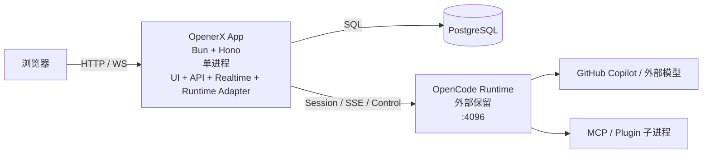

# OpenerX PostgreSQL 与单进程合并方案

## 1. 目标

本方案重新定义 OpenerX 控制面的基础运行形态，目标有两条：

1. 将当前控制面主数据存储从 SQLite 切换到 PostgreSQL。
2. 将当前开发和部署中的 3 个核心运行进程合并为 1 个应用进程。

这里的“3 个运行进程”定义为：

- Control Plane Service :4097
- Web UI BFF :4098
- Web UI Dev / 静态托管层 :5173

当前外部 OpenCode Runtime :4096 不纳入本次“一并合并成 1 个”的范围。原因很直接：它不是简单的 API 代理层，而是独立的会话执行运行时，包含 SSE、session lifecycle、provider 调用、插件和 MCP 进程拉起职责。把它也强行并入当前进程，会显著放大改造风险，且不能直接解决这次暴露出的 SQLite 锁竞争和三层控制面割裂问题。

因此，本方案推荐的第一阶段目标架构是：

- 1 个 OpenerX App 进程
- 1 个 PostgreSQL 数据库
- 1 个外部 OpenCode Runtime 进程

这已经能把当前 4097 / 4098 / 5173 三段式控制面合并为单一服务入口，并消除 SQLite 文件锁和跨进程 API 回环的主要问题。

## 2. 触发原因

本次重构不是风格调整，而是由当前架构的结构性问题触发。

### 2.1 SQLite 已经成为控制面扩展瓶颈

当前控制面数据库直接使用 SQLite 文件，入口集中在：

- control-plane/service/src/db/index.ts
- control-plane/service/src/db/migrate.ts
- control-plane/service/src/db/seed.ts

当前已出现的现实问题：

- 多个 Bun 进程并发打开同一 DB 文件时会触发 SQLITE_BUSY / SQLITE_BUSY_RECOVERY。
- 需要通过 PRAGMA busy_timeout 和 WAL 降级兼容，说明问题已经不是“偶发误报”，而是文件级锁模型与当前运行方式存在天然张力。
- 随着 runtime ledger、审计、成本、治理总览、审批、项目配置等写路径继续增加，单文件锁竞争会继续放大。

SQLite 适合轻量嵌入、单进程或低并发写入，不适合当前这个“控制面 + BFF + runtime 协调 + 持续治理写入”的形态继续演进。

### 2.2 4097 / 4098 / 5173 的三层控制面边界已经开始内耗

当前运行架构见：

- docs/runtime-process-architecture.md
- docs/architecture-overview.md

现状问题：

- BFF 到 Control Plane 通过 cpFetch 做本地回源，形成“同机进程间 HTTP 回环”。
- 前端必须依赖 Vite dev server、BFF、Control Plane 三者都正常，任何一个挂掉都会形成级联失败。
- 当前 VS Code task 中 4097、4098、5173 都要分别拉起和重启，运维面和开发排障面都偏重。
- 配置读写和运行时适配逻辑散落在 BFF，中台主数据在 Control Plane，导致边界既不彻底解耦，也没有真正收敛。

### 2.3 当前“控制面 + BFF”分层收益已经低于成本

最初拆出 BFF 是合理的，因为它负责：

- JWT 校验
- 前端接口整形
- OpenCode Runtime 适配
- WebSocket / SSE 聚合

但随着功能增长，BFF 已经不只是“边缘适配层”，而是承担了大量核心业务路径：

- paid execution guard
- runtime usage ledger sync
- task execute / continue / resume 主路径控制
- chat settings / config / opencode.json 读写

这意味着：

- 真正的业务核心并没有只留在 Control Plane。
- BFF 与 Control Plane 的边界已经不是“业务层 / 边缘层”，而更像“两个部分重叠的后端”。

继续维持两个 Hono 服务，只会让演进成本越来越高。

## 3. 改造目标架构

### 3.1 目标拓扑



### 3.2 合并后的单进程职责

新单进程应用统一承载：

- Web UI 静态资源托管
- 所有 /api 接口
- JWT 认证与鉴权
- 任务、审批、审计、成本、治理主业务
- OpenCode Runtime 适配
- WebSocket 广播与 realtime 聚合
- 配置与 opencode.json 文件读写

换句话说，当前：

- control-plane/service
- control-plane/web-ui-bff
- control-plane/web-ui 的托管层

会被合并为一个新的 server 入口。

### 3.3 推荐的代码组织方式

推荐不是把所有文件硬塞进一个目录，而是“单进程、模块化单体”：

```text
control-plane/app/
  src/
    index.ts                # 唯一 server 入口
    server/
      app.ts                # Hono app 装配
      auth.ts
      websocket.ts
      static-ui.ts
    modules/
      auth/
      projects/
      tasks/
      approvals/
      audit/
      cost/
      dashboard/
      config/
      realtime/
      runtime-adapter/
    db/
      client.ts
      schema.ts
      migrate.ts
      seed.ts
      repositories/
    services/
      paid-execution/
      runtime-ledger/
      governance/
```

这里的关键不是目录名，而是原则：

- 只保留一个 HTTP 入口
- 业务逻辑直接调用服务层和仓储层，不再通过本机 HTTP 回源
- runtime 适配逻辑作为应用内部模块，而不是独立 BFF 进程

## 4. PostgreSQL 替换方案

### 4.1 数据库选型建议

目标数据库是 PostgreSQL。

在 Bun 环境下，推荐优先采用：

- postgres.js
- drizzle-orm/postgres-js

原因：

- 与 Bun 兼容性更直接。
- 与当前 Drizzle ORM 迁移成本低于完全重写 ORM 层。
- 连接池、事务和 prepared statement 行为比 SQLite 文件锁模型更适合当前控制面。

如果团队必须统一使用 node-postgres，也可以采用：

- pg
- drizzle-orm/node-postgres

但从当前仓库的 Bun 使用方式看，postgres.js 更贴合现状。

### 4.2 数据访问层改造范围

当前直接耦合 SQLite 的入口主要包括：

- control-plane/service/src/db/index.ts
- control-plane/service/src/db/migrate.ts
- control-plane/service/src/db/seed.ts
- control-plane/service/src/db/runtime-schema.ts
- control-plane/service/src/db/sqlite-config.ts

其中 sqlite-config.ts 是 SQLite 耦合最深的文件，包含 `PRAGMA busy_timeout / journal_mode / foreign_keys` 配置以及 `isSqliteBusyError()` 错误判断（检测 errno=5/261、SQLITE_BUSY code、"database is locked" 消息）。PG 迁移后应整体替换为 PG 连接池配置。

#### 4.2.1 双轨 Schema 必须统一收归

当前存在严重的"双轨定义"问题：

- schema.ts 用 Drizzle 声明式定义了 ~26 张表（`sqliteTable()`）
- runtime-schema.ts 用**原生 `sqlite.exec()` DDL** 额外定义了 ~15 张表（`workbenchLayouts`、`roleAgents`、`workflowTemplates`、`taskWorkflowRuns`、`bossDecisions`、`humanEscalations` 等）
- 两处还有 ~5 张表**重复定义**（`paidExecutionLeases`、`runtimeUsageLedgers`、`runtimeUsageLedgerSteps`、`runtimeUsageBaselines`、`projectTaskRelations` 同时出现在两处）
- `ensureColumn()` 使用 `PRAGMA table_info()` 做列检测，PG 中必须改用 `information_schema.columns`

PG 迁移时，必须将 runtime-schema.ts 中所有独立表全部收入 Drizzle `pgTable()` 声明，消除双轨定义，统一由 drizzle-kit generate migration。

#### 4.2.2 Migrations 目录当前为空

`control-plane/service/src/db/migrations/` 是空目录。当前根本没有使用 Drizzle 标准迁移流程，所有建表逻辑都靠 runtime-schema.ts 的 `CREATE TABLE IF NOT EXISTS` 在启动时执行。

因此 PG 迁移的第一步应该是：基于当前 schema.ts + runtime-schema.ts 的全量表定义，使用 `drizzle-kit generate` 生成**首个基线 migration**，而不是"转换现有 migration"。

推荐改造方式不是在现有文件里继续堆 if/else，而是重建一个 PG 原生的数据层：

1. 新建通用 DB client
2. 改用 PostgreSQL Drizzle driver
3. 将 runtime-schema.ts 中所有表收入 Drizzle pgTable 声明
4. 用 drizzle-kit generate 生成首个基线 migration
5. 消除 ensureRuntimeTables / ensureColumn 等启动时补表机制

建议的新结构：

- db/client.ts: 初始化 postgres 连接和 drizzle 实例
- db/schema.ts: 继续保留 Drizzle schema 定义，但转换为 PG dialect，**包含原 runtime-schema.ts 中所有表**
- db/migrate.ts: 使用 drizzle-kit / postgres migration
- db/seed.ts: 使用 PG client 和事务执行 seed

### 4.3 schema 转换要点

SQLite 到 PostgreSQL 不是简单替换 driver，必须审视以下差异：

1. 时间字段
   - 当前很多字段以 text ISO string 保存。
   - 建议逐步改为 timestamptz。

2. JSON 字段
   - 当前不少结构以 text JSON 或 json string 形式存储。
   - PostgreSQL 应优先改为 jsonb。

3. 自增与主键
   - 当前主键大量为 text id，这一部分可以保留，不必强制改成 bigint。

4. 布尔和值类型
   - SQLite 对布尔支持宽松，PG 需要明确 boolean / integer / numeric 类型边界。

5. 索引策略
   - runtime_usage_ledgers
   - runtime_usage_ledger_steps
   - audit_events
   - tasks
   - approvals
   - paid_execution_leases
   这些写多查多表必须补全组合索引，而不能只照搬 SQLite 时代的轻索引策略。

### 4.4 数据迁移建议

推荐采用“一次性切换 + 校验回放”，而不是长期双写。

原因：

- 当前仓库仍处于快速演进阶段，双写会显著增加复杂度。
- SQLite 与 PostgreSQL 的 SQL 语义差异较大，长期双写容易引入隐性分叉。

建议迁移流程：

1. 冻结控制面写流量
2. 导出 SQLite 数据
3. 执行字段规范化转换
4. 导入 PostgreSQL
5. 执行一致性校验
6. 切换应用 DATABASE_URL
7. 只读保留 SQLite 快照作为回滚证据

推荐的数据迁移脚本能力：

- 按表导出 JSONL / CSV
- 对 datetime('now') 这类历史脏值做归一化
- 对 JSON string 字段做 parse 后入库 jsonb
- 生成行数、主键覆盖率、关键外键覆盖率报告

### 4.5 事务与并发策略

切换到 PostgreSQL 后，应同步调整写入策略：

1. 所有跨多表写入的业务路径必须显式事务化
   - 任务创建
   - 审批更新
   - runtime ledger sync
   - cost record + audit 联动写入
   - paid execution lease 签发 / 撤销

2. 对热点写路径做幂等键设计
   - runtime_usage_ledger step sync
   - 审计去重
   - 成本记录去重

3. 避免继续依赖“启动时补表”的 compatibility bootstrap
   - SQLite 时代的 ensureRuntimeTables 是兼容性补丁，不应继续成为 PG 常态。

## 5. 单进程合并方案

### 5.1 合并原则

不是把 BFF 简单复制到 Control Plane，而是按下面原则收敛：

1. HTTP 入口只有一个
2. 浏览器访问一个端口
3. 业务模块之间用函数调用，不再用本机 HTTP
4. OpenCode Runtime 仍通过 adapter 边界访问
5. UI 构建产物由同一进程直接托管

### 5.2 推荐的接口边界重组

#### A. 现 BFF 路由整体保留为外部 API 面

当前前端已经消费的大量接口位于：

- control-plane/web-ui-bff/src/index.ts
- control-plane/web-ui-bff/src/modules/*

这些 API 作为前端契约，短期不应大改路径。

建议：

- 保留现有 /api 路径与返回结构
- 但其实现改为直接调用内部 service / repository 层
- 删除 cpFetch 本机回源模式

#### B. 现 Control Plane 路由改为内部业务模块

当前 Control Plane 的路由定义位于：

- control-plane/service/src/index.ts

建议将其从“对外 HTTP 服务”改成“内部模块装配层”，即：

- 把 auth、projects、tasks、audit、cost、dashboard 等模块提炼为服务层
- 被新的统一 Hono app 直接调用

### 5.3 UI 托管策略

单进程后，不再需要单独的 5173 进程作为最终形态。

建议：

1. 生产态
   - web-ui 构建到 dist
   - Hono 直接托管静态资源

2. 开发态
   二选一：

   方案 A，推荐：
   - 仍允许前端单独跑 Vite HMR，仅作为前端开发工具
   - 但“系统标准运行形态”定义为单进程 app
   - 即开发时可临时有 HMR 辅助，不再把它算作架构必须进程

   方案 B，更彻底：
   - 在统一 app 中集成 Vite middleware 模式
   - 直接由单进程接管 HMR 与 API

对当前仓库来说，推荐先走方案 A。理由：

- 改造量更小
- 不影响前端开发体验
- 生产架构已经收敛为单进程
- 开发架构也可以只靠一个 app 进程运行，Vite 只是可选加速器而不是必需组件

### 5.4 realtime 与 WebSocket 合并

当前 WebSocket、SSE 聚合和 runtime 事件转换主要在 BFF：

- control-plane/web-ui-bff/src/modules/realtime/sse-aggregator.ts
- control-plane/web-ui-bff/src/modules/realtime/routes.ts

这些逻辑在单进程后应保留，但不再挂在独立 BFF 进程里，而是成为统一 app 的内部模块。

改造重点：

- 统一 request context
- 统一 auth middleware
- 统一 websocket registry
- 统一 task / project / user scope 过滤

### 5.5 runtime 配置与文件边界处理

当前大量配置和 chat settings 逻辑直接读写：

- opencode-fork/opencode.json
- opencode-fork/.opencode/state

相关代码主要在：

- control-plane/web-ui-bff/src/modules/config/routes.ts
- control-plane/web-ui-bff/src/modules/chat-settings/routes.ts
- control-plane/web-ui-bff/src/modules/chat-settings/config-patch-applier.ts

单进程后，这些逻辑仍可保留，但建议补一层 RuntimeConfigService，把文件 IO 与 API 路由隔离开。否则即使进程合并，代码边界仍然混乱。

## 6. 推荐实施路径

### Phase 0. 冻结目标边界

先做两件事：

1. 确认第一阶段不合并 OpenCode Runtime。
2. 确认对外唯一入口为新的 OpenerX App。

这一步必须先定，否则后续所有设计都会摇摆。

### Phase 1. PostgreSQL 基础替换

目标：让控制面在不改 API 契约的前提下，先稳定切到 PG。

工作项：

1. 引入 postgres.js 与 Drizzle PG driver
2. 重建 db client，整体替换 sqlite-config.ts 为 PG 连接池配置
3. 将 schema.ts（~26 表）和 runtime-schema.ts（~15 表）合并为统一的 Drizzle pgTable 声明
4. 用 drizzle-kit generate 从合并后的 schema 生成首个基线 migration（当前 migrations 目录为空）
5. 迁移 seed，原生 SQL 更新为 PG 语法
6. 导入历史 SQLite 数据
7. 跑全量 typecheck / service tests / BFF regression

完成标准：

- 4097 服务在 PG 上可独立稳定运行
- 不再依赖 SQLite 文件与 runtime table bootstrap
- runtime-schema.ts 中的双轨表定义全部收归 Drizzle schema，ensureRuntimeTables / ensureColumn 机制消除

### Phase 2. 合并 Control Plane 与 BFF

目标：消除本机 HTTP 回源。

工作项：

1. 新建统一 server 入口
2. 将 BFF API 作为外部路由面保留
3. 将 Control Plane 模块改造为内部 service 调用
4. 移除 cpFetch 到 localhost:4097 的依赖（详见 §7.2 分批策略）
5. 合并 auth 中间件（详见 §7.5 Auth 合并策略）
6. 合并 error handler / logging / requestId
7. 将 BFF 后台定时任务（periodic reconcile、startup reconcile）合并为内部模块
8. 输出合并后的环境变量清单，废弃不再需要的变量（详见 §7.6）

完成标准：

- 原前端调用路径保持不变
- 4097 / 4098 合并为一个端口
- 本机 HTTP 回环消失
- `CONTROL_PLANE_URL`、`BFF_PORT`、`INTERNAL_SERVICE_USER_ID` 等进程间通信变量已废弃

### Phase 3. 合并 UI 托管层

目标：让 5173 不再是系统必须进程。

工作项：

1. 输出 web-ui 构建产物
2. 统一 app 直接托管静态资源
3. 开发态保留可选 Vite HMR 辅助，不再作为必需运行节点

完成标准：

- 标准启动命令只需要一个应用进程
- 浏览器访问同一入口即可拿到页面、API、WS

### Phase 4. 清理历史遗留

工作项：

1. 删除旧的 control-plane/service 与 web-ui-bff 间回源耦合
2. 清理旧任务脚本与多端口文档
3. 更新启动任务、README、架构图、测试入口

## 7. 具体代码改造清单

### 7.1 数据层

重点改造：

- control-plane/service/src/db/index.ts
- control-plane/service/src/db/migrate.ts
- control-plane/service/src/db/seed.ts
- control-plane/service/src/db/runtime-schema.ts
- control-plane/service/src/db/schema.ts
- control-plane/service/src/db/sqlite-config.ts

建议结果：

- bun:sqlite 全部退出主路径
- drizzle-orm/bun-sqlite 改为 PG driver
- sqlite-config.ts 整体替换为 PG 连接池配置
- runtime-schema.ts 中 ~15 张表全部收入 Drizzle pgTable 声明
- 消除 ~5 张表的双轨重复定义
- ensureRuntimeTables / ensureColumn 启动时补表机制移除
- 首个基线 migration 由 drizzle-kit generate 生成

### 7.2 本机 HTTP 回源清理

重点改造：

- control-plane/web-ui-bff/src/lib/control-plane-client.ts
- 所有依赖 cpFetch 的 BFF 模块

cpFetch 被 18+ 个文件、约 100+ 个独立调用点使用，覆盖所有核心业务路径。这是 Phase 2 最大的单项工作量。

推荐按模块优先级分批改造，而不是一次性全量替换：

1. 第一批：高频核心路径
   - modules/tasks/ — ~25 处调用（含 routes、finalize、workflow-sync、stage-intervention、workflow-view）
   - modules/projects/ — ~30 处调用
   - modules/auth/ — 3 处调用

2. 第二批：配套业务路径
   - modules/approvals/ — 审批查询与解决
   - modules/audit/ — 审计查询
   - modules/cost/ — 成本与预算
   - modules/policies/ — 策略管理
   - modules/dashboard/ — 治理概览与 token 统计

3. 第三批：低频管理路径
   - modules/credentials/ — 凭证管理
   - modules/repositories/ — 仓库管理
   - modules/workbench/ — 工作台布局
   - modules/envs/ — 环境管理
   - modules/orgs/ — 组织管理
   - modules/users/ — 用户管理

4. 第四批：realtime 与 agent-control 内部路径
   - modules/realtime/sse-aggregator.ts — 回写 task 状态、ledger sync
   - modules/realtime/dag-sync.ts — graph PUT
   - modules/agent-control/run-persistence.ts — run/audit/cost 写入
   - lib/runtime-usage-ledger.ts — ledger sync 与 baseline

目标：

- 内部 service 调用替代 HTTP loopback
- 保留必要的外部 runtime adapter（OPENCODE_URL 到 :4096 的调用不在此范围）

### 7.3 统一 server 入口

重点参考：

- control-plane/service/src/index.ts — 纯 HTTP，`export default { port, fetch: app.fetch }`
- control-plane/web-ui-bff/src/index.ts — HTTP + WebSocket，`export default { port, fetch(req, server) {...}, websocket: websocketHandler }`

合并后的单进程入口必须同时处理 HTTP 路由和 WebSocket 升级。当前 Service 使用 Bun 原生 HTTP server export，BFF 使用带 `websocket` handler 的扩展格式。合并后需要采用 BFF 的扩展 export 格式，在 `fetch` 中处理 WS upgrade 与 Hono 路由分派。

目标：

- 合并为一个 Hono app
- 一个统一的 middleware 链
- 一个统一的监听端口
- WebSocket upgrade 与 HTTP 路由在同一个 `fetch` handler 中处理

### 7.4 UI 托管

重点改造：

- control-plane/web-ui 构建脚本
- 统一 server 的静态资源托管模块
- VS Code tasks 与本地启动脚本

### 7.5 Auth 合并策略

当前 Service 和 BFF 的 auth 行为有本质差异：

| | Service Auth | BFF Auth |
|---|---|---|
| JWT 验证 | 有 | 有 |
| DB 查 accountStatus | **是** | **否** |
| DB 查 tokenVersion | **是** | **否** |
| system: 前缀跳过 DB 查询 | **是** | **否** |

单进程后需要：

1. 全局 auth 统一为 Service 的强校验模式（验 JWT + 查 DB accountStatus / tokenVersion）
2. 移除 `createInternalAuthorization()` 机制 — BFF 当前签发 `system:bff` 内部 JWT（5 分钟有效期）用于进程间调用，合并后不再需要
3. 废弃 `INTERNAL_SERVICE_USER_ID` / `INTERNAL_SERVICE_ORG_ID` 环境变量
4. JWT Secret 统一为单一变量（当前两个服务各自读取 `JWT_SECRET`，默认值相同但配置分散）

### 7.6 环境变量治理

当前两个服务共有 25+ 个环境变量，合并后需要分类处理：

**需废弃的变量（进程间通信）：**

- `CONTROL_PLANE_URL` — 不再需要本机回源
- `BFF_PORT` — 不再独立端口
- `INTERNAL_SERVICE_USER_ID` / `INTERNAL_SERVICE_ORG_ID` — 内部 JWT 机制废弃

**需统一的变量（重叠配置）：**

- `JWT_SECRET` — 两处相同默认值，收敛为单一读取入口
- `CORS_ORIGIN` — 两处均引用，合并后只需一处
- `PORT` — 确定合并后的唯一监听端口

**需保留的 BFF 侧变量（合并后继续有效）：**

- `OPENCODE_URL` — 连接外部 OpenCode Runtime :4096
- `OPENCODE_ROOT` / `OPENCODE_RUNTIME_ROOT` / `OPENCODE_DIR` — 配置文件路径
- `OPENCODE_PROVIDER_ID` / `OPENCODE_MODEL_ID` — 运行时模型配置
- `LOW_COST_EXECUTION_MODEL` — 付费执行降级模型
- `ALLOW_PAID_MODEL_EXECUTION` — 付费执行开关
- `STALE_RUNNING_TASK_OFFLINE_MS` / `PERIODIC_RECONCILE_MS` — 后台对账定时器
- `CHAT_SETTINGS_PENDING_PATCH_SECRET` — 配置补丁签名

建议在 Phase 2 完成后输出统一的 `.env.example`。

### 7.7 后台定时任务合并

BFF 独有以下后台任务，Service 无后台任务：

1. `startPeriodicReconcile()` — `setInterval` 每 5 分钟执行，检查 running task 是否过期/完成，当前通过 cpFetch 查询和更新 CP Service
2. `reconcileRunningTasksOnStartup()` — 启动时一次性清理
3. SSE 重连定时器 — SSE 连接断开后自动重连 OpenCode Runtime

合并后这些逻辑应作为单进程内部模块保留。其中 reconcile 相关逻辑当前通过 cpFetch 查询/更新 task 状态，需改为直接 service call。

## 8. 风险与取舍

### 8.1 最大风险不是 PG，而是边界重组

SQLite 换 PG 本身属于典型基础设施迁移。

真正高风险的是：

- BFF 与 Control Plane 的职责重组
- cpFetch 回源改为内部 service 调用
- realtime 和 runtime adapter 融入统一 app

所以建议先 PG，后合并进程，而不是两件事在同一个提交里同时爆改。

### 8.2 不建议第一阶段就把 Runtime 也并进来

原因：

- Runtime 是执行引擎，不只是接口层
- 它管理外部模型调用和子进程工具
- 当前 chat settings、opencode.json、agent session、SSE 事件都与其强耦合

第一阶段强行把 4096 一起并掉，会把问题从“控制面重构”放大成“整套执行内核重构”。这不划算。

### 8.3 文档、测试、脚本必须同步重做

当前很多测试和脚本默认写死：

- 4097
- 4098
- 5173
- opencode runtime 独立可达

如果进程合并后不重做测试入口，会出现大量“业务没坏，但测试基建全坏”的噪音。

## 9. 验收标准

本方案的最低验收标准建议如下。

### 9.1 PG 替换完成标准

1. 控制面不再依赖 SQLite 文件。
2. 所有核心表完成 PostgreSQL migration。
3. 任务、审批、审计、成本、治理、runtime ledger 能在 PG 上正常读写。
4. 启动过程不再包含 SQLite compatibility bootstrap。

### 9.2 单进程完成标准

1. 浏览器、API、WS 由单一应用入口提供。
2. 不再存在 BFF 到 localhost:4097 的本机 HTTP 回源。
3. 标准启动命令只需一个应用进程。
4. 5173 / 4097 / 4098 不再同时作为系统运行前提。

### 9.3 质量门槛

1. 根目录 typecheck 通过。
2. paid execution regression 通过。
3. runtime ledger 与 governance 相关测试通过。
4. 至少一组真实执行集成验证通过。
5. 启动与重启过程中不再出现 SQLite 锁竞争类故障。

## 10. 推荐结论

推荐采用下面的总路线：

1. 先把控制面数据库从 SQLite 切到 PostgreSQL。
2. 再把 Control Plane Service、Web UI BFF、Web UI 托管层合并为单进程应用。
3. 第一阶段保留 OpenCode Runtime 外部边界，不把 4096 强行并入。

这是当前最稳妥、收益最高、风险可控的方案。

如果继续维持 SQLite + 4097/4098/5173 三段式结构，后续每加一层治理、账本、实时协调和配置同步，系统都会继续在文件锁、端口耦合、本机回源和职责交叉上反复付利息。相反，PG + 单进程控制面可以一次性解决当前最明显的四类问题：

- 文件锁
- 本机 HTTP 回环
- 多服务重启与排障成本
- 控制面职责分裂

因此，这不是“是否值得优化”的问题，而是“是否继续接受当前架构的持续摩擦成本”的问题。