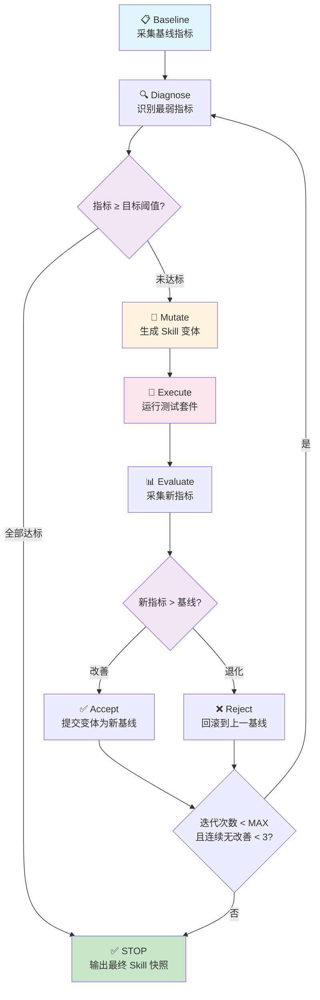
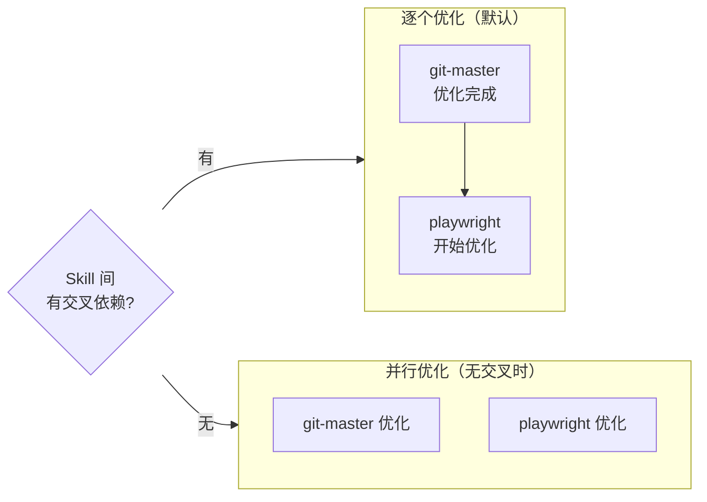

# Skill 自动优化闭环方案

> **目标**：构建可度量、可回滚的 Skill 自动调优闭环。系统自动运行测试、采集指标、调整 skill 可调参数、再次验证，直到达到目标阈值后停止。
>
> 创建日期：2026-03-15

---

## 一、可正确验证的目标（操作对象）

**选取标准**：必须有确定性断言、可自动化执行、结果可量化比较。

### 1.1 纳入的验证目标

| # | 验证目标 | 测试入口 | 指标类型 | 当前基线 |
|---|---------|---------|---------|---------|
| V1 | Hook 生命周期完整性 | `tests/web-ui-bff/hooks-integration.test.ts` | Pass/Fail + 耗时 | 100% pass, ~31s |
| V2 | 工作流评估正确性 | `tests/web-ui-bff/workflow-evaluation.test.ts` | Pass/Fail + prompt 变量替换率 | 100% pass |
| V3 | 完成同步流 | `tests/web-ui-bff/opencode-completion-sync.test.ts` | Pass/Fail + 暂停/恢复耗时 | 100% pass |
| V4 | 身份执行链 | `tests/web-ui-bff/identity-binding.test.ts` | Pass/Fail | 100% pass |
| V5 | E2E UI 覆盖 | `tests/e2e/*.spec.ts` (Playwright) | Pass/Fail + 截图对比 | 待基线 |
| V6 | Skill 激活/去激活 | 新增 `skill-lifecycle.test.ts` | Pass/Fail + context 注入验证 | 待建 |
| V7 | 任务信心分 | `confidenceScore` from `RoleAggregateConclusion` | 0-100 数值 | 待基线 |
| V8 | 任务共识分 | `consensusScore` from `RoleAggregateConclusion` | 0-100 数值 | 待基线 |

### 1.2 排除的目标

| 排除项 | 原因 |
|--------|------|
| 主观文案质量 | 需人工评判，无法自动化断言 |
| MCP server 配置 | 基础设施层级，不属于 skill 行为调优 |
| Agent 选择策略 | 属于编排层（OrchestrationStrategy），非 skill 自身参数 |

### 1.3 优先操作的 Skill

| Skill | 路径 | 优先级 | 理由 |
|-------|------|--------|------|
| `git-master` | `opencode-fork/.opencode/skills/git-master/SKILL.md` | P0 首轮 | 指令丰富、覆盖场景多、可调参数全 |
| `playwright` | `opencode-fork/.opencode/skills/playwright/SKILL.md` | P1 次轮 | 与 E2E 测试直接关联，可验证 skill→测试表现闭环 |

---

## 二、循环验证流程

### 2.1 主流程图



### 2.2 单轮时序图

```mermaid
sequenceDiagram
    participant Loop as 优化循环
    participant Collector as 指标采集器
    participant Mutator as 变异引擎
    participant Runner as 测试运行器
    participant Evaluator as 评估器
    participant Git as Git Stash

    Loop->>Collector: 1. 采集基线
    Collector-->>Loop: baseline.json

    rect rgb(255, 243, 224)
    Note over Loop: 单轮迭代 (≤ 10 min)
    Loop->>Loop: 2. 诊断最弱指标
    Loop->>Git: 3. stash 当前 SKILL.md
    Loop->>Mutator: 4. 生成变体 (≤ 5 min)
    Mutator-->>Loop: skill-variant-N.md
    Loop->>Runner: 5. 执行测试 (≤ 3 min)
    Runner-->>Collector: 测试结果
    Collector-->>Evaluator: metrics-N.json
    Evaluator-->>Loop: Accept / Reject
    alt Accept
        Loop->>Loop: 更新 baseline
    else Reject
        Loop->>Git: pop stash 回滚
    end
    end

    Loop->>Loop: 检查停止条件
    Note over Loop: 达标 / MAX轮 / 连续3轮无改善 → STOP
```

### 2.3 每轮核心动作

| 阶段 | 动作 | 输入 | 输出 |
|------|------|------|------|
| **Baseline** | 运行全量测试，记录 pass率、耗时、信心分、共识分 | 测试套件 | `baseline.json` |
| **Diagnose** | 按指标排序，选出最低分项 | `baseline.json` | 待调目标 + 待调参数 |
| **Mutate** | 修改 SKILL.md 中的一个参数（指令/权限/模板） | 诊断结果 + 失败 case 日志 | `skill-variant-N.md` |
| **Execute** | `bun run test:integration:execution` + E2E | 变体 SKILL.md | 测试结果 raw |
| **Evaluate** | 与 baseline 比较 delta | `metrics-N.json` + `baseline.json` | Accept/Reject 决策 |
| **Persist** | 记录本轮决策到 history | 全部上下文 | `tmp/skill-optimization-history/round-N.json` |

---

## 三、可调 Skill 参数与调整时间

### 3.1 参数清单

| # | 可调部分 | 所在位置 | 调整方式 | 影响范围 | 单次最大时间 |
|---|---------|---------|---------|---------|------------|
| P1 | **allowedTools** | SKILL.md frontmatter `permissions.allowedTools` | 增减工具白名单 | 中 | ≤ 30s |
| P2 | **deniedTools** | SKILL.md frontmatter `permissions.deniedTools` | 增减工具黑名单 | 中 | ≤ 30s |
| P3 | **filePatterns** | SKILL.md frontmatter `permissions.filePatterns` | 修改 glob 模式 | 低-中 | ≤ 30s |
| P4 | **maxConcurrency** | SKILL.md frontmatter `permissions.maxConcurrency` | 数值调整 | 低 | ≤ 10s |
| P5 | **指令内容** | SKILL.md markdown body | LLM 重写/精简/补充规则 | **最大** | ≤ 5 min |
| P6 | **Hook promptTemplate** | OrchestrationStrategy 配置 | 重写模板变量和指令 | 中-高 | ≤ 3 min |
| P7 | **Agent model** | Agent `.md` frontmatter `model` | 切换模型 | 高 | ≤ 10s (改) + 3 min (验) |

### 3.2 三阶段调整顺序

优化按影响范围从小到大、调整耗时从短到长的顺序推进：

```
Phase A — 快速参数调优（每轮 ≤ 1 min）
├── P1 allowedTools
├── P2 deniedTools
├── P3 filePatterns
└── P4 maxConcurrency

Phase B — 指令优化（每轮 ≤ 5 min）
├── P5 SKILL.md 指令内容
└── P6 Hook promptTemplate

Phase C — 模型/架构调优（每轮 ≤ 5 min）
├── P7 Agent model
└── 聚合策略 (first-pass / majority / merge-summary)
```

**核心原则**：**每轮只调一个参数**，控制变量以准确归因改善来源。

### 3.3 时间预算

| 项目 | 时间 |
|------|------|
| 单轮最大时间 | ≤ 10 min (5 min 变异 + 3 min 测试 + 2 min 评估) |
| 最大迭代轮数 | 20 轮 |
| 单个 Skill 最大总时间 | ≤ 200 min (20 × 10 min) |
| 20 轮实际预期 | ~60-100 min（大部分轮次 < 5 min） |

---

## 四、停止条件与目标结果

### 4.1 硬性停止条件（任一满足即停止）

| 条件 | 阈值 | 度量来源 |
|------|------|---------|
| 集成测试通过率 | ≥ 100% (17/17 cases) | `bun run test:integration:execution` 结果 |
| 信心分 `confidenceScore` | ≥ **85** / 100 | `RoleAggregateConclusion` 数据库字段 |
| 共识分 `consensusScore` | ≥ **80** / 100 | `RoleAggregateConclusion` 数据库字段 |
| 平均执行耗时 | ≤ **30s** | 测试运行统计（当前基线 31.6s） |
| 最大迭代次数 | **20** 轮 | 循环计数器 |
| 连续无改善轮数 | **3** 轮连续无正向 delta | 收敛检测 |

**停止条件判断逻辑（伪代码）**：

```typescript
function shouldStop(state: OptimizationState): boolean {
  // 1. 全部指标达标 → 成功停止
  if (state.passRate >= 1.0
      && state.confidenceScore >= 85
      && state.consensusScore >= 80
      && state.avgDuration <= 30_000) {
    return true; // reason: "all_targets_met"
  }
  // 2. 达到最大迭代次数
  if (state.iteration >= 20) {
    return true; // reason: "max_iterations"
  }
  // 3. 连续 3 轮无改善（收敛）
  if (state.consecutiveNoImprovement >= 3) {
    return true; // reason: "converged"
  }
  return false;
}
```

### 4.2 软性优化方向（不作为停止条件）

| 指标 | 期望趋势 | 理由 |
|------|---------|------|
| Hook 执行耗时 | ↓ 下降 | 更快的评估周期 |
| Prompt 变量替换覆盖率 | = 100% | 无遗漏模板变量 |
| Flaky test 发生率 | = 0% | 稳定性保障 |
| Skill 指令 token 数 | ↓ 精简 | 上下文窗口效率 |

### 4.3 最终交付物

优化完成后输出：

```
tmp/skill-optimization-history/
├── baseline.json                 # 初始基线快照
├── round-1.json                  # 第 1 轮记录
├── round-2.json                  # 第 2 轮记录
├── ...
├── round-N.json                  # 最终轮记录
├── final-snapshot.json           # 最终收敛状态总结
└── optimization-report.md        # 人类可读优化报告
```

**`round-N.json` 结构**：

```jsonc
{
  "round": 3,
  "timestamp": "2026-03-15T14:30:00Z",
  "skill": "git-master",
  "targetParam": "P5:instructions",
  "diagnosis": "Hook promptTemplate 变量 {{taskResult}} 未被下游指令引用",
  "mutation": {
    "type": "instruction_rewrite",
    "diff": "--- a/SKILL.md\n+++ b/SKILL.md\n@@ ...",
    "tokenDelta": -120
  },
  "metrics": {
    "passRate": 1.0,
    "avgDuration": 29800,
    "confidenceScore": 82,
    "consensusScore": 78,
    "hookExecutionMs": 4200,
    "promptSubstitutionRate": 1.0
  },
  "baseline": {
    "passRate": 1.0,
    "avgDuration": 31600,
    "confidenceScore": 75,
    "consensusScore": 72
  },
  "delta": {
    "avgDuration": -1800,
    "confidenceScore": +7,
    "consensusScore": +6
  },
  "decision": "accept",
  "reason": "所有 delta 为正向，avgDuration 降低 5.7%，confidenceScore 提升 9.3%"
}
```

**`final-snapshot.json` 结构**：

```jsonc
{
  "skill": "git-master",
  "totalRounds": 8,
  "stopReason": "all_targets_met",
  "totalDuration": "47 min",
  "accepted": 5,
  "rejected": 3,
  "initialBaseline": { /* ... */ },
  "finalMetrics": {
    "passRate": 1.0,
    "avgDuration": 28500,
    "confidenceScore": 87,
    "consensusScore": 83
  },
  "paramChanges": [
    { "round": 1, "param": "P1:allowedTools", "decision": "accept" },
    { "round": 2, "param": "P3:filePatterns", "decision": "reject" },
    { "round": 3, "param": "P5:instructions", "decision": "accept" }
    // ...
  ],
  "finalSkillMd": "--- (完整 SKILL.md 内容快照) ---"
}
```

---

## 五、多 Skill 调度策略

### 决定：逐个优化，无交叉时可并行



**交叉判定规则**：
- `allowedTools` / `deniedTools` 存在交集 → 有交叉，串行
- `filePatterns` 存在重叠 → 有交叉，串行
- 使用相同 Hook trigger 点 → 有交叉，串行
- 以上均无 → 无交叉，可并行

当前 `git-master` 和 `playwright` 的 `filePatterns` 不重叠（`**/*` vs `**/*.spec.ts,**/e2e/**`），但 `git-master` 使用了 `**/*` 通配，实际存在包含关系 → **首轮串行**，待 `git-master` 的 `filePatterns` 收窄后再评估并行可能。

---

## 六、人工审批 Gate

### 决定：首轮全自动，后续按变异幅度决定

| 变异幅度 | 判定条件 | 审批策略 |
|---------|---------|---------|
| **小** | 仅 `allowedTools/deniedTools/filePatterns/maxConcurrency` 变更 | ✅ 全自动 |
| **中** | 指令内容变更且 token delta ≤ 30% | ✅ 全自动 |
| **大** | 指令内容变更且 token delta > 30%，或 model 变更 | ⚠️ 暂停，输出 diff 等待人工确认 |

```typescript
function needsHumanReview(mutation: Mutation): boolean {
  if (mutation.type === 'model_change') return true;
  if (mutation.type === 'instruction_rewrite'
      && Math.abs(mutation.tokenDelta) / mutation.originalTokenCount > 0.30) {
    return true;
  }
  return false;
}
```

---

## 七、实现路线

### Phase 1: 基础设施搭建

| # | 任务 | 产出 | 依赖 |
|---|------|------|------|
| 1 | 创建 `scripts/skill-optimizer.ts` — 主控脚本 | 闭环循环引擎 | 无 |
| 2 | 创建 `scripts/skill-metrics-collector.ts` — 指标采集器 | `metrics-{timestamp}.json` | 无（可与 1 并行） |
| 3 | 创建 `tests/web-ui-bff/skill-lifecycle.test.ts` | Skill 生命周期测试 | 1 的指标格式 |

### Phase 2: 变异引擎

| # | 任务 | 产出 | 依赖 |
|---|------|------|------|
| 4 | 创建 `scripts/skill-mutator.ts` — 变体生成器 | `skill-variant-N.md` | 1, 2 |
| 5 | 创建 `scripts/skill-evaluator.ts` — 评估器 | Accept/Reject 决策 | 2 |

### Phase 3: 闭环集成

| # | 任务 | 产出 | 依赖 |
|---|------|------|------|
| 6 | 创建 `scripts/skill-optimize-loop.sh` — 顶层编排 | 一键运行脚本 | 1-5 |
| 7 | 添加 VS Code Task `run-skill-optimization` | IDE 集成 | 6 |

### Phase 4: 验证

| # | 任务 | 产出 | 依赖 |
|---|------|------|------|
| 8 | 对 `git-master` 执行完整优化试运行 | 优化历史 + 报告 | 6 |
| 9 | 对 `playwright` 执行优化试运行 | 泛化验证 | 8 |
| 10 | 编写优化报告模板 | `optimization-report.md` | 8, 9 |

---

## 八、验证清单

- [ ] **基线验证**：`bun run test:integration:execution` 确认 17/17 pass
- [ ] **指标采集**：`skill-metrics-collector.ts` 输出 JSON 包含 passRate / avgDuration / confidenceScore / consensusScore
- [ ] **变异合法性**：`skill-mutator.ts` 生成的 SKILL.md 通过 `YAML.parse` 校验 frontmatter
- [ ] **回滚验证**：Reject 后 `git diff` 确认 SKILL.md 恢复原内容
- [ ] **停止条件-迭代上限**：设置 `MAX_ITERATIONS=2` 确认 2 轮后停止
- [ ] **停止条件-收敛**：连续 3 轮无正向 delta 后停止
- [ ] **停止条件-达标**：注入已达标 baseline 确认循环立即停止
- [ ] **历史持久化**：`tmp/skill-optimization-history/` 包含 baseline + 每轮 JSON + final-snapshot
- [ ] **人工 Gate**：token delta > 30% 的变异暂停等待确认

---

## 九、关键文件索引

| 文件 | 角色 |
|------|------|
| `opencode-fork/.opencode/skills/git-master/SKILL.md` | 第一个优化目标 skill |
| `opencode-fork/.opencode/skills/playwright/SKILL.md` | 第二个优化目标 skill |
| `opencode-fork/.opencode/plugins/skills-plugin.ts` | Skill 生命周期：activate/deactivate/read/create |
| `tests/web-ui-bff/workflow-evaluation.test.ts` | Hook 评估测试参考 |
| `tests/web-ui-bff/hooks-integration.test.ts` | 生命周期集成测试参考 |
| `control-plane/web-ui-bff/package.json` | 测试脚本入口 `test:integration:*` |
| [docs/integration-test-10x-report.md](../operations/integration-test-10x-report.md) | 当前性能基线（10 次运行，100% 通过率） |
| `tmp/skill-optimization-history/` | 优化历史存储目录 |
