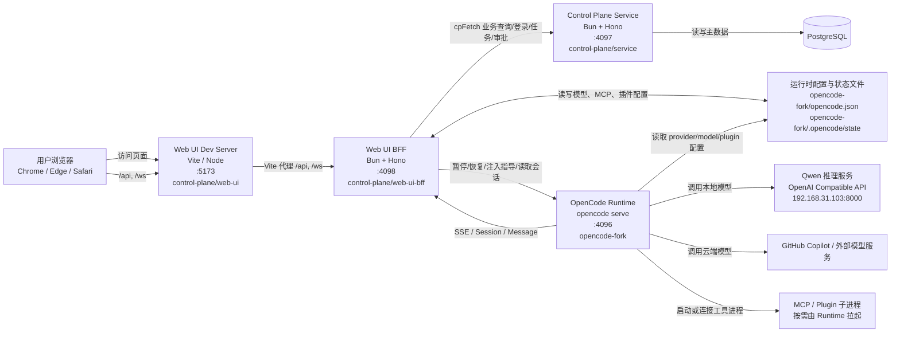
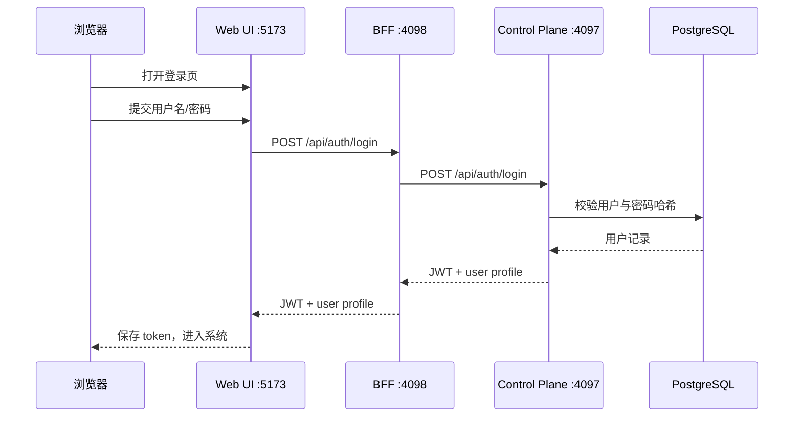
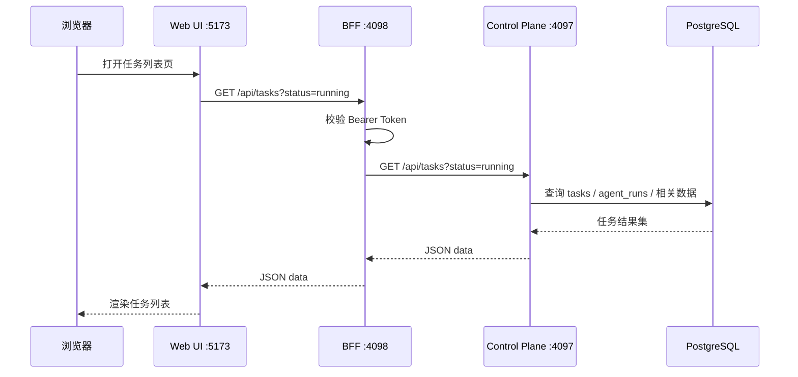
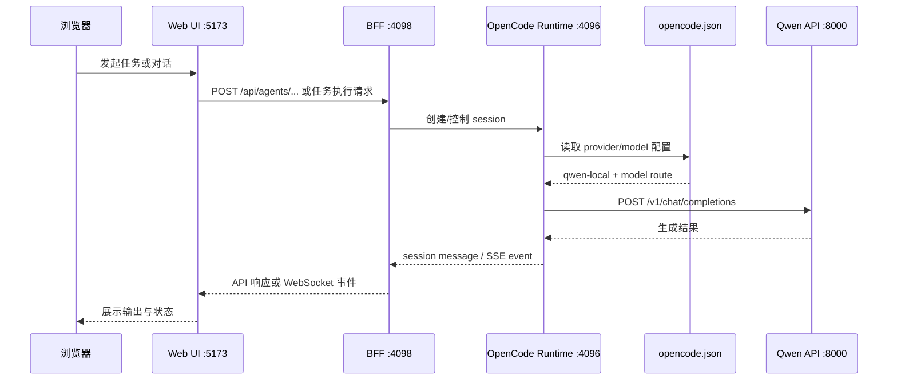
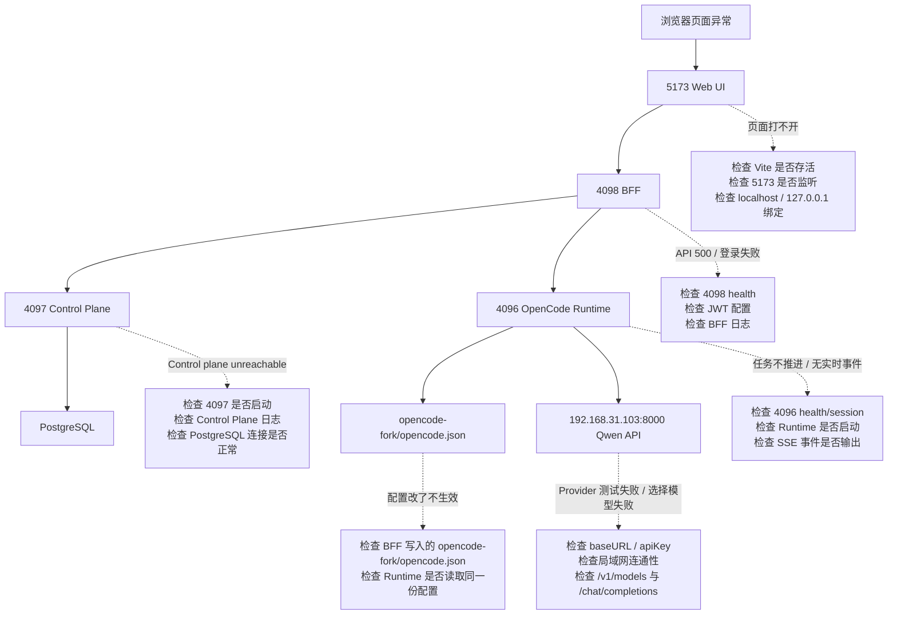

# OpenerX 运行架构图

本文档描述当前仓库在开发态的实际运行架构，重点标出各个进程、监听端口、依赖关系，以及关键共享文件。当前默认拓扑仍是 `5173 -> 4098 -> 4097 -> PostgreSQL`，并继续保留外部 Runtime `:4096`；不再继续推进单进程合并作为默认路线。

## 1. 总览图



## 2. 进程清单

| 进程 | 代码位置 | 默认端口 | 启动方式 | 主要职责 |
| --- | --- | --- | --- | --- |
| Web UI Dev Server | `control-plane/web-ui` | 5173 | `bun run dev --host 0.0.0.0 --port 5173` | 提供前端页面静态资源，并在开发态代理 `/api` 和 `/ws` |
| Web UI BFF | `control-plane/web-ui-bff` | 4098 | `bun run src/index.ts` | 前端统一入口，JWT 校验，代理 Control Plane，适配 OpenCode Runtime |
| Control Plane Service | `control-plane/service` | 4097 | `bun run src/index.ts` | 认证、项目、用户、任务、审批、审计、配置主数据 |
| OpenCode Runtime | `opencode-fork` / 本机 `opencode` 可执行文件 | 4096 | `opencode serve --hostname 127.0.0.1 --port 4096 --print-logs` | Agent 会话执行、消息流、SSE 输出、模型调用、插件/MCP 调用 |
| PostgreSQL | 外部数据库实例 | 无 | 由 Control Plane 通过连接串访问 | Control Plane 主数据存储 |
| Qwen 推理服务 | 外部机器 | 192.168.31.103:8000 | 外部独立服务 | 为 `qwen-local` provider 提供 OpenAI 兼容推理接口 |
| GitHub Copilot / 其他外部模型服务 | 外部服务 | 外部 | 外部服务 | 为 Runtime 提供云端模型能力 |
| MCP / Plugin 子进程 | 由 Runtime 按需拉起 | 动态 | Runtime 内部触发 | 搜索、浏览器自动化、知识库、任务编排等工具能力 |

## 3. 关键调用关系

### 3.1 浏览器到前端

- 用户浏览器访问 `http://localhost:5173`。
- 页面资源由 Vite Dev Server 提供。

### 3.2 前端到 BFF

- 浏览器调用 `/api/*` 和 `/ws`。
- 在开发态，这两个入口由 Vite 代理到 BFF `:4098`。
- 因此前端本身不直接访问 Control Plane，也不直接访问 OpenCode Runtime。

### 3.3 BFF 到 Control Plane

- BFF 通过 `cpFetch` 调用 `http://localhost:4097`。
- 登录、任务列表、审批、项目、用户等主业务请求都走这条链路。
- 如果 Control Plane 未启动，前端就会看到 `Control plane unreachable`。

### 3.4 BFF 到 OpenCode Runtime

- BFF 直接访问 OpenCode Runtime `:4096`。
- 典型动作包括：暂停任务、恢复任务、注入指导、读取 Session 消息、订阅 SSE 事件。
- BFF 同时负责把 Runtime 的实时事件转换后再推送给前端。

### 3.5 Runtime 到模型服务

- Runtime 根据 `opencode-fork/opencode.json` 中的 provider 配置选择模型后端。
- 本地模型场景下，Runtime 调用 `qwen-local` 对应的 OpenAI 兼容服务。
- 云端模型场景下，Runtime 调用 GitHub Copilot 或其他外部 provider。

### 3.6 配置与状态文件

- BFF 的配置管理接口会读写 `opencode-fork/opencode.json`。
- BFF 也会读写 `opencode-fork/.opencode/state` 下的状态文件，例如 token、continuation policy、task graph 镜像等。
- OpenCode Runtime 启动和执行过程中也会读取这些文件，因此这是 BFF 与 Runtime 的共享文件边界。

## 4. 实际端口关系

```text
浏览器
  -> 5173 Web UI (Vite)
  -> 5173 下的 /api,/ws 代理到 4098 BFF

4098 BFF
  -> 4097 Control Plane Service
  -> 4096 OpenCode Runtime
  -> opencode-fork/opencode.json
  -> opencode-fork/.opencode/state/*

4097 Control Plane Service
  -> PostgreSQL

4096 OpenCode Runtime
  -> 192.168.31.103:8000 Qwen 推理服务
  -> GitHub Copilot / 其他外部模型
  -> MCP / Plugin 子进程
```

## 5. 典型启动顺序

建议按以下顺序启动，以避免页面报错或出现 `Control plane unreachable`：

1. 启动 Control Plane Service（`:4097`）
2. 启动 Web UI BFF（`:4098`）
3. 启动 OpenCode Runtime（`:4096`）
4. 启动 Web UI Dev Server（`:5173`）
5. 确认外部模型服务可达，例如 `qwen-local` 指向的推理地址

## 6. 当前已验证的运行事实

- Web UI 使用 Vite 开发服务器，当前需要显式以 `--host 0.0.0.0` 启动，才能同时支持 `localhost` 和 `127.0.0.1`。
- BFF 自身健康不代表系统完整可用；如果 Control Plane 没启动，任务列表与登录转发会失败。
- Runtime 模型配置来源于 `opencode-fork/opencode.json`，而不是前端内存状态本身。
- `qwen-local` 当前可用地址是 `http://192.168.31.103:8000/v1`；旧地址 `192.168.1.103:8000` 不可达。

## 7. 建议用途

这份图适合用于以下场景：

- 开发环境排障
- 新成员理解系统边界
- 解释“页面能打开但任务列表失败”的原因
- 对齐 BFF、Control Plane、Runtime 三层职责

## 8. 关键时序图

### 8.1 登录链路



### 8.2 任务列表链路



### 8.3 模型调用链路



## 9. 故障定位版架构图



## 10. 常见报错与对应断点

| 页面提示 | 直接怀疑点 | 首先检查 |
| --- | --- | --- |
| 页面无法访问 | Web UI Dev Server 未启动或监听地址不对 | `5173` 是否监听，是否仅监听 `::1` |
| `Control plane unreachable` | Control Plane Service 未启动或 `4097` 不通 | `http://127.0.0.1:4097/health` |
| 任务列表加载失败 | BFF 到 Control Plane 链路断开 | BFF 日志中的 `cpFetch` 返回码 |
| `Request failed` | BFF 非 JSON 错误响应，或上游抛异常 | 对应 API 的 HTTP 状态与 BFF 日志 |
| Provider 测试失败 | Runtime 所在机器到模型服务不通 | `baseURL`、`apiKey`、`/v1/models` 直连 |
| 模型能测通但任务无输出 | Runtime session 或 SSE 链路异常 | `4096`、SSE、WebSocket |
| 配置页修改后不生效 | 写入文件与 Runtime 实际读取文件不一致 | `opencode-fork/opencode.json` 与 `.opencode/state` |

## 11. 一句话排障顺序

当系统看起来“整体坏了”时，按这个顺序查最快：

1. `5173` 前端是否可访问
2. `4098/health` BFF 是否正常
3. `4097/health` Control Plane 是否正常
4. `4096` OpenCode Runtime 是否正常
5. 外部模型地址是否可达
6. `opencode-fork/opencode.json` 是否是当前生效配置
