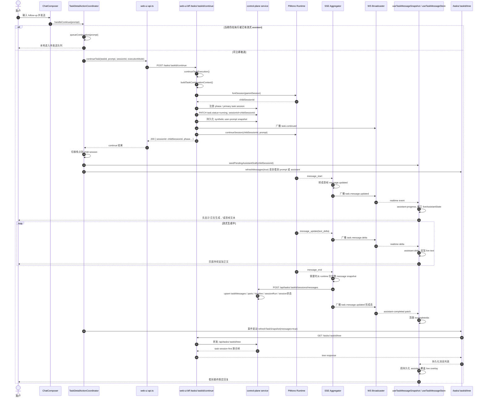
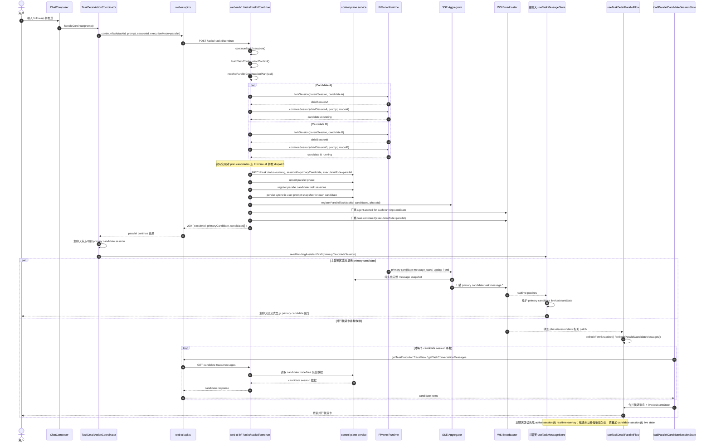
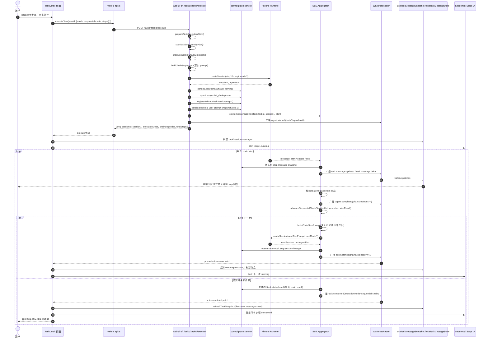

# TaskDetail Continue 时序图

> 状态：Current implementation snapshot
> 日期：2026-04-11
> 作者：GitHub Copilot
> 关联文档：[task-detail-message-state-machine-plan.md](task-detail-message-state-machine-plan.md)、[task-detail-realtime-event-contract.md](task-detail-realtime-event-contract.md)、[task-detail-continue-simplified-design.md](task-detail-continue-simplified-design.md)

## 0. 文档定位

这份文档是 TaskDetail continue 的“当前实现快照”，不是目标改造方案。

1. 当前实现：记录 single continue、parallel continue、sequential-chain 在现网里的真实时序，以及 realtime overlay、tree 回读、candidate 补拉之间的边界。
2. 未来目标：continue 接口和模块之后应该如何收口，见 [task-detail-continue-simplified-design.md](task-detail-continue-simplified-design.md) 与 [task-detail-continue-target-module-architecture.md](task-detail-continue-target-module-architecture.md)。
3. 阅读建议：排查现网行为先读本文；设计 cutover 时，把本文当作 baseline，再对照目标设计文档找差异。

## 1. 文档目的

这份文档把 TaskDetailV3 当前实现里的 continue 主链路，以及 sequential-chain 的独立执行链路，落成可直接阅读的时序图，方便在代码评审、链路排障和前后端对齐时快速确认“消息是怎么发出去的、模型回复是怎么回来的、页面为什么会先看到流式内容再收敛成最终结果”。

## 2. 适用范围

本文覆盖任务详情页里的以下链路：

1. TaskDetailV3 聊天输入框触发的 follow-up / continue
2. single continue
3. parallel continue
4. sequential-chain 单独执行链

本文不覆盖：

1. 新建任务时的首轮 execute
2. hook / judge / detached follow-up 的完整独立链路

## 3. 当前实现结论

1. single continue 不是在原 session 上原地续写，而是先 fork child session，再把 prompt 发到 child session。
2. parallel continue 会为每个 candidate 分别 fork child session，然后并发 dispatch 到 runtime。
3. 主聊天区优先依赖 realtime overlay 显示“正在生成”和 token 流；最终一致性依赖 control-plane 持久化后再经 tree 回读收敛。
4. parallel candidate 卡片不是纯 realtime token 直出链路。当前实现主要依赖 flow snapshot 触发候选会话补拉，再叠加各 candidate session 的 live assistant state。
5. `executionMode=sequential-chain` 传到 `/tasks/:taskId/continue` 时不会进入独立顺序链分支，当前仍会落到 single continue；真正独立的 sequential-chain 引擎在 `/tasks/:taskId/execute` 与 SSE Aggregator 的 step auto-advance 里。

## 4. Single Continue

### 4.1 关键说明

1. 前端发送后会先在本地切到 child session，并 seed 一个 pending assistant draft，避免界面空白。
2. BFF 会先 fork child session、写 synthetic user-prompt snapshot、更新 task 当前 session，再调用 runtime continue。
3. runtime 的 `message_start`、`message_update`、`message_end` 会被统一桥接成 `task.message.updated` 和 `task.message.delta`。
4. 前端先用 realtime patch 驱动流式显示，再通过 `/tasks/:taskId/tree` 的持久化回读收敛到最终消息列表。

### 4.2 时序图

## 5. Parallel Continue

### 5.1 关键说明

1. parallel continue 会先解析 parallel plan，再为每个 candidate 分别创建本轮 child session。
2. BFF 会对多个 candidate 并发调用 runtime continue，而不是串行逐个发送。
3. BFF 会为每个 candidate 持久化一条 synthetic user-prompt snapshot，并把 task 当前 `sessionId` 指到 primary candidate。
4. 主聊天区会先跟随 primary candidate session；并行候选卡片则主要通过 flow snapshot 触发补拉，再叠加 candidate session 的 live assistant state。
5. 当前实现里，并行候选卡不是“像主聊天一样直接消费同一条 streaming UI 链”，而是“候选会话数据补拉 + live state overlay”的混合模型。

### 5.2 时序图

## 6. Sequential-Chain

### 6.1 关键说明

1. sequential-chain 的独立分支在 `POST /tasks/:taskId/execute`，不是 `POST /tasks/:taskId/continue`。
2. 首个 step 由 BFF 直接 `createSession(stepPrompt)` 启动，不是先 fork 旧 session 再 continue。
3. 每个 step 的 prompt 都会注入“已完成步骤产出”，因此后续 step 的输入是“原始任务 prompt + 已完成步骤结果 + 当前步骤说明”的组合。
4. SSE Aggregator 用 `registerSequentialChainTask()` 和 `sessionToChainStepMap` 跟踪当前 step；当前 step 完成后会自动调用 `advanceSequentialChainStep()` 启动下一步。
5. 每个 step 都会落成独立 `sequential_step session`；整条链结束时，Aggregator 会聚合各 step 结果并 `PATCH task.status/result`，然后广播 `task.completed` 或失败态事件。

### 6.2 时序图

## 7. 阅读建议与未来目标

如果要沿着代码逐段核对，建议按下面顺序阅读：

1. 前端发送入口：`control-plane/web-ui/src/components/task-detail-shared/ChatComposer.vue`
2. 前端动作协调：`control-plane/web-ui/src/composables/useTaskDetailActionCoordinator.ts`
3. BFF continue 入口：`control-plane/web-ui-bff/src/modules/tasks/routes.ts`
4. runtime 事件桥：`control-plane/web-ui-bff/src/modules/agent-control/runtime-provider-pimono.ts`
5. realtime 聚合：`control-plane/web-ui-bff/src/modules/realtime/sse-aggregator.ts`
6. service 消息主写链：`control-plane/service/src/modules/tasks/task-session-message-write-api.ts`
7. 前端 realtime patch 与 snapshot/store 收敛：`control-plane/web-ui/src/composables/useTaskMessageSnapshot.ts`、`control-plane/web-ui/src/composables/useTaskMessageStore.ts`
8. sequential-chain 启动入口：`control-plane/web-ui/src/lib/api.ts`、`control-plane/web-ui-bff/src/modules/tasks/routes.ts`
9. sequential-chain 步骤 UI 与回填：`control-plane/web-ui/src/composables/useTaskDetailSequentialStepsCoordinator.ts`
10. sequential-chain 自动推进与收尾：`control-plane/web-ui-bff/src/modules/realtime/sse-aggregator.ts`
