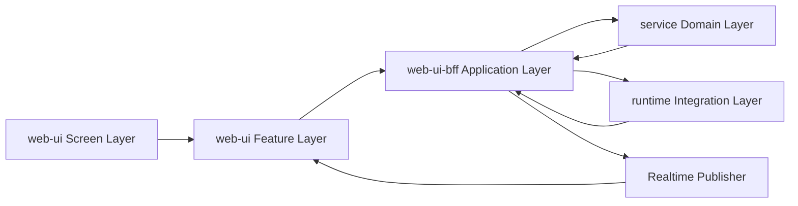

# TaskDetail Continue 目标模块架构方案

> 状态：Draft v1
> 日期：2026-04-11
> 作者：GitHub Copilot
> 关联文档：[task-detail-continue-simplified-design.md](task-detail-continue-simplified-design.md)、[task-detail-continue-simplified-migration-checklist.md](task-detail-continue-simplified-migration-checklist.md)、[task-detail-message-state-machine-plan.md](task-detail-message-state-machine-plan.md)、[task-detail-realtime-event-contract.md](task-detail-realtime-event-contract.md)、[taskdetail-v3-page-dataflow.md](taskdetail-v3-page-dataflow.md)

## 1. 文档目的

这份文档描述未来稳态下的 TaskDetail Continue 模块架构，重点不是迁移步骤，而是明确：

1. 前端各模块分别负责什么
2. BFF 各模块分别负责什么
3. Service 真源层分别负责什么
4. Runtime / Realtime 管道分别负责什么
5. 各层之间应该通过什么 contract 协作

目标是把 continue、compare、workflow 三类能力拆成清晰的子系统，而不是继续堆在一条主链路里。

## 2. 设计目标

这版架构需要同时满足下面几个目标：

1. 主聊天 continue 足够简单，任何人都能沿着单链路读懂。
2. compare 和 workflow 是独立能力，不再污染主聊天页的数据流。
3. web-ui 只消费稳定 task-domain DTO，不解析 runtime 原始事件。
4. BFF 作为应用编排层，负责把底层 session / phase / runtime 细节包装成页面可消费的 facade。
5. service 继续做 canonical message 与 session lineage 的真源，不在第一阶段被迫重写。

## 3. 总体分层

未来稳态分成 5 层：

1. web-ui Screen Layer
2. web-ui Feature Layer
3. web-ui-bff Application Layer
4. control-plane service Domain Layer
5. runtime / realtime Integration Layer



这 5 层的职责边界如下：

1. Screen Layer 只负责页面壳和布局，不负责业务编排。
2. Feature Layer 只负责 UI 侧业务状态和动作，不直接理解底层 runtime 协议。
3. Application Layer 只负责用例编排和 DTO facade，不持有数据库真源。
4. Domain Layer 只负责消息、session、phase、projection 的真源读写。
5. Integration Layer 只负责 runtime 适配和实时事件翻译，不直接参与页面渲染决策。

## 4. 前端模块

## 4.1 Page Shell

建议模块：

1. `TaskDetailPageShell`
2. `TaskDetailSectionModels`

建议位置：

1. [control-plane/web-ui/src/pages/TaskDetailV3.vue](../control-plane/web-ui/src/pages/TaskDetailV3.vue)
2. [control-plane/web-ui/src/composables/useTaskDetailPageModel.ts](../control-plane/web-ui/src/composables/useTaskDetailPageModel.ts)
3. [control-plane/web-ui/src/composables/useTaskDetailPageSectionModels.ts](../control-plane/web-ui/src/composables/useTaskDetailPageSectionModels.ts)

负责：

1. 读取路由参数和页面级壳层状态。
2. 组合 conversation、compare、workflow、sidebar 等 feature model。
3. 把 feature model 投影成 header、main、sidebar 分区模型。

不负责：

1. 发 continue 请求。
2. 合并实时消息 patch。
3. 管理 compare 候选状态。
4. 管理 workflow step 执行。

输入输出：

1. 输入 taskId、route context。
2. 输出 page shell model。

## 4.2 Conversation Feature

建议模块：

1. `useTaskConversationFeature`
2. `useTaskConversationStore`
3. `useTaskConversationActions`
4. `useTaskConversationHistory`

建议位置：

1. `control-plane/web-ui/src/features/task-detail/conversation/`

收编当前模块：

1. [control-plane/web-ui/src/composables/useTreeMessages.ts](../control-plane/web-ui/src/composables/useTreeMessages.ts)
2. [control-plane/web-ui/src/composables/useTaskMessageStore.ts](../control-plane/web-ui/src/composables/useTaskMessageStore.ts)
3. [control-plane/web-ui/src/composables/useTaskMessagePatchConsumer.ts](../control-plane/web-ui/src/composables/useTaskMessagePatchConsumer.ts)
4. [control-plane/web-ui/src/composables/useTaskDetailActionCoordinator.ts](../control-plane/web-ui/src/composables/useTaskDetailActionCoordinator.ts) 中主聊天相关部分

负责：

1. 管理 active round 或 active session 的标准化消息状态。
2. 处理主聊天 continue、stop、切换历史 round。
3. 接收 `task.message.updated`、`task.message.delta`、`task.reconcile.required` 并更新主聊天 store。
4. 管理主聊天的 pending assistant draft 和 reconcile。

不负责：

1. compare 候选卡加载。
2. workflow step 列表与进度。
3. execution mode modal。
4. task member、trace、file preview 侧栏数据。

输入输出：

1. 输入 activeRoundId、activeSessionId、task realtime patch、REST message snapshot。
2. 输出主聊天 `conversationItems`、composer state、send/stop actions。

## 4.3 Compare Feature

建议模块：

1. `useTaskCompareFeature`
2. `useTaskCompareCandidates`
3. `useTaskCompareActions`

建议位置：

1. `control-plane/web-ui/src/features/task-detail/compare/`

收编当前模块：

1. [control-plane/web-ui/src/composables/useTaskDetailParallelFlow.ts](../control-plane/web-ui/src/composables/useTaskDetailParallelFlow.ts)
2. [control-plane/web-ui/src/lib/task-detail-parallel-conversation.ts](../control-plane/web-ui/src/lib/task-detail-parallel-conversation.ts)
3. [control-plane/web-ui/src/lib/task-detail-parallel-runtime.ts](../control-plane/web-ui/src/lib/task-detail-parallel-runtime.ts)

负责：

1. 发起 compare run。
2. 加载 candidate rounds 和采纳状态。
3. 展示候选结果、模型信息、耗时、winner 状态。
4. 触发 adopt winner。

不负责：

1. 主聊天流式渲染。
2. 把 candidate 卡片插回 conversation 主链路。
3. 推断主聊天当前 active session。

输入输出：

1. 输入 compare summary、candidate snapshots、compare realtime patch。
2. 输出 compare panel model 和 adopt action。

## 4.4 Workflow Feature

建议模块：

1. `useTaskWorkflowFeature`
2. `useTaskWorkflowSteps`
3. `useTaskWorkflowActions`

建议位置：

1. `control-plane/web-ui/src/features/task-detail/workflow/`

收编当前模块：

1. [control-plane/web-ui/src/composables/useTaskDetailSequentialStepsCoordinator.ts](../control-plane/web-ui/src/composables/useTaskDetailSequentialStepsCoordinator.ts)
2. [control-plane/web-ui/src/composables/useTaskDetailExecutionModeCoordinator.ts](../control-plane/web-ui/src/composables/useTaskDetailExecutionModeCoordinator.ts) 中 workflow 相关部分

负责：

1. 发起 workflow run。
2. 展示步骤列表、当前 step、最终结果。
3. 执行 cancel、retry、resume 等 workflow 动作。
4. 消费 `task.workflow.updated` 这类 workflow 专属事件。

不负责：

1. 主聊天 continue。
2. compare 候选采纳。
3. 承担 execution mode 全局设置入口。

输入输出：

1. 输入 workflow view DTO、workflow realtime patch。
2. 输出 workflow panel model 和 workflow actions。

## 4.5 Task Subscription Feature

建议模块：

1. `useTaskRealtimeSubscription`
2. `useTaskDetailSnapshotRefresh`

建议位置：

1. `control-plane/web-ui/src/features/task-detail/shared/`

收编当前模块：

1. [control-plane/web-ui/src/composables/useTaskDetailRefreshController.ts](../control-plane/web-ui/src/composables/useTaskDetailRefreshController.ts)
2. [control-plane/web-ui/src/composables/useTaskDetailSnapshotCoordinator.ts](../control-plane/web-ui/src/composables/useTaskDetailSnapshotCoordinator.ts)
3. [control-plane/web-ui/src/lib/task-detail-refresh-policy.ts](../control-plane/web-ui/src/lib/task-detail-refresh-policy.ts)

负责：

1. 管理 task/project 订阅。
2. 统一 reconnect、silent reconcile、slow refresh 策略。
3. 把 refresh 请求按 conversation、compare、workflow 三类分发给各 feature。

不负责：

1. 管理主聊天 message store。
2. 直接操作 compare candidate 数据。
3. 构造页面 UI model。

## 4.6 Sidebar Feature

建议模块：

1. `useTaskSidebarFeature`
2. `useTaskTracePanel`
3. `useTaskMemberPanel`
4. `useTaskFilePreviewPanel`

建议位置：

1. `control-plane/web-ui/src/features/task-detail/sidebar/`

负责：

1. 文件预览、trace、member、runtime permission 侧栏信息。
2. 对 conversation、compare、workflow 提供只读辅助信息。

不负责：

1. 主链路 continue。
2. compare / workflow 的写动作编排。

## 5. BFF 模块

## 5.1 Task Routes Shell

建议模块：

1. `task routes shell`

建议位置：

1. [control-plane/web-ui-bff/src/modules/tasks/routes.ts](../control-plane/web-ui-bff/src/modules/tasks/routes.ts)

负责：

1. 解析 HTTP 请求与鉴权。
2. 调用 application service。
3. 返回 task-domain DTO。

不负责：

1. 承载 continue / compare / workflow 全部业务细节。
2. 直接拼接 runtime 事件细节。

未来拆分方向：

1. `routes.ts` 保持薄壳。
2. 主业务逻辑下沉到 `application/` 目录。

## 5.2 Continue Application Service

建议模块：

1. `continue-task.ts`

建议位置：

1. `control-plane/web-ui-bff/src/modules/tasks/application/continue-task.ts`

承接当前逻辑：

1. [control-plane/web-ui-bff/src/modules/tasks/routes.ts](../control-plane/web-ui-bff/src/modules/tasks/routes.ts) 中 `continueTaskExecution(...)` 及其 single continue 相关 helper

负责：

1. 校验 continue 请求。
2. 解析 parent round 或 parent session。
3. 创建 child session。
4. 预写 user prompt snapshot。
5. 启动 runtime continue。
6. 返回 continue round DTO。

不负责：

1. compare candidate 批量启动。
2. workflow step 自动推进。
3. 页面专属 refresh 策略。

## 5.3 Compare Application Service

建议模块：

1. `compare-task.ts`
2. `adopt-compare-winner.ts`

建议位置：

1. `control-plane/web-ui-bff/src/modules/tasks/application/compare-task.ts`
2. `control-plane/web-ui-bff/src/modules/tasks/application/adopt-compare-winner.ts`

承接当前逻辑：

1. [control-plane/web-ui-bff/src/modules/tasks/routes.ts](../control-plane/web-ui-bff/src/modules/tasks/routes.ts) 中 parallel continue 和 parallel execute 相关编排

负责：

1. 创建 compare run。
2. 批量启动 candidate rounds。
3. 追踪 compare 状态。
4. 采纳 winner。

不负责：

1. 主聊天 active round 的消息流。
2. workflow step 引擎。

## 5.4 Workflow Application Service

建议模块：

1. `start-workflow.ts`
2. `advance-workflow-step.ts`
3. `query-workflow-view.ts`

建议位置：

1. `control-plane/web-ui-bff/src/modules/tasks/application/workflow/`

承接当前逻辑：

1. [control-plane/web-ui-bff/src/modules/tasks/routes.ts](../control-plane/web-ui-bff/src/modules/tasks/routes.ts) 中 `startSequentialChainExecution(...)`
2. [control-plane/web-ui-bff/src/modules/tasks/workflow-view.ts](../control-plane/web-ui-bff/src/modules/tasks/workflow-view.ts)
3. [control-plane/web-ui-bff/src/modules/tasks/workflow-stage-execution.ts](../control-plane/web-ui-bff/src/modules/tasks/workflow-stage-execution.ts)

负责：

1. 启动 workflow run。
2. 查询 workflow 视图。
3. 推进 step 生命周期。
4. 聚合 workflow 最终结果。

不负责：

1. continue 请求。
2. compare 结果采纳。

## 5.5 Round Query Facade

建议模块：

1. `query-task-rounds.ts`
2. `query-task-round-messages.ts`

建议位置：

1. `control-plane/web-ui-bff/src/modules/tasks/application/query/`

负责：

1. 把 service 的 session/tree/query 结果包装成 round facade。
2. 对外隐藏大部分 lineage 细节。
3. 为 web-ui 提供稳定 round DTO。

不负责：

1. 写 message。
2. 写 phase。
3. 处理 runtime 事件。

## 5.6 Runtime Gateway

建议模块：

1. `runtime gateway`
2. `runtime event mapper`

建议位置：

1. [control-plane/web-ui-bff/src/modules/agent-control/runtime-provider-pimono.ts](../control-plane/web-ui-bff/src/modules/agent-control/runtime-provider-pimono.ts)
2. `control-plane/web-ui-bff/src/modules/agent-control/runtime-event-mapper.ts`

负责：

1. 调用 runtime createSession、continueSession、terminate。
2. 接收 runtime 原始 SSE。
3. 产出内部 source event。

不负责：

1. 生成页面公共 DTO。
2. 直接决定 web-ui 刷新策略。

## 5.7 Realtime Publisher

建议模块：

1. `task-realtime-publisher.ts`
2. `task-domain-event-mapper.ts`

建议位置：

1. [control-plane/web-ui-bff/src/modules/realtime/sse-aggregator.ts](../control-plane/web-ui-bff/src/modules/realtime/sse-aggregator.ts)
2. [control-plane/web-ui-bff/src/modules/realtime/ws-broadcaster.ts](../control-plane/web-ui-bff/src/modules/realtime/ws-broadcaster.ts)

承接当前逻辑：

1. [control-plane/web-ui-bff/src/modules/realtime/sse-aggregator.ts](../control-plane/web-ui-bff/src/modules/realtime/sse-aggregator.ts) 中 `buildTaskDomainEvents(...)` 和各种 finalize / track 逻辑

负责：

1. 把内部 runtime/source event 映射成稳定 `task.*` 事件。
2. 把 conversation、compare、workflow 三类事件分别发布到对应通道。
3. 在必要时触发 `task.reconcile.required`。

不负责：

1. 页面侧 message reducer。
2. HTTP facade。

## 6. Service 模块

## 6.1 Message Persistence Service

现有模块：

1. [control-plane/service/src/modules/tasks/task-session-message-write-api.ts](../control-plane/service/src/modules/tasks/task-session-message-write-api.ts)

未来角色：

1. canonical message 写真源。
2. 负责入站 runtime message 的规范化、upsert、parts 写入、operation / artifact 关联。

不负责：

1. 对外暴露 round facade。
2. 决定主聊天页应该怎么显示。

## 6.2 Session Query Service

现有模块：

1. [control-plane/service/src/modules/tasks/task-session-read.ts](../control-plane/service/src/modules/tasks/task-session-read.ts)
2. [control-plane/service/src/modules/tasks/task-session-routes.ts](../control-plane/service/src/modules/tasks/task-session-routes.ts)

未来角色：

1. session、tree、timeline、execution trace 真源查询。
2. 提供 BFF round facade 所需的基础事实。

不负责：

1. 承担页面层 round 抽象语义。
2. 直接发 websocket。

## 6.3 Phase Lifecycle Service

现有模块：

1. [control-plane/service/src/modules/tasks/task-phase-write-api.ts](../control-plane/service/src/modules/tasks/task-phase-write-api.ts)

未来角色：

1. phase 创建、暂停、完成、取消、采纳。
2. compare 和 workflow 的生命周期真源。

不负责：

1. 主聊天 message 流。
2. 页面 compare/workflow 视图 DTO 组装。

## 6.4 Projection Service

现有模块：

1. [control-plane/service/src/modules/tasks/task-domain-projector.ts](../control-plane/service/src/modules/tasks/task-domain-projector.ts)
2. [control-plane/service/src/modules/tasks/task-projection-routes.ts](../control-plane/service/src/modules/tasks/task-projection-routes.ts)

未来角色：

1. 生成 task snapshot、timeline view、projection-backed read model。
2. 为 list、overview、monitoring、workflow summary 提供聚合视图。

不负责：

1. 页面侧实时 patch reducer。
2. BFF facade 的业务语义判断。

## 7. Runtime / Realtime 模块

## 7.1 Runtime Adapter

现有模块：

1. [control-plane/web-ui-bff/src/modules/agent-control/runtime-provider-pimono.ts](../control-plane/web-ui-bff/src/modules/agent-control/runtime-provider-pimono.ts)

未来角色：

1. PiMono 的专用 adapter。
2. 统一 createSession、continueSession、terminate、permission request 等协议差异。

## 7.2 Runtime Event Mapper

建议模块：

1. `runtime-event-mapper.ts`

未来角色：

1. 只把 runtime 原始事件翻译成内部 source event。
2. 不直接产出页面公共事件。

## 7.3 Task Domain Event Publisher

现有模块：

1. [control-plane/web-ui-bff/src/modules/realtime/sse-aggregator.ts](../control-plane/web-ui-bff/src/modules/realtime/sse-aggregator.ts)
2. [control-plane/web-ui-bff/src/modules/realtime/ws-broadcaster.ts](../control-plane/web-ui-bff/src/modules/realtime/ws-broadcaster.ts)

未来角色：

1. conversation、compare、workflow 三类 event 的统一发布器。
2. 保证 websocket 只对外暴露稳定 contract。

## 8. 模块交互链路

## 8.1 Continue 主链路

```text
TaskDetailPageShell
  -> ConversationFeature
  -> Continue Application Service
  -> Runtime Gateway
  -> Message Persistence Service
  -> Realtime Publisher
  -> ConversationStore
```

解释：

1. 页面只通过 ConversationFeature 发 continue。
2. BFF Continue Application Service 负责 child session 和 round facade。
3. runtime 和 service 负责执行与持久化。
4. Realtime Publisher 只发稳定 `task.message.*` 和 `task.round.*`。

## 8.2 Compare 链路

```text
TaskDetailPageShell
  -> CompareFeature
  -> Compare Application Service
  -> Runtime Gateway
  -> Phase Lifecycle Service
  -> Realtime Publisher
  -> CompareFeature Store
```

解释：

1. compare 不再经过主聊天 continue。
2. compare 状态只进入 CompareFeature，不进入主聊天 reducer。

## 8.3 Workflow 链路

```text
TaskDetailPageShell
  -> WorkflowFeature
  -> Workflow Application Service
  -> Runtime Gateway / Workflow Step Runner
  -> Phase Lifecycle Service
  -> Realtime Publisher
  -> WorkflowFeature Store
```

解释：

1. workflow 与主聊天共享 task 上下文，但不共享写动作入口。
2. step 自动推进属于 Workflow Application Service 和 step runner 内部职责。

## 9. 现有重模块的未来归宿

## 9.1 前端

当前重模块的未来归宿如下：

1. [control-plane/web-ui/src/composables/useTaskDetailPageModel.ts](../control-plane/web-ui/src/composables/useTaskDetailPageModel.ts) 收缩成 Page Shell 组合层。
2. [control-plane/web-ui/src/composables/useTaskDetailActionCoordinator.ts](../control-plane/web-ui/src/composables/useTaskDetailActionCoordinator.ts) 拆成 ConversationActions、CompareActions、WorkflowActions 三块。
3. [control-plane/web-ui/src/composables/useTreeMessages.ts](../control-plane/web-ui/src/composables/useTreeMessages.ts) 主聊天部分进入 ConversationFeature，compare/workflow 相关逻辑移出。
4. [control-plane/web-ui/src/composables/useTaskDetailParallelFlow.ts](../control-plane/web-ui/src/composables/useTaskDetailParallelFlow.ts) 变成 CompareFeature。
5. [control-plane/web-ui/src/composables/useTaskDetailSequentialStepsCoordinator.ts](../control-plane/web-ui/src/composables/useTaskDetailSequentialStepsCoordinator.ts) 变成 WorkflowFeature。
6. [control-plane/web-ui/src/composables/useTaskDetailRefreshController.ts](../control-plane/web-ui/src/composables/useTaskDetailRefreshController.ts) 和 [control-plane/web-ui/src/composables/useTaskDetailSnapshotCoordinator.ts](../control-plane/web-ui/src/composables/useTaskDetailSnapshotCoordinator.ts) 收缩成 Task Subscription Feature。

## 9.2 后端

当前重模块的未来归宿如下：

1. [control-plane/web-ui-bff/src/modules/tasks/routes.ts](../control-plane/web-ui-bff/src/modules/tasks/routes.ts) 收缩成 routes shell，业务逻辑下沉到 application services。
2. [control-plane/web-ui-bff/src/modules/realtime/sse-aggregator.ts](../control-plane/web-ui-bff/src/modules/realtime/sse-aggregator.ts) 拆成 runtime source event 聚合、task-domain event mapper、publisher 三层责任。
3. [control-plane/web-ui-bff/src/modules/agent-control/runtime-provider-pimono.ts](../control-plane/web-ui-bff/src/modules/agent-control/runtime-provider-pimono.ts) 保持 runtime adapter 身份，不再继续承担公共页面事件语义。
4. [control-plane/service/src/modules/tasks/task-session-read.ts](../control-plane/service/src/modules/tasks/task-session-read.ts) 和 [control-plane/service/src/modules/tasks/task-session-message-write-api.ts](../control-plane/service/src/modules/tasks/task-session-message-write-api.ts) 继续作为真源，不直接被页面层 DTO 牵着走。

## 10. 稳态目录建议

建议未来目录形态如下：

```text
control-plane/web-ui/src/
  pages/
    TaskDetailV3.vue
  features/task-detail/
    conversation/
      useTaskConversationFeature.ts
      useTaskConversationStore.ts
      useTaskConversationActions.ts
    compare/
      useTaskCompareFeature.ts
      useTaskCompareActions.ts
    workflow/
      useTaskWorkflowFeature.ts
      useTaskWorkflowActions.ts
    shared/
      useTaskRealtimeSubscription.ts
      task-detail-contracts.ts

control-plane/web-ui-bff/src/modules/tasks/
  routes.ts
  application/
    continue-task.ts
    compare-task.ts
    adopt-compare-winner.ts
    query/
      query-task-rounds.ts
      query-task-round-messages.ts
    workflow/
      start-workflow.ts
      advance-workflow-step.ts
      query-workflow-view.ts

control-plane/web-ui-bff/src/modules/realtime/
  task-domain-event-mapper.ts
  task-realtime-publisher.ts

control-plane/service/src/modules/tasks/
  task-session-read.ts
  task-session-message-write-api.ts
  task-phase-write-api.ts
  task-domain-projector.ts
```

## 11. 模块边界规则

未来模块实现必须遵守下面的规则：

1. web-ui page shell 不能直接发业务请求。
2. web-ui feature 不能解析 runtime 原始 event payload。
3. BFF routes 不能继续塞满 use case 逻辑。
4. runtime adapter 不能直接对外发布页面公共事件。
5. service 真源层不能为了页面便利而承担 UI facade 语义。
6. compare 和 workflow 的状态不能再反向污染主聊天 reducer。

## 12. 一句话总结

未来稳态不是把当前大模块继续拆小，而是把主聊天、compare、workflow、runtime/realtime、真源读写五类责任彻底分层：前端按 feature 分治，BFF 按用例编排，service 保持真源，runtime 只做适配，realtime 只发稳定 task-domain DTO。