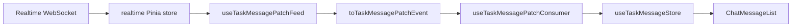
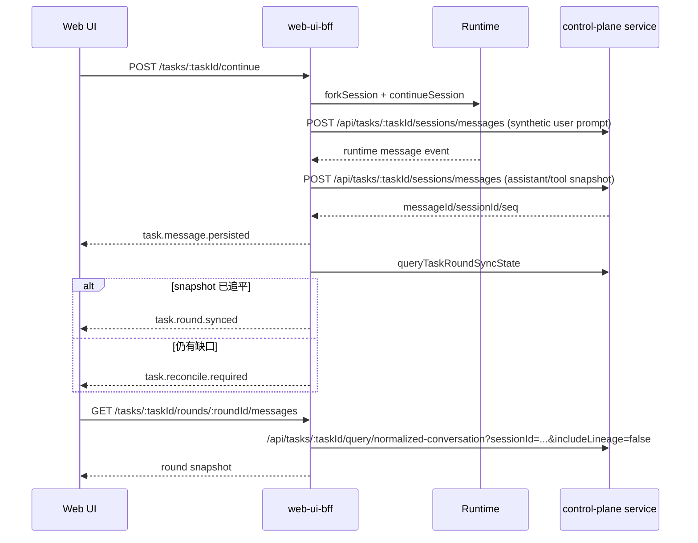

# TaskDetailV3 显示与写入逻辑全景

> 状态：基于 2026-04-13 当前代码实现整理
> 作者：GitHub Copilot
> 关联文档：[task-detail-unified-implementation-roadmap.md](task-detail-unified-implementation-roadmap.md)、[task-detail-realtime-persisted-coordination-plan.md](task-detail-realtime-persisted-coordination-plan.md)、[task-session-message-write-boundary-adr.md](task-session-message-write-boundary-adr.md)

## 1. 文档目的

这份文档不讨论“未来应该怎么改”，而是直接回答下面三个现状问题：

1. TaskDetailV3 页面当前到底显示哪些数据，它们分别从哪里来。
2. 用户在任务详情页上的各种操作，最终会走到哪些写接口。
3. runtime 流式消息如何回写到 control-plane，并重新回流到页面。

一句话总结当前实现：

1. 页面壳层很薄，真正的页面逻辑集中在 [useTaskDetailPageModel.ts](../control-plane/web-ui/src/composables/useTaskDetailPageModel.ts)；它主要负责编排 core context 与 feature，主区/侧栏字段分别由 [useTaskDetailMainPaneFeature.ts](../control-plane/web-ui/src/composables/useTaskDetailMainPaneFeature.ts) 和 [useTaskDetailSidebarPaneFeature.ts](../control-plane/web-ui/src/composables/useTaskDetailSidebarPaneFeature.ts) 组装。
2. 主聊天展示已经不是旧的 tree/messages 直接渲染，而是“round snapshot + realtime patch state machine”。
3. 写入分成两类：用户显式动作写入，和 runtime/SSE 驱动的后台镜像写入。

## 2. 总体结构

### 2.1 页面分层

| 层 | 入口 | 责任 |
| --- | --- | --- |
| 路由页 | [TaskDetailV3.vue](../control-plane/web-ui/src/pages/TaskDetailV3.vue) | 只创建 `page = reactive(useTaskDetailPageModel())` |
| 页面壳 | [TaskDetailPageShell.vue](../control-plane/web-ui/src/components/task-detail-v3/TaskDetailPageShell.vue) | 负责 header、main、sidebar 布局与切换 sidebar |
| 页面装配 | [useTaskDetailPageModel.ts](../control-plane/web-ui/src/composables/useTaskDetailPageModel.ts) | 聚合 task、session、message、workflow、compare、runtime permission、sidebar 等 feature |
| 主区 | [TaskDetailV3MainPane.vue](../control-plane/web-ui/src/components/task-detail-v3/TaskDetailV3MainPane.vue) | 渲染 workflow 概览、审批卡、聊天列表、composer、执行模式弹窗 |
| 侧栏 | [TaskDetailV3SidebarPane.vue](../control-plane/web-ui/src/components/task-detail-v3/TaskDetailV3SidebarPane.vue) | 渲染文件预览、执行跟踪、成员面板 |

### 2.2 页面装配顺序

[useTaskDetailPageModel.ts](../control-plane/web-ui/src/composables/useTaskDetailPageModel.ts) 当前按下面顺序组装页面：

可以把这 13 步再收敛成 4 组来看：

#### A. 先拿 core context 与页面派生状态

1. `useTaskDetailCoreContext(taskId)` 先拿到 task、session tree、消息 snapshot 和 message store。
1. `useTaskDetailTaskDerivedState(...)` 计算页面 loading、执行态、失败态、可编辑 execution mode。

这一组的目标是先把“当前页面站在什么 task / session / message 基线上”固定下来。

#### B. 再装配领域 feature

1. `useTaskWorkflowFeature(...)` 负责 workflow summary、执行模式 modal、模型列表。
1. `useTaskSidebarFeature(...)` 负责 trace/member/file-preview 侧栏状态；其中 member snapshot 已通过内部组合 `useTaskMemberViewFeature(...)` 吸收到 Sidebar 边界。
1. page model 直接把 workflow summary refresh 与 Sidebar 内 member refresh/load/reset 编排成统一的 workflow target，不再额外包一层 `useTaskWorkflowRefreshTarget(...)`。
1. `useTaskRuntimePermissionFeature(...)` 负责当前 session 的审批读写。
1. `useTaskDetailParallelFlow(...)` 负责并行候选读取与并行块插回主聊天列表；`useTaskParallelCandidateActions(...)` 负责采纳动作；`stopPhaseId / canTerminateExecution` 则由 page model 基于当前 parallel run 直接推导，不再额外包一层 `useTaskCompareFeature(...)`。
1. `useTaskConversationFeature(...)` 负责主聊天展示派生、切 round、continue、fork、terminate、排队继续执行。

这一组把页面真正关心的业务读写面装起来：workflow、sidebar、runtime permission、parallel flow、conversation。

#### C. 最后接 refresh / realtime 协调层

1. `useTaskDetailSnapshotCoordinator(...)` 负责初始快照加载、task/project 订阅，以及跨 feature 的 refresh fan-out。
1. `useTaskDetailRealtimeFeature(...)` 是一个薄 wrapper（约 20 行），内部组合 `useTaskDetailPollingState()` 和 `useTaskDetailRefreshController()`，对外统一提供 websocket patch 触发的 refresh 调度和运行中轮询能力。

这一组不生产新的业务视图，主要负责“什么时候重拉、重拉哪些、task/session focus 如何回流”。

#### D. 再把结果装成页面 section model

1. `useTaskDetailMainPaneFeature(...)` 把 conversation / compare / workflow / runtime permission / sidebar 输出装成主区模型，并补齐 composer disabled、queueCount、selectedModel、autoAdvanceEnabled 这类主区派生字段。
1. `useTaskDetailSidebarPaneFeature(...)` 把 file preview / trace / member 组合成侧栏模型，并计算 `showSidebarContent / showFilePreview / showMemberPanel`。
1. [useTaskDetailPageSectionModels.ts](../control-plane/web-ui/src/composables/useTaskDetailPageSectionModels.ts) 现在主要提供 `header/layout/main` 的模型 shape；页面最终对外暴露的是 `header/layout/main/sidebar` 四块模型，而不是再由单一 coordinator 把所有字段平铺到顶层。

这一组说明一个边界：TaskDetailV3 对外暴露的不是“所有字段的大平铺对象”，而是 `header / layout / main / sidebar` 四块 section model。

### 2.3 页面本地状态写面

除了真正的后端写口，TaskDetailV3 还维护一批只在前端生效的“写操作”：

1. 路由级： [useTaskDetailPageCoordinator.ts](../control-plane/web-ui/src/composables/useTaskDetailPageCoordinator.ts) 的 `handleTaskSwitch()` 只做 `router.replace(...)`；同一个 coordinator 还会自动清理历史 `?session=` query。
2. round 级： [useTaskConversationRoundActions.ts](../control-plane/web-ui/src/composables/useTaskConversationRoundActions.ts) 通过 `selectedSessionId` 和 `conversationFocusToken` 驱动当前 round / scroll focus 切换，不写后端。
3. 侧栏级： [useTaskSidebarFeature.ts](../control-plane/web-ui/src/composables/useTaskSidebarFeature.ts) 的 `collapsed`、`previewFile`、`toggleSidebar()`、`handleOpenFilePreview()`、`handleCloseFilePreview()` 全是本地 UI 状态；同一个 feature 现在也承接 member snapshot 的读取与 refresh 边界。
4. workflow UI 级： [useTaskWorkflowActions.ts](../control-plane/web-ui/src/composables/useTaskWorkflowActions.ts) 的 `showExecutionModeModal`、`modelsLoading` 等 modal / picker 状态也是前端本地态；只有 confirm 或 selected model change 才会真正写 task。

## 3. 显示读链

### 3.1 页面初始加载读什么

TaskDetailV3 的读链不是单一接口，而是三条并行事实源：

1. task 基本信息：由 [useProjectTreeTask.ts](../control-plane/web-ui/src/composables/useProjectTreeTask.ts) 调 [getTask()](../control-plane/web-ui/src/lib/api.ts) 读 BFF task，再叠加 `getProjectTreeNode()` 和 `getProjectTreeAncestors()` 用于 breadcrumb 和 nodeId。
2. session 上下文：由 [useTreeBranches.ts](../control-plane/web-ui/src/composables/useTreeBranches.ts) 调 [getTaskTreeSessionContext()](../control-plane/web-ui/src/lib/api.ts)，当前直接基于 `/tasks/:taskId/sessions` 的轻量读模型投影出 `sessionLineage + sessionSummaries + currentPhaseId`，不再并行双读 tree 与 sessions。
3. 消息快照：由 [useTaskMessageSnapshot.ts](../control-plane/web-ui/src/composables/useTaskMessageSnapshot.ts) 走 round facade；无显式 session 时先读 `current-round` 再读 `rounds/:roundId/messages`，有显式 session 时直接读 `rounds/:roundId/messages`，不再走主聊天 compat messages 读口。

这三条读链在 [useTaskDetailCoreContext.ts](../control-plane/web-ui/src/composables/useTaskDetailCoreContext.ts) 汇总成页面核心上下文。

### 3.2 为什么主聊天不直接读 `GET /tasks/:taskId/messages`

当前主聊天的 persisted baseline 优先走 round facade，而不是老的 task-wide messages：

1. [useTaskMessageSnapshot.ts](../control-plane/web-ui/src/composables/useTaskMessageSnapshot.ts) 在没有选中 session 时，先读 [getCurrentTaskRound()](../control-plane/web-ui/src/lib/api.ts)。
2. 如果页面已经选中某个 session，则直接用当前 session 标识读取 [getTaskRoundMessages()](../control-plane/web-ui/src/lib/api.ts)；BFF round facade 负责把 runtime session id / task session id / round id 统一解析到目标 round。
3. 当前主聊天不再通过 [getTaskMessages()](../control-plane/web-ui/src/lib/api.ts) 读取 persisted baseline；`/tasks/:taskId/messages` 和 `/tasks/:taskId/sessions/:sessionId/messages` 只保留给 legacy/兼容读口。

这意味着：

1. 主聊天现在的 baseline 是“当前 round 的消息”，不是“整个任务所有消息的粗聚合”。
2. session tree / round list 决定当前主聊天上下文。
3. 旧 `GET /tasks/:taskId/messages` 和 `GET /tasks/:taskId/sessions/:sessionId/messages` 仍存在，但更多承担兼容和其他面板用途。

需要注意的是，BFF 这里的“round facade”仍然是 facade，不是 service 原生 round store： [task-round-facade.ts](../control-plane/web-ui-bff/src/modules/tasks/task-round-facade.ts) 当前仍通过 session lineage + [fetchTaskSessionCachedCompatMessages()](../control-plane/web-ui-bff/src/modules/tasks/task-session-read-compat.ts) 合成大部分 `TaskRoundDto / TaskRoundMessagesDto`。但 `GET /tasks/:taskId/current-round` 已经进一步收敛成轻量 locator，只基于 session lineage 返回当前 round 标识；其 `promptText` 允许为空并标记 `partial: true`，不再为此额外读取 compat conversation。

### 3.3 session 上下文如何解析

[getTaskTreeSessionContext()](../control-plane/web-ui/src/lib/api.ts) 当前已经收敛成单次 session-context 读取：

1. 读 `/tasks/:taskId/sessions`。
2. 在前端 API 层把 session 列表直接投影成 `sessionSummaries` 和 `sessionLineage`。
3. 同时从 session 列表 meta 中拿 `currentPhaseId`，并把 `currentSessionId` 归一成 runtime session id。

然后 [useTreeBranches.ts](../control-plane/web-ui/src/composables/useTreeBranches.ts) 把它归一成：

1. `flatNodes`：页面内部使用的平铺 session 节点。
2. `selectedNode`：当前选中的 session 节点。
3. `taskSessionSummaries`：后续 round 映射、模型兜底、compare/workflow 派生都依赖它。
4. `currentPhaseId`：停止执行、并行采纳、workflow 显示都要用。

### 3.4 主区展示什么

[TaskDetailV3MainPane.vue](../control-plane/web-ui/src/components/task-detail-v3/TaskDetailV3MainPane.vue) 当前主区包含五类内容：

1. `TaskDetailQuickOverview`：如果 workflow summary 存在，就展示当前 stage、execution mode、auto advance 等概览。
2. 任务失败告警：读取 `taskFailureReason`。
3. 运行时审批卡片：读取 `selectedSessionRuntimePermissions`，并提供允许/拒绝动作。
4. 聊天主列表：由 `ChatMessageList` 渲染 `conversationItems`。
5. 底部 composer 和 `ExecutionModeModal`：负责 continue、terminate、模型切换和 execution mode 保存。

这些字段不是组件自己推导的，而是由 [useTaskDetailMainPaneFeature.ts](../control-plane/web-ui/src/composables/useTaskDetailMainPaneFeature.ts) 统一计算好后下发。

一个容易漏掉的细节是：主区虽然仍保留 `handleFork` 和 `forkDisabled`，但 [TaskDetailV3MainPane.vue](../control-plane/web-ui/src/components/task-detail-v3/TaskDetailV3MainPane.vue) 传给 `ChatComposer` 的是 `showFork=false`。也就是说，当前生产 UI 不显示分叉按钮，但页面模型和测试兼容入口仍保留 fork 动作。

### 3.5 侧栏展示什么

[TaskDetailV3SidebarPane.vue](../control-plane/web-ui/src/components/task-detail-v3/TaskDetailV3SidebarPane.vue) 当前只渲染三块：

1. 文件预览：来自 [useTaskSidebarFeature.ts](../control-plane/web-ui/src/composables/useTaskSidebarFeature.ts) 的 `previewFile`。
2. 执行追踪：永远存在，使用当前 `taskId + selectedSessionId + traceRefreshKey` 拉取。
3. member 面板：只有有 memberView 时才显示。

也就是说，当前 TaskDetailV3 没有把 workflow step 列表和 session tree 直接放进侧栏；它们分别被 workflow feature 和 compare/round feature 吸收到了主区逻辑里。

### 3.6 Header 当前真正显示哪些字段

[useTaskDetailHeaderModel()](../control-plane/web-ui/src/composables/useTaskDetailPageSectionModels.ts) 当前仍暴露 `currentStageLabel` 与 `taskDisplayStatus`，但 [TaskDetailPageShell.vue](../control-plane/web-ui/src/components/task-detail-v3/TaskDetailPageShell.vue) 真正渲染的只有：

1. breadcrumb：`TreeBreadcrumb`。
2. title：`task.title`。
3. header controls：`TaskSwitcher` 和 “展开/收起 Sidebar” 按钮。

这意味着 header model 里有一部分字段是为后续扩展或兼容保留的，并没有直接出现在当前页面 DOM 中。

### 3.7 Workflow 与 Member 视图从哪里来

workflow summary 和 member view 现在仍是两条前端读链，但 member 已被吸收到 Sidebar feature 内部：

1. [useTaskWorkflowFeature.ts](../control-plane/web-ui/src/composables/useTaskWorkflowFeature.ts) 负责 workflow summary、stage label、execution mode 相关动作；`loadInitialWorkflowSnapshot()` / `refreshWorkflowSnapshot()` 只回拉 [getTaskWorkflowView()](../control-plane/web-ui/src/lib/api.ts)。
2. [useTaskSidebarFeature.ts](../control-plane/web-ui/src/composables/useTaskSidebarFeature.ts) 内部组合 [useTaskMemberViewFeature.ts](../control-plane/web-ui/src/composables/useTaskMemberViewFeature.ts)，负责 member snapshot、loading 与 reconcile state；底层直接读取 [getTaskMemberView()](../control-plane/web-ui/src/lib/api.ts)。
3. BFF 对应路由仍然是 `GET /tasks/:taskId/workflow-view` 和 `GET /tasks/:taskId/member-view`。
4. 这两个 BFF facade 不是简单透传： [routes.ts](../control-plane/web-ui-bff/src/modules/tasks/routes.ts) 会先补 task/project 上下文，再通过 [workflow-view.ts](../control-plane/web-ui-bff/src/modules/tasks/workflow-view.ts) 和 [member-view.ts](../control-plane/web-ui-bff/src/modules/tasks/member-view.ts) 构造 view model。
5. 页面层现在直接在 [useTaskDetailPageModel.ts](../control-plane/web-ui/src/composables/useTaskDetailPageModel.ts) 里统一把 workflow summary refresh 和 Sidebar 内部的 member refresh/load/reset 编排成同一个 `workflow` refresh target，再交给 [useTaskDetailSnapshotCoordinator.ts](../control-plane/web-ui/src/composables/useTaskDetailSnapshotCoordinator.ts) 与 realtime refresh controller。
6. 如果 workflow 或 member 读链在 BFF 里触发了 legacy -> canonical 修复，BFF 仍会通过 `task.reconcile.required(scope=workflow)` 驱动前端回拉 snapshot。

### 3.8 Runtime Permission 从哪里来

runtime permission 的读链在 [useTaskRuntimePermissionView.ts](../control-plane/web-ui/src/composables/useTaskRuntimePermissionView.ts)：

1. 当前 `selectedSessionId` 变化时触发 [listTaskRuntimePermissions()](../control-plane/web-ui/src/lib/api.ts)。
2. 前端只展示“当前 session”的权限请求，不会把所有 session 的待审批混到一起。
3. BFF 路由是 `GET /tasks/:taskId/runtime-permissions?sessionId=...`，由 [routes.ts](../control-plane/web-ui-bff/src/modules/tasks/routes.ts) 转发到 runtime permission 读口。

### 3.9 执行追踪面板怎么加载

侧栏 trace 读链和主聊天 persisted baseline 是分开的：

1. [TaskExecutionTracePanel.vue](../control-plane/web-ui/src/components/task-detail-shared/TaskExecutionTracePanel.vue) 通过 [useTaskExecutionTrace.ts](../control-plane/web-ui/src/composables/useTaskExecutionTrace.ts) 调 [getTaskExecutionTraceView()](../control-plane/web-ui/src/lib/api.ts)。
2. API client 对应 BFF 路由是 `GET /tasks/:taskId/execution-trace?sessionId=...`。
3. BFF route 再调用 `buildTaskExecutionTrace(...)` 返回 trace timeline。
4. trace panel 当前会显式展示 `partial / none` 警告，不再隐式回退到 runtime messages；这和主聊天 round snapshot 是两条不同读面。

## 4. 主聊天显示状态机

### 4.1 persisted baseline

[useTaskMessageSnapshot.ts](../control-plane/web-ui/src/composables/useTaskMessageSnapshot.ts) 的职责非常单一：

1. 找到当前目标 round。
2. 拉 round messages。
3. 通过 `createTaskMessageSnapshotState(...)` 生成 `sourceMessages + trace + resolvedSessionId`。

它不负责实时消息，不负责 patch merge，也不负责 DOM 展示策略。

### 4.2 realtime overlay 已经不在组件层 merge

当前真正的消息展示逻辑在 [useTaskMessageStore.ts](../control-plane/web-ui/src/composables/useTaskMessageStore.ts)。它做了几件关键的事：

1. 把 snapshot 的 `sourceMessages` 归一成 `persistedItems`。
2. 从 [useTaskMessagePatchConsumer.ts](../control-plane/web-ui/src/composables/useTaskMessagePatchConsumer.ts) 读取当前 task 的 patch 事件。
3. 用 live assistant state + pending assistant draft + persistedItems 构建统一 `conversationState`。
4. 最终导出 `items` 和 `conversationItems` 给页面渲染。

这说明当前页面已经满足一个关键边界：

1. 页面组件不再手工 merge “persisted 列表 + realtime 列表”。
2. 统一状态机在 composable/store 层完成。

### 4.3 authority 切换规则

[useTaskMessageStore.ts](../control-plane/web-ui/src/composables/useTaskMessageStore.ts) 里有两层 authority：

1. `conversationAuthority`：根据 patch 事件直接记录当前趋势，是 `persisted` 还是 `realtime`。
2. `displayConversationAuthority`：真正给 UI 用的 authority，只有当 ack revision 已被 snapshot 追平时，才允许回到 `persisted`。

当前规则可以概括成：

1. 收到 `assistant-progress / assistant-delta / assistant-completed` 这类 patch，authority 切到 `realtime`。
2. 收到 `message-persisted / round-synced`，authority 逻辑上可回到 `persisted`。
3. 但如果最新 ack revision 大于当前 snapshot revision，`displayConversationAuthority` 仍保持 `realtime`，避免页面闪回到旧 snapshot。

这正是 [task-detail-realtime-persisted-coordination-plan.md](task-detail-realtime-persisted-coordination-plan.md) 里定义的核心思想在代码里的落点。

### 4.4 patch 事件从哪里来

web-ui 侧 patch 处理链路如下：

关键职责分别是：

1. [stores/realtime.ts](../control-plane/web-ui/src/stores/realtime.ts) 保存 websocket 原始事件并按 task/project 订阅。
2. [useTaskMessagePatchFeed.ts](../control-plane/web-ui/src/composables/useTaskMessagePatchFeed.ts) 从 Pinia store 中筛 task 相关事件。
3. [task-message-patch-event.ts](../control-plane/web-ui/src/lib/task-message-patch-event.ts) 把 realtime event 归一成前端 patch event。
4. [useTaskMessagePatchConsumer.ts](../control-plane/web-ui/src/composables/useTaskMessagePatchConsumer.ts) 通过 live assistant state manager 维护 session 维度的流式状态。

### 4.5 refresh 什么时候触发

[useTaskDetailRefreshController.ts](../control-plane/web-ui/src/composables/useTaskDetailRefreshController.ts) 负责把 patch 事件转换成真正的 refresh 行为，核心规则是：

1. `round-synced` 或 `message-reconcile-required` 只刷新消息 snapshot。
2. `task-reconcile-required` 会同时刷新 workflow + flow + messages 三者（全量刷新）。
3. flow 相关事件（`phase-created/updated/completed/failed/cancelled/awaiting-adoption/paused/resumed`、`session-created/updated`、`flow-reconcile-required`）刷新 compare/parallel flow snapshot。
4. workflow 相关事件（`session-created/updated`、`task-updated/completed/continued`、`task-node-updated`、`agent-started`、`task-hooks-updated`、`task-followup-started/completed/failed`、`workflow-reconcile-required`）刷新 workflow/member snapshot。
5. 如果 websocket 重连，会延迟触发一次消息 snapshot refresh。
6. 如果任务处于运行中，且满足轮询条件，会每 2 秒轮询一次；**没有** realtime 连接时同时拉 flow + messages，**有**连接时只拉 flow（因为有连接时 messages 由 websocket patch → snapshot refresh 驱动，不需要轮询补偿）。

这个 refresh 策略的入口在 [task-detail-refresh-policy.ts](../control-plane/web-ui/src/lib/task-detail-refresh-policy.ts)。

### 4.6 compare 如何插回主聊天

TaskDetailV3 主聊天里看到的并行候选块，并不是消息列表自己拼的，而是 page model 直接组合 [useTaskDetailParallelFlow.ts](../control-plane/web-ui/src/composables/useTaskDetailParallelFlow.ts) 和 [useTaskParallelCandidateActions.ts](../control-plane/web-ui/src/composables/useTaskParallelCandidateActions.ts) 后完成的。

它的做法是：

1. 先基于 `taskAgentRuns + taskSessionSummaries + flatNodes + baseConversationItems` 构造 parallel read model。
2. 再分别拉每个 candidate session 的消息和 trace 状态。
3. 用 `buildParallelConversationItems(...)` 生成并行候选块。
4. 最后用 `buildConversationItemsWithParallelRuns(...)` 把这些块插入 `baseConversationItems`。

因此页面主列表看到的 `conversationItems`，实际上已经是“主聊天 + 并行候选块”的合成结果。

## 5. 页面与用户写逻辑

### 5.1 页面本地写逻辑

这类交互会改页面状态，但不会直接打后端写口：

1. 任务切换：`TaskSwitcher` -> [useTaskDetailPageCoordinator.ts](../control-plane/web-ui/src/composables/useTaskDetailPageCoordinator.ts) 的 `handleTaskSwitch()` -> `router.replace(...)`。
2. 切 round / 聚焦对话： [useTaskConversationRoundActions.ts](../control-plane/web-ui/src/composables/useTaskConversationRoundActions.ts) 只改 `selectedSessionId` 和 `conversationFocusToken`。
3. 侧栏展开/收起、文件预览开关： [useTaskSidebarFeature.ts](../control-plane/web-ui/src/composables/useTaskSidebarFeature.ts) 只改 `collapsed / previewFile`。
4. 执行模式弹窗开关、模型列表 loading： [useTaskWorkflowActions.ts](../control-plane/web-ui/src/composables/useTaskWorkflowActions.ts) 只改 modal / picker 本地态。

### 5.2 Continue

前端入口在 [useTaskConversationActions.ts](../control-plane/web-ui/src/composables/useTaskConversationActions.ts) 的 `handleContinue()`。

行为分两种：

1. 如果任务还在执行或有 streaming assistant，输入不会立刻发出，而是进入 `queuedContinuations`。
2. 如果当前可发送，就调用 [continueTask()](../control-plane/web-ui/src/lib/api.ts) 走 `POST /tasks/:taskId/continue`。
3. continue 成功后，前端不再自己做多轮 `refreshTask()/refreshMessages()` 重试，而是读取 BFF 返回的统一 `execution` envelope，并交给 [useTaskDetailSnapshotCoordinator.ts](../control-plane/web-ui/src/composables/useTaskDetailSnapshotCoordinator.ts) 的 `reconcileExecutionEnvelope()` 做一次集中回流。

BFF 侧，`POST /:taskId/continue` 在 [routes.ts](../control-plane/web-ui-bff/src/modules/tasks/routes.ts) 中会进入 continue 流程。对单次 continue，当前实现是：

1. 基于当前 session 先 `forkSession(...)` 创建 child runtime session。
2. `upsertTaskPhase(...)` 建一条新的 single/continue phase。
3. 注册 child session 的 lineage / phase 关系。
4. 调 `continueSession(childSessionId, prompt, { model })` 真正让 runtime 开始执行。
5. `PATCH /api/tasks/:taskId`，把 task 改为 `running`，并更新当前 sessionId / agentRunId。
6. 立即通过 `persistTaskSessionMessageSnapshot(...)` 向 service 写入一条 synthetic user prompt，避免 task detail 时间线在 runtime 回包前完全空白。
7. BFF 响应里现在会附带统一的 `execution` envelope，至少包含 `nextSessionId / taskSessionId / roundId / acceptedRevision / refreshTargets`；前端用它做一次 session focus + snapshot reconcile。

也就是说，continue 不是直接在原 session 上发消息，而是“fork 子 session + phase 注册 + runtime continue + prompt 预写”。

这也意味着当前 continue 语义会线性增长 session lineage：每成功一次 continue，task 下就会新增一个 child session / round。在本文覆盖的页面主路径里，没有额外的前端或 BFF 自动合并这条 lineage 的逻辑；后续的 `getTaskTreeSessionContext()`、round facade、parallel flow 派生仍会继续消费这条增长后的 lineage。因此这里更适合被视为“规模风险 / 已知限制”，而不是会被系统自动折叠的临时结构。

### 5.3 Fork

前端 fork 入口也在 [useTaskConversationActions.ts](../control-plane/web-ui/src/composables/useTaskConversationActions.ts) 的 `handleFork()`。

当前行为是前端串两步：

1. 先调用 [forkTaskSession()](../control-plane/web-ui/src/lib/api.ts)，走 `POST /tasks/:taskId/sessions/:sessionId/fork`，只负责建 branch。
2. 再调用 [continueTask()](../control-plane/web-ui/src/lib/api.ts) 对新 branch 继续执行。
3. fork 与后续 continue 都会返回统一的 `execution` envelope；真正用于页面回流的是 continue 这一步返回的 envelope。

所以 fork 不是独立完成一次任务执行，而是“先造分支，再继续执行”。

### 5.4 Terminate

前端 terminate 入口在 [useTaskConversationActions.ts](../control-plane/web-ui/src/composables/useTaskConversationActions.ts) 的 `handleTerminate()`。

当前前端不再直接分支调用 `terminateAgent()` 或 `cancelTaskPhase()`，而是统一调用 [terminateTaskExecution()](../control-plane/web-ui/src/lib/api.ts)，走 `POST /tasks/:taskId/terminate`。BFF 内部再分流：

1. 如果有 `phaseId`，优先走 phase cancel。
2. 否则如果有 `agentRunId`，走 runtime terminate。

停止成功后，页面同样只消费统一 `execution` envelope，并通过 snapshot coordinator 做一次集中 reconcile。

### 5.5 采纳并行候选

前端入口在 [useTaskParallelCandidateActions.ts](../control-plane/web-ui/src/composables/useTaskParallelCandidateActions.ts) 的 `handleAdoptCandidate(index)`。

它会：

1. 先从当前 parallel run 解析 `phaseId`。
2. 调 [adoptParallelCandidate()](../control-plane/web-ui/src/lib/api.ts)，对应 `POST /tasks/:taskId/phases/:phaseId/candidates/:index/adopt`。
3. 采纳成功后直接把返回的 `execution` envelope 交给 snapshot coordinator，而不是在 action 里手写 refresh fan-out。

BFF 当前采纳流程是：

1. 校验 phase 和 candidateIndex 是否有效。
2. 构建 candidate adoption context，找出 winner session。
3. 停止非 winner candidate session。
4. 激活 winner session。
5. 调 service 的 `POST /api/tasks/:taskId/phases/:phaseId/adopt` 写入采纳结果。
6. 再补 task/session 的收尾 patch，使页面能立刻看到 winner 状态。

### 5.6 运行时审批回复

审批读写由 [useTaskRuntimePermissionFeature.ts](../control-plane/web-ui/src/composables/useTaskRuntimePermissionFeature.ts) 承接。

读链：

1. [useTaskRuntimePermissionView.ts](../control-plane/web-ui/src/composables/useTaskRuntimePermissionView.ts) 在 `selectedSessionId` 变化时调用 [listTaskRuntimePermissions()](../control-plane/web-ui/src/lib/api.ts)。
2. BFF 对应路由是 `GET /tasks/:taskId/runtime-permissions?sessionId=...`。

写链：

1. [useTaskRuntimePermissionActions.ts](../control-plane/web-ui/src/composables/useTaskRuntimePermissionActions.ts) 调 [replyTaskRuntimePermission()](../control-plane/web-ui/src/lib/api.ts)。
2. BFF 路由是 `POST /tasks/:taskId/runtime-permissions/:requestId/reply`。
3. BFF 先校验该 requestId 属于当前 task，再调用 runtime provider 的 `replyRuntimePermission(...)`。
4. 成功后页面会同时 refresh runtime permissions 和 task snapshot。

### 5.7 模型选择与执行模式保存

执行模式和模型选择属于 workflow feature，不走消息写口。

入口都在 [useTaskWorkflowActions.ts](../control-plane/web-ui/src/composables/useTaskWorkflowActions.ts)：

1. `handleSelectedModelChange(model)` 调 [updateTask()](../control-plane/web-ui/src/lib/api.ts)，写 `PATCH /tasks/:taskId`。
2. `handleExecutionModeConfirm(overrides)` 也是调 `updateTask()`，把 execution mode / parallel candidates / sequential steps / judge config 序列化进 task patch。

这类改动只影响后续执行，不直接往当前 round 注入消息。

## 6. 后台自动写回链路

用户在页面点击按钮只是写链的一半。另一半是 runtime 产生消息后，BFF 和 service 如何把它变成 TaskDetailV3 能读的 canonical 数据。

### 6.1 BFF 主动预写 synthetic prompt

在 continue、parallel execute、workflow stage execute 等路径里，BFF 会主动调用 [persistTaskSessionMessageSnapshot()](../control-plane/web-ui-bff/src/modules/tasks/task-session-store.ts)，把 synthetic user prompt 写到 service 的 `/api/tasks/:taskId/sessions/messages`。

目的有两个：

1. 让时间线里先有 user prompt，不必等 runtime 首包。
2. 保证 round/message 排序不被 assistant 首包抢到前面。

### 6.2 runtime assistant/tool 消息如何回写

真正的 assistant/tool 消息不是前端直接 POST 的，而是 BFF realtime 层镜像写入。

[sse-aggregator.ts](../control-plane/web-ui-bff/src/modules/realtime/sse-aggregator.ts) 内部有两条写入路径，各自由不同的 runtime event 类型触发：

**路径 A：`persistSessionMessageSnapshot()`** — 仅在 `event.type === "message.updated"` 时触发。

内部还有过滤逻辑：如果 `rawType === "message.part.updated"`，则 tool part 只在终态（`completed / failed / error / cancelled`）时才写库；非 text/tool 类型的 part 直接跳过。这意味着中间态的 tool part 不会被频繁写库。

通过后，该方法会：

1. 调用 `resolvePersistableMessageSnapshot(event)` 组装出可持久化的 message snapshot。
2. 对 user role 消息，会将 id 改写为 `${sessionId}:user-prompt` 以与 BFF 预写的 synthetic prompt 做 upsert 合并。
3. 调 `persistTaskSessionMessageSnapshot(taskId, authorization, { runtimeSessionId, message })`。
4. 拿到 service 返回的 `messageId/sessionId/seq` 后，立刻发 `task.message.persisted`。
5. 再查询 round sync state，如果 snapshot 已追平就发 `task.round.synced`，否则发 `task.reconcile.required`。

**路径 B：`persistToolExecutionSnapshot()`** — 仅在 `event.type === "tool.execute.before"` 或 `event.type === "tool.execute.after"` 时触发。

该方法会调用 `buildPersistableToolMessageSnapshot(event)` 构造 tool message，随后走同样的 `persistTaskSessionMessageSnapshot(...)` → `emitTaskPersistenceAck(...)` → `emitTaskRoundSyncOrReconcile(...)` 链路。

两条路径最终都汇入同一个外部函数 `persistTaskSessionMessageSnapshot()`（来自 [task-session-store.ts](../control-plane/web-ui-bff/src/modules/tasks/task-session-store.ts)），保证 assistant 消息和 tool 消息都有 canonical 持久化和前端 ack 事件。

### 6.3 service 写口的统一入口

service 侧统一写口不是单个黑盒函数，而是下面四层 wiring：

1. [task-session-routes.ts](../control-plane/service/src/modules/tasks/task-session-routes.ts) 的 `registerTaskSessionRoutes()` 暴露 `POST /api/tasks/:taskId/sessions/messages`。
2. [task-route-session-registrations.ts](../control-plane/service/src/modules/tasks/task-route-session-registrations.ts) 的 `buildTaskSessionRegistrations()` 把这条路由绑定到 `branchWriteApi.persistTaskBranchMessage()`。
3. [task-branch-write.ts](../control-plane/service/src/modules/tasks/task-branch-write.ts) 的 `persistTaskBranchMessage()` 会先补/同步 session lineage 和 compat tree，再过滤不应落库的 standalone part event，最后调用 `upsertConversationMessageRecord()`。
4. [task-route-builder-shared.ts](../control-plane/service/src/modules/tasks/task-route-builder-shared.ts) 把 `upsertConversationMessageRecord()` 绑定到 `sessionMessageWriteApi.upsertTaskSessionMessageRecord()`；真正的 canonical message 落库在 [task-session-message-write-api.ts](../control-plane/service/src/modules/tasks/task-session-message-write-api.ts) 内完成。

另外 service 还暴露了 `POST /api/tasks/:taskId/sessions/:sessionId/messages` 这条“直接发消息”路由，但当前 TaskDetailV3 的 continue/fork 主路径并不直接使用它；现网主路径仍是 `POST /tasks/:taskId/continue` + BFF synthetic prompt / runtime mirror persistence。

`POST /api/tasks/:taskId/sessions/messages` 这条路由使用 [persistTaskBranchMessageSchema](../control-plane/service/src/modules/tasks/task-branch-write.ts) 做校验，要求：

1. 必须有 `runtimeSessionId`。
2. `message` 必须满足共享 runtime message schema。

### 6.4 runtime message schema 约束了什么

[task-session-runtime-message-schema.ts](../control-plane/service/src/modules/tasks/task-session-runtime-message-schema.ts) 当前把入站 message contract 收得比较紧，关键约束是：

1. 必须能解析出稳定 `runtimeMessageId`，不能缺 id。
2. 必须显式带 role。
3. 必须显式带内容，内容可以来自 `parts`、`part`、`text`、`textContent`、`content`、`promptDecomposition` 或 error payload。
4. tool part 也必须有显式 part content，不能传空壳 part。

这保证了 control-plane 写口不再接受“缺 id、缺 role、缺正文”的任意 runtime payload。

### 6.5 canonical 持久化时实际写哪些表

[task-session-message-write-api.ts](../control-plane/service/src/modules/tasks/task-session-message-write-api.ts) 中的 `createTaskSessionMessageWriteApi()` / `upsertTaskSessionMessageRecord()` 是真正的核心写实现。当前主路径大致是：

1. `parseTaskSessionRuntimeMessage(...)` 先把原始 payload 解析成共享 runtime schema。
2. `resolveTaskSessionMessageRouting(...)` 决定这条消息最终应该落到哪个 task session。
3. upsert `task_session_runs`，保证 session 运行记录存在且状态被推进。
4. upsert `task_messages`，这是 canonical message 真源。
5. upsert `task_message_parts`，保持 message parts 与 partIndex 自然键一致。
6. 同步 tool execution facts 到 operation/artifact 相关表。
7. upsert `task_timeline_views`，让 timeline / execution-trace 侧能直接消费。
8. update `task_sessions`，推进 `status / executionStatus / headMessageId / lastActivityAt / latestRunId`。

当前读写边界里最重要的一点是：TaskDetailV3 最终依赖的消息和时间线，都已经围绕 canonical `task_messages + task_timeline_views` 建立，而不是继续把 runtime payload 当页面的长期真源。

### 6.6 当前已知的失败与降级路径

这份文档主体描述的是主成功路径，但当前代码里至少还有下面几类明确存在的失败与降级处理：

1. continue 主路径失败：如果当前 task 没有关联 session，BFF 直接返回 `400`；如果 `forkSession(...)` 或 continue phase session 注册失败，BFF 返回 `502`，不会进入 runtime continue；如果 `continueSession(...)` 失败，BFF 会尽力归档新建的 child session lineage，并把 phase 标成 `failed` 后再把错误返回前端。
2. synthetic prompt 预写失败不会阻断 continue 成功：`persistTaskSessionMessageSnapshot(...)` 在 continue 路径里是 best-effort，失败后 BFF 仍会返回 `execution` envelope，只是其中的 `acceptedRevision` 可能为空，页面随后更依赖 realtime patch 和后续 snapshot reconcile 来追平。
3. 前端 action 失败时不会主动清空当前页面：continue / fork / terminate / adopt 这些 action 层当前都是 catch 异常后弹出 error message；如果没有拿到可用的 `execution` envelope，当前页会保留已有 snapshot，而不是强制回退为空白态。
4. realtime 镜像落库失败时不会立刻产生 ack：`sse-aggregator.ts` 在 `persistSessionMessageSnapshot()` 和 `persistToolExecutionSnapshot()` 外层只做错误日志记录；这条失败路径下，前端不会立刻收到 `task.message.persisted` / `task.round.synced` 这组 ack。
5. silent refresh 失败时优先保住当前页面：snapshot coordinator 和 refresh controller 都显式吞掉 silent refresh 异常，目标是“保留现有页面状态”，而不是为了对齐数据把主区或侧栏清成空白。
6. websocket 断线或 round 尚未追平时会进入降级模式：没有 realtime 连接时，running poll 会退化为定时补拉 flow + messages；如果 BFF 发的是 `task.reconcile.required` 而不是 `task.round.synced`，前端会继续保持 realtime authority，直到 snapshot revision 追平 ack revision。

## 7. 前端如何收到后台写回结果

下面这条链是 TaskDetailV3 显示无缝切换的关键：

TaskDetailV3 前端对应处理是：

1. websocket 收到 event 后，进入 realtime store。
2. patch feed 把它们归一为 `assistant-progress / assistant-delta / message-persisted / round-synced / message-reconcile-required`。
3. message store 先用 realtime authority 渲染流式文本。
4. refresh controller 再按 event kind 延迟刷新 snapshot。
5. 只有当 snapshot revision 追平 ack revision 时，`displayConversationAuthority` 才回到 persisted。

## 8. 真源边界

当前 TaskDetailV3 相关真源可以这样理解：

| 领域 | 当前真源 | 页面消费入口 |
| --- | --- | --- |
| task 基本信息 | BFF task read model + project tree | [useProjectTreeTask.ts](../control-plane/web-ui/src/composables/useProjectTreeTask.ts) |
| session lineage / phase meta | `/tasks/:taskId/sessions` 轻量投影 | [useTreeBranches.ts](../control-plane/web-ui/src/composables/useTreeBranches.ts) |
| 主聊天 persisted baseline | round facade 读取投影（非 canonical 真源） | [useTaskMessageSnapshot.ts](../control-plane/web-ui/src/composables/useTaskMessageSnapshot.ts) |
| 主聊天 realtime 流式态 | websocket patch feed | [useTaskMessageStore.ts](../control-plane/web-ui/src/composables/useTaskMessageStore.ts) |
| compare 候选块 | parallel flow read model + candidate session state | [useTaskDetailParallelFlow.ts](../control-plane/web-ui/src/composables/useTaskDetailParallelFlow.ts) |
| workflow summary | workflow BFF facade | [useTaskWorkflowFeature.ts](../control-plane/web-ui/src/composables/useTaskWorkflowFeature.ts) |
| member view | member BFF facade | [useTaskSidebarFeature.ts](../control-plane/web-ui/src/composables/useTaskSidebarFeature.ts) 内部组合 [useTaskMemberViewFeature.ts](../control-plane/web-ui/src/composables/useTaskMemberViewFeature.ts) |
| runtime permissions | runtime permission BFF route | [useTaskRuntimePermissionView.ts](../control-plane/web-ui/src/composables/useTaskRuntimePermissionView.ts) |
| 执行追踪侧栏 | execution trace BFF facade | [useTaskExecutionTrace.ts](../control-plane/web-ui/src/composables/useTaskExecutionTrace.ts) |
| 侧栏折叠 / 文件预览 | 前端本地 UI 状态 | [useTaskSidebarFeature.ts](../control-plane/web-ui/src/composables/useTaskSidebarFeature.ts) |
| canonical message persistence | control-plane service task message write API | [task-session-message-write-api.ts](../control-plane/service/src/modules/tasks/task-session-message-write-api.ts) |

需要特别强调的是：这里把“主聊天 persisted baseline”写成 round facade，只是在描述页面当前的读取入口，不是在说 round 本身就是 service 的 canonical 真源。当前 round facade 仍由 BFF 基于 session lineage + normalized/cached conversation 动态合成；真正的长期真源仍是 `task_messages`、`task_message_parts`、`task_timeline_views`、`task_sessions` 等 canonical 对象。

## 9. 一页式主链路矩阵

这一节只保留当前现网主路径里最常用、最需要定位的链路，但不再把“用户显式触发的主交互”和“runtime/BFF 自动驱动的后台写回”混在一张表里。

### 9.1 主交互动作

这一段只看“页面上点了什么，系统就会走什么主链路”。

说明：

1. “主要 service 表/投影” 只写当前主路径里能直接确认的核心对象，不试图穷尽所有旁路表。
2. 如果某一行是纯前端状态变更，BFF / service / 表会明确标记为“无”。
3. Continue 行里仍保留 synthetic prompt 预写，因为它是 continue 主编排的一部分，不是独立的 realtime 镜像写回链路。

| 页面动作 / 链路 | 前端入口 | web-ui API / 页面路由 | BFF route / 主编排 | service API | 主要 service 表 / 投影 | 页面回流方式 |
| --- | --- | --- | --- | --- | --- | --- |
| 切任务 | [useTaskDetailPageCoordinator.ts](../control-plane/web-ui/src/composables/useTaskDetailPageCoordinator.ts) `handleTaskSwitch()` | Vue Router `replace({ name: "TaskDetailV3" })` | 无 | 无 | 无 | 触发 [useProjectTreeTask.ts](../control-plane/web-ui/src/composables/useProjectTreeTask.ts) + [useTaskDetailSnapshotCoordinator.ts](../control-plane/web-ui/src/composables/useTaskDetailSnapshotCoordinator.ts) 重新加载 |
| 切 round / 聚焦主聊天 | [useTaskConversationRoundActions.ts](../control-plane/web-ui/src/composables/useTaskConversationRoundActions.ts) `handleSwitchRound()` / `bumpConversationFocus()` | 无 | 无 | 无 | 无 | 只改 `selectedSessionId` / `conversationFocusToken`，随后主聊天和 trace 读面自动切 session |
| 展开 Sidebar / 文件预览 | [useTaskSidebarFeature.ts](../control-plane/web-ui/src/composables/useTaskSidebarFeature.ts) `toggleSidebar()` / `handleOpenFilePreview()` | 无 | 无 | 无 | 无 | 只改 `collapsed` / `previewFile` 本地状态 |
| Continue | [useTaskConversationActions.ts](../control-plane/web-ui/src/composables/useTaskConversationActions.ts) `handleContinue()` | [api.ts](../control-plane/web-ui/src/lib/api.ts) `continueTask()` -> `POST /tasks/:taskId/continue` | [routes.ts](../control-plane/web-ui-bff/src/modules/tasks/routes.ts) `continueTaskExecution()` -> `continueSingleTaskExecutionFlow()` 或 `continueParallelTaskExecutionFlow()` | `POST /api/tasks/:taskId/phases`、`POST /api/tasks/:taskId/sessions`、`PATCH /api/tasks/:taskId`、`POST /api/tasks/:taskId/sessions/messages` | `taskExecutionPhases`、`taskSessions`、`taskSessionRuns`、`taskMessages`、`taskMessageParts`、`taskTimelineViews`、`taskSnapshots` | 先 `seedPendingAssistantDraft()`，再消费统一 `execution` envelope，经 `reconcileExecutionEnvelope()` 做单次 snapshot 回流 |
| Fork | [useTaskConversationActions.ts](../control-plane/web-ui/src/composables/useTaskConversationActions.ts) `handleFork()` | [api.ts](../control-plane/web-ui/src/lib/api.ts) `forkTaskSession()` -> `POST /tasks/:taskId/sessions/:sessionId/fork`，随后再次调 `continueTask()` | [routes.ts](../control-plane/web-ui-bff/src/modules/tasks/routes.ts) `executeTaskBranchFork()`，随后复用 `continueTaskExecution()` | `POST /api/tasks/:taskId/sessions`，随后同 Continue 行的 phase / task / message 写口 | `taskSessions`、`taskSessionRuns`，随后同 Continue 行的 `taskExecutionPhases / taskMessages / taskTimelineViews / taskSnapshots` | fork/continue 都返回统一 `execution` envelope；页面最终按 continue 返回的 envelope 做单次 reconcile |
| Terminate | [useTaskConversationActions.ts](../control-plane/web-ui/src/composables/useTaskConversationActions.ts) `handleTerminate()` | [api.ts](../control-plane/web-ui/src/lib/api.ts) `terminateTaskExecution()` -> `POST /tasks/:taskId/terminate` | [routes.ts](../control-plane/web-ui-bff/src/modules/tasks/routes.ts) `executeTaskTermination()`，内部再分流 phase cancel 或 runtime terminate | `POST /api/tasks/:taskId/phases/:phaseId/cancel`（phase 路径）或 runtime terminate | `taskExecutionPhases`、`taskSessions`、`taskSnapshots` | 成功后直接消费统一 `execution` envelope，经 `reconcileExecutionEnvelope()` 做单次 snapshot 回流 |
| 采纳并行候选 | [useTaskParallelCandidateActions.ts](../control-plane/web-ui/src/composables/useTaskParallelCandidateActions.ts) `handleAdoptCandidate()` | [api.ts](../control-plane/web-ui/src/lib/api.ts) `adoptParallelCandidate()` -> `POST /tasks/:taskId/phases/:phaseId/candidates/:index/adopt` | [routes.ts](../control-plane/web-ui-bff/src/modules/tasks/routes.ts) `buildPhaseFirstCandidateAdoptionContext()` + `finalizePhaseFirstCandidateAdoption()` | `POST /api/tasks/:taskId/phases/:phaseId/adopt`，并伴随 winner session activation / non-winner session stop | `taskExecutionPhases`、`taskSessions`、`taskSnapshots` | 采纳成功后直接消费统一 `execution` envelope，经 `reconcileExecutionEnvelope()` 做单次 snapshot 回流 |
| 运行时审批回复 | [useTaskRuntimePermissionActions.ts](../control-plane/web-ui/src/composables/useTaskRuntimePermissionActions.ts) `handleReplyRuntimePermission()` | [api.ts](../control-plane/web-ui/src/lib/api.ts) `replyTaskRuntimePermission()` -> `POST /tasks/:taskId/runtime-permissions/:requestId/reply` | [routes.ts](../control-plane/web-ui-bff/src/modules/tasks/routes.ts) 先 `resolveTaskRuntimePermission()`，再调 runtime provider `replyRuntimePermission()` | 无 task service 写 API；BFF 直接处理 runtime permission reply | 无直接 canonical task 表写入；后续影响通过 task refresh / runtime side effect 回读 | 成功后 `refreshRuntimePermissions(true)` + `refreshTaskSnapshot({ messages: true, workflow: true, flow: true })` |
| 更新 selected model | [useTaskWorkflowActions.ts](../control-plane/web-ui/src/composables/useTaskWorkflowActions.ts) `handleSelectedModelChange()` | [api.ts](../control-plane/web-ui/src/lib/api.ts) `updateTask()` -> `PATCH /tasks/:taskId` | [routes.ts](../control-plane/web-ui-bff/src/modules/tasks/routes.ts) `PATCH /tasks/:taskId` 透传 | `PATCH /api/tasks/:taskId` | tree-backed task record、task aggregate 同步、`taskSnapshots` 投影；如 body 含 `sessionId` 还会补 `taskSessions` | 成功后 `refreshTask(false)` |
| 保存 execution mode / parallel candidates / sequential steps / judge config | [useTaskWorkflowActions.ts](../control-plane/web-ui/src/composables/useTaskWorkflowActions.ts) `handleExecutionModeConfirm()` | [api.ts](../control-plane/web-ui/src/lib/api.ts) `updateTask()` -> `PATCH /tasks/:taskId` | 同上，BFF 直接透传 task patch | `PATCH /api/tasks/:taskId` | tree-backed task record、task aggregate 同步、`taskSnapshots` 投影 | 成功后关闭 modal，并 `refreshTask(false)`；新配置在下一次执行时生效 |

### 9.2 后台镜像写回

这一段只保留不依赖显式点击、由 runtime / BFF 自动触发的 canonical 写回链路。

| 后台链路 / 触发源 | 前端入口 | web-ui API / 页面路由 | BFF route / 主编排 | service API | 主要 service 表 / 投影 | 页面回流方式 |
| --- | --- | --- | --- | --- | --- | --- |
| runtime assistant / tool 镜像落库 | 无显式用户点击；来源于 runtime 事件 | 无 | [sse-aggregator.ts](../control-plane/web-ui-bff/src/modules/realtime/sse-aggregator.ts) `persistSessionMessageSnapshot()` / `persistToolExecutionSnapshot()` -> `persistTaskSessionMessageSnapshot()` | `POST /api/tasks/:taskId/sessions/messages` | `taskSessions`、`taskSessionRuns`、`taskMessages`、`taskMessageParts`、`taskOperations`、`taskArtifacts`、`taskTimelineViews` | BFF 立即广播 `task.message.persisted`，随后再发 `task.round.synced` 或 `task.reconcile.required` |

## 10. 关键结论

如果只保留最重要的系统结论，当前 TaskDetailV3 可以概括成下面 6 点：

1. 页面层已经很薄，绝大多数任务详情逻辑都被吸进了 page model 和 feature composables。
2. session tree 与 task 基本信息仍依赖 tree 读口，但主聊天 persisted baseline 已经切到 round facade；这里的 round 仍是 BFF projection，不是 service 原生真源表。
3. 主聊天展示不是简单列表直出，而是 `useTaskMessageStore()` 管理的一套统一状态机。
4. compare 候选块不是独立页面，而是插入到主聊天 `conversationItems` 中的一层投影；continue / fork / terminate / 采纳候选 虽然仍走各自 API，但现在共享同一种 `execution` envelope，并统一汇入 snapshot coordinator 的单次 reconcile 路径。
5. BFF 不只是转发 HTTP，它还负责 session lineage、phase、synthetic prompt 和 runtime mirror persistence 的编排；service `/api/tasks/:taskId/sessions/messages` 则是消息 canonical 写入总入口。
6. 页面之所以能从 realtime 平滑切回 persisted，依赖的是 `task.message.persisted` / `task.round.synced` 这组 ack 事件，以及前端对 snapshot revision 的追平判断。

## 11. 当前代码相对旧心智的修正

这一节不再重复“系统结论”，只保留那些最容易把人带回旧心智的纠偏点：

1. 不要再用旧 `useTaskDetailActionCoordinator()` / `useTaskDetailViewStateCoordinator()` 去理解生产主路径；当前生产路径已经拆成 conversation / parallel flow / workflow / runtime permission / realtime / sidebar 等独立 feature。
2. 不要把页面输出想成“所有字段的大平铺对象”；`useTaskDetailPageSectionModels.ts` 现在主要提供 section model shape，真正的主区/侧栏装配已经分别下沉到 [useTaskDetailMainPaneFeature.ts](../control-plane/web-ui/src/composables/useTaskDetailMainPaneFeature.ts) 与 [useTaskDetailSidebarPaneFeature.ts](../control-plane/web-ui/src/composables/useTaskDetailSidebarPaneFeature.ts)。
3. 不要把页面动作和页面展示理解成完全对称：例如 `handleFork()` 仍存在，但主区当前不显示 fork 按钮；header model 里也仍有 stage/status 字段，但当前 shell 没有把它们渲染出来。
4. 不要再把 trace 缺口理解成“系统会静默帮你补成完整时间线”；侧栏执行追踪现在会显式表达 `partial / none`，不再回退到 runtime message 伪装成完整 timeline。

## 12. 文档维护约定

这份文档是“当前实现全景”，不是设计提案；下面几类改动发生时，应同步更新本文对应章节：

1. 页面装配边界变化：`useTaskDetailPageModel.ts` 的 feature 组合顺序、`header / main / sidebar` model 边界、snapshot coordinator / realtime feature 职责变化。
2. 主读链变化：task/tree/sessions/round facade/message store/parallel flow/workflow/member/trace/runtime permissions 的读取入口、真源边界或 fallback 策略变化。
3. 主写链变化：continue / fork / terminate / adopt / runtime permission / execution mode 的前端入口、BFF route、`execution` envelope shape 或页面回流方式变化。
4. realtime mirror persistence 变化：`sse-aggregator.ts` 的触发事件、ack 事件种类、round sync / reconcile 判定变化。
5. canonical persistence 变化：task message write API 的主表/投影、schema 约束或 route wiring 变化。

如果只是性能优化、未来方案、理想架构讨论，应优先写到 roadmap、ADR 或专项设计文档，而不是继续把本文扩成“现状 + 方案 + 展望”的混合文档。
