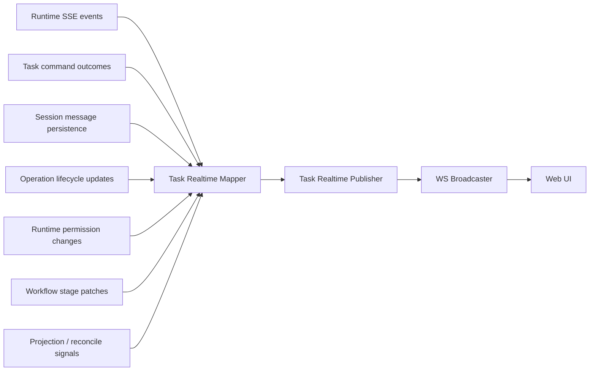

# TaskDetail Realtime Broadcaster Mapper 草案

> 状态：Draft v1
> 日期：2026-03-29
> 作者：GitHub Copilot
> 关联文档：[task-detail-realtime-event-contract.md](task-detail-realtime-event-contract.md)、[task-session-message-service-route-dto-draft.md](task-session-message-service-route-dto-draft.md)、[task-detail-message-state-machine-plan.md](task-detail-message-state-machine-plan.md)

## 1. 文档目的

这份文档定义一层统一的 broadcaster mapper，用来回答一个核心问题：

**service/BFF 内部事件，应该如何被映射成 web-ui 可消费的 `task.*` public realtime DTO。**

这份文档不定义最终页面行为，那已经在 realtime contract 和 TaskDetail 状态机文档里定义过了。这里聚焦的是“服务端出口层”。

## 2. 现状问题

当前 realtime 广播存在三个入口：

1. `sseAggregator` 会把 runtime SSE 事件转成 `RealtimeEvent` 后直接广播
2. `tasks/routes.ts` 会在任务创建、继续、完成等动作里直接 `wsBroadcaster.broadcast(...)`
3. `agent-control/routes.ts` 会在暂停、恢复、终止等动作里直接 `wsBroadcaster.broadcast(...)`

相关入口包括：

1. [control-plane/web-ui-bff/src/modules/realtime/sse-aggregator.ts](../control-plane/web-ui-bff/src/modules/realtime/sse-aggregator.ts)
2. [control-plane/web-ui-bff/src/modules/tasks/routes.ts](../control-plane/web-ui-bff/src/modules/tasks/routes.ts)
3. [control-plane/web-ui-bff/src/modules/agent-control/routes.ts](../control-plane/web-ui-bff/src/modules/agent-control/routes.ts)
4. [control-plane/web-ui-bff/src/modules/realtime/ws-broadcaster.ts](../control-plane/web-ui-bff/src/modules/realtime/ws-broadcaster.ts)

问题在于：

1. 广播口不唯一
2. 当前广播 payload 多数是内部语义，不是稳定 public DTO
3. 页面还在直接解析 `message.updated`、`rawType`、`data.info`、`data.part`
4. 任何新增 runtime 事件都可能无意间泄漏到前端 contract

## 3. 目标架构

目标架构只有一句话：

**所有 domain realtime 事件都必须先进入 mapper，再由 broadcaster 发送给 web-ui。**



## 4. 设计原则

### 4.1 统一出口原则

除了 websocket 控制帧之外，禁止任何模块直接调用 `wsBroadcaster.broadcast(...)` 发送页面业务事件。

必须改成：

1. 先 emit 内部 source event
2. 再由 mapper 转成 public DTO
3. 最后由 publisher 调用 broadcaster

### 4.2 只广播已提交事实

mapper 只能基于“数据库已经提交成功的事实”生成 public DTO。

也就是说：

1. 不能在事务提交前广播 `task.message.created`
2. 不能用纯 runtime chunk 临时拼出浏览器 contract
3. 如需发 delta，必须先完成对应 message flush

### 4.3 mapper 是协议边界，不是业务执行器

mapper 负责：

1. 规范事件 envelope
2. 填充 ordering / eventId
3. 把内部 source event 映射成一个或多个 public DTO

mapper 不负责：

1. 写数据库
2. 调模型
3. 做页面级状态 patch
4. 维护 websocket 连接

### 4.4 前端不再理解 runtime payload

mapper 的直接目标，就是让 web-ui 永远不需要再知道：

1. `rawType`
2. `data.info`
3. `data.part`
4. runtime `message.updated`
5. runtime `tool.execute.before/after`

## 5. 建议文件布局

建议新增 4 个文件：

1. `control-plane/web-ui-bff/src/modules/realtime/task-realtime-source-events.ts`
2. `control-plane/web-ui-bff/src/modules/realtime/task-realtime-public-types.ts`
3. `control-plane/web-ui-bff/src/modules/realtime/task-realtime-event-mapper.ts`
4. `control-plane/web-ui-bff/src/modules/realtime/task-realtime-publisher.ts`

职责建议：

1. `task-realtime-source-events.ts`：内部 source event 联合类型
2. `task-realtime-public-types.ts`：public websocket DTO，和 web-ui 文档保持一致
3. `task-realtime-event-mapper.ts`：纯映射逻辑
4. `task-realtime-publisher.ts`：生成 eventId / sequence 后调用 `wsBroadcaster`

## 6. 内部 Source Event 分类

统一 mapper 之前，先统一“输入事件”的分类。

## 6.1 Source Event 总联合类型

```ts
export type TaskRealtimeSourceEvent =
  | UserMessagePersistedSourceEvent
  | AssistantPlaceholderPersistedSourceEvent
  | AssistantMessageDeltaFlushedSourceEvent
  | AssistantMessageCompletedSourceEvent
  | AssistantMessageFailedSourceEvent
  | AssistantMessageCancelledSourceEvent
  | SessionOperationUpdatedSourceEvent
  | TaskSnapshotChangedSourceEvent
  | RuntimePermissionChangedSourceEvent
  | WorkflowStagePatchSourceEvent
  | ReconcileRequiredSourceEvent
  | AgentControlStateChangedSourceEvent
  | LegacyRuntimeRawEventSourceEvent;
```

这里故意保留 `LegacyRuntimeRawEventSourceEvent`，因为迁移期内仍然会从 `sseAggregator` 收到原始 runtime 事件；但它不允许直接变成 public DTO，必须先被更高层事实事件吸收，或只作为 fallback 诊断源。

## 6.2 建议的 Source Event 形状

```ts
interface TaskRealtimeSourceEventBase {
  sourceEventId: string;
  occurredAt: string;
  projectId: string;
  taskId: string;
  sessionId?: string;
}
```

### 6.2.1 用户消息已持久化

```ts
export interface UserMessagePersistedSourceEvent extends TaskRealtimeSourceEventBase {
  sourceType: "user.message.persisted";
  messageId: string;
}
```

### 6.2.2 assistant placeholder 已持久化

```ts
export interface AssistantPlaceholderPersistedSourceEvent extends TaskRealtimeSourceEventBase {
  sourceType: "assistant.placeholder.persisted";
  messageId: string;
  operationId: string;
}
```

### 6.2.3 assistant delta 已 flush

```ts
export interface AssistantMessageDeltaFlushedSourceEvent extends TaskRealtimeSourceEventBase {
  sourceType: "assistant.message.delta.flushed";
  messageId: string;
  partId: string;
  operationId: string;
}
```

### 6.2.4 assistant 完成

```ts
export interface AssistantMessageCompletedSourceEvent extends TaskRealtimeSourceEventBase {
  sourceType: "assistant.message.completed";
  messageId: string;
  operationId: string;
}
```

### 6.2.5 assistant 失败

```ts
export interface AssistantMessageFailedSourceEvent extends TaskRealtimeSourceEventBase {
  sourceType: "assistant.message.failed";
  messageId: string;
  operationId: string;
  reasonCode:
    | "provider_error"
    | "timeout"
    | "permission_denied"
    | "tool_failure"
    | "internal_error";
}
```

### 6.2.6 assistant 取消

```ts
export interface AssistantMessageCancelledSourceEvent extends TaskRealtimeSourceEventBase {
  sourceType: "assistant.message.cancelled";
  messageId: string;
  operationId: string;
  cancelledBy: "user" | "system";
}
```

### 6.2.7 operation 更新

```ts
export interface SessionOperationUpdatedSourceEvent extends TaskRealtimeSourceEventBase {
  sourceType: "session.operation.updated";
  operationId: string;
}
```

### 6.2.8 task snapshot 变化

```ts
export interface TaskSnapshotChangedSourceEvent extends TaskRealtimeSourceEventBase {
  sourceType: "task.snapshot.changed";
}
```

### 6.2.9 runtime permission 变化

```ts
export interface RuntimePermissionChangedSourceEvent extends TaskRealtimeSourceEventBase {
  sourceType: "runtime.permission.changed";
  permissionId: string;
  state: "required" | "resolved";
}
```

### 6.2.10 workflow stage patch

```ts
export interface WorkflowStagePatchSourceEvent extends TaskRealtimeSourceEventBase {
  sourceType: "workflow.stage.patch";
  stageKey: string;
}
```

### 6.2.11 reconcile 信号

```ts
export interface ReconcileRequiredSourceEvent extends TaskRealtimeSourceEventBase {
  sourceType: "task.reconcile.required";
  scope: "messages" | "snapshot" | "task";
  reason:
    | "sequence_gap"
    | "projection_rebuilt"
    | "session_switched"
    | "message_gap"
    | "internal_repair";
}
```

### 6.2.12 agent control 状态变化

```ts
export interface AgentControlStateChangedSourceEvent extends TaskRealtimeSourceEventBase {
  sourceType: "agent.control.state.changed";
  operationId?: string;
  state: "paused" | "resumed" | "stopped";
}
```

### 6.2.13 legacy runtime raw 事件

```ts
export interface LegacyRuntimeRawEventSourceEvent extends TaskRealtimeSourceEventBase {
  sourceType: "legacy.runtime.raw";
  rawEventType:
    | "session.created"
    | "session.updated"
    | "session.status"
    | "session.idle"
    | "session.error"
    | "message.updated"
    | "message.part.updated"
    | "tool.execute.before"
    | "tool.execute.after";
  rawPayload: Record<string, unknown>;
}
```

## 7. Mapper 依赖接口

mapper 不能依赖页面逻辑，但必须能读取 authoritative DTO。

```ts
export interface TaskRealtimeMapperDeps {
  loadMessageDto: (args: {
    taskId: string;
    sessionId: string;
    messageId: string;
  }) => Promise<TaskRealtimeMessageDto | null>;
  loadOperationDto: (args: {
    taskId: string;
    sessionId: string;
    operationId: string;
  }) => Promise<TaskRealtimeOperationDto | null>;
  loadSnapshotDto: (args: {
    taskId: string;
  }) => Promise<TaskRealtimeSnapshotDto | null>;
  loadRuntimePermissionDto: (args: {
    taskId: string;
    permissionId: string;
  }) => Promise<TaskRealtimeRuntimePermissionDto | null>;
  loadWorkflowStageDto: (args: {
    taskId: string;
    sessionId?: string;
    stageKey: string;
  }) => Promise<TaskRealtimeWorkflowStageDto | null>;
}
```

这些 loader 的设计目的非常明确：

1. mapper 永远尽量从已持久化事实读取最终 DTO
2. source event 只提供定位键，不承载完整 public payload

## 8. Publisher 依赖接口

publisher 负责 eventId、sequence 和实际发送。

```ts
export interface TaskRealtimePublisherDeps {
  nextTaskSequence: (taskId: string) => Promise<number>;
  nextSessionSequence: (taskId: string, sessionId: string) => Promise<number>;
  broadcastFrame: (frame: RealtimeServerFrame) => void;
}
```

## 9. Mapper 核心签名

```ts
export async function mapTaskRealtimeSourceEvent(
  deps: TaskRealtimeMapperDeps,
  source: TaskRealtimeSourceEvent,
): Promise<Array<Omit<TaskRealtimeEvent, "eventId" | "ordering">>>
```

这里故意让 mapper 不生成 `eventId` 和 `ordering`。原因是：

1. `eventId` 属于发布层职责
2. `ordering` 属于 sequence allocator 职责
3. mapper 只负责“一个 source event 应该变成哪些 public event”

## 10. Publisher 核心签名

```ts
export async function publishTaskRealtimeSourceEvent(
  mapperDeps: TaskRealtimeMapperDeps,
  publisherDeps: TaskRealtimePublisherDeps,
  source: TaskRealtimeSourceEvent,
): Promise<void>
```

## 11. 映射规则总表

## 11.1 用户消息创建

### 输入

`user.message.persisted`

### 输出

1. `task.message.created`
2. `task.snapshot.updated`

### 规则

1. `message` payload 通过 `loadMessageDto(...)` 获取
2. `snapshot` payload 通过 `loadSnapshotDto(...)` 获取
3. 两条事件应按这个顺序发布：
4. 先 `task.message.created`
5. 后 `task.snapshot.updated`

## 11.2 assistant placeholder 创建

### 输入

`assistant.placeholder.persisted`

### 输出

1. `task.message.created`
2. `task.operation.updated`
3. `task.snapshot.updated`

### 规则

1. assistant placeholder 应显示为 `status = pending`
2. operation 应显示为 `status = queued` 或 `running`

## 11.3 assistant delta flush

### 输入

`assistant.message.delta.flushed`

### 输出

1. `task.message.delta`
2. 可选 `task.operation.updated`
3. 可选 `task.snapshot.updated`

### 规则

1. `task.message.delta` 必须来自已 flush 的 message 记录，而不是纯 runtime chunk
2. delta 事件 payload 可以由 message DTO 派生，但只取：
3. `messageId`
4. `partId`
5. `deltaText`
6. `fullText`
7. `status = streaming`
8. `updatedAt`

### 特别说明

如果 flush 过程中没有稳定拿到“真正的 deltaText”，也可以发：

1. `deltaText = ""`
2. 只依赖 `fullText`

前端 reducer 仍然可以工作。

## 11.4 assistant 完成

### 输入

`assistant.message.completed`

### 输出

1. `task.message.completed`
2. `task.operation.updated`
3. `task.snapshot.updated`

### 规则

1. message DTO 必须是 terminal 状态
2. operation DTO 必须已包含 token / cost 聚合
3. snapshot DTO 必须体现当前 task 最新状态

## 11.5 assistant 失败

### 输入

`assistant.message.failed`

### 输出

1. `task.message.failed`
2. `task.operation.updated`
3. `task.snapshot.updated`

## 11.6 assistant 取消

### 输入

`assistant.message.cancelled`

### 输出

1. `task.message.cancelled`
2. `task.operation.updated`
3. `task.snapshot.updated`

## 11.7 operation 更新

### 输入

`session.operation.updated`

### 输出

1. `task.operation.updated`

### 规则

1. operation 更新不默认连带 message 事件
2. 只有在 message 层也发生了持久化变化时，才由其他 source event 触发 message event

## 11.8 runtime permission 变化

### 输入

`runtime.permission.changed`

### 输出

1. 若 `state = required` -> `task.runtimePermission.required`
2. 若 `state = resolved` -> `task.runtimePermission.resolved`

### 规则

1. payload 必须由 `loadRuntimePermissionDto(...)` 获取
2. 任何审批类 UI 不再消费 `approval.required` / `approval.resolved`

## 11.9 workflow stage patch

### 输入

`workflow.stage.patch`

### 输出

1. `task.workflowStage.updated`

### 规则

1. 当前已有 `buildPipelineStageUpdatedEvents(...)` 生成的是内部 `pipeline.stage.updated`
2. 新方案里它不再直发给页面，而是转成 `workflow.stage.patch` source event，再映射成 `task.workflowStage.updated`

## 11.10 reconcile required

### 输入

`task.reconcile.required`

### 输出

1. `task.reconcile.required`

### 规则

1. 这是极少数 source event 与 public event 一一对应的情况
2. 但仍应经过统一 publisher，拿到 eventId 和 ordering

## 11.11 agent control 状态变化

### 输入

`agent.control.state.changed`

### 输出

默认不直接映射成独立 public event，而是：

1. `task.operation.updated`
2. `task.snapshot.updated`
3. 必要时 `task.message.cancelled`

### 规则

1. `paused` / `resumed` 主要通过 operation 和 snapshot 表达，不再暴露 `agent.paused` / `agent.resumed`
2. `stopped` 如果终止了当前 assistant 生成，应额外发 `task.message.cancelled`

## 11.12 legacy runtime raw 事件

### 输入

`legacy.runtime.raw`

### 输出

默认情况下：

1. 不直接输出任何 public event

它只用于两种场景：

1. 在迁移期里帮助生成更高层 source event
2. 在无法拿到正式持久化 source event 时，触发 `task.reconcile.required`

### 关键规则

禁止以下映射：

1. `message.updated` -> 直接广播给 web-ui
2. `tool.execute.before/after` -> 直接广播给 web-ui
3. `session.idle` -> 直接广播给 web-ui

## 12. Publisher 伪代码草案

```ts
export async function publishTaskRealtimeSourceEvent(
  mapperDeps: TaskRealtimeMapperDeps,
  publisherDeps: TaskRealtimePublisherDeps,
  source: TaskRealtimeSourceEvent,
) {
  const mapped = await mapTaskRealtimeSourceEvent(mapperDeps, source);
  for (const partial of mapped) {
    const taskSequence = await publisherDeps.nextTaskSequence(partial.taskId);
    const sessionSequence = partial.sessionId
      ? await publisherDeps.nextSessionSequence(partial.taskId, partial.sessionId)
      : undefined;

    publisherDeps.broadcastFrame({
      ...partial,
      frameKind: "domain",
      schemaVersion: 1,
      eventId: crypto.randomUUID(),
      ordering: {
        taskSequence,
        ...(sessionSequence !== undefined ? { sessionSequence } : {}),
      },
    });
  }
}
```

## 13. 现有代码的收口建议

新 mapper 上线后，下面这些位置都不应再直接 `wsBroadcaster.broadcast(...)` 发送页面业务事件：

1. `sseAggregator`
2. `tasks/routes.ts`
3. `agent-control/routes.ts`
4. `pipeline-events.ts`

它们应改成：

1. 产生 source event
2. 调 `publishTaskRealtimeSourceEvent(...)`

### 13.1 `sseAggregator` 收口建议

当前 `sseAggregator` 仍直接产出：

1. `message.updated`
2. `tool.execute.before`
3. `tool.execute.after`
4. `agent.completed`
5. `task.completed`
6. `task.node.updated`

目标收口方式：

1. raw runtime 事件只用来驱动持久化和 finalize
2. 真正发给页面的 event 在 DB flush / finalize / operation update 之后，由 mapper 再发

### 13.2 `tasks/routes.ts` 收口建议

当前这里会直接发：

1. `task.created`
2. `task.continued`
3. `task.completed`
4. `task.forked`
5. `agent.started`

目标收口方式：

1. 任务创建后发 `task.snapshot.updated`
2. user message 持久化后发 `task.message.created`
3. assistant placeholder 持久化后发 `task.message.created`
4. operation 进入 queued/running 后发 `task.operation.updated`

### 13.3 `agent-control/routes.ts` 收口建议

当前这里会直接发：

1. `agent.paused`
2. `agent.resumed`
3. `agent.stopped`
4. `guidance.injected`

目标收口方式：

1. pause/resume/stop 改成 `agent.control.state.changed` source event
2. 最终对页面只发 operation/snapshot/message cancel 相关 public DTO
3. `guidance.injected` 如果页面没有专门 UI，不必作为 public realtime event 存在

## 14. 实施顺序建议

推荐按下面顺序做，风险最小：

1. 先定义 `task-realtime-public-types.ts`
2. 再定义 `task-realtime-source-events.ts`
3. 接着实现 `task-realtime-event-mapper.ts`
4. 然后实现 `task-realtime-publisher.ts`
5. 先接入新的 message 写链 source events
6. 再逐步收口 `tasks/routes.ts` 的直发广播
7. 最后收口 `sseAggregator` 和 `agent-control/routes.ts`

不要一开始就试图一次性替换所有旧事件源，否则排查成本会很高。

## 15. 一句话总结

这份 mapper 草案的核心要求只有一句话：

1. 所有内部事件先变成 `TaskRealtimeSourceEvent`
2. 再由统一 mapper 映射成 `task.*` public DTO
3. 最后由 publisher 分配 sequence 并广播

也就是说，**web-ui 永远只看到稳定的 task-domain realtime contract，而不会再直接接触 service/BFF 内部事件。**