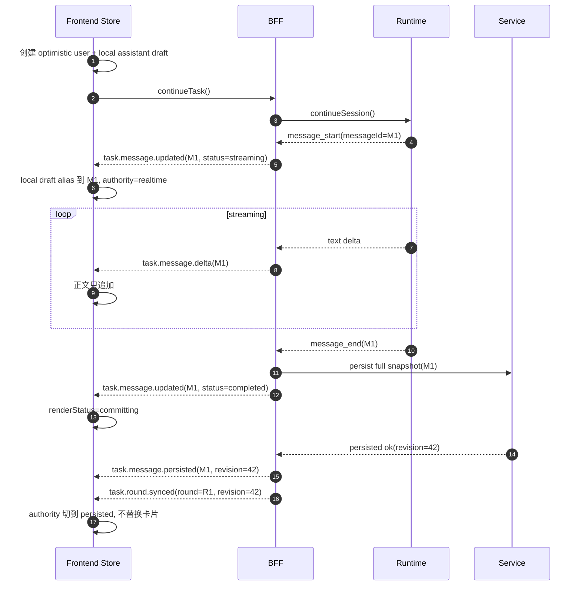

# TaskDetail 实时流与落库真源协调方案

> 状态：Draft v1
> 日期：2026-04-12
> 作者：GitHub Copilot
> 关联文档：[task-detail-realtime-event-contract.md](task-detail-realtime-event-contract.md)、[task-session-message-write-boundary-adr.md](task-session-message-write-boundary-adr.md)、[task-detail-continue-target-module-architecture.md](task-detail-continue-target-module-architecture.md)、[task-detail-unified-implementation-roadmap.md](task-detail-unified-implementation-roadmap.md)

## 1. 文档目的

这份文档专门回答一个核心问题：

**实时获取的数据和最终落库的数据，应该如何协调，才能让前端无缝切换而不闪、不重、不丢。**

这里的重点不是讨论数据库 schema，而是给出一套对前端更合理的交互模型和数据协作边界。

## 2. 这份文档与目标模块架构的关系

这份文档不是独立于 [task-detail-continue-target-module-architecture.md](task-detail-continue-target-module-architecture.md) 的第二套方案，而是那份模块蓝图里的主聊天核心机制。

两份文档的分工如下：

1. 目标模块架构文档回答“未来前后端模块怎么分层”。
2. 本文回答“Conversation Feature 内部，realtime 与 persisted 如何无缝切换”。

实现顺序上，这份文档优先级更靠前，原因是：

1. 它锁定了主聊天最难的一条数据边界。
2. 没有这套边界，后续模块拆分会把双真相问题带进新的目录结构。
3. 它是 Conversation Feature、Round Query Facade、Realtime Publisher 三者共同依赖的基础协议。

因此，正确顺序是：

1. 先确定本文的数据切换模型和必要 contract。
2. 再按目标模块架构文档，把这套模型安放进 Conversation Feature、Round Query Facade、Realtime Publisher。

## 3. 当前问题出在哪里

当前 TaskDetail 的主要问题，不是“实时流不够快”，而是前端实际上在同时消费两套不同语义的数据源：

1. 持久化读源：`getTaskMessages()` / tree / trace 回读
2. 实时读源：`task.message.updated` / `task.message.delta` 衍生出来的 live assistant state

对应到现有前端实现：

1. [control-plane/web-ui/src/composables/useTreeMessages.ts](../control-plane/web-ui/src/composables/useTreeMessages.ts) 负责 persisted baseline，再在渲染阶段拼 live overlay。
2. [control-plane/web-ui/src/composables/useTaskMessageStore.ts](../control-plane/web-ui/src/composables/useTaskMessageStore.ts) 与 [control-plane/web-ui/src/lib/task-live-assistant-state-manager.ts](../control-plane/web-ui/src/lib/task-live-assistant-state-manager.ts) 又维护一套 session-scoped live assistant 状态。
3. [control-plane/web-ui/src/lib/task-message-patch-event.ts](../control-plane/web-ui/src/lib/task-message-patch-event.ts) 把 websocket 事件翻成 patch，但“这条消息是否已经持久化”并没有被明确表达出来。

表面现象就是：

1. 发送后先看到一份临时 assistant 壳，落库后又看到一份正式消息，容易重复。
2. 首 token 到了，但由于 active session / message id / snapshot 时机不一致，页面可能先空白，再突然跳出正文。
3. realtime 和 snapshot 同时更新时，正文可能闪回到更短版本，再恢复到完整版本。
4. websocket 断开或 snapshot 滞后时，页面只能靠猜测决定什么时候 refresh。

## 4. 根因是什么

根因有四个。

### 3.1 页面在“渲染阶段”合并两套真相

当前模式更像是：

1. 先取持久化消息列表
2. 再单独维护 live assistant overlay
3. 最后在计算属性里把两者 merge 成 UI

这意味着前端没有一个统一的消息状态机，而是在最终展示时做拼接。

### 3.2 realtime 事件没有显式表达“持久化确认”

当前 `task.message.updated` / `task.message.delta` 能表达“消息开始了”“消息追加了”，但没有一个明确的公共事件说明：

1. 这条消息已经成功写入 canonical message 表
2. 当前 snapshot 已经追上这条消息

于是前端只能靠 refresh policy 和一些边界事件去猜。

### 3.3 同一逻辑消息的 id 与版本边界不够稳定

从既有写链边界看，BFF 与 runtime 在 message_start、message_update、message_end 之间可能遇到：

1. 首事件和终态事件 message id 归一差异
2. snapshot 回读时字段更完整、但 id 或创建时间口径不同

这类问题会直接放大成前端重复卡片或文本跳变。

### 3.4 refresh 触发条件过于隐式

当前前端靠：

1. assistant completed
2. task completed / failed
3. session / phase patch
4. websocket 断线时轮询兜底

来决定什么时候补拉 persisted snapshot。

这能工作，但前端始终是在“猜什么时候应该相信数据库”。

## 5. 目标

这套协调方案要达到下面 6 个目标：

1. 发送后页面立即有稳定卡位，不空白。
2. streaming 过程中正文持续增长，不回退。
3. 落库完成后无缝切换到 persisted truth，不重复渲染第二张卡片。
4. websocket 断开或丢包时，页面能无闪烁地过渡到 reconcile。
5. compare / workflow 不再共用主聊天这套切换逻辑。
6. 页面最终只维护一份可渲染消息 store，不再在渲染阶段 merge 两套列表。

## 6. 更合理的总体方案

核心思路只有一句话：

**前端只渲染一份统一的 normalized conversation store；realtime 和 persisted snapshot 都写进这同一份 store，只是 authority 不同。**

具体来说，分成三层：

1. persisted snapshot 是历史恢复真源。
2. realtime patch 是进行中消息的前台 authority。
3. persistence ack 是两者之间的切换信号。

### 5.1 不再维护“persisted list + live overlay list”两份展示源

未来前端应只有一个可渲染 store：

1. 一个 message record 只对应一张最终卡片。
2. 同一条消息从 `local-draft -> realtime-streaming -> realtime-committing -> persisted` 连续演进。
3. 任何状态切换都只是在同一条 record 上更新字段，而不是插入第二条消息。

### 5.2 authority 采用分阶段切换

对同一条消息，authority 规则如下：

1. `local`：仅在发送后到第一条服务端事件到达前，用于本地 assistant 卡位。
2. `realtime`：一旦收到首条 `task.message.updated` / `task.message.delta`，正文以 realtime 为准。
3. `persisted`：一旦确认 canonical 写入完成且 snapshot 版本追平，authority 切到 persisted。

注意：

1. authority 切换不应导致 DOM remount。
2. authority 切换不应导致文本回退。
3. persisted 只在“版本不落后于当前 realtime”时才能接管正文。

### 5.3 persistence ack 必须显式化

这是关键改动。

除了现有的 `task.message.updated` / `task.message.delta`，还应增加一个对前端公开的“持久化确认”信号。可以是：

1. `task.message.persisted`
2. 或 `task.round.synced`

至少需要表达：

1. 哪条消息已写入数据库
2. 该消息对应的 persisted revision 是多少
3. 当前 round 是否已经整体追平

没有这个信号，前端就只能继续靠猜。

## 7. 推荐实施顺序

为了和目标模块架构文档协调，这份方案建议按下面顺序落地。

### Step 1：先冻结 contract，而不是先改 UI 目录

先冻结下面 4 个事实：

1. messageId 对外稳定口径
2. `task.message.persisted` / `task.round.synced` 或等价 ack 事件
3. snapshotVersion / persistedThroughRevision
4. unified conversation store 的 authority 切换规则

这一步是 Conversation Feature 和 BFF facade 的共同前提。

### Step 2：先让 BFF 能发出“可切换”的数据，再让前端切换

先改 BFF：

1. runtime id alias 归一
2. persistence ack 事件
3. snapshot 版本信息

再改前端 unified reducer。

原因：

1. 如果前端先改 store，但后端还没有显式 ack / version，前端仍然要靠猜测切 authority，问题只是换种写法存在。

### Step 3：主聊天先落，compare / workflow 后落

这份方案只先服务 Conversation Feature。

compare / workflow 的顺序应当是：

1. 主聊天无缝切换先稳定。
2. compare 再接入自己的 facade 和 store。
3. workflow 最后接入自己的 facade 和 store。

原因：

1. 主聊天是最高频、最敏感的 UX 路径。
2. compare / workflow 可以延后复用这套模型，但不应先拿它们来驱动主链路设计。

### Step 4：模块化拆分放在主聊天机制稳定之后

当 unified conversation store 和 ack 机制稳定后，再按目标模块架构文档去完成：

1. Conversation Feature 独立目录化
2. Task Subscription Feature 收口
3. Page Shell 收口

这样拆的是稳定 contract，而不是仍在变化的算法。

## 8. 前端状态模型

建议引入统一的 conversation record。

```ts
type MessageAuthority = "local" | "realtime" | "persisted";
type MessageRenderStatus =
  | "draft"
  | "streaming"
  | "committing"
  | "persisted"
  | "failed"
  | "stale";

interface ConversationRecord {
  id: string;
  roundId: string;
  sessionId: string;
  role: "user" | "assistant" | "tool" | "system";
  authority: MessageAuthority;
  renderStatus: MessageRenderStatus;
  text: string;
  createdAt?: string;
  completedAt?: string | null;
  errorText?: string | null;
  realtimeRevision?: number;
  persistedRevision?: number;
  localDraftId?: string;
}

interface ConversationRoundState {
  roundId: string;
  activeSessionId: string;
  recordsById: Record<string, ConversationRecord>;
  orderedIds: string[];
  reconcileRequired: boolean;
  persistedThroughRevision?: number;
}
```

这个模型的重点是：

1. `authority` 和 `renderStatus` 分开。
2. `text` 永远只有一个当前渲染值。
3. realtime 和 persisted 不是两条消息，而是同一条 record 的两个阶段。

## 9. 前端无缝切换规则

这是页面体验是否顺滑的核心。

### 7.1 发送后立即卡位，但只允许一张 assistant 卡

当用户发送 continue 时：

1. 立即创建 optimistic user record。
2. 立即创建一个 assistant local draft record，`authority=local`、`renderStatus=draft`。
3. 这张 assistant draft 只是一张临时壳，等第一条服务端 assistant 事件到达后必须“升级”为真实消息，而不是保留再插一张。

### 7.2 realtime 首事件到达时，不插入第二张卡，而是 alias 到同一 record

当首条 assistant `task.message.updated` 到达时：

1. 若当前 round 已有 local draft，则把该 draft 的 `localDraftId` alias 到真实 `messageId`。
2. 将同一条 record 切换到 `authority=realtime`、`renderStatus=streaming`。
3. 若无 local draft，则直接以服务端 `messageId` 创建 record。

### 7.3 streaming 过程中，正文只允许向前增长

对于 `task.message.delta`：

1. 只追加，不回退。
2. 不因为落后的 snapshot refresh 把当前正文覆盖成更短版本。
3. streaming 期间尽量用纯文本渲染，不做昂贵 markdown 解析。

### 7.4 runtime 完成但持久化未确认时，进入 committing，而不是立刻刷新抖动

当消息已经收到终态 realtime `updated`，但还没持久化确认时：

1. `renderStatus` 切到 `committing`。
2. 文本维持当前最终文本不变。
3. 页面可以显示非常轻的“同步中”语义，但不要把卡片换掉。

### 7.5 persisted ack 到达时，只切 authority，不替换卡片

当 `task.message.persisted` 或等价的 round sync 信号到达时：

1. 通过同一 `messageId` 命中现有 record。
2. 若 persisted revision 不落后于 realtime revision，则切 `authority=persisted`。
3. 用更完整的 persisted 字段补 metadata / parts / token usage。
4. 不重新生成新 key，不重新插入 orderedIds。

### 7.6 reconnect 与 snapshot reconcile 也只更新同一条 record

断线重连时：

1. 当前 streaming / committing record 可先标记为 `stale`。
2. 页面保留最后可见文本，不清空。
3. silent reconcile 成功后，用 persisted snapshot 追平同一条 record。
4. 若确认该 round 已终态，则移除 stale 标记。

## 10. 需要新增的公共事件

建议在现有 realtime contract 基础上补两类事件。

### 8.1 `task.message.persisted`

```ts
interface TaskMessagePersistedEvent {
  type: "task.message.persisted";
  taskId: string;
  roundId: string;
  sessionId: string;
  messageId: string;
  persistedRevision: number;
  occurredAt: string;
}
```

用途：

1. 告诉前端该消息已写入 canonical store。
2. 允许前端从 realtime authority 切到 persisted authority。

### 8.2 `task.round.synced`

```ts
interface TaskRoundSyncedEvent {
  type: "task.round.synced";
  taskId: string;
  roundId: string;
  persistedThroughRevision: number;
  occurredAt: string;
}
```

用途：

1. 告诉前端这一轮的 snapshot 已经追平到哪个 revision。
2. 允许前端在边界上做一次轻量 reconcile，而不是轮询猜测。

## 11. REST snapshot 应该返回什么

为了让前端知道 snapshot 与 realtime 谁更新，需要在 round message 读接口返回版本信息。

建议：

```ts
interface TaskRoundMessagesDto {
  taskId: string;
  roundId: string;
  snapshotVersion: number;
  persistedThroughRevision: number;
  messages: TaskMessageDto[];
}
```

前端规则：

1. snapshotVersion 落后于当前 realtime revision 时，不允许 snapshot 覆盖更长的 streaming 文本。
2. persistedThroughRevision 追平后，才允许把该 message 的 authority 切到 persisted。

## 12. BFF 应该做什么

这套方案对 BFF 的要求主要有三条。

### 10.1 对外稳定 message id

从第一条公共 assistant 事件开始，对外 `messageId` 就必须稳定。

如果 runtime 内部存在：

1. timestamp id
2. responseId
3. tool call id

这些差异，必须在 BFF 内部 alias 掉，不能直接透给页面。

### 10.2 realtime 事件与持久化确认分层

BFF 内部可以继续：

1. 吃 runtime 原始 SSE
2. 调 service 持久化写链

但对 web-ui：

1. `task.message.updated` / `delta` 表示前台实时状态
2. `task.message.persisted` / `task.round.synced` 表示落库确认状态

不要再让页面从一个事件里同时猜这两层含义。

### 10.3 边界刷新由 BFF 显式发信号

当出现：

1. 乱序
2. alias 无法归一
3. snapshot 滞后过大
4. reconnect 后缺失边界

时，BFF 应直接发 `task.reconcile.required`，而不是让前端从异常现象反推。

## 13. Service 应该做什么

service 侧不需要为了这套方案大改消息真源，只需要继续保证三件事：

1. canonical message id 稳定
2. canonical upsert 顺序正确
3. 读接口能返回 snapshotVersion / persistedThroughRevision 之类的最小同步信号

service 不负责：

1. 页面是否展示 streaming spinner
2. 页面何时切 authority
3. 对 runtime id 漂移做 UI 级兜底

这些都应留在 BFF facade 和前端 reducer。

## 14. 与目标模块架构的对齐点

为了避免两份文档各讲各的，本文需要和 [task-detail-continue-target-module-architecture.md](task-detail-continue-target-module-architecture.md) 对齐到 5 个模块边界：

1. 这份文档里的 unified conversation store，未来就是目标模块架构中的 Conversation Feature 核心。
2. 这份文档里的 persistence ack 事件，未来由目标模块架构中的 Realtime Publisher 发出。
3. 这份文档里的 snapshotVersion / persistedThroughRevision，未来由目标模块架构中的 Round Query Facade 暴露。
4. 这份文档里的 reconcile 触发条件，未来由目标模块架构中的 Task Subscription Feature 消费。
5. 这份文档不直接约束 compare / workflow 内部实现，但 compare / workflow 后续若要消费消息流，应复用同一 authority 切换模型。

## 15. 前端模块落点建议

按当前仓库结构，建议按下面方式收口：

1. [control-plane/web-ui/src/composables/useTreeMessages.ts](../control-plane/web-ui/src/composables/useTreeMessages.ts) 不再负责在 render 阶段拼 overlay，而是退化成 snapshot loader。
2. [control-plane/web-ui/src/composables/useTaskMessageStore.ts](../control-plane/web-ui/src/composables/useTaskMessageStore.ts) 进化成唯一 conversation reducer 入口。
3. [control-plane/web-ui/src/lib/task-live-assistant-state-manager.ts](../control-plane/web-ui/src/lib/task-live-assistant-state-manager.ts) 的职责从“维护单独 live overlay”改成“给 unified store 提供 transient apply 能力”。
4. [control-plane/web-ui/src/lib/task-message-patch-event.ts](../control-plane/web-ui/src/lib/task-message-patch-event.ts) 需要新增 persisted / synced 事件翻译。
5. [control-plane/web-ui/src/composables/useTaskDetailRefreshController.ts](../control-plane/web-ui/src/composables/useTaskDetailRefreshController.ts) 只在 reconnect、reconcile required、round synced 等边界触发 snapshot refresh。

## 16. 推荐的端到端时序



## 17. 为什么这套方案更适合前端无缝切换

相对当前模式，这套方案的优势是：

1. 页面永远只渲染一份 store，不再做 persisted list 和 live overlay 的双重合并。
2. realtime 和 persisted 的边界显式化了，前端不需要再猜何时 refresh、何时收敛。
3. 同一条消息只会经历状态变化，不会经历“临时卡片消失、正式卡片再出现”的二次插入。
4. reconnect、snapshot 滞后、runtime 事件乱序都有统一的 reconcile 策略，不会继续分散在多个 composable 里各自兜底。

## 18. 一句话结论

更合理的协调方案不是“让实时流压过数据库”或“让数据库强行覆盖实时流”，而是让前端维护一份统一消息状态机：realtime 负责进行中展示，persisted 负责最终收敛，BFF 用显式的 persistence ack 把两者无缝衔接起来。