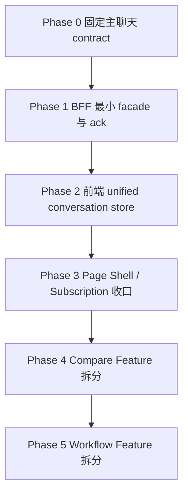

# TaskDetail 统一实施路线图

> 状态：主聊天主链路已落地，Phase 3-5 持续收口中
> 日期：2026-04-13
> 作者：GitHub Copilot
> 关联文档：[task-detail-navigation-index.md](task-detail-navigation-index.md)、[task-detail-display-write-logic.md](task-detail-display-write-logic.md)、[task-detail-continue-target-module-architecture.md](task-detail-continue-target-module-architecture.md)、[task-detail-realtime-persisted-coordination-plan.md](task-detail-realtime-persisted-coordination-plan.md)、[task-detail-continue-simplified-migration-checklist.md](task-detail-continue-simplified-migration-checklist.md)

## 1. 文档目的

这份文档把下面两份方案合成一份面向执行的总路线图：

1. [task-detail-continue-target-module-architecture.md](task-detail-continue-target-module-architecture.md)
2. [task-detail-realtime-persisted-coordination-plan.md](task-detail-realtime-persisted-coordination-plan.md)

这份路线图不再重复写两份平行方案，而是明确三件事：

1. 现阶段已经确定的核心前提是什么。
2. 模块拆分后，每个模块到底负责什么。
3. 这些模块应该按什么顺序实现，彼此如何协作。

如果后续要真正开始改代码，默认以这份文档作为执行入口；其它两份文档作为专项深挖参考。

### 1.1 入口摘要

如果只是想先建立 TaskDetail 文档的阅读顺序，先看 [task-detail-navigation-index.md](task-detail-navigation-index.md)。这份路线图默认建立在“已经区分现网文档、目标文档和迁移文档”的前提上。

这份路线图负责回答“按什么边界拆、按什么顺序做”，不负责替代现网代码索引。

如果要快速进入不同层面，建议按下面顺序看：

1. 要定位当前现网页面的显示、写入、刷新与落库主路径，先看 [task-detail-display-write-logic.md](task-detail-display-write-logic.md)。其中新增的“一页式主链路矩阵”最适合作为前端 action -> BFF route -> service API -> 主要表/投影的速查入口。
2. 要看未来稳态下 Conversation / Compare / Workflow / Shared / Page Shell 的目标边界，读 [task-detail-continue-target-module-architecture.md](task-detail-continue-target-module-architecture.md)。
3. 要看主聊天 realtime 与 persisted snapshot 的 ack、refresh、authority 切换细节，读 [task-detail-realtime-persisted-coordination-plan.md](task-detail-realtime-persisted-coordination-plan.md)。
4. 当前这份路线图只保留三类信息：已经确定的前提、当前阶段状态、后续实施顺序。凡是需要落到具体 route / composable / 表名，优先回到 [task-detail-display-write-logic.md](task-detail-display-write-logic.md)。

## 2. 已经确定的前提

这部分不再反复讨论，视为已确定。

### 2.1 主聊天的数据切换模型已经确定

主聊天采用统一消息状态机，而不是继续沿用“persisted 列表 + live overlay 列表”的双展示源。

核心原则：

1. 前端只渲染一份 unified conversation store。
2. 同一条消息从 `local-draft -> realtime-streaming -> realtime-committing -> persisted` 连续演进。
3. `task.message.persisted` / `task.round.synced` 这类持久化确认信号，是前端无缝切换的正式边界。

### 2.2 模块拆分的目的已经确定

拆分的目的不是为了把大文件切小，而是为了消除职责耦合。

具体来说：

1. 主聊天 continue 不能再被 compare 和 workflow 污染。
2. web-ui 不能继续直接理解 session/tree/phase 的底层事实模型。
3. BFF 必须承担 facade 和用例编排，而不是让前端自己拼语义。

## 3. 现在真正需要回答的问题

当前真正不确定的，不是“要不要统一消息状态机”，也不是“要不要拆模块”，而是：

1. 拆分后的模块分别干什么。
2. 哪些模块是主链路必需品，哪些是后置拆分。
3. 哪些必须先做，哪些可以等主聊天稳定后再做。

这份文档专门回答这三个问题。

## 4. 一张图看全局顺序

顺序原则只有一句话：

**先稳定主聊天的数据边界，再拆模块；先拆主聊天，再拆 compare 和 workflow。**

## 4.1 截至 2026-04-12 的当前阶段状态

1. Phase 0：已完成。主聊天的 message id、persisted ack、snapshot revision 语义已经冻结到当前主链路。
2. Phase 1：主链路已完成。round facade、`task.message.persisted`、`task.round.synced`、`task.reconcile.required` 已进入生产路径；compare / workflow 旁路读口与兼容 fallback 仍待继续收口。
3. Phase 2：已完成。主聊天已经切到 `useTaskMessageSnapshot()` + `useTaskMessageStore()`，旧兼容消息 facade 已删除。
4. Phase 3：继续推进中。page model 已拆出 conversation / flow / workflow / refresh 相关 composable；当前 `useTaskSidebarFeature` 已承接 sidebar collapse / file preview，`useTaskConversationFeature` 已开始承接主聊天展示态、round/context 与 continue/fork/terminate 队列动作，runtime permission 读写也已开始独立成 feature，task-level realtime optimistic status 也已回收到 core context，compare 对 conversation round 的依赖环也已从 flow feature 侧切断，realtime subscription 与 polling glue 也已开始并入独立 feature，main pane 和 sidebar pane 的 section-level 装配也已开始下沉到独立 feature，剩余主要是旧协调器的兼容清理。
5. Phase 4：继续推进中。compare adopt 仍由 `useTaskParallelCandidateActions()` 承接，flow refresh/load 仍由 `useTaskDetailParallelFlow()` 闭环；此前只服务 page model 的 `useTaskCompareFeature` 已删除，`stop phase / terminate` 派生已直接收回 page model。剩余重点是 parallel runtime/read-model cluster 和更明确的 compare application-service 边界，而不是再包一层 compare glue。
6. Phase 5：继续推进中。workflow snapshot 与 execution mode modal / model actions 继续收口在 `useTaskWorkflowFeature()`；member snapshot 已通过 `useTaskMemberViewFeature()` 吸收到 `useTaskSidebarFeature()`，page model 不再单独维护 member refs。此前只服务 page model 的 `useTaskWorkflowRefreshTarget` 已删除，workflow/member refresh 编排已直接收回 page model。当前已新增 `useTaskWorkflowSteps`、`useTaskWorkflowActions` 与 `useTaskMemberViewFeature`，但更完整的 workflow application-service 边界还没完全收口。

## 5. 未来模块功能定义

这部分是整份路线图最重要的内容。下面的功能定义，是后续拆分时的边界基线。

## 5.1 前端模块

### 5.1.1 Page Shell

目标模块：

1. `TaskDetailPageShell`
2. `TaskDetailSectionModels`

负责：

1. 读取 `taskId`、route context、页面级 loading/error。
2. 组合 Conversation、Compare、Workflow、Sidebar 四个 feature。
3. 把这些 feature 投影成 header、main、sidebar 三个展示分区。

不负责：

1. 发 continue。
2. 解析 realtime 事件。
3. 合并 persisted 和 realtime 消息。
4. 决定 compare / workflow 的内部状态机。

你可以把它理解为：

1. 页面壳层
2. feature 组装层
3. 纯 UI 组合层

### 5.1.2 Conversation Feature

目标模块：

1. `useTaskConversationFeature`
2. `useTaskConversationStore`
3. `useTaskConversationActions`
4. `useTaskConversationHistory`

负责：

1. 管理主聊天当前 active round 的 unified conversation store。
2. 处理 optimistic user、local assistant draft、realtime streaming、persisted 收敛。
3. 提供主聊天 continue、stop、switch round、refresh actions。
4. 消费主聊天相关 realtime 事件。

不负责：

1. compare 候选卡。
2. workflow step 列表。
3. 侧栏 trace / member / file preview。
4. execution mode modal。

这是主链路核心模块。

### 5.1.3 Task Subscription Feature

目标模块：

1. `useTaskDetailRealtimeFeature`
2. `useTaskDetailRefreshController`
3. `useTaskDetailSnapshotCoordinator`

负责：

1. 订阅 task/project websocket。
2. 管理 reconnect、silent reconcile、refresh 节流。
3. 把 refresh 需求路由给 Conversation、Compare、Workflow。

不负责：

1. 保存消息正文。
2. 解释 compare winner 语义。
3. 解释 workflow step 状态。

它是调度层，不是业务状态层。

### 5.1.4 Sidebar Feature

目标模块：

1. `useTaskSidebarFeature`
2. `useTaskTracePanel`
3. `useTaskMemberPanel`
4. `useTaskFilePreviewPanel`

负责：

1. 展示主聊天之外的辅助视图。
2. 按当前 task / round / session 上下文拉取 trace、member、file preview 数据。

不负责：

1. 主聊天写动作。
2. compare / workflow 的状态管理。

### 5.1.5 Compare Feature

目标模块：

1. `useTaskDetailParallelFlow`
2. `useTaskParallelCandidateActions`
3. `task-detail-parallel-read-model`

负责：

1. 发起 compare run。
2. 加载 candidate rounds、winner、adoption 状态。
3. 展示候选结果与模型元信息。
4. 触发 adopt。

不负责：

1. 主聊天流式渲染。
2. 将候选卡插回主聊天消息链。
3. 推断 active round。

它是独立功能面板，不是主聊天的一部分。

### 5.1.6 Workflow Feature

目标模块：

1. `useTaskWorkflowFeature`
2. `useTaskWorkflowSteps`
3. `useTaskWorkflowActions`
4. `task-workflow-display-policy`

负责：

1. 发起 workflow run。
2. 显示 step 列表、当前 step、最终结果。
3. 执行 cancel、retry、resume 等动作。
4. 统一 stage label fallback 与 workflow/stage status 的显示标签、颜色策略。

不负责：

1. 主聊天 continue。
2. compare adoption。
3. 复用主聊天的消息切换状态机。

它是任务流程面板，不是聊天变种。

补充边界：

1. `useTaskWorkflowSteps` 只保留 workflow summary / stages / currentStageLabel 这类读侧派生。
2. `TaskWorkflowStageOverviewCard.vue`、`TaskWorkbenchMemberStrip.vue`、`TaskRoleWorkflowPanel.vue` 不再各自维护 status/stage 映射，统一走 `task-workflow-display-policy.ts`。
3. `ManagementOperationsCenter.vue`、`TaskOperatingConsole.vue`、`ProjectOrchestration.vue` 这类页面/控制台展示也统一复用同一套 stage/status display policy，不再直接展示原始 workflow 状态码。

## 5.2 BFF 模块

### 5.2.1 Task Routes Shell

目标模块：

1. `routes.ts`

负责：

1. 路由参数解析。
2. 鉴权。
3. 调用 application service。
4. 返回 facade DTO。

不负责：

1. 塞满业务逻辑。
2. 直接发布页面事件。

### 5.2.2 Continue Application Service

目标模块：

1. `continue-task.ts`

负责：

1. 校验 continue 输入。
2. 解析 parent round / parent session。
3. 创建 child session。
4. 预写 prompt snapshot。
5. 调 runtime continue。
6. 返回 continue round DTO。

不负责：

1. compare batch。
2. workflow step 自动推进。

### 5.2.3 Round Query Facade

目标模块：

1. `query-task-rounds.ts`
2. `query-current-round.ts`
3. `query-task-round-messages.ts`
4. `task-round-facade.ts`

负责：

1. 把 service 的 session/tree/phase/query 结果包装成 round DTO。
2. 对外暴露 `currentRound`、`roundMessages`、`roundList`。
3. 返回 snapshotVersion / persistedThroughRevision 这类前端切换必需信息。

不负责：

1. 写消息。
2. 解释 runtime 原始事件。
3. 替前端做渲染判断。

它是前端和 service 真源之间的语义翻译层。

### 5.2.4 Realtime Publisher

目标模块：

1. `task-domain-event-mapper.ts`
2. `task-realtime-publisher.ts`

负责：

1. 把内部 source event 转成稳定 `task.*` 事件。
2. 发布 `task.message.updated`、`task.message.delta`、`task.message.persisted`、`task.round.synced`、`task.reconcile.required`。
3. 给 Conversation、Compare、Workflow 分发各自的事件。

不负责：

1. 页面状态机。
2. HTTP facade。

### 5.2.5 Compare Application Service

目标模块：

1. `compare-task.ts`
2. `adopt-compare-winner.ts`

负责：

1. 创建 compare run。
2. 批量启动 candidate rounds。
3. 采纳 winner。

不负责：

1. 主聊天 unified store。
2. workflow step 执行。

### 5.2.6 Workflow Application Service

目标模块：

1. `start-workflow.ts`
2. `advance-workflow-step.ts`
3. `query-workflow-view.ts`

负责：

1. 启动 workflow run。
2. 推进 step。
3. 汇总最终 workflow view。

不负责：

1. continue。
2. compare adoption。

## 5.3 Service 模块

### 5.3.1 Message Persistence Service

负责：

1. canonical message upsert。
2. parts、operations、artifacts 关联写入。
3. message id 与时间字段的稳定落库。

它是事实写源，不是页面 facade。

### 5.3.2 Session Query Service

负责：

1. session、lineage、trace、timeline、tree 的事实查询。
2. 为 Round Query Facade 提供底层事实。

它不直接表达 round 语义。

### 5.3.3 Phase Lifecycle Service

负责：

1. phase 创建、更新、暂停、完成、取消、采纳。
2. compare 与 workflow 生命周期真源。

它不负责主聊天消息切换。

## 6. 统一实施顺序

这部分是执行顺序，不是概念顺序。

### 阶段 0：冻结主聊天 contract（已完成）

先完成：

1. 稳定 `messageId` 对外口径。
2. 定义 `task.message.persisted` / `task.round.synced`。
3. 定义 `snapshotVersion` / `persistedThroughRevision`。
4. 定义 unified conversation store 的 authority 切换规则。

交付物：

1. contract 文档冻结。
2. 前后端接口草案冻结。

为什么先做：

1. 这是后续所有 Conversation 模块的共同前提。

### 阶段 1：先做 BFF 最小支撑，不先拆前端目录（主链路已完成）

先完成：

1. runtime id alias 归一。
2. persistence ack 事件。
3. round facade 最小读接口。
4. snapshot 版本字段。

交付物：

1. BFF 最小可用 facade。
2. 可消费的 realtime ack。

为什么先做：

1. 如果前端先改 unified store，但后端还没有 ack / version，前端还是只能靠猜。

### 阶段 2：实现前端 Conversation Feature（已完成）

先完成：

1. unified conversation store。
2. `useTaskMessageSnapshot` 成为 snapshot loader，并删除旧消息兼容 facade。
3. `useTaskMessageStore` 成为唯一 reducer 入口。
4. `useTaskDetailActionCoordinator` 的主聊天动作收口到 Conversation Actions。

交付物：

1. 主聊天无缝切换跑通。
2. 主聊天不再依赖渲染阶段双源 merge。

为什么此时做：

1. 到这一阶段，主聊天已经不依赖隐式刷新与猜测切换。

### 阶段 3：再做页面层拆分（进行中）

先完成：

1. Page Shell 收口。
2. Task Subscription Feature 收口。
3. Sidebar Feature 收口。

交付物：

1. 主聊天机制被放进清晰的模块边界。

为什么此时做：

1. 此时搬运的是稳定行为，而不是半成品状态机。

### 阶段 4：拆 Compare Feature（部分开始，未完成）

先完成：

1. compare 独立 route / facade。
2. compare 独立 panel / store。
3. adopt 从主聊天区迁出。

交付物：

1. compare 成为独立功能。

为什么排在后面：

1. compare 可以复用主聊天已稳定的 store / subscription 基础设施，但不应反向驱动主链路设计。

### 阶段 5：拆 Workflow Feature（部分开始，未完成）

先完成：

1. workflow 独立 application service。
2. workflow 独立 panel / store。
3. sequential-chain 脱离主聊天 continue。

交付物：

1. workflow 成为独立功能。

为什么最后做：

1. workflow 是最重、最复杂的长链路，应该建立在主聊天和 facade 已稳定的基础上。

## 7. 哪些能并行，哪些不能并行

### 可以并行

1. Page Shell 与 Sidebar 的纯视图收口，可以和 unified conversation store 并行准备。
2. BFF 目录整理，可以和 round facade 设计并行。
3. compare / workflow 的独立目录壳层可以先建，但先不要接入主链路。

### 不能并行

1. 不能在主聊天 contract 没冻结前，先大拆 `useTaskMessageSnapshot`、`useTaskMessageStore`、主聊天动作协调层。
2. 不能在 round facade 没有最小落地前，让前端直接按 session/tree 事实实现新的 Conversation Feature。
3. 不能在 persistence ack 没有定义前，让 snapshot refresh 去承担最终 authority 切换。

## 8. 每个阶段完成后的系统状态

### 完成阶段 0 后

系统还没大改代码，但主聊天的真实边界被锁定，后续不会再反复争论“该信 realtime 还是数据库”。

### 完成阶段 1 后

后端已经能明确说清：

1. 哪条消息开始了。
2. 哪条消息结束了。
3. 哪条消息持久化完成了。
4. 某一轮 snapshot 是否追平了。

### 完成阶段 2 后

主聊天页已经不再依赖渲染阶段的 persisted/live 双列表 merge，前端无缝切换问题得到实质解决。

### 完成阶段 3 后

页面结构开始清楚，但 compare / workflow 仍可暂时维持旧逻辑，不阻塞主聊天稳定。

### 完成阶段 4 后

compare 从主聊天链路里退出，主聊天不再承担 candidate 卡与 adoption 逻辑。

### 完成阶段 5 后

workflow 从主聊天 continue 语义里退出，TaskDetail 的三个功能 finally 清晰分治。

## 9. Phase 0 到 Phase 2 具体任务单

这部分不再讲抽象分层，而是直接给执行任务和现有文件映射。

## 9.1 Phase 0：冻结主聊天 contract

目标：先把“主聊天如何切换 authority”说死，再开始写 BFF 和前端代码。

任务 0.1：冻结 message id 与 round id 公共口径

现有文件：

1. [control-plane/service/src/modules/tasks/task-session-runtime-message-schema.ts](../control-plane/service/src/modules/tasks/task-session-runtime-message-schema.ts)
2. [control-plane/service/src/modules/tasks/task-session-message-write-api.ts](../control-plane/service/src/modules/tasks/task-session-message-write-api.ts)
3. [control-plane/web-ui-bff/src/modules/realtime/sse-aggregator.ts](../control-plane/web-ui-bff/src/modules/realtime/sse-aggregator.ts)
4. [control-plane/web-ui/src/lib/message-normalize.ts](../control-plane/web-ui/src/lib/message-normalize.ts)

要做的事：

1. 明确 runtime `messageId`、canonical `messageId`、public `roundId` 的映射规则。
2. 明确 Phase 1 暂时允许 `roundId = taskSessionId`，Phase 2 再决定是否独立抽象 round identity。

任务 0.2：冻结 persisted ack contract

现有文件：

1. [control-plane/web-ui-bff/src/types/events.ts](../control-plane/web-ui-bff/src/types/events.ts)
2. [control-plane/web-ui-bff/src/modules/realtime/sse-aggregator.ts](../control-plane/web-ui-bff/src/modules/realtime/sse-aggregator.ts)
3. [control-plane/web-ui/src/lib/task-message-patch-event.ts](../control-plane/web-ui/src/lib/task-message-patch-event.ts)

要做的事：

1. 固定 `task.message.persisted` 最小字段。
2. 固定 `task.round.synced` 最小字段。
3. 固定 `task.reconcile.required` 的最小字段与 `messages` / `flow` / `workflow` / `task` 四类 target scope。
4. 明确 `task.message.persisted` 只写入 message-level ack；真正的 persisted 接管要等 `task.round.synced` 或 `reconcile required(scope=messages)` 后的 snapshot catch-up。

任务 0.3：冻结 snapshot version 的最小语义

现有文件：

1. [control-plane/web-ui-bff/src/modules/tasks/task-round-facade.ts](../control-plane/web-ui-bff/src/modules/tasks/task-round-facade.ts)
2. [control-plane/web-ui/src/composables/useTaskDetailRefreshController.ts](../control-plane/web-ui/src/composables/useTaskDetailRefreshController.ts)
3. [control-plane/web-ui/src/lib/task-detail-refresh-policy.ts](../control-plane/web-ui/src/lib/task-detail-refresh-policy.ts)

要做的事：

1. 明确 `snapshotVersion` 表示 snapshot 物化版本，用于 response 竞态与旧快照丢弃。
2. 明确 `persistedThroughRevision` 表示 round canonical 覆盖上界，用于 authority 收敛。
3. 明确推荐来源：`persistedRevision` / `persistedThroughRevision` 优先基于 `task_messages.seq`，`snapshotVersion` 优先基于 projection head 或 `task_domain_events.seq`。
4. Phase 1 允许先用 coarse version 占位，但契约语义必须先冻结。
5. 后续再把 coarse version 替换成 service 真正 revision，而不改变前端切换规则。

## 9.2 Phase 1：BFF 最小支撑

目标：不先动前端架构，只把前端后续切换 authority 所需的最小 BFF 能力补齐。

任务 1.1：补 round facade 最小读接口

现有文件：

1. [control-plane/web-ui-bff/src/modules/tasks/task-session-store.ts](../control-plane/web-ui-bff/src/modules/tasks/task-session-store.ts)
2. [control-plane/web-ui-bff/src/modules/tasks/task-session-read-compat.ts](../control-plane/web-ui-bff/src/modules/tasks/task-session-read-compat.ts)
3. [control-plane/web-ui-bff/src/modules/tasks/routes.ts](../control-plane/web-ui-bff/src/modules/tasks/routes.ts)

当前已落地：

1. 新增 [control-plane/web-ui-bff/src/modules/tasks/task-round-facade.ts](../control-plane/web-ui-bff/src/modules/tasks/task-round-facade.ts)。
2. 新增 `GET /api/tasks/:taskId/current-round`。
3. 新增 `GET /api/tasks/:taskId/rounds`。
4. 新增 `GET /api/tasks/:taskId/rounds/:roundId/messages`。

任务 1.2：让 continue 返回 round DTO，而不只返回 sessionId

现有文件：

1. [control-plane/web-ui-bff/src/modules/tasks/routes.ts](../control-plane/web-ui-bff/src/modules/tasks/routes.ts)

当前已落地：

1. 单轮 continue 返回体已经补了最小 `round`。
2. 这让前端在 Phase 2 可以直接切 active round，而不是继续猜 session 到底代表哪一轮。

任务 1.3：补 persisted ack 事件

现有文件：

1. [control-plane/web-ui-bff/src/types/events.ts](../control-plane/web-ui-bff/src/types/events.ts)
2. [control-plane/web-ui-bff/src/modules/realtime/sse-aggregator.ts](../control-plane/web-ui-bff/src/modules/realtime/sse-aggregator.ts)
3. [control-plane/web-ui-bff/src/modules/tasks/task-session-store.ts](../control-plane/web-ui-bff/src/modules/tasks/task-session-store.ts)

当前已落地：

1. `task.message.persisted`、`task.round.synced` 已加入 realtime event type。
2. `task.reconcile.required` 已进入主聊天主链路 contract，并细化到 `messages` / `flow` / `workflow` / `task` 四类 scope。
3. runtime message mirror 与 tool snapshot mirror 成功写入后，会先发出 `task.message.persisted`；只有 round snapshot catch-up 被证明后才发 `task.round.synced`，否则发 `task.reconcile.required(scope=messages)`。

任务 1.4：先补最小 snapshot version 字段

现有文件：

1. [control-plane/web-ui-bff/src/modules/tasks/task-session-store.ts](../control-plane/web-ui-bff/src/modules/tasks/task-session-store.ts)
2. [control-plane/web-ui-bff/src/modules/tasks/task-round-facade.ts](../control-plane/web-ui-bff/src/modules/tasks/task-round-facade.ts)

当前已落地：

1. `roundMessages` 返回了 `snapshotVersion`。
2. `roundMessages` 返回了 `persistedThroughRevision`。
3. `task-round-facade` 现已优先透传上游真实 meta；当兼容读面缺字段时才退回 fallback 值。
4. [control-plane/web-ui/src/lib/task-message-patch-event.ts](../control-plane/web-ui/src/lib/task-message-patch-event.ts) 已消费 persisted / synced / reconcile 事件。
5. [control-plane/web-ui/src/lib/task-detail-refresh-policy.ts](../control-plane/web-ui/src/lib/task-detail-refresh-policy.ts) 已把 `round.synced` 与 `reconcile.required(scope=messages)` 固定为主聊天 refresh 边界。
6. `assistant-completed` / `tool-message` 不再被前端自动推断为“已落库”。

当前状态：

1. Phase 1 的主聊天主链路可以视为完成。
2. round facade 现在主要覆盖 continue / main chat；compare / workflow 的旁路读口还没有完全切到同一套 facade。
3. `snapshotVersion` 与 `persistedThroughRevision` 在主路径上已经优先使用真实 meta，但 `task-round-facade` 里仍保留 fallback 兼容逻辑；这属于收口事项，不再影响主聊天 authority 语义。
4. Realtime Publisher 目前主要仍实现在 `sse-aggregator.ts` 内部，尚未完全拆成独立的 `task-domain-event-mapper` / `task-realtime-publisher` 模块。

## 9.3 Phase 2：前端 Conversation Feature

目标：把主聊天从 persisted list + live overlay 的双真相模型，收口成单 store。

任务 2.1：把 persisted snapshot 退化成 baseline loader

现有文件：

1. [control-plane/web-ui/src/composables/useTaskMessageSnapshot.ts](../control-plane/web-ui/src/composables/useTaskMessageSnapshot.ts)
2. [control-plane/web-ui/src/lib/api.ts](../control-plane/web-ui/src/lib/api.ts)

要做的事：

1. 改成按 active round 拉 snapshot。
2. 不再在 render 阶段直接和 live overlay 做双列表 merge。

当前已落地：

1. [control-plane/web-ui/src/lib/api.ts](../control-plane/web-ui/src/lib/api.ts) 已新增 `getCurrentTaskRound()`、`getTaskRounds()`、`getTaskRoundMessages()`。
2. [control-plane/web-ui/src/composables/useTaskMessageSnapshot.ts](../control-plane/web-ui/src/composables/useTaskMessageSnapshot.ts) 已按 current round / selected round 读取 persisted snapshot，并承担 refresh generation 竞态保护。
3. `trace.timelineMeta` 已带 `roundId`、`snapshotVersion`、`persistedThroughRevision`。
4. `conversationAuthority=persisted` 后，只有 snapshot revision 追平 `latestPersistenceAck` 才真正停止 realtime overlay，避免无缝切换时闪回旧 persisted 内容。
5. [control-plane/web-ui/src/lib/task-conversation-display.ts](../control-plane/web-ui/src/lib/task-conversation-display.ts) 已把 persisted item、live assistant、pending draft 的显示合并逻辑收口到单入口 helper。
6. [control-plane/web-ui/src/composables/useTaskMessageStore.ts](../control-plane/web-ui/src/composables/useTaskMessageStore.ts) 现在已接管 ack revision gating、regular conversation merge、workflow 插入与 pending draft 生命周期，旧兼容消息层不再自己维护这段主聊天状态。

当前状态：

1. 2.2 的生产主路径目标已达成：页面现在直接组合 snapshot read 与 unified message store。
2. 旧兼容 facade 已退役；后续只剩 read layer 微调与文档清理，不再阻塞进入 2.3。

任务 2.2：把 realtime reducer 收口成唯一主入口

现有文件：

1. [control-plane/web-ui/src/composables/useTaskMessageStore.ts](../control-plane/web-ui/src/composables/useTaskMessageStore.ts)
2. [control-plane/web-ui/src/composables/useTaskMessagePatchConsumer.ts](../control-plane/web-ui/src/composables/useTaskMessagePatchConsumer.ts)
3. [control-plane/web-ui/src/lib/task-live-assistant-state-manager.ts](../control-plane/web-ui/src/lib/task-live-assistant-state-manager.ts)
4. [control-plane/web-ui/src/lib/task-message-patch-event.ts](../control-plane/web-ui/src/lib/task-message-patch-event.ts)

要做的事：

1. `task.message.updated` / `delta` 驱动 `authority=realtime`。
2. `task.message.persisted` 只写入 ack revision；`task.round.synced` + snapshot catch-up 才驱动 `authority=persisted`。
3. local draft alias、realtime alias、persisted merge 全部归到一个 reducer。

当前已落地：

1. [control-plane/web-ui/src/composables/useTaskMessageStore.ts](../control-plane/web-ui/src/composables/useTaskMessageStore.ts) 已显式暴露 `conversationAuthority`。
2. [control-plane/web-ui/src/composables/useTaskMessageStore.ts](../control-plane/web-ui/src/composables/useTaskMessageStore.ts) 已显式暴露 `latestPersistenceAck`。
3. [control-plane/web-ui/src/composables/useTaskMessagePatchConsumer.ts](../control-plane/web-ui/src/composables/useTaskMessagePatchConsumer.ts) 已补 `getTaskPatchEvents()`，供 store 从 patch 历史恢复 authority。
4. [control-plane/web-ui/src/composables/useTaskMessageStore.ts](../control-plane/web-ui/src/composables/useTaskMessageStore.ts) 已接收 persisted snapshot 与 snapshot revision，并在 store 内统一产出 authority-aware regular conversation items。
5. [control-plane/web-ui/src/composables/useTaskMessageStore.ts](../control-plane/web-ui/src/composables/useTaskMessageStore.ts) 已在 store 内完成 `latestPersistenceAck` 与 snapshot revision 的切换门槛判断，snapshot 未追平前继续保留 realtime overlay。
6. [control-plane/web-ui/src/composables/useTaskMessageStore.ts](../control-plane/web-ui/src/composables/useTaskMessageStore.ts) 已在 store 内接管 pending draft 的 seed / clear / 自动清理生命周期。
7. [control-plane/web-ui/src/composables/useTaskMessageStore.ts](../control-plane/web-ui/src/composables/useTaskMessageStore.ts) 已在 store 内统一产出 regular `items` 与带 workflow 的完整 `conversationItems`，workflow 插入不再留在旧兼容消息层。
8. [control-plane/web-ui/src/lib/task-message-snapshot.ts](../control-plane/web-ui/src/lib/task-message-snapshot.ts) 已抽出 round 选择、snapshot state 映射与 revision 计算的纯读模型。
9. [control-plane/web-ui/src/composables/useTaskMessageSnapshot.ts](../control-plane/web-ui/src/composables/useTaskMessageSnapshot.ts) 现在只负责异步读取、竞态保护与 refresh 编排。
10. [control-plane/web-ui/src/composables/useTaskDetailCoreContext.ts](../control-plane/web-ui/src/composables/useTaskDetailCoreContext.ts) 现已直接组合 `useTaskMessageSnapshot()` 与 `useTaskMessageStore()`，页面主路径不再经过旧兼容读层。
11. 旧兼容 facade 已删除，主聊天生产路径不再保留兼容入口。
12. [control-plane/web-ui/src/composables/useTaskMessageStore.test.ts](../control-plane/web-ui/src/composables/useTaskMessageStore.test.ts) 已覆盖 store 内 reducer、workflow-aware conversation list、pending draft 生命周期与 snapshot catch-up 切换。
13. [control-plane/web-ui/src/lib/task-message-snapshot.test.ts](../control-plane/web-ui/src/lib/task-message-snapshot.test.ts) 已覆盖 round 选择、empty/populated snapshot state 与 revision helper。

当前状态：

1. 2.2 已可以视为完成。
2. 如需继续清理，只剩 snapshot read layer 的进一步细分与文档收尾，这不再阻塞进入 2.3。

任务 2.3：把主聊天动作从页面协调器里拆出来

当前主聊天动作文件：

1. [control-plane/web-ui/src/composables/useTaskConversationFeature.ts](../control-plane/web-ui/src/composables/useTaskConversationFeature.ts)
2. [control-plane/web-ui/src/composables/useTaskConversationActions.ts](../control-plane/web-ui/src/composables/useTaskConversationActions.ts)
3. [control-plane/web-ui/src/composables/useTaskConversationRoundActions.ts](../control-plane/web-ui/src/composables/useTaskConversationRoundActions.ts)
4. [control-plane/web-ui/src/components/task-detail-shared/ChatComposer.vue](../control-plane/web-ui/src/components/task-detail-shared/ChatComposer.vue)
5. [control-plane/web-ui/src/components/task-detail-v3/TaskDetailV3MainPane.vue](../control-plane/web-ui/src/components/task-detail-v3/TaskDetailV3MainPane.vue)

要做的事：

1. continue / stop / switch round 改由 Conversation Actions 暴露。
2. 页面层只消费 feature 输出，不直接碰 message merge。

当前已落地：

1. [control-plane/web-ui/src/composables/useTaskConversationActions.ts](../control-plane/web-ui/src/composables/useTaskConversationActions.ts) 已抽出主聊天 continue / fork / terminate / queued continuation 逻辑。
2. [control-plane/web-ui/src/composables/useTaskDetailPageModel.ts](../control-plane/web-ui/src/composables/useTaskDetailPageModel.ts) 已直接消费 `useTaskConversationActions()` 输出。
3. [control-plane/web-ui/src/composables/useTaskConversationRoundActions.ts](../control-plane/web-ui/src/composables/useTaskConversationRoundActions.ts) 已抽出 `switch round`、`canForkFromCurrentSession`、`resolveTaskSessionRequestId` 与 conversation focus token。
4. [control-plane/web-ui/src/composables/useTaskConversationActions.ts](../control-plane/web-ui/src/composables/useTaskConversationActions.ts) 现已显式暴露 `handleSwitchRound`，主聊天动作不再依赖 page coordinator 提供 session 映射。
5. [control-plane/web-ui/src/composables/useTaskRuntimePermissionActions.ts](../control-plane/web-ui/src/composables/useTaskRuntimePermissionActions.ts) 已抽出 runtime permission reply，并独立维护审批 loading / refresh 闭环。
6. [control-plane/web-ui/src/composables/useTaskParallelCandidateActions.ts](../control-plane/web-ui/src/composables/useTaskParallelCandidateActions.ts) 已抽出 compare adopt，并把当前 run 到 canonical phaseId 的解析压回 compare feature 内部。
7. [control-plane/web-ui/src/composables/useTaskDetailPageModel.ts](../control-plane/web-ui/src/composables/useTaskDetailPageModel.ts) 现已直接接入上述 feature actions；旧 page-era action/view compat coordinator 已从代码树移除，不再保留兼容 facade。
8. [control-plane/web-ui/src/composables/useTaskDetailPageCoordinator.ts](../control-plane/web-ui/src/composables/useTaskDetailPageCoordinator.ts) 已移除 `canForkFromCurrentSession` 与 `resolveTaskSessionRequestId`，收缩回 task 级 route / reset 协调。
9. [control-plane/web-ui/src/composables/useTaskDetailParallelFlow.ts](../control-plane/web-ui/src/composables/useTaskDetailParallelFlow.ts) 现在直接维护 `selectedSessionId`，compare flow 不再通过 `handleSwitchRound()` 反向依赖 conversation 边界。
10. 已补 [control-plane/web-ui/src/composables/useTaskRuntimePermissionActions.test.ts](../control-plane/web-ui/src/composables/useTaskRuntimePermissionActions.test.ts)、[control-plane/web-ui/src/composables/useTaskParallelCandidateActions.test.ts](../control-plane/web-ui/src/composables/useTaskParallelCandidateActions.test.ts) 与 [control-plane/web-ui/src/composables/useTaskConversationActions.test.ts](../control-plane/web-ui/src/composables/useTaskConversationActions.test.ts)，锁住新 feature action 的刷新闭环与 child-session continuation / terminate fallback 行为。

本阶段收口：

1. 2.3 的生产路径动作边界已完成收敛，page model 现在只组合 feature outputs，不再经旧 action coordinator 分发 compare / runtime permission。
2. 当前剩余工作已不在主聊天动作边界，而在更上层 Page Shell / Compare / Workflow 的继续收口。

任务 2.4：把 refresh policy 改成 ack 驱动，而不是猜测驱动

现有文件：

1. [control-plane/web-ui/src/composables/useTaskDetailRefreshController.ts](../control-plane/web-ui/src/composables/useTaskDetailRefreshController.ts)
2. [control-plane/web-ui/src/lib/task-detail-refresh-policy.ts](../control-plane/web-ui/src/lib/task-detail-refresh-policy.ts)

要做的事：

1. reconnect、`task.reconcile.required(scope=messages)`、`task.round.synced` 才触发主聊天 messages snapshot refresh。
2. assistant completed 不再自动等价于“该信 persisted 了”。

当前已落地：

1. [control-plane/web-ui/src/lib/task-message-patch-effects.ts](../control-plane/web-ui/src/lib/task-message-patch-effects.ts) 已把 `task.message.persisted` 从 TaskDetail snapshot refresh 边界移除，仅保留为 authority reducer 使用的 message-level ack。
2. [control-plane/web-ui/src/lib/task-message-patch-effects.ts](../control-plane/web-ui/src/lib/task-message-patch-effects.ts) 现在只把 `task.round.synced` 视为主聊天 canonical message refresh 边界；`session.created/session.updated` 等事件仍可刷新 task/flow，但不再强制刷新 persisted messages。
3. [control-plane/web-ui/src/composables/useTaskDetailCoreContext.ts](../control-plane/web-ui/src/composables/useTaskDetailCoreContext.ts) 已显式暴露 `messageReconcileRequired`，把 round facade 返回的 `trace.timelineMeta.reconcileRequired` 直接上送 refresh controller。
4. [control-plane/web-ui/src/composables/useTaskDetailRefreshController.ts](../control-plane/web-ui/src/composables/useTaskDetailRefreshController.ts) 已新增 realtime reconnect 与 `messageReconcileRequired` 的独立 watcher；消息 snapshot refresh 不再只能从 patch kind 猜测出来。
5. [tests/web-ui/TaskDetailV3.test.ts](../tests/web-ui/TaskDetailV3.test.ts) 已改为 mock 当前生产主路径 `useTaskMessageSnapshot() + useTaskMessageStore()`，并补了 page-level 的 `round synced` 回读验证，避免整页回归继续挂在旧兼容入口上。
6. [control-plane/web-ui/src/lib/task-detail-refresh-policy.ts](../control-plane/web-ui/src/lib/task-detail-refresh-policy.ts) 现在已把 refresh request 明确建模成 `messages`、`flow`、`workflow` 三条 target，而不是继续向下传一个模糊的“是否需要整页 snapshot refresh”。
7. [control-plane/web-ui/src/composables/useTaskDetailSnapshotCoordinator.ts](../control-plane/web-ui/src/composables/useTaskDetailSnapshotCoordinator.ts) 已显式拆出 `refreshMessageSnapshot()`、`refreshFlowSnapshot()`、`refreshWorkflowSnapshot()`，`refreshTaskSnapshot()` 只保留为多 target 的组合包装器。
8. [control-plane/web-ui/src/composables/useTaskDetailRefreshController.ts](../control-plane/web-ui/src/composables/useTaskDetailRefreshController.ts) 现在会按 target 精确分发 refresh：message-only 不再顺带触发 flow/workflow task refresh，避免主聊天 persisted 回读再次污染 compare / workflow 链路。
9. [control-plane/web-ui/src/composables/useTaskWorkflowFeature.ts](../control-plane/web-ui/src/composables/useTaskWorkflowFeature.ts) 现已接管 workflow snapshot 与 stage label 派生；member snapshot 读取已拆到 [control-plane/web-ui/src/composables/useTaskMemberViewFeature.ts](../control-plane/web-ui/src/composables/useTaskMemberViewFeature.ts)，并由 [control-plane/web-ui/src/composables/useTaskSidebarFeature.ts](../control-plane/web-ui/src/composables/useTaskSidebarFeature.ts) 直接吸收；workflow/member refresh target 的编排现已直接收回 [control-plane/web-ui/src/composables/useTaskDetailPageModel.ts](../control-plane/web-ui/src/composables/useTaskDetailPageModel.ts)，不再额外保留 page-only wrapper。
10. [control-plane/web-ui/src/composables/useTaskDetailParallelFlow.ts](../control-plane/web-ui/src/composables/useTaskDetailParallelFlow.ts) 现已接管 flow snapshot 的内部 refresh/load 闭环：sessions、parallel run summaries、candidate messages、runtime permissions 不再由 page model 手写编排顺序。
11. 旧兼容 facade 已删除；生产代码类型依赖已切回 [control-plane/web-ui/src/lib/message-normalize.ts](../control-plane/web-ui/src/lib/message-normalize.ts)，行为测试也已改成直接挂 `useTaskMessageSnapshot()` / `useTaskMessageStore()` 或直接挂 store。

本阶段收口：

1. 2.4 已完成：TaskDetail 主聊天 persisted message refresh 现在只由 `round-synced`、`reconcile required(scope=messages)`、`realtime reconnect` 三类边界驱动。
2. `assistant-completed` 与 `message-persisted` 都只表示 realtime/ack 状态推进，不再被页面误判为“该立即补拉 persisted snapshot”。
3. 2.4 补充收口：snapshot refresh 调度也已按 `messages` / `flow` / `workflow` 三条路径彻底拆开；旧文档里的 `conversation` / `compare` 术语在实现上分别对应 `messages` / `flow`，后续不要再把 message-only 事件重新接回 task-wide refresh。
4. 旧兼容消息层已删除；任何生产调用点或类型依赖都应直接接 `useTaskMessageSnapshot()` / `useTaskMessageStore()` 或 `message-normalize` 类型定义。

## 9.4 截至当前仍待继续收口的工作

1. Phase 3 已开始把页面组装层往目标边界推进：[control-plane/web-ui/src/components/task-detail-v3/TaskDetailPageShell.vue](../control-plane/web-ui/src/components/task-detail-v3/TaskDetailPageShell.vue)、[control-plane/web-ui/src/composables/useTaskDetailRealtimeFeature.ts](../control-plane/web-ui/src/composables/useTaskDetailRealtimeFeature.ts)、[control-plane/web-ui/src/composables/useTaskSidebarFeature.ts](../control-plane/web-ui/src/composables/useTaskSidebarFeature.ts) 已落地；旧 page-era action/view compat coordinator 与纯 alias wrapper 已退场。本轮已把 member snapshot 继续吸收到 [control-plane/web-ui/src/composables/useTaskSidebarFeature.ts](../control-plane/web-ui/src/composables/useTaskSidebarFeature.ts)，workflow/member refresh fan-out 也已直接收回 [control-plane/web-ui/src/composables/useTaskDetailPageModel.ts](../control-plane/web-ui/src/composables/useTaskDetailPageModel.ts)；page coordinator 也不再重复 reset workflow target。剩余待收口的是 workflow 更完整的 application-service 边界，而不是 page model 里的手工 refresh 胶水。
2.1 补充：page model 上原先直接监听 `latestTaskRefreshRequest` 并补写 `task.status/finishedAt` 的 optimistic 逻辑，已下沉到 [control-plane/web-ui/src/composables/useTaskDetailTaskStatusSync.ts](../control-plane/web-ui/src/composables/useTaskDetailTaskStatusSync.ts)，并由 [control-plane/web-ui/src/composables/useTaskDetailCoreContext.ts](../control-plane/web-ui/src/composables/useTaskDetailCoreContext.ts) 统一接管。
2.2 补充：compare flow 不再通过 `handleSwitchRound()` 反向依赖 conversation feature；[control-plane/web-ui/src/composables/useTaskDetailParallelFlow.ts](../control-plane/web-ui/src/composables/useTaskDetailParallelFlow.ts) 现在直接维护 `selectedSessionId`，`useTaskDetailPageModel()` 也不再需要用惰性 `compareFeature` 变量去打通 conversation/compare 的 stop-state 依赖。
2.3 补充：page model 里原先手工把 `useTaskDetailPollingState()` 的 `shouldPollRunningStatus` 再喂给 realtime refresh 调度；现在这段 glue 已下沉到 [control-plane/web-ui/src/composables/useTaskDetailRealtimeFeature.ts](../control-plane/web-ui/src/composables/useTaskDetailRealtimeFeature.ts)，页面层只消费 `traceRefreshKey`，不再保留额外 subscription alias。
2.4 补充：main pane 原先在 [control-plane/web-ui/src/composables/useTaskDetailPageModel.ts](../control-plane/web-ui/src/composables/useTaskDetailPageModel.ts) 里手工拼 conversation / compare / workflow / runtime permission / sidebar 多条 feature 输出，再额外计算 composer disabled、queued item 映射与 selected model；现在这段装配已下沉到 [control-plane/web-ui/src/composables/useTaskDetailMainPaneFeature.ts](../control-plane/web-ui/src/composables/useTaskDetailMainPaneFeature.ts)，页面层只负责传 feature group。
2.5 补充：sidebar pane 原先仍通过 `useTaskDetailSidebarModel()` 做纯转发；现在这层已被 [control-plane/web-ui/src/composables/useTaskDetailSidebarPaneFeature.ts](../control-plane/web-ui/src/composables/useTaskDetailSidebarPaneFeature.ts) 替代，并顺手收口 `showSidebarContent` / `showFilePreview` / `showMemberPanel` 这类侧栏专属展示判定。
2. Compare 现已由 page model 直接组合 [control-plane/web-ui/src/composables/useTaskDetailParallelFlow.ts](../control-plane/web-ui/src/composables/useTaskDetailParallelFlow.ts) 与 [control-plane/web-ui/src/composables/useTaskParallelCandidateActions.ts](../control-plane/web-ui/src/composables/useTaskParallelCandidateActions.ts)；其中 compare flow 的 run/session 可见性派生已下沉到 [control-plane/web-ui/src/lib/task-detail-parallel-read-model.ts](../control-plane/web-ui/src/lib/task-detail-parallel-read-model.ts)，pending-adoption / adopted-session 派生已下沉到 [control-plane/web-ui/src/lib/task-detail-parallel-adoption.ts](../control-plane/web-ui/src/lib/task-detail-parallel-adoption.ts)，候选读源 / 卡片构造 / 主对话 splice 已拆成 [control-plane/web-ui/src/lib/task-detail-parallel-candidate-source.ts](../control-plane/web-ui/src/lib/task-detail-parallel-candidate-source.ts)、[control-plane/web-ui/src/lib/task-detail-parallel-card-builder.ts](../control-plane/web-ui/src/lib/task-detail-parallel-card-builder.ts)、[control-plane/web-ui/src/lib/task-detail-parallel-conversation-projector.ts](../control-plane/web-ui/src/lib/task-detail-parallel-conversation-projector.ts) 三层；其中 `candidate-source` 自己也已继续收口，只保留异步拉取与编排，tool output 压缩与 trace/session fallback 决策分别下沉到 [control-plane/web-ui/src/lib/task-detail-parallel-tool-condense.ts](../control-plane/web-ui/src/lib/task-detail-parallel-tool-condense.ts) 和 [control-plane/web-ui/src/lib/task-detail-parallel-source-policy.ts](../control-plane/web-ui/src/lib/task-detail-parallel-source-policy.ts)。
3. Workflow 已把 steps 派生从 [control-plane/web-ui/src/composables/useTaskWorkflowFeature.ts](../control-plane/web-ui/src/composables/useTaskWorkflowFeature.ts) 里拆到 [control-plane/web-ui/src/composables/useTaskWorkflowSteps.ts](../control-plane/web-ui/src/composables/useTaskWorkflowSteps.ts)，execution mode / model picker 动作也已通过 [control-plane/web-ui/src/composables/useTaskWorkflowActions.ts](../control-plane/web-ui/src/composables/useTaskWorkflowActions.ts) 并入 workflow facade；member snapshot 也已拆到 [control-plane/web-ui/src/composables/useTaskMemberViewFeature.ts](../control-plane/web-ui/src/composables/useTaskMemberViewFeature.ts) 并被 Sidebar 直接吸收，但更完整的 workflow application-service 边界还没完全收口。
4. 旧 page-era `useTaskDetailActionCoordinator()` / `useTaskDetailViewStateCoordinator()` 已删除；后续待收口的问题不再是 compat 退场，而是 compare / workflow 底层实现是否继续向更明确的 application-service 边界推进。

## 10. 当前验证基线

本轮新增或更新的关键验证：

1. [tests/web-ui-bff/task-sessions-route.test.ts](../tests/web-ui-bff/task-sessions-route.test.ts) 已覆盖最小 round facade 路由。
2. [tests/web-ui-bff/realtime-pipeline-events.test.ts](../tests/web-ui-bff/realtime-pipeline-events.test.ts) 已覆盖 persisted/synced ack 事件。
3. [control-plane/web-ui/src/composables/useTaskConversationActions.test.ts](../control-plane/web-ui/src/composables/useTaskConversationActions.test.ts) 已覆盖直接 continue、排队后自动发送、child-session continuation 续发，以及 stop fallback 到 `cancelTaskPhase()`。
4. [control-plane/web-ui/src/composables/useTaskConversationRoundActions.test.ts](../control-plane/web-ui/src/composables/useTaskConversationRoundActions.test.ts) 已覆盖 round 切换、fork 可用性与 canonical session request id 映射。
5. [control-plane/web-ui/src/lib/task-message-patch-effects.test.ts](../control-plane/web-ui/src/lib/task-message-patch-effects.test.ts) 已覆盖 `message-persisted` 不触发 snapshot refresh、`round-synced` 才是 message refresh 边界。
6. [control-plane/web-ui/src/lib/task-detail-refresh-policy.test.ts](../control-plane/web-ui/src/lib/task-detail-refresh-policy.test.ts) 已覆盖 `assistant-completed` 不回读 persisted、`session-created` 只刷新 flow/workflow、`round-synced` 才刷新 messages。
7. [control-plane/web-ui/src/composables/useTaskDetailRefreshController.test.ts](../control-plane/web-ui/src/composables/useTaskDetailRefreshController.test.ts) 已覆盖 realtime reconnect 与 reconcile-required 的独立 message refresh。
8. [tests/web-ui/TaskDetailV3.test.ts](../tests/web-ui/TaskDetailV3.test.ts) 已覆盖 page-level 的 `assistant completed` 不回读 persisted，以及 `task.round.synced` 触发 persisted 回读。
9. [control-plane/web-ui/src/composables/useTaskDetailSnapshotCoordinator.test.ts](../control-plane/web-ui/src/composables/useTaskDetailSnapshotCoordinator.test.ts) 已覆盖 message/flow/workflow 三条 refresh 路径的独立调用，不再允许 message-only 走 task-wide refresh。
10. [control-plane/web-ui/src/composables/useTaskMessageStore.test.ts](../control-plane/web-ui/src/composables/useTaskMessageStore.test.ts) 与 [tests/web-ui/TaskConversationTrace.test.ts](../tests/web-ui/TaskConversationTrace.test.ts) 共同覆盖 snapshot read + message store 的桥接，不再保留旧 facade 回归入口。
11. [control-plane/web-ui/src/composables/useTaskWorkflowFeature.test.ts](../control-plane/web-ui/src/composables/useTaskWorkflowFeature.test.ts) 已覆盖 workflow snapshot refresh、初始加载，以及 workflow action集成边界；[control-plane/web-ui/src/composables/useTaskMemberViewFeature.test.ts](../control-plane/web-ui/src/composables/useTaskMemberViewFeature.test.ts) 补齐了 member snapshot refresh、reconcile 与 reset 边界；[control-plane/web-ui/src/composables/useTaskSidebarFeature.test.ts](../control-plane/web-ui/src/composables/useTaskSidebarFeature.test.ts) 现在也覆盖了 Sidebar 持有 member 边界后的基本行为。
12. [control-plane/web-ui/src/composables/useTaskDetailSnapshotCoordinator.test.ts](../control-plane/web-ui/src/composables/useTaskDetailSnapshotCoordinator.test.ts)、[control-plane/web-ui/src/composables/useTaskDetailRealtimeFeature.test.ts](../control-plane/web-ui/src/composables/useTaskDetailRealtimeFeature.test.ts)、[control-plane/web-ui/src/composables/useTaskConversationFeature.test.ts](../control-plane/web-ui/src/composables/useTaskConversationFeature.test.ts) 已共同覆盖 page model 当前直接依赖的 refresh target、realtime bridge 与 conversation feature 边界；workflow/member refresh 编排已直接收回 page model，不再单独保留 `useTaskWorkflowRefreshTarget.test.ts`。
13. [control-plane/web-ui/src/composables/useTaskDetailParallelFlow.test.ts](../control-plane/web-ui/src/composables/useTaskDetailParallelFlow.test.ts) 已覆盖 flow feature 内部的 refresh/load 闭环。
14. [control-plane/web-ui/src/lib/task-detail-parallel-read-model.test.ts](../control-plane/web-ui/src/lib/task-detail-parallel-read-model.test.ts) 已覆盖 compare read-model 的 fallback run、single-turn 隐藏规则与 latest comparable run 选择。
15. [control-plane/web-ui/src/lib/task-detail-parallel-adoption.test.ts](../control-plane/web-ui/src/lib/task-detail-parallel-adoption.test.ts) 已覆盖 pending-adoption 与 adopted-session 的 compare projector 边界。
16. [control-plane/web-ui/src/lib/task-detail-parallel-card-builder.test.ts](../control-plane/web-ui/src/lib/task-detail-parallel-card-builder.test.ts) 与 [control-plane/web-ui/src/lib/task-detail-parallel-conversation-projector.test.ts](../control-plane/web-ui/src/lib/task-detail-parallel-conversation-projector.test.ts) 已分别覆盖 compare 卡片构造与主对话 splice 的纯展示投影边界。
17. [control-plane/web-ui/src/lib/task-detail-parallel-tool-condense.test.ts](../control-plane/web-ui/src/lib/task-detail-parallel-tool-condense.test.ts) 与 [control-plane/web-ui/src/lib/task-detail-parallel-source-policy.test.ts](../control-plane/web-ui/src/lib/task-detail-parallel-source-policy.test.ts) 已直接覆盖 tool output 压缩与 trace/session fallback 来源决策，不再只靠 page 回归侧面兜底。
18. [tests/web-ui/TaskConversationTrace.test.ts](../tests/web-ui/TaskConversationTrace.test.ts) 已从旧兼容消息层 mock 迁到直接组合 store/helper，并锁住“workflow execution context realtime patch 不应冒充 assistant draft”的显示边界。
19. 旧 compat coordinator tests 已删除；对应行为断言已迁回 [control-plane/web-ui/src/composables/useTaskConversationActions.test.ts](../control-plane/web-ui/src/composables/useTaskConversationActions.test.ts)、[control-plane/web-ui/src/composables/useTaskParallelCandidateActions.test.ts](../control-plane/web-ui/src/composables/useTaskParallelCandidateActions.test.ts) 与 [control-plane/web-ui/src/composables/useTaskRuntimePermissionView.test.ts](../control-plane/web-ui/src/composables/useTaskRuntimePermissionView.test.ts)，避免继续为已退场的 compat coordinator 维持重复回归入口。

## 11. 最终一句话

这套统一路线图的核心不是“先拆文件”，而是“先把主聊天的数据切换模型做对，再把这套稳定模型放进清晰模块里，最后把 compare 和 workflow 从主聊天主链路中摘出去”。
