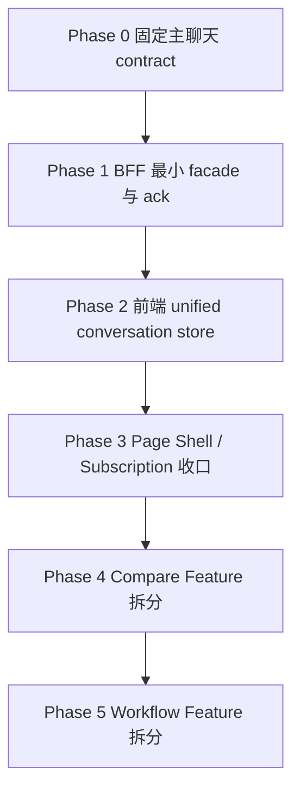

# TaskDetail 统一实施路线图

> 状态：Draft v1
> 日期：2026-04-12
> 作者：GitHub Copilot
> 关联文档：[task-detail-continue-target-module-architecture.md](task-detail-continue-target-module-architecture.md)、[task-detail-realtime-persisted-coordination-plan.md](task-detail-realtime-persisted-coordination-plan.md)、[task-detail-continue-simplified-migration-checklist.md](task-detail-continue-simplified-migration-checklist.md)

## 1. 文档目的

这份文档把下面两份方案合成一份面向执行的总路线图：

1. [task-detail-continue-target-module-architecture.md](task-detail-continue-target-module-architecture.md)
2. [task-detail-realtime-persisted-coordination-plan.md](task-detail-realtime-persisted-coordination-plan.md)

这份路线图不再重复写两份平行方案，而是明确三件事：

1. 现阶段已经确定的核心前提是什么。
2. 模块拆分后，每个模块到底负责什么。
3. 这些模块应该按什么顺序实现，彼此如何协作。

如果后续要真正开始改代码，默认以这份文档作为执行入口；其它两份文档作为专项深挖参考。

## 2. 已经确定的前提

这部分不再反复讨论，视为已确定。

### 2.1 主聊天的数据切换模型已经确定

主聊天采用统一消息状态机，而不是继续沿用“persisted 列表 + live overlay 列表”的双展示源。

核心原则：

1. 前端只渲染一份 unified conversation store。
2. 同一条消息从 `local-draft -> realtime-streaming -> realtime-committing -> persisted` 连续演进。
3. `task.message.persisted` / `task.round.synced` 这类持久化确认信号，是前端无缝切换的正式边界。

### 2.2 模块拆分的目的已经确定

拆分的目的不是为了把大文件切小，而是为了消除职责耦合。

具体来说：

1. 主聊天 continue 不能再被 compare 和 workflow 污染。
2. web-ui 不能继续直接理解 session/tree/phase 的底层事实模型。
3. BFF 必须承担 facade 和用例编排，而不是让前端自己拼语义。

## 3. 现在真正需要回答的问题

当前真正不确定的，不是“要不要统一消息状态机”，也不是“要不要拆模块”，而是：

1. 拆分后的模块分别干什么。
2. 哪些模块是主链路必需品，哪些是后置拆分。
3. 哪些必须先做，哪些可以等主聊天稳定后再做。

这份文档专门回答这三个问题。

## 4. 一张图看全局顺序

顺序原则只有一句话：

**先稳定主聊天的数据边界，再拆模块；先拆主聊天，再拆 compare 和 workflow。**

## 5. 未来模块功能定义

这部分是整份路线图最重要的内容。下面的功能定义，是后续拆分时的边界基线。

## 5.1 前端模块

### 5.1.1 Page Shell

目标模块：

1. `TaskDetailPageShell`
2. `TaskDetailSectionModels`

负责：

1. 读取 `taskId`、route context、页面级 loading/error。
2. 组合 Conversation、Compare、Workflow、Sidebar 四个 feature。
3. 把这些 feature 投影成 header、main、sidebar 三个展示分区。

不负责：

1. 发 continue。
2. 解析 realtime 事件。
3. 合并 persisted 和 realtime 消息。
4. 决定 compare / workflow 的内部状态机。

你可以把它理解为：

1. 页面壳层
2. feature 组装层
3. 纯 UI 组合层

### 5.1.2 Conversation Feature

目标模块：

1. `useTaskConversationFeature`
2. `useTaskConversationStore`
3. `useTaskConversationActions`
4. `useTaskConversationHistory`

负责：

1. 管理主聊天当前 active round 的 unified conversation store。
2. 处理 optimistic user、local assistant draft、realtime streaming、persisted 收敛。
3. 提供主聊天 continue、stop、switch round、refresh actions。
4. 消费主聊天相关 realtime 事件。

不负责：

1. compare 候选卡。
2. workflow step 列表。
3. 侧栏 trace / member / file preview。
4. execution mode modal。

这是主链路核心模块。

### 5.1.3 Task Subscription Feature

目标模块：

1. `useTaskRealtimeSubscription`
2. `useTaskDetailSnapshotRefresh`

负责：

1. 订阅 task/project websocket。
2. 管理 reconnect、silent reconcile、refresh 节流。
3. 把 refresh 需求路由给 Conversation、Compare、Workflow。

不负责：

1. 保存消息正文。
2. 解释 compare winner 语义。
3. 解释 workflow step 状态。

它是调度层，不是业务状态层。

### 5.1.4 Sidebar Feature

目标模块：

1. `useTaskSidebarFeature`
2. `useTaskTracePanel`
3. `useTaskMemberPanel`
4. `useTaskFilePreviewPanel`

负责：

1. 展示主聊天之外的辅助视图。
2. 按当前 task / round / session 上下文拉取 trace、member、file preview 数据。

不负责：

1. 主聊天写动作。
2. compare / workflow 的状态管理。

### 5.1.5 Compare Feature

目标模块：

1. `useTaskCompareFeature`
2. `useTaskCompareCandidates`
3. `useTaskCompareActions`

负责：

1. 发起 compare run。
2. 加载 candidate rounds、winner、adoption 状态。
3. 展示候选结果与模型元信息。
4. 触发 adopt。

不负责：

1. 主聊天流式渲染。
2. 将候选卡插回主聊天消息链。
3. 推断 active round。

它是独立功能面板，不是主聊天的一部分。

### 5.1.6 Workflow Feature

目标模块：

1. `useTaskWorkflowFeature`
2. `useTaskWorkflowSteps`
3. `useTaskWorkflowActions`

负责：

1. 发起 workflow run。
2. 显示 step 列表、当前 step、最终结果。
3. 执行 cancel、retry、resume 等动作。

不负责：

1. 主聊天 continue。
2. compare adoption。
3. 复用主聊天的消息切换状态机。

它是任务流程面板，不是聊天变种。

## 5.2 BFF 模块

### 5.2.1 Task Routes Shell

目标模块：

1. `routes.ts`

负责：

1. 路由参数解析。
2. 鉴权。
3. 调用 application service。
4. 返回 facade DTO。

不负责：

1. 塞满业务逻辑。
2. 直接发布页面事件。

### 5.2.2 Continue Application Service

目标模块：

1. `continue-task.ts`

负责：

1. 校验 continue 输入。
2. 解析 parent round / parent session。
3. 创建 child session。
4. 预写 prompt snapshot。
5. 调 runtime continue。
6. 返回 continue round DTO。

不负责：

1. compare batch。
2. workflow step 自动推进。

### 5.2.3 Round Query Facade

目标模块：

1. `query-task-rounds.ts`
2. `query-current-round.ts`
3. `query-task-round-messages.ts`
4. `task-round-facade.ts`

负责：

1. 把 service 的 session/tree/phase/query 结果包装成 round DTO。
2. 对外暴露 `currentRound`、`roundMessages`、`roundList`。
3. 返回 snapshotVersion / persistedThroughRevision 这类前端切换必需信息。

不负责：

1. 写消息。
2. 解释 runtime 原始事件。
3. 替前端做渲染判断。

它是前端和 service 真源之间的语义翻译层。

### 5.2.4 Realtime Publisher

目标模块：

1. `task-domain-event-mapper.ts`
2. `task-realtime-publisher.ts`

负责：

1. 把内部 source event 转成稳定 `task.*` 事件。
2. 发布 `task.message.updated`、`task.message.delta`、`task.message.persisted`、`task.round.synced`、`task.reconcile.required`。
3. 给 Conversation、Compare、Workflow 分发各自的事件。

不负责：

1. 页面状态机。
2. HTTP facade。

### 5.2.5 Compare Application Service

目标模块：

1. `compare-task.ts`
2. `adopt-compare-winner.ts`

负责：

1. 创建 compare run。
2. 批量启动 candidate rounds。
3. 采纳 winner。

不负责：

1. 主聊天 unified store。
2. workflow step 执行。

### 5.2.6 Workflow Application Service

目标模块：

1. `start-workflow.ts`
2. `advance-workflow-step.ts`
3. `query-workflow-view.ts`

负责：

1. 启动 workflow run。
2. 推进 step。
3. 汇总最终 workflow view。

不负责：

1. continue。
2. compare adoption。

## 5.3 Service 模块

### 5.3.1 Message Persistence Service

负责：

1. canonical message upsert。
2. parts、operations、artifacts 关联写入。
3. message id 与时间字段的稳定落库。

它是事实写源，不是页面 facade。

### 5.3.2 Session Query Service

负责：

1. session、lineage、trace、timeline、tree 的事实查询。
2. 为 Round Query Facade 提供底层事实。

它不直接表达 round 语义。

### 5.3.3 Phase Lifecycle Service

负责：

1. phase 创建、更新、暂停、完成、取消、采纳。
2. compare 与 workflow 生命周期真源。

它不负责主聊天消息切换。

## 6. 统一实施顺序

这部分是执行顺序，不是概念顺序。

### 阶段 0：冻结主聊天 contract

先完成：

1. 稳定 `messageId` 对外口径。
2. 定义 `task.message.persisted` / `task.round.synced`。
3. 定义 `snapshotVersion` / `persistedThroughRevision`。
4. 定义 unified conversation store 的 authority 切换规则。

交付物：

1. contract 文档冻结。
2. 前后端接口草案冻结。

为什么先做：

1. 这是后续所有 Conversation 模块的共同前提。

### 阶段 1：先做 BFF 最小支撑，不先拆前端目录

先完成：

1. runtime id alias 归一。
2. persistence ack 事件。
3. round facade 最小读接口。
4. snapshot 版本字段。

交付物：

1. BFF 最小可用 facade。
2. 可消费的 realtime ack。

为什么先做：

1. 如果前端先改 unified store，但后端还没有 ack / version，前端还是只能靠猜。

### 阶段 2：实现前端 Conversation Feature

先完成：

1. unified conversation store。
2. `useTreeMessages` 退化成 snapshot loader。
3. `useTaskMessageStore` 成为唯一 reducer 入口。
4. `useTaskDetailActionCoordinator` 的主聊天动作收口到 Conversation Actions。

交付物：

1. 主聊天无缝切换跑通。
2. 主聊天不再依赖渲染阶段双源 merge。

为什么此时做：

1. 到这一阶段，主聊天已经不依赖隐式刷新与猜测切换。

### 阶段 3：再做页面层拆分

先完成：

1. Page Shell 收口。
2. Task Subscription Feature 收口。
3. Sidebar Feature 收口。

交付物：

1. 主聊天机制被放进清晰的模块边界。

为什么此时做：

1. 此时搬运的是稳定行为，而不是半成品状态机。

### 阶段 4：拆 Compare Feature

先完成：

1. compare 独立 route / facade。
2. compare 独立 panel / store。
3. adopt 从主聊天区迁出。

交付物：

1. compare 成为独立功能。

为什么排在后面：

1. compare 可以复用主聊天已稳定的 store / subscription 基础设施，但不应反向驱动主链路设计。

### 阶段 5：拆 Workflow Feature

先完成：

1. workflow 独立 application service。
2. workflow 独立 panel / store。
3. sequential-chain 脱离主聊天 continue。

交付物：

1. workflow 成为独立功能。

为什么最后做：

1. workflow 是最重、最复杂的长链路，应该建立在主聊天和 facade 已稳定的基础上。

## 7. 哪些能并行，哪些不能并行

### 可以并行

1. Page Shell 与 Sidebar 的纯视图收口，可以和 unified conversation store 并行准备。
2. BFF 目录整理，可以和 round facade 设计并行。
3. compare / workflow 的独立目录壳层可以先建，但先不要接入主链路。

### 不能并行

1. 不能在主聊天 contract 没冻结前，先大拆 `useTreeMessages`、`useTaskMessageStore`、`useTaskDetailActionCoordinator`。
2. 不能在 round facade 没有最小落地前，让前端直接按 session/tree 事实实现新的 Conversation Feature。
3. 不能在 persistence ack 没有定义前，让 snapshot refresh 去承担最终 authority 切换。

## 8. 每个阶段完成后的系统状态

### 完成阶段 0 后

系统还没大改代码，但主聊天的真实边界被锁定，后续不会再反复争论“该信 realtime 还是数据库”。

### 完成阶段 1 后

后端已经能明确说清：

1. 哪条消息开始了。
2. 哪条消息结束了。
3. 哪条消息持久化完成了。
4. 某一轮 snapshot 是否追平了。

### 完成阶段 2 后

主聊天页已经不再依赖渲染阶段的 persisted/live 双列表 merge，前端无缝切换问题得到实质解决。

### 完成阶段 3 后

页面结构开始清楚，但 compare / workflow 仍可暂时维持旧逻辑，不阻塞主聊天稳定。

### 完成阶段 4 后

compare 从主聊天链路里退出，主聊天不再承担 candidate 卡与 adoption 逻辑。

### 完成阶段 5 后

workflow 从主聊天 continue 语义里退出，TaskDetail 的三个功能 finally 清晰分治。

## 9. Phase 0 到 Phase 2 具体任务单

这部分不再讲抽象分层，而是直接给执行任务和现有文件映射。

## 9.1 Phase 0：冻结主聊天 contract

目标：先把“主聊天如何切换 authority”说死，再开始写 BFF 和前端代码。

任务 0.1：冻结 message id 与 round id 公共口径

现有文件：

1. [control-plane/service/src/modules/tasks/task-session-runtime-message-schema.ts](../control-plane/service/src/modules/tasks/task-session-runtime-message-schema.ts)
2. [control-plane/service/src/modules/tasks/task-session-message-write-api.ts](../control-plane/service/src/modules/tasks/task-session-message-write-api.ts)
3. [control-plane/web-ui-bff/src/modules/realtime/sse-aggregator.ts](../control-plane/web-ui-bff/src/modules/realtime/sse-aggregator.ts)
4. [control-plane/web-ui/src/lib/message-normalize.ts](../control-plane/web-ui/src/lib/message-normalize.ts)

要做的事：

1. 明确 runtime `messageId`、canonical `messageId`、public `roundId` 的映射规则。
2. 明确 Phase 1 暂时允许 `roundId = taskSessionId`，Phase 2 再决定是否独立抽象 round identity。

任务 0.2：冻结 persisted ack contract

现有文件：

1. [control-plane/web-ui-bff/src/types/events.ts](../control-plane/web-ui-bff/src/types/events.ts)
2. [control-plane/web-ui-bff/src/modules/realtime/sse-aggregator.ts](../control-plane/web-ui-bff/src/modules/realtime/sse-aggregator.ts)
3. [control-plane/web-ui/src/lib/task-message-patch-event.ts](../control-plane/web-ui/src/lib/task-message-patch-event.ts)

要做的事：

1. 固定 `task.message.persisted` 最小字段。
2. 固定 `task.round.synced` 最小字段。
3. 明确前端只在这两类事件或 reconnect/reconcile 边界上切换 authority。

任务 0.3：冻结 snapshot version 的最小语义

现有文件：

1. [control-plane/web-ui-bff/src/modules/tasks/task-round-facade.ts](../control-plane/web-ui-bff/src/modules/tasks/task-round-facade.ts)
2. [control-plane/web-ui/src/composables/useTaskDetailRefreshController.ts](../control-plane/web-ui/src/composables/useTaskDetailRefreshController.ts)
3. [control-plane/web-ui/src/lib/task-detail-refresh-policy.ts](../control-plane/web-ui/src/lib/task-detail-refresh-policy.ts)

要做的事：

1. Phase 1 允许先用 coarse version 占位。
2. Phase 2 再把 coarse version 替换成 service 真正 revision。

## 9.2 Phase 1：BFF 最小支撑

目标：不先动前端架构，只把前端后续切换 authority 所需的最小 BFF 能力补齐。

任务 1.1：补 round facade 最小读接口

现有文件：

1. [control-plane/web-ui-bff/src/modules/tasks/task-session-store.ts](../control-plane/web-ui-bff/src/modules/tasks/task-session-store.ts)
2. [control-plane/web-ui-bff/src/modules/tasks/task-session-read-compat.ts](../control-plane/web-ui-bff/src/modules/tasks/task-session-read-compat.ts)
3. [control-plane/web-ui-bff/src/modules/tasks/routes.ts](../control-plane/web-ui-bff/src/modules/tasks/routes.ts)

本轮已落地：

1. 新增 [control-plane/web-ui-bff/src/modules/tasks/task-round-facade.ts](../control-plane/web-ui-bff/src/modules/tasks/task-round-facade.ts)。
2. 新增 `GET /api/tasks/:taskId/current-round`。
3. 新增 `GET /api/tasks/:taskId/rounds`。
4. 新增 `GET /api/tasks/:taskId/rounds/:roundId/messages`。

任务 1.2：让 continue 返回 round DTO，而不只返回 sessionId

现有文件：

1. [control-plane/web-ui-bff/src/modules/tasks/routes.ts](../control-plane/web-ui-bff/src/modules/tasks/routes.ts)

本轮已落地：

1. 单轮 continue 返回体已经补了最小 `round`。
2. 这让前端在 Phase 2 可以直接切 active round，而不是继续猜 session 到底代表哪一轮。

任务 1.3：补 persisted ack 事件

现有文件：

1. [control-plane/web-ui-bff/src/types/events.ts](../control-plane/web-ui-bff/src/types/events.ts)
2. [control-plane/web-ui-bff/src/modules/realtime/sse-aggregator.ts](../control-plane/web-ui-bff/src/modules/realtime/sse-aggregator.ts)
3. [control-plane/web-ui-bff/src/modules/tasks/task-session-store.ts](../control-plane/web-ui-bff/src/modules/tasks/task-session-store.ts)

本轮已落地：

1. `task.message.persisted` 已加入 realtime event type。
2. `task.round.synced` 已加入 realtime event type。
3. runtime message mirror 与 tool snapshot mirror 成功写入后，都会发出 persisted/synced ack。

任务 1.4：先补最小 snapshot version 字段

现有文件：

1. [control-plane/web-ui-bff/src/modules/tasks/task-session-store.ts](../control-plane/web-ui-bff/src/modules/tasks/task-session-store.ts)
2. [control-plane/web-ui-bff/src/modules/tasks/task-round-facade.ts](../control-plane/web-ui-bff/src/modules/tasks/task-round-facade.ts)

本轮已落地：

1. `roundMessages` 返回了 `snapshotVersion`。
2. `roundMessages` 返回了 `persistedThroughRevision`。
3. 当前是 coarse version，占位用途明确，后续要换成 service 真 revision。

本轮继续已落地：

1. [control-plane/web-ui/src/lib/task-message-patch-event.ts](../control-plane/web-ui/src/lib/task-message-patch-event.ts) 已消费 persisted/synced 事件。
2. [control-plane/web-ui/src/lib/task-detail-refresh-policy.ts](../control-plane/web-ui/src/lib/task-detail-refresh-policy.ts) 已把 `round.synced` 作为主 refresh 边界。
3. `assistant-completed` / `tool-message` 不再被前端自动推断为“已落库”。

Phase 1 仍未完成的子项：

1. round facade 现在主要覆盖 continue 主链路；compare/workflow 仍保留旧读口。

## 9.3 Phase 2：前端 Conversation Feature

目标：把主聊天从 persisted list + live overlay 的双真相模型，收口成单 store。

任务 2.1：把 persisted snapshot 退化成 baseline loader

现有文件：

1. [control-plane/web-ui/src/composables/useTreeMessages.ts](../control-plane/web-ui/src/composables/useTreeMessages.ts)
2. [control-plane/web-ui/src/lib/api.ts](../control-plane/web-ui/src/lib/api.ts)

要做的事：

1. 改成按 active round 拉 snapshot。
2. 不再在 render 阶段直接和 live overlay 做双列表 merge。

本轮继续已落地：

1. [control-plane/web-ui/src/lib/api.ts](../control-plane/web-ui/src/lib/api.ts) 已新增 `getCurrentTaskRound()`、`getTaskRounds()`、`getTaskRoundMessages()`。
2. [control-plane/web-ui/src/composables/useTreeMessages.ts](../control-plane/web-ui/src/composables/useTreeMessages.ts) 已改成按 current round / selected round 读取 persisted snapshot。
3. `trace.timelineMeta` 已带 `roundId`、`snapshotVersion`、`persistedThroughRevision`。
4. `conversationAuthority=persisted` 后，只有 snapshot revision 追平 `latestPersistenceAck` 才真正停止 realtime overlay，避免无缝切换时闪回旧 persisted 内容。
5. [control-plane/web-ui/src/lib/task-conversation-display.ts](../control-plane/web-ui/src/lib/task-conversation-display.ts) 已把 persisted item、live assistant、pending draft 的显示合并逻辑收口到单入口 helper。

仍未完成：

1. 这套单入口 helper 还在 `useTreeMessages()` 显示层，尚未进一步下沉为 `useTaskMessageStore()` 的统一 conversation reducer。

任务 2.2：把 realtime reducer 收口成唯一主入口

现有文件：

1. [control-plane/web-ui/src/composables/useTaskMessageStore.ts](../control-plane/web-ui/src/composables/useTaskMessageStore.ts)
2. [control-plane/web-ui/src/composables/useTaskMessagePatchConsumer.ts](../control-plane/web-ui/src/composables/useTaskMessagePatchConsumer.ts)
3. [control-plane/web-ui/src/lib/task-live-assistant-state-manager.ts](../control-plane/web-ui/src/lib/task-live-assistant-state-manager.ts)
4. [control-plane/web-ui/src/lib/task-message-patch-event.ts](../control-plane/web-ui/src/lib/task-message-patch-event.ts)

要做的事：

1. `task.message.updated` / `delta` 驱动 `authority=realtime`。
2. `task.message.persisted` / `task.round.synced` 驱动 `authority=persisted`。
3. local draft alias、realtime alias、persisted merge 全部归到一个 reducer。

本轮继续已落地：

1. [control-plane/web-ui/src/composables/useTaskMessageStore.ts](../control-plane/web-ui/src/composables/useTaskMessageStore.ts) 已显式暴露 `conversationAuthority`。
2. [control-plane/web-ui/src/composables/useTaskMessageStore.ts](../control-plane/web-ui/src/composables/useTaskMessageStore.ts) 已显式暴露 `latestPersistenceAck`。
3. [control-plane/web-ui/src/composables/useTaskMessagePatchConsumer.ts](../control-plane/web-ui/src/composables/useTaskMessagePatchConsumer.ts) 已补 `getTaskPatchEvents()`，供 store 从 patch 历史恢复 authority。
4. [control-plane/web-ui/src/composables/useTreeMessages.ts](../control-plane/web-ui/src/composables/useTreeMessages.ts) 已基于 `latestPersistenceAck` 与当前 snapshot revision 判断 display authority，snapshot 未追平前继续保留 realtime overlay。
5. [control-plane/web-ui/src/lib/task-conversation-display.ts](../control-plane/web-ui/src/lib/task-conversation-display.ts) 已作为 reducer-like 显示层入口，统一处理 persisted/live/pending 的主聊天组合规则。

仍未完成：

1. local draft alias、realtime alias、persisted snapshot 仍未真正下沉成 `useTaskMessageStore()` 内部的单条 conversation reducer。
2. 页面渲染还没有直接消费 authority-aware unified store；当前仍由 `useTreeMessages()` 作为显示层桥接。

任务 2.3：把主聊天动作从页面协调器里拆出来

现有文件：

1. [control-plane/web-ui/src/composables/useTaskDetailActionCoordinator.ts](../control-plane/web-ui/src/composables/useTaskDetailActionCoordinator.ts)
2. [control-plane/web-ui/src/components/task-detail-shared/ChatComposer.vue](../control-plane/web-ui/src/components/task-detail-shared/ChatComposer.vue)
3. [control-plane/web-ui/src/components/task-detail-v3/TaskDetailV3MainPane.vue](../control-plane/web-ui/src/components/task-detail-v3/TaskDetailV3MainPane.vue)

要做的事：

1. continue / stop / switch round 改由 Conversation Actions 暴露。
2. 页面层只消费 feature 输出，不直接碰 message merge。

任务 2.4：把 refresh policy 改成 ack 驱动，而不是猜测驱动

现有文件：

1. [control-plane/web-ui/src/composables/useTaskDetailRefreshController.ts](../control-plane/web-ui/src/composables/useTaskDetailRefreshController.ts)
2. [control-plane/web-ui/src/lib/task-detail-refresh-policy.ts](../control-plane/web-ui/src/lib/task-detail-refresh-policy.ts)

要做的事：

1. reconnect、reconcile required、round synced 才触发 snapshot refresh。
2. assistant completed 不再自动等价于“该信 persisted 了”。

## 10. 本轮验证

本轮新增或更新的关键验证：

1. [tests/web-ui-bff/task-sessions-route.test.ts](../tests/web-ui-bff/task-sessions-route.test.ts) 已覆盖最小 round facade 路由。
2. [tests/web-ui-bff/realtime-pipeline-events.test.ts](../tests/web-ui-bff/realtime-pipeline-events.test.ts) 已覆盖 persisted/synced ack 事件。

## 11. 最终一句话

这套统一路线图的核心不是“先拆文件”，而是“先把主聊天的数据切换模型做对，再把这套稳定模型放进清晰模块里，最后把 compare 和 workflow 从主聊天主链路中摘出去”。