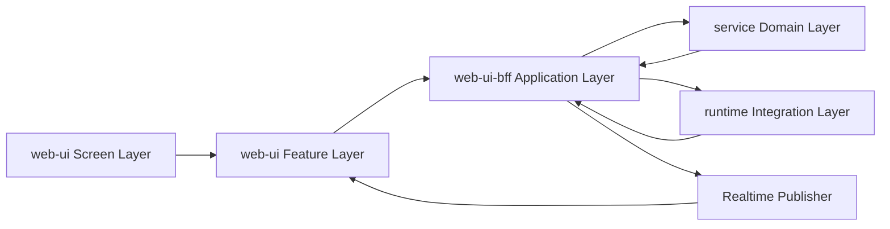

# TaskDetail Continue 目标模块架构方案

> 状态：Draft v1
> 日期：2026-04-11
> 作者：GitHub Copilot
> 关联文档：[task-detail-continue-simplified-design.md](task-detail-continue-simplified-design.md)、[task-detail-continue-simplified-migration-checklist.md](task-detail-continue-simplified-migration-checklist.md)、[task-detail-message-state-machine-plan.md](task-detail-message-state-machine-plan.md)、[task-detail-realtime-event-contract.md](task-detail-realtime-event-contract.md)、[taskdetail-v3-page-dataflow.md](taskdetail-v3-page-dataflow.md)、[task-detail-realtime-persisted-coordination-plan.md](task-detail-realtime-persisted-coordination-plan.md)、[task-detail-unified-implementation-roadmap.md](task-detail-unified-implementation-roadmap.md)
>
> 历史锚点说明（2026-04-15）：本文是目标架构草案，不是当前文件树快照。正文中若出现已删除的 coordinator / compat 文件名，应按历史迁移锚点理解，而不是当前仓库仍存在的模块。

## 1. 文档目的

这份文档描述未来稳态下的 TaskDetail Continue 模块架构，重点不是迁移步骤，而是明确：

1. 前端各模块分别负责什么
2. BFF 各模块分别负责什么
3. Service 真源层分别负责什么
4. Runtime / Realtime 管道分别负责什么
5. 各层之间应该通过什么 contract 协作

目标是把 continue、compare、workflow 三类能力拆成清晰的子系统，而不是继续堆在一条主链路里。

## 2. 设计目标

这版架构需要同时满足下面几个目标：

1. 主聊天 continue 足够简单，任何人都能沿着单链路读懂。
2. compare 和 workflow 是独立能力，不再污染主聊天页的数据流。
3. web-ui 只消费稳定 task-domain DTO，不解析 runtime 原始事件。
4. BFF 作为应用编排层，负责把底层 session / phase / runtime 细节包装成页面可消费的 facade。
5. service 继续做 canonical message 与 session lineage 的真源，不在第一阶段被迫重写。

## 3. 这份文档与实时协调方案的关系

这份文档和 [task-detail-realtime-persisted-coordination-plan.md](task-detail-realtime-persisted-coordination-plan.md) 不是两条平行路线，而是同一套方案的两个视角。

两者的分工应该明确区分：

1. 本文回答“未来模块怎么分层，谁负责什么”。
2. 实时协调方案回答“主聊天消息在 realtime 与 persisted 之间怎么无缝切换”。

它们的关系是：

1. 模块架构文档是横向分层蓝图。
2. 实时协调方案是其中 Conversation Feature 这条主链路的纵向核心机制。
3. 没有实时协调方案，Conversation Feature 只是把现有双真相问题换个目录继续保留。
4. 没有模块架构文档，实时协调方案会变成一段局部优化，最终仍被 compare、workflow、sidebar 等其它职责重新污染。

因此，正确理解不是“先做 A 文档，再做 B 文档”，而是：

1. 先用实时协调方案锁死主聊天的数据切换模型。
2. 再按本文定义的模块边界，把这套模型安放到合适的前后端模块中。

## 4. 总体分层

未来稳态分成 5 层：

1. web-ui Screen Layer
2. web-ui Feature Layer
3. web-ui-bff Application Layer
4. control-plane service Domain Layer
5. runtime / realtime Integration Layer



这 5 层的职责边界如下：

1. Screen Layer 只负责页面壳和布局，不负责业务编排。
2. Feature Layer 只负责 UI 侧业务状态和动作，不直接理解底层 runtime 协议。
3. Application Layer 只负责用例编排和 DTO facade，不持有数据库真源。
4. Domain Layer 只负责消息、session、phase、projection 的真源读写。
5. Integration Layer 只负责 runtime 适配和实时事件翻译，不直接参与页面渲染决策。

## 5. 推荐实施顺序

为了避免重构过程中继续叠加复杂度，建议按下面顺序落地。

### Phase A：先锁主聊天数据模型与 contract

目标：先解决“实时流与落库真源如何无缝切换”。

优先完成：

1. 稳定对外 `messageId`。
2. 补充 `task.message.persisted` / `task.round.synced` 或等价确认信号。
3. 补充 snapshot 的 `snapshotVersion` / `persistedThroughRevision`。
4. 确定前端 unified conversation store 的 authority 切换规则。

这一步对应的是 [task-detail-realtime-persisted-coordination-plan.md](task-detail-realtime-persisted-coordination-plan.md)。

原因：

1. 如果先拆模块但不先统一消息切换模型，只会把当前 `persisted baseline + live overlay` 的双真相问题分散到更多文件里。
2. Conversation Feature 是整个 TaskDetail 的主链路，必须先稳定它的数据语义。

### Phase B：再落最小 BFF facade

目标：让前端先停止直接理解 session/tree 细节。

优先完成：

1. 最小可用的 round query facade。
2. Conversation 使用的 round messages query。
3. Conversation 使用的 realtime persistence ack 发布。

原因：

1. 这是把 service 真源口径和前端交互口径隔开的第一道墙。
2. 没有这层，前端 unified store 仍会继续绑在 session/tree 事实模型上。

### Phase C：实现前端 Conversation Feature

目标：在不先拆 compare / workflow 的前提下，先让主聊天页切到统一消息状态机。

优先完成：

1. unified conversation store。
2. `useTaskMessageSnapshot` 成为 snapshot loader，并删除旧消息兼容 facade。
3. `useTaskMessageStore` 成为唯一 reducer 入口。
4. refresh policy 改成只在边界事件上触发。

原因：

1. 主聊天是所有场景都会经过的最高频路径。
2. 只有主聊天稳定后，compare / workflow 才不会继续反向污染它。

### Phase D：按本文拆 Page Shell 与 Feature 边界

目标：把已经稳定的主聊天机制放进清晰的模块边界。

优先完成：

1. Page Shell 收口。
2. Task Subscription Feature 收口。
3. Conversation Feature 独立目录化。

原因：

1. 这时再拆模块，搬运的是稳定 contract，而不是半成品状态机。

### Phase E：再拆 Compare Feature

目标：把 compare 从主聊天链路彻底拿掉。

优先完成：

1. compare 独立 route / facade。
2. compare 独立 store / panel。
3. adoption 动作从主聊天区迁出。

### Phase F：最后拆 Workflow Feature

目标：把 workflow 从 continue 语义彻底移除。

优先完成：

1. workflow 独立 application service。
2. workflow 独立 panel / store。
3. sequential-chain 不再出现在主聊天 continue 路径。

### 一句话顺序

推荐顺序是：

1. 先统一主聊天的数据切换模型。
2. 再补最小 facade 和事件 contract。
3. 再让主聊天落到 unified store。
4. 再做模块化拆分。
5. 最后拆 compare 和 workflow。

## 6. 哪些可以并行，哪些不能并行

### 可以并行

1. Page Shell 和 Sidebar 的纯视图拆分，可以与 Conversation unified store 并行推进。
2. BFF 目录结构预整理，可以与 round facade 设计并行推进。
3. compare / workflow 的目录搬迁准备工作，可以提前做壳层拆分，但先不要改主链路 contract。

### 不能并行

1. 不能在统一主聊天数据模型前，先大规模拆 `useTaskMessageSnapshot` / `useTaskMessageStore` / 主聊天动作协调层。
2. 不能在 round facade 落地前，让前端直接按 session/tree 事实去实现新的 Conversation Feature。
3. 不能在 persistence ack 明确前，就让 snapshot refresh 逻辑去接管最终切换。

## 7. 前端模块

## 4.1 Page Shell

建议模块：

1. `TaskDetailPageShell`
2. `TaskDetailSectionModels`

建议位置：

1. [control-plane/web-ui/src/pages/TaskDetailV3.vue](../../control-plane/web-ui/src/pages/TaskDetailV3.vue)
2. [control-plane/web-ui/src/composables/useTaskDetailPageModel.ts](../../control-plane/web-ui/src/composables/useTaskDetailPageModel.ts)
3. [control-plane/web-ui/src/composables/useTaskDetailPageSectionModels.ts](../../control-plane/web-ui/src/composables/useTaskDetailPageSectionModels.ts)

负责：

1. 读取路由参数和页面级壳层状态。
2. 组合 conversation、compare、workflow、sidebar 等 feature model。
3. 把 feature model 投影成 header、main、sidebar 分区模型。

不负责：

1. 发 continue 请求。
2. 合并实时消息 patch。
3. 管理 compare 候选状态。
4. 管理 workflow step 执行。

输入输出：

1. 输入 taskId、route context。
2. 输出 page shell model。

## 4.2 Conversation Feature

建议模块：

1. `useTaskConversationFeature`
2. `useTaskConversationStore`
3. `useTaskConversationActions`
4. `useTaskConversationHistory`

建议位置：

1. `control-plane/web-ui/src/features/task-detail/conversation/`

收编当前模块：

1. [control-plane/web-ui/src/composables/useTaskMessageSnapshot.ts](../../control-plane/web-ui/src/composables/useTaskMessageSnapshot.ts)
2. [control-plane/web-ui/src/composables/useTaskMessageStore.ts](../../control-plane/web-ui/src/composables/useTaskMessageStore.ts)
3. [control-plane/web-ui/src/composables/useTaskMessagePatchConsumer.ts](../../control-plane/web-ui/src/composables/useTaskMessagePatchConsumer.ts)
4. control-plane/web-ui/src/composables/useTaskDetailActionCoordinator.ts 中主聊天相关部分

负责：

1. 管理 active round 或 active session 的标准化消息状态。
2. 处理主聊天 continue、stop、切换历史 round。
3. 接收 `task.message.updated`、`task.message.delta`、`task.reconcile.required` 并更新主聊天 store。
4. 管理主聊天的 pending assistant draft 和 reconcile。

不负责：

1. compare 候选卡加载。
2. workflow step 列表与进度。
3. execution mode modal。
4. task member、trace、file preview 侧栏数据。

输入输出：

1. 输入 activeRoundId、activeSessionId、task realtime patch、REST message snapshot。
2. 输出主聊天 `conversationItems`、composer state、send/stop actions。

## 4.3 Compare Feature

建议模块：

1. `useTaskDetailParallelFlow`
2. `useTaskParallelCandidateActions`
3. `task-detail-parallel-read-model`

建议位置：

1. `control-plane/web-ui/src/features/task-detail/compare/`

收编当前模块：

1. [control-plane/web-ui/src/composables/useTaskDetailParallelFlow.ts](../../control-plane/web-ui/src/composables/useTaskDetailParallelFlow.ts)
2. [control-plane/web-ui/src/lib/task-detail-parallel-read-model.ts](../../control-plane/web-ui/src/lib/task-detail-parallel-read-model.ts)
3. [control-plane/web-ui/src/lib/task-detail-parallel-runtime.ts](../../control-plane/web-ui/src/lib/task-detail-parallel-runtime.ts)
4. [control-plane/web-ui/src/lib/task-detail-parallel-conversation-projector.ts](../../control-plane/web-ui/src/lib/task-detail-parallel-conversation-projector.ts)

负责：

1. 发起 compare run。
2. 加载 candidate rounds 和采纳状态。
3. 展示候选结果、模型信息、耗时、winner 状态。
4. 触发 adopt winner。

不负责：

1. 主聊天流式渲染。
2. 把 candidate 卡片插回 conversation 主链路。
3. 推断主聊天当前 active session。

输入输出：

1. 输入 compare summary、candidate snapshots、compare realtime patch。
2. 输出 compare panel model 和 adopt action。

## 4.4 Workflow Feature

建议模块：

1. `useTaskWorkflowFeature`
2. `useTaskWorkflowSteps`
3. `useTaskWorkflowActions`

建议位置：

1. `control-plane/web-ui/src/features/task-detail/workflow/`

收编当前模块：

1. [control-plane/web-ui/src/composables/useTaskDetailSequentialStepsCoordinator.ts](../../control-plane/web-ui/src/composables/useTaskDetailSequentialStepsCoordinator.ts)
2. control-plane/web-ui/src/composables/useTaskDetailExecutionModeCoordinator.ts 中 workflow 相关部分

负责：

1. 发起 workflow run。
2. 展示步骤列表、当前 step、最终结果。
3. 执行 cancel、retry、resume 等 workflow 动作。
4. 消费 `task.workflow.updated` 这类 workflow 专属事件。

不负责：

1. 主聊天 continue。
2. compare 候选采纳。
3. 承担 execution mode 全局设置入口。

输入输出：

1. 输入 workflow view DTO、workflow realtime patch。
2. 输出 workflow panel model 和 workflow actions。

## 4.5 Task Subscription Feature

建议模块：

1. `useTaskRealtimeSubscription`
2. `useTaskDetailSnapshotRefresh`

建议位置：

1. `control-plane/web-ui/src/features/task-detail/shared/`

收编当前模块：

1. [control-plane/web-ui/src/composables/useTaskDetailRefreshController.ts](../../control-plane/web-ui/src/composables/useTaskDetailRefreshController.ts)
2. [control-plane/web-ui/src/composables/useTaskDetailSnapshotCoordinator.ts](../../control-plane/web-ui/src/composables/useTaskDetailSnapshotCoordinator.ts)
3. [control-plane/web-ui/src/lib/task-detail-refresh-policy.ts](../../control-plane/web-ui/src/lib/task-detail-refresh-policy.ts)

负责：

1. 管理 task/project 订阅。
2. 统一 reconnect、silent reconcile、slow refresh 策略。
3. 把 refresh 请求按 conversation、compare、workflow 三类分发给各 feature。

不负责：

1. 管理主聊天 message store。
2. 直接操作 compare candidate 数据。
3. 构造页面 UI model。

## 4.6 Sidebar Feature

建议模块：

1. `useTaskSidebarFeature`
2. `useTaskTracePanel`
3. `useTaskMemberPanel`
4. `useTaskFilePreviewPanel`

建议位置：

1. `control-plane/web-ui/src/features/task-detail/sidebar/`

负责：

1. 文件预览、trace、member、runtime permission 侧栏信息。
2. 对 conversation、compare、workflow 提供只读辅助信息。

不负责：

1. 主链路 continue。
2. compare / workflow 的写动作编排。

## 8. BFF 模块

## 5.1 Task Routes Shell

建议模块：

1. `task routes shell`

建议位置：

1. [control-plane/web-ui-bff/src/modules/tasks/routes.ts](../../control-plane/web-ui-bff/src/modules/tasks/routes.ts)

负责：

1. 解析 HTTP 请求与鉴权。
2. 调用 application service。
3. 返回 task-domain DTO。

不负责：

1. 承载 continue / compare / workflow 全部业务细节。
2. 直接拼接 runtime 事件细节。

未来拆分方向：

1. `routes.ts` 保持薄壳。
2. 主业务逻辑下沉到 `application/` 目录。

## 5.2 Continue Application Service

建议模块：

1. `continue-task.ts`

建议位置：

1. `control-plane/web-ui-bff/src/modules/tasks/application/continue-task.ts`

承接当前逻辑：

1. [control-plane/web-ui-bff/src/modules/tasks/routes.ts](../../control-plane/web-ui-bff/src/modules/tasks/routes.ts) 中 `continueTaskExecution(...)` 及其 single continue 相关 helper

负责：

1. 校验 continue 请求。
2. 解析 parent round 或 parent session。
3. 创建 child session。
4. 预写 user prompt snapshot。
5. 启动 runtime continue。
6. 返回 continue round DTO。

不负责：

1. compare candidate 批量启动。
2. workflow step 自动推进。
3. 页面专属 refresh 策略。

## 5.3 Compare Application Service

建议模块：

1. `compare-task.ts`
2. `adopt-compare-winner.ts`

建议位置：

1. `control-plane/web-ui-bff/src/modules/tasks/application/compare-task.ts`
2. `control-plane/web-ui-bff/src/modules/tasks/application/adopt-compare-winner.ts`

承接当前逻辑：

1. [control-plane/web-ui-bff/src/modules/tasks/routes.ts](../../control-plane/web-ui-bff/src/modules/tasks/routes.ts) 中 parallel continue 和 parallel execute 相关编排

负责：

1. 创建 compare run。
2. 批量启动 candidate rounds。
3. 追踪 compare 状态。
4. 采纳 winner。

不负责：

1. 主聊天 active round 的消息流。
2. workflow step 引擎。

## 5.4 Workflow Application Service

建议模块：

1. `start-workflow.ts`
2. `advance-workflow-step.ts`
3. `query-workflow-view.ts`

建议位置：

1. `control-plane/web-ui-bff/src/modules/tasks/application/workflow/`

承接当前逻辑：

1. [control-plane/web-ui-bff/src/modules/tasks/routes.ts](../../control-plane/web-ui-bff/src/modules/tasks/routes.ts) 中 `startSequentialChainExecution(...)`
2. [control-plane/web-ui-bff/src/modules/tasks/workflow-view.ts](../../control-plane/web-ui-bff/src/modules/tasks/workflow-view.ts)
3. [control-plane/web-ui-bff/src/modules/tasks/workflow-stage-execution.ts](../../control-plane/web-ui-bff/src/modules/tasks/workflow-stage-execution.ts)

负责：

1. 启动 workflow run。
2. 查询 workflow 视图。
3. 推进 step 生命周期。
4. 聚合 workflow 最终结果。

不负责：

1. continue 请求。
2. compare 结果采纳。

## 5.5 Round Query Facade

建议模块：

1. `query-task-rounds.ts`
2. `query-task-round-messages.ts`

建议位置：

1. `control-plane/web-ui-bff/src/modules/tasks/application/query/`

负责：

1. 把 service 的 session/tree/query 结果包装成 round facade。
2. 对外隐藏大部分 lineage 细节。
3. 为 web-ui 提供稳定 round DTO。

不负责：

1. 写 message。
2. 写 phase。
3. 处理 runtime 事件。

### 为什么需要 Round Query Facade

根因不是“想多包一层 abstraction”，而是当前真源和页面语义天然不在一个层级。

当前 service 侧的真实读模型主要是：

1. session
2. session lineage
3. task tree
4. execution trace
5. phase

但页面真正想表达的是：

1. 当前这一轮对话是什么
2. 这一轮的父轮次是什么
3. 这一轮是否正在运行
4. 这一轮有哪些消息
5. 这一轮是不是 compare candidate 或 workflow step

如果没有 round query facade，问题会直接暴露到前端：

1. web-ui 必须自己理解 session lineage、`sourceType`、`sessionKind`、phase、winner、stepIndex 等底层字段。
2. 主聊天、compare、workflow 会各自从不同接口拼一套“这一轮”的语义，导致三套口径漂移。
3. 任何底层 session / tree / projection 调整，都会直接冲击页面逻辑和测试。
4. 未来从 session-first 逐步过渡到 round-first 时，web-ui 会变成迁移成本最高的一层。

所以它需要的不是“再多一个读接口”，而是一个明确的边界层：

1. service 继续讲事实：session、message、phase、projection。
2. BFF round facade 负责讲页面语义：round、currentRound、roundMessages、compare candidates、workflow steps。

这层的核心价值有 4 个：

1. 隔离底层模型变化。只要 round facade contract 不变，service 读模型内部怎么调都不会直接泄漏到前端。
2. 统一页面语义。主聊天、compare、workflow 都围绕 round DTO 协作，而不是各自拼 session/tree 事实。
3. 降低迁移风险。现在可以继续复用现有 session/tree 真源，不需要先重写存储层才能推进前端简化。
4. 提供 fail-closed 边界。碰到 lineage 缺口、projection 滞后、session 元数据不完整时，BFF 可以统一返回 `reconcileRequired`、`partial`、`stale` 这类显式状态，而不是让页面去猜。

一句话讲，round query facade 是为了把“底层事实模型”和“页面交互模型”隔开；没有这层，前端会继续被 session/tree 细节绑死。

## 5.6 Runtime Gateway

建议模块：

1. `runtime gateway`
2. `runtime event mapper`

建议位置：

1. [control-plane/web-ui-bff/src/modules/agent-control/runtime-provider-pimono.ts](../../control-plane/web-ui-bff/src/modules/agent-control/runtime-provider-pimono.ts)
2. `control-plane/web-ui-bff/src/modules/agent-control/runtime-event-mapper.ts`

负责：

1. 调用 runtime createSession、continueSession、terminate。
2. 接收 runtime 原始 SSE。
3. 产出内部 source event。

不负责：

1. 生成页面公共 DTO。
2. 直接决定 web-ui 刷新策略。

## 5.7 Realtime Publisher

建议模块：

1. `task-realtime-publisher.ts`
2. `task-domain-event-mapper.ts`

建议位置：

1. [control-plane/web-ui-bff/src/modules/realtime/sse-aggregator.ts](../../control-plane/web-ui-bff/src/modules/realtime/sse-aggregator.ts)
2. [control-plane/web-ui-bff/src/modules/realtime/ws-broadcaster.ts](../../control-plane/web-ui-bff/src/modules/realtime/ws-broadcaster.ts)

承接当前逻辑：

1. [control-plane/web-ui-bff/src/modules/realtime/sse-aggregator.ts](../../control-plane/web-ui-bff/src/modules/realtime/sse-aggregator.ts) 中 `buildTaskDomainEvents(...)` 和各种 finalize / track 逻辑

负责：

1. 把内部 runtime/source event 映射成稳定 `task.*` 事件。
2. 把 conversation、compare、workflow 三类事件分别发布到对应通道。
3. 在必要时触发 `task.reconcile.required`。

不负责：

1. 页面侧 message reducer。
2. HTTP facade。

## 9. Service 模块

## 6.1 Message Persistence Service

现有模块：

1. [control-plane/service/src/modules/tasks/task-session-message-write-api.ts](../../control-plane/service/src/modules/tasks/task-session-message-write-api.ts)

未来角色：

1. canonical message 写真源。
2. 负责入站 runtime message 的规范化、upsert、parts 写入、operation / artifact 关联。

不负责：

1. 对外暴露 round facade。
2. 决定主聊天页应该怎么显示。

## 6.2 Session Query Service

现有模块：

1. [control-plane/service/src/modules/tasks/task-session-read.ts](../../control-plane/service/src/modules/tasks/task-session-read.ts)
2. [control-plane/service/src/modules/tasks/task-session-routes.ts](../../control-plane/service/src/modules/tasks/task-session-routes.ts)

未来角色：

1. session、tree、timeline、execution trace 真源查询。
2. 提供 BFF round facade 所需的基础事实。

不负责：

1. 承担页面层 round 抽象语义。
2. 直接发 websocket。

## 6.3 Phase Lifecycle Service

现有模块：

1. [control-plane/service/src/modules/tasks/task-phase-write-api.ts](../../control-plane/service/src/modules/tasks/task-phase-write-api.ts)

未来角色：

1. phase 创建、暂停、完成、取消、采纳。
2. compare 和 workflow 的生命周期真源。

不负责：

1. 主聊天 message 流。
2. 页面 compare/workflow 视图 DTO 组装。

## 6.4 Projection Service

现有模块：

1. [control-plane/service/src/modules/tasks/task-domain-projector.ts](../../control-plane/service/src/modules/tasks/task-domain-projector.ts)
2. [control-plane/service/src/modules/tasks/task-projection-routes.ts](../../control-plane/service/src/modules/tasks/task-projection-routes.ts)

未来角色：

1. 生成 task snapshot、timeline view、projection-backed read model。
2. 为 list、overview、monitoring、workflow summary 提供聚合视图。

不负责：

1. 页面侧实时 patch reducer。
2. BFF facade 的业务语义判断。

## 10. Runtime / Realtime 模块

## 7.1 Runtime Adapter

现有模块：

1. [control-plane/web-ui-bff/src/modules/agent-control/runtime-provider-pimono.ts](../../control-plane/web-ui-bff/src/modules/agent-control/runtime-provider-pimono.ts)

未来角色：

1. PiMono 的专用 adapter。
2. 统一 createSession、continueSession、terminate、permission request 等协议差异。

## 7.2 Runtime Event Mapper

建议模块：

1. `runtime-event-mapper.ts`

未来角色：

1. 只把 runtime 原始事件翻译成内部 source event。
2. 不直接产出页面公共事件。

## 7.3 Task Domain Event Publisher

现有模块：

1. [control-plane/web-ui-bff/src/modules/realtime/sse-aggregator.ts](../../control-plane/web-ui-bff/src/modules/realtime/sse-aggregator.ts)
2. [control-plane/web-ui-bff/src/modules/realtime/ws-broadcaster.ts](../../control-plane/web-ui-bff/src/modules/realtime/ws-broadcaster.ts)

未来角色：

1. conversation、compare、workflow 三类 event 的统一发布器。
2. 保证 websocket 只对外暴露稳定 contract。

## 11. 模块交互链路

## 8.1 Continue 主链路

```text
TaskDetailPageShell
  -> ConversationFeature
  -> Continue Application Service
  -> Runtime Gateway
  -> Message Persistence Service
  -> Realtime Publisher
  -> ConversationStore
```

解释：

1. 页面只通过 ConversationFeature 发 continue。
2. BFF Continue Application Service 负责 child session 和 round facade。
3. runtime 和 service 负责执行与持久化。
4. Realtime Publisher 只发稳定 `task.message.*` 和 `task.round.*`。

## 8.2 Compare 链路

```text
TaskDetailPageShell
  -> CompareFeature
  -> Compare Application Service
  -> Runtime Gateway
  -> Phase Lifecycle Service
  -> Realtime Publisher
  -> CompareFeature Store
```

解释：

1. compare 不再经过主聊天 continue。
2. compare 状态只进入 CompareFeature，不进入主聊天 reducer。

## 8.3 Workflow 链路

```text
TaskDetailPageShell
  -> WorkflowFeature
  -> Workflow Application Service
  -> Runtime Gateway / Workflow Step Runner
  -> Phase Lifecycle Service
  -> Realtime Publisher
  -> WorkflowFeature Store
```

解释：

1. workflow 与主聊天共享 task 上下文，但不共享写动作入口。
2. step 自动推进属于 Workflow Application Service 和 step runner 内部职责。

## 12. 现有重模块的未来归宿

## 9.1 前端

当前重模块的未来归宿如下：

1. [control-plane/web-ui/src/composables/useTaskDetailPageModel.ts](../../control-plane/web-ui/src/composables/useTaskDetailPageModel.ts) 收缩成 Page Shell 组合层。
2. control-plane/web-ui/src/composables/useTaskDetailActionCoordinator.ts 拆成 ConversationActions、CompareActions、WorkflowActions 三块。
3. [control-plane/web-ui/src/composables/useTaskMessageSnapshot.ts](../../control-plane/web-ui/src/composables/useTaskMessageSnapshot.ts) 与 [control-plane/web-ui/src/composables/useTaskMessageStore.ts](../../control-plane/web-ui/src/composables/useTaskMessageStore.ts) 共同收敛为 ConversationFeature 的主聊天读链；旧兼容消息层已删除。
4. [control-plane/web-ui/src/composables/useTaskDetailParallelFlow.ts](../../control-plane/web-ui/src/composables/useTaskDetailParallelFlow.ts) 变成 CompareFeature。
5. [control-plane/web-ui/src/composables/useTaskDetailSequentialStepsCoordinator.ts](../../control-plane/web-ui/src/composables/useTaskDetailSequentialStepsCoordinator.ts) 变成 WorkflowFeature。
6. [control-plane/web-ui/src/composables/useTaskDetailRefreshController.ts](../../control-plane/web-ui/src/composables/useTaskDetailRefreshController.ts) 和 [control-plane/web-ui/src/composables/useTaskDetailSnapshotCoordinator.ts](../../control-plane/web-ui/src/composables/useTaskDetailSnapshotCoordinator.ts) 收缩成 Task Subscription Feature。

## 9.2 后端

当前重模块的未来归宿如下：

1. [control-plane/web-ui-bff/src/modules/tasks/routes.ts](../../control-plane/web-ui-bff/src/modules/tasks/routes.ts) 收缩成 routes shell，业务逻辑下沉到 application services。
2. [control-plane/web-ui-bff/src/modules/realtime/sse-aggregator.ts](../../control-plane/web-ui-bff/src/modules/realtime/sse-aggregator.ts) 拆成 runtime source event 聚合、task-domain event mapper、publisher 三层责任。
3. [control-plane/web-ui-bff/src/modules/agent-control/runtime-provider-pimono.ts](../../control-plane/web-ui-bff/src/modules/agent-control/runtime-provider-pimono.ts) 保持 runtime adapter 身份，不再继续承担公共页面事件语义。
4. [control-plane/service/src/modules/tasks/task-session-read.ts](../../control-plane/service/src/modules/tasks/task-session-read.ts) 和 [control-plane/service/src/modules/tasks/task-session-message-write-api.ts](../../control-plane/service/src/modules/tasks/task-session-message-write-api.ts) 继续作为真源，不直接被页面层 DTO 牵着走。

## 13. 未来目录结构

建议未来目录形态如下：

```text
control-plane/web-ui/src/
  pages/
    TaskDetailV3.vue
  features/
    task-detail/
      conversation/
        index.ts
        task-conversation.contracts.ts
        useTaskConversationFeature.ts
        useTaskConversationStore.ts
        useTaskConversationActions.ts
        useTaskConversationHistory.ts
      compare/
        index.ts
        task-compare.contracts.ts
        useTaskDetailParallelFlow.ts
        useTaskParallelCandidateActions.ts
        task-detail-parallel-read-model.ts
      workflow/
        index.ts
        task-workflow.contracts.ts
        useTaskWorkflowFeature.ts
        useTaskWorkflowSteps.ts
        useTaskWorkflowActions.ts
      shared/
        task-detail.contracts.ts
        useTaskRealtimeSubscription.ts
        useTaskDetailSnapshotRefresh.ts
        task-detail-refresh-policy.ts
      sidebar/
        useTaskSidebarFeature.ts
        useTaskTracePanel.ts
        useTaskMemberPanel.ts
        useTaskFilePreviewPanel.ts
  features/task-detail/
    page/
      useTaskDetailPageShell.ts
      useTaskDetailSectionModels.ts
      task-detail-page.contracts.ts

control-plane/web-ui-bff/src/modules/tasks/
  routes.ts
  application/
    contracts/
      task-round.contracts.ts
      task-compare.contracts.ts
      task-workflow.contracts.ts
    continue-task.ts
    compare-task.ts
    adopt-compare-winner.ts
    query/
      query-task-rounds.ts
      query-current-round.ts
      query-task-round-messages.ts
      query-compare-run.ts
      query-workflow-run.ts
    workflow/
      start-workflow.ts
      advance-workflow-step.ts
      cancel-workflow.ts
      query-workflow-view.ts
  query-facade/
    task-round-facade.ts
    task-compare-facade.ts
    task-workflow-facade.ts

control-plane/web-ui-bff/src/modules/realtime/
  contracts/
    task-realtime.contracts.ts
  task-domain-event-mapper.ts
  task-realtime-publisher.ts
  task-reconcile-request.ts

control-plane/service/src/modules/tasks/
  contracts/
    task-session.contracts.ts
    task-phase.contracts.ts
    task-message.contracts.ts
  task-session-read.ts
  task-session-message-write-api.ts
  task-phase-write-api.ts
  task-domain-projector.ts
```

### 目录说明

前端：

1. `features/task-detail/conversation/` 只容纳主聊天能力。
2. `features/task-detail/compare/` 只容纳 compare 能力。
3. `features/task-detail/workflow/` 只容纳 workflow 能力。
4. `features/task-detail/shared/` 放订阅、刷新、公共 DTO 和 feature 间共享工具。
5. `features/task-detail/page/` 只放 page shell 和 section model，不再承载业务状态机。

BFF：

1. `application/` 放用例编排。
2. `application/contracts/` 放对 web-ui 暴露的应用层 DTO。
3. `query-facade/` 放从 service 真源到 round/compare/workflow facade 的包装逻辑。
4. `realtime/contracts/` 放 websocket 稳定事件 contract。

service：

1. `contracts/` 只描述 domain 真源口径，不夹带页面语义。
2. 读写 API 仍围绕 session、message、phase、projection 展开。

## 14. 关键 TypeScript 接口草案

下面这些接口不是要求立刻一比一落库，而是未来各层 contract 的稳定目标。

### 11.1 公共 Round DTO

```ts
export type TaskRoundKind = "continue" | "compare-candidate" | "workflow-step";
export type TaskRoundSource = "continue" | "compare" | "workflow";
export type TaskRoundStatus = "queued" | "running" | "completed" | "failed" | "cancelled";

export interface TaskRoundDto {
  id: string;
  taskId: string;
  sessionId: string;
  parentRoundId?: string | null;
  parentSessionId?: string | null;
  phaseId?: string | null;
  kind: TaskRoundKind;
  source: TaskRoundSource;
  status: TaskRoundStatus;
  title?: string | null;
  promptText: string;
  model?: string | null;
  candidateIndex?: number | null;
  stepIndex?: number | null;
  startedAt?: string | null;
  completedAt?: string | null;
  createdAt: string;
  updatedAt: string;
  stale?: boolean;
  partial?: boolean;
}

export interface TaskRoundListDto {
  taskId: string;
  currentRoundId?: string | null;
  rounds: TaskRoundDto[];
}
```

### 11.2 主聊天消息 DTO

```ts
export type TaskMessageRole = "user" | "assistant" | "tool" | "system";
export type TaskMessageStatus = "pending" | "streaming" | "completed" | "failed" | "cancelled";
export type TaskMessagePartType = "text" | "toolCall" | "toolResult";

export interface TaskMessagePartDto {
  id: string;
  partIndex: number;
  partType: TaskMessagePartType;
  text: string;
  finalizedAt?: string | null;
}

export interface TaskMessageDto {
  id: string;
  roundId: string;
  sessionId: string;
  role: TaskMessageRole;
  status: TaskMessageStatus;
  text: string;
  errorText?: string | null;
  parts: TaskMessagePartDto[];
  createdAt: string;
  updatedAt: string;
  startedAt?: string | null;
  completedAt?: string | null;
}

export interface TaskRoundMessagesDto {
  taskId: string;
  round: TaskRoundDto;
  messages: TaskMessageDto[];
  reconcileRequired?: boolean;
}
```

### 11.3 Compare DTO

```ts
export type CompareRunStatus = "running" | "awaiting_adoption" | "completed" | "failed" | "cancelled";

export interface CompareCandidateDto {
  roundId: string;
  label: string;
  model: string;
  status: TaskRoundStatus;
  summaryText?: string | null;
  latestResponseText?: string | null;
  startedAt?: string | null;
  completedAt?: string | null;
  winner: boolean;
}

export interface TaskCompareRunDto {
  id: string;
  taskId: string;
  baseRoundId?: string | null;
  status: CompareRunStatus;
  candidates: CompareCandidateDto[];
  createdAt: string;
  updatedAt: string;
}
```

### 11.4 Workflow DTO

```ts
export type WorkflowRunStatus = "running" | "completed" | "failed" | "cancelled";
export type WorkflowStepStatus = "pending" | "running" | "completed" | "failed" | "cancelled";

export interface WorkflowStepDto {
  id: string;
  roundId?: string | null;
  title: string;
  instruction: string;
  status: WorkflowStepStatus;
  stepIndex: number;
  model?: string | null;
  resultText?: string | null;
  startedAt?: string | null;
  completedAt?: string | null;
}

export interface TaskWorkflowRunDto {
  id: string;
  taskId: string;
  status: WorkflowRunStatus;
  currentStepIndex?: number | null;
  steps: WorkflowStepDto[];
  finalResultText?: string | null;
  createdAt: string;
  updatedAt: string;
}
```

### 11.5 web-ui Feature 接口

```ts
export interface TaskConversationFeature {
  state: {
    activeRoundId?: string;
    activeSessionId?: string;
    sending: boolean;
    stopping: boolean;
    reconcileRequired: boolean;
  };
  data: {
    round?: TaskRoundDto;
    messages: TaskMessageDto[];
    hasStreamingAssistant: boolean;
  };
  actions: {
    continue(prompt: string): Promise<void>;
    stop(): Promise<void>;
    switchRound(roundId: string): Promise<void>;
    refresh(): Promise<void>;
  };
}

export interface TaskCompareFeature {
  state: { loading: boolean; adopting: boolean };
  data: { run?: TaskCompareRunDto | null };
  actions: {
    startCompare(input: {
      prompt: string;
      baseRoundId?: string;
      candidates: Array<{ label: string; model: string }>;
    }): Promise<void>;
    adopt(roundId: string): Promise<void>;
    refresh(): Promise<void>;
  };
}

export interface TaskWorkflowFeature {
  state: { loading: boolean; running: boolean };
  data: { run?: TaskWorkflowRunDto | null };
  actions: {
    startWorkflow(input: {
      steps: Array<{ title: string; instruction: string; model?: string }>;
    }): Promise<void>;
    cancel(): Promise<void>;
    refresh(): Promise<void>;
  };
}
```

### 11.6 BFF Application Service 接口

```ts
export interface ContinueTaskInput {
  taskId: string;
  prompt: string;
  parentRoundId?: string;
  authorization: string;
}

export interface ContinueTaskResult {
  taskId: string;
  round: TaskRoundDto;
}

export interface ContinueTaskService {
  execute(input: ContinueTaskInput): Promise<ContinueTaskResult>;
}

export interface QueryTaskRoundsService {
  execute(args: { taskId: string; authorization: string }): Promise<TaskRoundListDto>;
}

export interface QueryTaskRoundMessagesService {
  execute(args: {
    taskId: string;
    roundId: string;
    authorization: string;
  }): Promise<TaskRoundMessagesDto>;
}
```

### 11.7 Realtime Contract 草案

```ts
export interface TaskRealtimeEnvelope<TType extends string, TPayload> {
  frameKind: "domain";
  schemaVersion: 1;
  eventId: string;
  type: TType;
  taskId: string;
  projectId: string;
  occurredAt: string;
  payload: TPayload;
}

export type TaskConversationRealtimeEvent =
  | TaskRealtimeEnvelope<"task.round.started", { round: TaskRoundDto }>
  | TaskRealtimeEnvelope<"task.message.updated", { roundId: string; message: TaskMessageDto }>
  | TaskRealtimeEnvelope<"task.message.delta", { roundId: string; messageId: string; delta: string }>
  | TaskRealtimeEnvelope<"task.round.finished", { roundId: string; status: TaskRoundStatus }>
  | TaskRealtimeEnvelope<"task.reconcile.required", { scope: "conversation" | "compare" | "workflow" }>;
```

### 11.8 Service 真源接口草案

```ts
export interface TaskSessionQueryPort {
  listTaskSessions(taskId: string): Promise<Array<{
    sessionId: string;
    parentSessionId?: string | null;
    sourceType?: string | null;
    sessionKind?: string | null;
    phaseId?: string | null;
    candidateIndex?: number | null;
    stepIndex?: number | null;
    title?: string | null;
    createdAt?: string | null;
    updatedAt?: string | null;
  }>>;
}

export interface TaskMessageQueryPort {
  listTaskMessages(args: {
    taskId: string;
    sessionId: string;
    includeLineage: boolean;
  }): Promise<TaskMessageDto[]>;
}

export interface TaskPhaseQueryPort {
  listTaskPhases(taskId: string): Promise<Array<{
    phaseId: string;
    phaseKind: string;
    status: string;
    currentSessionId?: string | null;
    winnerSessionId?: string | null;
  }>>;
}
```

## 15. 与实时协调方案的接口对齐点

本文中的模块边界，需要与 [task-detail-realtime-persisted-coordination-plan.md](task-detail-realtime-persisted-coordination-plan.md) 里的 4 个关键点对齐：

1. Conversation Feature 必须以 unified conversation store 为核心，而不是 persisted list + live overlay 双源拼接。
2. Round Query Facade 必须返回版本信息，至少能支持 `snapshotVersion` 和 `persistedThroughRevision` 这类同步判断。
3. Realtime Publisher 必须能发出 persistence ack 语义，而不只是 `task.message.updated` / `task.message.delta`。
4. Task Subscription Feature 的 refresh 策略，必须建立在显式 ack 和 reconcile 信号上，而不是继续靠隐式轮询猜测。

如果这 4 个点没有对齐，模块拆分会落成“结构更干净，但行为仍旧双真相”。

## 16. 模块边界规则

未来模块实现必须遵守下面的规则：

1. web-ui page shell 不能直接发业务请求。
2. web-ui feature 不能解析 runtime 原始 event payload。
3. BFF routes 不能继续塞满 use case 逻辑。
4. runtime adapter 不能直接对外发布页面公共事件。
5. service 真源层不能为了页面便利而承担 UI facade 语义。
6. compare 和 workflow 的状态不能再反向污染主聊天 reducer。

## 17. 一句话总结

未来稳态不是把当前大模块继续拆小，而是把主聊天、compare、workflow、runtime/realtime、真源读写五类责任彻底分层：前端按 feature 分治，BFF 按用例编排，service 保持真源，runtime 只做适配，realtime 只发稳定 task-domain DTO。
