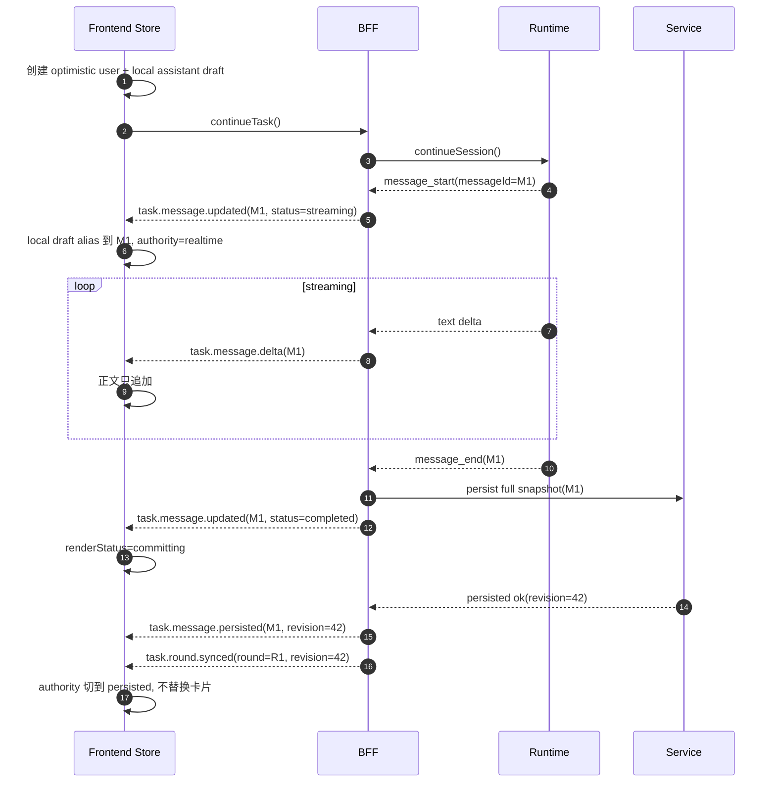

# TaskDetail 实时流与落库真源协调方案

> 状态：Web UI 已落地，contract 后续仍可继续收口
> 日期：2026-04-12
> 作者：GitHub Copilot
> 关联文档：[task-detail-realtime-event-contract.md](task-detail-realtime-event-contract.md)、[task-session-message-write-boundary-adr.md](../task-domain/task-session-message-write-boundary-adr.md)、[task-detail-continue-target-module-architecture.md](task-detail-continue-target-module-architecture.md)、[task-detail-unified-implementation-roadmap.md](task-detail-unified-implementation-roadmap.md)

## 0. 文档定位

这份文档属于 TaskDetail 文档集里的“当前实现为主、未来 contract 收口为辅”的桥接文档。

1. 当前实现：说明 TaskDetailV3 主聊天现在如何通过 `useTaskMessageSnapshot` 提供 persisted baseline、通过 `useTaskMessageStore` 承接 realtime patch，并在 `task.message.persisted` / `task.round.synced` / `task.reconcile.required` 上完成 authority 切换。
2. 未来目标：说明 BFF / service 的 realtime contract 还需要怎样继续收口，才能完全对齐 [task-detail-realtime-event-contract.md](task-detail-realtime-event-contract.md) 与 [task-detail-realtime-broadcaster-mapper-draft.md](task-detail-realtime-broadcaster-mapper-draft.md)。
3. 阅读建议：如果先看现网页面，请先读 [task-detail-display-write-logic.md](task-detail-display-write-logic.md) 和 [taskdetail-v3-page-dataflow.md](taskdetail-v3-page-dataflow.md)；如果接下来要做 cutover，再回到本文确认主聊天切换边界。

## 1. 文档目的

这份文档专门回答一个核心问题：

**实时获取的数据和最终落库的数据，应该如何协调，才能让前端无缝切换而不闪、不重、不丢。**

这里的重点不是讨论数据库 schema，而是给出一套对前端更合理的交互模型和数据协作边界。

## 2. 这份文档与目标模块架构的关系

这份文档不是独立于 [task-detail-continue-target-module-architecture.md](task-detail-continue-target-module-architecture.md) 的第二套方案，而是那份模块蓝图里的主聊天核心机制。

两份文档的分工如下：

1. 目标模块架构文档回答“未来前后端模块怎么分层”。
2. 本文回答“Conversation Feature 内部，realtime 与 persisted 如何无缝切换”。

实现顺序上，这份文档优先级更靠前，原因是：

1. 它锁定了主聊天最难的一条数据边界。
2. 没有这套边界，后续模块拆分会把双真相问题带进新的目录结构。
3. 它是 Conversation Feature、Round Query Facade、Realtime Publisher 三者共同依赖的基础协议。

因此，正确顺序是：

1. 先确定本文的数据切换模型和必要 contract。
2. 再按目标模块架构文档，把这套模型安放进 Conversation Feature、Round Query Facade、Realtime Publisher。

## 3. 原始问题出在哪里

截至 2026-04-12，主聊天页面层的双列表 merge 已删除，[control-plane/web-ui/src/composables/useTaskMessageStore.ts](../../control-plane/web-ui/src/composables/useTaskMessageStore.ts) 内部也已经收敛为 `conversationState { orderedIds, recordsById }` 的 unified render state。下面这一节保留的是这次改造前的原始故障背景，以及当前实现仍需持续满足的边界。

当前 TaskDetail 的主要问题，不是“实时流不够快”，而是前端实际上在同时消费两套不同语义的数据源：

1. 持久化读源：`getTaskMessages()` / tree / trace 回读
2. 实时读源：`task.message.updated` / `task.message.delta` 衍生出来的 live assistant state

对应到现有前端实现：

1. [control-plane/web-ui/src/composables/useTaskMessageSnapshot.ts](../../control-plane/web-ui/src/composables/useTaskMessageSnapshot.ts) 负责 persisted baseline 与 snapshot revision。
2. [control-plane/web-ui/src/composables/useTaskMessageStore.ts](../../control-plane/web-ui/src/composables/useTaskMessageStore.ts) 与 [control-plane/web-ui/src/lib/task-live-assistant-state-manager.ts](../../control-plane/web-ui/src/lib/task-live-assistant-state-manager.ts) 在统一 reducer 中维护 session-scoped live assistant 状态与 pending draft。
3. [control-plane/web-ui/src/lib/task-message-patch-event.ts](../../control-plane/web-ui/src/lib/task-message-patch-event.ts) 把 websocket 事件翻成 patch，但“这条消息是否已经持久化”并没有被明确表达出来。

表面现象就是：

1. 发送后先看到一份临时 assistant 壳，落库后又看到一份正式消息，容易重复。
2. 首 token 到了，但由于 active session / message id / snapshot 时机不一致，页面可能先空白，再突然跳出正文。
3. realtime 和 snapshot 同时更新时，正文可能闪回到更短版本，再恢复到完整版本。
4. websocket 断开或 snapshot 滞后时，页面只能靠猜测决定什么时候 refresh。

## 4. 根因是什么

根因有四个。

### 4.1 页面在“渲染阶段”合并两套真相

改造前的模式更像是：

1. 先取持久化消息列表
2. 再单独维护 live assistant overlay
3. 最后在计算属性里把两者 merge 成 UI

这意味着前端没有一个统一的消息状态机，而是在最终展示时做拼接。

### 4.2 realtime 事件没有显式表达“持久化确认”

当前 `task.message.updated` / `task.message.delta` 能表达“消息开始了”“消息追加了”，但没有一个明确的公共事件说明：

1. 这条消息已经成功写入 canonical message 表
2. 当前 snapshot 已经追上这条消息

于是前端只能靠 refresh policy 和一些边界事件去猜。

### 4.3 同一逻辑消息的 id 与版本边界不够稳定

从既有写链边界看，BFF 与 runtime 在 message_start、message_update、message_end 之间可能遇到：

1. 首事件和终态事件 message id 归一差异
2. snapshot 回读时字段更完整、但 id 或创建时间口径不同

这类问题会直接放大成前端重复卡片或文本跳变。

### 4.4 refresh 触发条件过于隐式

当前前端靠：

1. assistant completed
2. task completed / failed
3. session / phase patch
4. websocket 断线时轮询兜底

来决定什么时候补拉 persisted snapshot。

这能工作，但前端始终是在“猜什么时候应该相信数据库”。

## 5. 未来目标

这套协调方案要达到下面 6 个目标：

1. 发送后页面立即有稳定卡位，不空白。
2. streaming 过程中正文持续增长，不回退。
3. 落库完成后无缝切换到 persisted truth，不重复渲染第二张卡片。
4. websocket 断开或丢包时，页面能无闪烁地过渡到 reconcile。
5. compare / workflow 不再共用主聊天这套切换逻辑。
6. 页面最终只维护一份可渲染消息 store，不再在渲染阶段 merge 两套列表。

## 6. 更合理的总体方案

核心思路只有一句话：

**前端只渲染一份统一的 normalized conversation store；realtime 和 persisted snapshot 都写进这同一份 store，只是 authority 不同。**

具体来说，分成三层：

1. persisted snapshot 是历史恢复真源。
2. realtime patch 是进行中消息的前台 authority。
3. persistence ack 是两者之间的切换信号。

### 6.1 不再维护“persisted list + live overlay list”两份展示源

当前前端已经收敛为一个可渲染 store：

1. 一个 message record 只对应一张最终卡片。
2. 同一条消息从 `local-draft -> realtime-streaming -> realtime-committing -> persisted` 连续演进。
3. 任何状态切换都只是在同一条 record 上更新字段，而不是插入第二条消息。
4. 当前 web-ui 落地形态是 [control-plane/web-ui/src/composables/useTaskMessageStore.ts](../../control-plane/web-ui/src/composables/useTaskMessageStore.ts) 内部维护 `conversationState.orderedIds + conversationState.recordsById`，页面只消费从这份 state 派生出的 `items` / `conversationItems`。

### 6.2 authority 采用分阶段切换

对同一条消息，authority 规则如下：

1. `local`：仅在发送后到第一条服务端事件到达前，用于本地 assistant 卡位。
2. `realtime`：一旦收到首条 `task.message.updated` / `task.message.delta`，正文以 realtime 为准。
3. `persisted`：一旦确认 canonical 写入完成且 snapshot 版本追平，authority 切到 persisted。

注意：

1. authority 切换不应导致 DOM remount。
2. authority 切换不应导致文本回退。
3. persisted 只在“版本不落后于当前 realtime”时才能接管正文。

### 6.3 persistence ack 必须显式化

这是关键改动。

除了现有的 `task.message.updated` / `task.message.delta`，还应增加一个对前端公开的“持久化确认”信号。可以是：

1. `task.message.persisted`
2. 或 `task.round.synced`

至少需要表达：

1. 哪条消息已写入数据库
2. 该消息对应的 persisted revision 是多少
3. 当前 round 是否已经整体追平

没有这个信号，前端就只能继续靠猜。

## 7. 推荐实施顺序

为了和目标模块架构文档协调，这份方案建议按下面顺序落地。

### Step 1：先冻结 contract，而不是先改 UI 目录

先冻结下面 4 个事实：

1. messageId 对外稳定口径
2. `task.message.persisted` / `task.round.synced` 或等价 ack 事件
3. snapshotVersion / persistedThroughRevision
4. unified conversation store 的 authority 切换规则

这一步是 Conversation Feature 和 BFF facade 的共同前提。

### Step 2：先让 BFF 能发出“可切换”的数据，再让前端切换

先改 BFF：

1. runtime id alias 归一
2. persistence ack 事件
3. snapshot 版本信息

再改前端 unified reducer。

原因：

1. 如果前端先改 store，但后端还没有显式 ack / version，前端仍然要靠猜测切 authority，问题只是换种写法存在。

### Step 3：主聊天先落，compare / workflow 后落

这份方案只先服务 Conversation Feature。

compare / workflow 的顺序应当是：

1. 主聊天无缝切换先稳定。
2. compare 再接入自己的 facade 和 store。
3. workflow 最后接入自己的 facade 和 store。

原因：

1. 主聊天是最高频、最敏感的 UX 路径。
2. compare / workflow 可以延后复用这套模型，但不应先拿它们来驱动主链路设计。

### Step 4：模块化拆分放在主聊天机制稳定之后

当 unified conversation store 和 ack 机制稳定后，再按目标模块架构文档去完成：

1. Conversation Feature 独立目录化
2. Task Subscription Feature 收口
3. Page Shell 收口

这样拆的是稳定 contract，而不是仍在变化的算法。

## 8. 前端状态模型

建议引入统一的 conversation record。

```ts
type MessageAuthority = "local" | "realtime" | "persisted";
type MessageRenderStatus =
  | "draft"
  | "streaming"
  | "committing"
  | "persisted"
  | "failed"
  | "stale";

interface ConversationRecord {
  id: string;
  roundId: string;
  sessionId: string;
  role: "user" | "assistant" | "tool" | "system";
  authority: MessageAuthority;
  renderStatus: MessageRenderStatus;
  text: string;
  createdAt?: string;
  completedAt?: string | null;
  errorText?: string | null;
  realtimeRevision?: number;
  persistedRevision?: number;
  localDraftId?: string;
}

interface ConversationRoundState {
  roundId: string;
  activeSessionId: string;
  recordsById: Record<string, ConversationRecord>;
  orderedIds: string[];
  reconcileRequired: boolean;
  persistedThroughRevision?: number;
}
```

截至 2026-04-12，web-ui 主聊天已经按这个方向落地到 store 内部：snapshot、realtime patch 和 pending draft 先统一收口成 `conversationState`，然后再导出页面渲染所需的消息列表；页面和组件层不再直接做 persisted list 与 live overlay 的二次 merge。

这个模型的重点是：

1. `authority` 和 `renderStatus` 分开。
2. `text` 永远只有一个当前渲染值。
3. realtime 和 persisted 不是两条消息，而是同一条 record 的两个阶段。

### 8.1 record 不变量

为了让 reducer 行为可预测，建议把下面 6 条视为硬约束：

1. 同一条逻辑消息在 `orderedIds` 中只能出现一次；local draft alias 成功后必须原位升级，不能再 append 第二个 assistant id。
2. `authority` 只允许单向推进：`local -> realtime -> persisted`；`stale` 只是 `renderStatus`，不表示 authority 回退。
3. 正常路径上的 `renderStatus` 只允许 `draft -> streaming -> committing -> persisted`；异常时可以转 `failed` 或 `stale`，但恢复后仍然回到同一条 record。
4. `realtimeRevision`、`persistedRevision`、`persistedThroughRevision` 都必须单调不减；更旧的 patch 或 snapshot 直接忽略。
5. 当前可见 `text` 只能被“更高 revision 的正文”或“同 revision 但更完整的 canonical 字段”覆盖，不能被更短的旧文本回刷。
6. `localDraftId` 只用于首个 assistant 服务端事件到达前的 alias；一旦 canonical `messageId` 建立，后续 patch 和 snapshot 都只允许命中 canonical id。

### 8.2 推荐的 reducer 事件转移

| 触发 | 前置条件 | Store 变化 | 明确禁止 |
| --- | --- | --- | --- |
| `continueTask()` 发出 | 当前 round 允许继续 | 创建 optimistic user record 和一个 assistant local draft | 等首 token 到了再补插一张 assistant 卡 |
| 首条 `task.message.updated` / `task.message.delta` | 已有 local draft 或当前还没有 assistant record | alias 到真实 `messageId`，切到 `authority=realtime`、`renderStatus=streaming` | 保留 local draft 再额外插入一张正式卡 |
| 后续 `task.message.delta` | `authority` 为 `realtime` 且 revision 更新 | 只追加文本，更新 `realtimeRevision` | 用更旧 revision 或更短正文回退当前显示 |
| `task.message.updated(status=completed)` | realtime 文本已完整 | 保持当前文本，`renderStatus=committing` | 立刻把整页 persisted messages 强刷一遍 |
| `task.message.persisted` | 命中同一 `messageId` | 写入 `persistedRevision` 和 canonical metadata，等待 snapshot 追平 | 把这条 ack 直接等同为“可以切 persisted 正文” |
| `task.round.synced` + snapshot 返回 | `persistedThroughRevision >= record.persistedRevision` | 对同一条 record 切到 `authority=persisted`、`renderStatus=persisted` | 重新生成 key、重新排序、重建第二张卡 |
| `task.reconcile.required` / reconnect 恢复 | patch 不足以安全收敛 | 标记 `reconcileRequired` 或 `stale`，走 target-specific silent refresh | 先清空正文再等待刷新 |
| `task.message.failed` / `cancelled` | 当前消息终止 | 仍然停留在同一条 record 上，更新 `renderStatus=failed` 或终态文本 | 删除原有卡片、再插失败卡 |

## 9. 前端无缝切换规则

这是页面体验是否顺滑的核心。

### 9.1 发送后立即卡位，但只允许一张 assistant 卡

当用户发送 continue 时：

1. 立即创建 optimistic user record。
2. 立即创建一个 assistant local draft record，`authority=local`、`renderStatus=draft`。
3. 这张 assistant draft 只是一张临时壳，等第一条服务端 assistant 事件到达后必须“升级”为真实消息，而不是保留再插一张。

### 9.2 realtime 首事件到达时，不插入第二张卡，而是 alias 到同一 record

当首条 assistant `task.message.updated` 到达时：

1. 若当前 round 已有 local draft，则把该 draft 的 `localDraftId` alias 到真实 `messageId`。
2. 将同一条 record 切换到 `authority=realtime`、`renderStatus=streaming`。
3. 若无 local draft，则直接以服务端 `messageId` 创建 record。

### 9.3 streaming 过程中，正文只允许向前增长

对于 `task.message.delta`：

1. 只追加，不回退。
2. 不因为落后的 snapshot refresh 把当前正文覆盖成更短版本。
3. streaming 期间尽量用纯文本渲染，不做昂贵 markdown 解析。

### 9.4 runtime 完成但持久化未确认时，进入 committing，而不是立刻刷新抖动

当消息已经收到终态 realtime `updated`，但还没持久化确认时：

1. `renderStatus` 切到 `committing`。
2. 文本维持当前最终文本不变。
3. 页面可以显示非常轻的“同步中”语义，但不要把卡片换掉。

### 9.5 persisted ack 到达时，只切 authority，不替换卡片

当 `task.message.persisted` 或等价的 round sync 信号到达时：

1. 通过同一 `messageId` 命中现有 record。
2. 若 persisted revision 不落后于 realtime revision，则切 `authority=persisted`。
3. 用更完整的 persisted 字段补 metadata / parts / token usage。
4. 不重新生成新 key，不重新插入 orderedIds。

### 9.6 reconnect 与 snapshot reconcile 也只更新同一条 record

断线重连时：

1. 当前 streaming / committing record 可先标记为 `stale`。
2. 页面保留最后可见文本，不清空。
3. silent reconcile 成功后，用 persisted snapshot 追平同一条 record。
4. 若确认该 round 已终态，则移除 stale 标记。

## 10. 需要新增的公共事件

建议在现有 realtime contract 基础上补三类事件。

为避免后续文档继续混用页面名和数据域名，本文统一用 refresh target 来定义 `scope`：`messages`、`flow`、`workflow`、`task`。

旧文档若仍用 `conversation` / `compare` 这样的页面术语，建议映射为：`conversation -> messages`、`compare -> flow`。

### 10.1 `task.message.persisted`

```ts
interface TaskMessagePersistedEvent {
  type: "task.message.persisted";
  taskId: string;
  roundId: string;
  sessionId: string;
  messageId: string;
  persistedRevision: number;
  occurredAt: string;
}
```

用途：

1. 告诉前端该消息已写入 canonical store。
2. 允许前端从 realtime authority 切到 persisted authority。

### 10.2 `task.round.synced`

```ts
interface TaskRoundSyncedEvent {
  type: "task.round.synced";
  taskId: string;
  roundId: string;
  persistedThroughRevision: number;
  occurredAt: string;
}
```

用途：

1. 告诉前端这一轮的 snapshot 已经追平到哪个 revision。
2. 允许前端在边界上做一次轻量 reconcile，而不是轮询猜测。

### 10.3 `task.reconcile.required`

```ts
interface TaskReconcileRequiredEvent {
  type: "task.reconcile.required";
  taskId: string;
  roundId?: string;
  scope: "messages" | "flow" | "workflow" | "task";
  reason:
    | "sequence_gap"
    | "alias_miss"
    | "projection_rebuilt"
    | "snapshot_lag"
    | "internal_repair";
  expectedRevision?: number;
  occurredAt: string;
}
```

用途：

1. 告诉前端“当前 patch 流已经不足以安全收敛”，应直接做 silent reconcile。
2. 让 refresh controller 按 target 精确补拉，而不是把主聊天、compare、workflow 一起做 task-wide refresh。
3. 让 store 先把受影响的 round 或 record 标记为 `reconcileRequired` / `stale`，但保留最后可见文本，不制造空白。

## 11. REST snapshot 应该返回什么

为了让前端知道 snapshot 与 realtime 谁更新，需要在 round message 读接口返回版本信息。

建议：

```ts
interface TaskRoundMessagesDto {
  taskId: string;
  roundId: string;
  snapshotVersion: number;
  persistedThroughRevision: number;
  messages: TaskMessageDto[];
}
```

前端规则：

1. snapshotVersion 落后于当前 realtime revision 时，不允许 snapshot 覆盖更长的 streaming 文本。
2. persistedThroughRevision 追平后，才允许把该 message 的 authority 切到 persisted。

### 11.1 字段语义必须分开

这两个字段不能再只靠“同一个 seq 顺手填两次”来理解，它们的语义必须显式区分：

1. `snapshotVersion` 表示这次 REST 返回的快照物化版本，主要用于丢弃旧 response、识别重建后的新快照，以及处理并发 refresh 竞态。
2. `persistedThroughRevision` 表示这份快照已经完整覆盖到的 round revision 上界，它才是 persisted authority 能不能接管正文的核心边界。
3. `realtimeRevision` 表示某条 `ConversationRecord` 最近一次可见 realtime 变更所在的 round revision。
4. `persistedRevision` 表示该 message 完成 canonical upsert 时的 round revision，通常由 `task.message.persisted` 提供。

### 11.2 authority 切换判定

建议把 authority 切换条件固定成下面这条规则，而不是把 `task.message.persisted` 直接当成最终渲染切换：

```ts
function canPromoteToPersisted(record: ConversationRecord, round: ConversationRoundState) {
  return (
    record.persistedRevision != null &&
    round.persistedThroughRevision != null &&
    round.persistedThroughRevision >= record.persistedRevision
  );
}
```

配套约束如下：

1. `task.message.persisted` 只负责写入 message-level ack，不直接强制正文切换到 persisted 文本。
2. `task.round.synced` 或 `task.reconcile.required(scope=messages)` 之后补拉回来的 snapshot，才是 persisted authority 真正接管正文的依据。
3. 旧的 snapshot response 即使更晚返回，只要 `snapshotVersion` 更旧，也必须被丢弃。
4. 如果 snapshot 文本比当前可见文本更短，且 revision 没有更高，就继续保留当前文本并维持 `reconcileRequired=true`。

### 11.3 兼容期要求

过渡期内，如果 BFF 暂时只能拿到一条粗粒度 seq，可以临时把 `snapshotVersion` 和 `persistedThroughRevision` 传成同值；但要明确两条要求：

1. 契约语义仍然必须分开，前端 reducer 不能依赖“这两个字段永远相等”。
2. 一旦 service 或 projection 能暴露真实 revision，BFF 必须独立填充这两个字段，而不需要前端再改 authority 切换逻辑。

### 11.4 推荐的真实 revision 来源

为了避免后续继续把 `messageCount` 包装成“版本号”，建议直接把三类 revision 来源写死：

| 字段 | 推荐来源 | 当前仓库依据 | 说明 |
| --- | --- | --- | --- |
| `task.message.persisted.persistedRevision` | `task_messages.seq` | service 写链已经为 canonical message 维护 `seq`，BFF 也已能从 persist result 拿到 `seq` | 这是 message-level persisted ack 的正式来源，适合表示“这条消息在本 round 内的 canonical 顺序” |
| `task.round.synced.persistedThroughRevision` | 当前 round / session 已落库消息的 `max(task_messages.seq)` | round snapshot 本身就是按 session / round 读消息；它真正要表达的是“这一轮 persisted messages 已覆盖到哪里” | 这是 authority 切到 `persisted` 的核心门槛，不应再用 `messageCount` 代替 |
| `roundMessages.snapshotVersion` | 生成该 snapshot 的物化 head version，优先用 projector / `task_domain_events.seq` 高水位，若现阶段拿不到则补显式 projection head | service 已有 `task_domain_events.seq` 这类 task 级单调序列，可作为 snapshot materialization version 的首选候选 | 这是 response 竞态与快照新旧判断字段，语义上不等于 message seq，也不等于 message count |

换句话说：

1. `persistedRevision` 关注的是“单条 message 落库到哪一位”。
2. `persistedThroughRevision` 关注的是“这一轮 canonical messages 已追平到哪一位”。
3. `snapshotVersion` 关注的是“这次 REST 返回的是哪一版物化快照”。

这三者允许短期内碰巧相等，但不能再被实现层假设为“永远同值”。

### 11.5 当前实现进度

截至 2026-04-12，当前仓库已经把这三个字段中的前两类半语义、后一类真语义拆开到下面的状态：

1. `task.message.persisted.persistedRevision` 已直接使用 canonical message 的 `task_messages.seq`。
2. `task.round.synced.persistedThroughRevision` / `roundMessages.persistedThroughRevision` 已改为当前 round `max(task_messages.seq)`，不再继续使用 `messageCount` 伪装版本号。
3. `roundMessages.snapshotVersion` 与 execution-trace / projection timeline 的 `timelineMeta.snapshotVersion` 现在都已通过 service 读层暴露 `task_domain_events.seq` 高水位，并由 BFF facade / trace route 优先透传使用；拿不到时才退回兼容占位值。
4. service 的 normalized-conversation / timeline 读面现在也已显式下发 `meta.persistedThroughRevision`，BFF round sync 不再默认依赖扫 raw messages 自己猜覆盖上界。
5. message mirror 持久化后的 reconcile reason 已区分为三类：session 标识无法稳定归一时发 `alias_miss`，snapshot 自身仍 incomplete 时发 `snapshot_lag`，canonical 覆盖上界仍落后于 ack revision 时发 `sequence_gap`。
6. compare 候选卡片当前也已把 execution-trace `timelineMeta.complete=false` / `reconcileRequired=true` 识别为 incomplete 提示，不再只依赖 `cacheState` 才暴露“候选结果可能未追平”的状态。
7. workflow-view / member-view 当前已同时暴露 `meta.snapshotVersion` 与独立的 `meta.reconcileRequired`：前者只负责丢弃旧响应、防止并发 refresh 下较旧的 sidebar 快照回刷；后者负责表达“这次 sidebar 读面是否因 workflow/member authoritative resources partial 而仍需 silent reconcile”。前端 workflow feature 也已补上“同版本 partial snapshot 不覆盖现有 complete snapshot”的保护，避免把更差质量的 sidebar 快照回写到页面。

换句话说，当前剩下的工作已不再是“把 messageCount 换个名字”，而是把更多读路径复用到同一套 projection-head 语义上。

## 12. BFF 应该做什么

这套方案对 BFF 的要求主要有四条。

### 12.1 对外稳定 message id

从第一条公共 assistant 事件开始，对外 `messageId` 就必须稳定。

如果 runtime 内部存在：

1. timestamp id
2. responseId
3. tool call id

这些差异，必须在 BFF 内部 alias 掉，不能直接透给页面。

### 12.2 realtime 事件与持久化确认分层

BFF 内部可以继续：

1. 吃 runtime 原始 SSE
2. 调 service 持久化写链

但对 web-ui：

1. `task.message.updated` / `delta` 表示前台实时状态
2. `task.message.persisted` / `task.round.synced` 表示落库确认状态

不要再让页面从一个事件里同时猜这两层含义。

### 12.3 边界刷新由 BFF 显式发信号

当出现：

1. 乱序
2. alias 无法归一
3. snapshot 滞后过大
4. reconnect 后缺失边界

时，BFF 应直接发 `task.reconcile.required`，而不是让前端从异常现象反推。

### 12.4 版本字段按语义生成，而不是按实现凑值

BFF 对 `snapshotVersion` 和 `persistedThroughRevision` 的职责不是“给前端两个数字”，而是把它们稳定地映射成两种不同语义：

1. `snapshotVersion` 对应这份 query result 的物化版本，用来解决 refresh 竞态和旧响应回刷。
2. `persistedThroughRevision` 对应当前 round 的 canonical 覆盖上界，用来支持 authority 收敛。
3. 在兼容期两者可以碰巧相同，但 BFF 内部不能把“当前实现相同”当成长期 contract。

### 12.5 `task.reconcile.required` 的发射条件必须固定

`task.reconcile.required` 不能成为一个泛用报错出口，否则页面仍然无法判断什么时候该 silent reconcile。建议把发射条件固定成下表：

| 场景 | scope | reason | BFF 行为 |
| --- | --- | --- | --- |
| runtime patch 已到，但 canonical roundId / messageId alias 无法归一 | `messages` | `alias_miss` | 立即发 `task.reconcile.required`，不要继续向前端补发半残的 persisted/synced ack |
| 已拿到 message-level persist 成功，但补读 snapshot 仍 `complete=false` | `messages` | `snapshot_lag` | 保留 `task.message.persisted` 作为 ack，同时额外发 `task.reconcile.required(expectedRevision=...)`，让前端进入 silent catch-up |
| 已拿到 message-level persist 成功，snapshot 已 complete，但 `persistedThroughRevision < expectedRevision` | `messages` | `sequence_gap` | 保留 `task.message.persisted` 作为 ack，但明确告诉前端 canonical round 覆盖上界仍未追平，不要把它继续当成普通 lag |
| startup / periodic / manual repair 改写了 task/session/message 的 persisted 状态 | `messages` 或 `task` | `internal_repair` | 发 reconcile 让页面放弃旧 patch 假设；不要指望用户刷新页面后自己恢复 |
| projector 重建、timeline repair、projection backfill 导致快照整体重算 | `messages`、`flow`、`workflow` 或 `task` | `projection_rebuilt` | 按受影响 target 精确发 reconcile，不要一律发 task-wide |

补充约束：

1. 不要把 websocket 正常 reconnect 当成 `task.reconcile.required` 的替代品；reconnect 是连接层边界，`reconcile.required` 是数据层边界。
2. 不要在每次 `task.message.persisted` 后都机械补发 `task.reconcile.required`；只有当 ack 与 snapshot 不能自然收敛时才发。
3. compare / workflow 后续也应复用同一套路由方式：`compare -> flow`、`conversation -> messages`，不要重新引入页面术语。

### 12.6 下一轮 BFF cutover 应该先改哪里

当前实现里上一轮最需要纠正的一点是：

1. [control-plane/web-ui-bff/src/modules/realtime/sse-aggregator.ts](../../control-plane/web-ui-bff/src/modules/realtime/sse-aggregator.ts) 的 `emitTaskPersistenceAck(...)` 在同一个 helper 里同时发 `task.message.persisted` 和 `task.round.synced`，而且两者都直接复用了同一个 `seq`。

这会把两层语义混在一起：

1. `task.message.persisted` 本来只该表达“某条 message 已 canonical 落库”。
2. `task.round.synced` 本来应该表达“round snapshot 已经追平到了某个上界”。

这条 cutover 现已完成，实际落地顺序就是下面 4 步：

1. 在 `sse-aggregator.ts` 保留 `task.message.persisted` 的即时发射，但把 `task.round.synced` 从 `emitTaskPersistenceAck(...)` 里拆出去。
2. 在 [control-plane/web-ui-bff/src/modules/tasks/task-round-facade.ts](../../control-plane/web-ui-bff/src/modules/tasks/task-round-facade.ts) 把 `persistedThroughRevision` 改成当前 round `max(task_messages.seq)` 的映射，不再继续用 `messageCount`。
3. 只有当 snapshot read 能证明 `persistedThroughRevision >= persistedRevision` 时，BFF 才发 `task.round.synced`。
4. 如果 BFF 在当前请求/回读链上无法证明这件事，就只发 `task.message.persisted`，并补 `task.reconcile.required(scope=messages, reason=snapshot_lag)`。

这个顺序的好处是：

1. 不需要一次性引入完整 projection head。
2. 先把“message-level ack”和“round-level sync”拆开，前端 authority 语义就会立刻更清楚。
3. 即使 `snapshotVersion` 暂时还是 placeholder，也不会再把 `round.synced` 提前发错。

## 13. Service 应该做什么

service 侧不需要为了这套方案大改消息真源，只需要继续保证三件事：

1. canonical message id 稳定
2. canonical upsert 顺序正确
3. 读接口能返回 snapshotVersion / persistedThroughRevision 之类的最小同步信号

### 13.1 Service 未来应补的最小能力

如果要把这份方案从“当前主聊天语义已正确”推进到“所有读面都统一正确”，service 仍建议继续补两项能力：

1. 把当前 round 的 `max(task_messages.seq)` 与 snapshot 物化 head version 从 `normalized-conversation` 这类兼容读面，逐步收敛成稳定的 round facade / round query source 字段，而不是长期依赖 BFF 在 compat payload 上做语义翻译。
2. 前端 patch -> refresh policy 现在已经把 `task.reconcile.required(scope=messages|flow|workflow|task)` 全部接进 target-specific 合同：`messages -> message-only refresh`、`flow -> flow-only refresh`、`workflow -> workflow-only refresh`、`task -> workflow + flow + messages` 的 task-wide silent refresh。workflow-view / member-view 也已补上独立的 `meta.reconcileRequired` 语义，用来标记 sidebar authoritative resources partial，并触发一次 workflow-only silent catch-up。当前 BFF 已补上五条稳定后端发射链：`/:taskId/repair-messages` 成功修复后广播 `scope=messages, reason=internal_repair`，`/reconcile-running` 在 task 壳层被修复后按受影响 task 广播 `scope=task, reason=internal_repair`，`/projections/replay` 的 task-scope 重建成功后广播 `scope=task, reason=projection_rebuilt`，`/:taskId/branches|sessions|branch-lineage|session-lineage` 在线读路径发现 persisted lineage `sourceType` 与 public contract 不一致时先回写修复再广播 `scope=flow, reason=internal_repair`，以及 workflow 读面在 `role-conclusions` / `developer-change-requests` 的 legacy->canonical 迁移发生后，会由 `/:taskId/workflow-view`、`/:taskId/member-view` 与相应直出读路由广播 `scope=workflow, reason=internal_repair`。当前剩余缺口主要收敛到 workflow-only 的显式 projection rebuild / backfill 入口尚未统一出来。

这样 BFF 才能从“主聊天上稳定映射字段语义”，进一步升级为“所有 TaskDetail 读面都稳定映射字段语义”，而不需要继续夹带实现层假设。

### 13.2 当前仓库里可以直接复用的 revision 候选

从现有代码看，当前主聊天已经不是“从零发明 revision”，而是把已经存在的序列接到了正确语义上：

1. [control-plane/service/src/modules/tasks/task-session-message-write-api.ts](../../control-plane/service/src/modules/tasks/task-session-message-write-api.ts) 已为 canonical message 暴露 `task_messages.seq`，这足够支撑 `persistedRevision`，也足够成为 `persistedThroughRevision` 的聚合基础。
2. [control-plane/service/src/modules/tasks/task-domain-projector.ts](../../control-plane/service/src/modules/tasks/task-domain-projector.ts) 已维护 `task_domain_events.seq`；当前 `normalized-conversation` meta 与 `task-session` projection timeline meta 都已开始把它作为 `snapshotVersion` 暴露给 BFF。
3. 反过来说，[control-plane/web-ui-bff/src/modules/tasks/task-round-facade.ts](../../control-plane/web-ui-bff/src/modules/tasks/task-round-facade.ts) 与 execution-trace 相关 route 里原先依赖 `messageCount` 或缺失 projection head 的做法，现已只保留为 fallback，不再是主路径语义来源。

service 不负责：

1. 页面是否展示 streaming spinner
2. 页面何时切 authority
3. 对 runtime id 漂移做 UI 级兜底

这些都应留在 BFF facade 和前端 reducer。

## 14. 与目标模块架构的对齐点

为了避免两份文档各讲各的，本文需要和 [task-detail-continue-target-module-architecture.md](task-detail-continue-target-module-architecture.md) 对齐到 5 个模块边界：

1. 这份文档里的 unified conversation store，未来就是目标模块架构中的 Conversation Feature 核心。
2. 这份文档里的 persistence ack 事件，未来由目标模块架构中的 Realtime Publisher 发出。
3. 这份文档里的 snapshotVersion / persistedThroughRevision，未来由目标模块架构中的 Round Query Facade 暴露。
4. 这份文档里的 reconcile 触发条件，未来由目标模块架构中的 Task Subscription Feature 消费。
5. 这份文档不直接约束 compare / workflow 内部实现，但 compare / workflow 后续若要消费消息流，应复用同一 authority 切换模型。

## 15. 前端模块落点建议

按当前仓库结构，建议按下面方式收口：

1. [control-plane/web-ui/src/composables/useTaskMessageSnapshot.ts](../../control-plane/web-ui/src/composables/useTaskMessageSnapshot.ts) 负责 round-based persisted snapshot loader 和 response 竞态控制。
2. [control-plane/web-ui/src/composables/useTaskMessageStore.ts](../../control-plane/web-ui/src/composables/useTaskMessageStore.ts) 进化成唯一 conversation reducer 入口。
3. 旧兼容消息 facade 已删除，不再保留 compat 入口。
4. [control-plane/web-ui/src/lib/task-live-assistant-state-manager.ts](../../control-plane/web-ui/src/lib/task-live-assistant-state-manager.ts) 的职责从“维护单独 live overlay”改成“给 unified store 提供 transient apply 能力”。
5. [control-plane/web-ui/src/lib/task-message-patch-event.ts](../../control-plane/web-ui/src/lib/task-message-patch-event.ts) 需要新增 persisted / synced / reconcile-required 事件翻译。
6. [control-plane/web-ui/src/composables/useTaskDetailRefreshController.ts](../../control-plane/web-ui/src/composables/useTaskDetailRefreshController.ts) 只在 reconnect、reconcile required、round synced 等边界触发 target-specific snapshot refresh。

## 16. 推荐的端到端时序



## 17. 为什么这套方案更适合前端无缝切换

相对当前模式，这套方案的优势是：

1. 页面永远只渲染一份 store，不再做 persisted list 和 live overlay 的双重合并。
2. realtime 和 persisted 的边界显式化了，前端不需要再猜何时 refresh、何时收敛。
3. 同一条消息只会经历状态变化，不会经历“临时卡片消失、正式卡片再出现”的二次插入。
4. reconnect、snapshot 滞后、runtime 事件乱序都有统一的 reconcile 策略，不会继续分散在多个 composable 里各自兜底。

### 17.1 最小验收标准

如果这份设计真正落地，至少应该满足下面 6 条验收标准：

1. 一次 continue 从开始到最终 persisted，页面上始终只有一张 assistant 卡。
2. `assistant completed` 或 `task.message.persisted` 本身都不再被当成主聊天 persisted refresh 边界；真正的 message refresh 边界是 `task.round.synced`、`task.reconcile.required(scope=messages)`、以及 reconnect 恢复后的 silent reconcile。
3. 晚到的 snapshot 不会把已经显示出来的更长正文回刷成更短文本。
4. websocket 断开时页面保留最后可见正文，只增加 `stale` / `reconcileRequired` 语义，不出现空白闪烁。
5. `task.reconcile.required(scope=flow)` 或 `scope=workflow` 不会顺手触发主聊天 persisted messages refresh；只有 `scope=task` 才会进入 workflow + flow + messages 的 task-wide silent refresh。
6. 出现 alias miss、projection rebuilt、sequence gap 时，用户看到的是“同一条 record 持续收敛”，而不是“旧卡消失、新卡再出现”。

## 18. 一句话结论

更合理的协调方案不是“让实时流压过数据库”或“让数据库强行覆盖实时流”，而是让前端维护一份统一消息状态机：realtime 负责进行中展示，persisted 负责最终收敛，BFF 用显式的 persistence ack 把两者无缝衔接起来。
