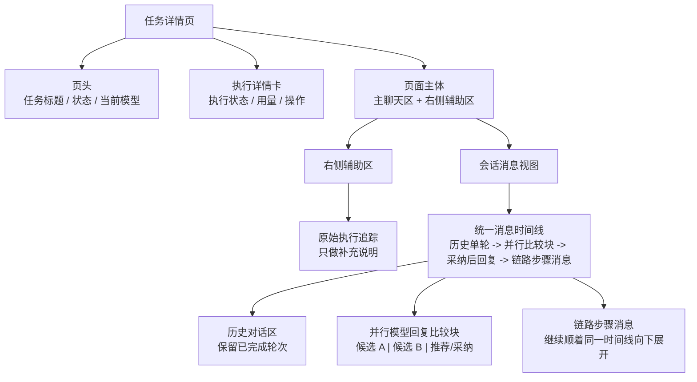
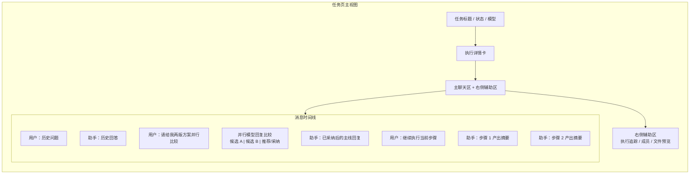
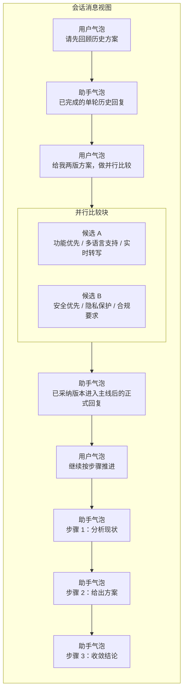
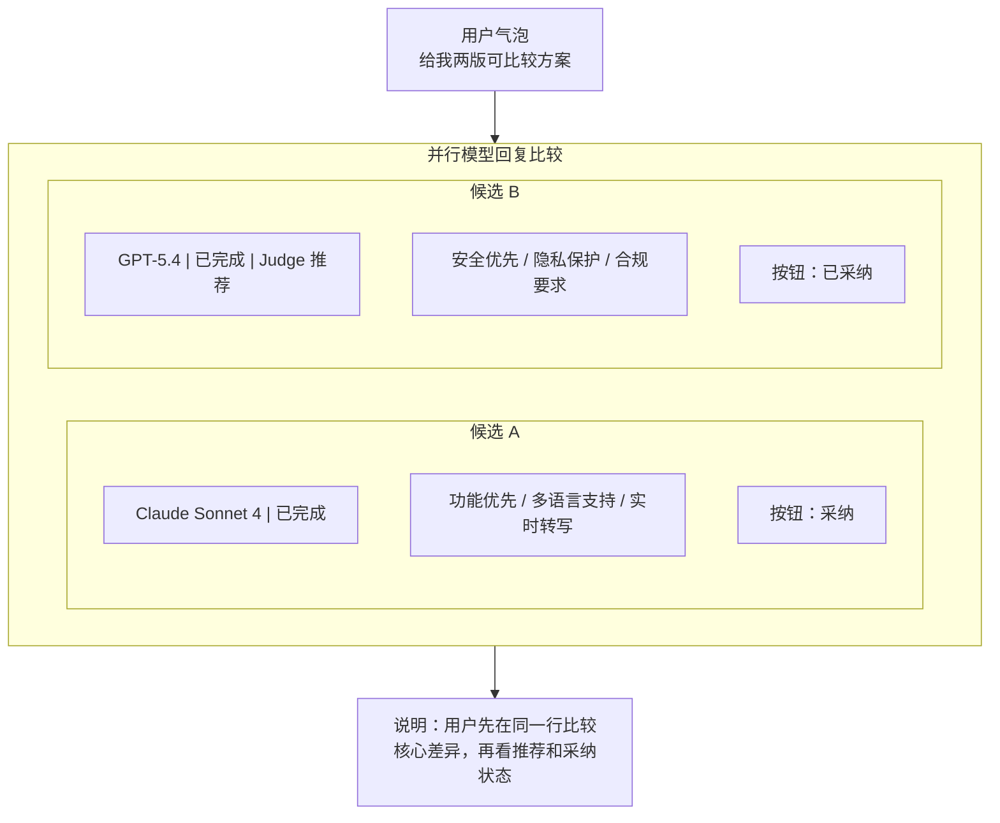

# 任务页会话消息视图展示说明

> 状态：Draft v1
> 日期：2026-03-29
> 作者：GitHub Copilot
> 关联文档：[archive/task-detail/historical-new-task-detail-page-plan.md](../archive/task-detail/historical-new-task-detail-page-plan.md)、[execution-trace-read-boundary-adr.md](../architecture/execution-trace-read-boundary-adr.md)、[task-session-message-minimal-contract.md](../task-domain/task-session-message-minimal-contract.md)

## 1. 文档目的

这份文档把任务页里“消息到底应该怎么显示”收敛成一份统一说明，重点回答四个问题：

1. 任务页整体上，聊天信息落在页面什么位置
2. 普通单步历史、并行待采纳、采纳后结果、链路执行消息，如何在同一个页面里共存
3. 用户在“会话消息视图”里真正看到的是什么页面效果
4. 当前实现里，哪些规则是页面必须稳定遵守的

这份文档面向产品、前端、BFF 和服务端统一口径，优先描述用户看到的落地效果，而不是内部数据表设计。

## 2. 适用范围

这份说明覆盖当前任务详情页的主阅读体验，尤其是“会话消息视图”这个主区域。

适用范围包括：

1. 普通单轮对话
2. 并行执行中的候选比较
3. 候选采纳后的主线回复
4. 顺序链路执行时的步骤消息
5. 当前页头、执行信息区、消息视图区、追踪区之间的关系

这份文档不展开：

1. 底层数据库 schema
2. realtime 事件协议细节
3. task session first 的完整改造方案
4. judge 打分或 artifact 详情页布局

## 3. 核心结论

先给统一结论，避免页面口径继续漂移。

1. 任务页的主阅读面始终是“一条统一的会话时间线”，不是多个彼此割裂的消息区块。
2. 普通历史消息按后端给出的顺序展示，前端不重排，只允许在尾部追加尚未持久化的流式 assistant 草稿。
3. 并行执行不是在主线里插入多条普通 assistant 气泡，而是在触发该轮用户消息后面内联一个“并行比较块”。
4. 并行比较块处于待采纳阶段时，普通 assistant 最终回复应隐藏，避免用户把“候选比较”和“已定稿回复”误认为是两轮独立结果。
5. 候选采纳后，主线重新回到普通会话阅读方式，胜出结果进入主线语义，未采纳候选不继续占据主聊天流。
6. 顺序链路执行不是单独开一个“链路专区”，而是把各步骤的提示和产出继续压平在同一条消息流里向下展开。
7. 原始执行追踪是辅助说明面，不负责定义主聊天顺序。

## 4. 页面整体布局

当前任务页的页面骨架应理解为：上方给任务状态和执行摘要，中间主区域以“会话消息视图”为主，执行追踪与成员信息落在右侧辅助区。

补充说明：下面图里的 TraceView 代表“补充阅读面”，用于强调它不负责主聊天排序。当前 TaskDetailV3 实现中，这个阅读面挂在右侧 Sidebar，而不是主区页签。

页面层面的阅读顺序应该是：

1. 先看任务当前状态和执行摘要
2. 再进入会话消息视图理解“这项任务已经对话到哪里”
3. 只有需要解释来源、阶段或底层事件时，才切到原始执行追踪

## 5. 会话消息视图的统一规则

### 5.1 顺序规则

会话消息视图的排序规则必须保持稳定：

1. 持久化消息顺序由后端决定
2. session messages 按 messageIndex 升序、createdAt 升序读取
3. timeline 相关展示按 sortAt 升序、createdAt 升序读取
4. 前端不允许因为本地推断去重排历史消息
5. 唯一允许的本地补位，是在尾部附加尚未持久化的 streaming assistant 草稿

### 5.2 角色规则

主聊天流中的角色口径如下：

1. user 显示为用户气泡
2. assistant 显示为助手气泡
3. top-level tool 消息可以显示为工具输出块
4. system 消息不进入主聊天流
5. 工具调用通常作为 assistant 气泡的附属结构展示，不默认拆成新的顶层聊天轮次

### 5.3 区块规则

消息视图里只允许出现三类主阅读单元：

1. 普通消息气泡
2. 并行比较块
3. 辅助说明块，例如工具输出或步骤说明

不应该在主消息流中再额外创造：

1. 独立的“分支区”
2. 独立的“链路专区”
3. 与主时间线平行的第二条消息流

### 5.4 当前聊天历史在代码里如何组成并显示

当前现网实现里，聊天历史不是组件直接拿一份 message 数组就原样渲染，而是经过三层收敛：

1. [useTaskMessageSnapshot.ts](../../control-plane/web-ui/src/composables/useTaskMessageSnapshot.ts) 先读取当前 task / session / phase 对应的 persisted baseline。
2. [useTaskMessageStore.ts](../../control-plane/web-ui/src/composables/useTaskMessageStore.ts) 再把 baseline、workflow 组、realtime patch、pending draft 合成为统一 conversation state。
3. [task-conversation-display.ts](../../control-plane/web-ui/src/lib/task-conversation-display.ts) 最终输出按顺序可渲染的 records，再交给 [ChatMessageList.vue](../../control-plane/web-ui/src/components/task-detail-shared/ChatMessageList.vue) 或阶段块视图显示。

当前页对“历史聊天怎么显示”的实际规则如下：

1. 主区若已有 phase blocks，就优先按阶段块显示；只有没有 phase blocks 时，才退回普通 [ChatMessageList.vue](../../control-plane/web-ui/src/components/task-detail-shared/ChatMessageList.vue)。
2. persisted baseline 的顺序以 snapshot 返回结果为准，前端只负责归一化与补位，不负责自行重排历史轮次。
3. workflow 上下文不会直接摊平成一串普通顶层消息，而是被收敛成 workflow group 后插入主时间线。
4. 并行候选不会展开成多条普通 assistant 顶层消息，而是以内联并行比较块出现在触发该轮 user 消息之后。
5. user 气泡优先显示用户实际输入的 userInputText，其次才是 finalSentText 或 text，目的是避免把系统包装后的完整发送内容整段回显给用户。
6. assistant 气泡的正文和思考过程分开展示：正文正常显示，thinkingText 收在可展开区域里，避免“思考镜像”直接污染最终回复。
7. tool call 默认作为 assistant 消息的附属结构显示，不拆成新的主轮次。

换句话说，当前历史聊天的显示目标不是“完整暴露底层事件”，而是“把 persisted 历史、workflow、并行比较、工具输出压成一条仍然可读的主时间线”。

### 5.5 用户输入后，页面如何显示

用户输入后的显示过程，当前实现是一个明确的三段式状态机：本地输入态 -> realtime 叠加态 -> persisted 收敛态。

#### 5.5.1 输入但尚未发送

1. [ChatComposer.vue](../../control-plane/web-ui/src/components/task-detail-shared/ChatComposer.vue) 里的 prompt 只是本地 textarea 状态。
2. 用户还没按发送前，这段文本不会进入聊天历史，也不会提前出现在主时间线。

#### 5.5.2 点击发送后的第一时间显示

1. 用户点击发送或按 Enter 后，会进入 [useTaskConversationActions.ts](../../control-plane/web-ui/src/composables/useTaskConversationActions.ts) 的 handleContinue / dispatchContinuePrompt。
2. 如果当前已有执行中回复，页面不会立刻发起第二次续跑，而是把这条输入放进队列，并在 composer 上方显示待发送队列。
3. 如果当前没有执行中回复，请求发送成功后，输入框立即清空，并调用 seedPendingAssistantDraft(nextSessionId)。
4. 这里有一个很重要的当前边界：前端不会先乐观插入一条 user 气泡；当前唯一的本地 optimistic 占位发生在 assistant 侧。

也就是说，用户发出输入后，页面最先立即反馈的是：

1. composer 被清空或队列板出现
2. 主聊天尾部出现一个本地 assistant draft，占位文本通常是“正在生成...”

#### 5.5.3 realtime 过程中怎么显示

1. [task-conversation-display.ts](../../control-plane/web-ui/src/lib/task-conversation-display.ts) 会把 pendingAssistantDraft 插成一条 authority=local、renderStatus=draft 的 assistant 占位消息。
2. 一旦 patch bus 收到 assistant-progress、assistant-delta 或 assistant-completed， [useTaskMessageStore.ts](../../control-plane/web-ui/src/composables/useTaskMessageStore.ts) 会把 conversation authority 切到 realtime，并用 liveAssistantState 覆盖当前 assistant 项。
3. 这时 [ChatMessageList.vue](../../control-plane/web-ui/src/components/task-detail-shared/ChatMessageList.vue) 会立即显示流式正文、思考内容或 tool calls；如果正文还没到，就先显示“正在生成...”或 streaming skeleton。
4. 如果 pending draft 已经可见，但实时 patch 迟迟没来，页面会把它视为需要 polling fallback 的信号，继续等 snapshot/refresh 追平。

#### 5.5.4 持久化后怎么收敛成历史

1. 当 task patch feed 收到 user-message、message-persisted 或 round-synced 这类事件后， [useTaskDetailCoreContext.ts](../../control-plane/web-ui/src/composables/useTaskDetailCoreContext.ts) 会把它们转交给 snapshot ownership 与消息状态机。
2. user-message 或后续 snapshot 回流后，用户那条输入才会真正进入 persisted 历史时间线。
3. 当 persisted revision 已经追平 ack revision，且 persisted assistant payload 已追上 realtime 内容后，displayConversationAuthority 才会从 realtime 回到 persisted。
4. 此时本地 pending draft 会被清掉，最终的 persisted user / assistant 消息接管聊天尾部，历史聊天正式成形。
5. 如果任务完成或失败，pending draft 也会自动清除，避免页面尾部残留“正在生成...”。

可以把当前实现理解成下面这条链：

1. 用户输入只先存在于 composer
2. 发送后先出现 assistant 占位
3. realtime patch 把占位替换成流式内容
4. persisted snapshot 最后把这轮对话固化进真正历史

## 6. 四种展示状态如何共存

为了让任务页在复杂执行模式下仍然可读，可以把主消息流理解成四种状态依次串接。

| 状态 | 在页面上的表现 | 用户主要感知 | 不应出现的误解 |
| --- | --- | --- | --- |
| 历史单步执行 | 标准 user / assistant 气泡 | 这是已经完成的正常轮次 | 不应被并行区吞掉 |
| 并行待采纳 | 触发该轮 user 气泡后面出现一个并行比较块 | 这一轮还在比候选，不是已经定稿 | 不应同时再出现一条普通最终 assistant 回复 |
| 并行已采纳 | 主线回到普通阅读方式，胜出结果成为本轮有效答复 | 任务已经选定一版进入主线 | 未采纳候选不应继续占据主聊天流 |
| 顺序链路执行 | 同一时间线中连续出现“步骤提示 + 步骤产出” | 任务在按步骤向前推进 | 不应被误解为另一个独立页面或独立子任务流 |

## 7. 页面效果总图

下面这张图用于说明同一个任务页里，各种消息状态在真实页面上的相对位置。

这张图强调两点：

1. 并行比较块是嵌在消息时间线里的“一个块”，不是平行于聊天区的另一个大模块
2. 顺序链路执行后的步骤消息仍然继续沿着同一条时间线向下走

## 8. 完整会话消息视图纵向稿

如果只看“会话消息视图”本身，可以把它理解成下面这样的纵向聊天稿。

这张图对应的是用户的阅读体验，而不是后台对象模型。用户感知到的是：

1. 先有历史轮次
2. 然后某一轮出现候选比较
3. 之后重新回到主线回复
4. 最后进入链路步骤推进

## 9. 并行比较块的页面效果

并行执行是当前最容易显示不清的部分。稳定口径应该是：

1. 并行结果优先做横向比较，而不是纵向堆很多大段正文
2. 每个候选卡片优先给出一行摘要，方便快速扫读差异
3. 推荐态、采纳态、可采纳动作，放在卡片尾部同一区域
4. 当前轮还未采纳时，只显示比较块，不再额外显示普通最终 assistant 气泡

下面这张图是推荐的单行比较版：

这张图对应的交互规则是：

1. 一眼先比摘要，不要求先读完两大段正文
2. Judge 推荐不是另开一块说明，而是放在候选卡片元信息区
3. 已采纳状态和采纳按钮属于同一操作区
4. 只有在用户需要展开细节时，才继续查看更完整正文或追踪信息

## 10. 采纳前与采纳后的差异

并行区最关键的不是“怎么画卡片”，而是采纳前后主消息流如何变化。

### 10.1 采纳前

页面应表现为：

1. 触发该轮的 user 气泡仍在
2. user 气泡后面直接跟一个并行比较块
3. 不显示普通 assistant 最终答复
4. 历史轮次继续保留在上方

### 10.2 采纳后

页面应表现为：

1. 当前轮的有效结果已经归入主线
2. 任务继续向后对话时，阅读方式回到普通消息流
3. 未采纳候选不再作为主线消息继续占位
4. 若需要回看比较，只应在对应轮次或附属详情里查看，不应持续塞满主聊天流

## 11. 顺序链路执行的展示方式

顺序链路执行要特别避免一种误解：看起来像系统突然切到了另一套界面。

正确方式是：

1. 用户依然在同一个会话消息视图里阅读
2. 每个步骤的提示和产出顺着当前时间线继续出现
3. 步骤信息可以带轻量标题，例如“步骤 1：分析现状”
4. 但它仍然表现为消息，不是第二套页面框架

因此，顺序链路在主聊天流里更像：

1. 一组连续的步骤型 assistant 气泡
2. 而不是“上面是聊天，下面再嵌一个流程编辑器”

## 12. 当前实现的锚点

下面这些文件决定了当前页面的消息展示口径，后续实现应继续对齐这份说明：

1. 页面壳层与任务详情主视图：[../control-plane/web-ui/src/pages/TaskDetailV3.vue](../../control-plane/web-ui/src/pages/TaskDetailV3.vue)
2. 主区显示入口：[../control-plane/web-ui/src/components/task-detail-v3/TaskDetailV3MainPane.vue](../../control-plane/web-ui/src/components/task-detail-v3/TaskDetailV3MainPane.vue)
3. 会话消息快照读取：[../control-plane/web-ui/src/composables/useTaskMessageSnapshot.ts](../../control-plane/web-ui/src/composables/useTaskMessageSnapshot.ts)
4. 主聊天 reducer 与流式草稿补位：[../control-plane/web-ui/src/composables/useTaskMessageStore.ts](../../control-plane/web-ui/src/composables/useTaskMessageStore.ts)
5. 输入发送、排队与 pending draft 触发：[../control-plane/web-ui/src/composables/useTaskConversationActions.ts](../../control-plane/web-ui/src/composables/useTaskConversationActions.ts)
6. 聊天显示状态机：[../control-plane/web-ui/src/lib/task-conversation-display.ts](../../control-plane/web-ui/src/lib/task-conversation-display.ts)
7. 消息标准化与角色归类：[../control-plane/web-ui/src/lib/message-normalize.ts](../../control-plane/web-ui/src/lib/message-normalize.ts)
8. 消息列表渲染：[../control-plane/web-ui/src/components/task-detail-shared/ChatMessageList.vue](../../control-plane/web-ui/src/components/task-detail-shared/ChatMessageList.vue)
9. 输入框与排队显示：[../control-plane/web-ui/src/components/task-detail-shared/ChatComposer.vue](../../control-plane/web-ui/src/components/task-detail-shared/ChatComposer.vue)

对实现口径最重要的几条约束是：

1. 历史消息顺序由后端决定，前端不重排
2. system 消息不进入主聊天流
3. 工具调用通常附着在 assistant 气泡内部，而不是拆成独立主轮次
4. 并行候选的 label 和 model 应优先以 task.strategy.parallelCandidates 和 candidateIndex 对齐
5. 并行比较块不能吞掉历史对话
6. 顺序链路的步骤顺序应优先从 session summaries 恢复，再用 session messages 补 prompt 和步骤文案

## 13. 页面评审时应使用的判断标准

评审任务页消息展示是否正确时，建议只看下面六条：

1. 用户能不能一眼看懂当前任务处于历史轮次、并行比较还是顺序步骤推进
2. 并行状态下，页面有没有错误地同时显示比较块和普通最终回复
3. 历史消息有没有因为并行区出现而被误隐藏
4. 顺序链路消息是不是仍然落在同一条主时间线里
5. 采纳动作之后，主线是不是恢复成普通阅读方式
6. 原始执行追踪是否保持“补充说明”而不是“接管主聊天排序”的角色

## 14. 一句话总结

任务页消息展示的目标，不是把所有底层对象都暴露给用户，而是把复杂执行模式压缩成一条仍然可读的会话时间线：

1. 历史单轮按普通聊天看
2. 并行执行在触发轮次后以内联比较块出现
3. 采纳后重新回到主线回复
4. 顺序链路继续沿同一时间线向下展开

只要这四件事稳定，任务页即使面对并行、采纳、链路推进，也仍然会像一个可理解的聊天页面，而不是一个不断切换语义的控制台。

## 15. Expected logical order 示例

下面这组顺序基于任务 `5b2b44d9-05b7-4f3d-a252-eb522ff0a7c5` 在 `/tasks/5b2b44d9-05b7-4f3d-a252-eb522ff0a7c5/v3` 的当前展示结果。

这份表只描述用户在“会话消息视图”里应看到的逻辑顺序，不展开底层 `step-start`、`step-finish`、tool-call 包装，也不把 `system` 消息算进主聊天流。

这里的 `workflow_group` 只是在说明“当前任务的一种可接受展示结果”，不是所有任务都必须拥有同样数量的 step。

通用约束应理解为：

1. `workflow_group` 的 step 数优先来自持久化事实。
2. 只有当读模型明确规定“把根 primary session 的首条 `Execution context` 单独提升为上下文 step”时，才额外出现类似“需求进入”的 context step。
3. 不能因为这个样例在某个版本里表现成 4 个 step，就把“固定 4 个 step”提升成通用 contract。

### 15.1 顶层消息顺序

Expected logical order:

| # | Type | Content |
| --- | --- | --- |
| 1 | user | /start-work 请先梳理需求和边界条件，再实现功能代码。同时补充必要测试，并说明使用方式和影响范围。 |
| 2 | workflow_group | 工作流消息块，位于首条 user 与首条主 assistant 之间；内部 step 数由持久化 workflow 事实决定。当前样例如果保留根 `Execution context` 的单独投影，则会显示为 4 个 step：需求进入 1 条、产品 Agent 2 条、架构师 Agent 2 条、安全 Agent 2 条。 |
| 3 | assistant | 需求澄清阶段的主回复，输出聊天软件的目标、场景、MVP、边界条件、验收标准、风险与下一步建议。 |
| 4 | user | 再给我几个边界条件 |
| 5 | assistant | 补充边界条件，覆盖密钥丢失、离线多设备冲突、大附件与低磁盘空间、权限撤销、速率限制等。 |
| 6 | user | 再扩展两个需求 |

### 15.2 workflow_group 内部顺序

Expected logical order:

如果当前读模型启用了根 `Execution context` 的单独投影，则当前样例会表现为下面这组内部顺序：

| # | Type | Content |
| --- | --- | --- |
| 1 | workflow | 需求进入：根 primary session 的 `Execution context` 被改写成“工作流消息”块的首条上下文，说明当前阶段、执行 Agent、执行模型与待完成阶段。 |
| 2 | user | 产品 Agent 的执行上下文，要求其在需求澄清阶段返回结构化 JSON 审查结果。 |
| 3 | assistant | 产品 Agent 最终结果：`needs-approval`，认为任务描述过宽，需要继续澄清功能范围、技术栈、性能要求与风险。 |
| 4 | user | 架构师 Agent 的执行上下文，要求其在需求澄清阶段返回结构化 JSON 审查结果。 |
| 5 | assistant | 架构师 Agent 最终结果：`notify-developer`，指出“macOS 聊天软件”诉求与当前 Opener-X 多 Agent 平台代码库存在明显架构错位。 |
| 6 | user | 安全 Agent 的执行上下文，要求其在需求澄清阶段返回结构化 JSON 审查结果。 |
| 7 | assistant | 安全 Agent 最终结果：`allow`，认为在需求澄清阶段风险较低，并给出认证、数据保护、测试与基础设施方面的安全观察。 |

补充约束：

1. 顶层第 2 行必须保持为单个 `workflow_group`，不能把内部 7 条消息直接摊平成 7 个顶层聊天轮次。
2. `workflow_group` 内部要按 step 展示；step 数与每个 step 的消息数优先来自持久化事实或明确写死的投影规则。当前样例若保留根 context step，则可表现为 `1 + 2 + 2 + 2`；若未启用该投影，则不应为了贴合样例而人工补成 4 个 step。
3. 第 3 行主 assistant 回复仍然要紧跟在 `workflow_group` 后面，不能被插回到产品/架构/安全 Agent step 之间。
