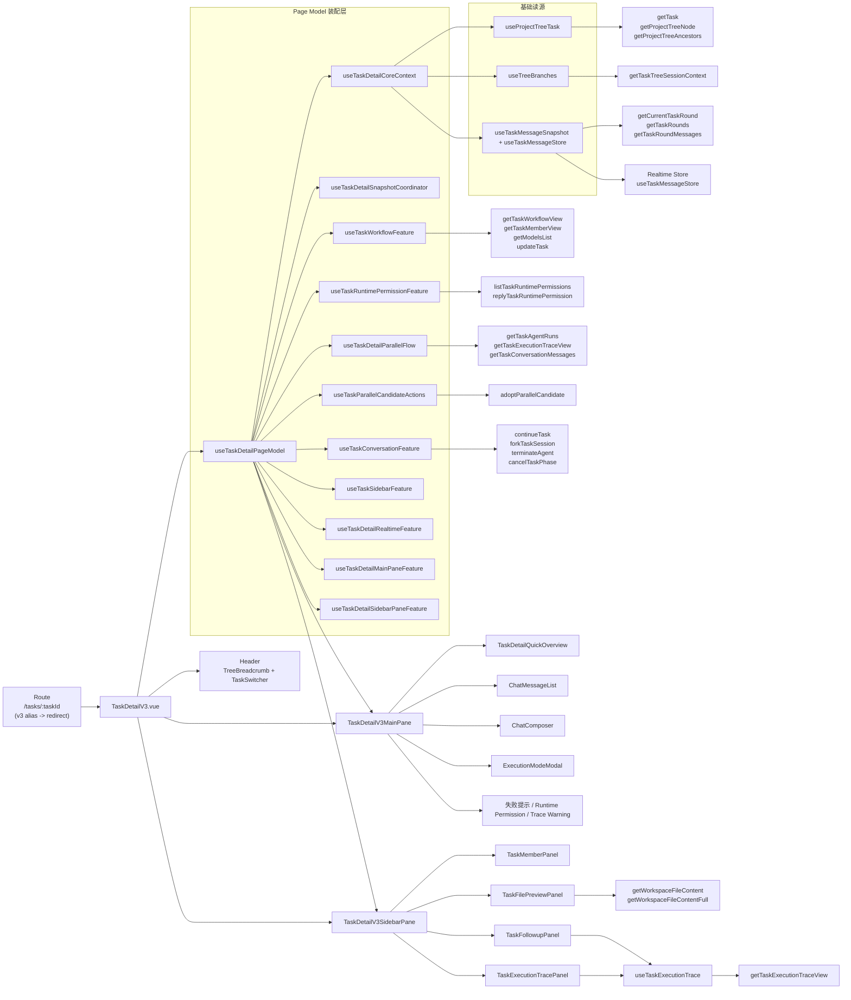
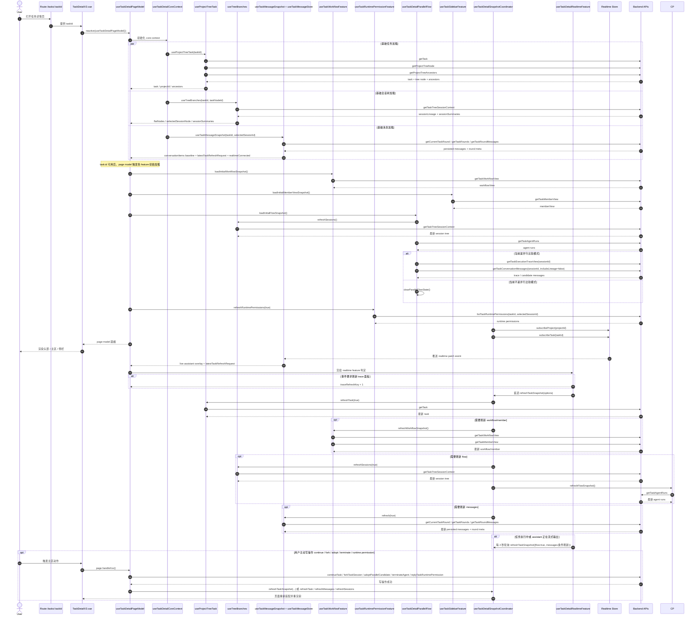

# TaskDetailV3 页面数据流与组件/API 映射

## 概览

`TaskDetailV3.vue` 当前已经被收敛成一个很薄的页面壳层：

- 页面本身只负责读取路由参数、拿到统一的 `page model`、渲染头部、主区和侧栏。
- 主区和侧栏都不再直接各自拼装全页状态，而是消费 `page model` 下的局部分区模型。
- 真正的数据装配入口是 `useTaskDetailPageModel()`。

当前主入口：

- `control-plane/web-ui/src/pages/TaskDetailV3.vue`
- `control-plane/web-ui/src/composables/useTaskDetailPageModel.ts`
- `control-plane/web-ui/src/composables/useTaskDetailPageSectionModels.ts`

## 当前页面怎么显示数据

### 1. 页面壳层

`TaskDetailV3.vue` 只做三件事：

1. 从主路由 `/tasks/:taskId` 里拿 `taskId`，`/tasks/:taskId/v3` 当前只保留兼容 redirect
2. 调 `useTaskDetailPageModel()` 得到统一的 `page`
3. 把 `page.layout`、`page.header`、`page.main`、`page.sidebar` 分别绑定到页面壳层和子组件

### 2. 基础读源

`useTaskDetailPageModel()` 先调用 `useTaskDetailCoreContext()` 作为基础读源聚合层。

`useTaskDetailCoreContext()` 再拆成三块：

- `useProjectTreeTask()`
  - 负责拿任务基本信息、当前 task 节点、breadcrumb ancestors
- `useTreeBranches()`
  - 负责拿 session tree、session summaries、当前选中 session 节点
- `useTaskMessageSnapshot()`
  - 负责拿主聊天区 persisted baseline
  - 负责 active round / active session 的 snapshot revision
- `useTaskMessageStore()`
  - 负责 realtime patch、pending assistant draft 与最终 conversation items 收敛

### 3. 页面装配层

在 `useTaskDetailPageModel()` 中，基础读源会继续被这些 feature / coordinator 消费：

- `useTaskDetailSnapshotCoordinator()`
  - 负责 `messages` / `flow` / `workflow` 三条 refresh target 的 fan-out 与 silent refresh
- `useTaskConversationFeature()`
  - 负责主聊天展示态、round/context、continue / fork / terminate / queued continuation 动作
- `useTaskDetailParallelFlow()`
  - 负责并行候选、parallel run、candidate message/trace 刷新，以及把并行块插回主聊天列表
- `useTaskParallelCandidateActions()`
  - 负责 adopt candidate；compare 派生的 stop/terminate 状态由 page model 基于当前 parallel run 直接推导
- `useTaskWorkflowFeature()`
  - 负责 workflow snapshot、steps 派生、execution mode modal / model list / save 动作
- `useTaskRuntimePermissionFeature()`
  - 负责 runtime permissions 读取与审批回复动作
- `useTaskSidebarFeature()`
  - 负责 sidebar collapse、文件预览、member/trace panel 的本地 UI 边界，并直接吸收 member snapshot 读取
- `useTaskDetailRealtimeFeature()`
  - 负责 polling state 与 realtime subscription / refresh dispatch 的桥接
- `useTaskDetailMainPaneFeature()`
  - 负责把 conversation / compare / workflow / runtime permission / sidebar 输出装成主区模型
- `useTaskDetailSidebarPaneFeature()`
  - 负责把 sidebar panel 输出装成侧栏模型，并承接侧栏专属展示判定

在这些协调层之上，`useTaskDetailPageModel()` 不再平铺返回几十个字段，而是再收成 4 个分区模型：

- `layout`
  - 页面壳层自身需要的 loading / error
- `header`
  - 头部展示与 task switch
- `main`
  - 主区展示数据与动作
- `sidebar`
  - 侧栏展示数据与动作

### 4. 主区和侧栏怎么拿数据

主区和侧栏都不直接访问路由，也不直接拼装跨域状态：

- `TaskDetailV3MainPane.vue`
  - 直接消费 `page.main` 中的主区展示数据和动作方法
- `TaskDetailV3SidebarPane.vue`
  - 直接消费 `page.sidebar` 中的侧栏展示数据和动作方法

只有侧栏里的某些面板会在自身内部补充独立 API：

- `TaskExecutionTracePanel.vue`
  - 内部使用 `useTaskExecutionTrace()`
- `TaskFollowupPanel.vue`
  - 内部同样使用 `useTaskExecutionTrace()`
- `TaskFilePreviewPanel.vue`
  - 内部独立读取文件内容 API

## 当前用了哪些组件

### 页面壳层组件

- `TreeBreadcrumb`
- `TaskSwitcher`
- `TaskDetailV3MainPane`
- `TaskDetailV3SidebarPane`

### 主区组件

- `TaskDetailQuickOverview`
- `ChatMessageList`
- `ChatComposer`
- `ExecutionModeModal`

主区中还有直接模板块：

- 任务失败告警
- 运行时审批卡片
- trace warning

### 侧栏组件

- `TaskFilePreviewPanel`
- `TaskMemberPanel`
- `TaskFollowupPanel`
- `TaskExecutionTracePanel`

## 当前用了哪些后端 API

### 基础读源 API

来自 `useProjectTreeTask()`：

- `getTask`
- `getProjectTreeNode`
- `getProjectTreeAncestors`

来自 `useTreeBranches()`：

- `getTaskTreeSessionContext`

来自 `useTaskMessageSnapshot()` / `useTaskMessageStore()`：

- `getCurrentTaskRound`
- `getTaskRounds`
- `getTaskRoundMessages`

### 页面装配补充 API

来自 `useTaskDetailParallelFlow()` / `useTaskParallelCandidateActions()`：

- `getTaskAgentRuns`
- `getTaskExecutionTraceView`
- `getTaskConversationMessages`
- `adoptParallelCandidate`

来自 `useTaskWorkflowFeature()`：

- `getTaskWorkflowView`
- `getModelsList`
- `updateTask`

来自 `useTaskSidebarFeature()` / `useTaskMemberViewFeature()`：

- `getTaskMemberView`

workflow 纯显示策略：

- `task-workflow-display-policy.ts`
- 负责 stage key -> label fallback，以及 workflow/stage status -> tag label/color 映射
- 供 `useTaskWorkflowSteps()`、`TaskWorkflowStageOverviewCard.vue`、`TaskWorkbenchMemberStrip.vue`、`TaskRoleWorkflowPanel.vue` 复用
- 也被 `ManagementOperationsCenter.vue`、`TaskOperatingConsole.vue`、`ProjectOrchestration.vue` 等 workflow 相关页面用于 stage/status 展示，避免页面层重新编码状态标签

来自 `useTaskRuntimePermissionFeature()`：

- `listTaskRuntimePermissions`
- `replyTaskRuntimePermission`

来自 `useTaskConversationFeature()`：

- `continueTask`
- `forkTaskSession`
- `terminateAgent`
- `cancelTaskPhase`

### 侧栏面板自身 API

来自 `useTaskExecutionTrace()`：

- `getTaskExecutionTraceView`

来自 `TaskFilePreviewPanel.vue`：

- `getWorkspaceFileContent`
- `getWorkspaceFileContentFull`

### 实时数据来源

除 HTTP API 外，这页还依赖实时事件：

- `realtimeStore.subscribeProject(projectId)`
- `realtimeStore.subscribeTask(taskId)`
- `useTaskMessageStore()` 负责把 realtime patch 变成 live assistant overlay 和 refresh 请求

## 映射图

## 按时间顺序的加载 / 刷新时序图

## 面向重构的组件边界与可继续收口点清单

### 当前边界结论

2026-04-12 当前状态：

- 已将 session-tree fallback、run/session 选择与可见 compare runs 的纯派生进一步收口到 `task-detail-parallel-runtime.ts` + `task-detail-parallel-read-model.ts`
- 已将 pending-adoption / adopted-session 选择收口到 `task-detail-parallel-adoption.ts`
- 已将候选消息源、tool output 折叠下沉到 `task-detail-parallel-candidate-source.ts`
- 已将 tool output 压缩继续下沉到 `task-detail-parallel-tool-condense.ts`
- 已将 trace/session fallback 的最终来源决策下沉到 `task-detail-parallel-source-policy.ts`
- 已将并行卡片构造下沉到 `task-detail-parallel-card-builder.ts`
- 已将并行对话插入下沉到 `task-detail-parallel-conversation-projector.ts`
- `useTaskDetailParallelFlow.ts` 已进一步收成 orchestration-only，主要保留 state、watch、candidate refresh 与刷新编排
- `useTaskDetailPageModel.ts` 已完成第一阶段拆分：改为返回 `layout/header/main/sidebar` 分区模型，主区和侧栏不再接收整个 `page`
- 旧 `useTaskDetailActionCoordinator.ts` / `useTaskDetailViewStateCoordinator.ts` 已从代码树移除，相关行为断言已迁回当前 feature tests
- 主区与侧栏的 section-level 装配已下沉到 `useTaskDetailMainPaneFeature.ts` / `useTaskDetailSidebarPaneFeature.ts`

当前 `TaskDetailV3.vue` 已经基本收成页面壳层，继续直接拆页面本身的收益已经不高。

真正还偏厚的边界，现阶段主要在：

1. `task-detail-parallel-runtime.ts`
2. `task-detail-parallel-read-model.ts`
3. `useTaskDetailPageModel.ts`
4. `TaskDetailV3MainPane.vue`
5. `useTaskConversationFeature.ts` / `useTaskWorkflowFeature.ts` 背后的底层 orchestration

按当前体量看，真正偏厚的实现已经集中到 parallel runtime/read-model cluster、page model、main pane 模板，以及 conversation/workflow 背后的读写 orchestration，而不是旧 compat coordinator 或已经删除的薄 facade。

### 高优先级：最值得继续收的点

#### 1. 继续压缩 `useTaskDetailPageModel.ts`

问题：

- `page model` 的“平铺返回”问题已经解决，但 orchestration 仍然集中在一个总装配器里。

根因：

- 目前只是把返回结果收成了 `layout/header/main/sidebar`，还没有继续下沉 root assembly 本身的 wiring 复杂度。

建议收口方向：

1. 保留当前 `layout/header/main/sidebar` 分区
2. 继续把 page model 内部的 wiring 按只读装配 / 写动作装配 / realtime 装配分层
3. 只让 `useTaskDetailPageModel()` 保留最终 assemble 责任

或者：

- 保留 `useTaskDetailPageModel()` 作为根装配器，但把 section builders 再往前推成更清晰的 read-model / action-model / shell-model 分层。

判断标准：

- 页面壳层、主区、侧栏都不再依赖整个 `page`
- `useTaskDetailPageModel.ts` 主要只剩组合与返回，不再堆满字段映射

#### 2. 继续压缩 parallel runtime / read-model cluster

问题：

- 并行候选的展示投影已经拆完，但 runtime/read-model 侧的纯派生仍集中在少数大文件里。
- 当前最厚的逻辑集中在 run/session 可见性、fallback run 选择、selected session 收敛与 phase 上下文推导。

根因：

- 对话投影已拆开，但 parallel 领域里的运行态选择与读模型推导仍聚在一起，没有进一步分成更窄的 projector / selector 边界。

建议收口方向：

1. `task-detail-parallel-runtime.ts`
2. `task-detail-parallel-read-model.ts`
3. `task-detail-parallel-adoption.ts`

判断标准：

- selected session / visible runs / current run 选择规则可以独立测试
- page model 不再直接感知 parallel 领域里的多步选择细节

#### 3. 拆 `TaskDetailV3MainPane.vue`

问题：

- 主区模板现在仍然比较厚，包含 overview、失败告警、runtime permission、trace warning、聊天列表、composer、modal。

根因：

- 主区虽然已经从页面中拆出，但它本身仍承担多个视觉区块。

建议收口方向：

1. `TaskDetailV3StatusBlock`
2. `TaskDetailV3RuntimePermissionBlock`
3. `TaskDetailV3ConversationBlock`
4. `TaskDetailV3ComposerBlock`

判断标准：

- 主区组件只保留主布局顺序
- 视觉区块各自独立，可单独替换或测试

### 中优先级：可以继续做，但收益次于上面三项

#### 4. 继续压缩当前 feature 写路径

问题：

- continue / fork / terminate、runtime permission reply、candidate adopt 虽然已经从 compat 层退出，但当前仍分别挂在 conversation / runtime permission / compare 三条 feature 上，跨 feature 的写路径协同还可以更明确。

根因：

- 旧 coordinator 已删除，但“会话动作”“执行控制动作”“审批动作”“compare adopt” 目前还是按 feature 分散持有，尚未进一步抽成更细的 application-service 层。

建议收口方向：

1. 保持 `useTaskConversationActions()` / `useTaskRuntimePermissionActions()` / `useTaskParallelCandidateActions()` 作为 domain action entry；compare 侧由 page model 直接组合 `useTaskDetailParallelFlow()` 与 `useTaskParallelCandidateActions()`，不再重新引入 page-era coordinator 或新的 compare wrapper。
2. 如果后续跨 feature 写路径继续增多，再考虑补一层更明确的 application-service facade，而不是回退到“大 coordinator”。
3. 新增动作时优先把断言落在各自 feature tests，而不是再给页面层造兼容入口。

适用前提：

- 如果后续还会继续扩展动作种类，这一步收益会很明显。

#### 5. 把 Header 也收成子组件

问题：

- 当前页面壳层还保留 header 模板。

根因：

- breadcrumb、标题、状态标签、task switcher、sidebar toggle 仍在页面里并列。

建议收口方向：

- 新建 `TaskDetailV3Header.vue`

适用前提：

- 如果目标是让 `TaskDetailV3.vue` 变成“纯 page shell”，这一步是自然终点。

### 低优先级：能做，但现在不一定最值

#### 6. 侧栏面板继续合并/拆分

问题：

- 侧栏现在已经比较薄。

根因：

- 主要复杂度不在 sidebar pane，而在 trace/followup/file-preview 自己内部。

建议：

- 除非准备重做侧栏交互，否则不建议优先继续拆 `TaskDetailV3SidebarPane.vue`。

#### 7. 把更多异步组件改同步或进一步 lazy 策略化

问题：

- 布局块如果再包一层 async，会对测试稳定性有副作用。

根因：

- 仅负责布局的组件不适合作为额外的 async 边界。

建议：

- 页面布局层继续保持同步导入
- 真正重内容面板再按需要保留异步加载

### 建议的下一轮顺序

如果继续做，推荐顺序是：

1. 先继续压缩 `useTaskDetailPageModel.ts` 的 orchestration 层
2. 再继续压缩 parallel runtime / read-model cluster
3. 然后再拆 `TaskDetailV3MainPane.vue`
4. 最后视需求决定是否抽 `TaskDetailV3Header.vue`

### 什么时候可以停

到下面这个状态时，就可以认为 `TaskDetailV3` 的页面级收口基本完成：

- `TaskDetailV3.vue` 只保留 page shell + header/main/sidebar 三块布局
- `useTaskDetailPageModel.ts` 不再是巨型平铺对象，而且 root assembly 只保留少量组合逻辑
- `useTaskDetailParallelFlow.ts` 不再是单文件超大协调层
- 主区模板被拆成几个有明确边界的视觉块
