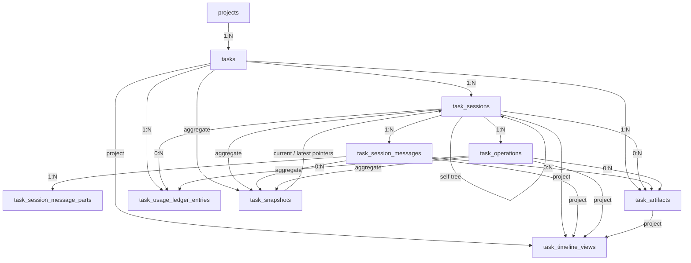
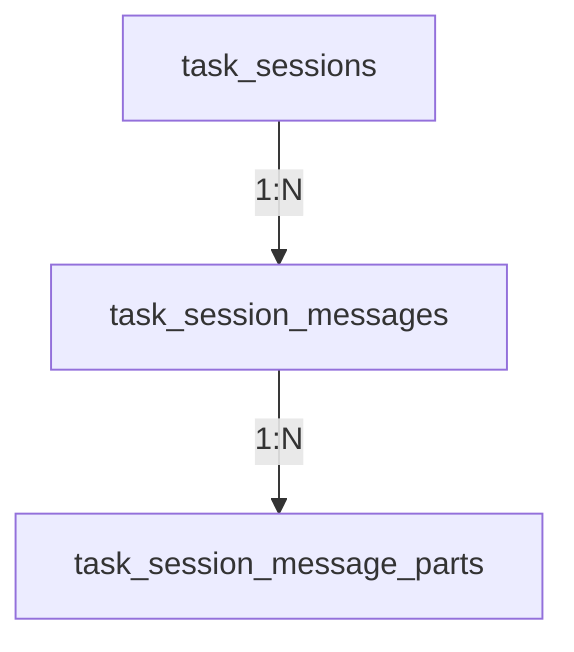

# Task → Sessions 存储重构方案（核心事实表 + 支撑表 + 可重建读模型 DDL 草案）

> 状态：Draft v2  
> 日期：2026-03-28  
> 作者：GitHub Copilot
> 补充建议：当前仓库的目录级和文件级动作清单，以及对现有 `task_sessions` / `task_messages` / `task_operations` 等表的收敛建议，见 [task-runtime-rewrite-operation-checklist.md](task-runtime-rewrite-operation-checklist.md)。
>
> 口径更新：当前实现已将新模型中的低层调用事实正式收口到 `task_operations`。本文中历史性的 `session_operations` 表述，除非明确讨论 legacy backfill / 旧迁移兼容，否则都应按 `task_operations` 理解。
>
> 历史口径说明（2026-04-05）：本文仍以删除前的 `agent_runs` 现状作为重构出发点，但当前 schema 已删除 `agent_runs` 物理表。阅读本文时，凡涉及“替代当前 `agent_runs`”的表述，都应理解为历史迁移背景；现行兼容 `agentRunId` 语义已由 canonical task-domain 表投影承接。

## 1. 文档目的

这份文档只回答一件事：

在确认采用 `task → sessions` 模型之后，核心 domain 应收敛为 `tasks`、`task_sessions`、`task_session_messages`、`task_session_message_parts`、`task_operations` 这五张核心事实表，`task_artifacts`、`task_usage_ledger_entries` 这两张支撑事实表，以及 `task_snapshots`、`task_timeline_views` 这两张可重建读模型，应该如何重新设计。

本文中的 `task`、`session` 明确指向 **用户手动操作域**：

1. `task` 是用户可见、可手动处理的工作项
2. `session` 是用户在某个 task 下发起的一次具体执行分支

而 `workflow` 在本文中被重新界定为 **静态规则域**：

1. 它负责定义模板、阶段规则、触发条件、审批 / 阻断规则和自动派生规则
2. 它通过 task 生命周期事件去创建、影响或派生 task
3. 它不是 `task / session` 主模型的一部分
4. 它自身不应被建模成“项目当前走到了哪一步”的项目层全局进度

本文不覆盖以下内容：

1. 迁移步骤、双写切换和回滚策略
2. BFF / 前端接口 contract 的改造细节
3. `workflow_templates`、`workflow_template_stages` 这类 workflow 规则配置的重构
4. 现有 `task_workflow_runs`、`task_stage_runs` 这类既有 workflow 流程实现 / 兼容层的处理或退役策略

本文输出的是 **PostgreSQL DDL 草案**，目标是作为后续 schema 评审和直接重建实现的基线。

## 2. 结论摘要

新的主模型收敛为五张核心事实表 + 两张支撑事实表 + 两张可重建读模型：

1. `tasks`：任务聚合根事实表，表示用户可见的业务工作项
2. `task_sessions`：唯一执行事实；一个 task 由多个 session 完成
3. `task_session_messages`：session 下的消息流事实表
4. `task_session_message_parts`：消息结构化片段事实表
5. `task_operations`：session 下的低层执行事实表，对应替代历史上的 `agent_runs` 兼容层
6. `task_artifacts`：task / session / message / operation 产出的正式输出事实表
7. `task_usage_ledger_entries`：成本、配额、核算使用的 append-only usage ledger
8. `task_snapshots`：任务级可重建读模型，不属于事实主存储
9. `task_timeline_views`：时间线可重建读模型，用于高频 timeline 拉取

此前评估为“强烈建议”的三类支撑能力，本版全部提升为正式目标 schema：

1. `task_timeline_views`
2. `task_artifacts`
3. `task_usage_ledger_entries`

以下旧表不再属于主模型：

1. `task_runs`
2. `task_run_nodes`
3. `task_run_edges`
4. `task_domain_events`
5. `code_changes` / `file_changes`
6. `runtime_usage_ledgers`

并行、顺序、judge、resume 等语义全部回收到 `task_sessions` 层表达；timeline 只支持从事实表推导的 state-derived timeline，不支持完整事件回放；需要长期引用的产出物统一沉到 `task_artifacts`，成本与配额核算统一沉到 `task_usage_ledger_entries`。

需要特别强调的是：`workflow` 不纳入上面这九张表的主模型。

在这份文档里：

1. `workflow` 是静态规则域，负责模板、阶段规则和 task 事件触发规则
2. `task / session` 是用户手动操作域，负责承载用户真正处理的工作项与执行事实
3. workflow 会基于 task 事件去创建、阻断、审批、派生或关联 task，但不会替代 `task` 或 `session` 本身
4. 项目不会存在单一的“workflow 当前阶段”；真正有业务意义的是“某个 task 属于哪一类阶段 / 规则上下文”

## 3. 命名决策

### 3.1 为什么使用 `task_sessions`

本次方案明确采用 `task → sessions` 模型，因此 session 是 task 下的一等事实，而不是会话兼容层或某个 run 的附属物。

这里直接使用 `task_sessions`，而不是 `execution_sessions`，原因是：

1. 它最直接表达“一个 task 由多个 session 完成”
2. 它避免把 session 再包一层“execution”命名，造成语义重复
3. 它比当前的 `conversation_sessions` 更符合主模型定位

说明：仓库历史上曾存在另一套旧 `task_sessions` 语义。但本方案按“直接重建”执行，不再为旧模型保留命名兼容层；实现时可以直接以这套表结构作为新的主实现。

### 3.2 为什么不用 `session_executions`

不采用 `session_executions`，改用 `task_operations`，原因如下：

1. 在新模型里，session 自身已经是最小执行单元，`session_executions` 容易被误解为“session 下面又套了一层 session 级执行”
2. 这张表记录的是 session 内发生过哪些低层执行动作，例如 executor 调用、judge 调用、hook 调用、resume 调用，本质更接近 operation log
3. 它避免继续使用 `agent_runs` 这种会与产品层 Agent 概念冲突的命名

## 4. 关系模型



### 4.1 Project、Task、Session 三层语义

这一层边界在本方案里必须固定为：

1. `project`：上层业务容器
2. `task`：用户可见的业务工作项
3. `session`：这个工作项下面的一次具体执行分支

三者分别回答不同问题：

1. `project` 回答“这项工作属于哪个项目 / 工作空间 / 组织上下文”
2. `task` 回答“我要完成什么业务目标”
3. `session` 回答“为了完成这个目标，这一次具体怎么做”

因此，`task` 的意义不是“第一条 session”，而是“多个 session 的稳定业务锚点”。

`task` 之所以仍然需要独立存在，是因为它承担的是 session 无法替代的业务职责：

1. 它是用户在列表、搜索、归档、权限、统计里看到的稳定对象
2. 它可以在还没有任何 session 之前就存在，例如 `draft`
3. 它允许同一个业务目标经历多次执行尝试，而不丢失对象身份
4. 它承载业务生命周期，例如 `draft / active / done / archived`
5. 它把多条 session 分支归并到同一个业务目标下面
6. 它可以保留任务级分类、阶段归属与最终交付结论，例如 `category`、`stage_key`、`final_commit_sha`、`final_branch_name`

而 `task_sessions` 只负责执行层语义：

1. root / primary session 是某个 task 下面创建出来的第一条执行分支
2. candidate / judge / sequential_step / resume session 都是同一个 task 下面的后续执行事实
3. session 可以失败、取消、恢复、分叉，但 task 仍然是同一个 task

所以结论必须写死：

1. `task` 不是第一个 session
2. 第一个 session 只是 `task` 下面的 root / primary session
3. 只要保留 `task` 这一层，就必须把它当成业务工作项，而不是执行记录

如果未来产品真的不再需要“业务工作项”这一层，那正确做法是直接收敛为 `project -> sessions`，而不是把 `task` 伪装成第一个 `session`。

### 4.2 Workflow 与 Task / Session 的边界

在这份方案里，必须把 `workflow` 和 `task / session` 明确拆开：

1. `workflow`：静态规则域，回答“系统在什么条件下应如何影响 task”
2. `task`：用户手动操作域里的工作项，回答“用户现在要处理什么工作”
3. `session`：用户手动操作域里的执行分支，回答“用户在这个 task 里这次具体怎么做”

如果把 `workflow` 理解为现实世界里一家公司的工作流程，那么更准确的关系不是“task 创造 workflow”，也不是“workflow 取代 task”，而是“workflow 预先定义组织规则，task 在这些规则或人工操作下被创建和推进，task 的生命周期变化再反向触发 workflow 规则继续评估”。换句话说，workflow 回答的是“这类事情在组织里应如何流转”，task 回答的是“这次具体要处理哪件事”，session 回答的是“为了处理这件事，这一次具体如何执行”。

在建模上，这意味着 workflow 只负责定义创建条件、流转顺序、审批 / 阻断规则、派生规则和收尾动作；task 仍然是独立的业务事实对象，可以由人工直接创建，也可以由 workflow 在命中规则时派生创建；而 task 的 created / running / completed / failed 等生命周期事件，又会作为 workflow 的触发入口，驱动后续 task、治理动作或执行策略的变化。

因此它们的关系应理解为：

1. workflow 可以在 task created / running / completed / failed 等生命周期事件上触发规则
2. workflow 可以根据规则自动创建新 task、阻断 task、要求审批或派生后续 task
3. task 的生命周期变化会反向触发 workflow 规则继续评估
4. 但 task 一旦被创建出来，仍然是 task；session 一旦被创建出来，仍然是 session

也就是说，workflow 是 **规则与触发器集合**，不是 task 或 session 的替代物。

对这份文档来说，这个边界的直接含义是：

1. 本文只重构 task / session 手动操作域
2. workflow 只需要稳定的模板 / 规则定义，不需要在目标模型里再额外依赖一套独立的流程推进实现
3. 如果 task 上出现 `stage_key` 之类字段，或 session / operation 上出现 `workflow_spawn`、`stage_key` 之类上下文字段，它们只承担桥接作用，而不是把 workflow 运行态整体并入主模型
4. 是否保留当前 `task_workflow_runs`、`task_stage_runs`，应视为现有实现兼容问题，而不是目标主模型的一部分

### 4.3 Task 生命周期事件与 Workflow 规则触发

按当前澄清，workflow 不应被理解为由 task 生成出来、再独立向前推进的一条 runtime 状态机实例，而应被理解为“预先定义好的规则集合，在 task 生命周期事件上被触发并执行评估”。

也就是说，这里的主语始终是 task：先有 task 这个业务事实对象，再有 task 在 created / running / completed / failed 上发生的生命周期变化，workflow 只是针对这些变化进行命中判断与动作决策。系统不需要把 workflow 额外建模成一条持续运行的主事实，更不应把“workflow 当前走到哪一步”当成 task / session 主模型的核心问题。

因此，workflow 与 task 的交互不应再表述为：

1. workflow 自身从某个阶段迁移到另一个阶段
2. 项目当前整体处于 workflow 的哪一步

而应改成：

1. 某个 task 在生命周期上发生了事件
2. workflow 规则监听到这个事件
3. workflow 规则决定是否创建后续 task、阻断当前 task、要求审批、追加 hook 或写入治理动作

本方案建议把 workflow 规则触发点正式收敛为以下四类 task 生命周期事件：

1. `task.created`
2. `task.running`
3. `task.completed`
4. `task.failed`

这四类事件是 **规则触发语义**，不是要求额外新增一套 append-only 事件表；它们可以由 service 在 task / session 写入路径上直接判定并触发规则执行。

#### A. `task.created`

含义：task 业务对象第一次被创建完成。

建议触发时机：

1. `tasks` 行写入成功之后
2. task 已经拿到稳定 `task_id`
3. 但还未要求必须存在任何 session

典型用途：

1. 根据项目、分类、来源或模板规则，给 task 补充默认执行策略
2. 给 task 注入默认 hook / gate / approval 策略快照
3. 自动创建后续依赖 task，或建立 task 之间的派生 / 阻塞关系
4. 写入 task 来源元数据，例如由哪条 workflow 规则触发生成

建议幂等键：

1. `task_id + created`

#### B. `task.running`

含义：task 进入一次新的活跃执行窗口。

这里的 running 不要求 `tasks` 主表存在 `running` 状态列；它更适合作为一条派生触发语义，从当前执行事实中判定。

建议触发时机：

1. 某个新的 primary / root session 被创建，并进入 `execution_status = running`
2. 或 `task_snapshots.current_execution_status` 从空闲态切换到 `running`
3. 通常应按一次新的执行批次触发，而不是每条 message 都触发一次

典型用途：

1. 在执行开始前挂载 workflow 提供的 pre-execution hook
2. 根据 task 当前阶段或来源规则切换执行模板、模型或治理策略
3. 触发执行前审批 / 风险检查 / 预算检查
4. 标记某个 task 已真正开始被处理，而不是停留在 draft

建议幂等键：

1. `task_id + coordination_key + running`

#### C. `task.completed`

含义：task 在业务上被判定为完成闭环。

建议触发时机：

1. `tasks.lifecycle_status` 被写成 `done`
2. 或任务终态被 finalize 为成功完成，并产出了正式摘要 / artifact

典型用途：

1. 根据规则自动创建下一阶段 task
2. 把当前 task 的摘要、artifact、交付物注入到后续 task 的初始上下文
3. 将当前 task 标记为上游已完成，从而解除下游 task 的阻塞
4. 触发通知、汇总、审计或治理动作

建议幂等键：

1. `task_id + completed`

#### D. `task.failed`

含义：task 当前一次执行尝试失败，且没有在同一写路径里直接被新的重试执行覆盖。

这里的 failed 不要求 `tasks.lifecycle_status` 出现 `failed`；它可以来自执行事实层的终态判定。

建议触发时机：

1. 当前活跃 session / 当前执行批次终止为 `failed` 或 `cancelled`
2. `task_snapshots.current_execution_status` 被聚合为 `failed` 或 `cancelled`
3. 任务没有在同一事务或同一写入口中立即切到新的 running 批次

典型用途：

1. 触发失败后的补救 task 或人工介入 task
2. 根据失败原因要求审批、升级、降级模型或切换策略
3. 触发 post-failure hook、通知、审计或回滚动作
4. 将 task 重新放回待处理池，等待人工继续推进

建议幂等键：

1. `task_id + terminal_session_id + failed`

#### E. 建议的实现边界

为了避免重新把 workflow 建模成一条需要单独推进和持久化的主线，本方案建议把这些触发点实现为“规则评估入口”，而不是实现为新的 workflow 主事实表。

推荐边界如下：

1. task / session 事实仍然落在本文定义的主模型里
2. workflow 只保留模板、规则、触发条件和动作定义
3. 规则引擎在 `task.created`、`task.running`、`task.completed`、`task.failed` 四个入口上评估是否命中
4. 命中后的结果，回写为 task 关系、task 元数据、hook 策略、approval 动作、后续 task 创建动作或治理 artifact
5. 不要求为 workflow 额外维护“当前运行到第几步”的全局 runtime 状态

一句话总结就是：

1. workflow 先定义规则
2. task 承载业务事实
3. task 生命周期事件触发 workflow 规则评估
4. workflow 评估结果再影响 task 的创建、阻断、派生与治理

### 4.4 `stage_key` 的保留决策

这份方案建议：**保留 `stage_key`，但把它定义为 task 级字段，不再把它作为 session 级字段。**

它的定位必须进一步写清楚：`stage_key` 只表示“这个 task 被放在什么阶段性规则上下文里”，不表示 workflow 自身当前运行到了哪一步，也不表示某条 session 正在执行 workflow 的哪一环。

原因很直接：

1. 按当前澄清，阶段归属是 task 的业务语义，而不是 session 的执行语义
2. 同一个 task 可以有多条 session，但它们通常仍属于同一个阶段上下文
3. 如果把 `stage_key` 放在 session 上，会让“阶段”错误地看起来像一次执行批次的属性
4. workflow 规则真正关心的是“这个 task 属于哪个阶段上下文”，而不是“这条 session 属于哪个阶段上下文”

因此本方案的推荐口径是：

1. `tasks.stage_key`：正式字段，表示该 task 的阶段归属 / workflow 规则上下文
2. `task_sessions`：不再保留 `stage_key` 列
3. `task_operations.summary_json.stage_key`：如有需要，只允许作为从 `tasks.stage_key` 派生出来的复制上下文字段，用于审计、日志、hook / judge 决策记录

这意味着 `stage_key` 与 task 生命周期触发模型的配合应固定为：

1. `task.created`：workflow 规则可以在创建 task 时写入 `tasks.stage_key`
2. `task.running`：规则评估入口只读取 `tasks.stage_key` 来决定应挂哪些规则 / hook，不应在 running 过程中把它当成 workflow runtime 游标去改写
3. `task.completed`：workflow 规则根据 `(tasks.stage_key, completed)` 决定是否派生后续 task；后续 task 会有自己的新 `stage_key`
4. `task.failed`：workflow 规则根据 `(tasks.stage_key, failed)` 决定是否创建补救 task、人工介入 task 或重试 task；原 task 的 `stage_key` 保持不变

一句话说就是：

1. `stage_key` 用来回答“这个 task 属于哪一类阶段上下文”
2. 不用来回答“这条 session 正在执行到哪一步”

### 4.5 `tasks` 上的 Workflow 桥接字段

在确定 `workflow` 是静态规则域、`task` 是业务事实之后，`tasks` 表上围绕 workflow 的桥接字段建议收敛为以下最小完整集合：

1. `workflow_template_id`
2. `workflow_template_version`
3. `workflow_source`
4. `stage_key`
5. `spawned_from_task_id`
6. `spawn_trigger_event`
7. `spawn_rule_key`

这些字段的共同定位也应写死：它们记录的是“这个 task 与哪套 workflow 规则上下文发生了关系，以及为什么发生”，而不是记录 workflow 自身的运行进度、当前节点或全局状态。

它们分别回答不同问题：

1. `workflow_template_id`：这个 task 绑定的是哪套 workflow 规则模板
2. `workflow_template_version`：这个 task 绑定该模板时采用的是哪个模板版本
3. `workflow_source`：这个 task 是人工种子 task，还是由 workflow 规则派生出来的 task
4. `stage_key`：这个 task 属于哪个阶段上下文
5. `spawned_from_task_id`：如果它是被派生出来的，它的直接上游 task 是谁
6. `spawn_trigger_event`：它是由上游 task 的哪个生命周期事件触发派生出来的
7. `spawn_rule_key`：命中的具体 workflow 规则 key 是什么

推荐口径如下：

1. `workflow_template_id + workflow_template_version` 共同构成 task 的 workflow 规则快照入口，不再长期藏在 `strategy_json` 里，也不用于表达 workflow runtime 当前走到哪里
2. `workflow_source` 只回答来源类型，不回答依赖关系
3. `spawned_from_task_id` 只表达直系派生父 task，不承担多对多依赖图
4. `spawn_trigger_event + spawn_rule_key` 用于解释“为什么会产生这条 task”
5. `stage_key` 只表达当前 task 的阶段归属，不表达 session 执行进度，也不表达 workflow 自身的运行游标

下面这些字段不建议进入 `tasks` 主表：

1. `dependsOnTaskIds`
2. `blockedByTaskIds`
3. `blocksTaskIds`
4. 多值审批人、gate 列表、hook 列表

原因是：

1. 它们要么是多值关系，要么是规则配置，不适合塞进 `tasks` 一行事实
2. 多值 task 依赖关系应继续放在 relation layer / link 表
3. hook、gate、approval 等规则定义应继续放在 workflow 规则层或 `tasks.strategy_json` 的 task-local 层

因此，`tasks` 上围绕 workflow 的桥接字段应只保留“单值、稳定、解释性强”的上下文字段，而不把任务关系图或规则定义本身塞回主表。

#### 写入时机矩阵

这 7 个字段的推荐写入时机如下：

| 字段 | `task.created` | `task.running` | `task.completed` / `task.failed` | 说明 |
| --- | --- | --- | --- | --- |
| `workflow_template_id` | 写入当前 task 的规则模板 id；无 workflow 上下文时可为空 | 不允许修改，只读 | 不回写当前 task；如需派生子 task，则在子 task 的 `task.created` 时写入它自己的值 | 这是 task 的规则快照，不应在运行中漂移 |
| `workflow_template_version` | 与 `workflow_template_id` 同时写入；无 workflow 上下文时可为空 | 不允许修改，只读 | 不回写当前 task；如需派生子 task，则在子 task 的 `task.created` 时写入它自己的值 | 用于保证历史 task 绑定的是哪一版模板 |
| `workflow_source` | 写入；人工创建为 `manual_seed`，规则派生为 `workflow_spawn` | 不允许修改，只读 | 不回写当前 task；子 task 在自己的 `task.created` 时决定来源类型 | 来源一旦确定，不应在后续执行中改变 |
| `stage_key` | 写入当前 task 的阶段归属；没有阶段上下文时可为空 | 不允许修改，只读 | 不回写当前 task；如派生后续 task，则在子 task 的 `task.created` 时写入子 task 自己的 `stage_key` | 阶段归属是 task 身份的一部分，不是运行态变量 |
| `spawned_from_task_id` | 仅在 workflow 派生 task 的 `task.created` 时写入；人工种子 task 为空 | 不允许修改，只读 | 当前 task 不回写自己；当它触发派生时，由新子 task 在自己的 `task.created` 时写入对当前 task 的引用 | 只表达直系父 task |
| `spawn_trigger_event` | 仅在 workflow 派生 task 的 `task.created` 时写入，例如 `completed` / `failed` | 不允许修改，只读 | 当前 task 不回写自己；它的 `task.completed` / `task.failed` 只是子 task 创建时的触发来源 | 用于解释子 task 为何在那个时刻出现 |
| `spawn_rule_key` | 仅在 workflow 派生 task 的 `task.created` 时写入 | 不允许修改，只读 | 当前 task 不回写自己；它的 `task.completed` / `task.failed` 只是让子 task 在创建时记录命中的规则 key | 用于审计“是哪条规则派生了这条 task” |

这个矩阵背后的推荐实现口径是：

1. 对“当前 task 本身”来说，这 7 个字段都应视为 create-time snapshot
2. `task.running` 阶段只允许读取这些字段，不允许改写
3. `task.completed` / `task.failed` 对当前 task 不再回写这 7 个字段
4. 如果 `task.completed` / `task.failed` 命中 workflow 规则，需要创建后续 task，则这些字段写在“新 task 的 `task.created`”上，而不是回写到旧 task 上

#### 允许修改的唯一例外路径

默认规则是：`workflow_template_id` / `workflow_template_version` 一旦在 `task.created` 写入，就应视为只读快照。显式重绑模板不是普通更新能力，只允许存在一条制度化例外路径：执行前治理性重绑。

这条例外路径只允许服务于下面三类场景：

1. 人工种子 task 在首次执行前发现模板或模板版本绑定错误，需要纠正
2. 项目默认 workflow 模板发生治理性切换，需要把一批尚未执行的人工种子 task 同步到新模板
3. 已绑定模板被确认存在严重配置缺陷、规则缺陷或合规问题，需要在执行前做一次性修正

同时必须满足全部前置条件：

1. 当前 task 的 `workflow_source = 'manual_seed'`
2. 当前 task 还没有跨过执行边界：未创建任何 `task_sessions`，也未进入 `task.running`
3. 当前 task 还没有派生出任何下游 task
4. 当前 task 仍处于未执行、可改配状态，而不是 `completed`、`failed` 或其他终态
5. 修改必须走专用的 template rebind 管理动作，不允许通过普通 `PATCH /tasks/:id` 一类通用更新入口完成

在这条例外路径里，允许改动的字段范围也必须写死：

1. 必须成对改动：`workflow_template_id`、`workflow_template_version`
2. 条件允许改动：`stage_key`，但仅限目标模板的阶段归属也需要同步修正时一并改动
3. 明确禁止改动：`workflow_source`、`spawned_from_task_id`、`spawn_trigger_event`、`spawn_rule_key`

也就是说，执行前治理性重绑本质上只允许修正“这个未开始执行的人工 task 应绑定哪套模板快照”，而不允许借机篡改来源类型、派生链路或触发原因。

每次重绑都必须留下明确治理记录，至少包含：

1. 旧模板 id / version 与新模板 id / version
2. 操作人、操作时间、变更原因
3. `stage_key` 是否同时被改动
4. 上述前置条件的检查结果

一旦 task 已跨过执行边界，或者它本身是 `workflow_spawn` 派生 task，正确处理方式就不再是重绑模板，而是保留原 task 历史不变，按新模板重新创建新 task。

##### 管理动作 contract 建议

这条制度不建议实现成通用字段 patch，而应实现成 command-style 的专用管理动作，例如：`POST /tasks/:taskId/actions/rebind-workflow-template`。

推荐入参如下：

1. `workflow_template_id`
2. `workflow_template_version`
3. `stage_key`：可选；如果不传，由服务端按目标模板版本解析默认阶段归属
4. `reason`：必填，且要求是可审计的治理原因
5. `expected_updated_at` 或等价并发保护字段：用于防止陈旧页面覆盖最新状态

这个动作的处理边界也应写死：

1. 只允许更新 `tasks.workflow_template_id`、`tasks.workflow_template_version`，以及必要时同步更新 `tasks.stage_key`
2. 不允许顺带修改 `strategy_json`、relation context 或任何 `spawn_*` 字段
3. 必须在单事务内完成“前置校验 + task 更新 + 治理审计记录”
4. 返回值应同时带回 old snapshot 与 new snapshot，避免调用方再自行拼 diff

##### 校验顺序建议

推荐把这条管理动作的服务端校验顺序固定成下面这组步骤：

1. 先按 `task_id` 读取并锁定当前 task 行，避免并发重绑
2. 检查 `workflow_source = 'manual_seed'`，否则立即拒绝
3. 检查当前 task 尚未产生任何 `task_sessions`，否则立即拒绝
4. 检查当前 task 没有任何下游 task 把它作为 `spawned_from_task_id`，否则立即拒绝
5. 检查当前 task 未处于归档或业务终态，且没有跨过 `task.running` 边界的事实证据
6. 检查目标 `workflow_template_id` / `workflow_template_version` 存在、启用、且对当前项目仍可选
7. 若请求携带 `stage_key`，则校验它属于目标模板版本；若未携带，则由服务端根据目标模板版本推导
8. 在事务内写入允许更新的字段，并写入治理审计记录
9. 提交后返回重绑结果；任一步失败都不做部分更新

这样做的目的，是把“能不能重绑”判断建立在 task 事实、session 事实和派生事实之上，而不是只靠某个宽泛状态字段拍脑袋放行。

##### 不可重绑时的替代路径

当任一前置条件不满足时，系统必须明确走“新建替代 task”而不是“强行回写旧 task”的路径。

制度化要求如下：

1. 原 task 的 workflow bridge 字段保持不变，保留其历史快照语义
2. 新模板应通过正常的 `task.created` 路径写入到一条新 task 上，而不是回写旧 task
3. 如果这条新 task 是人工治理替代出来的，它的 `workflow_source` 仍应为 `manual_seed`，而不是伪装成 `workflow_spawn`
4. `spawned_from_task_id`、`spawn_trigger_event`、`spawn_rule_key` 仍应为空，因为这不是 workflow 规则自动派生
5. 旧 task 与新 task 之间的“替代 / supersede”关系应放到 relation layer 表达；不要复用 `spawned-from`
6. 是否把旧 task 进一步归档，是后续业务决策；但无论如何都不应通过回写旧 task 来伪造“它一直绑定的就是新模板”

如果后续要把这条替代路径产品化，推荐在 relation layer 增加专用 replacement 关系类型，而不是让 `spawned-from` 同时承担“workflow 派生”和“治理替代”两种完全不同的语义。

## 5. 设计原则

1. `project` 是上层业务容器，`task` 是业务工作项聚合根，`session` 是唯一执行事实
2. `task_snapshots` 是可丢弃、可重建的正式读模型，不是事实表
3. 低层执行日志必须和产品层 Agent 概念解耦，因此不再使用 `agent_runs`
4. 所有时间字段统一使用 `timestamptz`
5. 金额和 token 统计必须使用数值类型，不再使用字符串时间 + 应用侧兜底换算
6. 关键引用优先由数据库约束，而不是只靠应用代码保持一致性
7. 本次按替换式重建执行，不保留 `task_runs` 体系兼容读写
8. `tasks` 只保留业务生命周期状态，不再承载执行状态
9. 执行状态只允许出现在 `task_sessions`、`task_operations` 以及它们的 projection 中
10. 完整消息正文只能落在消息表，不允许回写进 `task_sessions`
11. `tasks` 只保留生命周期时间字段，不再保留执行时间字段或 session 反向指针
12. 系统只支持 state-derived timeline，不支持基于事件流的完整历史回放
13. `task_timeline_views` 是可重建 timeline projection，只负责高频读取，不补回事件流语义
14. 任何需要被引用、下载、预览、比较或二次消费的输出，都必须进入 `task_artifacts`
15. 成本 / 配额 / 账务事实只能以 `task_usage_ledger_entries` 为准；`task_sessions`、`task_operations` 上的 token / cost 字段只保留聚合快照
16. `tasks` 可以保留少量任务级交付结论字段，例如最终提交 commit / branch；但结构化变更摘要应进入 `task_artifacts`
17. `workflow` 是静态规则域，不并入 `task / session` 主模型
18. `task / session` 上保留的 workflow 相关字段只用于桥接来源、阶段或上下文，不用于承载独立流程实例、当前节点或全局进度
19. 系统不维护项目层单一的 workflow 当前状态；真正需要落库的是 task 的阶段归属、来源和派生关系
20. workflow 规则应由 `task.created`、`task.running`、`task.completed`、`task.failed` 这类 task 生命周期事件触发并评估，而不是在主模型里再维护一条独立的 workflow 推进线
21. `stage_key` 若保留，应作为 `tasks` 的 task 级字段存在；session / operation 只能复制它的上下文，不应拥有自己的阶段归属主事实
22. workflow 相关的模板、来源、阶段和直系派生桥接字段应显式落在 `tasks` 列上，作为 task 与规则层之间的桥接事实，而不是长期藏在 `strategy_json` 或零散 metadata 中
23. `workflow_template_id`、`workflow_template_version`、`workflow_source`、`stage_key`、`spawned_from_task_id`、`spawn_trigger_event`、`spawn_rule_key` 都应视为 create-time snapshot；进入 `task.running` 后只读，不在当前 task 的 `completed / failed` 上回写
24. 模板重绑只允许通过“执行前治理性重绑”这条专用例外路径发生，而且只适用于尚未跨过执行边界的 `manual_seed` task；一旦 task 已运行、已派生下游 task 或本身属于 `workflow_spawn`，就禁止重绑，只能新建 task
25. 当模板重绑前置条件不满足时，必须保留原 task 历史不变，并通过新建 replacement task 切换到新模板；不得把治理替代伪装成 `workflow_spawn`，也不得复用 `spawned-from` 表达替代关系

## 5.1 实施口径：直接重建，不做迁移

这次不是增量迁移，也不是双写切换，而是直接重建任务域存储模型。

具体约束如下：

1. 不再设计 `task_runs`、`task_run_nodes`、`task_run_edges` 到新模型的兼容写入路径
2. 不再为 `/tasks/:taskId/domain-runs*` 保留长期兼容 contract
3. 新后端接口直接按 `task → sessions` 重新定义
4. 前端任务页直接切到新 session-first 读模型，不再维护旧拼装逻辑
5. `agent_runs`、`conversation_sessions` 等现有表只作为旧实现参考，不作为新实现边界条件
6. 不再保留 `task_domain_events`；timeline 和 snapshot 都直接从事实表聚合

换句话说，这份 DDL 不是“迁移目标 schema”，而是“新任务域从零实现 schema”。

## 6. 枚举与值域

### 6.1 任务业务生命周期状态

- `draft`
- `active`
- `done`
- `archived`

这里默认选用 `draft / active / done / archived` 这一组存储值。

原因是：

1. `draft` 能明确表达“任务已创建，但尚未正式进入工作状态”
2. `active` 表达任务仍处于处理中，比 `running` 更符合业务对象语义
3. `done` 表达任务业务上已经闭环，不等于某次执行自然结束
4. 如果产品文案未来更偏向 `open / resolved / archived`，可以在 UI 层做标签映射，不必改变存储语义

### 6.2 执行状态

- `running`
- `complete`
- `failed`
- `cancelled`

说明：

1. `paused`、`waiting_input` 这类状态不再作为核心 execution status
2. 它们如果仍需要存在，应作为 workflow / interaction 层的派生态，而不是数据库主状态
3. `pending` 也不再保留；session 记录创建出来，就意味着执行已经开始进入 `running`

### 6.3 Session 类型

- `primary`：某次 execute / continue 的主 session
- `candidate`：并行候选 session
- `judge`：并行评判 session
- `sequential_step`：顺序编排中的步骤 session
- `resume`：恢复执行时产生的 session
- `manual_branch`：人工分支 / fork 出来的 session
- `hook`：由 hook 机制触发的系统 session

### 6.4 Session 触发来源

- `execute`
- `continue`
- `resume`
- `workflow_spawn`
- `manual_branch`
- `hook_spawn`
- `system_retry`

这里的 `workflow_spawn` 只表示“这条 task / session 是由 workflow 规则在某个 task 生命周期事件上触发创建的”，不表示该 session 本身属于 workflow 主模型。

### 6.5 Session 模式快照

- `single`
- `parallel`
- `sequential_chain`

### 6.6 Session operation 类型

- `executor`
- `judge`
- `hook`
- `resume`
- `system`

### 6.7 Session operation 状态

- `running`
- `complete`
- `failed`
- `cancelled`

### 6.8 消息角色

- `user`
- `assistant`
- `system`
- `tool`

### 6.9 消息 part 类型

- `text`
- `tool_call`
- `tool_result`
- `thinking`
- `file_reference`
- `diff`

### 6.10 Timeline item 类型

- `task_lifecycle`
- `session`
- `message`
- `operation`
- `artifact`

### 6.11 Artifact 类型

- `result`
- `report`
- `diff`
- `patch`
- `file`
- `image`
- `archive`
- `link`

### 6.12 Artifact 存储方式

- `inline`
- `blob_ref`
- `git_ref`
- `external_url`

### 6.13 Usage ledger entry 类型

- `model_request`
- `judge_request`
- `hook_request`
- `tool_request`
- `system_overhead`

### 6.14 Task 的 workflow 来源

- `manual_seed`
- `workflow_spawn`

### 6.15 派生 task 的触发事件

- `created`
- `running`
- `completed`
- `failed`

## 7. PostgreSQL DDL 草案

### 7.1 枚举类型

```sql
CREATE TYPE task_lifecycle_status AS ENUM (
  'draft',
  'active',
  'done',
  'archived'
);

CREATE TYPE execution_status AS ENUM (
  'running',
  'complete',
  'failed',
  'cancelled'
);

CREATE TYPE task_session_kind AS ENUM (
  'primary',
  'candidate',
  'judge',
  'sequential_step',
  'resume',
  'manual_branch',
  'hook'
);

CREATE TYPE task_session_trigger_type AS ENUM (
  'execute',
  'continue',
  'resume',
  'workflow_spawn',
  'manual_branch',
  'hook_spawn',
  'system_retry'
);

CREATE TYPE task_session_mode AS ENUM (
  'single',
  'parallel',
  'sequential_chain'
);

CREATE TYPE session_operation_kind AS ENUM (
  'executor',
  'judge',
  'hook',
  'resume',
  'system'
);

CREATE TYPE task_session_message_role AS ENUM (
  'user',
  'assistant',
  'system',
  'tool'
);

CREATE TYPE task_session_message_part_type AS ENUM (
  'text',
  'tool_call',
  'tool_result',
  'thinking',
  'file_reference',
  'diff'
);

CREATE TYPE task_timeline_item_kind AS ENUM (
  'task_lifecycle',
  'session',
  'message',
  'operation',
  'artifact'
);

CREATE TYPE task_artifact_kind AS ENUM (
  'result',
  'report',
  'diff',
  'patch',
  'file',
  'image',
  'archive',
  'link'
);

CREATE TYPE task_artifact_storage_kind AS ENUM (
  'inline',
  'blob_ref',
  'git_ref',
  'external_url'
);

CREATE TYPE task_usage_entry_kind AS ENUM (
  'model_request',
  'judge_request',
  'hook_request',
  'tool_request',
  'system_overhead'
);

CREATE TYPE workflow_task_source AS ENUM (
  'manual_seed',
  'workflow_spawn'
);

CREATE TYPE workflow_task_trigger_event AS ENUM (
  'created',
  'running',
  'completed',
  'failed'
);
```

### 7.2 `tasks`

```sql
CREATE TABLE tasks (
  id                  text PRIMARY KEY,
  project_id          text NOT NULL REFERENCES projects(id),
  tree_node_id        text UNIQUE REFERENCES project_tree_nodes(id),
  created_by_user_id  text REFERENCES users(id),

  title               text NOT NULL,
  prompt              text NOT NULL,
  category            text,
  workflow_template_id text,
  workflow_template_version integer,
  workflow_source     workflow_task_source NOT NULL DEFAULT 'manual_seed',
  stage_key           text,
  spawned_from_task_id text,
  spawn_trigger_event workflow_task_trigger_event,
  spawn_rule_key      text,
  lifecycle_status    task_lifecycle_status NOT NULL DEFAULT 'draft',

  preferred_model     text,
  strategy_json       jsonb NOT NULL DEFAULT '{}'::jsonb,

  repo_id             text REFERENCES repositories(id),
  workspace_root      text,
  base_revision       text,
  working_branch      text,
  credential_id       text REFERENCES repository_credentials(id),
  git_author_name     text,
  git_author_email    text,
  git_committer_name  text,
  git_committer_email text,

  created_at          timestamptz NOT NULL DEFAULT now(),
  activated_at        timestamptz,
  done_at             timestamptz,
  archived_at         timestamptz,
  final_commit_sha    text,
  final_branch_name   text,
  updated_at          timestamptz NOT NULL DEFAULT now(),

  CONSTRAINT uq_tasks_id_project UNIQUE (id, project_id),

  CONSTRAINT fk_tasks_spawned_from_task
    FOREIGN KEY (spawned_from_task_id, project_id)
    REFERENCES tasks(id, project_id)
    DEFERRABLE INITIALLY DEFERRED,

  CONSTRAINT chk_tasks_title_nonempty CHECK (length(btrim(title)) > 0),
  CONSTRAINT chk_tasks_prompt_nonempty CHECK (length(btrim(prompt)) > 0),
  CONSTRAINT chk_tasks_workflow_context_pair CHECK (
    (
      workflow_template_id IS NULL
      AND workflow_template_version IS NULL
      AND stage_key IS NULL
    )
    OR
    (
      workflow_template_id IS NOT NULL
      AND workflow_template_version IS NOT NULL
      AND workflow_template_version > 0
      AND stage_key IS NOT NULL
      AND length(btrim(stage_key)) > 0
    )
  ),
  CONSTRAINT chk_tasks_spawn_rule_key_nonempty CHECK (
    spawn_rule_key IS NULL OR length(btrim(spawn_rule_key)) > 0
  ),
  CONSTRAINT chk_tasks_workflow_source_shape CHECK (
    (
      workflow_source = 'manual_seed'
      AND spawned_from_task_id IS NULL
      AND spawn_trigger_event IS NULL
      AND spawn_rule_key IS NULL
    )
    OR
    (
      workflow_source = 'workflow_spawn'
      AND spawned_from_task_id IS NOT NULL
      AND spawn_trigger_event IS NOT NULL
      AND spawn_rule_key IS NOT NULL
    )
  ),
  CONSTRAINT chk_tasks_lifecycle_time_order CHECK (
    (activated_at IS NULL OR activated_at >= created_at)
    AND (done_at IS NULL OR activated_at IS NULL OR done_at >= activated_at)
    AND (archived_at IS NULL OR archived_at >= created_at)
  )
);

CREATE INDEX idx_tasks_project_created_at
  ON tasks (project_id, created_at DESC);

CREATE INDEX idx_tasks_project_lifecycle_status_updated_at
  ON tasks (project_id, lifecycle_status, updated_at DESC);

CREATE INDEX idx_tasks_project_stage_lifecycle_updated_at
  ON tasks (project_id, stage_key, lifecycle_status, updated_at DESC);

CREATE INDEX idx_tasks_project_template_stage_lifecycle_updated_at
  ON tasks (project_id, workflow_template_id, stage_key, lifecycle_status, updated_at DESC);

CREATE INDEX idx_tasks_spawned_from_task_id
  ON tasks (spawned_from_task_id);
```

### 7.3 `task_sessions`

```sql
CREATE TABLE task_sessions (
  id                      text PRIMARY KEY,
  task_id                 text NOT NULL,
  project_id              text NOT NULL,
  tree_node_id            text UNIQUE REFERENCES project_tree_nodes(id),

  parent_session_id       text,
  root_session_id         text NOT NULL,
  coordination_key        text NOT NULL,

  session_kind            task_session_kind NOT NULL,
  trigger_type            task_session_trigger_type NOT NULL,
  execution_mode_snapshot task_session_mode NOT NULL,
  execution_status        execution_status NOT NULL DEFAULT 'running',

  branch_name             text,
  candidate_index         integer,
  step_index              integer,

  runtime_session_id      text,
  forked_from_message_id  text,

  selected_model          text,
  effective_model         text,

  winner_session_id       text,
  judge_session_id        text,

  result_text             text,
  result_summary          text,
  error_text              text,

  input_tokens            bigint NOT NULL DEFAULT 0,
  output_tokens           bigint NOT NULL DEFAULT 0,
  total_tokens            bigint GENERATED ALWAYS AS (input_tokens + output_tokens) STORED,
  cost_usd                numeric(20, 6) NOT NULL DEFAULT 0,

  last_activity_at        timestamptz NOT NULL DEFAULT now(),
  started_at              timestamptz,
  finished_at             timestamptz,
  created_at              timestamptz NOT NULL DEFAULT now(),
  updated_at              timestamptz NOT NULL DEFAULT now(),
  archived_at             timestamptz,

  CONSTRAINT fk_task_sessions_task
    FOREIGN KEY (task_id, project_id)
    REFERENCES tasks(id, project_id)
    ON DELETE CASCADE,

  CONSTRAINT uq_task_sessions_task_id_id
    UNIQUE (task_id, id),

  CONSTRAINT fk_task_sessions_parent
    FOREIGN KEY (task_id, parent_session_id)
    REFERENCES task_sessions(task_id, id)
    DEFERRABLE INITIALLY DEFERRED,

  CONSTRAINT fk_task_sessions_root
    FOREIGN KEY (task_id, root_session_id)
    REFERENCES task_sessions(task_id, id)
    DEFERRABLE INITIALLY DEFERRED,

  CONSTRAINT fk_task_sessions_winner
    FOREIGN KEY (task_id, winner_session_id)
    REFERENCES task_sessions(task_id, id)
    DEFERRABLE INITIALLY DEFERRED,

  CONSTRAINT fk_task_sessions_judge
    FOREIGN KEY (task_id, judge_session_id)
    REFERENCES task_sessions(task_id, id)
    DEFERRABLE INITIALLY DEFERRED,

  CONSTRAINT chk_task_sessions_coordination_key_nonempty
    CHECK (length(btrim(coordination_key)) > 0),

  CONSTRAINT chk_task_sessions_candidate_index
    CHECK (
      (session_kind = 'candidate' AND candidate_index IS NOT NULL AND candidate_index >= 0)
      OR
      (session_kind <> 'candidate' AND candidate_index IS NULL)
    ),

  CONSTRAINT chk_task_sessions_step_index
    CHECK (
      (session_kind = 'sequential_step' AND step_index IS NOT NULL AND step_index >= 0)
      OR
      (session_kind <> 'sequential_step' AND step_index IS NULL)
    ),

  CONSTRAINT chk_task_sessions_root_shape
    CHECK (
      (parent_session_id IS NULL AND root_session_id = id)
      OR
      (parent_session_id IS NOT NULL AND root_session_id <> id)
    ),

  CONSTRAINT chk_task_sessions_manual_branch_shape
    CHECK (
      (
        session_kind = 'manual_branch'
        AND trigger_type = 'manual_branch'
        AND parent_session_id IS NOT NULL
        AND branch_name IS NOT NULL
        AND length(btrim(branch_name)) > 0
      )
      OR
      (session_kind <> 'manual_branch')
    ),

  CONSTRAINT chk_task_sessions_fork_anchor_parent
    CHECK (
      forked_from_message_id IS NULL OR parent_session_id IS NOT NULL
    ),

  CONSTRAINT chk_task_sessions_cost_nonnegative
    CHECK (cost_usd >= 0),

  CONSTRAINT chk_task_sessions_tokens_nonnegative
    CHECK (input_tokens >= 0 AND output_tokens >= 0),

  CONSTRAINT chk_task_sessions_time_order
    CHECK (
      finished_at IS NULL OR started_at IS NULL OR finished_at >= started_at
    )
);

CREATE UNIQUE INDEX uq_task_sessions_runtime_session_id
  ON task_sessions (runtime_session_id)
  WHERE runtime_session_id IS NOT NULL;

CREATE UNIQUE INDEX uq_task_sessions_candidate_per_group
  ON task_sessions (task_id, coordination_key, candidate_index)
  WHERE candidate_index IS NOT NULL;

CREATE UNIQUE INDEX uq_task_sessions_step_per_group
  ON task_sessions (task_id, coordination_key, step_index)
  WHERE step_index IS NOT NULL;

CREATE UNIQUE INDEX uq_task_sessions_judge_per_group
  ON task_sessions (task_id, coordination_key)
  WHERE session_kind = 'judge';

CREATE INDEX idx_task_sessions_task_created_at
  ON task_sessions (task_id, created_at DESC);

CREATE INDEX idx_task_sessions_task_execution_status_activity
  ON task_sessions (task_id, execution_status, last_activity_at DESC);

CREATE INDEX idx_task_sessions_task_root_created_at
  ON task_sessions (task_id, root_session_id, created_at DESC);

CREATE INDEX idx_task_sessions_task_coordination_created_at
  ON task_sessions (task_id, coordination_key, created_at DESC);

CREATE INDEX idx_task_sessions_parent_session_id
  ON task_sessions (parent_session_id);
```

### 7.4 `tasks` 不保留 session 反向指针

在这份重建方案里，`tasks` 不再保存：

1. `current_session_id`
2. `latest_session_id`

原因是这两个字段都属于执行态快捷指针，而不是任务本体事实。

它们应只出现在 `task_snapshots` 这种读模型里，用于：

1. 列表页快速跳转当前 session
2. 详情页快速定位最新 session
3. 仪表盘展示最近活跃分支

真实事实来源仍然是 `task_sessions` 本身，而不是 `tasks` 表上的反向引用。

但 `tasks` 仍然可以保留少量真正属于任务业务闭环的结论字段，例如：

1. `category`：任务业务分类，用于列表过滤、分组与统计
2. `stage_key`：任务所属的阶段归属 / workflow 规则上下文
3. `final_commit_sha`：任务最终交付对应的 commit sha
4. `final_branch_name`：任务最终交付对应的 branch 名称

这些字段回答的是“这个业务工作项最终被归档成什么”，而不是“当前正在执行哪条 session”。

与之相对，结构化变更摘要不再保留在 `tasks` 行上，而是统一沉到 `task_artifacts`，例如：

1. `artifact_kind = 'report'`
2. `storage_kind = 'inline'`
3. `title = 'changes-summary'`

这样可以让变更摘要继续作为正式输出被预览、比较和二次消费，而不把 `tasks` 再次膨胀成杂项结果缓存。

与 workflow 规则层直接相关的桥接字段，也应集中保留在 `tasks` 上，而不是继续分散在 `strategy_json` 或临时 metadata 中：

1. `workflow_template_id` / `workflow_template_version`：回答“这条 task 当前挂在哪套规则模板和版本下”
2. `workflow_source`：回答“这条 task 是人工种子还是 workflow 派生”
3. `stage_key`：回答“这条 task 属于哪个阶段上下文”
4. `spawned_from_task_id` / `spawn_trigger_event` / `spawn_rule_key`：回答“这条 task 为什么会被派生出来”

这些字段都属于 task 级业务上下文，不属于 session 级执行事实。

### 7.5 `task_messages`

```sql
CREATE TABLE task_messages (
  id                   text PRIMARY KEY,
  task_id              text NOT NULL REFERENCES tasks(id),
  session_id           text NOT NULL REFERENCES task_sessions(id),
  created_by_run_id    text REFERENCES task_session_runs(id),
  reply_to_message_id  text REFERENCES task_messages(id),

  role                 text NOT NULL,
  runtime_message_id   text,
  client_message_id    text,
  provider_message_id  text,
  seq                  integer NOT NULL,

  text_content         text,
  text_preview         text,
  raw_payload          jsonb NOT NULL DEFAULT '{}'::jsonb,
  part_count           integer NOT NULL DEFAULT 0,
  token_used           bigint NOT NULL DEFAULT 0,
  status               text NOT NULL DEFAULT 'streaming',
  error_text           text,

  started_at           text,
  created_at           text NOT NULL DEFAULT CURRENT_TIMESTAMP,
  updated_at           text NOT NULL DEFAULT CURRENT_TIMESTAMP,
  completed_at         text
);

CREATE UNIQUE INDEX idx_task_messages_session_seq
  ON task_messages (session_id, seq);

CREATE UNIQUE INDEX idx_task_messages_session_id_id
  ON task_messages (session_id, id);

CREATE UNIQUE INDEX idx_task_messages_session_runtime_message_id
  ON task_messages (session_id, runtime_message_id);

CREATE UNIQUE INDEX idx_task_messages_session_client_message_id
  ON task_messages (session_id, client_message_id);

CREATE INDEX idx_task_messages_task_created_at
  ON task_messages (task_id, created_at);

CREATE INDEX idx_task_messages_session_created_at
  ON task_messages (session_id, created_at);

CREATE INDEX idx_task_messages_session_role_created_at
  ON task_messages (session_id, role, created_at);

CREATE INDEX idx_task_messages_created_by_run_id
  ON task_messages (created_by_run_id);

ALTER TABLE task_sessions
  ADD CONSTRAINT fk_task_sessions_forked_from_message
  FOREIGN KEY (forked_from_message_id)
  REFERENCES task_messages(id)
  DEFERRABLE INITIALLY DEFERRED;
```

### 7.6 `task_message_parts`

```sql
CREATE TABLE task_message_parts (
  id            text PRIMARY KEY,
  message_id    text NOT NULL REFERENCES task_messages(id),
  part_index    integer NOT NULL,
  part_type     text NOT NULL,
  text_content  text,
  json_payload  jsonb NOT NULL DEFAULT '{}'::jsonb,
  created_at    text NOT NULL DEFAULT CURRENT_TIMESTAMP
);

CREATE UNIQUE INDEX idx_task_message_parts_message_part_index
  ON task_message_parts (message_id, part_index);

CREATE INDEX idx_task_message_parts_message_id
  ON task_message_parts (message_id);
```

### 7.7 `task_operations`

```sql
CREATE TABLE task_operations (
  id                   text PRIMARY KEY,
  task_id              text NOT NULL REFERENCES tasks(id),
  session_id           text NOT NULL REFERENCES task_sessions(id),
  run_id               text NOT NULL REFERENCES task_session_runs(id),
  message_id           text REFERENCES task_messages(id),
  parent_operation_id  text REFERENCES task_operations(id),

  runtime_operation_id text,
  operation_index      integer NOT NULL,
  operation_kind       text NOT NULL,
  tool_name            text,
  title                text,
  status               text NOT NULL DEFAULT 'running',
  summary_json         jsonb NOT NULL DEFAULT '{}'::jsonb,

  started_at           text,
  finished_at          text,
  created_at           text NOT NULL DEFAULT CURRENT_TIMESTAMP,
  updated_at           text NOT NULL DEFAULT CURRENT_TIMESTAMP
);

CREATE UNIQUE INDEX idx_task_operations_run_operation_index
  ON task_operations (run_id, operation_index);

CREATE UNIQUE INDEX idx_task_operations_runtime_operation_id
  ON task_operations (runtime_operation_id);

CREATE INDEX idx_task_operations_task_created_at
  ON task_operations (task_id, created_at);

CREATE INDEX idx_task_operations_session_created_at
  ON task_operations (session_id, created_at);

CREATE INDEX idx_task_operations_message_id
  ON task_operations (message_id);

CREATE INDEX idx_task_operations_parent_operation_id
  ON task_operations (parent_operation_id);
```

### 7.8 `task_snapshots`

```sql
CREATE TABLE task_snapshots (
  task_id                   text PRIMARY KEY REFERENCES tasks(id) ON DELETE CASCADE,
  project_id                text NOT NULL REFERENCES projects(id),

  lifecycle_status          text NOT NULL,
  current_execution_mode    text,
  current_execution_status  text,
  current_session_id        text,
  latest_session_id         text,
  latest_result_summary     text,
  latest_error_text         text,

  active_candidate_count    integer NOT NULL DEFAULT 0,
  total_chain_steps         integer NOT NULL DEFAULT 0,
  completed_chain_steps     integer NOT NULL DEFAULT 0,

  last_activity_at          text NOT NULL DEFAULT CURRENT_TIMESTAMP,
  updated_at                text NOT NULL DEFAULT CURRENT_TIMESTAMP
);

CREATE INDEX idx_task_snapshots_project_lifecycle_execution_activity
  ON task_snapshots (project_id, lifecycle_status, current_execution_status, last_activity_at);

CREATE INDEX idx_task_snapshots_project_updated_at
  ON task_snapshots (project_id, updated_at);

CREATE INDEX idx_task_snapshots_current_session_id
  ON task_snapshots (current_session_id);

CREATE INDEX idx_task_snapshots_latest_session_id
  ON task_snapshots (latest_session_id);
```

### 7.9 `task_artifacts`

```sql
CREATE TABLE task_artifacts (
  id                  text PRIMARY KEY,
  task_id             text NOT NULL REFERENCES tasks(id),
  project_id          text NOT NULL REFERENCES projects(id),
  session_id          text REFERENCES task_sessions(id),
  message_id          text REFERENCES task_messages(id),
  operation_id        text REFERENCES task_operations(id),
  parent_artifact_id  text REFERENCES task_artifacts(id),

  artifact_kind       text NOT NULL,
  storage_kind        text NOT NULL DEFAULT 'inline',
  title               text,
  mime_type           text,
  file_path           text,
  external_uri        text,

  content_text        text,
  payload_json        jsonb NOT NULL DEFAULT '{}'::jsonb,
  byte_size           bigint,
  sha256              text,

  created_at          text NOT NULL DEFAULT CURRENT_TIMESTAMP,
  updated_at          text NOT NULL DEFAULT CURRENT_TIMESTAMP
);

CREATE INDEX idx_task_artifacts_task_created_at
  ON task_artifacts (task_id, created_at);

CREATE INDEX idx_task_artifacts_session_created_at
  ON task_artifacts (session_id, created_at);

CREATE INDEX idx_task_artifacts_message_id
  ON task_artifacts (message_id);

CREATE INDEX idx_task_artifacts_operation_id
  ON task_artifacts (operation_id);

CREATE INDEX idx_task_artifacts_parent_artifact_id
  ON task_artifacts (parent_artifact_id);
```

### 7.10 `task_usage_ledger_entries`

```sql
CREATE TABLE task_usage_ledger_entries (
  id             text PRIMARY KEY,
  task_id        text NOT NULL REFERENCES tasks(id),
  project_id     text NOT NULL REFERENCES projects(id),
  session_id     text REFERENCES task_sessions(id),
  message_id     text REFERENCES task_messages(id),
  operation_id   text REFERENCES task_operations(id),

  entry_kind     text NOT NULL,
  provider_id    text,
  model_id       text,
  request_count  integer NOT NULL DEFAULT 1,

  input_tokens   bigint NOT NULL DEFAULT 0,
  output_tokens  bigint NOT NULL DEFAULT 0,
  total_tokens   bigint NOT NULL DEFAULT 0,
  cost_usd       double precision NOT NULL DEFAULT 0,
  currency_code  text NOT NULL DEFAULT 'USD',

  recorded_at    text NOT NULL DEFAULT CURRENT_TIMESTAMP,
  metadata_json  jsonb NOT NULL DEFAULT '{}'::jsonb,
  created_at     text NOT NULL DEFAULT CURRENT_TIMESTAMP
);

CREATE INDEX idx_task_usage_ledger_entries_project_recorded_at
  ON task_usage_ledger_entries (project_id, recorded_at);

CREATE INDEX idx_task_usage_ledger_entries_task_recorded_at
  ON task_usage_ledger_entries (task_id, recorded_at);

CREATE INDEX idx_task_usage_ledger_entries_session_recorded_at
  ON task_usage_ledger_entries (session_id, recorded_at);

CREATE INDEX idx_task_usage_ledger_entries_operation_id
  ON task_usage_ledger_entries (operation_id);

CREATE INDEX idx_task_usage_ledger_entries_provider_model_recorded_at
  ON task_usage_ledger_entries (provider_id, model_id, recorded_at);
```

### 7.11 `task_timeline_views`

```sql
CREATE TABLE task_timeline_views (
  id           text PRIMARY KEY,
  project_id   text NOT NULL REFERENCES projects(id),
  task_id      text NOT NULL REFERENCES tasks(id),
  session_id   text REFERENCES task_sessions(id),
  message_id   text REFERENCES task_messages(id) ON DELETE CASCADE,
  operation_id text REFERENCES task_operations(id),
  artifact_id  text REFERENCES task_artifacts(id),

  item_kind    text NOT NULL,
  item_role    text,
  title        text,
  display_text text,
  metadata_json jsonb NOT NULL DEFAULT '{}'::jsonb,

  sort_at      text NOT NULL,
  created_at   text NOT NULL DEFAULT CURRENT_TIMESTAMP,
  updated_at   text NOT NULL DEFAULT CURRENT_TIMESTAMP
);

CREATE INDEX idx_task_timeline_views_task_sort_at
  ON task_timeline_views (task_id, sort_at, created_at);

CREATE INDEX idx_task_timeline_views_session_sort_at
  ON task_timeline_views (session_id, sort_at, created_at);
```

## 8. 关键约束说明

### 8.1 `coordination_key` 取代 `task_runs`

不再单独建 `task_runs` 表，而是在 `task_sessions` 上引入 `coordination_key`。

含义：

1. 一次 `execute` / `continue` / `resume` 动作会生成一个新的 `coordination_key`
2. 同一轮 parallel sibling sessions 共享同一个 `coordination_key`
3. 同一轮 sequential-chain 的 step sessions 共享同一个 `coordination_key`

这样就能表达“同一轮执行批次”，但不再额外引入一张 run 表。

### 8.2 状态分层

新模型里必须明确区分两种状态：

1. `tasks.lifecycle_status`：任务业务生命周期状态，只回答任务是不是草稿、处理中、已闭环、已归档
2. `task_sessions.status`：执行状态，只回答当前 session 是运行中、完成、失败还是取消

`task_snapshots` 的职责是把这两条状态轴一起投影出来，供列表、详情页、仪表盘直接读取。

与状态分层配套的时间字段也必须分层：

1. `tasks.created_at` / `activated_at` / `done_at` / `archived_at`：只表达任务生命周期
2. `task_sessions.started_at` / `finished_at`：只表达 session 执行过程
3. `task_operations.started_at` / `finished_at`：只表达更低层 operation 执行过程

因此：

1. `tasks.started_at` / `tasks.finished_at` 不再保留
2. 任务何时“开始执行”不是 task 层字段，而是 session 层事实
3. 任务何时“业务闭环”才对应 `tasks.done_at`

### 8.3 `task_sessions` 是唯一执行事实

在这个模型里：

1. single：一个 primary session
2. parallel：一个 primary session + 多个 candidate session + 一个 judge session
3. sequential-chain：一个 primary session + 多个 sequential_step session

也就是说，模式和 execution status 都挂在 session 上；而阶段归属应挂在 task 上，而不是挂在 session 上。

#### 任务分叉实现口径

在这套 schema 里，任务分叉不是“复制出一个新 task”，而是“在同一个 task 下面创建一条新的 child session”。

因此分叉的主事实必须满足以下口径：

1. `task_id` 与 `project_id` 保持不变，说明这仍然是同一个业务工作项。
2. 新分叉出来的 session 必须新建一行 `task_sessions`，而不是覆盖父 session。
3. 这条新 session 的 `session_kind` 固定为 `manual_branch`。
4. 这条新 session 的 `trigger_type` 固定为 `manual_branch`。
5. `parent_session_id` 指向被分叉的父 session。
6. `root_session_id` 继承整棵 session tree 的根；如果父 session 本身就是根，则子分叉的 `root_session_id` 应继续指向父 session，而不是指向自己。
7. `forked_from_message_id` 用来表达“这条分叉是从父 session 的哪一条消息切出去的”；如果是从父 session 当前整体状态分叉而不是从某条具体消息切出，可以为 `NULL`。
8. `branch_name` 是人工分叉的稳定展示名，必须可读且非空。
9. `coordination_key` 应视为一次新的执行动作，因此应生成新的值，而不是沿用父 session 当前那一轮 execute / continue / parallel round 的批次 key。
10. `runtime_session_id` 记录 runtime 真正返回的新 session 身份。

读写边界必须进一步固定为：

1. 分叉之后的新输入、新回复、新 tool 调用，只写到子分叉自己的 `task_messages`、`task_message_parts`、`task_operations`。
2. 父 session 的既有消息不应整段复制到子分叉下面；分叉前上下文应通过 `parent_session_id` + `forked_from_message_id` 在读链路按需拼装。
3. 当前活跃分支不应该直接回写到 `tasks` 主表，而应由 `task_snapshots.current_session_id` 这类读模型指针表达。
4. `tasks.working_branch` / `tasks.final_branch_name` 表示 Git / 交付层分支，不等于任务执行分叉；执行分叉仍然由 `task_sessions` 自身表达。

这意味着任务分叉至少需要三层信息同时成立：

1. `task_sessions` 负责 branch identity 与 lineage
2. `task_messages` 负责分叉后的新消息流
3. `task_operations` 负责分叉后的具体调用事实

建议的数据库侧约束已经体现在 7.3 `task_sessions` DDL 中：

1. `chk_task_sessions_root_shape`：要求根 session 自指 `root_session_id = id`，子 session 不得把自己伪装成根。
2. `chk_task_sessions_manual_branch_shape`：要求人工分叉必须同时满足 `session_kind = 'manual_branch'`、`trigger_type = 'manual_branch'`、`parent_session_id IS NOT NULL` 且 `branch_name` 非空。
3. `chk_task_sessions_fork_anchor_parent`：要求只要存在 `forked_from_message_id`，就必须同时存在 `parent_session_id`。

数据库 check constraint 只能保证同一行内部形状正确，仍有一条必须保留在应用层的跨行校验：

1. 如果 `forked_from_message_id` 不为空，service 必须校验这条 message 确实属于 `parent_session_id` 指向的父 session，而不是任意 session 下的一条 message。

### 8.4 `task_operations` 只做低层日志

`task_operations` 不再承担任务摘要语义，它只回答：

1. 某个 session 下面发生过哪些低层执行动作
2. 每次动作由哪个 executor 执行
3. 用了哪个 provider / model
4. 消耗了多少 token / cost
5. 返回了什么 output / error

#### 行为数据的落库分层

对于 hook、并行、judge、resume 等行为，写入口必须按“配置层 / 编排事实层 / 内容事实层 / 操作日志层 / 正式产出层 / 核算层 / 读模型层”分开落库，而不能把所有信息都塞进某一张表。

1. 配置层：`tasks.strategy_json` 只保存 task 局部执行策略快照，例如默认 mode、parallel candidates、judge 配置、task-local hook 定义与 timeout。它回答的是 task 自身如何执行，而不是 workflow 规则域如何定义阶段规则或 task 生命周期触发器；workflow template / stage 配置应继续保留在独立规则层。
2. 编排事实层：`task_sessions` 保存“实际创建了哪些执行分支”。并行、judge、sequential-step、resume、manual branch、hook 等语义都属于这一层；`session_kind`、`parent_session_id`、`root_session_id`、`coordination_key`、`candidate_index`、`step_index`、`winner_session_id`、`judge_session_id` 都应在这里表达。
3. 内容事实层：`task_messages` 与 `task_message_parts` 保存“每条分支里说过什么”。用户输入、模型回复、tool call、tool result、thinking、diff、file reference 都落这一层，但它们不负责表示“谁是 candidate”“哪轮并行属于同一批”“谁赢了”。
4. 操作日志层：`task_operations` 保存“某条 session 实际做了哪些调用”。当前实现下它是一个最小 operation 节点表，核心字段是 `run_id`、`message_id`、`parent_operation_id`、`operation_kind`、`tool_name`、`status` 与 `summary_json`。
5. 正式产出层：`task_artifacts` 保存需要被稳定引用、下载、预览、比较或二次消费的结果。judge scorecard、hook 审查报告、diff、patch、report 一旦要成为页面一级对象，就不应长期只留在 message JSON 或 `metadata_json` 里。
6. 核算层：`task_usage_ledger_entries` 保存 append-only 的 usage / cost 事实。任何需要对账、预算和阈值控制的数据，都应以 ledger 为准，而不是只看 session 或 operation 行上的聚合快照。
7. 读模型层：`task_snapshots` 与 `task_timeline_views` 只负责高频读取与展示投影，不是事实主源，也不应被业务写入口直接修改。

这层分工的核心原则是：

1. 关系和编排放在 `task_sessions`
2. 正文和结构化消息放在 `task_messages` / `task_message_parts`
3. 低层调用与控制决策放在 `task_operations`
4. 可复用正式输出放在 `task_artifacts`
5. 成本核算放在 `task_usage_ledger_entries`

#### 典型行为如何落库

1. 并行执行：创建一个 `primary` session 作为这一轮执行锚点；每个候选分支各建一个 `candidate` session；它们共享同一个 `coordination_key`，并用 `candidate_index` 区分顺序。如果启用自动判断，再创建一个 `judge` session，并由本轮锚点或 judge 自身记录 `winner_session_id` / `judge_session_id`。每个 candidate / judge 自己的 prompt、reply、tool output 继续落到各自的 `task_messages` 与 `task_message_parts`。
2. hook：hook 定义本身不落消息表，而是保存在 `tasks.strategy_json` 或 workflow 规则层的 stage / trigger 配置中。实际触发时，如果 hook 形成了可见、可追踪、带独立 prompt/reply 的执行分支，就创建 `session_kind = 'hook'` 的 session，并在该 session 下写 messages 与 operations；如果只是轻量系统动作且不需要独立对话边界，可以只在被影响的 session 下追加 `operation_kind = 'hook'` 的 operation。
3. 自动 judge：judge 配置属于策略层；judge 实际运行属于事实层。若 judge 由模型执行并产出独立评语，则创建 `judge` session，并把 judge prompt / response 写入该 session 的 `task_messages`；候选集合、评分卡、winner 选择、选择理由等结构化控制信息写入 judge 对应 operation 的 `summary_json`。
4. resume / manual branch / sequential-chain：都先创建新的 `task_sessions` 行来表达新的执行分支，再把新分支里的输入输出写入 messages，把实际调用写入 operations。不要在旧 session 上直接覆盖这些关系语义。

可以接受同时存在 session 和 operation 两层事实，前提是两者回答不同问题：

1. session 回答“这条执行分支是什么”
2. operation 回答“这条分支内部具体做了哪些调用”

也就是说，一个用户可见的 hook / judge 阶段，通常会同时产生：

1. 一条 `task_sessions` 行，用于表达 branch identity 与 lineage
2. 一条或多条 `task_operations` 行，用于表达具体调用与决策过程
3. 若有独立 prompt / reply，再产生对应的 `task_messages` / `task_message_parts`

#### `task_operations.summary_json` 标准字段建议

`summary_json` 的职责是承接结构化控制语义，而不是变成第二套消息表。当前实现里，operation 的主体语义已经被压缩进最小列集，因此需要遵循以下约束：

1. `run_id`、`message_id`、`parent_operation_id`、`operation_kind`、`tool_name`、`status` 这类一等结构只放独立列，不在 `summary_json` 重复镜像。
2. 大段正文、完整 diff、长日志、完整报告正文不要塞进 `summary_json`；它们应继续留在 `task_messages` / `task_message_parts`，或提升到 `task_artifacts`。
3. `summary_json` 主要承接 agent run 事实、tool I/O 摘要、judge/hook 决策摘要等轻量结构化上下文。
4. 使用稳定的 key；仓库当前真实写入同时存在 camelCase 与 snake_case 过渡态，后续如继续收口，应优先新增稳定字段而不是覆写老 key。

建议所有 operation 共享以下公共字段：

1. `schema_version`：metadata schema 版本，初始固定为 `1`
2. `operation_subtype`：比 `operation_kind` 更细的子类型，例如 `pre_execution`、`post_execution`、`candidate_evaluation`、`winner_selection`
3. `coordination_key`：所属执行批次，便于跨 session / operation 关联同一轮并行或顺序链
4. `stage_key`：从 `tasks.stage_key` 派生出来的桥接上下文字段；没有阶段上下文时可省略。它只用于把 operation 与 task 所属的 workflow 规则上下文关联起来，不表示 session 自身拥有独立阶段归属，也不意味着系统需要为 workflow 单独持久化一条独立推进线。
5. `source_session_id`：触发本次 operation 的上游 session
6. `source_message_id`：触发本次 operation 的上游 message；没有消息触发时可省略
7. `target_session_id`：本次 operation 实际作用到的目标 session

对于 hook operation，建议至少标准化以下字段：

1. `hook_id`：命中的 hook 定义 id
2. `hook_trigger`：`pre_execution`、`post_execution`、`on_failure`、`pre_resume` 等触发点
3. `hook_order`：同一触发点下的执行顺序
4. `hook_source`：配置来源，例如 `task_strategy`、`workflow_stage`
5. `decision_action`：建议值包括 `allow`、`deny`、`rewrite_prompt`、`switch_model`、`enqueue_followup`、`noop`
6. `decision_reason`：结构化决策原因摘要
7. `rewritten_prompt`：当 `decision_action = rewrite_prompt` 时保存改写结果；如果正文很长，应转入 message 或 artifact，仅在这里保留摘要或引用 id
8. `target_model`：当 `decision_action = switch_model` 时保存切换目标
9. `followup_template_id`：当 hook 触发后续模板执行时记录模板 id
10. `timeout_ms`：本次 hook 执行采用的超时阈值

对于 judge operation，建议至少标准化以下字段：

1. `judge_strategy`：例如 `llm`、`rule`、`hybrid`
2. `candidate_session_ids`：参与比较的 candidate session 列表
3. `candidate_indexes`：参与比较的 candidate index 列表
4. `winner_session_id`：最终选中的 session
5. `winner_candidate_index`：最终选中的 candidate index
6. `decision_reason`：最终选择理由摘要
7. `scorecard`：数组形式的评分卡摘要；若内容较大，应提升为 artifact，并在这里仅保留 `artifact_id`
8. `auto_adopted`：本次 winner 是否被系统自动采用

推荐的 hook metadata 形状如下：

```json
{
  "schema_version": 1,
  "operation_subtype": "pre_execution",
  "coordination_key": "exec:task_123:round_2",
  "stage_key": "implementation",
  "source_session_id": "session_primary_1",
  "target_session_id": "session_primary_1",
  "hook_id": "review-before-run",
  "hook_trigger": "pre_execution",
  "hook_order": 10,
  "hook_source": "workflow_stage",
  "decision_action": "rewrite_prompt",
  "decision_reason": "补充了发布约束和回滚要求",
  "rewritten_prompt": "...",
  "timeout_ms": 60000
}
```

推荐的 judge metadata 形状如下：

```json
{
  "schema_version": 1,
  "operation_subtype": "winner_selection",
  "coordination_key": "exec:task_123:round_2",
  "stage_key": "implementation",
  "source_session_id": "session_judge_1",
  "target_session_id": "session_judge_1",
  "judge_strategy": "llm",
  "candidate_session_ids": [
    "session_candidate_0",
    "session_candidate_1",
    "session_candidate_2"
  ],
  "candidate_indexes": [0, 1, 2],
  "winner_session_id": "session_candidate_1",
  "winner_candidate_index": 1,
  "decision_reason": "candidate 1 在正确性与变更范围上最优",
  "scorecard": [
    {
      "session_id": "session_candidate_0",
      "candidate_index": 0,
      "score": 0.78,
      "summary": "结果可用，但改动面偏大"
    },
    {
      "session_id": "session_candidate_1",
      "candidate_index": 1,
      "score": 0.92,
      "summary": "正确性最高，改动面最小"
    }
  ],
  "auto_adopted": true
}
```

如果 hook / judge 产出的正文、评分卡、报告或 diff 需要被页面单独引用、下载、预览或二次消费，应把正式内容提升到 `task_artifacts`，并让 `metadata_json` 只保留摘要字段或 artifact 引用。

### 8.5 不采用 `task_domain_events`：系统只支持 state-derived timeline

本方案明确不保留 `task_domain_events`。

这意味着系统承认一件事：

1. 这里只支持从事实表直接推导出来的 state-derived timeline
2. 不支持基于 append-only 事件流的完整历史回放

可用于推导 timeline 的事实来源只有：

1. `task_sessions`
2. `task_messages`
3. `task_message_parts`
4. `task_operations`
5. `task_artifacts`

因此可以稳定支持的能力是：

1. 根据 `task_sessions.parent_session_id` 重建 session tree
2. 根据 `task_session_messages.message_index` 重建某条 session 的消息时间线
3. 根据 `task_session_message_parts.part_index` 组装单条消息内部结构
4. 根据 `task_operations.started_at` / `finished_at` 补齐 tool / executor / judge 级别执行片段
5. 根据 `task_artifacts.created_at` 把 diff / file / report / patch 这类正式产出挂回 timeline
6. 通过这些事实拼装出一条可展示的 task timeline

但它明确不支持以下能力：

1. 完整重放每一次状态迁移
2. 准确恢复“某一时刻”短暂存在过、但最终没有落成事实行的中间态
3. 基于全局事件序列做 deterministic replay
4. 把 timeline 当作审计级事件账本使用

换句话说，timeline 在这个方案里是：

1. 从事实表推导出来的展示结果
2. 不是事件溯源系统
3. 不是完整历史回放系统
4. 必要时可以投影到 `task_timeline_views`，但 `task_timeline_views` 仍然只是 derived view

### 8.6 `task_timeline_views` 只允许由事实投影器写入

`task_timeline_views` 的存在是为了把 state-derived timeline 物化成高频读模型，而不是把事件流换个名字存回来。

它只回答三件事：

1. 任务时间线如何统一分页、排序和过滤
2. 页面如何快速读取 session / message / operation / artifact 混合时间线
3. timeline item 的标题、展示文案和 metadata 是否需要提前规整

因此它的写入边界必须固定为：

1. 业务写入口不得直接写 `task_timeline_views`
2. 只能由 timeline projector 从 `tasks`、`task_sessions`、`task_messages`、`task_operations`、`task_artifacts` 重建
3. 如需修复，可以直接 truncate 后全量重算
4. 它不是审计账本，也不是 append-only 事件流

### 8.7 `task_snapshots` 只允许由事实聚合器写入

这张表必须只允许由事实聚合器写入：

1. 业务写入口不得直接更新
2. 页面和 BFF 可以依赖它，但不能把它当作事实主源
3. execution status 只允许从 `task_sessions` 聚合得到
4. lifecycle status 只允许从 `tasks` 同步，不允许页面侧自行推导
5. 如需重建，直接从事实表重新聚合，不依赖事件流 replay

在本方案里，`task_snapshots` 已进一步收缩为“最小必要字段集”，只保留：

1. `lifecycle_status`
2. `current_execution_mode`
3. `current_execution_status`
4. `current_session_id`
5. `latest_session_id`
6. `latest_result_summary`
7. `latest_error_text`
8. `active_candidate_count`
9. `total_chain_steps`
10. `completed_chain_steps`
11. `last_activity_at`
12. `updated_at`

收缩原则是：

1. 只保留任务列表、任务卡片、仪表盘统计和任务入口跳转必需的一行视图字段
2. 任何可以通过读取 `task_sessions` 明细按需得到的信息，都不预先塞进 snapshot
3. 任何只在详情页局部区域使用的复杂字段，都不应该进入最小 snapshot
4. 但跨 task 的仪表盘批量聚合字段，应优先保留在 snapshot，避免每次查询都回表扫描 `task_sessions`

因此，下面这些字段都不再进入 `task_snapshots`：

1. `current_root_session_id`
2. `current_session_kind`
3. `current_stage_key`
4. `current_coordination_key`
5. `winner_session_id`
6. `judge_session_id`
7. `latest_result_text`

这些信息如果仍有页面需求，应通过以下方式获取：

1. 任务详情页按需读取 `task_sessions`
2. 并行 / 顺序链视图按需读取 session tree
3. winner / judge 信息直接从相关 session 明细计算

任务的阶段归属如果需要展示，应直接读取 `tasks.stage_key`，而不是再在 snapshot 中维护一份 `current_stage_key`。

这里额外保留 `current_execution_mode`、`active_candidate_count`、`total_chain_steps`、`completed_chain_steps` 的原因是：

1. 仪表盘需要跨 task 批量统计并行任务数、顺序链任务数、活动 candidate 总数和未完成 step 总数
2. 这些统计如果每次都从 `task_sessions` 明细实时聚合，会显著增加查询复杂度和扫描成本
3. `task_snapshots` 本身就是可重建 projection，因此保留这类跨任务聚合所需字段是合理的

### 8.8 `task_artifacts` 是正式输出主表

`task_artifacts` 用来承接需要长期引用、下载、预览、比较或二次消费的正式产出物。

它必须独立成表，而不能继续塞在消息 JSON 里，原因是：

1. diff / patch / file / report 一旦成为页面一级对象，就需要稳定 id
2. 产出物需要自己的 `mime_type`、`file_path`、`sha256`、存储引用和下载入口
3. 同一个 artifact 可能同时被 timeline、预览器、下载器、compare 视图和后处理任务复用

因此边界必须固定为：

1. 短暂的对话文本仍然留在 `task_session_messages` / `task_session_message_parts`
2. 一旦某个输出需要被页面单独引用或被系统重复消费，就应提升为 `task_artifacts`
3. 当前的 `code_changes` / `file_changes` 这类实现形状，应统一收敛到 `task_artifacts`

### 8.9 `task_usage_ledger_entries` 是 append-only 核算事实

`task_usage_ledger_entries` 是成本、配额、预算阈值和对账能力的正式事实来源。

它和 `task_sessions`、`task_operations` 上的 token / cost 字段不是竞争关系，而是分层关系：

1. `task_usage_ledger_entries` 记录可审计、可追责、可对账的原子核算事实
2. `task_sessions`、`task_operations` 上的 token / cost 字段只负责聚合快照和热读性能
3. 一个 session / operation 可以对应多条 ledger entry，因此不能只靠 session 行上的汇总值做账

所以写入边界必须是：

1. runtime / accounting writer 只追加写 `task_usage_ledger_entries`
2. 页面和普通业务写入口不得直接改写 ledger
3. session 级与 operation 级 totals 由 ledger 聚合或异步回填得到

### 8.10 `task_sessions` 不存完整消息正文

`task_sessions` 在这份方案里不是消息表，它只保存 session 级事实，不保存完整的用户输入历史和模型回复历史。

它负责保存的内容只有两类：

1. session 身份与关系信息：例如 `parent_session_id`、`root_session_id`、`coordination_key`
2. session 级摘要信息：例如 `result_text`、`result_summary`、`error_text`

这意味着：

1. `result_text` 只能表示这条 session 的最终结果文本或当前主结果摘要
2. `result_summary` 只能表示给列表页、任务页头部、projector 聚合用的压缩摘要
3. 它们都不是完整对话主存储

完整的用户输入和模型回复，必须落到独立消息表。

本方案中的新增消息层如下：

1. `tasks.prompt`：只保存任务级初始目标，不保存后续多轮对话
2. `task_session_messages`：保存某个 session 下的消息流
3. `task_session_message_parts`：保存消息的结构化 parts，例如 tool call、tool result、reasoning 片段、富文本块

如果按当前仓库已有实现做语义映射，那么它们分别对应：

1. [control-plane/service/src/db/schema.pg.ts](../../control-plane/service/src/db/schema.pg.ts#L768) 中的 `conversation_sessions`
2. [control-plane/service/src/db/schema.pg.ts](../../control-plane/service/src/db/schema.pg.ts#L801) 中的 `conversation_messages`
3. [control-plane/service/src/db/schema.pg.ts](../../control-plane/service/src/db/schema.pg.ts#L841) 中的 `conversation_message_parts`

当前 service 也已经按这个边界在写：消息正文写入 `conversation_messages` / `conversation_message_parts`，而不是写入 session 表本身。task-conversation-message-sync.ts

因此，新模型下关于“用户输入”和“模型回复”的存储原则应该是：

1. 用户输入：写成 `task_session_messages` 中 `role = user` 的消息记录
2. 模型回复：写成 `task_session_messages` 中 `role = assistant` 的消息记录
3. tool 调用与结构化输出：拆到 `task_session_message_parts`
4. `task_sessions.result_text` / `result_summary`：只保留最终展示和聚合需要的摘要，不作为消息事实主源

### 8.11 `task_sessions`、`task_session_messages`、`task_session_message_parts` 的关系

这三张表是一个很明确的三层结构：

1. `task_sessions`：表示“这条执行分支本身”
2. `task_session_messages`：表示“这条分支里发生过哪些消息”
3. `task_session_message_parts`：表示“某条消息内部由哪些结构化片段组成”

可以把它理解成：

1. session 是会话容器
2. message 是时间线上一条记录
3. part 是这条记录内部的结构化内容块

关系图如下：



#### A. `task_sessions` 是上层容器

`task_sessions` 负责定义一条 session 的身份、血缘和执行摘要，例如：

1. 这条 session 属于哪个 task
2. 它的父 session 是谁
3. 它是不是 candidate / judge / sequential_step
4. 它当前执行状态是什么
5. 它最终产出的摘要是什么

但它不负责保存多轮消息正文。

换句话说，`task_sessions` 回答的是：

1. 这是一条什么 session
2. 它和其他 session 是什么关系
3. 它执行到什么结果

#### B. `task_session_messages` 是 session 的时间线记录

`task_session_messages` 下挂在某个具体 session 下面，每一行代表这条 session 时间线中的一条消息。

一条消息通常对应以下几类事件之一：

1. 用户输入了一轮新 prompt
2. 模型输出了一轮回复
3. 系统插入了一条系统提示
4. tool 作为消息参与者输出了一条结果

因此它的主键语义不是“结构块”，而是“时间线上的一条消息”。

它负责回答的是：

1. 这条 session 里第几条消息是什么
2. 这条消息是谁发出的，`role` 是什么
3. 这条消息的主文本、摘要、原始 payload 是什么
4. 这条消息发生在什么时间

这里的 `message_index` 很关键，它定义的是 **session 内顺序**，而不是 task 全局顺序。

#### C. `task_session_message_parts` 是消息内部的结构化拆分

一条消息内部可能不只是纯文本，还可能同时包含：

1. 文本段落
2. tool call
3. tool result
4. thinking / reasoning 片段
5. file reference
6. diff

因此 `task_session_message_parts` 的存在是为了把“单条消息内部的复合结构”拆开。

它负责回答的是：

1. 这条消息由哪些 part 组成
2. 各个 part 的顺序是什么
3. 每个 part 的类型是什么
4. 每个 part 的正文或结构化 JSON 是什么

所以 `part_index` 表示的是 **消息内部顺序**，不是 session 级顺序。

#### D. 三层的主外键关系

主关系应该严格是：

1. `task_sessions.id` ← `task_session_messages.session_id`
2. `task_session_messages.id` ← `task_session_message_parts.message_id`

对应的业务含义是：

1. 删除一条 session，它下面的消息应该一起删除
2. 删除一条消息，它下面的 parts 应该一起删除
3. part 不能脱离 message 独立存在
4. message 不能脱离 session 独立存在

因此消息层的 ownership 必须是级联的：

1. session owns messages
2. message owns parts

#### E. 读取时的装配方式

读 session 明细时，应该按下面的顺序装配：

1. 先读取一条 `task_sessions`
2. 再按 `message_index` 读取它下面所有 `task_session_messages`
3. 对每条 message，再按 `part_index` 读取其下所有 `task_session_message_parts`

这样最终返回给上层接口的结构应该是：

1. session metadata
2. messages[]
3. 每条 message 内部带 parts[]

而不是把所有 part 直接平铺到 session 下面。

#### F. 写入时的职责边界

写入职责也必须分层：

1. 创建 / fork / resume 一条分支时，写 `task_sessions`
2. 用户发一条消息时，写 `task_session_messages`
3. 如果消息内含多个结构片段，再写 `task_session_message_parts`
4. 当一轮 session 结束时，只把汇总结果回写到 `task_sessions.result_text` / `result_summary`

这意味着不能反过来做：

1. 不能只写 `task_sessions.result_text` 就假装 session 已有完整回复历史
2. 不能把多段 tool result / diff / file block 直接塞进 message 的单一文本字段里，除非明确接受结构丢失

#### G. 一句话总结

这三张表的边界应该固定为：

1. `task_sessions` 记录“这条分支是什么”
2. `task_session_messages` 记录“这条分支里说过什么”
3. `task_session_message_parts` 记录“某条消息内部具体长什么样”

## 9. 现有概念对照

| 旧表 / 旧概念 | 新模型去向 | 说明 |
| --- | --- | --- |
| `tasks` | `tasks` | 保留，但收缩字段 |
| `tasks.category` | `tasks.category` | 保留，继续作为任务业务分类字段 |
| `tasks.strategyJson.workflowTemplateId` / `tasks.strategyJson.selectedTemplateId` | `tasks.workflow_template_id` / `tasks.workflow_template_version` | 从执行策略 JSON 中移出，作为 task 级 workflow 规则绑定快照保存 |
| workflow 阶段归属 | `tasks.stage_key` | 作为 task 级桥接字段保留，不再放到 session 上 |
| `relationContext.spawnedFromTaskId` | `tasks.spawned_from_task_id` | 直系派生父 task 提升为 task 级桥接字段 |
| workflow 派生来源 / 触发事件 / 命中规则 | `tasks.workflow_source` / `tasks.spawn_trigger_event` / `tasks.spawn_rule_key` | 作为 task 级解释字段显式保留 |
| `tasks.finalCommitSha` / `tasks.finalBranchName` | `tasks.final_commit_sha` / `tasks.final_branch_name` | 保留，作为任务级最终交付结论 |
| `tasks.changesSummaryJson` | `task_artifacts` | 改为正式输出 artifact，而不是继续挂在 tasks 行上 |
| `workflow_templates` / `workflow_template_stages` | 不在本文主模型范围 | 属于 workflow 静态规则层，继续单独建模 |
| `task_workflow_runs` / `task_stage_runs` | 不纳入目标主模型 | 属于既有 workflow 流程实现 / 兼容层；按当前澄清，应被弱化为兼容层或退役 |
| `conversation_sessions` | `task_sessions` | 新实现直接以 task session 作为主事实 |
| `conversation_messages` | `task_session_messages` | 新实现改为 session 下消息流主表 |
| `conversation_message_parts` | `task_session_message_parts` | 新实现改为消息结构化 part 表 |
| `agent_runs` | `task_operations` | 新实现改为 session 下低层 operation log |
| `code_changes` / `file_changes` | `task_artifacts` | 正式产出统一收敛到 artifact 主表 |
| `runtime_usage_ledgers` | `task_usage_ledger_entries` | 改为 task / session / operation 对齐的 append-only ledger |
| `task_timeline_views` | `task_timeline_views` | 保留，但只作为 state-derived timeline projection |
| `task_runs` | 删除 | 由 `coordination_key` 替代 |
| `task_run_nodes` | 删除 | 并行 / judge / step 由 child sessions 表达 |
| `task_run_edges` | 删除 | 由 `parent_session_id` / `root_session_id` / `step_index` 表达 |
| `task_domain_events` | 删除 | 不再保留事件流；timeline 改为从事实表直接推导 |
| `task_snapshots` | `task_snapshots` | 保留，按 session-first 重新投影 |

## 10. 与当前代码的直接影响

如果采用这份方案，并且按“直接重建”执行，后续实现上至少会影响以下方向：

1. `/tasks/:taskId/domain-runs*` 这组接口可以直接废弃，改成新的 `/tasks/:taskId/sessions*`
2. `TaskDetailV3` 中基于 `task_runs` / `task_run_nodes` 的并行与顺序拼装逻辑可以整体删除，按 `task_sessions` 重写
3. 当前 conversation message 读写链路需要直接切到 `task_session_messages` / `task_session_message_parts`
4. `agent_runs` 相关查询和成员视图逻辑直接改读 `task_operations`
5. 当前 `code_changes` / `file_changes` 相关写入路径需要统一改写到 `task_artifacts`
6. 当前 usage / billing / budget 相关读写路径需要统一改写到 `task_usage_ledger_entries`
7. `task_snapshots` 和 `task_timeline_views` 的生成逻辑需要直接从 `tasks`、`task_sessions`、消息表、`task_operations`、`task_artifacts` 聚合
8. service timeline / branch compat 读链需要明确改成直接从事实表或 `task_timeline_views` 组装，不再依赖事件流补位
9. 新实现不再承担旧数据兼容，因此接口、BFF、前端类型可以一起重定义

这一步属于重建实现设计，不在本文展开。

## 11. 执行计划文档

执行计划已独立到 [task-session-first-execution-plan.md](task-session-first-execution-plan.md)。

本文件到此为止只保留三类内容：

1. 目标模型边界
2. DDL 草案
3. 与现有概念的映射和实现影响

所有执行层内容，包括：

1. 硬切重写原则
2. 旧实现删除清单
3. 分阶段实施批次
4. 每个阶段的可编码任务
5. 验证矩阵与收尾 gate

统一移到 [task-session-first-execution-plan.md](task-session-first-execution-plan.md) 维护。
