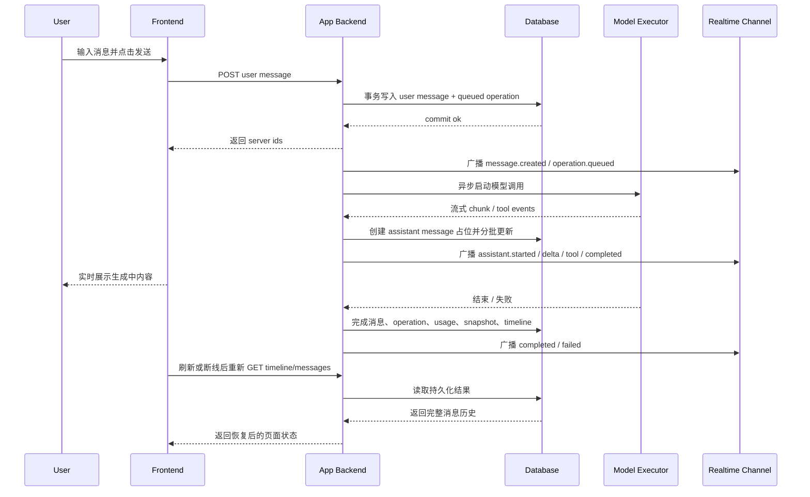

# Task Session Message 单轮往返目标方案

> 状态：Draft v1
> 日期：2026-03-29
> 作者：GitHub Copilot
> 关联文档：[task-session-first-schema-plan.md](task-session-first-schema-plan.md)、[task-session-message-current-write-path.md](task-session-message-current-write-path.md)、[task-session-message-minimal-contract.md](task-session-message-minimal-contract.md)

## 1. 文档目的

这份文档定义一个**不依赖现有代码实现**的目标方案，只回答下面这个场景：

1. 用户在前端任务页面发送 1 条消息给模型
2. 模型开始处理并返回回复
3. 前端需要流式展示
4. 数据需要可靠持久化
5. 页面刷新、断线重连、后续审计都必须能恢复这轮对话

这份方案不讨论当前仓库的 compat 路由、旧表或 runtime fallback，只定义目标行为。

## 2. 方案结论

先给结论，避免歧义：

### 2.1 数据库写入原则

1. 用户消息必须先落数据库，再触发模型调用
2. 模型回复不能等整段结束后一次性写库，而应在开始生成后尽快创建 assistant message，并按小批次持续刷库
3. 数据库是任务页的主读源
4. realtime 只是加速通道，不是事实主源

### 2.2 前端读取原则

1. 前端任务页面的初始加载、刷新恢复、断线补齐，都只从业务后端的数据库读模型读取
2. 前端不直接读取底层模型 runtime 的 message store
3. 前端可以订阅 realtime 事件，但这些事件必须以服务端已经接受或已经持久化的状态为准

### 2.3 服务端职责原则

1. 服务端是唯一能直接调用模型执行器的层
2. 服务端是唯一能写任务域事实表的层
3. 前端只和业务后端交互，不和模型执行器直连

## 3. 角色分工

## 3.1 前端负责什么

前端只负责：

1. 收集用户输入
2. 发送消息请求
3. 做本地 optimistic rendering
4. 订阅 realtime 更新
5. 在刷新或断线后通过读接口恢复完整状态

前端不负责：

1. 直接调用模型 provider
2. 直接访问底层 runtime message API
3. 自己维护最终消息真相
4. 以浏览器内存作为恢复依据

## 3.2 服务端负责什么

服务端负责：

1. 接收用户消息
2. 先写任务域事实表
3. 创建模型执行 operation
4. 驱动模型流式执行
5. 把模型流式输出持续写回事实表
6. 对外发 realtime 事件
7. 维护 snapshot / timeline 等读模型

## 3.3 数据库负责什么

数据库不是“执行器”，而是 durable source of truth：

1. 保存用户消息
2. 保存 assistant 消息和 message parts
3. 保存 tool call / tool result
4. 保存本轮 operation、usage、状态变化
5. 为任务页提供可恢复的读面

## 4. 建议的数据边界

单轮消息往返最少需要以下几类事实：

1. `tasks`：任务聚合根
2. `task_sessions`：当前对话分支
3. `task_session_messages`：消息头
4. `task_session_message_parts`：消息分片
5. `session_operations`：一次模型调用或工具调用
6. `task_usage_ledger_entries`：token / cost 账务事实
7. `task_snapshots`：任务当前态读模型
8. `task_timeline_views`：任务页时间线读模型

### 4.1 `task_session_messages` 的职责

每条 message 至少建议包含：

1. `id`
2. `task_id`
3. `session_id`
4. `role`，例如 `user`、`assistant`、`tool`、`system`
5. `message_index`
6. `status`，例如 `pending`、`streaming`、`completed`、`failed`、`cancelled`
7. `text_content`，用于快速展示当前聚合正文
8. `summary_text`，可选摘要字段
9. `started_at`
10. `completed_at`
11. `client_message_id`，用户侧幂等键
12. `provider_message_id`，执行器侧消息 id，可选
13. `error_text`，失败时记录

### 4.2 `task_session_message_parts` 的职责

每条 part 负责表达结构化片段，例如：

1. `text`
2. `tool_call`
3. `tool_result`
4. `thinking`
5. `file_reference`
6. `diff`

对 text streaming，建议不要每个 token 新建一行 part；更稳的做法是：

1. assistant message 保留 1 条主消息行
2. 正在生成的文本 part 可以是 1 条活动 part，不断更新它的 `text_content` / `json_payload`
3. 完成后把该 part 标记为 finalized

### 4.3 `session_operations` 的职责

每轮模型回复至少对应 1 条 `session_operations`：

1. `operation_kind = model_request`
2. 状态从 `queued -> running -> completed|failed|cancelled`
3. 记录 provider / model / token / cost
4. 记录与本次 reply 相关的 `source_message_id` 与 `target_message_id`

## 5. 单轮消息往返的目标时序



## 6. 详细流程

## 6.1 用户点击发送之前

前端任务页应先拿到：

1. 当前 task
2. 当前 active session
3. 当前 message timeline
4. 当前 composer 是否可发送

这些都来自数据库读面，不来自执行器内存。

## 6.2 用户点击发送时

前端做两件事：

1. 立即生成本地 optimistic message
2. 向后端发送带幂等键的请求

建议请求：

```json
POST /tasks/:taskId/sessions/:sessionId/messages
{
  "client_message_id": "cli_01J...",
  "text": "请帮我分析这个报错",
  "attachments": [],
  "reply_mode": "default"
}
```

其中 `client_message_id` 用于：

1. 防止用户双击发送造成重复写入
2. 让前端把 optimistic message 与服务端最终 message 对齐

## 6.3 服务端接到用户消息时

服务端不应该先打模型，再决定是否写库。

正确顺序是：

1. 开事务
2. 校验 task 和 session 可写
3. 按 `client_message_id` 做幂等检查
4. 写入 1 条 `task_session_messages(role=user,status=completed)`
5. 写入对应 text part
6. 写入 1 条 `session_operations(operation_kind=model_request,status=queued)`
7. 更新 `task_snapshots` / `task_timeline_views` 或提交 outbox 重建任务
8. 提交事务
9. 提交成功后，异步启动模型执行

也就是说：

**用户消息是同步写库的，且必须先于模型执行。**

## 6.4 前端收到发送成功响应时

服务端响应建议直接带回：

1. 服务端 user message id
2. 对应 operation id
3. 当前 session id
4. 当前 task 最新版本号或 cursor

前端收到后：

1. 用服务端 message id 替换 optimistic id
2. 将该消息状态设为已提交
3. 进入“等待模型回复”状态
4. 不需要立即全量 refetch

## 6.5 服务端启动模型执行时

服务端调用模型执行器时，不需要等第一段文本回来才有任何数据库痕迹。

在调用开始后，应立即把 operation 更新为：

1. `status = running`
2. `started_at = now`

必要时，还可以提前创建 assistant placeholder message：

1. `role = assistant`
2. `status = pending`
3. `text_content = ''`

是否提前创建 placeholder，可以二选一：

1. 保守方案：等第一段 chunk 到达时再创建 assistant message
2. 激进方案：模型调用开始即创建空 assistant message

推荐用激进方案，因为任务页可以稳定展示“模型正在回复”这一条消息槽位。

## 6.6 模型开始流式返回时

收到第一段回复后，服务端应立即保证数据库里已经存在 assistant message。

建议顺序：

1. 若 assistant message 尚不存在，先创建 1 条 `task_session_messages(role=assistant,status=streaming)`
2. 创建或更新当前 text part
3. 把最新聚合文本写回 `task_session_messages.text_content`
4. 通过 realtime 把增量发给前端

注意这里的“第一时间写库”不等于“每个 token 单独开事务写库”。

推荐的流式刷库策略：

1. 以 100ms 到 300ms 为批次窗口
2. 或以 32 到 256 个字符为批次阈值
3. 到窗口或阈值就 merge 后写一次
4. 最终完成时再做一次 authoritative flush

这样可以兼顾：

1. 页面刷新可恢复
2. 数据库写放大可控
3. 前端仍然接近实时

## 6.7 遇到 tool call / tool result 时

若模型过程中触发工具：

1. 在同一 assistant message 下新增 `tool_call` / `tool_result` part
2. 或者在独立 tool message 下写入结构化消息
3. 同时更新 `session_operations`

推荐规则如下：

1. 人类可理解的对话流继续放 `task_session_messages`
2. 每次实际工具执行都必须在 `session_operations` 留痕
3. 如果工具结果需要在页面作为消息展示，再额外写 message parts

## 6.8 模型回复完成时

服务端在完成时必须做一次 finalization transaction：

1. assistant message `status` 变成 `completed`
2. `completed_at` 写入
3. text part / tool part 全部 finalize
4. `session_operations.status` 变成 `completed`
5. token / cost 聚合写回 operation
6. append 1 条 `task_usage_ledger_entries`
7. 更新 `task_snapshots`
8. 重建或增量更新 `task_timeline_views`
9. 广播 `message.completed` 与 `operation.completed`

这样页面刷新后依然能完整恢复这轮对话，而不需要再问执行器“刚才回复了什么”。

## 6.9 模型失败或取消时

失败场景不应丢掉已写的用户消息。

建议规则：

1. user message 保持 `completed`
2. assistant message 若已创建，则标记 `failed` 或 `cancelled`
3. `error_text` 落在 assistant message 或 operation 上
4. timeline 中显示一条明确失败状态
5. 前端允许用户基于同一 session 再次发送或重试

## 7. 前端应该怎么工作

## 7.1 初始加载

任务页第一次打开时，只调用业务后端读接口，例如：

1. `GET /tasks/:taskId`
2. `GET /tasks/:taskId/sessions/:sessionId/messages`
3. `GET /tasks/:taskId/sessions/:sessionId/timeline`

这些接口都应该由数据库读模型提供，而不是直接代理模型执行器。

## 7.2 发送消息后的本地态

前端允许 optimistic UI，但 optimistic 只持续很短时间：

1. 本地先渲染一条 `sending` user bubble
2. 收到服务端 ack 后马上切换成 server-backed message
3. 如果 ack 失败，直接把该消息标记为发送失败

## 7.3 streaming 展示

前端的 streaming 展示来自 realtime channel，不来自频繁轮询：

1. 订阅 `message.created`
2. 订阅 `message.delta`
3. 订阅 `message.completed`
4. 订阅 `message.failed`

前端在 streaming 期间建议：

1. 使用纯文本渲染
2. 不对每个 chunk 做重 markdown 解析
3. 自动滚动只在用户接近底部时启用
4. 若实时连接断开，显示“正在重连”而不是把页面状态清空

## 7.4 刷新与断线恢复

前端刷新后不应该去问执行器“请把刚才的流补给我”。

正确做法是：

1. 重新调用 messages / timeline 读接口
2. 从数据库拿回已经持久化的 assistant 当前文本
3. 恢复 message status，例如 `streaming`、`completed`、`failed`
4. 再重新接入 realtime，继续接收后续增量

所以任务页的恢复能力完全依赖数据库，而不是依赖底层 runtime 的内存或 message list。

## 8. 推荐的服务端接口

## 8.1 发送用户消息

```json
POST /tasks/:taskId/sessions/:sessionId/messages
{
  "client_message_id": "cli_01J...",
  "text": "请帮我分析这个报错"
}
```

返回：

```json
{
  "task_id": "task_123",
  "session_id": "ses_456",
  "user_message": {
    "id": "msg_user_001",
    "role": "user",
    "status": "completed",
    "text": "请帮我分析这个报错"
  },
  "assistant_message": {
    "id": "msg_asst_001",
    "role": "assistant",
    "status": "pending"
  },
  "operation": {
    "id": "op_001",
    "kind": "model_request",
    "status": "queued"
  }
}
```

## 8.2 读取消息

```json
GET /tasks/:taskId/sessions/:sessionId/messages
```

返回必须只反映数据库中的已知事实，不依赖执行器即时查询。

## 8.3 realtime 事件

建议事件类型：

1. `message.created`
2. `message.delta`
3. `message.completed`
4. `message.failed`
5. `operation.updated`
6. `usage.updated`
7. `task.snapshot.updated`

这些事件的设计原则是：

1. 前端收到事件后可以更快更新
2. 但即使漏掉事件，重新 GET 也能恢复完全一致的状态

## 9. 为什么不建议前端直接读底层 runtime

如果前端直接读底层 runtime，会带来以下问题：

1. 刷新恢复依赖执行器在线
2. 无法保证任务域权限边界
3. 无法保证消息与 task/session 关系稳定
4. tool call、usage、artifacts、审计信息无法统一拼装
5. UI 会依赖执行器协议，导致业务 contract 不稳定
6. 断线、重试、幂等、补偿逻辑会被推到浏览器端

因此，目标方案里：

1. 前端永远只读业务后端
2. 模型执行器只对服务端可见

## 10. 为什么不建议等回复结束后一次性写库

如果等 assistant 全部回复结束后才写库，会有几个直接问题：

1. 页面刷新时丢失中间生成内容
2. 长回复过程中无法稳定恢复
3. tool call / tool result 无法可靠审计
4. 用户会看到 UI 在 streaming，但数据库一直空白
5. 一旦进程崩溃，整段回复可能完全丢失

因此推荐策略是：

1. 用户消息同步入库
2. assistant message 尽早创建
3. 文本按批次流式刷库
4. 完成时再做最终封账

## 11. 实施口径

这份方案的核心口径只有三条：

1. 用户消息先写数据库，再触发模型
2. 任务页主读源永远是数据库读模型，不是底层 runtime
3. 模型流式回复采用“实时推送 + 分批持久化 + 最终封账”，而不是“只推送不落库”或“结束后一次性写库”

## 12. 一句话总结

对于“用户发 1 条消息，模型回 1 条消息”这个最小闭环，理想方案应该是：

1. 前端只和业务后端交互
2. 用户消息提交时同步写库
3. 服务端异步驱动模型执行
4. assistant 回复从开始生成起就持续分批落库
5. 前端实时展示依赖服务端推送
6. 页面刷新和历史查看统一从数据库恢复

也就是说，**数据库是任务页的真源，realtime 是加速层，模型执行器只是服务端内部依赖，不是前端数据源。**