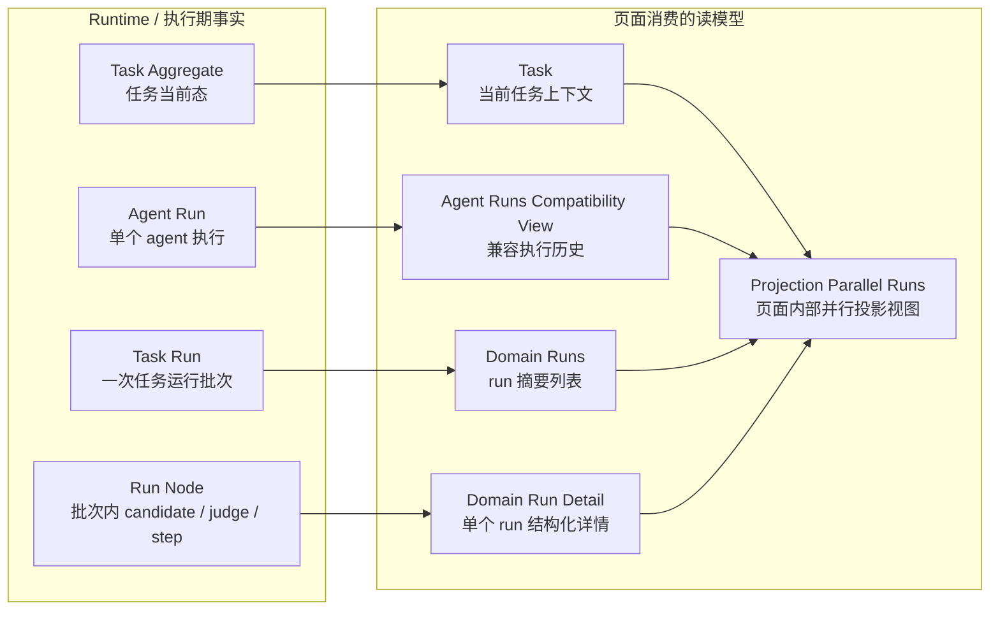
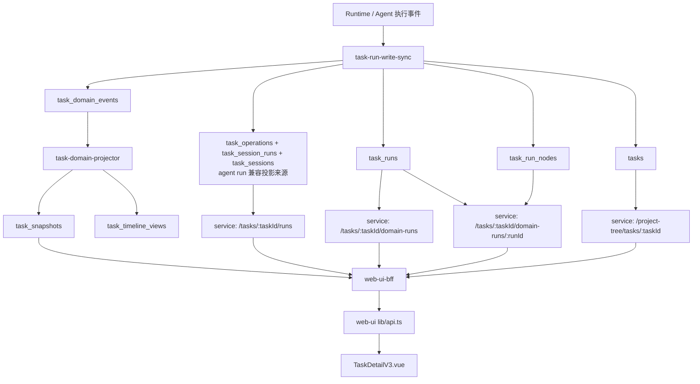
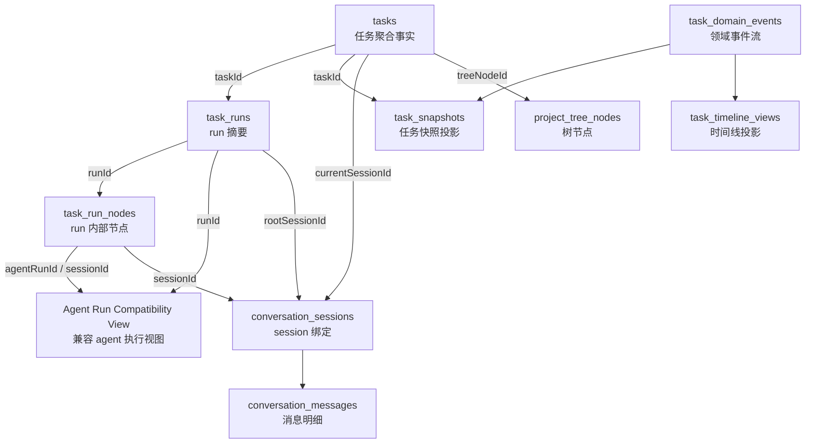
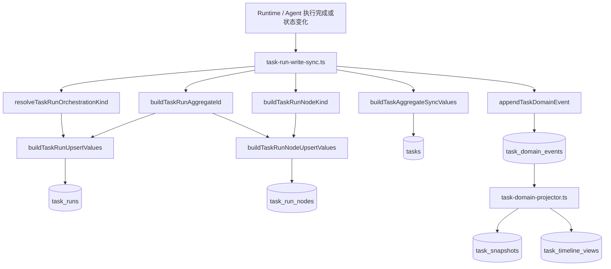
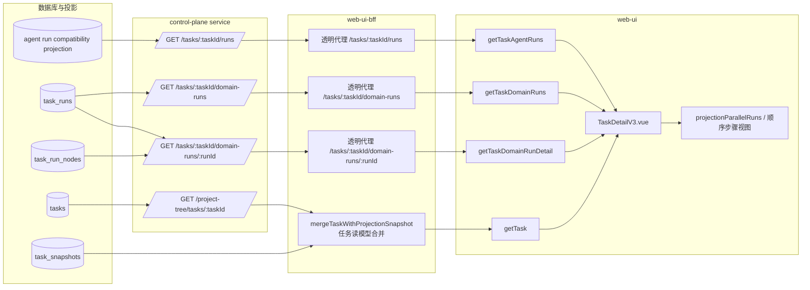

# Task Run 数据链路全景说明（历史兼容链路）

本文记录的是 task run / domain-runs 兼容链路在退役前的结构，主要用于理解旧设计、历史测试夹具，以及为什么后续要做 session-first cutover。它不再代表 2026-04-07 之后的主线实现。

本文覆盖的历史接口包括：

- `GET /api/tasks/:taskId/runs`
- `GET /api/tasks/:taskId/domain-runs`
- `GET /api/tasks/:taskId/domain-runs/:runId`

如果你的目标是理解当前实现，应优先查看 session-first 相关文档，例如 [task-session-first-schema-plan.md](task-session-first-schema-plan.md) 与 [task-session-first-execution-plan.md](task-session-first-execution-plan.md)。

> 状态更新（2026-04-05）：本文成稿早于 session-first cutover 与 `0033_drop_agent_runs.sql`。当前代码中已不存在独立 `agent_runs` 主表；`GET /api/tasks/:taskId/runs` 仍保留为兼容接口，但其返回现在由 `task_operations`、`task_session_runs`、`task_sessions` 的 canonical 数据投影而来。阅读本文时，凡涉及 `agent_runs` 的描述都应理解为“兼容视图语义”，而不是当前落库结构。
>
> 状态更新（2026-04-07）：当前 service / BFF / web-ui 主线源码已不再暴露或消费 `/api/tasks/:taskId/domain-runs*`；任务页并行视图与候选采纳主链已切到 task sessions、execution trace、task session lineage 与 session-tree fallback。阅读本文时，凡涉及 `domain-runs` 的描述都应理解为“历史兼容路径”，而不是当前线上边界。

## 1. 历史总体链路

在 `domain-runs` 兼容链路仍存在时，任务页展示运行相关信息并不是只依赖一个接口，而是组合了四类数据：

1. 任务本体读模型：`GET /api/tasks/:taskId` 或 `GET /api/project-tree/tasks/:taskId`
2. agent run 兼容视图：`GET /api/tasks/:taskId/runs`
3. 任务级 run 摘要：`GET /api/tasks/:taskId/domain-runs`
4. 单个 run 的结构化详情：`GET /api/tasks/:taskId/domain-runs/:runId`

其中第 2、3、4 项是本文主线，第 1 项是任务页面拼装当前运行态时的补充上下文。

### 1.1 数据对象总览图



### 1.2 端到端链路图



可以把这条链路拆成三层理解：

- 存储层：`tasks`、`task_sessions`、`task_session_runs`、`task_messages`、`task_operations`、`task_snapshots`；`/api/tasks/:taskId/runs` 再从 canonical 表投影兼容 agent run 视图
- 服务层：service 暴露查询接口，BFF 基本透明代理
- 展示层：任务页把 task、本次/历史 runs、run detail、agent run 兼容视图组合成并行比较和顺序执行视图

## 2. 数据库模型

### 2.0 表关系图



### 2.1 `tasks`：任务聚合表

定义位置：[`control-plane/service/src/db/schema.pg.ts`](../control-plane/service/src/db/schema.pg.ts)

表定义起点：`export const tasks = pgTable("tasks", ...)`

这个表不是 run 明细表，而是任务级聚合事实。任务页会直接或间接依赖以下字段：

- `id`：任务 ID
- `projectId`：所属项目
- `treeNodeId`：映射到项目树节点
- `title`、`prompt`：任务标题和原始提示词
- `status`：任务当前状态
- `currentRunId`：当前 run 的 ID
- `currentSessionId`：当前会话 ID
- `currentAgentRunId`：当前 agent run ID
- `latestResult`、`latestResultSummary`：最近一次结果
- `selectedModel`：任务当前选择模型
- `strategyJson`：任务策略 JSON
- `startedAt`、`finishedAt`、`updatedAt`

这个表解决的是“当前任务是什么状态、当前挂着哪个 run”这类问题，不解决某个 run 里面有哪些 candidate/judge/node。

### 2.2 `task_runs`：任务级运行摘要表

定义位置：[`control-plane/service/src/db/schema.pg.ts`](../control-plane/service/src/db/schema.pg.ts)

核心字段：

- `id`：run ID，当前实现通常由 `task_run:${taskId}:${sessionId}` 或 `task_run:${taskId}:agent:${agentRunId}` 组成
- `taskId`
- `projectId`
- `orchestrationKind`：`single | parallel | sequential-chain`
- `triggerType`：本次运行的触发方式，例如 `user_execute`
- `sourceType`：来源 agent 类型
- `status`：`pending | running | paused | completed | failed | cancelled`
- `rootSessionId`：本次运行根 session
- `winnerNodeId`：并行评选后的获胜节点
- `judgeNodeId`：judge 节点
- `requestedModel`、`effectiveModel`
- `pipelineStepCount`
- `candidateCount`
- `resultText`、`resultSummary`、`errorText`
- `startedAt`、`finishedAt`、`createdAt`、`updatedAt`

这个表回答的是“这个任务历史上有哪些 run、每个 run 的整体状态是什么”。

### 2.3 `task_run_nodes`：单个 run 内部节点表

定义位置：[`control-plane/service/src/db/schema.pg.ts`](../control-plane/service/src/db/schema.pg.ts)

核心字段：

- `id`
- `runId`
- `taskId`
- `projectId`
- `nodeKind`：`execution | candidate | judge | chain-step | hook | resume`
- `nodeKey`：用于 run 内幂等更新
- `title`、`instruction`
- `candidateIndex`
- `chainStepIndex`
- `hookTrigger`
- `agentType`
- `modelUsed`
- `sessionId`
- `agentRunId`
- `status`
- `resultText`、`resultSummary`、`errorText`
- `tokenUsed`
- `startedAt`、`finishedAt`、`createdAt`、`updatedAt`

这个表是 `domain-runs/:runId` 详情接口的核心事实来源。并行候选、judge、顺序链步骤，都是从这里筛出来的。

### 2.4 `agent runs`：兼容接口返回模型

定义位置：[`control-plane/service/src/modules/tasks/agent-run-compat.ts`](../control-plane/service/src/modules/tasks/agent-run-compat.ts) 与 [`control-plane/service/src/modules/tasks/task-agent-run-read-routes.ts`](../control-plane/service/src/modules/tasks/task-agent-run-read-routes.ts)

核心字段：

- `id`
- `taskId`
- `sessionId`
- `agentType`
- `status`：`pending | running | paused | completed | failed | stopped | terminated`
- `modelUsed`
- `tokenUsed`
- `result`
- `error`
- `candidateIndex`
- `startedAt`、`finishedAt`、`createdAt`

这个返回模型更偏原始执行记录，直接对应某个 `agentRunId` 的兼容读视图，不是页面最终展示模型。当前并没有与之同名的独立 `agent_runs` 物理表。

### 2.5 `task_snapshots`：任务投影视图表

定义位置：[`control-plane/service/src/db/schema.pg.ts`](../control-plane/service/src/db/schema.pg.ts)

核心字段：

- `taskId`
- `projectId`
- `currentStatus`
- `orchestrationKind`
- `currentRunId`
- `currentSessionId`
- `latestResult`
- `latestResultSummary`
- `latestErrorText`
- `activeCandidateCount`
- `completedCandidateCount`
- `failedCandidateCount`
- `totalChainSteps`
- `completedChainSteps`
- `winnerNodeId`
- `lastActivityAt`

这个表不是本文三个接口的直接数据源，但任务详情页依赖的 task 读模型会用到这里的聚合字段，因此它对页面“当前运行态”有直接影响。

### 2.6 辅助表

以下表不是这三个接口的直接来源，但会影响 session 和时间线展示：

- `project_tree_nodes`
- `conversation_sessions`
- `conversation_messages`
- `task_timeline_views`

其中：

- `project_tree_nodes` 提供任务节点、session 节点、消息节点的树形结构
- `conversation_sessions` 把 runtime session 绑定到 task/run/runNode
- `task_timeline_views` 是投影后的任务时间线视图

## 3. 写路径：这些数据是怎么写进来的

### 3.0 写路径图



### 3.1 `task-run-write-sync.ts`

位置：[`control-plane/service/src/modules/tasks/task-run-write-sync.ts`](../control-plane/service/src/modules/tasks/task-run-write-sync.ts)

这个模块负责把 agent 执行事实同步成 task run 相关存储。

关键逻辑：

1. `resolveTaskRunOrchestrationKind()`
   - 从 `TaskTreeRecord.executionMode` 推导本次 run 的 `orchestrationKind`

2. `buildTaskRunAggregateId()`
   - 生成 `task_runs.id`
   - 有 session 时：`task_run:${taskId}:${sessionId}`
   - 无 session 时：`task_run:${taskId}:agent:${agentRunId}`

3. `buildTaskRunNodeKind()`
   - 根据任务执行模式和 `agentType` 判断节点是 `candidate`、`judge`、`chain-step`、`hook`、`resume` 还是普通 `execution`

4. `buildTaskRunUpsertValues()`
   - 生成 `task_runs` upsert 数据

5. `buildTaskRunNodeUpsertValues()`
   - 生成 `task_run_nodes` upsert 数据

6. `buildTaskAggregateSyncValues()`
   - 更新 `tasks` 表上的 `currentRunId`、`latestResultSummary`、`status` 等聚合字段

7. `appendTaskDomainEvent()`
   - 追加 `task.run-node.upserted` 事件，供 projector 再做二次投影

这意味着当前 run 数据会同时进入：

- `task_runs`
- `task_run_nodes`
- `tasks`
- task domain event stream

### 3.2 `task-domain-projector.ts`

位置：[`control-plane/service/src/modules/tasks/task-domain-projector.ts`](../control-plane/service/src/modules/tasks/task-domain-projector.ts)

这个模块消费 domain event，把事实数据再投影到 `task_snapshots` 和 `task_timeline_views`。

与当前主题最相关的处理器是：

- `handleTaskAggregateUpsertedEvent()`
- `handleTaskRunNodeUpsertedEvent()`
- `syncSnapshotFromProjectionBase()`

`handleTaskRunNodeUpsertedEvent()` 的关键作用：

- 更新 `task_snapshots.currentRunId`
- 更新 `task_snapshots.orchestrationKind`
- 更新 `latestResult` / `latestResultSummary` / `latestErrorText`
- 在并行模式且还没有 winner 时，保留主线 session，不让某个 candidate 直接覆盖主线视图
- 将 run node 事件写入 `task_timeline_views`

所以任务页看到的“当前运行态”和“候选统计”并不只来自原始 run 表，还来自 projector 维护的 snapshot。

## 4. Service 层接口

### 4.0 读路径图



### 4.1 接口返回结构图

```mermaid
flowchart TD
  A[GET /api/tasks/:taskId]
  B[GET /api/tasks/:taskId/runs]
  C[GET /api/tasks/:taskId/domain-runs]
  D[GET /api/tasks/:taskId/domain-runs/:runId]

  A --> A1[Task]
  A1 --> A11[id / projectId / title / prompt / status]
  A1 --> A12[sessionId / agentRunId / currentRunId]
  A1 --> A13[executionMode / orchestrationKind]
  A1 --> A14[latestResultSummary / latestErrorText]
  A1 --> A15[activeCandidateCount / totalChainSteps]

  B --> B1[data[]]
  B1 --> B2[TaskAgentRunRecord]
  B2 --> B21[id / taskId / sessionId]
  B2 --> B22[runId / runNodeId]
  B2 --> B23[agentType / status]
  B2 --> B24[modelUsed / tokenUsed]
  B2 --> B25[result / error / candidateIndex]
  B2 --> B26[startedAt / finishedAt / createdAt]

  C --> C1[data[]]
  C1 --> C2[TaskDomainRunRecord]
  C2 --> C21[id / taskId / projectId]
  C2 --> C22[orchestrationKind / triggerType / sourceType]
  C2 --> C23[status / rootSessionId]
  C2 --> C24[winnerNodeId / judgeNodeId]
  C2 --> C25[requestedModel / effectiveModel]
  C2 --> C26[pipelineStepCount / candidateCount]
  C2 --> C27[resultText / resultSummary / errorText]
  C2 --> C28[startedAt / finishedAt / createdAt / updatedAt]

  D --> D1[data]
  D1 --> D2[run: TaskDomainRunRecord]
  D1 --> D3[nodes: TaskDomainRunNodeRecord[]]
  D1 --> D4[candidateNodes: TaskDomainRunNodeRecord[]]
  D1 --> D5[judgeNode: TaskDomainRunNodeRecord | null]
  D1 --> D6[winnerCandidateIndex: number | null]
  D3 --> D31[id / runId / nodeKind / nodeKey]
  D3 --> D32[candidateIndex / chainStepIndex / hookTrigger]
  D3 --> D33[agentType / modelUsed / sessionId / agentRunId]
  D3 --> D34[status / resultText / resultSummary / errorText]
  D3 --> D35[tokenUsed / startedAt / finishedAt / createdAt / updatedAt]
```

这张图关注的是“接口返回长什么样”，不是“这些字段从哪张表来”。字段来源关系看 2.0 表关系图和 4.0 读路径图。

### 4.2 路由注册入口

位置：[`control-plane/service/src/modules/tasks/task-route-modules.ts`](../control-plane/service/src/modules/tasks/task-route-modules.ts)

注册顺序中与本文相关的两个模块：

- `registerTaskCoreRoutes()`
- `registerTaskDomainRunRoutes()`

### 4.3 `GET /tasks/:taskId/runs`

实现位置：[`control-plane/service/src/modules/tasks/task-agent-run-read-routes.ts`](../control-plane/service/src/modules/tasks/task-agent-run-read-routes.ts)

当前实现：

- 调用 `listCanonicalTaskAgentRuns(taskId)`
- 底层从 `task_operations`、`task_session_runs`、`task_sessions` 投影兼容 `agentRunId` 视图
- 排序：`createdAt desc`
- 返回：`{ data: runs, meta: { taskId, count } }`

当前返回的是兼容读模型，不再直接对应数据库中的独立 `agent_runs` 表。

当前接口语义可理解为：

- 某个任务下面的 agent 执行历史
- 更适合“执行原始记录”和 fallback 拼装
- 不适合作为页面最终展示模型直接使用

返回结构示意：

```json
{
  "data": [
    {
      "id": "agent_run_xxx",
      "taskId": "task_xxx",
      "sessionId": "ses_xxx",
      "runId": "task_run:task_xxx:ses_xxx",
      "runNodeId": "task_run:task_xxx:ses_xxx:node:agent_run_xxx",
      "agentType": "explore-enterprise",
      "status": "completed",
      "modelUsed": "gpt-5-mini",
      "tokenUsed": 1234,
      "result": "...",
      "error": null,
      "candidateIndex": 0,
      "startedAt": "...",
      "finishedAt": "...",
      "createdAt": "..."
    }
  ]
}
```

### 4.4 `GET /tasks/:taskId/domain-runs`

实现位置：[`control-plane/service/src/modules/tasks/task-domain-run-routes.ts`](../control-plane/service/src/modules/tasks/task-domain-run-routes.ts)

当前实现：

- 查询 `task_runs`
- 条件：`taskRuns.taskId = taskId`
- 排序：`createdAt desc`
- 返回：`{ data: runs }`

当前接口语义可理解为：

- 某个任务历史上产生过哪些运行批次
- 每个批次属于哪种 orchestration
- 每个批次当前状态如何

返回结构示意：

```json
{
  "data": [
    {
      "id": "task_run:task_xxx:ses_xxx",
      "taskId": "task_xxx",
      "projectId": "proj_xxx",
      "orchestrationKind": "parallel",
      "triggerType": "user_execute",
      "sourceType": "explore-enterprise",
      "status": "completed",
      "rootSessionId": "ses_xxx",
      "winnerNodeId": "task_run:...:node:...",
      "judgeNodeId": "task_run:...:node:...",
      "requestedModel": "gpt-5-mini",
      "effectiveModel": "gpt-5-mini",
      "pipelineStepCount": null,
      "candidateCount": 2,
      "resultText": "...",
      "resultSummary": "...",
      "errorText": null,
      "startedAt": "...",
      "finishedAt": "...",
      "createdAt": "...",
      "updatedAt": "..."
    }
  ]
}
```

### 4.5 `GET /tasks/:taskId/domain-runs/:runId`

实现位置：[`control-plane/service/src/modules/tasks/task-domain-run-routes.ts`](../control-plane/service/src/modules/tasks/task-domain-run-routes.ts)

当前实现分两步：

1. 先从 `task_runs` 查出该 run
2. 再调用 `listTaskRunDetailNodes()` 拉 `task_run_nodes`

`listTaskRunDetailNodes()` 位于：[`control-plane/service/src/modules/tasks/task-run-detail.ts`](../control-plane/service/src/modules/tasks/task-run-detail.ts)

它会：

- 查询 `task_run_nodes`
- 按 `candidateIndex`、`chainStepIndex`、`createdAt` 排序
- 从全量节点中筛出：
  - `candidateNodes`
  - `judgeNode`
  - `winnerCandidateIndex`

当前返回结构：

```json
{
  "data": {
    "run": {
      "id": "task_run:task_xxx:ses_xxx",
      "orchestrationKind": "parallel",
      "winnerNodeId": "...",
      "judgeNodeId": "..."
    },
    "nodes": [
      {
        "id": "...",
        "nodeKind": "candidate",
        "candidateIndex": 0,
        "agentType": "explore-enterprise",
        "modelUsed": "gpt-5-mini",
        "sessionId": "ses_a",
        "agentRunId": "agent_run_a",
        "status": "completed",
        "resultText": "...",
        "resultSummary": "...",
        "errorText": null,
        "startedAt": "...",
        "finishedAt": "..."
      }
    ],
    "candidateNodes": [
      {
        "id": "...",
        "nodeKind": "candidate",
        "candidateIndex": 0,
        "sessionId": "ses_a"
      }
    ],
    "judgeNode": {
      "id": "...",
      "nodeKind": "judge"
    },
    "winnerCandidateIndex": 1
  }
}
```

这个接口是当前任务页并行候选和顺序执行视图最重要的结构化数据来源。

## 5. BFF 层

### 5.1 透明代理

位置：[`control-plane/web-ui-bff/src/modules/tasks/routes.ts`](../control-plane/web-ui-bff/src/modules/tasks/routes.ts)

与本文相关的三个路由：

- `GET /api/tasks/:taskId/runs`
- `GET /api/tasks/:taskId/domain-runs`
- `GET /api/tasks/:taskId/domain-runs/:runId`

当前 BFF 基本不做二次组装，只做：

- 读取 `taskId` / `runId`
- 调 `cpFetch()` 请求 control-plane service
- 原样返回 `result.data`

因此这三个接口当前的数据 shape 主要由 service 层决定，不由 BFF 再塑形。

### 5.2 BFF 的旁路消费：member view

位置：[`control-plane/web-ui-bff/src/modules/tasks/member-view.ts`](../control-plane/web-ui-bff/src/modules/tasks/member-view.ts)

这里会调用 `/api/tasks/:taskId/runs`，把 agent runs 用在任务成员视图上：

- 统计某个 role/agent 是否执行过
- 推断 agent 当前状态是“执行中 / 已运行 / 异常 / 待命”
- 计算 `latestActivityAt`

也就是说，`/runs` 不只被前端页面直接用，也被 BFF 的 view-model 构建逻辑用来派生成员状态。

## 6. Web UI API 封装层

位置：[`control-plane/web-ui/src/lib/api.ts`](../control-plane/web-ui/src/lib/api.ts)

与本文相关的类型：

- `TaskAgentRunRecord`
- `TaskDomainRunRecord`
- `TaskDomainRunNodeRecord`
- `TaskDomainRunDetailRecord`
- `Task`
- `ProjectionRunRecord`

与本文相关的 API 方法：

- `getTask(taskId)`
- `getTaskAgentRuns(taskId)`
- `getTaskDomainRuns(taskId)`
- `getTaskDomainRunDetail(taskId, runId)`

这里做了两件事：

1. 给 BFF 返回值定义前端消费类型
2. 提供页面调用函数

它本身不负责业务聚合，真正的聚合发生在页面和少量 composable 中。

## 7. 任务页如何取数

### 7.1 `useProjectTreeTask()`：先拿任务本体

位置：[`control-plane/web-ui/src/composables/useProjectTreeTask.ts`](../control-plane/web-ui/src/composables/useProjectTreeTask.ts)

这个 composable 会先调：

- `getTask(taskId)`
- `getProjectTreeNode(projectId, taskId)`
- `getProjectTreeAncestors(projectId, taskId)`

作用：

- 用 BFF task 读模型拿到业务字段，例如 `status`、`executionMode`、`orchestrationKind`、`currentRunId`
- 用项目树拿 breadcrumb、导航上下文

这解释了为什么任务页判断“当前是不是并行模式”时，不会只看 `domain-runs`，还会先看 task 本体上的：

- `executionMode`
- `orchestrationKind`
- `currentRunId`

### 7.2 `refreshTaskRunSummaries()`：再拉 run 数据

位置：[`control-plane/web-ui/src/pages/TaskDetailV3.vue`](../control-plane/web-ui/src/pages/TaskDetailV3.vue)

当前任务页的加载顺序是：

1. `getTaskAgentRuns(currentTaskId)`
2. `getTaskDomainRuns(currentTaskId)`
3. 对 `parallel` 和 `sequential-chain` 的 run 逐个调用 `getTaskDomainRunDetail(currentTaskId, run.id)`

也就是：

- `taskAgentRuns.value` 保存原始 agent runs
- `taskDomainRuns.value` 保存 run 摘要列表
- `taskDomainRunDetails.value[run.id]` 保存每个需要投影的 run detail

页面不会为所有 run 都拉 detail，只会为：

- `parallel`
- `sequential-chain`

这说明 detail 接口目前被当成“投影接口”使用，而不是任意 run 通用详情接口。

## 8. 任务页如何把这些数据拼成展示模型

### 8.1 task 本体解决“当前 run 是谁”

任务页在多个计算属性里先看 task 上的这些字段：

- `task.currentRunId`
- `task.orchestrationKind`
- `task.executionMode`
- `task.status`

这些字段用于回答：

- 当前执行模式是什么
- 当前 run 应该优先显示哪个
- 历史 parallel run 是否应该在 single 模式运行时暂时隐藏

### 8.2 `taskDomainRuns` 解决“有哪些 run”

`taskDomainRuns.value` 是页面上所有 run 批次的基础索引。

它主要被用于：

- 按 `orchestrationKind` 过滤 parallel / sequential-chain 历史
- 根据 `id` 去索引 `taskDomainRunDetails`
- 结合当前 task 状态选出 current run 或 latest comparable run

### 8.3 `taskDomainRunDetails` 解决“每个 run 里面有哪些 candidate/judge/step”

`taskDomainRunDetails.value[runId]` 是页面计算并行比较和顺序步骤的主数据源。

页面会使用 detail 中的：

- `run`
- `nodes`
- `candidateNodes`
- `judgeNode`
- `winnerCandidateIndex`

典型用途：

- 并行比较卡片
- judge 结果
- 已采纳候选判断
- sequential-chain 步骤列表

### 8.4 `taskAgentRuns` 是 fallback 和补全来源

虽然页面已有 `domain-runs/:runId`，但仍会用 `taskAgentRuns` 做补洞，主要原因是：

- 某些 projection/detail 还未完全落库
- 某些 candidate 的 session、agent、model、result 需要从 agent run 反查补齐

相关逻辑集中在 TaskDetailV3 的这些函数：

- `buildProjectionCandidateFromNode()`
- `buildProjectionCandidatesFromDetail()`
- `buildProjectionCandidatesFromAgentRuns()`
- `augmentProjectionCandidatesFromCompanionRuns()`

这说明当前前端实际在做“service detail + agent raw records”的二次聚合。

## 9. TaskDetailV3 的显示逻辑

位置：[`control-plane/web-ui/src/pages/TaskDetailV3.vue`](../control-plane/web-ui/src/pages/TaskDetailV3.vue)

### 9.1 并行模式判断

`isParallelComparisonMode` 会在以下条件任一成立时进入并行视图：

- `projectionParallelRuns.value.length > 0`
- `task.orchestrationKind === "parallel"`
- `task.executionMode === "parallel"`

也就是说，页面展示并行比较不只看当前运行中的 task，也会看历史投影是否存在并行 run。

### 9.2 `projectionParallelRuns` 是页面内部投影视图

`projectionParallelRuns` 不是后端直接返回的数据结构，而是页面把这些数据重新组装后的视图模型：

- `taskDomainRuns`
- `taskDomainRunDetails`
- `taskAgentRuns`
- session tree fallback

它最终产出 `ProjectionRunRecord[]`，字段包括：

- `parallelRunId`
- `startedAt`、`finishedAt`
- `parentSessionId`
- `executionSessionId`
- `winnerCandidateIndex`
- `judgeResult`
- `candidateSessions`

这一步是当前实现里最重的“前端二次聚合”。

### 9.3 当前 run 的选择逻辑

`currentParallelRunId` 的优先级大致是：

1. session 范围内可比较 run
2. `task.currentRunId` 指向的 active run
3. 最新可比较 parallel run
4. 如果 task 当前就是 parallel，则取最新 parallel domain run
5. 再回退到 projectionParallelRuns 最后一个

这也是为什么 `task.currentRunId`、`domain-runs` 和页面 projection 三方必须同时存在。

### 9.4 并行卡片的最终显示

`buildParallelComparisonCardsForRun()` 会把每个 candidate session 变成 UI 卡片，并继续混入：

- session conversation items
- candidate fallback item
- trace state
- adoptability
- recommended / adopted 标记

一张卡片的最终显示状态，不只由 `candidateNodes.status` 决定，还会综合：

- candidate session 是否已有 settled reply
- trace state
- 并行运行是否已经 finished
- 页面是否已经拿到 candidate 消息

### 9.5 顺序执行展示

对于 `sequential-chain` 模式，页面会从 `TaskDomainRunDetailRecord.nodes` 中筛选 `nodeKind === "chain-step"` 的节点，生成顺序步骤视图。

也就是说：

- parallel 主要依赖 `candidateNodes` + `judgeNode`
- sequential-chain 主要依赖 `nodes` 中的 `chain-step`

## 10. 当前三类接口在页面中的职责分工

可以把当前职责压缩成下面这张表：

| 数据源 | 当前来源 | 页面用途 | 语义层级 |
| --- | --- | --- | --- |
| task 本体 | `/tasks/:taskId` 或 `/project-tree/tasks/:taskId` | 当前运行上下文、模式、currentRunId | 任务级读模型 |
| agent runs | `/tasks/:taskId/runs` | fallback、成员状态、候选补全 | 原始执行记录 |
| domain runs | `/tasks/:taskId/domain-runs` | 历史 run 列表、选择当前/最新 run | run 摘要 |
| domain run detail | `/tasks/:taskId/domain-runs/:runId` | candidate/judge/chain-step 展示 | run 聚合详情 |

## 11. 当前实现的边界特征

当前实现有几个非常鲜明的边界特征：

### 11.1 service 层直接暴露表记录

`/runs` 和 `/domain-runs` 基本是数据库直出，没有专门的 mapper 或 response contract 层。

结果是：

- 前端和 BFF 对字段 shape 有直接耦合
- 表字段一旦变化，接口契约就跟着变化

### 11.2 detail 接口半聚合，页面再二次聚合

`/domain-runs/:runId` 已经做了第一层聚合：

- `nodes`
- `candidateNodes`
- `judgeNode`
- `winnerCandidateIndex`

但页面仍然需要再用 `agentRuns` 和 session tree 做第二层聚合，说明它还不是最终 UI 视图模型。

### 11.3 任务页的“当前运行态”来自多源合并

页面并不会单信某一张表或某一个接口，而是组合：

- `task.currentRunId`
- `taskDomainRuns`
- `taskDomainRunDetails`
- `taskAgentRuns`
- session tree fallback

这是当前 TaskDetailV3 复杂度较高的根本原因。

## 12. 一句话总结

当前实现里，run 数据不是“一张表 -> 一个接口 -> 一个页面组件”这么简单，而是：

- agent run 兼容视图提供 `agentRunId` 级执行事实
- `task_runs` 提供 run 摘要
- `task_run_nodes` 提供结构化节点详情
- `tasks` 和 `task_snapshots` 提供任务当前态投影
- BFF 基本透明代理
- TaskDetailV3 再把 task、domain runs、domain run details、agent runs、session tree 合并成最终显示

因此，只要要改 run 相关展示，就必须同时考虑：

1. 表结构写入路径是否一致
2. service 接口返回的是原始记录还是聚合详情
3. 页面当前究竟把哪一层数据当作事实源

这也是为什么看起来只有三个接口，但实际上牵动的是一整条任务运行数据链。