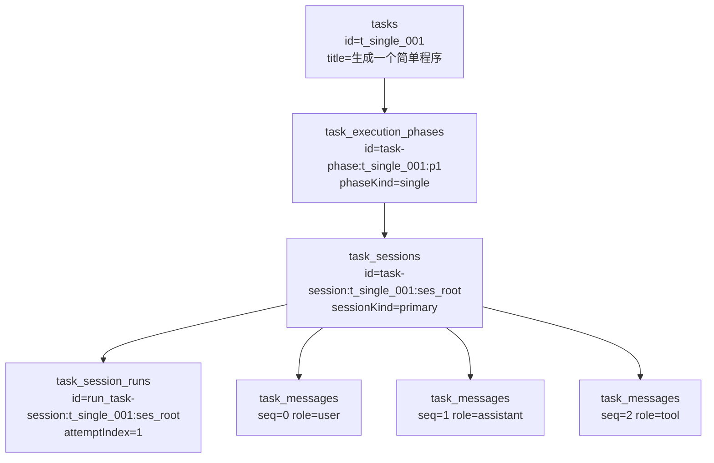
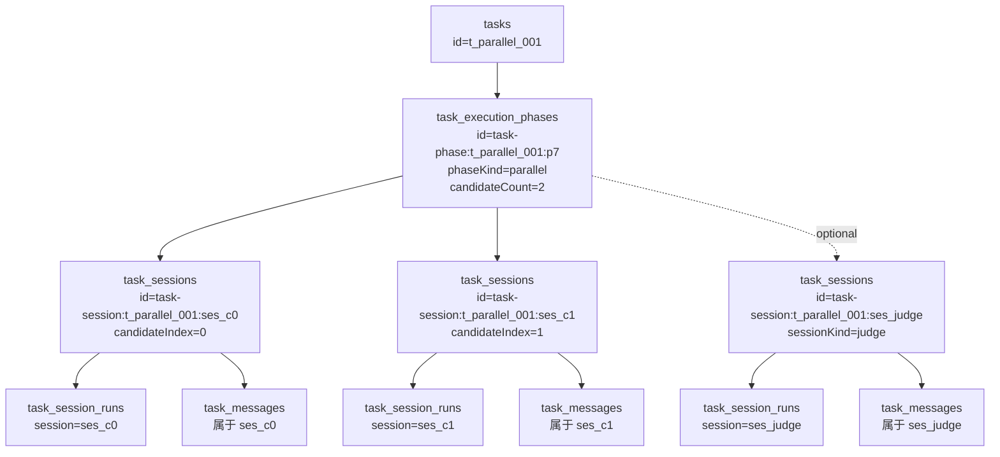

# Task / Phase / Session / Run / Message 五表示意与真实样本

最后更新：2026-04-10

本文只聚焦 5 张核心表：

- `tasks`
- `task_execution_phases`
- `task_sessions`
- `task_session_runs`
- `task_messages`

目标有两个：

1. 用 single 和 parallel 两种模式各画一张具体示意图，并给出每张表会出现哪些示例行。
2. 直接用当前数据库中的一条真实 task，把这 5 张表的实际数据串起来解释一遍。

相关 schema 定义见 [control-plane/service/src/db/schema.pg.ts](control-plane/service/src/db/schema.pg.ts)。

## 1. 先记住一条主链

```text
tasks
  └── task_execution_phases
        └── task_sessions
              ├── task_session_runs
              └── task_messages
```

这条主链里：

- `tasks` 表示业务任务本身。
- `task_execution_phases` 表示一次编排轮次。
- `task_sessions` 表示某个轮次里的执行分支。
- `task_session_runs` 表示某个分支里的第 N 次运行尝试。
- `task_messages` 表示某个分支里的规范消息。

一句话理解：Task 是锚点，Phase 是轮次，Session 是分支，Run 是尝试，Message 是分支内消息。

这里先特别强调一下 `task_session_runs` 的定位：

- 对外读任务结构时，通常先看 `task_execution_phases` + `task_sessions` + `task_messages`。
- `task_session_runs` 不是用来表达“有没有这个分支”，而是用来表达“这个分支的某一次具体尝试”。
- 因为当前很多真实样本里，一个 session 暂时只跑了 1 次，所以 run 会看起来和 session 接近 1:1，很容易误以为它是重复层。
- 但 run 层仍然负责承接 attempt 级事实，例如 `attempt_index`、`trigger_type`、`execution_kind`、`executor_kind`、`model_route`、状态与起止时间，以及后续 operation / message / usage 的归因锚点。

## 2. Single 模式示意

### 2.1 图



### 2.2 每张表会出现哪些示例行

#### `tasks`（single 示例）

| id | title | lifecycleStatus | preferredModel |
| --- | --- | --- | --- |
| `t_single_001` | 生成一个简单程序 | `draft` 或 `active` | `github-copilot:gpt-5-mini` |

#### `task_execution_phases`（single 示例）

| id | task_id | phase_index | phase_kind | trigger_type | status |
| --- | --- | --- | --- | --- | --- |
| `task-phase:t_single_001:p1` | `t_single_001` | `1` | `single` | `execute` | `running` 或 `completed` |

#### `task_sessions`（single 示例）

| id | task_id | phase_id | session_kind | session_type | execution_mode_snapshot | parent_session_id |
| --- | --- | --- | --- | --- | --- | --- |
| `task-session:t_single_001:ses_root` | `t_single_001` | `task-phase:t_single_001:p1` | `primary` | `root` | `single` | `null` |

#### `task_session_runs`（single 示例）

| id | task_id | session_id | phase_id | attempt_index | execution_kind | lane_role |
| --- | --- | --- | --- | --- | --- | --- |
| `run_task-session:t_single_001:ses_root` | `t_single_001` | `task-session:t_single_001:ses_root` | `task-phase:t_single_001:p1` | `1` | `single` | `primary` |

#### `task_messages`（single 示例）

| id | task_id | session_id | seq | role | message_kind | status | 说明 |
| --- | --- | --- | --- | --- | --- | --- | --- |
| `task-session-message:...:user-prompt` | `t_single_001` | `task-session:t_single_001:ses_root` | `0` | `user` | `prompt` | `completed` | 用户输入 |
| `task-session-message:...:assistant:1` | `t_single_001` | `task-session:t_single_001:ses_root` | `1` | `assistant` | `reply` | `completed` | 助手答复 |
| `task-session-message:...:tool:write_1` | `t_single_001` | `task-session:t_single_001:ses_root` | `2` | `tool` | `tool_echo` | `completed` | 工具回显 |

### 2.3 Single 模式怎么读

- 一条 task 通常先创建 1 条 single phase。
- 这个 phase 下通常只有 1 条 primary session。
- 这个 session 通常会先有 1 条当前 run；如果没有 retry / resume，它看起来就会和 session 近似 1:1。
- 所有消息都挂在同一个 session 下，因此 single 模式的 message 最容易看懂。

## 3. Parallel 模式示意

### 3.1 图



### 3.2 每张表会出现哪些示例行

#### `tasks`（parallel 示例）

| id | title | lifecycleStatus |
| --- | --- | --- |
| `t_parallel_001` | 继续解释某个模块 | `active` |

#### `task_execution_phases`（parallel 示例）

| id | task_id | phase_index | phase_kind | trigger_type | candidate_count | winner_session_id |
| --- | --- | --- | --- | --- | --- | --- |
| `task-phase:t_parallel_001:p7` | `t_parallel_001` | `7` | `parallel` | `continue` | `2` | `task-session:t_parallel_001:ses_c1` |

#### `task_sessions`（parallel 示例）

| id | phase_id | session_kind | candidate_index | parent_session_id | execution_status |
| --- | --- | --- | --- | --- | --- |
| `task-session:t_parallel_001:ses_c0` | `task-phase:t_parallel_001:p7` | `candidate` | `0` | `task-session:t_parallel_001:prev_winner` | `running` |
| `task-session:t_parallel_001:ses_c1` | `task-phase:t_parallel_001:p7` | `candidate` | `1` | `task-session:t_parallel_001:prev_winner` | `complete` |
| `task-session:t_parallel_001:ses_judge` | `task-phase:t_parallel_001:p7` | `judge` | `null` | `task-session:t_parallel_001:prev_winner` | `complete` |

#### `task_session_runs`（parallel 示例）

| id | session_id | execution_kind | lane_role | status |
| --- | --- | --- | --- | --- |
| `run_task-session:t_parallel_001:ses_c0` | `task-session:t_parallel_001:ses_c0` | `parallel_candidate` | `candidate` | `running` |
| `run_task-session:t_parallel_001:ses_c1` | `task-session:t_parallel_001:ses_c1` | `parallel_candidate` | `candidate` | `completed` |
| `run_task-session:t_parallel_001:ses_judge` | `task-session:t_parallel_001:ses_judge` | `judge` | `judge` | `completed` |

#### `task_messages`（parallel 示例）

| session_id | seq | role | message_kind | status | 说明 |
| --- | --- | --- | --- | --- | --- |
| `task-session:t_parallel_001:ses_c0` | `0` | `user` | `prompt` | `completed` | 候选 0 的用户输入 |
| `task-session:t_parallel_001:ses_c0` | `1` | `assistant` | `reply` | `completed` | 候选 0 的回复 |
| `task-session:t_parallel_001:ses_c1` | `0` | `user` | `prompt` | `completed` | 候选 1 的用户输入 |
| `task-session:t_parallel_001:ses_c1` | `1` | `assistant` | `reply` | `completed` | 候选 1 的回复 |
| `task-session:t_parallel_001:ses_judge` | `0` | `assistant` | `reply` | `completed` | judge 的评分结果 |

### 3.3 Parallel 模式怎么读

- 并行不是把两个候选塞进一行里，而是同一个 phase 下出现多条 session。
- 每个候选 session 各自拥有自己的 run 和 message。
- 对外理解并行分支时，优先看 session；run 更像每个候选或 judge 分支下面的那次具体执行尝试。
- 是否选 winner，不是从 message 推出来，而是 phase/session 上的 `winnerSessionId`、`executionStatus` 这类字段表达。
- 真正的“分支链”通常看 `task_sessions.parentSessionId`，不是看 `task_execution_phases.anchorSessionId`。

## 4. 当前库里的真实样本

### 4.1 选中的 task

本节数据来自当前数据库中的这条真实任务：

- `task.id = 2217bafa-5779-42ed-b445-27935562db0e`
- `title = 实现新功能`
- `project_id = proj-default`
- `preferred_model = github-copilot:gpt-5-mini`

之所以选它，是因为它同时包含：

- 1 个 single phase
- 6 个 parallel phase
- 13 个 session
- 13 个 run
- 85 条 message

也就是说，这一条样本本身就能覆盖 single 和 parallel 两种模式。

但也正因为这条样本里还没有出现同一个 session 的第 2 次尝试，所以它是最容易让人误以为 `task_session_runs` 只是 `task_sessions` 镜像的一类样本。

### 4.2 真实 `tasks` 行

| id | project_id | title | lifecycle_status | preferred_model | created_at | updated_at |
| --- | --- | --- | --- | --- | --- | --- |
| `2217bafa-5779-42ed-b445-27935562db0e` | `proj-default` | `实现新功能` | `draft` | `github-copilot:gpt-5-mini` | `2026-04-09 13:59:42.565+08` | `2026-04-10 12:20:49.03+08` |

这里要特别注意：

- 这条真实记录的 `tasks.lifecycle_status` 仍然是 `draft`。
- 这不等于页面对外一定显示 draft。
- 当前系统里，公开状态是由 snapshot/public-status helper 归一出来的，不能只盯着 `tasks` 主表原始值。

### 4.3 真实 `task_execution_phases` 行

下表只保留最关键列，并把长 ID 缩成尾号，方便阅读。

| phase_index | phase_kind | trigger_type | status | candidate_count | anchor_session_id 尾号 | winner_session_id 尾号 |
| --- | --- | --- | --- | --- | --- | --- |
| 1 | `single` | `execute` | `running` | `null` | `dde4547d` | `null` |
| 2 | `parallel` | `continue` | `running` | `2` | `45bdc73d` | `null` |
| 3 | `parallel` | `execute` | `completed` | 2 | `2fb4bdf0` | `2fb4bdf0` |
| 4 | `parallel` | `execute` | `completed` | 2 | `edd41687` | `edd41687` |
| 5 | `parallel` | `continue` | `completed` | 2 | `cfce5d85` | `20b69254` |
| 6 | `parallel` | `continue` | `completed` | 2 | `93c77ae9` | `fc37f134` |
| 7 | `parallel` | `continue` | `completed` | 2 | `22450175` | `9785d015` |

如何读这张表：

- 这条 task 一共经历了 7 个 phase。
- 第 1 轮是 single。
- 第 2 到第 7 轮是 parallel。
- 到第 7 轮时，winner 已经是尾号 `9785d015` 的 session。

注意：这个真实样本里 `anchor_session_id` 经常指向“本轮的一个候选 session”，不是跨 phase 的父分支。跨 phase 的链路仍然应该看 `task_sessions.parentSessionId`。

### 4.4 真实 `task_sessions` 行

| phase_index | session 尾号 | session_kind | session_type | execution_mode | status | execution_status | parent_session 尾号 | root_session 尾号 | candidate_index |
| --- | --- | --- | --- | --- | --- | --- | --- | --- | --- |
| 1 | `dde4547d` | `primary` | `root` | `single` | `completed` | `complete` | `null` | `dde4547d` | `null` |
| 2 | `45bdc73d` | `candidate` | `follow_up` | `parallel` | `running` | `complete` | `dde4547d` | `dde4547d` | 0 |
| 2 | `62b43c5c` | `candidate` | `follow_up` | `parallel` | `completed` | `running` | `dde4547d` | `dde4547d` | 1 |
| 3 | `2fb4bdf0` | `candidate` | `follow_up` | `parallel` | `running` | `complete` | `45bdc73d` | `dde4547d` | 0 |
| 3 | `94c29f91` | `candidate` | `follow_up` | `parallel` | `completed` | `running` | `45bdc73d` | `dde4547d` | 1 |
| 4 | `edd41687` | `candidate` | `follow_up` | `parallel` | `completed` | `complete` | `2fb4bdf0` | `dde4547d` | 0 |
| 4 | `82583ffd` | `candidate` | `follow_up` | `parallel` | `failed` | `failed` | `2fb4bdf0` | `dde4547d` | 1 |
| 5 | `20b69254` | `candidate` | `follow_up` | `parallel` | `completed` | `complete` | `edd41687` | `dde4547d` | 1 |
| 5 | `cfce5d85` | `candidate` | `follow_up` | `parallel` | `running` | `running` | `edd41687` | `dde4547d` | 0 |
| 6 | `93c77ae9` | `candidate` | `follow_up` | `parallel` | `running` | `running` | `20b69254` | `dde4547d` | 0 |
| 6 | `fc37f134` | `candidate` | `follow_up` | `parallel` | `completed` | `complete` | `20b69254` | `dde4547d` | 1 |
| 7 | `22450175` | `candidate` | `follow_up` | `parallel` | `running` | `running` | `fc37f134` | `dde4547d` | 0 |
| 7 | `9785d015` | `candidate` | `follow_up` | `parallel` | `completed` | `complete` | `fc37f134` | `dde4547d` | 1 |

如何读这张表：

- 所有 parallel 候选都是 first-class session，不是 phase 上的一个 JSON 数组元素。
- `root_session_id` 一直回到第一条根 session `dde4547d`。
- `parent_session_id` 则串出了真正的分支继承链。

把主链缩成一条最容易读的版本，就是：

```text
dde4547d
  -> 45bdc73d
  -> 2fb4bdf0
  -> edd41687
  -> 20b69254
  -> fc37f134
  -> {22450175, 9785d015}
```

这表示：

- 根 session 先 single 执行。
- 后面多轮 parallel follow-up 都是在前一轮某个分支基础上继续长出来的。
- 第 7 轮时，`fc37f134` 又分出了两个候选：`22450175` 和 `9785d015`。

### 4.5 真实 `task_session_runs` 行

这条真实 task 里，每个 session 目前都只有 1 条 run，也就是 attempt_index 都是 1。

| phase_index | session 尾号 | attempt_index | trigger_type | execution_kind | lane_role | executor_kind | status |
| --- | --- | --- | --- | --- | --- | --- | --- |
| 1 | `dde4547d` | 1 | `user_prompt` | `single` | `primary` | `assistant` | `completed` |
| 2 | `45bdc73d` | 1 | `user_prompt` | `parallel_candidate` | `candidate` | `assistant` | `running` |
| 2 | `62b43c5c` | 1 | `user_prompt` | `parallel_candidate` | `candidate` | `assistant` | `completed` |
| 3 | `2fb4bdf0` | 1 | `user_prompt` | `parallel_candidate` | `candidate` | `assistant` | `running` |
| 3 | `94c29f91` | 1 | `user_prompt` | `parallel_candidate` | `candidate` | `assistant` | `completed` |
| 4 | `edd41687` | 1 | `user_prompt` | `parallel_candidate` | `candidate` | `assistant` | `completed` |
| 4 | `82583ffd` | 1 | `user_prompt` | `parallel_candidate` | `candidate` | `assistant` | `failed` |
| 5 | `20b69254` | 1 | `user_prompt` | `parallel_candidate` | `candidate` | `assistant` | `completed` |
| 5 | `cfce5d85` | 1 | `user_prompt` | `parallel_candidate` | `candidate` | `assistant` | `running` |
| 6 | `93c77ae9` | 1 | `user_prompt` | `parallel_candidate` | `candidate` | `assistant` | `running` |
| 6 | `fc37f134` | 1 | `user_prompt` | `parallel_candidate` | `candidate` | `assistant` | `completed` |
| 7 | `22450175` | 1 | `user_prompt` | `parallel_candidate` | `candidate` | `assistant` | `running` |
| 7 | `9785d015` | 1 | `user_prompt` | `parallel_candidate` | `candidate` | `assistant` | `completed` |

如何读这张表：

- `task_sessions` 是“分支级实体”。
- `task_session_runs` 是“分支里的运行尝试”，更准确地说，是 attempt 级事实层。
- 日常看 task 结构时，它通常不是第一阅读入口；第一入口仍然是 phase -> session -> message。
- 它的价值主要在于记录一次尝试自己的触发原因、执行类型、执行者、模型路由、状态、起止时间，并给 operation / message / usage 这类事实提供 run 级归因。
- 这条真实样本里还没有出现同一个 session 的第 2 次 retry / resume / repair，所以每个 session 只有 1 条 run，视觉上才会显得近似重复。
- 如果未来某个 session 发生第 2 次尝试，更自然的表达是“同一个 session 下新增新的 run”，而不是再平铺一个新的同级 session 来冒充重试。

### 4.6 真实 `task_messages` 分布

这条 task 一共有 85 条 message，分布如下：

| session 尾号 | message_count | seq 范围 |
| --- | --- | --- |
| `dde4547d` | 14 | 0..13 |
| `62b43c5c` | 4 | 0..3 |
| `45bdc73d` | 1 | 0..0 |
| `94c29f91` | 4 | 0..4 |
| `2fb4bdf0` | 2 | 0..1 |
| `edd41687` | 8 | 0..7 |
| `82583ffd` | 8 | 0..7 |
| `20b69254` | 4 | 0..3 |
| `cfce5d85` | 4 | 0..4 |
| `93c77ae9` | 2 | 0..1 |
| `fc37f134` | 2 | 0..1 |
| `22450175` | 14 | 0..15 |
| `9785d015` | 18 | 0..17 |

这张表最重要的事实是：message 永远挂在某个具体 session 下面，不会“混在整个 task 里”。

也就是说：

- 根 session 的 14 条消息属于根 session。
- 第 7 轮 loser `22450175` 的 14 条消息只属于 loser。
- 第 7 轮 winner `9785d015` 的 18 条消息只属于 winner。

### 4.7 真实 `task_messages` 代表行

#### 根 session `dde4547d` 的前几条消息

| seq | role | message_kind | status | preview |
| --- | --- | --- | --- | --- |
| 0 | `user` | `prompt` | `completed` | `Execution context: - Opener-X task ID: 2217bafa...` |
| 1 | `assistant` | `reply` | `completed` | `好的，我们来分步完成这个任务。首先进行需求分析...` |
| 2 | `tool` | `tool_echo` | `completed` | `Successfully wrote 73 bytes to print_cc.c` |
| 4 | `tool` | `tool_echo` | `completed` | `(no output)` |
| 5 | `assistant` | `reply` | `completed` | `好的，print_cc.c 文件已创建。### 3. 测试方案...` |
| 7 | `assistant` | `reply` | `completed` | `编译成功，没有产生任何错误或警告...` |

#### 第 7 轮候选 `22450175` 的前几条消息

| seq | role | message_kind | status | preview |
| --- | --- | --- | --- | --- |
| 0 | `user` | `prompt` | `completed` | `解释一下：程序的主函数` |
| 1 | `assistant` | `reply` | `completed` | `好的，我来解释一下这个程序的主函数。为了找到主函数...` |
| 2 | `tool` | `tool_echo` | `pending` | 空 |
| 5 | `assistant` | `reply` | `completed` | `package.json 文件表明这是一个包含多个程序包的项目...` |
| 7 | `tool` | `tool_echo` | `failed` | `find: src: No such file or directory` |
| 15 | `assistant` | `reply` | `completed` | `packages/coding-agent/src/main.ts 文件确实包含了程序的主函数逻辑...` |

#### 第 7 轮 winner `9785d015` 的前几条消息

| seq | role | message_kind | status | preview |
| --- | --- | --- | --- | --- |
| 0 | `user` | `prompt` | `completed` | `解释一下：程序的主函数` |
| 1 | `tool` | `tool_echo` | `streaming` | `AGENTS.md CONTRIBUTING.md LICENSE README.md ...` |
| 2 | `assistant` | `reply` | `completed` | `好的，用户想了解程序的主函数。首先，我会查找 package.json...` |
| 3 | `tool` | `tool_echo` | `streaming` | `{ "name": "pi-monorepo", ... }` |
| 4 | `assistant` | `reply` | `completed` | `I'll check package.json for the entry point...` |
| 6 | `tool` | `tool_echo` | `completed` | `{ "name": "@mariozechner/pi-coding-agent", ... }` |
| 7 | `tool` | `tool_echo` | `streaming` | `#!/usr/bin/env node /** * CLI entry point for the refactored coding agent...` |

### 4.8 用这条真实样本串起来怎么理解

#### 第一步：task 先作为总锚点存在

- `tasks` 里先有一条标题为“实现新功能”的任务。
- 它本身不直接存所有并行候选和所有消息。
- 它只是整个执行历史的业务锚点。

#### 第二步：phase 把执行拆成轮次

- 第 1 轮是 single。
- 后面 6 轮是 parallel。
- 所以这个 task 的真实执行过程不是“一次完成”，而是多轮编排累计出来的。

#### 第三步：session 把每一轮拆成分支

- 第 1 轮只有根 session `dde4547d`。
- 第 7 轮有两个候选 session：`22450175` 和 `9785d015`。
- 两个候选都属于 phase 7，但它们的消息、状态、run 都是各自独立的。

#### 第四步：run 记录每个分支的尝试

- 当前样本里每个 session 只跑了 1 次，所以 `attempt_index` 都是 1。
- 如果未来某个 session 发生 resume 或 retry，就会在同一个 session 下再多出新的 run。

#### 第五步：message 只属于具体 session

- 根 session 有自己的 14 条消息。
- phase 7 的 loser 和 winner 分别有各自的 14 条和 18 条消息。
- 因此消息的读取一定要带 session 视角，不能把 task 下所有 message 简单混成一条线来理解。

## 5. 这个真实样本里最值得注意的现象

### 5.1 `status` 和 `execution_status` 会不一致

这条真实数据里就能看到多行类似情况：

- `status = running`，但 `execution_status = complete`
- `status = completed`，但 `execution_status = running`

这不是读错表，而是系统本来就有双状态轨：

- `status` 更像节点生命周期状态。
- `execution_status` 更像执行进度状态。

所以在读真实数据时，不要假设这两个字段永远一致。

### 5.2 `tasks.lifecycle_status` 不能当执行真相

这条 task 原始行里 `lifecycle_status = draft`，但它显然已经有 7 个 phase、13 个 session、85 条 message。

所以：

- 任务是否“已完成、运行中、待采纳”，不能只看 `tasks` 主表。
- 真正的公开状态需要结合 snapshot 和公共状态归一 helper 才能判断。

### 5.3 `anchor_session_id` 不是分支继承链

在这条真实样本里，phase 的 `anchor_session_id` 多次指向“本轮中的某个候选”。

如果你想看“这轮 parallel 是从哪个分支继续长出来的”，应该看：

- `task_sessions.parentSessionId`
- `task_sessions.rootSessionId`

不要把 `anchor_session_id` 误解成唯一父链。

## 6. 这些数据是如何落库的

如果要继续追代码，主写链路在这几个文件里：

- phase upsert: [control-plane/service/src/modules/tasks/task-phase-write-api.ts](control-plane/service/src/modules/tasks/task-phase-write-api.ts)
- session + run upsert: [control-plane/service/src/modules/tasks/task-session-write-api.ts](control-plane/service/src/modules/tasks/task-session-write-api.ts)
- message 主写入口: [control-plane/service/src/modules/tasks/task-session-message-write-api.ts](control-plane/service/src/modules/tasks/task-session-message-write-api.ts)
- service 路由入口: [control-plane/service/src/modules/tasks/task-session-routes.ts](control-plane/service/src/modules/tasks/task-session-routes.ts)

最短路径可以理解为：

1. 先创建或 upsert `task_execution_phases`
2. 再创建或 upsert `task_sessions`
3. 同步补一条 `task_session_runs`
4. 后续 operation、消息、usage 等事实再挂到当前 run / session 上
5. 运行时消息进来后写入 `task_messages`
6. 写 message 时再反向更新 session 的 `headMessageId`、`latestRunId`、状态等汇总字段

## 7. 一页版总结

- single 模式：1 个 task -> 1 个 phase -> 1 个 session -> 1 条 run + 多条 message。
- parallel 模式：1 个 task -> 1 个 parallel phase -> 多个 candidate session，每个 session 各自拥有 run 和 message。
- 真实数据库里，最应该用来读“分支关系”的表是 `task_sessions`。
- 最应该用来读“具体对话内容”的表是 `task_messages`。
- 最应该用来读“这轮并行谁赢了”的表是 `task_execution_phases`。
- `task_session_runs` 不是重复版 `task_sessions`；它更像 session 下的尝试层 / 归因层。只是当一个 session 还只有 1 次尝试时，它会暂时看起来像 1:1 镜像。
- `tasks` 是稳定业务锚点，但不是全部运行态的真相。
