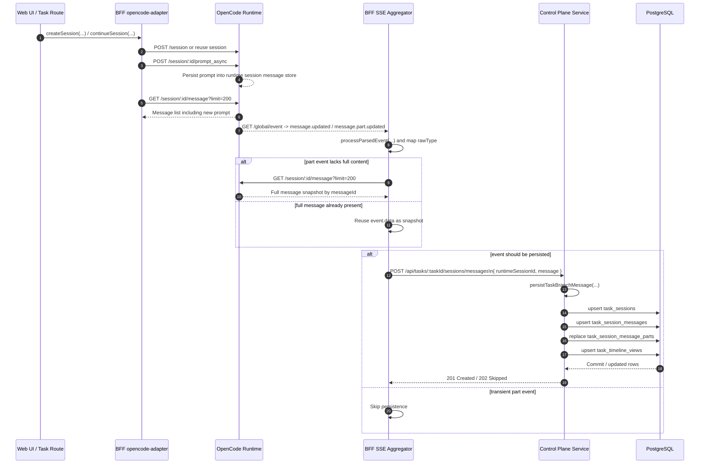
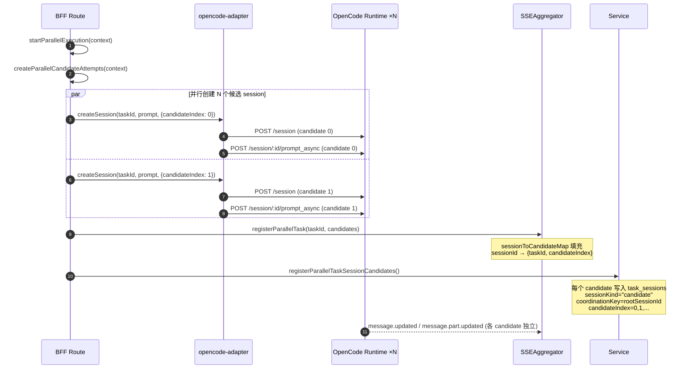
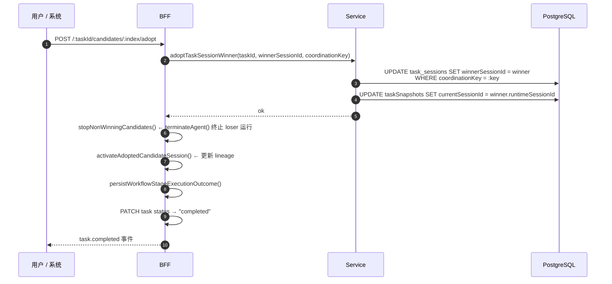
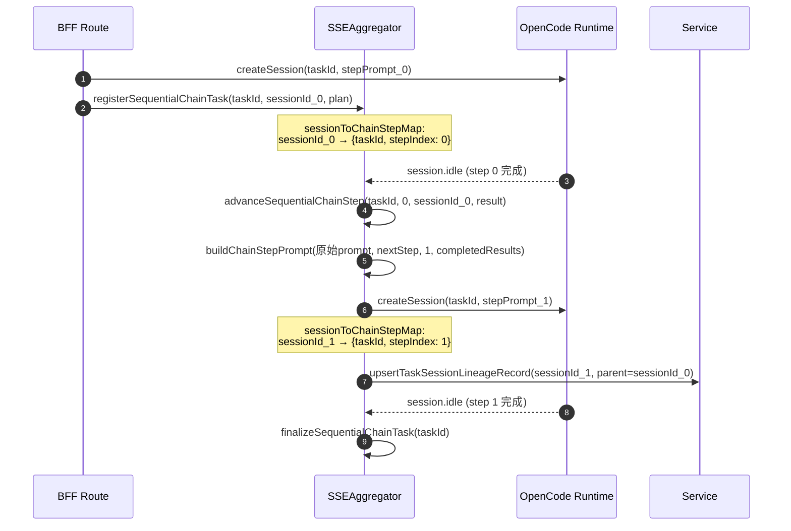

# Task Session Message 写链说明 — 当前镜像链 + 上游运行时 + 流式差距

> 状态：Draft v4
> 日期：2026-03-31
> 作者：GitHub Copilot
> 关联文档：[opencode-runtime-protocol.md](opencode-runtime-protocol.md)、[runtime-process-architecture.md](runtime-process-architecture.md)、[task-session-message-roundtrip-target-plan.md](task-session-message-roundtrip-target-plan.md)

## 1. 文档目的

这份文档回答三个问题：

1. **当前镜像写链**（§ 2 - § 9）：task session message 如何从 OpenCode runtime 写入 control-plane 数据库。描述的是当前代码已经在执行的实际链路。
2. **上游真实执行链**（§ 10 - § 11）：OpenCode runtime 内部从 HTTP 路由到 LLM 流式输出再到全局 SSE 的完整链路。
3. **流式差距与改造方向**（§ 12 - § 15）：当前外层为什么只做到"较粗粒度增量"，以及 OpenCode 底层如何持久化 session/message/part 和模型数据。
4. **消息写入策略详述**（§ 17 - § 21）：单执行、并行执行、顺序链三种模式下的写入策略，特别是并行候选的 user prompt 路由/去重、event log 与 projection 的分层写入、winner 选择后的可见性切换。

一句话结论：

**当前消息正文的第一事实源仍然是 OpenCode runtime；BFF 通过 runtime 的全局 SSE 事件流观察消息变化，在必要时回读 runtime 完整 message snapshot，再把该 snapshot 发送给 control-plane service；service 最终把它写入 `task_sessions`、`task_session_messages`、`task_session_message_parts` 和 `task_timeline_views`。**

## 2. 总体结论

把这条链路拆开看，可以得到四个稳定结论：

1. runtime 先持有消息，control-plane 数据库后镜像保存。
2. BFF 不是只转发 UI 请求，还承担 runtime 事件聚合、消息补齐和持久化触发。
3. service 持久化时会做角色、时间、parts、状态的规范化，并保留 runtime 原始 payload。
4. 不是每个流式 part 都会单独入库，写链里存在过滤、去重和合并规则。

## 3. 关键时序图



## 4. 端到端分层说明

### 4.1 Runtime 写入层

真正把 prompt 送入运行时的动作，发生在 BFF 的 runtime 适配层：

1. [control-plane/web-ui-bff/src/modules/agent-control/opencode-adapter.ts](../control-plane/web-ui-bff/src/modules/agent-control/opencode-adapter.ts) 的 `createSession(...)`
2. 同文件里的 `continueSession(...)`
3. 同文件里的 `sendPromptWithPersistenceCheck(...)`

这一层实际调用的 runtime 接口是：

1. `POST /session`
2. `POST /session/:id/prompt_async`
3. `GET /session/:id/message?limit=200`

关键点不在于“发送 prompt”本身，而在于发送之后 BFF 会主动轮询 runtime 消息列表，直到能读到这条新消息。也就是说，系统当前默认承认的成功语义是：

1. prompt 已经先进入 runtime 的 message store
2. BFF 才把这次写入当作后续镜像持久化的前提

因此，数据库不是消息进入系统的第一落点。

### 4.2 BFF 观察与补齐层

runtime 的实时变化不是通过 session 级 SSE，而是通过全局事件流进入 BFF：

1. [control-plane/web-ui-bff/src/modules/realtime/sse-aggregator.ts](../control-plane/web-ui-bff/src/modules/realtime/sse-aggregator.ts) 的 `subscribeGlobal(...)` 订阅 `GET /global/event`
2. 同文件里的 `processParsedEvent(...)` 把原始事件转换为内部 `RealtimeEvent`
3. 同文件里的 `persistSessionMessageSnapshot(...)` 负责触发持久化
4. 同文件里的 `resolvePersistableMessageSnapshot(...)` 负责把不完整事件补齐成完整 message snapshot

这一层有两个非常关键的实现点：

1. `message.part.updated` 会先被映射成内部统一的 `message.updated` 类型，之后再进入持久化判断。
2. 如果当前事件只有 part，没有完整正文，或者内容不足以直接持久化，BFF 会再去 runtime 读取一次 `GET /session/:id/message?limit=200`，按 message id 匹配到完整 message snapshot。

所以，BFF 写给 service 的通常不是“增量 token”或“单个 delta 事件”，而是 runtime 当前视角下的一条完整消息快照。

### 4.3 BFF 到 Service 的持久化调用

拿到可持久化的 message snapshot 后，BFF 会通过 [control-plane/web-ui-bff/src/modules/tasks/task-session-compat.ts](../control-plane/web-ui-bff/src/modules/tasks/task-session-compat.ts) 的 `persistTaskSessionMessageSnapshot(...)` 调 service：

1. 路径是 `POST /api/tasks/:taskId/sessions/messages`
2. 请求体里最关键的两个字段是 `runtimeSessionId` 和 `message`

这里的 `message` 不是 UI 自己重新组装的 DTO，而是尽量保留 runtime payload 形状的 snapshot。

### 4.4 Service 接收与 session 补齐层

service 的接收入口在：

1. [control-plane/service/src/modules/tasks/task-session-routes.ts](../control-plane/service/src/modules/tasks/task-session-routes.ts) 的 `POST /:taskId/sessions/messages`
2. [control-plane/service/src/modules/tasks/task-branch-write.ts](../control-plane/service/src/modules/tasks/task-branch-write.ts) 的 `persistTaskBranchMessage(...)`

`persistTaskBranchMessage(...)` 的处理顺序是：

1. 先确认 task 存在
2. 根据 `runtimeSessionId` 找到现有 session/branch 兼容记录
3. 同步 tree/branch 兼容节点
4. 调 [control-plane/service/src/modules/tasks/task-session-write-api.ts](../control-plane/service/src/modules/tasks/task-session-write-api.ts) 的 `upsertTaskSessionRecord(...)`，确保 `task_sessions` 行存在
5. 如果本次传入的是 standalone part event，则根据 [control-plane/service/src/modules/tasks/task-session-read.ts](../control-plane/service/src/modules/tasks/task-session-read.ts) 的 `shouldPersistStandalonePartEvent(...)` 再做一次过滤
6. 最后才进入 message upsert

这一层意味着，message 写库前，service 会先补齐 session 侧持久化上下文。

### 4.5 Message 规范化与落库层

真正把消息写入数据库的是：

1. [control-plane/service/src/modules/tasks/task-session-message-write-api.ts](../control-plane/service/src/modules/tasks/task-session-message-write-api.ts) 的 `upsertTaskSessionMessageRecord(...)`

这个函数会从 runtime payload 中拆出并规范化：

1. role
2. status
3. createdAt / completedAt
4. textContent / summaryText
5. parts
6. token usage
7. clientMessageId / providerMessageId
8. errorText
9. 原始 `rawPayload`

然后写入四个持久化对象：

1. [control-plane/service/src/db/schema.pg.ts](../control-plane/service/src/db/schema.pg.ts) 里的 `task_sessions`
2. [control-plane/service/src/db/schema.pg.ts](../control-plane/service/src/db/schema.pg.ts) 里的 `task_session_messages`
3. [control-plane/service/src/db/schema.pg.ts](../control-plane/service/src/db/schema.pg.ts) 里的 `task_session_message_parts`
4. [control-plane/service/src/db/schema.pg.ts](../control-plane/service/src/db/schema.pg.ts) 里的 `task_timeline_views`

其中主消息表保存结构化字段和完整 `rawPayload`，parts 表保存拆开的 part 列表，timeline 表保存任务时间线投影。

## 5. 当前真正写入的表

### 5.1 Session 表

`task_sessions` 保存：

1. `runtimeSessionId`
2. parent/root session 关系
3. `sessionKind`
4. `branchName`
5. `selectedModel`
6. 执行状态、活动时间等会话级元数据

### 5.2 Message 主表

`task_session_messages` 保存：

1. 稳定主键 `id`
2. `sessionId`
3. `runtimeMessageId`
4. `role`
5. `status`
6. `messageIndex`
7. `textContent`
8. `summaryText`
9. `rawPayload`
10. `tokenUsed`
11. `startedAt` / `completedAt`
12. `errorText`
13. `createdAt` / `updatedAt`

### 5.3 Message Parts 表

`task_session_message_parts` 保存：

1. `messageId`
2. `partIndex`
3. `partType`
4. `textContent`
5. `jsonPayload`

写法不是增量 append，而是先删除这条消息已有的 parts，再按最新 payload 全量重建。

### 5.4 Timeline 投影表

`task_timeline_views` 会同步写入一条 `itemKind=message` 的时间线项，供任务时间线和相关读模型使用。

## 6. 哪些事件会触发写库

当前不是所有 SSE 消息都直接写数据库，主要规则如下：

1. 完整的 `message.updated` 会尝试持久化。
2. `message.part.updated` 只有在 BFF 或 service 判断该 part 具备持久化价值时才会进入写链。
3. `step-start` 这类瞬时 standalone part 会被跳过。
4. `tool`、`tool-result` 一类 part 在终态时允许进入写链。
5. `source` part 只有在 `completed` 或 `error` 状态才允许进入写链。

因此，数据库里的 message 更接近“完整消息最新态”或“值得保留的终态片段”，而不是原始 SSE 的逐 token 录制。

## 7. 当前写链中的去重与合并规则

### 7.1 Candidate user prompt 去重

并行 candidate session 可能会把同一条 user prompt 重放到多个分支。为避免 task 级聚合时出现重复 user 消息，service 会在写入阶段把这类 candidate user message 重定向到父 session，并在短时间窗口内复用已有父消息。

对应逻辑在：

1. [control-plane/service/src/modules/tasks/task-session-message-write-api.ts](../control-plane/service/src/modules/tasks/task-session-message-write-api.ts) 的 `resolveTaskSessionMessageTarget(...)`

### 7.2 Assistant tool-call 与 final stop 合并

runtime 可能先产出一条带 tool parts 的 assistant 消息，随后又产出一条同文本的 final stop assistant 消息。当前写链会在满足条件时把后者合并到前一条记录里，避免数据库中出现两条语义上等价的 assistant 回复。

对应逻辑在：

1. [control-plane/service/src/modules/tasks/task-session-message-write-api.ts](../control-plane/service/src/modules/tasks/task-session-message-write-api.ts) 的 `shouldMergeAssistantToolCallFollowup(...)`
2. 同文件里的 `buildMergedAssistantToolCallFollowupPayload(...)`

### 7.3 幂等写入

主消息主键由 session 和 runtime message id 组合构成。结果是：

1. 同一条 runtime message 被重复回放时，不会无穷新增消息行
2. 已存在的行会通过 upsert 更新为更新后的最新态
3. 这也是后续可以通过 replay runtime message snapshot 修复历史坏数据的基础

## 8. 这条链路的真实语义

当前系统的消息主从关系不是“control-plane 数据库先写，runtime 后消费”，而是：

1. runtime 先成为消息正文的真源
2. BFF 通过 SSE 和必要的 runtime 回读，把真源消息补齐成可持久化 snapshot
3. service 再把 snapshot 镜像成结构化数据库记录

因此，control-plane 这里承担的是“任务域内可查询、可聚合、可回放的镜像持久化层”，而不是消息的第一写入者。

## 9. 一句话总结

当前 task session message 的实际数据库写入路径是：

1. BFF 通过 `createSession(...)` 或 `continueSession(...)` 把 prompt 发给 runtime
2. runtime 把 prompt 和后续 assistant/tool 消息写进自己的 session message store
3. BFF 订阅 `GET /global/event`，在 `message.updated` / `message.part.updated` 时尝试持久化
4. 必要时 BFF 再次调用 `GET /session/:id/message?limit=200` 把消息补齐为完整 snapshot
5. BFF 调 `POST /api/tasks/:taskId/sessions/messages`
6. service 先 upsert `task_sessions`
7. service 再 upsert `task_session_messages`、重建 `task_session_message_parts`，并同步 `task_timeline_views`

所以，**当前真实写链是 runtime -> global SSE -> BFF snapshot hydrate -> service upsert task session tables，而不是数据库先写、runtime 后补。**

---

## 文档扩展范围

前面 § 1 - § 9 描述的是 **OpenerX control-plane 内部已实现的镜像写链**——从 BFF 发 prompt 到 service 写库。

下面追加三大节，将视角向上延伸到 **OpenCode runtime 本体**：

1. **上游执行链路**（§ 10 - § 11）：从 HTTP 路由到 LLM 流式输出再到全局 SSE，这条链走完之后才会进入上面描述的 BFF 观察层。
2. **真流式差距**（§ 12 - § 13）：上游实际产出 `message.part.delta` 粒度的增量，但 OpenerX 外层（BFF + 前端）目前只利用了 `message.updated` / `message.part.updated`。
3. **底层存储模型**（§ 14 - § 15）：OpenCode 自己的 SQLite 持久化和"哪些数据落盘、哪些只存在于流中"。

> **边界说明**：本轮内容仍然是研究 + 文档化 + 改造清单，不包含真实代码改造。改造实施方案如果需要，建议另起一份 streaming retrofit plan。

---

## Part 2 — 上游 OpenCode Runtime 执行链路

### 10. 上游执行链路总体时序

```mermaid
sequenceDiagram
    autonumber
    participant Client as BFF / CLI
    participant Route as session.ts Route
    participant Prompt as SessionPrompt
    participant Loop as prompt loop()
    participant LLM as LLM.stream()
    participant SDK as AI SDK streamText()
    participant Provider as Provider SDK
    participant Proc as SessionProcessor
    participant Session as Session (index.ts)
    participant DB as SQLite
    participant Bus as Bus / GlobalBus
    participant SSE as GET /global/event

    Client->>Route: POST /session/:id/prompt_async
    Route->>Prompt: SessionPrompt.prompt(input)
    Prompt->>Session: createUserMessage(input)
    Session->>DB: INSERT message (user)
    Session-->>Bus: [deferred] message.updated
    Prompt->>Session: Session.touch(sessionID)

    Prompt->>Loop: loop()
    Loop->>Loop: scan messages: lastUser, lastAssistant
    Loop->>LLM: LLM.stream(messages, model, tools, system)
    LLM->>SDK: streamText({ model, messages, tools, ... })
    SDK->>Provider: provider.doStream(...)
    Provider-->>SDK: async iterable of stream chunks

    Loop->>Proc: SessionProcessor.process(stream)

    Note over Proc,DB: for await (stream.fullStream)

    Proc->>Session: updatePart(TextPart) on text-start
    Session->>DB: INSERT part
    Session-->>Bus: [deferred] message.part.updated

    Proc->>Session: updatePartDelta({delta}) on text-delta
    Session-->>Bus: [immediate] message.part.delta ← 不落盘

    Proc->>Session: updatePart(TextPart) on text-end
    Session->>DB: UPSERT part (完整文本)
    Session-->>Bus: [deferred] message.part.updated

    Proc->>Session: updateMessage(assistantMsg) on finish-step
    Session->>DB: UPSERT message (tokens/cost/finish)
    Session-->>Bus: [deferred] message.updated

    Bus-->>SSE: GlobalBus.emit → stream.writeSSE()
    SSE-->>Client: message.updated / message.part.updated / message.part.delta
```

#### 共享入口语义

| HTTP 接口 | 语义 | 调用 `SessionPrompt.prompt()` | 返回时机 |
| --- | --- | --- | --- |
| `POST /session/:id/message` | 同步 | 是；await loop 完成 | 等模型输出完毕后返回完整消息 |
| `POST /session/:id/prompt_async` | 异步 | 是；fire-and-forget | 立即返回 204，loop 在后台继续 |

两者在内部共享同一条 `SessionPrompt.prompt() → loop() → SessionProcessor.process()` 主链。异步接口只是不等待 loop 的返回值。

### 11. 源码级分层说明

#### 11.1 HTTP 接口层

[opencode/packages/opencode/src/server/routes/session.ts](../../opencode/packages/opencode/src/server/routes/session.ts)

入口路由把 HTTP 请求翻译成 `SessionPrompt.prompt(input)`。`prompt_async` 的实现不过是 `prompt(input)` 之后不 `await`。

`GET /session/:id/message` 从 SQLite 分页读取 `MessageV2.WithParts[]`，是 BFF 回读完整快照的唯一路径。

#### 11.2 SessionPrompt → loop()

[opencode/packages/opencode/src/session/prompt.ts](../../opencode/packages/opencode/src/session/prompt.ts)

1. `createUserMessage(input)` — 先把 user prompt 写入 SQLite message 表，事务提交后延迟发布 `message.updated`。
2. `Session.touch(sessionID)` — 更新 session 的 `time_updated`，发布 `session.updated`。
3. `loop()` — 无限 while 循环：
   - 向后扫描 `MessageV2.stream(sessionID)` 找到 `lastUser`、`lastAssistant`、`lastFinished`。
   - **退出条件**：最新 assistant 的 `finish ∉ {null, "tool-calls", "unknown"}` 且 `lastUser < lastAssistant`。
   - 正常路径调 `SessionProcessor.process()`；如果返回 `"tool-calls"` 则继续循环。

#### 11.3 LLM.stream()

[opencode/packages/opencode/src/session/llm.ts](../../opencode/packages/opencode/src/session/llm.ts)

调用 AI SDK 的 `streamText()`：

```typescript
streamText({
  model: options.api,        // provider SDK 实例
  messages,                  // 完整对话历史
  tools,                     // 注册工具
  system: system.join("\n"), // 系统提示
  maxTokens,
  temperature,
  abortSignal,
  experimental_repairToolCall, // 工具名大小写自动修复
  ...
})
```

`streamText()` 来自 `import { streamText } from "ai"`（Vercel AI SDK），返回异步可迭代 `stream.fullStream`。

#### 11.4 SessionProcessor.process()

[opencode/packages/opencode/src/session/processor.ts](../../opencode/packages/opencode/src/session/processor.ts)

`for await (const event of stream.fullStream)` 里处理的核心事件类型：

| 流事件 | 处理动作 | 是否落盘 |
| --- | --- | --- |
| `text-start` | 创建空 `TextPart`，`Session.updatePart()` | ✓ INSERT |
| `text-delta` | 拼接文本，`Session.updatePartDelta()` | ✗ 仅发事件 |
| `text-end` | trim + plugins，`Session.updatePart()` | ✓ UPSERT |
| `reasoning-start` | 创建 `ReasoningPart` | ✓ INSERT |
| `reasoning-delta` | 拼接，`Session.updatePartDelta()` | ✗ 仅发事件 |
| `tool-input-start` | 创建 `ToolPart` state=pending | ✓ INSERT |
| `tool-call` | state=running + input | ✓ UPSERT |
| `tool-result` | state=completed + output | ✓ UPSERT |
| `tool-error` | state=error | ✓ UPSERT |
| `finish-step` | 更新 assistant message 的 tokens/cost/finish | ✓ UPSERT |

**关键证据**：`streamText()` 和 `for await (stream.fullStream)` 是内部流式执行的核心路径。

#### 11.5 Session.updateMessage / updatePart / updatePartDelta

[opencode/packages/opencode/src/session/index.ts](../../opencode/packages/opencode/src/session/index.ts)

三个写入函数的持久化边界完全不同：

| 函数 | SQL | 事件 | 时机 |
| --- | --- | --- | --- |
| `updateMessage(msg)` | `INSERT ... ON CONFLICT DO UPDATE` message 行 | `message.updated`（deferred） | 事务提交后 |
| `updatePart(part)` | `INSERT ... ON CONFLICT DO UPDATE` part 行 | `message.part.updated`（deferred） | 事务提交后 |
| `updatePartDelta(input)` | **无** | `message.part.delta`（immediate） | 立即 |

`updatePartDelta` 的实现只有一行 `Bus.publish(MessageV2.Event.PartDelta, input)`——不读不写数据库。这是为了**高频增量文本传输不拖慢 SQLite**。

#### 11.6 Bus → GlobalBus → /global/event SSE

[opencode/packages/opencode/src/bus/index.ts](../../opencode/packages/opencode/src/bus/index.ts) → [opencode/packages/opencode/src/bus/global.ts](../../opencode/packages/opencode/src/bus/global.ts)

1. `Bus.publish(def, properties)` 触发本地订阅者，同时 emit 到 `GlobalBus`。
2. `GlobalBus` 是一个进程级 `EventEmitter`。
3. `/global/event` route 注册在 `GlobalBus.on("event", handler)`，通过 `stream.writeSSE()` 推给所有连接的客户端。
4. 每条 SSE 数据格式：`{ directory?, payload: { type, properties } }`。
5. 心跳每 10 秒发一次 `server.heartbeat`。

所有三类事件（`message.updated`、`message.part.updated`、`message.part.delta`）都通过同一条 SSE 通道抵达 BFF。

---

## Part 3 — 当前 OpenerX 为什么还不是真流式

### 12. 上游事件 vs 当前外层处理对照表

BFF 和前端对上游三类消息事件的处理方式完全不同：

| 上游 SSE 事件 | 含义 | 频率 | BFF sse-aggregator 处理 | BFF 衍生事件 | TaskDetailV3.vue 处理 |
| --- | --- | --- | --- | --- | --- |
| `message.updated` | 完整消息（含 tokens/cost/finish） | 低频（每条消息生命周期几次） | `transformEvent()` 映射为内部 `message.updated`，触发 `persistSessionMessageSnapshot()` 写 service | `task.message.updated` | **处理** — 触发 `scheduleTaskRefresh()` |
| `message.part.updated` | 单个 part 完整态（text-end / tool 终态） | 中频（每个 part 终态一次） | `transformEvent()` 也映射为内部 `message.updated`；`buildTaskDomainEvents()` 检查 `rawType`：若为文本 part → 生成 `task.message.delta`；`persistSessionMessageSnapshot()` 检查 part 终态后决定是否写 service | `task.message.delta`（文本 part）或 `task.message.updated`（触发持久化时） | `task.message.delta` → **忽略**（第 2712 行）；`task.message.updated` → 处理 |
| `message.part.delta` | 增量文本 token（text-delta / reasoning-delta） | **极高频**（每个 token 一次） | **`eventTypeMap` 中无此条目 → `transformEvent()` 返回 `null` → 直接丢弃** | 无 | 不可达 |

> **关键发现**：BFF 当前产出的 `task.message.delta` 并非来自上游的 `message.part.delta`（它被丢弃），而是来自 `message.part.updated`（part 完整态/中间态）。这意味着：
>
> 1. 上游真正按 token 粒度推送的增量事件被 BFF 完全忽略。
> 2. BFF 当前广播的 `task.message.delta` 实际是"part 级快照中的文本 diff"，不是逐 token 流。
> 3. 即便前端开始消费 `task.message.delta`，也无法获得打字机效果，因为数据源本身就不是逐 token 的。

### 差距的具体代码证据

**BFF 侧** — [sse-aggregator.ts](../control-plane/web-ui-bff/src/modules/realtime/sse-aggregator.ts)：

`transformEvent()` 第 1424-1436 行 `eventTypeMap`：

```typescript
const eventTypeMap: Record<string, RealtimeEventType> = {
  "session.created": "session.created",
  "session.updated": "session.updated",
  "session.status": "session.status",
  "session.idle": "session.idle",
  "session.error": "session.error",
  "message.updated": "message.updated",
  "message.part.updated": "message.updated",  // ← 仅此条
  "tool.execute.before": "tool.execute.before",
  "tool.execute.after": "tool.execute.after",
};
// "message.part.delta" 不在 map 中 → return null → 丢弃
```

`buildTaskDomainEvents()` 第 1340-1400 行：当 `rawType === "message.part.updated"` 且 `partType === "text"` 时，构造 `task.message.delta` 事件，附带的 `delta` 字段取自 `event.data.delta ?? part.text`——这是 part 级快照文本，不是逐 token 增量。

**前端侧** — [TaskDetailV3.vue](../control-plane/web-ui/src/pages/TaskDetailV3.vue) 第 2704-2741 行的 watcher：

```typescript
if (eventKind === "task.message.delta") return;  // 第 2712 行
```

前端收到 `task.message.delta` 后直接 `return`，不做任何处理。消息展示完全依赖 `useTreeMessages` 从执行追踪快照加载——这是一个 poll 模型，不是 push 模型。

**结论**：差距存在于两个层面：

1. **BFF 层**：上游 runtime 真正按 token 粒度推送的 `message.part.delta` 事件被 BFF 的 `eventTypeMap` 直接丢弃（不在 map 中）。BFF 当前广播的 `task.message.delta` 实际来源是 `message.part.updated`（part 完整态快照），粒度远比逐 token 粗。
2. **前端层**：即便 BFF 已经广播了 `task.message.delta`，TaskDetailV3 也选择忽略它，转而依赖快照刷新。

因此，要实现真流式 UX 需要改两层：BFF 先订阅上游 `message.part.delta` 并转发逐 token 增量，前端再消费这些增量做打字机渲染。

### 13. 流式改造清单

以下是把外层改成真流式的改造点，按模块分组。**本轮不实施**，仅作为改造清单列出。

#### 13.1 BFF — SSE 事件桥接与 mapper

| 改造点 | 目标模块 | 关键函数 | 建议方向 | 为什么必要 |
| --- | --- | --- | --- | --- |
| 订阅上游 `message.part.delta` | `sse-aggregator.ts` `transformEvent()` | `eventTypeMap` | 在 `eventTypeMap` 中新增 `"message.part.delta": "message.part.delta"` 条目，使其不再被 `return null` 丢弃 | 当前 BFF 完全不接收上游逐 token 增量，这是整条链路的第一个断点 |
| 生成专用 delta 衍生事件 | `sse-aggregator.ts` `buildTaskDomainEvents()` | delta 分支 | 为已映射的 `message.part.delta` 事件生成 `task.message.part.delta`，payload 包含 `{messageId, partId, partType, field, delta}` | 前端需要按 partId 精确拼接增量文本 |
| 持久化节流 | `sse-aggregator.ts` `persistSessionMessageSnapshot()` | 持久化判断 | `message.part.delta` 事件只广播不持久化；保持现有逻辑：仅在 `message.part.updated` / `message.updated` 终态触发持久化 | 避免高频 delta 触发大量 service 写入 |

#### 13.2 公共 Realtime Contract

| 改造点 | 目标模块 | 关键函数 | 建议方向 | 为什么必要 |
| --- | --- | --- | --- | --- |
| 新增事件类型 | `web-ui-bff/src/types/events.ts` | `RealtimeEventType` | 新增 `task.message.part.delta` 类型，数据结构：`{ messageId, partId, partType, delta }` | 让前端和 BFF 有统一的流式增量协议 |
| 事件的顺序语义 | — | — | 约定 delta 流以 `task.message.updated` 终止，前端可据此判断消息完成 | 避免前端不知道 delta 什么时候结束 |

#### 13.3 前端 — Normalized Message Store / Reducer

| 改造点 | 目标模块 | 关键函数 | 建议方向 | 为什么必要 |
| --- | --- | --- | --- | --- |
| 新增 streaming message buffer | `web-ui/src/stores/` | 新建或扩展 `realtime` store | 维护一个 `Map<messageId, { parts: Map<partId, string>, streaming: boolean }>` 的前端 buffer，delta 事件往 buffer 追加 | 让 delta 在 UI 可见，而不必等快照刷新 |
| 合并 buffer 与快照 | `web-ui/src/composables/useTreeMessages` | message 列表组装 | 快照消息与 buffer 中的 streaming 消息 merge；当收到完整 `task.message.updated` 后，用快照替换 buffer | 保证已完成消息仍以快照为准 |

#### 13.4 前端 — TaskDetailV3 流式渲染

| 改造点 | 目标模块 | 关键函数 | 建议方向 | 为什么必要 |
| --- | --- | --- | --- | --- |
| 取消 delta 忽略 | `TaskDetailV3.vue` 第 2712 行 | realtime event watcher | 去掉 `if (eventKind === "task.message.delta") return;`，改为把 delta 写入 streaming buffer | 这是当前"不是真流式"最直接的修复点 |
| 逐字渲染 | `TaskDetailV3.vue` message 渲染组件 | 消息文本渲染 | 对 `streaming: true` 的消息使用即时渲染，不等快照 | 用户看到打字机效果 |

#### 13.5 可选 — 持久化策略

| 改造点 | 目标模块 | 建议方向 | 为什么必要 |
| --- | --- | --- | --- |
| delta 不落盘 service | `task-session-message-write-api.ts` | delta 阶段不写 service 数据库；只在 `message.updated` / `message.part.updated` 终态写一次 | 和上游 OpenCode 保持一致的持久化语义：delta 是瞬时事件 |
| BFF 本地 delta cache | `sse-aggregator.ts` | 可选：BFF 维护内存 delta buffer，新连接的 UI 可以恢复流 | 避免浏览器刷新后看到空白 |

#### 13.6 测试验证

| 改造点 | 目标模块 | 建议方向 | 为什么必要 |
| --- | --- | --- | --- |
| BFF delta 广播单测 | `tests/web-ui-bff/` | mock 上游 SSE 事件，断言 `task.message.part.delta` 事件正确产出 | 验证桥接逻辑 |
| 前端 streaming store 单测 | `tests/web-ui/` | delta → buffer → merge 快照的 reducer 测试 | 验证 buffer 合并逻辑 |
| E2E 打字机效果 | Playwright | 发送 prompt → 观察 UI 逐字出现 → 最终和快照一致 | 验证端到端流式体验 |

> **改造优先级**：先改 BFF 事件桥接订阅 `message.part.delta`（§ 13.1），再改 TaskDetailV3 消费（§ 13.4）——这两步是让用户看到打字机效果的最短路径。如果只改前端不改 BFF，前端消费的仍然是 part 级快照 delta，体验不会有质变。

---

## Part 4 — OpenCode 底层如何存储模型数据和消息数据

### 14. SQLite 数据库位置与核心表结构

#### 14.1 数据库文件位置

```text
$XDG_DATA_HOME/opencode/opencode.db          # latest / beta channel
$XDG_DATA_HOME/opencode/opencode-{channel}.db # 其他 channel
```

`Global.Path.data` 由操作系统标准路径决定。数据库使用 **drizzle-orm** 管理 SQLite，启动时自动应用 migration。

#### 14.2 三张核心表

##### session 表

| 列 | 类型 | 说明 |
| --- | --- | --- |
| `id` | TEXT PK | SessionID |
| `project_id` | TEXT FK → project | 所属项目 |
| `workspace_id` | TEXT | 工作区标识 |
| `parent_id` | TEXT (self-ref) | fork 的父 session |
| `slug` | TEXT | URL slug |
| `directory` | TEXT | 工作目录 |
| `title` | TEXT | 会话标题 |
| `version` | TEXT | 版本号 |
| `share_url` | TEXT | 分享链接 |
| `summary_additions` | INTEGER | git 增量 |
| `summary_deletions` | INTEGER | git 删除 |
| `summary_files` | INTEGER | 变更文件数 |
| `summary_diffs` | JSON | FileDiff[] |
| `revert` | JSON | 回滚信息 |
| `permission` | JSON | 权限规则集 |
| `time_created` | INTEGER | 创建时间 |
| `time_updated` | INTEGER | 更新时间 |
| `time_compacting` | INTEGER | 压缩中时间 |
| `time_archived` | INTEGER | 归档时间 |

索引：`project_id`、`workspace_id`、`parent_id`。

##### message 表

| 列 | 类型 | 说明 |
| --- | --- | --- |
| `id` | TEXT PK | MessageID |
| `session_id` | TEXT FK → session (cascade) | 所属 session |
| `time_created` | INTEGER | 创建时间 |
| `time_updated` | INTEGER | 更新时间 |
| `data` | JSON | `InfoData`：包含 role、time、parentID、model、agent、cost、tokens、finish、error 等全部元数据 |

索引：`(session_id, time_created, id)` — 优化按时间顺序拉取消息。

`data` JSON 里存储的典型字段：

```typescript
{
  role: "user" | "assistant",
  time: { created, completed },
  parentID?: MessageID,           // 父消息引用
  model?: { providerID, modelID },// 模型信息在这里
  agent?: { agentID },
  cost?: number,                  // 花费（美元）
  tokens?: { input, output },     // token 用量
  finish?: "end-turn" | "tool-calls" | ...,
  error?: string,
  metadata?: Record<string,unknown>
}
```

##### part 表

| 列 | 类型 | 说明 |
| --- | --- | --- |
| `id` | TEXT PK | PartID |
| `message_id` | TEXT FK → message (cascade) | 所属 message |
| `session_id` | TEXT | 所属 session（冗余，加速查询） |
| `time_created` | INTEGER | 创建时间 |
| `time_updated` | INTEGER | 更新时间 |
| `data` | JSON | `PartData`：按 type 区分，包含 text / tool / reasoning / step-finish 等不同结构 |

索引：`(message_id, id)`、`session_id`。

`data` JSON 按 `type` 字段区分存储内容：

| part type | data 中的关键字段 |
| --- | --- |
| `text` | `{ type: "text", text: string }` |
| `tool` | `{ type: "tool", toolName, input, output, state, tool }` |
| `reasoning` | `{ type: "reasoning", text: string }` |
| `step-finish` | `{ type: "step-finish", tokens, cost }` |

#### 14.3 模型数据存储位置

模型相关的数据**不在独立的模型表里**，而是分散存储在 message 和 part 的 JSON 字段中：

| 数据 | 存储位置 | 字段路径 |
| --- | --- | --- |
| providerID | message.data | `data.model.providerID` |
| modelID | message.data | `data.model.modelID` |
| input tokens | message.data | `data.tokens.input` |
| output tokens | message.data | `data.tokens.output` |
| cost (USD) | message.data | `data.cost` |
| finish reason | message.data | `data.finish` |
| error | message.data | `data.error` |
| 单步 token 用量 | part.data (step-finish) | `data.tokens` |
| 单步 cost | part.data (step-finish) | `data.cost` |

### 15. 哪些内容持久化 / 哪些内容只存在于流中

| 内容 | 写入 SQLite？ | 通过 SSE 发出？ | 落盘时机 | 事件名 |
| --- | --- | --- | --- | --- |
| 完整 user message | ✓ | ✓ | `createUserMessage()` 立即 INSERT | `message.updated` |
| 完整 assistant message（含 tokens/cost/finish） | ✓ | ✓ | `finish-step` 时 UPSERT | `message.updated` |
| 完整 text part（最终文本） | ✓ | ✓ | `text-end` 时 UPSERT | `message.part.updated` |
| 完整 tool part（终态） | ✓ | ✓ | `tool-result` / `tool-error` 时 UPSERT | `message.part.updated` |
| 完整 reasoning part | ✓ | ✓ | 创建时 INSERT，结束时 UPSERT | `message.part.updated` |
| step-finish part | ✓ | ✓ | `finish-step` 时 INSERT | `message.part.updated` |
| **text delta（逐 token 增量）** | **✗** | **✓** | **不落盘** | `message.part.delta` |
| **reasoning delta（逐 token 增量）** | **✗** | **✓** | **不落盘** | `message.part.delta` |
| tool-input delta | ✗ | ✓ | 不落盘 | `message.part.delta` |

**核心结论**：

1. **完整 message 和完整 part 会 upsert 到 SQLite**——以 `id` 为主键做 ON CONFLICT UPDATE，保证幂等。
2. **增量 delta 不落盘**——`updatePartDelta()` 只发 bus 事件，不碰数据库。这是性能优化：高频 delta 如果每次都写 SQLite，会严重拖慢流式输出。
3. **最终完成态才形成稳定的 text part 内容**——`text-end` 事件触发 `updatePart()` 时，part 的 `text` 字段才是最终值。在此之前，如果进程崩溃，已发出的 delta 会丢失，但不会导致数据库状态不一致（因为 delta 本来就没写进去）。
4. **模型信息（providerID/modelID/tokens/cost）存储在 message 的 `data` JSON 里**，不是独立表。只有当 `finish-step` 触发 `updateMessage()` 后才会持久化到数据库。

---

### 16. 全局一句话总结

OpenCode runtime 内部是**真流式**架构：`streamText()` → `for await (stream.fullStream)` → 逐 token 的 `text-delta` / `reasoning-delta` 事件，通过 `Bus → GlobalBus → /global/event` SSE 实时推送。但 OpenerX 外层断在两个地方：**BFF 的 `eventTypeMap` 不包含 `message.part.delta`**，上游逐 token 增量被直接丢弃；BFF 从 `message.part.updated`（part 完整态）拼出的 `task.message.delta` 也被**前端 TaskDetailV3 第 2712 行直接 `return` 忽略**。双重断链导致用户看到的是快照刷新而不是打字机效果。要实现真流式 UX，最短路径是先改 BFF 订阅 `message.part.delta`（§ 13.1），再改前端消费（§ 13.4），不需要改 runtime。

---

## Part 5 — 消息写入策略详述：单执行、并行执行与顺序链

### 17. 三种执行模式总览

当前系统支持三种执行模式，通过 `startTaskExecutionByPlan()` 分发：

| 执行模式 | 触发条件 | Session 创建数 | session 关系拓扑 | 写入差异 |
| --- | --- | --- | --- | --- |
| **单执行** (single) | `plan.mode !== "parallel"` 且无 chain steps | 1 | 单根 session | 标准写链（§ 4 描述） |
| **并行执行** (parallel) | `plan.mode === "parallel"` 且 `plan.candidates.length > 1` | N+1（1 个 root + N 个 candidate） | root → N 个 candidate | 候选用户消息路由到 root，assistants 各自独立；winner 选中后 loser 消息保留但退出默认视图 |
| **顺序链** (sequential_chain) | plan 含 chain steps | 依次创建（step 0 完成后创建 step 1） | step 0 → step 1 → step 2 → ... | 每个 step 是独立 session，prompt 包含前序 step 结果；步间自动推进 |

对应入口：

```typescript
// control-plane/web-ui-bff/src/modules/tasks/routes.ts
async function startTaskExecutionByPlan(executionContext: ExecutionContext) {
  if (isSequentialChainExecution(executionContext.plan)) {
    return startSequentialChainExecution(executionContext);
  }
  if (isParallelExecution(executionContext.plan)) {
    return startParallelExecution(executionContext);
  }
  return startSingleExecution(executionContext);
}
```

### 18. 并行执行写入策略

#### 18.1 并行执行启动流程



关键实现细节：

1. **候选并行创建** — `createParallelCandidateAttempts()` 用 `Promise.all()` 同时创建所有候选 session，每个候选调用 `createSession()` 在 runtime 上创建新 session 并发送 prompt。
2. **内存映射注册** — `registerParallelTask()` 把每个候选的 `sessionId → { taskId, candidateIndex }` 写入 `sessionToCandidateMap`，供后续 SSE 事件解析使用。
3. **Service 侧 session 注册** — 每个候选 session 在 `task_sessions` 表中记录 `sessionKind = "candidate"`、`candidateIndex`、`coordinationKey = rootSessionId`，用于后续路由与去重。

#### 18.2 并行候选的消息写入分叉

并行执行中，每个候选 session 对同一条 user prompt 各自执行模型推理，产生独立的 assistant 消息。这导致一个核心问题：**如果 N 个候选各写一份 user prompt，任务级消息列表里就会出现 N 条重复的用户消息。**

系统通过两级机制解决这个问题：

**第一级：event log 忠实记录**

```typescript
// task-branch-write.ts — persistTaskBranchMessage()
const eventId = await appendMessageEvent({
  taskId,
  sessionId: body.runtimeSessionId, // ← 候选自己的 sessionId
  message: body.message,
});
```

`appendMessageEvent()` 对所有消息一视同仁——无论是 root session、candidate session、user 还是 assistant，都按原始 `runtimeSessionId` 写入 `task_message_events` 表。event log 保留完整的事实记录，不做路由或去重。

**第二级：投影层路由与去重**

```typescript
// task-session-message-write-api.ts — upsertTaskSessionMessageRecord() 内部
const routedTarget = await resolveTaskSessionMessageTarget({
  task, runtimeSessionId, role, textContent, createdAt,
  resolveTaskSessionRecordByRuntimeSessionId: deps.resolve...,
});

if (routedTarget?.existingMessageId) {
  // 父 session 已有相同用户消息 → 直接复用，跳过写入
  return { messageId: routedTarget.existingMessageId, ... };
}

// sessionId 优先使用路由结果（父 session），而非候选自己的 session
const sessionId = routedTarget?.sessionId ?? autoCreate();
```

`resolveTaskSessionMessageTarget()` 的路由判定条件（**全部满足才路由到父 session**）：

| 条件 | 检查内容 | 来源 |
| --- | --- | --- |
| `role === "user"` | 仅路由用户消息 | 消息 payload |
| `textContent` 非空 | 空消息不路由 | 消息 payload |
| `sessionKind === "candidate"` | 仅候选 session 触发路由 | `task_sessions` 表 |
| `parentRuntimeSessionId` 存在 | 候选必须有父 session | `task_sessions` 表 |
| 父 session 记录存在 | 能找到父 session | `task_sessions` 表 |
| 文本完全匹配 | 父 session 中存在 `textContent` 相同的 user 消息 | `task_session_messages` 表 |
| 时间窗口内 | `abs(existing.createdAt - incoming.createdAt) ≤ 15 秒` | 常量 `CANDIDATE_USER_MESSAGE_DEDUPE_WINDOW_MS` |

#### 18.3 并行消息写入时序（逐事件分析）

以 2 个候选（C0, C1）执行同一条 prompt "实现登录功能" 为例：

```
时间轴 →

1. C0 user prompt 写入
   event_log: {sessionId: C0, role: user, text: "实现登录功能"}
   projection:  resolveTarget() 发现 C0 是 candidate + 有 parent
                parent session P 中没有同文本 user 消息
                → 路由到 P，在 P 下写入 user 消息（id = M1）

2. C1 user prompt 写入（几乎同时）
   event_log: {sessionId: C1, role: user, text: "实现登录功能"}
   projection:  resolveTarget() 发现 C1 是 candidate + 有 parent
                parent session P 中已存在 M1（文本相同 + 15 秒内）
                → 复用 M1，跳过写入

3. C0 assistant 消息写入
   event_log: {sessionId: C0, role: assistant, text: "方案 A ..."}
   projection:  role !== "user" → resolveTarget() 返回 null
                → 写入 C0 自己的 session

4. C1 assistant 消息写入
   event_log: {sessionId: C1, role: assistant, text: "方案 B ..."}
   projection:  同上
                → 写入 C1 自己的 session
```

结果：

| 表 | C0 user | C1 user | C0 assistant | C1 assistant |
| --- | --- | --- | --- | --- |
| `task_message_events` | ✓ sessionId=C0 | ✓ sessionId=C1 | ✓ sessionId=C0 | ✓ sessionId=C1 |
| `task_session_messages` | → 路由到 P（M1） | → 复用 M1（跳过写入） | ✓ sessionId=C0 | ✓ sessionId=C1 |

**event log 保留完整事实（4 条），projection 表只有 3 条有效记录（user prompt 去重后归属 parent）。**

#### 18.4 并行 session 的区分字段

`task_sessions` 表中并行候选的特征字段：

```
task_sessions:
  id:                     task-session:{taskId}:{runtimeSessionId}
  sessionKind:            "candidate"              ← 区分于 "primary" / "judge"
  candidateIndex:         0 / 1 / 2 / ...          ← 候选位序
  coordinationKey:        rootSessionId             ← 同一轮并行共享此值
  executionModeSnapshot:  "parallel"                ← 执行模式快照
  parentSessionId:        root session 的 record ID  ← 回溯到主 session

唯一约束: (taskId, coordinationKey, candidateIndex)
```

`coordinationKey` 是所有同轮候选共享的分组键（取值为 root session ID），winner 选择后写入 `winnerSessionId` 到同一 coordination group 的所有记录。

#### 18.5 Winner 选择与消息可见性切换



winner 选择的核心写操作：

1. **`task_sessions`** — 同一 `coordinationKey` 下所有记录的 `winnerSessionId` 被设为 winner
2. **`taskSnapshots.currentSessionId`** — 更新为 winner 的 `runtimeSessionId`

**消息可见性切换机制**：所有读取任务消息的 API 都通过 `resolveTaskSessionSelection({ currentSessionId })` 决定加载哪个 session。adoption 更新 `currentSessionId` 后：

- **Winner session 的消息**：成为任务的默认消息流
- **Loser session 的消息**：仍然存在于各自 session（可通过切换 session 查看），但不出现在任务级默认聊天视图中
- **Parent session 的 user prompt**（去重后的 M1）：由于已路由到 parent，无论谁胜出都可见

#### 18.6 Assistant tool-call 与 final stop 合并

不区分并行/单执行，对所有 session 统一生效。当 runtime 先产出一条带 tool parts 的 assistant 消息（`finish: "tool-calls"`），随后又产出一条同文本的 final stop 消息时，后者会被合并到前一条记录。

合并条件（**全部满足**）：

| 条件 | 检查 |
| --- | --- |
| 最新消息 `role === "assistant"` | 角色匹配 |
| 文本 normalize 后完全相同 | `normalizeTaskSessionMessageComparableText()` 比较 |
| 未重复合并 | `mergedRuntimeMessageIds` 不包含 incoming |
| 最新消息包含 tool parts | `hasTaskSessionMessageToolPart()` |
| 最新消息 `finish === "tool-calls"` | 等待 tool 结果 |
| incoming 消息 `finish !== "tool-calls"` | 有最终结果 |
| `parentID` 相同 | 同一对话上下文 |
| 时间差 ≤ 15 秒 | `ASSISTANT_TOOL_CALL_RESULT_MERGE_WINDOW_MS` |

合并后的记录通过 `buildMergedAssistantToolCallFollowupPayload()` 聚合两条 runtime 消息的 parts、tokens 和 metadata，`mergedRuntimeMessageIds` 数组记录被合并的所有 runtime message ID。

### 19. 顺序链执行写入策略

#### 19.1 顺序链启动与步间推进



#### 19.2 顺序链与并行的写入差异

| 维度 | 并行执行 | 顺序链 |
| --- | --- | --- |
| **Session 创建时机** | 同时创建所有候选 | 逐步创建（step N 完成后才创建 step N+1） |
| **Session 拓扑** | root → N candidates（扇出） | step 0 → step 1 → step 2（链式） |
| **`sessionKind`** | `"candidate"` | `"sequential_step"` |
| **`coordinationKey`** | `rootSessionId`（共享） | `rootSessionId`（共享） |
| **索引字段** | `candidateIndex = 0, 1, 2...` | `stepIndex = 0, 1, 2...` |
| **User prompt 路由** | 候选 user prompt → 路由到 parent | 各 step 独立 prompt（包含前序结果），不路由 |
| **User prompt 去重** | 15 秒窗口内文本匹配去重 | 不去重（各 step prompt 不同） |
| **SSE 跟踪 Map** | `sessionToCandidateMap` | `sessionToChainStepMap` |
| **步间数据传递** | 无（各候选独立） | `buildChainStepPrompt()` 将前序 step 结果注入下一步 prompt |
| **完成判定** | 用户/系统选择 winner | 最后一个 step 的 `session.idle` 触发 `finalizeSequentialChainTask()` |
| **Event log** | 每个候选各自写入 | 每个 step 各自写入 |
| **Projection** | user → parent, assistant → 各自 | 全部写入各自 step session |

### 20. 消息写入可靠性保障

BFF 重启后内存中的 `agentRunRegistry` 丢失，导致 `findAgentRunBySessionId()` 无法将 `sessionId` 映射到 `taskId`，消息写入被静默跳过。修复策略：**写路径增加 DB fallback**，不引入多余的冗余层。

#### 写路径：`persistSessionMessageSnapshot()` 的 taskId 解析

```
event.taskId                             ← transformEvent 已解析（agentRunRegistry 命中时）
  ↓ 为空
sessionToTaskCache.get(sessionId)        ← BFF 本地缓存（命中过的 session 常驻）
  ↓ 未命中
GET /api/tasks/lookup/session-task/:runtimeSessionId   ← Service DB lookup
  → task_sessions.runtime_session_id（唯一索引）
  → 回退 tasks.current_session_id
```

Service 侧的 `resolveTaskByRuntimeSessionId()` 是真正的持久层查询，保证即使 BFF 完全重启、内存全空，也能通过 DB 找回 `taskId`，确保消息写入不丢。

#### 为什么不需要更多层

- `sessionToCandidateMap` / `sessionToChainStepMap` 与 `agentRunRegistry` 同生命周期——如果 `agentRunRegistry` 丢失，它们也丢失，作为 fallback 毫无意义。
- SSE 重连补偿（`reconcileMissedMessages`）解决的是 SSE 断流期间的消息间隙，属于不同问题域，且实现上对每个 session 调 service + runtime 两次 HTTP，成本高、收益低。
- 读路径 runtime fallback 违背"event log first"架构目标——已移除。

### 21. 写入策略一句话总结

| 执行模式 | 写入策略核心 |
| --- | --- |
| 单执行 | runtime 事件 → BFF snapshot → service upsert，标准链路 |
| 并行执行 | N 个候选各自独立写 assistant 消息；user prompt 路由到 parent session 并在 15 秒窗口内去重；event log 忠实记录所有候选的所有消息；winner 选择后通过切换 `currentSessionId` 改变默认可见消息流 |
| 顺序链 | 各 step 独立 session 依次创建执行，prompt 注入前序结果；step 间通过 `advanceSequentialChainStep()` 自动推进；无 user prompt 路由/去重 |
