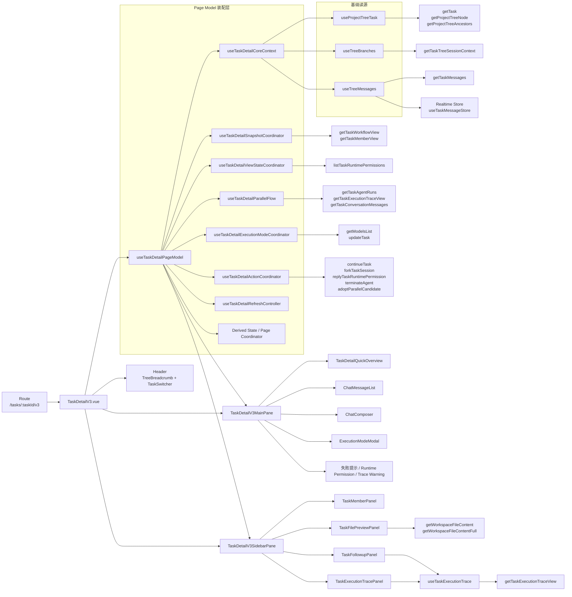
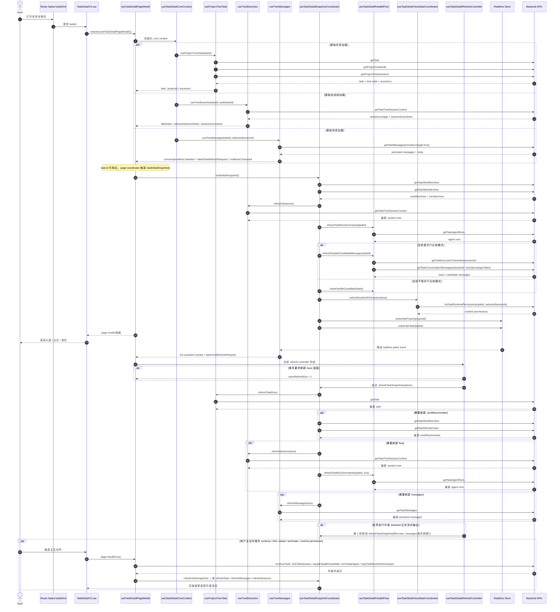

# TaskDetailV3 页面数据流与组件/API 映射

## 概览

`TaskDetailV3.vue` 当前已经被收敛成一个很薄的页面壳层：

- 页面本身只负责读取路由参数、拿到统一的 `page model`、渲染头部、主区和侧栏。
- 主区和侧栏都不再直接各自拼装全页状态，而是消费 `page model` 下的局部分区模型。
- 真正的数据装配入口是 `useTaskDetailPageModel()`。

当前主入口：

- `control-plane/web-ui/src/pages/TaskDetailV3.vue`
- `control-plane/web-ui/src/composables/useTaskDetailPageModel.ts`
- `control-plane/web-ui/src/composables/useTaskDetailPageSectionModels.ts`

## 当前页面怎么显示数据

### 1. 页面壳层

`TaskDetailV3.vue` 只做三件事：

1. 从路由 `/tasks/:taskId/v3` 里拿 `taskId`
2. 调 `useTaskDetailPageModel()` 得到统一的 `page`
3. 把 `page.layout`、`page.header`、`page.main`、`page.sidebar` 分别绑定到页面壳层和子组件

### 2. 基础读源

`useTaskDetailPageModel()` 先调用 `useTaskDetailCoreContext()` 作为基础读源聚合层。

`useTaskDetailCoreContext()` 再拆成三块：

- `useProjectTreeTask()`
  - 负责拿任务基本信息、当前 task 节点、breadcrumb ancestors
- `useTreeBranches()`
  - 负责拿 session tree、session summaries、当前选中 session 节点
- `useTreeMessages()`
  - 负责拿主聊天区消息
  - 采用“persisted canonical baseline + realtime overlay”的策略

### 3. 页面装配层

在 `useTaskDetailPageModel()` 中，基础读源会继续被这些协调层消费：

- `useTaskDetailSnapshotCoordinator()`
  - 负责 workflow/member/flow/messages 的初始快照与 silent refresh
- `useTaskDetailViewStateCoordinator()`
  - 负责 sidebar、文件预览、runtime permissions、trace warning 等视图状态
- `useTaskDetailParallelFlow()`
  - 负责把并行候选、agent runs、trace、session summaries 组装成主聊天区里的并行比较块
- `useTaskDetailExecutionModeCoordinator()`
  - 负责模型列表、execution mode modal、保存执行模式
- `useTaskDetailActionCoordinator()`
  - 负责 continue、fork、terminate、adopt candidate、runtime permission 回复等写操作
- `useTaskDetailRefreshController()`
  - 负责基于 realtime patch 触发延迟刷新和运行期轮询

在这些协调层之上，`useTaskDetailPageModel()` 不再平铺返回几十个字段，而是再收成 4 个分区模型：

- `layout`
  - 页面壳层自身需要的 loading / error
- `header`
  - 头部展示与 task switch
- `main`
  - 主区展示数据与动作
- `sidebar`
  - 侧栏展示数据与动作

### 4. 主区和侧栏怎么拿数据

主区和侧栏都不直接访问路由，也不直接拼装跨域状态：

- `TaskDetailV3MainPane.vue`
  - 直接消费 `page.main` 中的主区展示数据和动作方法
- `TaskDetailV3SidebarPane.vue`
  - 直接消费 `page.sidebar` 中的侧栏展示数据和动作方法

只有侧栏里的某些面板会在自身内部补充独立 API：

- `TaskExecutionTracePanel.vue`
  - 内部使用 `useTaskExecutionTrace()`
- `TaskFollowupPanel.vue`
  - 内部同样使用 `useTaskExecutionTrace()`
- `TaskFilePreviewPanel.vue`
  - 内部独立读取文件内容 API

## 当前用了哪些组件

### 页面壳层组件

- `TreeBreadcrumb`
- `TaskSwitcher`
- `TaskDetailV3MainPane`
- `TaskDetailV3SidebarPane`

### 主区组件

- `TaskDetailQuickOverview`
- `ChatMessageList`
- `ChatComposer`
- `ExecutionModeModal`

主区中还有直接模板块：

- 任务失败告警
- 运行时审批卡片
- trace warning

### 侧栏组件

- `TaskFilePreviewPanel`
- `TaskMemberPanel`
- `TaskFollowupPanel`
- `TaskExecutionTracePanel`

## 当前用了哪些后端 API

### 基础读源 API

来自 `useProjectTreeTask()`：

- `getTask`
- `getProjectTreeNode`
- `getProjectTreeAncestors`

来自 `useTreeBranches()`：

- `getTaskTreeSessionContext`

来自 `useTreeMessages()`：

- `getTaskMessages`

### 页面装配补充 API

来自 `useTaskDetailSnapshotCoordinator()`：

- `getTaskWorkflowView`
- `getTaskMemberView`

来自 `useTaskDetailViewStateCoordinator()`：

- `listTaskRuntimePermissions`

来自 `useTaskDetailParallelFlow()`：

- `getTaskAgentRuns`
- `getTaskExecutionTraceView`
- `getTaskConversationMessages`

来自 `useTaskDetailSequentialStepsCoordinator()`：

- `getTaskConversationMessages`

来自 `useTaskDetailExecutionModeCoordinator()`：

- `getModelsList`
- `updateTask`

来自 `useTaskDetailActionCoordinator()`：

- `continueTask`
- `forkTaskSession`
- `replyTaskRuntimePermission`
- `terminateAgent`
- `adoptParallelCandidate`

### 侧栏面板自身 API

来自 `useTaskExecutionTrace()`：

- `getTaskExecutionTraceView`

来自 `TaskFilePreviewPanel.vue`：

- `getWorkspaceFileContent`
- `getWorkspaceFileContentFull`

### 实时数据来源

除 HTTP API 外，这页还依赖实时事件：

- `realtimeStore.subscribeProject(projectId)`
- `realtimeStore.subscribeTask(taskId)`
- `useTaskMessageStore()` 负责把 realtime patch 变成 live assistant overlay 和 refresh 请求

## 映射图

## 按时间顺序的加载 / 刷新时序图

## 面向重构的组件边界与可继续收口点清单

### 当前边界结论

2026-04-08 本轮进展：

- 已将 session-tree fallback、run/session 选择、selected session 收敛逻辑下沉到 `task-detail-parallel-runtime.ts`
- 已将候选消息源选择、tool output 折叠、并行卡片构造、并行对话插入下沉到 `task-detail-parallel-conversation.ts`
- `useTaskDetailParallelFlow.ts` 已收成 orchestration-only，主要保留 state、computed、watch 和刷新编排
- `useTaskDetailPageModel.ts` 已完成第一阶段拆分：改为返回 `layout/header/main/sidebar` 分区模型，主区和侧栏不再接收整个 `page`

当前 `TaskDetailV3.vue` 已经基本收成页面壳层，继续直接拆页面本身的收益已经不高。

真正还偏厚的边界，现阶段主要在：

1. `task-detail-parallel-conversation.ts`
2. `task-detail-parallel-runtime.ts`
3. `useTaskDetailPageModel.ts`
4. `useTaskDetailActionCoordinator.ts`
5. `TaskDetailV3MainPane.vue`

按当前体量看：

- `TaskDetailV3.vue`: 151 行
- `useTaskDetailPageModel.ts`: 344 行
- `useTaskDetailPageSectionModels.ts`: 207 行
- `TaskDetailV3MainPane.vue`: 190 行
- `TaskDetailV3SidebarPane.vue`: 48 行
- `useTaskDetailParallelFlow.ts`: 371 行
- `task-detail-parallel-runtime.ts`: 597 行
- `task-detail-parallel-conversation.ts`: 804 行
- `useTaskDetailActionCoordinator.ts`: 342 行
- `useTaskDetailSnapshotCoordinator.ts`: 176 行

### 高优先级：最值得继续收的点

#### 1. 继续压缩 `useTaskDetailPageModel.ts`

问题：

- `page model` 的“平铺返回”问题已经解决，但 orchestration 仍然集中在一个总装配器里。

根因：

- 目前只是把返回结果收成了 `layout/header/main/sidebar`，还没有继续下沉 root assembly 本身的 wiring 复杂度。

建议收口方向：

1. 保留当前 `layout/header/main/sidebar` 分区
2. 继续把 page model 内部的 wiring 按只读装配 / 写动作装配 / realtime 装配分层
3. 只让 `useTaskDetailPageModel()` 保留最终 assemble 责任

或者：

- 保留 `useTaskDetailPageModel()` 作为根装配器，但把 section builders 再往前推成更清晰的 read-model / action-model / shell-model 分层。

判断标准：

- 页面壳层、主区、侧栏都不再依赖整个 `page`
- `useTaskDetailPageModel.ts` 主要只剩组合与返回，不再堆满字段映射

#### 2. 继续细拆 `task-detail-parallel-conversation.ts`

问题：

- 并行候选的“展示拼装”已经从 composable 中抽离，但仍集中在一个 800+ 行 helper 里。
- 当前它同时负责：trace/session fallback、tool item 合并、parallel card 构造、parallel item 插入主对话。

根因：

- 读源选择规则和展示投影规则虽然已脱离 composable，但还耦合在同一文件里。

建议收口方向：

1. `task-detail-parallel-candidate-source.ts`
2. `task-detail-parallel-card-builder.ts`
3. `task-detail-parallel-conversation-projector.ts`

判断标准：

- `loadParallelCandidateSessionState()` 不再和 `buildConversationItemsWithParallelRuns()` 留在同一文件
- 候选读取失败回退逻辑和 UI 投影逻辑可以独立测试

#### 3. 拆 `TaskDetailV3MainPane.vue`

问题：

- 主区模板现在仍然比较厚，包含 overview、失败告警、runtime permission、trace warning、聊天列表、composer、modal。

根因：

- 主区虽然已经从页面中拆出，但它本身仍承担多个视觉区块。

建议收口方向：

1. `TaskDetailV3StatusBlock`
2. `TaskDetailV3RuntimePermissionBlock`
3. `TaskDetailV3ConversationBlock`
4. `TaskDetailV3ComposerBlock`

判断标准：

- 主区组件只保留主布局顺序
- 视觉区块各自独立，可单独替换或测试

### 中优先级：可以继续做，但收益次于上面三项

#### 4. 拆 `useTaskDetailActionCoordinator.ts`

问题：

- continue/fork/terminate/runtime permission/adopt candidate/queued continuation 仍然在一个写路径协调层里。

根因：

- “会话动作”“执行控制动作”“审批动作”还没有分域。

建议收口方向：

1. `useTaskContinuationActions()`
2. `useTaskExecutionControlActions()`
3. `useTaskRuntimePermissionActions()`
4. `useTaskCandidateAdoptionActions()`

适用前提：

- 如果后续还会继续扩展动作种类，这一步收益会很明显。

#### 5. 把 Header 也收成子组件

问题：

- 当前页面壳层还保留 header 模板。

根因：

- breadcrumb、标题、状态标签、task switcher、sidebar toggle 仍在页面里并列。

建议收口方向：

- 新建 `TaskDetailV3Header.vue`

适用前提：

- 如果目标是让 `TaskDetailV3.vue` 变成“纯 page shell”，这一步是自然终点。

### 低优先级：能做，但现在不一定最值

#### 6. 侧栏面板继续合并/拆分

问题：

- 侧栏现在已经比较薄。

根因：

- 主要复杂度不在 sidebar pane，而在 trace/followup/file-preview 自己内部。

建议：

- 除非准备重做侧栏交互，否则不建议优先继续拆 `TaskDetailV3SidebarPane.vue`。

#### 7. 把更多异步组件改同步或进一步 lazy 策略化

问题：

- 布局块如果再包一层 async，会对测试稳定性有副作用。

根因：

- 仅负责布局的组件不适合作为额外的 async 边界。

建议：

- 页面布局层继续保持同步导入
- 真正重内容面板再按需要保留异步加载

### 建议的下一轮顺序

如果继续做，推荐顺序是：

1. 先继续细拆 `task-detail-parallel-conversation.ts`
2. 再继续压缩 `useTaskDetailPageModel.ts` 的 orchestration 层
3. 然后再拆 `TaskDetailV3MainPane.vue`
4. 最后视需求决定是否抽 `TaskDetailV3Header.vue`

### 什么时候可以停

到下面这个状态时，就可以认为 `TaskDetailV3` 的页面级收口基本完成：

- `TaskDetailV3.vue` 只保留 page shell + header/main/sidebar 三块布局
- `useTaskDetailPageModel.ts` 不再是巨型平铺对象，而且 root assembly 只保留少量组合逻辑
- `useTaskDetailParallelFlow.ts` 不再是单文件超大协调层
- 主区模板被拆成几个有明确边界的视觉块
