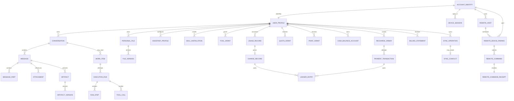

# V1 领域与 API 合同

> 状态：`APPROVED_PRODUCT_SCOPE / IMPLEMENTATION_IN_PROGRESS`
>
> 合同类型：Conversation-first 个人客户端对象、长任务、Remote Control 与接口边界

## 1. V1 业务真值

个人客户端的主要业务记录是：

- UserProfile
- AccountIdentity
- DeviceSession
- Conversation
- Message
- Attachment
- PersonalFile
- Artifact
- AssistantProfile
- SkillInstallation
- ModelCatalogEntry
- PriceCatalogEntry
- PriceQuote
- UsageRecord
- ChargeRecord
- QuotaGrant
- PointGrant
- CashBalanceAccount
- RechargeOrder
- PaymentTransaction
- RefundOrder
- LedgerEntry
- BillingStatement
- SyncOperation
- SyncConflict
- RemoteHost
- RemoteDevicePairing
- RemoteCommand
- RemoteCommandReceipt
- AttentionRequest
- RemoteEventCursor
- PushSubscription
- AppSettings

只有需要产品级后台状态、恢复或审计的复杂执行才使用以下投影对象：

- WorkItem
- ExecutionRun
- RunStep
- ToolCall
- PermissionRequest

这些对象不构成 Agent harness。`RunStep` 和 `ToolCall` 只能投影 Pi 事件，不能成为另一套步骤规划、重试或工具调度状态机。

关键不变量：

> Conversation 和 Message 是用户历史；Pi Session/AgentSession 只是执行引用。Pi 升级、崩溃或恢复失败不能让历史对话失去可读性。

## 2. 领域关系



## 3. 核心对象

### 3.1 UserProfile

代表当前个人用户及其偏好。V1 的云同步数据通过 AccountIdentity 归属个人账户；DeviceSession 表示某一 Windows/macOS 执行主机或 iOS/Android Remote Companion 的登录会话。

不得为了未来企业能力强制 V1 用户创建 Organization、Team 或 Workspace。

账户、用户资料和设备会话是不同对象。退出一台设备不能删除 UserProfile；撤销 DeviceSession 后，该设备不得继续拉取或写入云数据。

### 3.2 Conversation

建议字段：

- `id`
- `ownerProfileId`
- `title`
- `activeBranchId`
- `selectedModelRef`
- `thinkingLevel`（`off | minimal | low | medium | high | xhigh | max`）
- `assistantProfileId`
- `createdAt`、`updatedAt`、`archivedAt`、`deletedAt`
- `revision`、`syncState` 和 `lastSyncedAt`

Conversation 负责产品历史和上下文选择，不直接承载 Pi 私有 Session 状态。

### 3.3 Message 与 MessagePart

Message 表示一轮用户、助手、系统或工具可见消息。MessagePart 支持：

- Text
- ReasoningSummary，可选且不是原始思维链
- Image
- FileReference
- Citation
- ToolActivity
- ArtifactCard
- PermissionCard
- ErrorNotice

流式增量先进入事件层，完成后形成稳定 Message 快照。

助手 Message 关联本轮 UsageRecord 和可选 ChargeRecord；Token 或费用记录延迟不得阻止消息落盘，但预留失败时收费执行不能开始。

### 3.4 Attachment 与 PersonalFile

- Attachment 是某条消息或对话对文件的引用。
- PersonalFile 是用户可再次查找和使用的个人文件记录。
- 文件内容进入受控存储，永久引用不得依赖 Pi 临时路径。
- 原始文件和生成成果使用独立版本，不静默覆盖。
- 本地句柄、绝对路径和云对象引用分开保存；云同步不能在另一台设备伪造原设备路径权限。

### 3.5 Artifact

Artifact 是聊天文本之外的可使用成果，例如 DOCX、XLSX、PPTX、PDF、图片或结构化报告。

要求：

- 记录类型、大小、校验值、存储位置和创建来源。
- 支持版本、预览、下载和再次引用。
- 可以关联 Message、WorkItem、Run 和输入文件。

### 3.6 AssistantProfile 与 SkillInstallation

- AssistantProfile 保存个人选择的说明、默认模型、工具和行为偏好。
- SkillInstallation 保存来源、版本、能力声明和授权范围。
- Skill 安装记录可以同步；脚本执行、本地文件夹、Shell、浏览器和桌面控制授权按 DeviceSession 重新取得。
- V1 不包含组织发布、团队分发和管理员审核流程。

### 3.7 ModelCatalogEntry、PriceCatalogEntry 与 UsageRecord

ModelCatalogEntry 由平台下发，至少包含：

- `modelRef`、用户可见名称和版本。
- 文本、图片、文件、工具、MCP、图片生成等能力声明。
- `thinkingLevels`，只列出该模型真实支持且可供用户选择的思考等级，并始终包含 `off`。
- 上下文限制和可用状态。
- 当前 `priceRef`、计价摘要和免费/收费状态。

PriceCatalogEntry 由平台版本化发布，至少包含 `priceRef`、版本、生效区间、币种、计价单位、各 Token 分类或收费工具单价、最低费用、折扣/封顶规则和用户可见说明。

UsageRecord 至少包含：

- `usageId`、`accountId`、`conversationId`、`messageId` 和可选 `runId/toolCallId`。
- `selectedModelRef` 与 `effectiveModelRef`。
- 可获得的 `inputTokens`、`cachedInputTokens`、`outputTokens`、`reasoningTokens` 和 `totalTokens`。
- `providerReported`、`recordedAt`、`dedupeKey` 和缺失字段原因。

UsageRecord 是原始计量真值，不直接修改余额。服务端统一记录是 Token 聚合真值；客户端缓存只用于展示和离线查看。

### 3.8 个人商业账户对象

`PriceQuote` 至少包含：

- `quoteId`、`accountId`、目标模型/工具和关联请求幂等键。
- 价格目录版本、预计费用范围、最大可扣金额、币种、收费条款版本和过期时间。
- 计划使用的额度/积分/余额预留摘要和用户单次费用上限。

`ChargeRecord` 至少包含：

- `chargeId`、`usageId`、账户、消息/Run/ToolCall 引用和稳定 `dedupeKey`。
- `pricingSnapshotId`、选择模型、实际模型、计费数量和舍入规则。
- 原价、折扣、额度抵扣、积分抵扣、余额扣减和最终费用。
- `pending`、`settled`、`reversed`、`refunded` 或 `disputed` 状态。

`QuotaGrant` 和 `PointGrant` 分别记录来源、初始值、剩余值、适用范围、生效/过期时间和规则版本。额度和积分不是现金，不得与充值余额共用一个字段。

`CashBalanceAccount` 按账户和币种唯一，缓存余额是账本投影，不是可任意更新的业务真值。

`RechargeOrder`、`PaymentTransaction` 和 `RefundOrder` 分开建模：订单表达用户购买意图，支付流水表达支付服务商事实，退款单表达对原支付的反向处理。客户端返回页不能直接把订单标为成功。

`LedgerEntry` 是追加式复式账本分录；已入账分录不可更新或删除，更正使用反向分录。每个业务事务必须借贷平衡，并关联唯一业务幂等键。

`BillingStatement` 是自然月账单快照，包含消费、充值、退款、冲正和调账引用。账单生成后的更正进入后续调整记录，不重写已发布账单。

完整对象、不变量和商业运营参数见 [11-billing-and-commerce-contract.md](11-billing-and-commerce-contract.md)。

### 3.9 SyncOperation 与 SyncConflict

- 每个可同步写入使用 `operationId`、对象 ID、基础 revision、设备 ID 和幂等键。
- 服务端返回新 revision 和稳定同步游标。
- 冲突保留双方版本或可合并操作，不以客户端时间戳静默覆盖。
- 删除使用可同步墓碑和保留期；本地清缓存不等于删除云端数据。
- 同步对象白名单和设备级禁止同步字段写入版本化 Schema。

### 3.10 RemoteHost、Pairing、Command 与 AttentionRequest

- `RemoteHost` 代表一台可执行 Pi 和本地工具的 Windows/macOS 主机，Presence 为 `online | degraded | offline | revoked`。
- `RemoteDevicePairing` 只在同一账户内建立，保存设备公钥、创建/过期/撤销状态；设备私钥不进入云同步。
- `RemoteCommand` 是有签名、时效、`baseRevision`、单调 `sessionSequence` 和幂等键的产品命令；状态通过 `RemoteCommandReceipt` 表达为 `submitted | accepted | applied | rejected | expired`。
- `AttentionRequest` 表示仍需回答或审批的产品等待点；状态为 `pending | approved | denied | expired`，手机不能创建空白永久授权。
- `RemoteEventCursor` 只用于补读脱敏产品事件。Diff、终端、测试、截图等本地敏感详情使用短期端到端加密资源，不成为普通同步真值。
- Remote Start、Steer、Queue、Stop 分别映射 Pi `prompt()`、`steer()`、`followUp()`、`abort()`；这些领域对象不构成第二套 Session、Agent 队列或调度器。

完整字段和安全合同见 [15-remote-control-contract.md](15-remote-control-contract.md)。

## 4. 复杂执行对象

### 4.1 WorkItem

WorkItem 只在以下情况下创建：

- 需要后台继续。
- 需要把 Pi 产生的多步活动投影为可持久化进度。
- 产生文件成果。
- 需要中途权限或用户输入。
- 需要产品级取消、恢复或重新发起执行尝试。

普通问答不强制创建用户可见 WorkItem 页面。

WorkItem 是用户可见的粗粒度状态和审计容器。它不拆解 prompt、不选择下一步，也不维护独立 Agent Loop；这些行为属于 Pi。

### 4.2 ExecutionRun

一次完成 WorkItem 的执行尝试，记录：

- Pi package/version 与 Pi Host 合同版本。
- 用户选择模型、实际模型、回退原因和模型目录版本。
- 输入和权限快照。
- Pi Session 私有引用和最后投影事件游标。
- 状态、错误、压缩/内部重试摘要、用量、报价/费用引用和时间。

用户或产品重新发起一次执行尝试时创建新 Run，不覆盖旧 Run。Pi 在同一次 AgentSession 内部进行的模型重试仍属于原 Run，只通过事件和计量投影记录，不由 V2 重放 Agent 步骤。

### 4.3 ToolCall 与 PermissionRequest

ToolCall 是 Pi 工具调用的产品可见与安全审计投影，必须有 Pi call ref、状态、幂等键、输入摘要、结果摘要和风险等级。Pi 负责调用生命周期和把结果送回 Agent Loop；V2 Capability and Permission Broker 负责 Scope、审批、沙箱、实际副作用和审计。敏感调用关联 PermissionRequest，授权载荷变化后必须重新请求。

## 5. 状态模型

### 5.1 Message 生成状态

```text
pending -> streaming -> completed
                    -> stopped
                    -> failed
```

### 5.2 WorkItem 状态

```text
queued -> running -> waiting_for_user -> running
                  -> waiting_for_permission -> running
                  -> completed | failed | cancelled
```

用户停止生成与取消复杂 WorkItem 是不同动作，但 UI 可以根据当前上下文提供统一“停止”入口。

该状态是由 Pi Session 事件、权限/用户输入等待和宿主进程状态归纳出的产品投影，不驱动一套 V2 自有步骤执行器。

### 5.3 收费执行状态

```text
quote_created -> funds_reserved -> execution_started
               -> insufficient_funds
execution_started -> usage_recorded -> charge_settled -> reservation_released
                  -> failed/stopped -> partial_charge_or_release
charge_settled -> reversed | refunded | disputed
```

### 5.4 充值订单状态

```text
created -> pending_payment -> paid -> credited
                         -> failed | expired | closed
paid/credited -> partially_refunded | refunded
```

### 5.5 Remote 状态

```text
pairing: created -> active -> expired | revoked
command: submitted -> accepted -> applied
                              -> rejected | expired
attention: pending -> approved | denied | expired
```

`accepted` 只表示在线桌面已验证并接收产品命令；`applied` 才表示命令已交给 Pi 或 Broker。Relay 接收密文不能生成 `accepted` 或 `applied`。

## 6. 对话分支

- 编辑旧用户消息或重新生成可以创建新分支。
- 旧消息和结果保持可访问，除非用户明确删除。
- 分支 ID 属于产品域，不等于 Pi Session 分支引用。
- 删除 Conversation 时，分支、消息、附件引用和同步副本遵循同一删除策略。

## 7. 统一事件

V1 至少支持：

- `conversation.created`
- `message.accepted`
- `message.delta`
- `message.completed`
- `message.stopped`
- `run.started`
- `run.progressed`
- `run.compacted`
- `run.retrying`
- `tool.requested`
- `tool.started`
- `tool.completed`
- `tool.failed`
- `permission.required`
- `permission.resolved`
- `artifact.created`
- `run.completed`
- `run.failed`
- `run.cancelled`
- `usage.recorded`
- `billing.quote_created`
- `billing.funds_reserved`
- `billing.charge_settled`
- `billing.reservation_released`
- `billing.charge_reversed`
- `billing.quota_granted`
- `billing.points_granted`
- `payment.order_created`
- `payment.succeeded`
- `payment.failed`
- `payment.refunded`
- `billing.statement_ready`
- `sync.queued`
- `sync.completed`
- `sync.conflicted`
- `sync.failed`
- `host.presence_changed`
- `remote.command_accepted`
- `remote.command_applied`
- `remote.command_rejected`
- `attention.requested`
- `attention.resolved`
- `attention.expired`
- `review.available`

事件至少包含 `eventId`、可选 `conversationId/workItemId/runId/hostDeviceId`、`sequence`、`occurredAt`、`payloadVersion` 和 `payload`；具体事件必须声明自己的必填归属键。

Pi 的消息、工具、权限、压缩、重试、用量和 Session 事件在 Pi Host Supervisor 中映射为上述稳定产品事件。原始 Pi payload、内部步骤和 Session 快照不是 UI 或同步合同。

断线恢复使用稳定游标，不依赖内存事件列表。

## 8. V1 API 与 IPC 边界

Electron Renderer 通过类型化 Preload Bridge 调用桌面能力；业务合同保持传输无关，可由 IPC、进程通道或未来云 API 实现：

```text
/api/v2/profile
/api/v2/account
/api/v2/devices
/api/v2/conversations
/api/v2/conversations/:id/messages
/api/v2/search
/api/v2/files
/api/v2/artifacts
/api/v2/assistants
/api/v2/skills
/api/v2/models
/api/v2/model/execute
/api/v2/model/stream
/api/v2/tools
/api/v2/mcp-servers
/api/v2/usage
/api/v2/prices
/api/v2/billing/overview
/api/v2/billing/charges
/api/v2/billing/ledger
/api/v2/billing/statements
/api/v2/billing/recharge-orders
/api/v2/billing/refunds
/api/v2/sync
/api/v2/remote/hosts
/api/v2/remote/pairings
/api/v2/remote/commands
/api/v2/remote/events
/api/v2/remote/push-subscriptions
/api/v2/permissions
/api/v2/settings
/api/v2/events
```

合同要求：

- 请求和响应有版本化 Schema。
- 消息发送支持客户端幂等键。
- 流式事件可按游标补读。
- 模型流使用类型化 `delta/completed/failed` 终态；只有 `completed` 可携带权威 Usage 并进入结算。
- Preload 只暴露按业务动作定义的窄接口，不暴露原始 `ipcRenderer`、Node 或文件系统对象。
- 主进程验证 IPC sender、窗口、参数和当前权限。
- 文件使用受控本地句柄；上传或下载云副本使用短期、账户绑定的预签名入口。
- Pi 原始消息不得成为 UI 的唯一读取来源。
- V1 默认优先 IPC/进程通道，不为方便而暴露无鉴权 localhost 敏感服务。
- 云 API 与本地 IPC 复用业务 Schema，但独立处理认证、重放、设备撤销和账户隔离。
- Remote Gateway 只路由有签名、端到端加密和短 TTL 的命令/事件；桌面 Host Connector 只出站连接，最终由 App Service/Broker 复核账户、revision、序列、Scope 和幂等。
- Remote 命令只能映射 Pi 原生 `prompt/steer/followUp/abort` 或 Broker 决策，不得成为另一套 Agent 执行 API。
- 金额使用币种最小单位整数，积分使用整数；货币计算不得使用二进制浮点数。
- 报价只由 Model Gateway 在服务端创建；客户端不能提交 Token 数、用量估计、费率、报价金额
  或价格快照。客户端只读取最终 Billing 状态，并可创建充值订单；不能提交余额、新账本分录
  或“支付成功”状态。
- 支付回调由服务端验签、查单、防重放并幂等入账；页面跳转和深链接仅用于提示刷新状态。
- 收费对象、充值订单和退款使用独立幂等命名空间；重试不得产生第二笔有效扣费或余额入账。

## 9. 存储抽象

`已确定`：V1 支持账户云同步。账户范围数据以云端为真值，本机使用受控缓存/离线队列；不提供完全未登录模式，但网络中断时允许读取缓存和排队受支持的内容写入。

无论最终选择：

- 领域合同不依赖 SQLite 或 PostgreSQL 的专有对象。
- 文件存储与元数据存储分开。
- 云同步通过显式 Sync Adapter 实现，不把同步状态混入 Pi Session。
- 账户范围内容以服务端 revision 为真值；Token 以 UsageRecord 为真值；费用与余额以服务端 ChargeRecord 和不可变账本为真值。本地缓存必须可重建。
- 额度、积分、充值余额、支付、费用和账单只允许服务端写入，不进入普通离线同步写队列。
- 设备级绝对路径、权限 Grant、Cookie、Shell 历史、平台密钥、诊断日志和 Pi 临时目录禁止同步。
- 未来增加 Organization 时通过新增 Scope 迁移，不要求 V1 预建完整企业 Schema。
