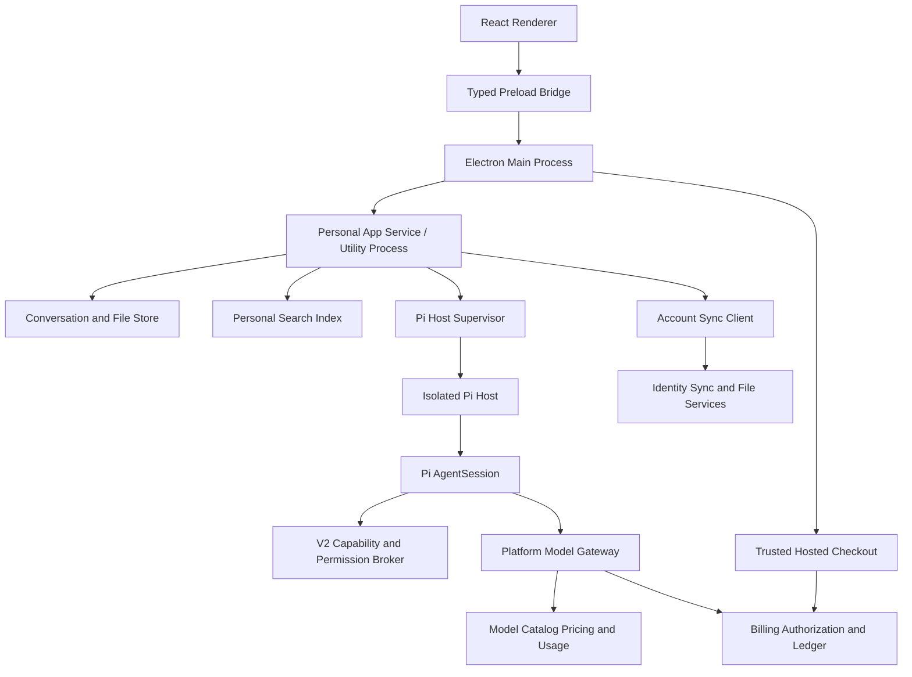

# V1 平台与 Pi 合同

> 状态：`APPROVED_PRODUCT_SCOPE / PI_FOUNDATION_COMPLETE`
>
> 合同类型：个人客户端壳、应用服务、Pi Host 和能力 Broker

## 1. 架构目标

V1 技术架构首先服务个人客户端：

1. 启动快，打开即可聊天。
2. 流式响应稳定，停止和重试可靠。
3. 文件与工具能力在清晰权限内工作。
4. 长任务可以离开界面后继续或恢复。
5. 账户历史在 Windows 与 macOS 间可靠同步和恢复。
6. 平台统一模型的 Token、价格、实际费用和账户扣减可逐笔核对。
7. 额度、积分、充值余额、支付和账单由服务端商业系统保持唯一真值。
8. 模型可替换，Pi 版本可在稳定宿主边界内升级，产品历史不依赖 Pi 内部状态。
9. 不建设暂时没有用户价值的企业管理面。

## 2. 目标拓扑



V1 不包含 Admin Web、组织服务和团队控制平面。

包含云同步、模型、计费、工具与数据信任边界的最新完整图见 [14-overall-architecture.md](14-overall-architecture.md)。

## 3. 已选技术方案

`已确定`：V1 为跨平台桌面客户端，内嵌 Web UI。

`已确定`：Renderer 使用 React + TypeScript 重写，不复用 Vue 页面和 Ant Design Vue 组件。

`已确定`：桌面壳采用 Electron，前端由 Vite 构建。打包和发布默认采用 Electron Forge，或使用经 ADR 批准的等价 Electron 工具。

选择 Electron 而不是 Tauri 的当前理由：

- Electron 自带 Chromium，在 V1 的 Windows 和 macOS 目标上提供一致的渲染与浏览器能力。
- Main、Preload、Renderer 和本地服务可以使用 TypeScript/JavaScript 统一开发。
- 本地文件、窗口、托盘、快捷键、更新和 Pi Host 子进程集成路径直接。
- Tauri 的包体通常更小，但会引入 Rust、系统 WebView 差异和外部 sidecar 的多目标构建复杂度。

该选择优先优化开发效率和跨平台一致性，接受 Electron 包体与内存更高的代价，并通过性能门禁约束。

React 并非普遍比 Vue 更简单；本项目切换 React 的理由是 V1 页面完全重写，旧 Vue 资产不再构成迁移优势，而 React 更适合本轮统一的桌面 Web 组件与状态生态。

V1 已确认系统矩阵：

| 系统 | CPU | V1 状态 |
| --- | --- | --- |
| Windows 10 22H2、Windows 11 | x64 | 必须支持 |
| macOS 14 Sonoma 及以上 | Apple Silicon arm64 | 必须支持 |
| macOS 14 Sonoma 及以上 | Intel x64 | 必须支持 |
| Windows 10/11 | ARM64 | V1 不支持 |

实现阶段选择的 Electron、Chromium、Node 和 Pi 版本必须仍在维护期，并通过上述矩阵实机验证。

## 4. 部署单元

### 4.1 Electron Main Process

- 应用生命周期、窗口、菜单、托盘、深链接和更新。
- 文件对话框、系统打开/另存为和安全外链。
- 账户登录回调、设备标识和系统凭证库会话。
- 创建并监督 Personal App Service 与 Pi Host。
- 不承载长时间 AI 执行或 CPU 密集任务。

### 4.2 Preload Bridge

- 使用 `contextBridge` 暴露类型化、窄范围业务方法。
- 验证参数和返回可序列化 DTO。
- 不暴露原始 `ipcRenderer`、Node 模块或通用命令执行入口。

### 4.3 React Renderer

- 新对话、历史、搜索、文件、助手/技能、浏览器/终端面板、账户同步、用量/费用、充值、账单和设置。
- 使用 React + TypeScript + Vite。
- 只消费版本化 Bridge/API 和恢复型事件。
- 不直接解析 Pi 私有事件。
- `nodeIntegration` 必须关闭，Renderer 运行在 Sandbox 与 Context Isolation 下。

### 4.4 Personal App Service

- Conversation、Message、文件、成果和搜索。
- 账户同步队列、模型目录、模型路由、用量/费用只读缓存、设置和权限。
- 请求服务端报价和充值订单，但无权修改余额、账本或支付状态。
- 创建简单响应或复杂 WorkItem。
- 运行在 Utility Process 或独立受监督进程，不阻塞 Electron Main。

### 4.5 Pi Host Supervisor 与产品投影

- 为一次产品执行分配稳定的 Message、WorkItem、ExecutionRun 和 generation 标识，并绑定内部 Pi Session 引用。
- 在进入 Pi 前校验账户、模型、报价/预留、文件 Scope 和设备能力前置条件。
- 监督 Pi Host 的进程生命周期，决定产品层是等待、明确失败，还是请求 Pi 恢复已有 Session。
- 将 Pi 事件投影为可持久化、可同步、可恢复的产品事件；WorkItem 和 ExecutionRun 是产品监督与审计视图，不是第二套 Agent 计划器。
- 不实现 Agent Loop、Session/SessionManager、上下文压缩、内部重试、步骤规划或工具调用生命周期；这些全部由 Pi 提供。

### 4.6 Isolated Pi Host

- 只在该受监督 utility process 中加载维护中的 Pi 包；Main、Preload、Renderer 和 App Service 不直接导入 Pi。
- 为每个执行创建或恢复 Pi `AgentSession`，并绑定明确的隔离工作目录。
- 把 Platform Model Gateway 客户端和 V2 能力工具注册给 Pi，不建立第二套 loop 或 tool dispatcher。
- 挂载当前对话明确授权的输入。
- 限制 CPU、内存、磁盘、时长和网络。
- 不暴露用户 Home、全局凭证和未授权文件夹。
- 浏览器、Shell、桌面控制和 Skill 脚本使用独立能力 Broker，不通过 Renderer 直接启动。
- 结束后保留成果，清理临时数据。

## 5. 建议仓库结构

```text
apps/
  desktop/
    src/main/
    src/preload/
    src/renderer/
  app-service/
  sync-service/
services/
  identity-api/
  account-sync-api/
  model-gateway/
  token-usage-store/
  pricing-service/
  billing-ledger-service/
  payment-adapter/
packages/
  domain/
  contracts/
  pi-host/
  tool-sdk/
  skills/
  ui-react/
  storage/
  observability/
docs/v2/
v1-backup/
```

这是当前目标结构。旧控制平面、旧执行引擎、旧测试和旧运维资产已经按用户授权移动到 `v1-backup/`，新主线不得直接依赖该目录。

建议 Renderer 基线为 React、TypeScript、Vite、Vitest、React Testing Library 和 Playwright。路由、异步状态和组件库另行通过 ADR 确定，不在合同阶段堆叠依赖。

## 6. 快速聊天与复杂执行

快速聊天路径：

```text
Message -> Pi AgentSession -> Pi events -> streaming Message projection
```

复杂执行路径：

```text
Message -> WorkItem/ExecutionRun product projection -> Pi AgentSession
        -> V2 capability tools -> Artifact + Message projection
```

两条路径使用同一个 Pi harness，共享 Conversation、模型配置、权限、事件、用量、报价和结算合同。复杂路径增加的是产品可见的后台状态、权限等待、成果和恢复投影，不是另一个负责拆解步骤的 Agent 编排器。普通问答不强制创建用户可见 WorkItem。

两条路径的模型请求都必须经过 Platform Model Gateway。收费请求在执行前取得 Billing Authorization；桌面端和 Pi Host 不保存上游 Provider API Key，也不能绕过平台 Token 与费用记录直接调用未登记模型。

## 7. Pi Host 进程合同

当前合同直接表达 Pi 会话动作，不定义抽象 harness：

| Frame | 方向 | 含义 |
| --- | --- | --- |
| `pi-host.bootstrap` / `pi-host.ready` | Main ↔ Pi Host | 版本、profile 和启动 nonce 握手 |
| `pi.session.prompt` | App Service → Pi Host | 把已批准产品上下文提交给新的 Pi `AgentSession` |
| `pi.session.abort` | App Service → Pi Host | 调用 Pi `AgentSession.abort()` |
| `pi.product-event` | Pi Host → App Service | 把 Pi 事件投影为有序、幂等的产品增量或终态 |

合同实现在 `packages/contracts/src/pi.ts`，Pi 会话组合与进程入口在 `packages/pi-host`。
当前文本子集覆盖 delta、completed、stopped 和 failed；文件/工具阶段在同一合同中增加 Pi
工具、权限、压缩、重试、用量和 Session 投影。原始 Pi payload 只用于受控诊断，不能成为
Renderer 合同或产品数据真值。

## 7.1 平台模型目录与 Gateway

- Model Catalog 是服务端版本化配置，客户端只展示账户当前可用模型。
- 目录声明模型能力、限制、状态、推荐用途、价格引用和用户可见计价摘要。
- “自动”路由与用户明确选择使用同一合同；明确选择具有优先级。
- 请求记录 `selectedModelRef`，Gateway 记录 `effectiveModelRef`；静默跨模型替换被禁止。
- 模型不可用时先返回可解释错误或请求用户允许的降级；紧急平台降级也必须进入消息和用量记录。
- V1 不实现 BYOK、自定义 Provider endpoint 或本地模型入口。

## 7.2 Token、价格与费用记录

- Gateway 采集上游返回的输入、缓存输入、输出、推理和总 Token；不能获得的字段保持 `unknown`。
- 每次模型调用写入一个带稳定去重键的 UsageRecord，并关联消息、对话、账户、选择模型和实际模型。
- 执行前由 Pricing Service 冻结价格快照，由 Billing Service 校验额度/积分/余额并预留最大费用。
- 执行后 ChargeRecord 按真实用量和冻结价格结算，并分别记录额度、积分和充值余额扣减。
- 客户端可按消息、对话、日期和模型查询 Token 与费用，但无权修改服务端记录。
- 重试、失败、取消、缓存命中和同步重放进入固定契约测试，不能重复累计同一模型调用。
- 未使用预留在结束后释放；V1 不透支，商业服务不可用时不启动新的收费执行。

## 7.3 Billing、Ledger 与 Payment 边界

- Billing Service 是额度、积分、充值余额、费用预留和结算的唯一写入口。
- Ledger 使用追加式复式分录；余额是可重建投影，已入账分录只能冲正。
- Payment Adapter 负责创建支付服务商订单、服务端查单、验签回调、退款和每日对账。
- Electron 只打开受信任托管收银台；深链接返回只触发状态刷新，不能确认支付或直接入账。
- 金额使用最小货币单位整数，价格计算使用明确精度和舍入规则。
- 商业系统、状态机和失败处理详见 [11-billing-and-commerce-contract.md](11-billing-and-commerce-contract.md)。

## 8. Pi 所有权合同

`已确认`：`@earendil-works/pi-coding-agent@0.84.3` 完整提供 V1 唯一的生产 agent
harness，但不是产品数据、权限或商业真值。

1. Pi 负责 Agent Loop、`AgentSession`/SessionManager、上下文与压缩、模型轮次、内部重试和工具调用生命周期。
2. 只有 `packages/pi-host` 可以导入 Pi；不从 `v1-backup/pi-mono` 运行代码。
3. Pi Host 显式接收工作目录和批准的产品上下文；Pi Session ID 只作内部引用。
4. Conversation、Message、WorkItem 和 ExecutionRun 是独立产品投影。
5. 模型通过 Pi 原生 `ModelRuntime` Provider 接入 Platform Model Gateway。
6. 工具使用 Pi 原生工具模型；实际文件、网络、浏览器、Shell、桌面、MCP 和 Skill 副作用全部经过 V2 Broker。
7. 固定 Pi 版本；升级必须通过事件、Session、停止、恢复、工具、压缩和打包回归。
8. 测试 Provider 只能位于测试文件；生产和 Release 路径不能包含固定回答模型。

不存在通用 harness 抽象、多 harness 注册表或 V2 自有 Agent 执行器。完整决策见
[ADR-V2-007](adr/007-pi-harness-boundary.md)。

## 9. 工具、Skill 与能力 Broker

V1 工具范围以 [10-codex-capability-baseline.md](10-codex-capability-baseline.md) 为硬性基线，并按以下层次实现：

V2 将工具定义和 Skill 上下文注册给 Pi。Pi 负责模型到工具的选择、调用开始/结束、工具结果回填和 Agent 继续运行；V2 Capability and Permission Broker 负责 Scope 校验、用户审批、沙箱、实际系统调用、外部副作用幂等和审计。Broker 不是另一个 agent harness。

- 内置低风险工具：计算、文本处理、成果渲染等。
- 文件工具：读取、搜索、创建和补丁式修改，只访问已添加文件或明确授权目录。
- 网络工具：第一方 Web 搜索显示来源并遵循搜索策略。
- 浏览器工具：使用隔离 Profile，支持网页和本地 Web 应用的共享查看与受控交互。
- 计算机工具：读取屏幕和操作桌面应用，高影响动作逐次授权。
- Shell/代码工具：绑定工作目录，流式输出、输入、停止、超时和长进程可控。
- MCP：支持 STDIO、Streamable HTTP、Bearer 和 OAuth；服务及单个工具均可禁用。
- Skill：加载 `SKILL.md`、脚本、参考资料和资产；显式/自动触发都进入可见活动记录。
- 工具目录：按来源和命名空间索引，在大型工具集合中按需发现，不把全部工具 Schema 永久塞入模型上下文。

工具返回统一结果、来源、用量和错误，不把每个工具私有格式泄漏到聊天 UI。Skill 脚本和 MCP 不得绕过 Broker、沙箱、审批、网络策略或用量记录。

## 10. 存储与同步

V1 已确定支持账户云同步；已确认架构采用账户云真值与本地缓存相结合的模式：

- 账户范围的结构化历史由云端版本化存储作为真值，本地数据库提供缓存、搜索和离线队列。
- 文件和成果使用云对象存储与本机应用管理目录的受控副本。
- 登录会话进入系统 Keychain/凭证库；上游模型密钥不下发客户端。
- 搜索索引可以重建，不作为唯一真值。
- 使用独立 Sync Adapter、幂等操作、对象 revision、墓碑和稳定游标。
- 明确哪些数据上传、加密、保留和删除；冲突保留版本，不静默覆盖。
- 本地绝对路径、设备权限、Cookie、Shell 历史、密钥、日志和临时工作区禁止同步。
- 用户可以查看同步状态、重试、导出和删除个人数据。不提供匿名本地模式；断网时允许读取缓存和排队受支持的内容写入。
- 额度、积分、充值余额、支付、费用和账单不进入普通离线写队列；本机只能缓存服务端只读快照，联网后重新核对。

## 11. 可观测性

- 共享 Conversation ID、Message ID、可选 WorkItem/Run ID、Trace ID，以及仅供内部关联的 Pi package/version、Session ref 和 event cursor。
- 记录 Pi 消息、工具、权限、压缩、重试和用量事件到产品投影的关联结果，但默认不记录完整原始 payload。
- 指标覆盖启动、首个内容时间、生成时长、停止成功率、工具失败率、同步延迟/冲突率、Token/费用记录完整率、重复扣费率、支付入账延迟、对账差异、恢复率和成果打开率。
- 日志默认不记录完整对话、文件内容和 API Key。
- 用户可以导出脱敏诊断包。

## 12. Electron 安全基线

- 只加载打包进应用的本地 React 资源；开发环境来源单独白名单。
- `nodeIntegration: false`。
- `contextIsolation: true`。
- Renderer Sandbox 开启。
- 使用严格 Content Security Policy。
- 验证所有 IPC sender、channel 和参数。
- 限制导航、新窗口和外部链接；不在主 Renderer 中加载任意远程网站。
- 远程内容不得获得 Preload Bridge；需要内嵌时使用独立、无 Node 能力的隔离 WebContents。
- 充值收银台只允许经服务端下发并校验的 HTTPS 域名，使用无 Preload Bridge 的隔离 WebContents 或系统浏览器；禁止把支付凭证传回 Renderer。
- Electron、Chromium、Node 和关键依赖保持受支持版本并建立升级节奏。

官方基线：

- [Electron Process Model](https://www.electronjs.org/docs/latest/tutorial/process-model)
- [Electron Security](https://www.electronjs.org/docs/latest/tutorial/security)
- [Electron Context Isolation](https://www.electronjs.org/docs/latest/tutorial/context-isolation)

## 13. 打包、签名与更新

- V1 只构建和发布 Windows、macOS，不为 Linux、移动端或其他平台创建安装包与测试矩阵。
- 每个平台和 CPU 架构由对应 CI Runner 构建并验证。
- 正式包必须签名；macOS 完成公证，Windows 使用代码签名。
- 更新元数据和安装包必须校验来源与签名。
- 支持稳定、测试等发布通道，但 V1 可以先只开放内部通道。
- 更新前保护 Conversation 数据，更新失败不得删除用户历史。

## 14. 性能预算

Electron 的一致性以更大包体和内存为代价。V1 必须建立可测预算：

- 冷启动、热启动和首个可交互时间。
- 空闲内存、活动对话内存和长会话内存增长。
- Renderer 长任务不得阻塞输入和滚动。
- Main Process 不执行 AI 推理、文档解析或 CPU 密集工作。
- 依赖、字体和静态资源进入构建体积审查。
- 每个目标系统使用低配基准机测试，而不是只在开发机验证。

## 15. Future Enterprise 扩展位

未来可以增加 Organization Scope、团队空间、管理员服务、组织模型策略、部门预算和企业结算，但 V1 只实现个人账户商业闭环，不创建组织页面、角色工作流或企业管理 API。扩展能力通过产品合同和 Scope 演进，不能重新绑定 Pi 私有对象。
