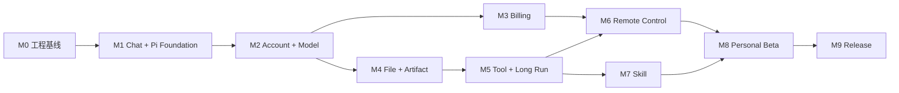

# OpenerX 2.0 V1 开发计划

> 状态：`M0-M9 LOCAL COMPLETE / EXTERNAL BETA AND RELEASE GATES PENDING`
>
> 更新日期：2026-08-28（Asia/Shanghai）
>
> 适用范围：Electron + React 的 Windows/macOS 执行主机与 React Native iOS/Android Remote Companion

## 1. 交付结果

V1 完成必须同时满足：

1. 用户打开桌面客户端即可聊天，并能停止、重试、搜索和恢复历史。
2. Conversation、Message、文件、成果和设置独立于 Pi 私有 Session 保存。
3. 同一账户可在 Windows 与 macOS 间同步和恢复。
4. 模型、Token、报价、费用、额度、积分、余额、充值和账单可逐笔解释。
5. 文件、Web、浏览器、Shell、桌面控制、MCP 和 Skill 达到 Codex 能力基线。
6. 用户可从 iOS/Android 安全控制已配对的在线桌面主机，完成 Start、Queue、Steer、Stop、审批和结果审阅。
7. 黄金任务、安全、资金、桌面/移动矩阵打包、签名和更新门禁全部通过。

## 2. 不可变架构原则

- `@earendil-works/pi-coding-agent@0.84.3` 是当前唯一生产 agent harness。
- Pi 负责 `AgentSession`、Agent Loop、模型轮次、上下文、压缩、内部重试和工具调用生命周期。
- `packages/pi-host` 只承载 Pi、隔离工作目录和 Electron 进程桥接。
- V2 只负责产品数据、进程监督、模型/计费前置条件、事件投影和 Capability and Permission Broker。
- WorkItem、ExecutionRun、RunStep 和 ToolCall 是 Pi 事件的产品投影，不是第二套执行器。
- 不提供多 harness 抽象、V2 自有步骤规划器或旧执行引擎兼容层。
- 测试可以注入 Pi 原生测试 Model Provider；生产源码和 Release 路径不得包含假 harness 或固定回答模型。
- Pi API、事件或工具语义与 V2 既有概念冲突时，以 Pi 为准，并同步修改 V2 合同。
- 手机是控制面、桌面是执行面；Remote Start/Steer/Queue/Stop 直接映射 Pi `prompt()`/`steer()`/`followUp()`/`abort()`。
- Remote Relay 只路由有时效、可验签、可去重的产品命令和事件，不拥有 Pi Session、运行时队列或权限决策。

规范性决策见 [ADR-V2-007](adr/007-pi-harness-boundary.md)。

## 3. 当前基线

| 检查点 | 状态 | 已交付 | 剩余门禁 |
| --- | --- | --- | --- |
| M0 工程与 ADR | COMPLETE | npm workspaces、Electron/React 骨架、边界检查、CI、威胁模型 | 发布签名属于 M9 |
| M1 Chat Alpha | COMPLETE | Conversation/Message、分支、搜索、流式投影、停止、失败、重启恢复、桌面 UI | 双平台原生 CI 结果在发布前确认 |
| Pi Foundation | COMPLETE | 直接依赖 Pi；`AgentSession` 原生事件；`pi.session.prompt/abort`；生产包仅含 Pi Host | [实现与质量证据](evidence/pi-foundation-2026-08-25.md) |
| M2 Account + Model | LOCAL COMPLETE | 账户/设备会话、Outbox/冲突/墓碑、Pi-native Model Gateway Provider、UsageRecord、Remote V1 Schema | 原生 Windows/macOS 双设备与付费 Provider 验证属于发布环境门禁；[实现与质量证据](evidence/m2-2026-08-25.md) |
| M3 Billing Alpha | LOCAL COMPLETE | 服务端报价/预留/结算、额度/积分/现金复式账本、支付回调/退款/对账、最终 Billing UI、CSV/PDF | 真实支付宝/微信沙箱、商户参数、属地合规与原生发布矩阵仍是发布环境门禁；[实现与质量证据](evidence/m3-2026-08-25.md) |
| M4 File + Artifact | LOCAL COMPLETE | 设备 Scope、受控副本、多格式引用、不可变成果、云对象恢复、Pi SessionManager | 原生双平台打开/选择器与签名包仍是发布门禁；[实现与质量证据](evidence/m4-2026-08-26.md) |
| M5 Tool Alpha | LOCAL COMPLETE | Pi-native Web/image/Browser/Shell/Desktop/MCP、Capability Broker、长任务与权限投影 | 原生双平台桌面/沙箱、实时 Provider、第三方 MCP 与签名包仍是发布门禁；[实现与质量证据](evidence/m5-2026-08-26.md) |
| BCU Browser Computer-Use | BCU-003 LOCAL AX LIVE PASS + BRIDGE SECURITY FOUNDATION / PHASE PARTIAL | ADR-V2-017、V2 严格合同与内核、Main/Pi 接线、macOS 默认浏览器精确窗口 AX Adapter、像素遮罩、真实百度烟测、代表性原生动作矩阵、物理输入自动暂停和 fresh-baseline 恢复、真实 Main/Preload/Renderer Tool Center 接管/恢复/关窗，以及 Bridge 固定 origin/启动 nonce、一次性精确标签页授权、防重放/断连状态机和 Adapter 路由 | 物理输入与原生 Tool Center runners 已在解锁机器 PASS，且 Computer Use 合成事件按安全边界不会被真人接管 monitor 接受；Bridge 仅完成确定性安全基础，仍需 MV3 扩展、Native Messaging/Main owner-only 传输、可信连接 UI、真实烟测、签名安装权限、Firefox/Windows 和托管 Chromium；`legacy_dom_v1` 仅保留为显式 feature flag 回滚；[BCU-001 证据](evidence/bcu-001-2026-08-27.md)；[BCU-002 证据](evidence/bcu-002-2026-08-27.md)；[BCU-003 证据](evidence/bcu-003-2026-08-27.md)；[2026-08-28 live gates PASS](evidence/bcu-003-live-input-2026-08-28.md)；[Bridge foundation](evidence/bcu-003-browser-bridge-foundation-2026-08-28.md) |
| M6 Remote Control Alpha | LOCAL COMPLETE | Expo 手机控制面、同账户配对、E2EE 协议、出站 Connector、密文 Gateway、Pi 原生命令映射、远程审批和事件游标 | iOS/Android 真机、Windows/macOS 主机矩阵、APNs/FCM 生产投递、移动附件闭环与真实网络故障演练仍是发布门禁；[实现与质量证据](evidence/m6-2026-08-26.md) |
| M7 Skill | LOCAL COMPLETE | Pi-native Skill 包、Scope、生命周期、Broker 和同步 | 签名目录、跨平台脚本运行时与原生矩阵仍是发布门禁；[实现与质量证据](evidence/m7-2026-08-26.md) |
| M8 Personal Beta | EXTERNAL IN PROGRESS | 诊断/性能/数据恢复本地检查点；真实 DeepSeek SSE→Pi→桌面瀑布与 Usage→服务端 Charge 首个闭环 | 目标用户、真实长请求 Stop/失败、Provider 账单对账、支付、Remote 真机、原生与签名矩阵；[M8 证据](evidence/m8-2026-08-26.md)；[流式瀑布证据](evidence/streaming-waterfall-2026-08-26.md) |
| M9 V1 Release | LOCAL COMPLETE | 签名发布工作流、Ed25519 更新清单、Main-only 更新、EAS/隐私清单、发布图扫描、回滚手册 | 12 组外部发布证据与明确用户批准；[实现与质量证据](evidence/m9-2026-08-26.md) |

受支持启动路径必须在展示聊天界面前准备好真实 Platform Model Gateway 和默认
`platform/auto` 模型，不把“模型未配置”暴露为用户状态。本地开发的 `npm run dev:v2`
会启动真实 DeepSeek Gateway，并仅在回环开发环境中自动建立开发会话、接受本地开发条款
和发放本地开发额度；生产包仍通过平台账户、显式条款、服务端计费和 Provider 调用，不以
测试模型或桌面端 Provider Key 伪装可用模型。

## 4. 依赖顺序

账户/模型与计费可以和桌面文件能力并行，但收费执行必须在 Usage、报价、预留和账本真值完成后开放。

加入 Remote 后，6 至 8 人团队的总规划基线为 29 至 39 周；4 至 6 人团队为 38 至 50 周。M6 Remote 与 M7 Skill 可在 M5 完成后部分并行，但 M8 Beta 必须等待两者都通过。

## 5. 里程碑

### M0：工程与安全基线 — COMPLETE

- Electron Main、Preload、React Renderer 和 utility-process 构建。
- npm workspace、依赖边界、lint、typecheck、test、打包和 Fuse 检查。
- Windows x64、macOS arm64/x64 矩阵。
- IPC、存储、App Service 和 Pi harness ADR。

证据：[M0 checkpoint](evidence/m0-2026-08-25.md)。

### M1：Chat Alpha 与 Pi Foundation — COMPLETE

- Conversation、Message、MessagePart、分支、revision 和幂等。
- 新对话、历史、搜索、重命名、归档、删除、编辑和重新生成。
- App Service 与 Pi Host 独立 utility process；私有 MessagePort、启动 nonce 和有界重启。
- Pi `AgentSession` 流式事件、`abort()`、无工具聊天配置和产品事件投影。
- Pi 原生 `ModelRuntime` Provider 注入；确定性 Provider 仅位于测试。
- App Service 崩溃后保留已提交历史和部分输出。

退出条件：GT-CHAT-01 至 GT-CHAT-10、Electron 安全断言和当前三个桌面目标包门禁通过。

证据：[Pi Foundation checkpoint](evidence/pi-foundation-2026-08-25.md)。

### M2：Account、Sync、Model 与 Usage — LOCAL IMPLEMENTATION COMPLETE

- 邮箱登录、设备会话、刷新、撤销、退出和系统凭证库。
- 账户云真值、本地 Outbox、revision、cursor、冲突、墓碑和跨设备恢复。
- Model Catalog、明确选模、实际模型和可解释降级。
- Platform Model Gateway 以 Pi 原生 Provider/`ModelRuntime` 接入，不新增模型 adapter 或第二套 loop。
- UsageRecord 记录输入、缓存、输出、推理和总 Token；稳定去重并关联 Message/Run。
- 客户端不保存上游 Provider API Key。
- 冻结 RemoteHost、设备公钥、配对/撤销、RemoteCommand/Receipt、AttentionRequest 和 RemoteEventCursor 合同；Identity API 预留账户内设备能力。

本地退出条件：GT-ACCOUNT-01 至 GT-ACCOUNT-10 的 M2 实现切片；独立设备副本恢复、两账户零串读、模型与 Token 可核对。GT-ACCOUNT-02/03/05 中的附件、Artifact、文件和预签名资源随 M4 验收，GT-ACCOUNT-07 的真实文件/工具执行随 M4/M5 验收；不得用 M2 证据提前宣称这些切片通过。原生 Windows/macOS 双设备和真实付费 Provider 仍是发布环境门禁。

证据：[M2 checkpoint](evidence/m2-2026-08-25.md)。Remote 在本检查点冻结版本化协议
Schema；移动端、Connector、Relay、推送和真机矩阵仍由 M6 交付。

### M3：Billing Alpha — LOCAL IMPLEMENTATION COMPLETE

- Price Catalog、报价、价格快照、费用预留和真实用量结算。
- QuotaGrant、PointGrant、CashBalanceAccount 和追加式复式账本。
- 支付宝/微信订单、托管收银台、验签、查单、退款和每日对账。
- 用量/费用、充值、账单和月度 CSV/PDF。
- 重放、重试、服务重启和支付异常不能重复扣费或入账。
- Token 数、用量预算、费率、报价和结算只在服务端形成；客户端只读取最终 Billing 快照。

本地退出条件：GT-BILLING-01 至 GT-BILLING-10；测试资金可从账本逐笔重建且账平；Electron
E2E 证明客户端只显示服务端最终余额和 Charge。真实支付宝/微信商户沙箱、退款到账、合规
评审与原生 Windows/macOS 发布矩阵仍是发布环境门禁。

证据：[M3 checkpoint](evidence/m3-2026-08-25.md)。

### M4：File、Artifact 与 Pi Session 恢复 — 3 至 4 周

状态：`LOCAL IMPLEMENTATION COMPLETE (2026-08-26)`

- 文件/文件夹 Scope、撤销、符号链接防护和受控副本。
- PDF、DOCX、XLSX、CSV、PPTX、文本/代码、JSON/YAML、图片和 HTML 解析。
- 引用页码、工作表、范围或文本位置。
- Artifact 创建、预览、版本、下载和另一设备恢复。
- 在 Pi 原生 SessionManager 上完成长上下文、压缩、恢复和宿主崩溃行为；产品历史仍为独立真值。
- 文件能力以 Pi 原生工具定义注册，实际读写经过 V2 Broker。

退出条件：GT-FILE-01 至 GT-FILE-10、FILE-01 至 FILE-08，支持格式均有渲染和真实打开证据。

本地检查点已完成 File Scope Broker、受控内容副本、多格式解析与定位引用、不可变 Artifact
版本、账户云对象恢复、Pi 原生文件工具和 SessionManager 崩溃恢复。18 条 M4 自动化门禁及
PDF/DOCX/XLSX/PPTX 真实渲染检查通过；原生 Windows/macOS 双平台打开与签名包证据仍保留为
发布环境门禁。证据见 [M4 checkpoint](evidence/m4-2026-08-26.md)。

### M5：Tool Alpha 与长任务 — 5 至 6 周

状态：`LOCAL IMPLEMENTATION COMPLETE (2026-08-26)`

- Web 搜索、平台图片生成、`legacy_dom_v1` 隔离 BrowserWindow、本地 Web 预览、Shell/代码、桌面控制
  和 MCP；Browser 项仅代表 M5 历史实现，不代表 ADR-V2-017 双后端已完成。
- 工具通过 Pi 原生 ToolDefinition 注册；Pi 管理调用生命周期并接收结果。
- V2 Broker 管理 Scope、审批、沙箱、网络策略、副作用幂等和审计。
- 从 Pi 事件投影 WorkItem、ExecutionRun、RunStep、ToolCall 和 PermissionRequest。
- 长任务可离开、返回、停止、恢复；子进程和临时授权可回收。

本地退出条件：TOOL-01 至 TOOL-10 的 M5 实现切片，GT-TOOL-01 至 GT-TOOL-06 及
GT-TOOL-10 非 Skill 切片；越权、路径逃逸、网络拒绝、重复副作用和崩溃注入安全失败。
GT-TOOL-07 至 GT-TOOL-09 是 Skill 安装/生命周期/同步任务，仍由 M7 交付，不用 M5 证据
提前宣称通过。原生 Windows/macOS 桌面控制与 Shell 沙箱、实时 Web/图片 Provider、第三方
MCP/OAuth 授权码流和签名包证据仍是发布环境门禁。

证据：[M5 checkpoint](evidence/m5-2026-08-26.md)。

Browser 后续迁移按 [Browser Computer-Use 重构方案](17-browser-computer-use-plan.md) 独立推进。
BCU-001 已完成 [ADR-V2-017](adr/017-browser-computer-use-host-and-contract.md)、版本化严格合同和
[合同测试计划](18-browser-computer-use-contract-test-plan.md)；BCU-002 内核已经由 BCU-003 接到 Main
Host 与 Pi ToolDefinition。当前默认 V2 路径已在 macOS 默认 Chrome 以 AX 语义完成“百度搜索
phonescloud”，并完成代表性 `Backspace`、滚动、前进/后退、刷新原生动作矩阵；同时保留
`OPENERX_BROWSER_COMPUTER_USE_V2=0|false` 回滚。AX 证据只覆盖本地纵向切片；用户输入 monitor
的确定性暂停/恢复与可信 Tool Center 接管 UI 已实现，真实物理输入和原生 Tool Center 联调门禁均
已 PASS。Bridge 已完成严格协议、固定 origin/启动 nonce、一次性精确标签页授权、防重放/断连、
敏感字段接管和 Adapter 路由的确定性基础，但尚无扩展/Native Host/可信 UI/真实安装态；签名安装、
托管 Chromium 和 Windows 仍按后续门禁推进，见
[BCU-003 checkpoint](evidence/bcu-003-2026-08-27.md) 与
[2026-08-28 live gate](evidence/bcu-003-live-input-2026-08-28.md)、
[Bridge foundation](evidence/bcu-003-browser-bridge-foundation-2026-08-28.md)。

### M6：Remote Control Alpha — 5 至 7 周

状态：`LOCAL ALPHA COMPLETE (2026-08-26)`

- 新建 React Native + Expo 的 `apps/mobile`，交付 iOS/Android 的 Hosts、Tasks、Inbox 和 Settings。
- 实现同账户二维码配对、设备密钥、主机 Presence、撤销、多主机切换和不含敏感正文的 APNs/FCM 推送。
- 实现受监督 Remote Host Connector；只建立出站 TLS/WSS，通过私有 MessagePort 调用 App Service，不开放主机监听端口。
- 实现 Remote Control Gateway 的密文路由、短 TTL 重投、事件游标、回执和跨账户隔离；Relay 不读取业务正文。
- Start、Steer、Queue、Stop 分别直接调用 Pi `prompt()`、`steer()`、`followUp()`、`abort()`；不实现 Remote 专用执行队列。
- 手机支持问题回复、受限审批、Diff/测试/终端/截图/Artifact 审阅和图片/文件附件。
- 覆盖主机休眠/退出、网络切换、手机断线、多控制器、重复/乱序/过期/篡改命令、手机丢失和设备撤销。

退出条件：[15-remote-control-contract.md](15-remote-control-contract.md) 全部硬门禁在 iOS/Android 真机与 Windows/macOS 主机矩阵通过；远程命令不重复调用 Pi、工具副作用、UsageRecord 或 ChargeRecord。

本地检查点已完成 React Native + Expo iOS/Android 构建、同账户一次性配对、设备密钥、
X25519/Ed25519/HKDF/XChaCha20-Poly1305 端到端协议、只出站 Remote Host Connector、密文
Gateway、游标、回执、Start/Steer/Queue/Stop 到 Pi 原生 API 的映射、同一 Broker 远程审批和
Electron 到模拟移动控制器的真实模型/服务端计费 E2E。命令重投只应用一次且只形成一次
Charge；证据见 [M6 checkpoint](evidence/m6-2026-08-26.md)。

本状态不等于上述 Remote Alpha 发布退出条件已经通过。iOS/Android 真机与 Windows x64、
macOS arm64/x64 组合，生产 APNs/FCM、真实 HTTPS/WSS 部署、移动附件上传/打开以及休眠、
切网、丢失手机和多控制器演练仍保留为发布环境硬门禁。

### M7：Skill 对齐 — 3 至 4 周

- Pi 加载 `SKILL.md`、scripts、references、assets 和依赖声明。
- 内置、个人和工作区 Scope；显式/自动触发和渐进加载。
- 安装、启用、更新、权限复核、回滚、禁用和卸载。
- 安装记录可同步；设备文件/Shell/浏览器/桌面权限不跨设备继承。
- Skill 脚本只能通过 V2 Broker 使用实际能力。

退出条件：SKILL-01 至 SKILL-10；Codex FILE/TOOL/SKILL 能力矩阵无阻断缺口。

### M8：Personal Beta — 3 至 4 周

- 5 至 20 名目标用户；桌面聊天、文件、工具、Skill、账户、计费和手机 Remote 纵向闭环。
- 启动、性能、诊断、数据导出/删除、故障恢复和高频体验修复。
- 50 条黄金任务与 Remote 专项矩阵达到 Beta 阈值，所有硬门禁通过。

### M9：V1 Release — 2 至 3 周

状态：`LOCAL RELEASE FOUNDATION COMPLETE (2026-08-26) / EXTERNAL RELEASE BLOCKED`

- Windows/macOS 签名、公证、安装、升级、回滚和更新源验证。
- iOS/Android 商店签名、隐私清单、推送生产环境、更新和紧急撤回验证。
- 安全、隐私、支付、税务和数据保留清单。
- 依赖图证明 Release 只有 Pi harness，且手机、Relay、Connector 中没有测试 Provider、Legacy 依赖或第二套运行时队列。
- 发布审批与回滚演练。

本地检查点已实现桌面签名/公证配置、严格的 Ed25519 更新清单、Main-only 更新状态桥、EAS
商店构建配置、iOS 隐私清单、生产依赖图扫描、签名产物检查、受保护发布工作流和可执行回滚
手册。它不等于 V1 已发布；正式证书、公证、商店/推送、真机升级回滚、法规/支付/税务评审、
M8 Beta 批准和明确用户发布批准仍是外部硬门禁。

## 6. M7 已完成工作项

| 顺序 | ID | 工作项 | 完成证据 |
| --- | --- | --- | --- |
| 1 | SKILL-FOUNDATION-001 | 冻结 Pi Skill 发现、元数据和渐进加载边界 | `SKILL.md`、scripts、references、assets 合同与负向解析测试 |
| 2 | SKILL-SCOPE-001 | 内置、个人和工作区 Skill Scope | 优先级、冲突、禁用和跨工作区隔离测试 |
| 3 | SKILL-LIFECYCLE-001 | 安装、启用、更新、回滚和卸载 | 校验和、失败回滚、可恢复清理和审计证据 |
| 4 | SKILL-BROKER-001 | Skill 脚本复用 M5 Capability Broker | 文件、Shell、网络、浏览器和桌面权限无旁路测试 |
| 5 | SKILL-SYNC-001 | 同步 Skill 安装记录而不继承设备权限 | 双设备恢复、缺失本地依赖和撤销测试 |
| 6 | QA-M7-001 | 完成 GT-TOOL-07 至 GT-TOOL-09 与 SKILL-01 至 SKILL-10 | Codex FILE/TOOL/SKILL 能力矩阵无阻断缺口 |

## 6.1 M8 已完成的本地工作项

| 顺序 | ID | 工作项 | 完成证据 |
| --- | --- | --- | --- |
| 1 | BETA-OBS-001 | 脱敏、限量的生命周期日志和诊断预览 | `packages/observability` 单元测试与设置页预览 |
| 2 | BETA-PERF-001 | 桌面可交互、App Service 就绪和 RSS 本地预算 | 性能采样、预算状态和 Electron E2E |
| 3 | BETA-DATA-001 | 诊断包与个人数据分别导出 | Prompt/凭证/路径 canary 负向测试和个人内容正向测试 |
| 4 | BETA-RECOVERY-001 | App Service 崩溃恢复在诊断中可见 | 自动重启、历史恢复和重启计数 E2E |
| 5 | QA-M8-001 | 50 条 Golden 本地证据与外部门禁台账 | `m8-gate-status.json` 和 M8 readiness test |
| 6 | BETA-PROVIDER-001 | DeepSeek V4 真实 API、Provider usage 与服务端最终 Charge 首个闭环 | `test:deepseek` 与认证 Platform HTTP E2E；M8 evidence |

M8 本地检查点不等于 Personal Beta 已发布。真实 DeepSeek SSE、usage、服务端 Charge 和桌面
增量展示已有首个纵向证据，但真实长请求 Stop/失败、Provider 账单对账、5 至 20 名目标用户、真实支付、iOS/
Android Remote 真机、Windows/macOS 原生矩阵和签名安装包仍为 `pending_external`，不得用单次
烟测、fixture 或开发包提前标记通过。

## 6.2 M9 已完成的本地工作项

| 顺序 | ID | 工作项 | 完成证据 |
| --- | --- | --- | --- |
| 1 | RELEASE-CONTRACT-001 | 版本、通道、平台产物与签名清单合同 | `packages/contracts/src/release.ts` |
| 2 | RELEASE-UPDATE-001 | Ed25519 验签、版本/通道/架构/灰度选择与 Main-only 更新 | `packages/release`、桌面更新服务和负向测试 |
| 3 | RELEASE-DESKTOP-001 | Windows/macOS 签名、公证、Fuse 与产物检查配置 | Forge 配置及 native/artifact verifier |
| 4 | RELEASE-MOBILE-001 | iOS/Android EAS 商店构建、runtime channel 与隐私清单 | `app.config.js`、`app.json`、`eas.json` |
| 5 | RELEASE-SUPPLY-001 | Release 只有 Pi harness，无 Legacy/test Provider/第二队列 | `check-release-graph.mjs` |
| 6 | RELEASE-CI-001 | 普通矩阵 CI 与受保护签名发布工作流分离 | `v2-ci.yml`、`v2-release.yml` |
| 7 | RELEASE-ROLLBACK-001 | 发布、灰度、撤回、密钥轮换和数据不变量手册 | `docs/v2/release` |
| 8 | QA-M9-001 | 本地/发布双模式门禁与外部证据台账 | `m9-gate-status.json`、M9 readiness tests |

机器台账故意保留 12 组 `pending_external` 证据，且发布模式要求稳定版本、M8 外部完成和明确
用户批准。本地成功不能把这些状态自动改成通过。

## 7. 完成定义

每个工作项必须：

1. 更新领域或进程合同，并有正向、负向和恢复测试。
2. 保持 Renderer 无 Node、文件系统、原始 IPC、凭证和账本写权限。
3. 保持 Conversation/Message 可独立于 Pi Session 读取和迁移。
4. 对外副作用有 Scope、审批、幂等和审计。
5. Token/费用字段未知时保持 `unknown`，不猜测。
6. 通过边界检查、lint、typecheck、test、build 和相关 E2E。
7. 更新实现状态和可复现证据。
8. Pi 相关工作直接使用 Pi API，不复制其 loop/session/compaction/retry/tool lifecycle。
9. Remote 相关工作保持手机控制面、桌面执行面，并直接使用 Pi `prompt/steer/followUp/abort`，不复制队列或 SessionManager。

## 8. 发布 Gate

| Gate | 自动化证据 | 环境/人工证据 |
| --- | --- | --- |
| Chat + Pi | Pi 原生事件、停止、恢复、IPC、Message、Renderer E2E | Windows/macOS 启动与交互 |
| Account | 身份、同步、冲突、隔离、设备撤销、本机缓存/云删除边界 | 原生 Windows/macOS 双设备恢复 |
| Model + Usage | Pi Provider、统一流事件、自动/明确选模、实际模型、Token 去重、错误归一化 | 真实长请求停止/失败与 Provider 账单对账 |
| Billing | 报价、预留、账本、Webhook、退款、对账 | 支付测试环境与合规确认 |
| File | Scope、解析、引用、版本、渲染 | 每种办公成果真实打开 |
| Tool | Pi tool lifecycle、Broker、取消、MCP | 浏览器/Shell/桌面双平台 |
| Codex 对齐 | P0、CX-101 至 CX-109 与 CX-110-D1/D2/D3 的合同、Run 快照、工作区 Patch/Diff、分层指令、独立 MCP、按需工具发现、Office 真实成果、丰富 Run Item、桌面 MCP Authorization Code + PKCE、fail-closed Host readiness、legacy macOS Browser/Shell/Desktop 本机矩阵，以及 Developer ID 签名 macOS arm64 的 TCC/安装升级回滚/受控交互 | BCU 双后端 Browser Host、Apple 公证与分发安装、live Provider、第三方实网 OAuth、任意 Office 预览和 Windows 原生矩阵 |
| Skill | Pi 加载、安装、更新、卸载、失败隔离 | 个人/工作区 Skill 双平台 |
| Remote | 配对/撤销、签名/加密、命令幂等、Pi 映射、游标恢复、通知脱敏 | iOS/Android 真机 × Windows/macOS 主机；休眠、断线、丢失手机和多控制器演练 |
| Release | 全矩阵、升级、回滚、安全扫描 | 签名包和发布批准 |

## 9. 主要风险

| 风险 | 控制 |
| --- | --- |
| V2 再造 Pi harness | ADR-V2-007、依赖检查和代码扫描；禁止第二套执行协调器 |
| Pi API 升级漂移 | 固定版本；事件、Session、工具、压缩和打包回归后才升级 |
| Pi Session 与产品历史耦合 | 产品历史独立持久化；Pi ref 仅内部使用，失败时明确终态 |
| Electron 权限扩大 | 最小 Bridge、独立 Pi Host、Broker Scope、负向 IPC/路径测试 |
| 同步冲突或重复 | operationId、revision、cursor、墓碑和双设备回放测试 |
| 用量或计费重复 | Usage/Charge 稳定去重、冻结价格、追加式账本和对账 |
| Tool/Skill 权限旁路 | Pi 只发起调用；实际能力全部经 Broker |
| Remote 暴露桌面主机 | Connector 只出站连接，Relay 不可解密，主机无公网/localhost Remote 监听端口 |
| 手机丢失或配对被盗 | 设备私钥进系统安全存储、短时二维码、MFA、立即撤销和敏感动作生物识别 |
| 断线/多控制器导致重复执行 | commandId、幂等键、baseRevision、单调 sessionSequence、短 TTL 和主机最终去重 |
| 主机离线造成错误预期 | 明确 Presence；离线时历史只读并拒绝新执行/审批，不提供离线命令邮箱 |
| 跨平台问题后置 | 从每个 Alpha 开始持续产出三个桌面目标和 iOS/Android 真机 E2E |

## 10. 当前下一步

### 10.1 当前执行切片：PBASH-005 本机完成，PBASH-006 下一步

用户已接受 [ADR-V2-018](adr/018-brokered-bash-and-platform-sandbox.md)，并已完成
[PBASH 实施计划](20-pbash-implementation-plan.md) 的 PBASH-001 至 PBASH-003：严格
`brokered_bash_v1` 合同、产品自有 `bash` ToolDefinition、Generation 冻结上下文、显式
`fake`/`macos` runner mode、真实 `PlatformSandboxEngine` 和 `macos-seatbelt-v1` 后端。当前 macOS
主机已通过文件、hard link、最小环境、默认断网、宿主进程和全后代回收门禁，并继续保持
`noTools: "builtin"`；证据见 [PBASH-001 检查点](evidence/pbash-001-2026-08-28.md) 与
[PBASH-002 检查点](evidence/pbash-002-2026-08-28.md)。PBASH-003 进一步加入私有 IPC v5 的有序
`pi.tool.progress`、跨 chunk 输出脱敏、2,000 行/50 KiB 模型结果、2 MiB 受控日志 Artifact、
`pi.tool.cancel` 与断连终态；证据见 [PBASH-003 检查点](evidence/pbash-003-2026-08-28.md)。

PBASH-004A 已加入直接写 pre/post revision、Git dirty/conflict、创建/修改/删除/重命名 manifest、
有界 diff 和明确的 `NO GENERAL UNDO` 投影；PBASH-004B 进一步完成 APFS CoW working copy、SQLite
change-set 持久化、review/apply/discard/undo、L3 单次审批、全量 hash 冲突检查、多文件回滚和崩溃
`outcome_unknown` 恢复。证据见 [PBASH-004A 检查点](evidence/pbash-004a-2026-08-28.md) 与
[PBASH-004B 检查点](evidence/pbash-004b-2026-08-28.md)。PBASH-005 进一步把 Gateway→Connector→App
Service 的 Remote attended/unattended 来源冻结进 Bash 上下文，完成同控制器审批绑定、operation digest
幂等、崩溃后 `outcome_unknown` 和 Remote 加密对账投影；证据见
[PBASH-005 检查点](evidence/pbash-005-2026-08-28.md)。下一切片 PBASH-006 完成环境继承与受控 egress
policy。当前
`sandbox-exec` 后端已被 macOS 标记 deprecated，签名包、
支持 OS 矩阵、替代后端评估、Linux 和 Windows 仍不得宣称完成。

### 10.2 既有外部门禁

M9 本地发布基础、Codex 对齐 P0、CX-101 至 CX-109 与 CX-110-D1/D2/D3 已完成本地检查点。
CX-110-D3 已验证 Developer ID 签名 macOS arm64 包的稳定 TCC 身份、隔离安装/升级/真回滚、
Profile/Keychain 数据保持和 TextEdit Accessibility 受控交互；Apple 公证、DMG/Gatekeeper 分发安装
与 Windows 原生矩阵仍未完成。运行时继续保持 unavailable/fail-closed，不因签名或授权缺失而静默降级。

下一步仍按桌面优先补 live Provider、第三方实网 OAuth、Apple 公证/分发安装和 Windows 原生
Shell/Desktop；随后再补既有 12 组真实环境证据：DeepSeek 长请求 Stop/失败、Provider 账单对账、
目标用户 Beta、Windows/macOS 发布级签名安装升级回滚、iOS/Android 商店/推送/Remote 真机
矩阵、性能预算及安全/隐私/支付/税务/保留评审。全部证据完成并取得明确用户批准后，才可把
`2.0.0-alpha.0` 冻结为稳定版本并开放 stable 发布门禁。
