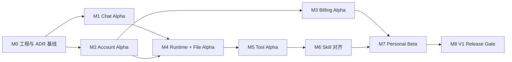

# OpenerX 2.0 V1 开发执行计划

> 状态：`READY_FOR_EXECUTION`
>
> 基准日期：2026-08-25（Asia/Shanghai）
>
> 适用范围：Electron + React 个人 AI 桌面客户端 V1
>
> 当前进度：`M0 COMPLETE / NEXT M1 CHAT ALPHA`
>
> 计划依据：[产品合同](01-product-contract.md)、[领域与 API 合同](04-domain-and-api-contract.md)、[平台与 Runtime 合同](05-platform-and-runtime-contract.md)、[迁移与交付合同](07-migration-and-delivery-contract.md)、[验收合同](08-acceptance-contract.md)

## 1. 计划目标

本计划把已经批准的 V2 产品合同转换为可排期、可分工、可验收的开发工作。开发主线必须交付一个面向单个用户的 Windows/macOS 桌面客户端，而不是继续扩展旧企业控制平面。

V1 完成的判断以以下结果为准：

1. 用户打开 Electron 客户端即可开始对话。
2. Conversation、Message、文件、成果和个人设置独立于 Runtime Session 保存。
3. 账户历史可在 Windows 与 macOS 之间同步和恢复。
4. 模型、Token、报价、费用、额度、积分、充值和账单可以逐笔解释。
5. 文件、Web、浏览器、Shell、桌面控制、MCP 和 Skill 达到已冻结的 Codex 能力基线。
6. 50 条黄金任务、安全门禁、资金门禁和双平台发布门禁全部达到合同标准。

## 2. 范围与排期基线

### 2.1 规划基线

- 6 至 8 人团队：24 至 32 周。
- 4 至 6 人团队：32 至 42 周。
- 账户/同步/商业服务可以与桌面聊天骨架并行，但阶段 Gate 不能被并行开发绕过。
- 当前没有批准的日历发布日期；团队规模、支付渠道、签名账户和运行环境确认后，再把相对周数转换为日期。

### 2.2 V1 不进入开发计划的内容

- Organization、Team、成员目录、SSO、SCIM 和企业管理员控制台。
- 产品负责人/团队负责人工作台、企业审批流和组织预算中心。
- BYOK、自定义 Provider、本地模型、Linux、移动端、语音和订阅套餐。
- 把旧 Project、Task、AgentOps 或 DAG 页面改名为个人客户端页面。
- 大规模自动迁移旧 Task、Runtime Session、余额或账本数据。

## 3. 执行原则

### 3.1 新主线隔离

- V2 新代码只进入 `apps/`、`services/` 和 `packages/`。
- `v1-backup/control-plane/`、`v1-backup/opencode-fork/`、`v1-backup/claude-code-main/`、`v1-backup/pi-mono/` 保持受保护状态，默认只作为行为或测试参考。
- 新主线不得直接 import 旧控制平面业务模块。
- 需要复用旧实现时，先提取合同和测试，再在新目录独立实现。

### 3.2 纵向闭环优先

每个里程碑必须同时包含：领域对象、合同、存储、接口、UI、错误状态、日志、自动测试和验收证据。只建立页面、接口或数据库表均不算完成。

### 3.3 安全与资金能力前置

- Electron 安全边界、账户隔离、幂等键、事件顺序和审计字段从第一版 Schema 开始存在。
- Renderer 永远不能直接访问 Node、文件系统、进程、支付密钥或 Provider 密钥。
- 余额、额度、积分和账本只能由 Billing Service 修改。
- 同步、Runtime、工具和客户端不得成为资金写入旁路。

### 3.4 合同先于实现

跨进程、跨应用和跨服务的修改顺序为：

```text
领域不变量 -> TypeScript 合同/Schema -> 合同测试 -> 实现 -> E2E 证据
```

## 4. 工作流与目录责任

| 工作流 | 主要目录 | 核心责任 | 首个交付 |
| --- | --- | --- | --- |
| Desktop Foundation | `apps/desktop`、`packages/ui-react` | Electron Main、Preload、React Renderer、打包与更新 | 可安装的聊天壳 |
| Personal App Service | `apps/app-service`、`packages/storage` | 本地业务 API、缓存、Conversation/Message 存储 | 本地聊天闭环 |
| Runtime | `apps/runtime-host`、`packages/runtime-sdk` | Runtime Adapter、事件、停止、恢复和隔离 | Fake Runtime，随后真实 Runtime |
| Identity & Sync | `services/identity-api`、`services/account-sync-api`、`apps/sync-service` | 账户、设备会话、revision、游标、离线队列和冲突 | 跨设备历史恢复 |
| Model & Usage | `services/model-gateway`、`services/token-usage-store` | 模型目录、统一调用、Token 真值和去重 | 明确选模与用量页 |
| Commerce | `services/pricing-service`、`services/billing-ledger-service`、`services/payment-adapter` | 报价、预留、结算、账本、支付、退款和对账 | Billing Alpha |
| Files & Artifacts | `packages/domain`、`packages/storage`、`apps/app-service` | 文件授权、解析、引用、版本、预览和云副本 | File Alpha |
| Tools & Skills | `packages/tool-sdk`、`packages/skills`、`apps/runtime-host` | Tool Gateway、MCP、Shell、浏览器、桌面控制和 Skill 生命周期 | Personal Beta 能力 |
| Contracts & Quality | `packages/contracts`、V2 测试目录 | API/IPC/Event Schema、测试夹具、黄金任务和证据 | 每阶段 Gate |
| Observability & Release | `packages/observability`、构建/发布配置 | 脱敏日志、诊断、签名、更新、回滚和性能 | V1 Release |

## 5. 依赖关系



关键路径是 `M0 -> M1/M2 -> M4 -> M5 -> M6 -> M7 -> M8`。M3 可以在 M2 的身份、Usage 和价格合同稳定后与 M4 并行，但 Billing Alpha 必须在 Personal Beta 前通过。

### 5.1 检查点清单与当前状态

检查点不是按时间自动到达，而是在该阶段所有退出条件有可复查证据后形成 Git 提交。到达当前检查点前持续开发；只有需要新增外部授权、不可替代的用户决策或连续验证失败形成真实阻塞时才暂停。

| 检查点 | 当前状态 | 必须通过的 Gate | 检查点证据 |
| --- | --- | --- | --- |
| M0 工程与 ADR 基线 | **COMPLETE** | V2 独立安装、边界检查、lint、typecheck、test、三目标 CI 打包配置；ADR-V2-001 至 006、威胁模型、50 条黄金任务夹具、可交互聊天壳 | [`docs/v2/evidence/m0-2026-08-25.md`](evidence/m0-2026-08-25.md) |
| M1 Chat Alpha | **NEXT** | 本地 Conversation/Message 真值、Fake Runtime 流式/停止/重试/分支/重启恢复；GT-CHAT-01 至 10 Fake 版 | M1 测试报告、双平台启动证据 |
| M2 Account Alpha | NOT STARTED | 邮箱登录、设备会话、双向同步/冲突/撤销、模型目录和 UsageRecord；GT-ACCOUNT-01 至 10 | 双设备与跨账户隔离证据 |
| M3 Billing Alpha | NOT STARTED | 报价/预留/结算、额度/积分/余额、复式账本、支付/退款/对账；GT-BILLING-01 至 10 | 账本重建与支付沙箱证据 |
| M4 Runtime + File Alpha | NOT STARTED | 真实 Runtime Adapter、文件授权/解析/引用、Artifact 生成预览和跨设备恢复；GT-FILE-01 至 10 | 文件矩阵与真实模型证据 |
| M5 Tool Alpha | NOT STARTED | Tool Gateway、Web/Browser/Shell/Desktop/MCP、长任务停止恢复；TOOL-01 至 10 | Windows/macOS E2E 证据 |
| M6 Skill 对齐 | NOT STARTED | Skill 解析、权限、安装/更新/回滚/卸载和跨设备安装记录；SKILL-01 至 10 | FILE/TOOL/SKILL 完整能力矩阵 |
| M7 Personal Beta | NOT STARTED | 账户、计费、文件、工具、Skill 纵向闭环；全部硬门禁通过、黄金任务总通过率与质量分达到验收合同 | Beta 回归、性能、诊断与恢复报告 |
| M8 V1 Release Gate | NOT STARTED | Windows/macOS 签名、公证、安装/更新/回滚、隐私/支付/安全和发布清单全部通过 | 签名制品、发布审批和回滚演练 |

每个检查点提交必须满足：工作树只包含该阶段已审查变更、`git diff --check` 通过、自动 Gate 通过、证据文档记录命令和已知风险。阶段未通过时不得把状态写为 `COMPLETE`。

## 6. 里程碑计划

### M0：工程与 ADR 基线，1 至 2 周

目标：让新主线具备统一构建、测试、打包和安全边界，消除会导致后续返工的基础决策空白。

交付物：

- 注册 V2 workspaces、包命名规则、依赖方向和根脚本。
- 完成 Electron/React/Vite、路由/状态、IPC、存储、打包/签名/更新 ADR。
- 建立 Windows x64、macOS arm64、macOS x64 构建矩阵和 CI 骨架。
- 建立 `packages/contracts` 的版本化 Schema 与错误格式。
- 建立 V2 独立 lint、typecheck、unit、integration、E2E 命令。
- 为 50 条黄金任务补齐固定输入、预期结果和证据目录约定。
- 完成 Electron 信任边界和本地 App Service 的首轮威胁模型。
- 完成聊天主界面可交互原型和可访问性基线。

必须冻结的 ADR：

| ID | 决策 | 最迟冻结点 |
| --- | --- | --- |
| ADR-V2-001 | Monorepo workspace、包命名和依赖方向 | M0 |
| ADR-V2-002 | Electron 构建、打包、签名、自动更新 | M0 |
| ADR-V2-003 | React 路由、异步状态和 UI 基础方案 | M0 |
| ADR-V2-004 | Main/Preload/Renderer IPC 与 Schema 验证 | M0 |
| ADR-V2-005 | 本地数据库、迁移、加密和缓存清理 | M0 |
| ADR-V2-006 | App Service 进程形态与鉴权 | M0 |
| ADR-V2-007 | Runtime Adapter 首个实现和版本策略 | M1 结束前 |
| ADR-V2-008 | 云端对象存储、同步游标和冲突策略 | M1 结束前 |
| ADR-V2-009 | 邮箱验证码、设备凭证库和会话刷新 | M1 结束前 |
| ADR-V2-010 | 支付渠道、Webhook、Saga 与对账架构 | M2 结束前 |

退出条件：新主线可以在本地和 CI 独立 lint、类型检查、测试和构建；所有 M1 阻塞 ADR 已批准。

### M1：Chat Alpha，2 至 3 周

目标：在不依赖文件、工具和真实收费模型的情况下，稳定完成个人聊天闭环。

交付物：

- Electron Main、严格隔离的 Preload Bridge 和 React Renderer。
- `/chat/new`、`/chat/:conversationId`、`/search`、`/settings/*` 页面壳。
- Conversation、Message、MessagePart、分支和本地 revision 模型。
- Fake Runtime 的流式、停止、失败、重试和重新生成。
- 新对话、历史列表、重命名、归档、删除和本地搜索。
- 崩溃重启后历史恢复；流式中断不产生重复消息。
- 开发签名/未签名测试包的 Windows、macOS 安装、启动和退出冒烟测试。

测试重点：

- IPC sender、参数、导航、新窗口和外部链接限制。
- 消息幂等、增量顺序、停止后不再追加、编辑/重试保留旧结果。
- Renderer 无 Node 全局、无直接文件系统和进程访问。
- GT-CHAT-01 至 GT-CHAT-10 的 Fake Runtime 版本。

退出条件：达到 Chat Alpha；日常文本聊天无需旧控制平面即可稳定运行。

### M2：Account Alpha，4 至 5 周

目标：建立个人账户云真值、设备会话、平台模型和 Token 记录。

交付物：

- 邮箱验证码登录、刷新、退出当前设备、退出全部设备和设备撤销。
- 系统凭证库保存会话；Renderer 和日志不接触可复用令牌。
- Conversation、Message、分支和设置的 revision/游标同步。
- 离线队列、幂等重放、删除墓碑、冲突保留和同步状态 UI。
- Model Catalog、Platform Model Gateway、“自动”与明确选模。
- `selectedModelRef`、`effectiveModelRef`、UsageRecord 和 Token 聚合。
- 价格目录只读骨架和用量页面，不在本阶段修改余额。
- Windows/macOS 两设备恢复、两账户隔离和撤销设备测试。

测试重点：

- 同一 operation/message/usage 重放不重复写入。
- 本地路径、文件授权、Cookie、Shell 历史和密钥不跨设备同步。
- Token 缺失字段保持 `unknown`，不写成 0。
- 明确选模不被静默替换；紧急降级有可见记录。
- GT-ACCOUNT-01 至 GT-ACCOUNT-10。

退出条件：达到 Account Alpha；同一账户跨 Windows/macOS 恢复聊天，跨账户访问为零，UsageRecord 可核对。

### M3：Billing Alpha，5 至 7 周

目标：完成个人额度、积分、充值余额、按量费用、支付和账单闭环。

交付物：

- Price Catalog、PriceQuote、PricingSnapshot、资金预留和真实用量结算。
- QuotaGrant、PointGrant、CashBalanceAccount、ChargeRecord 和不可变复式账本。
- 最早到期额度、最早到期积分、充值余额的固定扣减顺序。
- 不足额阻断、停止/失败部分结算、未使用预留释放和冲正。
- 支付宝、微信支付订单、托管收银台、服务端查单/验签回调、退款。
- 每日支付/用量对账、稳定差异 ID 和隔离队列。
- 用量、费用、充值、账单 UI，以及月度 CSV/PDF。
- 运营参数配置、发布审计和测试/正式环境隔离。

测试重点：

- 同一 usage、quote、order、callback、refund 和 sync replay 只生效一次。
- 账本逐事务借贷平衡，余额可从分录重建。
- 价格变化不追溯修改已完成费用。
- 支付成功未入账、支付失败误入账和重复回调均可被恢复或发现。
- Renderer、Runtime 和同步 API 无余额/账本写入口。
- GT-BILLING-01 至 GT-BILLING-10。

退出条件：达到 Billing Alpha；测试资金可逐笔重建，无重复扣费、重复入账或静默透支；属地支付、税务、隐私和保留要求有书面确认。

### M4：真实 Runtime 与 File Alpha，3 至 4 周

目标：用真实平台模型完成文件问答和成果闭环。

交付物：

- 维护中的 Pi Adapter 或批准的首个 Runtime Adapter。
- Runtime Host 隔离、工作目录、能力声明、流式、停止、恢复和错误归一化。
- 文件选择、拖放、粘贴、授权文件夹和 Scope 撤销。
- PDF、DOCX、XLSX、CSV、PPTX、文本/代码、JSON/YAML、图片和 HTML 解析。
- 文件引用定位到页、工作表、范围或文本位置。
- Artifact/ArtifactVersion 的创建、预览、下载、另存和再次引用。
- 附件云副本和成果跨设备恢复；本地绝对路径和授权不继承。
- HTML 无 Bridge 隔离预览和办公文件渲染验证。

测试重点：

- 路径穿越、符号链接、Scope 变更、撤销和重启。
- 原始文件不被静默覆盖，成果不依赖 Runtime 临时路径。
- 真实模型流式、停止、长上下文、失败和 Token/费用回写。
- GT-FILE-01 至 GT-FILE-10、FILE-01 至 FILE-08。

退出条件：达到 File Alpha；非研发用户可独立完成文件问答、成果生成和另一设备恢复。

### M5：Tool Alpha 与长任务，5 至 6 周

目标：通过统一 Tool Gateway 安全运行 Web、浏览器、Shell、桌面控制和 MCP。

交付物：

- Tool Catalog、ToolCall、PermissionRequest、Grant Scope 和统一活动记录。
- 第一方 Web 搜索、来源和时效状态。
- 隔离浏览器：导航、点击、输入、截图、上传、下载和本地 Web 预览。
- Shell/代码：授权工作目录、流式输出、输入、停止、超时、长进程和退出状态。
- Windows/macOS 受控桌面操作，高影响动作逐次确认。
- 本地 STDIO 和远程 Streamable HTTP MCP，Bearer/OAuth、重连和清除授权。
- WorkItem、ExecutionRun、持久化事件、离开后继续、恢复和取消。
- 外部写操作幂等键和子进程/临时权限回收。

测试重点：

- 允许、拒绝、撤销、Scope 变化和客户端重启后的行为。
- 网络、文件、Shell、浏览器和桌面权限不能互相提升。
- 工具失败不损坏 Conversation、同步队列和已有 Artifact。
- TOOL-01 至 TOOL-10、GT-TOOL-01 至 GT-TOOL-06/10。

退出条件：TOOL-01 至 TOOL-10 在 Windows 与 macOS 均有 E2E 证据，长任务可以安全停止和恢复。

### M6：Skill 系统与能力对齐，3 至 4 周

目标：完成开放 Skill 包格式和 Codex 文件/工具/Skill 能力矩阵。

交付物：

- `SKILL.md`、scripts、references、assets 和可选元数据解析。
- 内置、个人和工作区 Scope；显式选择和自动触发。
- 渐进加载、来源/版本/依赖/权限预览和校验值。
- 安装、启用、禁用、更新、权限重审、回滚和卸载。
- 安装记录同步；设备级文件、Shell、浏览器和桌面权限重新授权。
- Skill 脚本统一走 Tool Gateway，无旁路执行能力。
- 单个 Skill 缺失或崩溃时普通聊天保持可用。

测试重点：

- SKILL-01 至 SKILL-10。
- GT-TOOL-07 至 GT-TOOL-09。
- 文件、工具和 Skill 全矩阵双平台回归。

退出条件：FILE、TOOL、SKILL 每一行都有 Windows/macOS 自动或受控 E2E 证据。

### M7：Personal Beta，3 至 4 周

目标：用真实目标用户和生产相似环境验证完整个人工作闭环。

交付物：

- 5 至 20 名目标用户的受控 Beta。
- 启动、历史搜索、同步冲突、数据清理、诊断导出和可访问性完善。
- 冷启动、空闲内存、长会话内存和长任务稳定性优化。
- 安全测试、依赖审计、密钥扫描、故障注入和恢复演练。
- 50 条黄金任务完整证据和已知失败分类。
- 支付/用量对账值守、异常队列和客服处理 Runbook。

退出条件：至少 46/50 条黄金任务通过，所有硬门禁任务通过；无 P0/P1 数据丢失、越权、密钥泄漏、重复扣费/入账问题。

### M8：V1 Release Gate

目标：完成签名发布、更新和回滚，并取得明确发布批准。

必须通过：

- Windows 10 22H2/Windows 11 x64、macOS 14+ arm64、macOS 14+ x64 构建矩阵。
- 安装、升级、卸载、自动更新、签名验证和回滚演练。
- 数据保留、账户删除、本地缓存清理和财务记录保留行为。
- 冷启动、内存、长会话、同步和产品指标达到批准预算。
- 50 条黄金任务、Codex 能力矩阵、安全门禁和商业资金门禁。
- 用户明确批准发布。

## 7. 首个两周迭代清单

首个迭代只完成 M0 和 M1 的可开工部分，不接真实支付、不接真实文件写入、不复用旧 Vue 页面。

| 顺序 | ID | 工作项 | 主要产物 | 完成证据 |
| --- | --- | --- | --- | --- |
| 1 | BOOT-001 | 注册 V2 workspaces 与依赖方向 | 根 workspace、V2 独立脚本 | 安装、lint、typecheck 命令通过 |
| 2 | BOOT-002 | 编写 ADR-V2-001 至 006 | `docs/v2/adr/` | ADR 状态为 Accepted |
| 3 | BOOT-003 | 建立合同包与 Schema 验证 | `packages/contracts` | 合同正反例测试通过 |
| 4 | DESK-001 | 初始化 Electron + React + Vite | `apps/desktop` | 开发模式显示空聊天壳 |
| 5 | DESK-002 | 建立 Main/Preload/Renderer 安全边界 | 类型化 Bridge | IPC 安全测试通过 |
| 6 | DESK-003 | 实现窗口生命周期和内部路由 | 新对话/搜索/设置壳 | 启动、退出、刷新冒烟通过 |
| 7 | DOMAIN-001 | 建立 Conversation/Message 最小领域模型 | `packages/domain` | 状态与不变量单测通过 |
| 8 | STORE-001 | 选择并接入本地数据库迁移骨架 | `packages/storage` | 新库/升级/回滚测试通过 |
| 9 | CHAT-001 | 实现 Conversation/Message Repository | App Service 接口 | CRUD、revision、删除测试通过 |
| 10 | RUNTIME-001 | 实现 Fake Runtime Adapter | `packages/runtime-sdk`、`apps/runtime-host` | 流式/停止/失败/重试测试通过 |
| 11 | CHAT-002 | 接通发送、流式、停止和重试 UI | React 聊天页 | GT-CHAT-01/06/07 自动化通过 |
| 12 | QA-001 | 建立 V2 CI 与 Electron E2E | 独立测试命令 | macOS 本机和 Windows CI 冒烟通过 |
| 13 | SEC-001 | 建立 Electron 威胁模型与安全断言 | 安全清单和测试 | Node/导航/窗口/IPC 负向测试通过 |
| 14 | QA-002 | 固定聊天黄金任务夹具 | `GT-CHAT-*` fixtures | 输入、预期、证据路径齐全 |

首个迭代结束时应能演示：启动桌面客户端、新建对话、Fake Runtime 流式回答、停止、失败重试、重启后恢复历史。未达到这一闭环时，不提前进入账户或计费页面开发。

## 8. 每个工作项的完成定义

一个工作项只有同时满足以下条件才可标记为 `Done`：

1. 对应合同和非目标没有被改变；若改变，先走文档决策。
2. 代码位于正确的新主线目录，没有导入旧控制平面业务实现。
3. 类型、Schema、错误和事件已版本化；不存在未说明的 `any` 或隐式零值。
4. 单元、集成、合同和所需 E2E 测试通过。
5. 安全负向测试、幂等测试、停止/失败/重启路径按风险覆盖。
6. 日志脱敏，事件具备 `correlationId`、对象 ID 和稳定时间顺序。
7. 用户可见的加载、空、失败、离线、权限和恢复状态完整。
8. 文档标记实现状态并链接代码、测试和证据路径。
9. 提交可独立回滚，数据库变更具有向前兼容窗口。

## 9. 分支、提交与发布策略

- V2 工作使用 `codex/v2-<milestone>-<topic>` 或团队批准的同等短生命周期分支。
- 一个提交只完成一个可说明的合同变化、功能切片或测试基线。
- 推荐提交前缀：`chore(v2)`、`feat(desktop)`、`feat(sync)`、`feat(billing)`、`test(v2)`、`docs(v2)`。
- Schema 迁移、支付/账本规则和 IPC 权限变化不得与无关格式化混在同一提交。
- 每个里程碑保留可安装构建、迁移版本、测试报告和回滚说明。
- 旧平台继续使用原启动命令；V2 必须有独立的 `dev:v2`、`test:v2`、`build:v2` 命令。

## 10. 质量与证据矩阵

| Gate | 自动化证据 | 人工/环境证据 | 负责里程碑 |
| --- | --- | --- | --- |
| Chat Alpha | IPC、Message、流式、停止、重试、E2E | Windows/macOS 安装冒烟 | M1 |
| Account Alpha | 身份、同步、冲突、隔离、Usage 去重 | 两设备跨平台恢复 | M2 |
| Billing Alpha | 报价、预留、账本、Webhook、退款、对账 | 支付测试环境与合规确认 | M3 |
| File Alpha | 解析、引用、版本、权限、渲染 | 办公成果逐格式打开 | M4 |
| Tool Alpha | Scope、审批、沙箱、取消、MCP | 浏览器/Shell/桌面双平台 | M5 |
| Skill 对齐 | 安装、触发、更新、卸载、失败隔离 | 个人/工作区 Skill 双平台 | M6 |
| Personal Beta | 黄金任务、故障注入、性能、安全 | 5 至 20 名目标用户 | M7 |
| V1 Release | 全矩阵回归、升级和回滚 | 签名包、发布批准 | M8 |

所有证据至少记录：commit、构建 ID、平台、测试数据版本、模型目录版本、选择/实际模型、权限 Scope、Token/价格版本、结果和日志/截图路径。

## 11. 主要风险与缓解

| 风险 | 影响 | 缓解措施 | 最迟关闭点 |
| --- | --- | --- | --- |
| Electron 安全边界失控 | 本地文件、凭证或进程越权 | 最小 Bridge、Schema 验证、负向 IPC 测试 | M1 |
| 跨平台打包后置 | Windows/macOS 差异集中爆发 | M0 建矩阵，M1 开始持续产包 | M1 |
| 同步冲突与幂等设计过晚 | 重复消息、历史覆盖、重复 Token | operationId/revision/tombstone 从首版合同进入 | M2 |
| Runtime 与产品数据耦合 | 更换 Runtime 导致历史不可读 | Conversation/Message 独立存储，Adapter 只保留内部引用 | M1/M4 |
| 计费建立在不可靠 Usage 上 | 重复扣费、无法对账 | Usage 去重先于 Billing，价格快照和账本追加式 | M3 |
| 支付渠道或合规延期 | Billing Alpha 和发布延期 | M0 启动渠道接入与属地评估，测试/正式环境隔离 | M2 |
| 办公文件渲染差异 | Artifact 无法真实使用 | 固定格式夹具，逐格式渲染和人工打开验证 | M4 |
| Tool/Skill 权限旁路 | 高风险未授权执行 | 所有脚本、MCP、浏览器和 Shell 统一走 Tool Gateway | M5/M6 |
| 旧系统持续吸收 V2 需求 | 新主线被拖回控制平面心智 | 目录隔离、依赖检查、V2 独立 Gate | 全程 |
| 范围继续扩张 | 24 至 32 周基线失效 | 非目标清单和合同变更记录；新增范围单独重估 | 全程 |

## 12. 尚待确认但不阻塞计划整理的事项

以下事项必须在对应最迟冻结点前解决：

- 团队人数、角色分配和迭代节奏。
- React Router、异步状态、UI 基础库和本地数据库的最终选型。
- Electron 打包/更新服务、Apple/Windows 签名账户和 CI 运行器。
- 云部署区域、对象存储、邮件服务和设备会话基础设施。
- 首个维护中 Runtime 包及其许可、版本和能力差距。
- 支付宝/微信商户主体、沙箱、回调域名和属地合规责任人。
- 积分兑换具体数字、充值档位/上下限和运营后台最小配置方式。
- Beta 用户、基准设备、性能预算具体数字和发布支持安排。

这些事项没有确认前，可以完成 M0 中不依赖其最终答案的合同、测试和桌面骨架工作；不得用临时默认值进入正式支付或发布构建。

## 13. 计划维护方式

- 状态只使用：`Not Started`、`In Progress`、`Blocked`、`Done`。
- 每周更新里程碑完成度、阻塞、风险、测试通过率和可演示闭环。
- 每个 Gate 只接受代码与证据，不接受口头完成或静态页面演示。
- 合同范围变化先更新 `docs/v2` 决策文档，再调整本计划和估算。
- 里程碑完成后，在本文件记录完成日期、commit、构建 ID 和证据入口。

当前下一步：执行 M0 的 `BOOT-001`，注册 V2 workspaces 和独立质量命令；随后连续完成 ADR-V2-001 至 ADR-V2-006。
