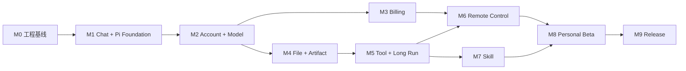

# OpenerX 2.0 V1 开发计划

> 状态：`M0 COMPLETE / M1 COMPLETE / PI FOUNDATION COMPLETE / M2 LOCAL COMPLETE / NEXT M3`
>
> 更新日期：2026-08-25（Asia/Shanghai）
>
> 适用范围：Electron + React 的 Windows/macOS 执行主机与 React Native iOS/Android Remote Companion

## 1. 交付结果

V1 完成必须同时满足：

1. 用户打开桌面客户端即可聊天，并能停止、重试、搜索和恢复历史。
2. Conversation、Message、文件、成果和设置独立于 Pi 私有 Session 保存。
3. 同一账户可在 Windows 与 macOS 间同步和恢复。
4. 模型、Token、报价、费用、额度、积分、余额、充值和账单可逐笔解释。
5. 文件、Web、浏览器、Shell、桌面控制、MCP 和 Skill 达到 Codex 能力基线。
6. 用户可从 iOS/Android 安全控制已配对的在线桌面主机，完成 Start、Queue、Steer、Stop、审批和结果审阅。
7. 黄金任务、安全、资金、桌面/移动矩阵打包、签名和更新门禁全部通过。

## 2. 不可变架构原则

- `@earendil-works/pi-coding-agent@0.84.3` 是当前唯一生产 agent harness。
- Pi 负责 `AgentSession`、Agent Loop、模型轮次、上下文、压缩、内部重试和工具调用生命周期。
- `packages/pi-host` 只承载 Pi、隔离工作目录和 Electron 进程桥接。
- V2 只负责产品数据、进程监督、模型/计费前置条件、事件投影和 Capability and Permission Broker。
- WorkItem、ExecutionRun、RunStep 和 ToolCall 是 Pi 事件的产品投影，不是第二套执行器。
- 不提供多 harness 抽象、V2 自有步骤规划器或旧执行引擎兼容层。
- 测试可以注入 Pi 原生测试 Model Provider；生产源码和 Release 路径不得包含假 harness 或固定回答模型。
- Pi API、事件或工具语义与 V2 既有概念冲突时，以 Pi 为准，并同步修改 V2 合同。
- 手机是控制面、桌面是执行面；Remote Start/Steer/Queue/Stop 直接映射 Pi `prompt()`/`steer()`/`followUp()`/`abort()`。
- Remote Relay 只路由有时效、可验签、可去重的产品命令和事件，不拥有 Pi Session、运行时队列或权限决策。

规范性决策见 [ADR-V2-007](adr/007-pi-harness-boundary.md)。

## 3. 当前基线

| 检查点 | 状态 | 已交付 | 剩余门禁 |
| --- | --- | --- | --- |
| M0 工程与 ADR | COMPLETE | npm workspaces、Electron/React 骨架、边界检查、CI、威胁模型 | 发布签名属于 M9 |
| M1 Chat Alpha | COMPLETE | Conversation/Message、分支、搜索、流式投影、停止、失败、重启恢复、桌面 UI | 双平台原生 CI 结果在发布前确认 |
| Pi Foundation | COMPLETE | 直接依赖 Pi；`AgentSession` 原生事件；`pi.session.prompt/abort`；生产包仅含 Pi Host | [实现与质量证据](evidence/pi-foundation-2026-08-25.md) |
| M2 Account + Model | LOCAL COMPLETE | 账户/设备会话、Outbox/冲突/墓碑、Pi-native Model Gateway Provider、UsageRecord、Remote V1 Schema | 原生 Windows/macOS 双设备与付费 Provider 验证属于发布环境门禁；[实现与质量证据](evidence/m2-2026-08-25.md) |

当前生产路径在未配置平台模型时明确返回 `PI_MODEL_NOT_CONFIGURED`，不以测试模型伪装可用模型。

## 4. 依赖顺序

账户/模型与计费可以和桌面文件能力并行，但收费执行必须在 Usage、报价、预留和账本真值完成后开放。

加入 Remote 后，6 至 8 人团队的总规划基线为 29 至 39 周；4 至 6 人团队为 38 至 50 周。M6 Remote 与 M7 Skill 可在 M5 完成后部分并行，但 M8 Beta 必须等待两者都通过。

## 5. 里程碑

### M0：工程与安全基线 — COMPLETE

- Electron Main、Preload、React Renderer 和 utility-process 构建。
- npm workspace、依赖边界、lint、typecheck、test、打包和 Fuse 检查。
- Windows x64、macOS arm64/x64 矩阵。
- IPC、存储、App Service 和 Pi harness ADR。

证据：[M0 checkpoint](evidence/m0-2026-08-25.md)。

### M1：Chat Alpha 与 Pi Foundation — COMPLETE

- Conversation、Message、MessagePart、分支、revision 和幂等。
- 新对话、历史、搜索、重命名、归档、删除、编辑和重新生成。
- App Service 与 Pi Host 独立 utility process；私有 MessagePort、启动 nonce 和有界重启。
- Pi `AgentSession` 流式事件、`abort()`、无工具聊天配置和产品事件投影。
- Pi 原生 `ModelRuntime` Provider 注入；确定性 Provider 仅位于测试。
- App Service 崩溃后保留已提交历史和部分输出。

退出条件：GT-CHAT-01 至 GT-CHAT-10、Electron 安全断言和当前三个桌面目标包门禁通过。

证据：[Pi Foundation checkpoint](evidence/pi-foundation-2026-08-25.md)。

### M2：Account、Sync、Model 与 Usage — LOCAL IMPLEMENTATION COMPLETE

- 邮箱登录、设备会话、刷新、撤销、退出和系统凭证库。
- 账户云真值、本地 Outbox、revision、cursor、冲突、墓碑和跨设备恢复。
- Model Catalog、明确选模、实际模型和可解释降级。
- Platform Model Gateway 以 Pi 原生 Provider/`ModelRuntime` 接入，不新增模型 adapter 或第二套 loop。
- UsageRecord 记录输入、缓存、输出、推理和总 Token；稳定去重并关联 Message/Run。
- 客户端不保存上游 Provider API Key。
- 冻结 RemoteHost、设备公钥、配对/撤销、RemoteCommand/Receipt、AttentionRequest 和 RemoteEventCursor 合同；Identity API 预留账户内设备能力。

本地退出条件：GT-ACCOUNT-01 至 GT-ACCOUNT-10 的 M2 实现切片；独立设备副本恢复、两账户零串读、模型与 Token 可核对。GT-ACCOUNT-02/03/05 中的附件、Artifact、文件和预签名资源随 M4 验收，GT-ACCOUNT-07 的真实文件/工具执行随 M4/M5 验收；不得用 M2 证据提前宣称这些切片通过。原生 Windows/macOS 双设备和真实付费 Provider 仍是发布环境门禁。

证据：[M2 checkpoint](evidence/m2-2026-08-25.md)。Remote 在本检查点冻结版本化协议
Schema；移动端、Connector、Relay、推送和真机矩阵仍由 M6 交付。

### M3：Billing Alpha — 5 至 7 周

- Price Catalog、报价、价格快照、费用预留和真实用量结算。
- QuotaGrant、PointGrant、CashBalanceAccount 和追加式复式账本。
- 支付宝/微信订单、托管收银台、验签、查单、退款和每日对账。
- 用量/费用、充值、账单和月度 CSV/PDF。
- 重放、重试、服务重启和支付异常不能重复扣费或入账。

退出条件：GT-BILLING-01 至 GT-BILLING-10，测试资金可从账本逐笔重建且账平。

### M4：File、Artifact 与 Pi Session 恢复 — 3 至 4 周

- 文件/文件夹 Scope、撤销、符号链接防护和受控副本。
- PDF、DOCX、XLSX、CSV、PPTX、文本/代码、JSON/YAML、图片和 HTML 解析。
- 引用页码、工作表、范围或文本位置。
- Artifact 创建、预览、版本、下载和另一设备恢复。
- 在 Pi 原生 SessionManager 上完成长上下文、压缩、恢复和宿主崩溃行为；产品历史仍为独立真值。
- 文件能力以 Pi 原生工具定义注册，实际读写经过 V2 Broker。

退出条件：GT-FILE-01 至 GT-FILE-10、FILE-01 至 FILE-08，支持格式均有渲染和真实打开证据。

### M5：Tool Alpha 与长任务 — 5 至 6 周

- Web 搜索、隔离浏览器、本地 Web 预览、Shell/代码、桌面控制和 MCP。
- 工具通过 Pi 原生 ToolDefinition 注册；Pi 管理调用生命周期并接收结果。
- V2 Broker 管理 Scope、审批、沙箱、网络策略、副作用幂等和审计。
- 从 Pi 事件投影 WorkItem、ExecutionRun、RunStep、ToolCall 和 PermissionRequest。
- 长任务可离开、返回、停止、恢复；子进程和临时授权可回收。

退出条件：TOOL-01 至 TOOL-10 在 Windows/macOS 通过；越权和崩溃注入均安全失败。

### M6：Remote Control Alpha — 5 至 7 周

- 新建 React Native + Expo 的 `apps/mobile`，交付 iOS/Android 的 Hosts、Tasks、Inbox 和 Settings。
- 实现同账户二维码配对、设备密钥、主机 Presence、撤销、多主机切换和不含敏感正文的 APNs/FCM 推送。
- 实现受监督 Remote Host Connector；只建立出站 TLS/WSS，通过私有 MessagePort 调用 App Service，不开放主机监听端口。
- 实现 Remote Control Gateway 的密文路由、短 TTL 重投、事件游标、回执和跨账户隔离；Relay 不读取业务正文。
- Start、Steer、Queue、Stop 分别直接调用 Pi `prompt()`、`steer()`、`followUp()`、`abort()`；不实现 Remote 专用执行队列。
- 手机支持问题回复、受限审批、Diff/测试/终端/截图/Artifact 审阅和图片/文件附件。
- 覆盖主机休眠/退出、网络切换、手机断线、多控制器、重复/乱序/过期/篡改命令、手机丢失和设备撤销。

退出条件：[15-remote-control-contract.md](15-remote-control-contract.md) 全部硬门禁在 iOS/Android 真机与 Windows/macOS 主机矩阵通过；远程命令不重复调用 Pi、工具副作用、UsageRecord 或 ChargeRecord。

### M7：Skill 对齐 — 3 至 4 周

- Pi 加载 `SKILL.md`、scripts、references、assets 和依赖声明。
- 内置、个人和工作区 Scope；显式/自动触发和渐进加载。
- 安装、启用、更新、权限复核、回滚、禁用和卸载。
- 安装记录可同步；设备文件/Shell/浏览器/桌面权限不跨设备继承。
- Skill 脚本只能通过 V2 Broker 使用实际能力。

退出条件：SKILL-01 至 SKILL-10；Codex FILE/TOOL/SKILL 能力矩阵无阻断缺口。

### M8：Personal Beta — 3 至 4 周

- 5 至 20 名目标用户；桌面聊天、文件、工具、Skill、账户、计费和手机 Remote 纵向闭环。
- 启动、性能、诊断、数据导出/删除、故障恢复和高频体验修复。
- 50 条黄金任务与 Remote 专项矩阵达到 Beta 阈值，所有硬门禁通过。

### M9：V1 Release — 2 至 3 周

- Windows/macOS 签名、公证、安装、升级、回滚和更新源验证。
- iOS/Android 商店签名、隐私清单、推送生产环境、更新和紧急撤回验证。
- 安全、隐私、支付、税务和数据保留清单。
- 依赖图证明 Release 只有 Pi harness，且手机、Relay、Connector 中没有测试 Provider、Legacy 依赖或第二套运行时队列。
- 发布审批与回滚演练。

## 6. 当前下一迭代

| 顺序 | ID | 工作项 | 完成证据 |
| --- | --- | --- | --- |
| 1 | PRICING-001 | 版本化 Price Catalog、收费条款和价格快照 | 生效区间、币种、舍入和版本测试 |
| 2 | QUOTE-001 | 执行前报价与最大费用预留 | 过期、重放、余额不足和并发测试 |
| 3 | LEDGER-001 | 追加式复式账本与账户资产投影 | 借贷平衡、反向分录和全量重建 |
| 4 | SETTLEMENT-001 | UsageRecord 到唯一 ChargeRecord 结算 | 重试、停止、失败和去重测试 |
| 5 | ASSET-001 | 额度、积分和充值余额分账及扣减顺序 | 到期、适用范围和零透支测试 |
| 6 | PAYMENT-001 | 支付宝/微信订单、验签、查单、退款和对账 | 测试环境回调、重放和异常恢复 |
| 7 | STATEMENT-001 | 账单明细、月度 CSV/PDF 和调整记录 | 聚合一致性与文件打开证据 |
| 8 | QA-M3-001 | 资金隔离、服务重启和故障注入 | GT-BILLING-01 至 GT-BILLING-10 |

## 7. 完成定义

每个工作项必须：

1. 更新领域或进程合同，并有正向、负向和恢复测试。
2. 保持 Renderer 无 Node、文件系统、原始 IPC、凭证和账本写权限。
3. 保持 Conversation/Message 可独立于 Pi Session 读取和迁移。
4. 对外副作用有 Scope、审批、幂等和审计。
5. Token/费用字段未知时保持 `unknown`，不猜测。
6. 通过边界检查、lint、typecheck、test、build 和相关 E2E。
7. 更新实现状态和可复现证据。
8. Pi 相关工作直接使用 Pi API，不复制其 loop/session/compaction/retry/tool lifecycle。
9. Remote 相关工作保持手机控制面、桌面执行面，并直接使用 Pi `prompt/steer/followUp/abort`，不复制队列或 SessionManager。

## 8. 发布 Gate

| Gate | 自动化证据 | 环境/人工证据 |
| --- | --- | --- |
| Chat + Pi | Pi 原生事件、停止、恢复、IPC、Message、Renderer E2E | Windows/macOS 启动与交互 |
| Account | 身份、同步、冲突、隔离、设备撤销、本机缓存/云删除边界 | 原生 Windows/macOS 双设备恢复 |
| Model + Usage | Pi Provider、自动/明确选模、实际模型、Token 去重、错误归一化 | 真实付费模型流式/停止 |
| Billing | 报价、预留、账本、Webhook、退款、对账 | 支付测试环境与合规确认 |
| File | Scope、解析、引用、版本、渲染 | 每种办公成果真实打开 |
| Tool | Pi tool lifecycle、Broker、取消、MCP | 浏览器/Shell/桌面双平台 |
| Skill | Pi 加载、安装、更新、卸载、失败隔离 | 个人/工作区 Skill 双平台 |
| Remote | 配对/撤销、签名/加密、命令幂等、Pi 映射、游标恢复、通知脱敏 | iOS/Android 真机 × Windows/macOS 主机；休眠、断线、丢失手机和多控制器演练 |
| Release | 全矩阵、升级、回滚、安全扫描 | 签名包和发布批准 |

## 9. 主要风险

| 风险 | 控制 |
| --- | --- |
| V2 再造 Pi harness | ADR-V2-007、依赖检查和代码扫描；禁止第二套执行协调器 |
| Pi API 升级漂移 | 固定版本；事件、Session、工具、压缩和打包回归后才升级 |
| Pi Session 与产品历史耦合 | 产品历史独立持久化；Pi ref 仅内部使用，失败时明确终态 |
| Electron 权限扩大 | 最小 Bridge、独立 Pi Host、Broker Scope、负向 IPC/路径测试 |
| 同步冲突或重复 | operationId、revision、cursor、墓碑和双设备回放测试 |
| 用量或计费重复 | Usage/Charge 稳定去重、冻结价格、追加式账本和对账 |
| Tool/Skill 权限旁路 | Pi 只发起调用；实际能力全部经 Broker |
| Remote 暴露桌面主机 | Connector 只出站连接，Relay 不可解密，主机无公网/localhost Remote 监听端口 |
| 手机丢失或配对被盗 | 设备私钥进系统安全存储、短时二维码、MFA、立即撤销和敏感动作生物识别 |
| 断线/多控制器导致重复执行 | commandId、幂等键、baseRevision、单调 sessionSequence、短 TTL 和主机最终去重 |
| 主机离线造成错误预期 | 明确 Presence；离线时历史只读并拒绝新执行/审批，不提供离线命令邮箱 |
| 跨平台问题后置 | 从每个 Alpha 开始持续产出三个桌面目标和 iOS/Android 真机 E2E |

## 10. 当前下一步

直接进入 M3 Billing Alpha：先冻结价格、报价、预留、结算和复式账本合同，再接支付与账单。M4 File/Artifact 可在不改变 M3 资金真值的前提下并行推进。
