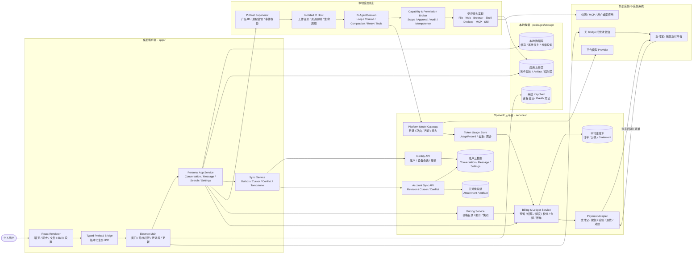
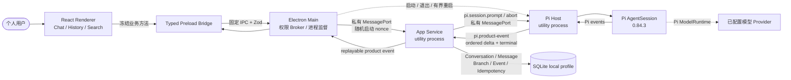
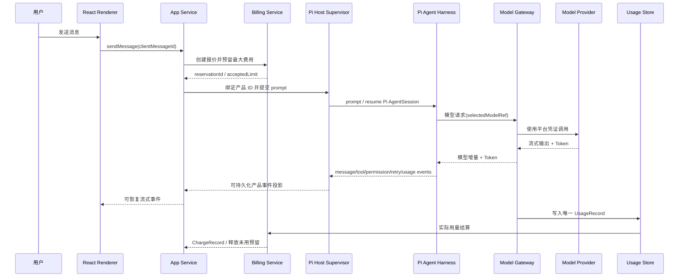
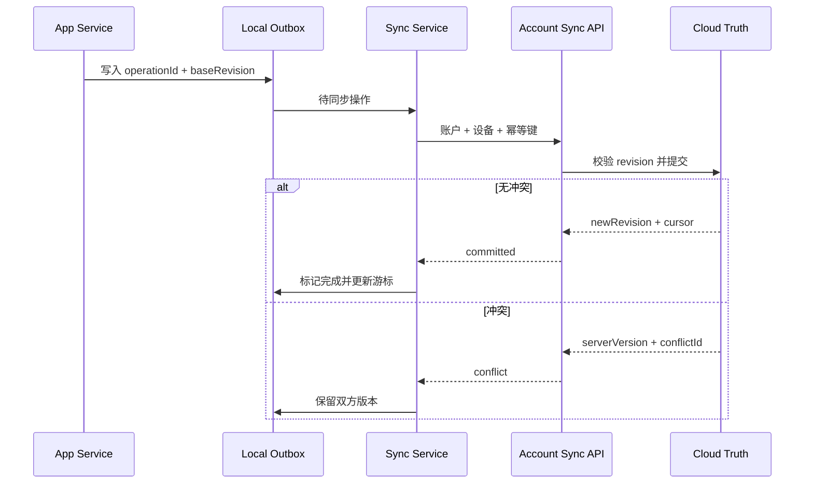

# OpenerX 2.0 V1 整体架构

> 状态：`M1_CHAT_ALPHA_AND_PI_FOUNDATION_COMPLETE / M2_ACCOUNT_ALPHA_NEXT`
>
> 更新日期：2026-08-25（Asia/Shanghai）
>
> 适用范围：Windows 10 22H2+/Windows 11 x64、macOS 14+ arm64/x64 个人桌面客户端

## 1. 架构变化结论

整体架构已经发生根本变化。旧版是以浏览器、BFF、企业 Control Plane 和 Task/Workflow 为中心的控制平面；V2 改为以 Electron 个人客户端、Conversation/Message、账户云同步和安全本地执行为中心。

| 维度 | 旧架构 | V2 架构 |
| --- | --- | --- |
| 用户入口 | 浏览器 Web UI | Electron + React 桌面客户端 |
| 用户心智 | Project、Task、Workflow、Agent 控制 | Conversation、Message、File、Artifact |
| 前端边界 | Web UI 通过 BFF 访问 Control Plane | Renderer 通过类型化 Preload Bridge 访问本地 App Service |
| 本地权限 | 浏览器、BFF 和旧执行模块分散处理 | Electron Main 与 V2 Broker 管理权限；Pi Host 独立隔离 |
| 执行边界 | BFF 托管旧执行引擎并聚合任务事件 | Isolated Pi Host；Pi 完整拥有 agent harness |
| 数据真值 | PostgreSQL 中的控制平面与 Task 数据 | 账户云真值 + 本地缓存/离线队列；Conversation/Message 独立于 Pi Session |
| 模型 | 旧执行引擎自行配置 Provider | Pi `ModelRuntime` 接 Platform Model Gateway，统一凭证、Usage 和实际模型记录 |
| 商业系统 | 成本/预算治理视图 | 报价、预留、额度、积分、充值余额、复式账本、支付和账单 |
| 工具能力 | 旧执行引擎和插件各自配置 | Pi 管理工具调用生命周期；V2 Capability Broker 统一 Web、Browser、Shell、Desktop、MCP、Skill 权限与副作用 |
| 企业能力 | Organization、Project、审批、治理是主线 | 移出 V1，旧系统保留为 Legacy |

## 2. V2 总体逻辑架构图

下图是完整 V1 目标态；其中账户云、模型网关、计费和工具域将在后续检查点接入。M1
不会用占位实现伪装这些尚未交付的能力。



### 2.1 M1 当前已实现拓扑



M1 没有 localhost App Service、Renderer 网络业务 API、Platform Model Gateway、账户云或账单调用。
Pi Host 已直接加载 `@earendil-works/pi-coding-agent@0.84.3`；每次生成使用 Pi
`AgentSession` 和 Pi 原生事件。没有可用模型时明确返回 `PI_MODEL_NOT_CONFIGURED`。应用重启时
未完成助手消息以 `APP_SERVICE_RESTARTED` 失败状态恢复，并保留已落盘的部分文本。

确定性测试只在测试文件中注入 Pi 的 `faux` Model Provider；生产源码没有替代 harness
或固定回答模型。

## 3. 主链路

### 3.1 聊天与收费模型调用



关键约束：消息先以稳定 ID 落盘；收费执行必须先预留；模型凭证只在服务端；Pi 完整负责 Agent Loop、Session、上下文压缩、内部重试和工具调用生命周期；V2 只监督宿主并投影产品状态；重试不能产生第二条有效 UsageRecord 或 ChargeRecord。

### 3.2 云同步



同步只负责账户内容。设备权限、绝对路径、Cookie、Shell 历史、平台密钥、商业余额和账本均不进入普通离线同步队列。

## 4. 信任边界

| 区域 | 信任级别 | 可以做什么 | 明确禁止 |
| --- | --- | --- | --- |
| React Renderer | 不可信 Web 环境 | 展示、输入、调用窄 Bridge | Node、文件系统、进程、密钥、账本写入 |
| Preload Bridge | 最小桥接层 | 版本化 DTO、参数校验、业务动作 | 暴露原始 `ipcRenderer` 或通用执行接口 |
| Electron Main | 桌面权限 Broker | 窗口、系统对话框、Keychain、进程监督 | AI 长任务、文档解析、支付事实判定 |
| App Service | 本地业务协调 | 本地缓存、对话、同步队列、模型/账单 API | 修改服务端余额、保存 Provider 密钥 |
| Pi Host | 不可信执行区 | 在授权工作目录运行 Pi `AgentSession` | 扫描 Home、读取全局凭证、任意网络 |
| Capability & Permission Broker | 能力安全边界 | 接受 Pi 工具调用，执行 Scope、审批、沙箱、审计和副作用幂等 | 自行规划 Agent 步骤；Skill/MCP/Shell 绕过权限系统 |
| 云平台 | 账户与商业真值 | 身份、同步、模型路由、用量、账本、支付 | 接受客户端提交的余额或支付成功状态 |

## 5. 数据真值

| 数据 | 唯一真值 | 本地状态 |
| --- | --- | --- |
| Conversation、Message、可同步设置 | 账户云数据 | 缓存、离线队列、搜索投影 |
| 本地文件权限和绝对路径 | 当前设备 | 不同步 |
| Attachment、Artifact 内容 | 云对象存储 + 受控本地副本 | 可重建缓存或设备副本 |
| Pi Session/AgentSession | Pi Host 内部引用 | 不是用户历史真值 |
| 模型 Token | UsageRecord | 只读展示缓存 |
| 费用 | ChargeRecord + PricingSnapshot | 只读展示缓存 |
| 额度、积分、充值余额 | 不可变账本投影 | 不进入离线写队列 |
| 支付结果 | 服务端查单/验签回调 | 客户端只轮询和展示 |

## 6. 仓库映射

```text
apps/desktop                     Electron Main / Preload / React Renderer
packages/app-service             Personal App Service 核心与 utility-process 入口
packages/pi-host                 Pi AgentSession 组合与 utility-process 入口
services/identity-api            账户与设备会话
services/account-sync-api        云同步 API
services/model-gateway           平台模型目录与统一调用
services/token-usage-store       UsageRecord 与 Token 聚合
services/pricing-service         价格目录、报价与快照
services/billing-ledger-service  预留、结算、额度、积分、余额、账本与账单
services/payment-adapter         支付宝/微信支付、退款与对账
packages/domain                  Conversation-first 领域模型
packages/contracts               IPC/API/Event Schema
packages/tool-sdk                Tool/Permission 合同
packages/skills                  Skill 包与生命周期
packages/ui-react                React UI 基础
packages/storage                 本地/云存储抽象
packages/observability           脱敏日志、Trace 和诊断
```

## 7. Legacy 边界

旧系统已整理到 `v1-backup/`，不出现在 V2 主调用链，仅作为可恢复归档和行为参考。V2 新代码不得直接依赖旧 Control Plane 的 Organization、Project、Task、Workflow 或审批模型。

## 8. M1 已实现映射

- 根 workspace 使用 npm 11；`apps`/`services` 只通过 `packages` 共享合同和实现。
- Electron 44 + Forge 7 + Vite 6 分别构建 Main、Preload、App Service、Pi Host 和
  Renderer；当前产物为未签名开发包。
- Renderer 使用 React 19、HashRouter、TanStack Query 和安全 Markdown，只能调用冻结的
  类型化 Preload Bridge；没有 Node、原始 IPC 或本地服务端口。
- Main 以独立 utility process 监督 App Service 和 Pi Host；进程间使用私有
  MessagePort、256-bit 启动 nonce、版本化合同和有界重启。
- App Service 独占 `node:sqlite`，实现迁移校验、Conversation/Message/Part、分支、revision、
  幂等键、单调事件和中断恢复。M1 数据库不包含账户凭证。
- Pi Host 直接运行维护中的 Pi 0.84.3，使用 `AgentSession`、原生流式事件和 `abort()`；
  当前禁用工具，Platform Model Gateway、文件和工具能力分别由 M2、M4、M5 门禁约束。
- Pi 测试 Provider 只存在于测试代码；生产路径只有 Pi harness。
- Windows x64、macOS arm64 和 macOS x64 进入 CI 打包矩阵。

规范性细节见 [ADR 索引](adr/README.md) 和 [Electron/App Service 威胁模型](security/electron-threat-model.md)。
