# UWA 2.0 V1 整体架构

> 状态：`M9_LOCAL_RELEASE_FOUNDATION_COMPLETE / PERSONAL_PROJECTS_PLANNED / EXTERNAL_RELEASE_GATES_PENDING`
>
> 更新日期：2026-09-04（Asia/Shanghai）
>
> 适用范围：Windows 10 22H2+/Windows 11 x64、macOS 14+ arm64/x64 桌面执行主机与 iOS 17+/Android 11+ Remote Companion

## 1. 架构变化结论

整体架构已经发生根本变化。旧版是以浏览器、BFF、企业 Control Plane 和 Task/Workflow 为中心的控制平面；V2 改为以 Electron 桌面执行主机、iOS/Android 手机控制面、Conversation/Message、账户云同步和安全本地执行为中心。

| 维度 | 旧架构 | V2 架构 |
| --- | --- | --- |
| 用户入口 | 浏览器 Web UI | Electron + React 桌面执行主机；React Native iOS/Android Remote Companion |
| 用户心智 | 企业 Project、Task、Workflow、Agent 控制 | Conversation 为主；可选 Personal Project 组织 Message、File、Artifact 与本机目录 |
| 前端边界 | Web UI 通过 BFF 访问 Control Plane | Renderer 通过类型化 Preload Bridge 访问本地 App Service |
| 本地权限 | 浏览器、BFF 和旧执行模块分散处理 | Electron Main 与 V2 Broker 管理权限；Pi Host 独立隔离 |
| 执行边界 | BFF 托管旧执行引擎并聚合任务事件 | Isolated Pi Host；Pi 完整拥有 agent harness |
| 数据真值 | PostgreSQL 中的控制平面与 Task 数据 | 账户云真值 + 本地缓存/离线队列；Conversation/Message 独立于 Pi Session |
| 模型 | 旧执行引擎自行配置 Provider | Pi `ModelRuntime` 接 Platform Model Gateway，统一凭证、Usage 和实际模型记录 |
| 商业系统 | 成本/预算治理视图 | 报价、预留、额度、积分、充值余额、复式账本、支付和账单 |
| 工具能力 | 旧执行引擎和插件各自配置 | Pi 管理工具调用生命周期；V2 Capability Broker 统一 Web、Browser、Shell、Desktop、MCP、Skill 权限与副作用 |
| Remote | 无稳定个人远程控制边界 | 手机发送产品命令；桌面 App Service 直接映射 Pi 原生 API；出站加密 Relay 不拥有 harness |
| 企业能力 | Organization、企业 Project、审批、治理是主线 | 移出 V1，旧系统保留为 Legacy；个人项目不复用企业控制平面 |

## 2. V2 总体逻辑架构图

下图是完整 V1 目标态。M6 本地实现已接入账户云、模型和服务端 Billing，并完成文件 Scope、
Artifact/对象恢复、Pi SessionManager、Capability Broker、Tool Alpha 与 Remote Control 本地
纵向链路，并完成 Pi 原生 Skill 包、生命周期、Broker 和同步运行面。M8 已增加真实 DeepSeek
V4 API、Provider usage 与服务端 Usage→Quote→Reservation→Charge 首个闭环；M9 已增加签名
候选、Ed25519 更新清单、EAS/隐私清单和发布门禁。真实 SSE 到桌面瀑布展示已有首个纵向证据；
长请求 Stop/失败、Provider 账单对账、Remote/Skill 真机、签名凭证、商店和生产发布矩阵仍按
外部门禁交付。

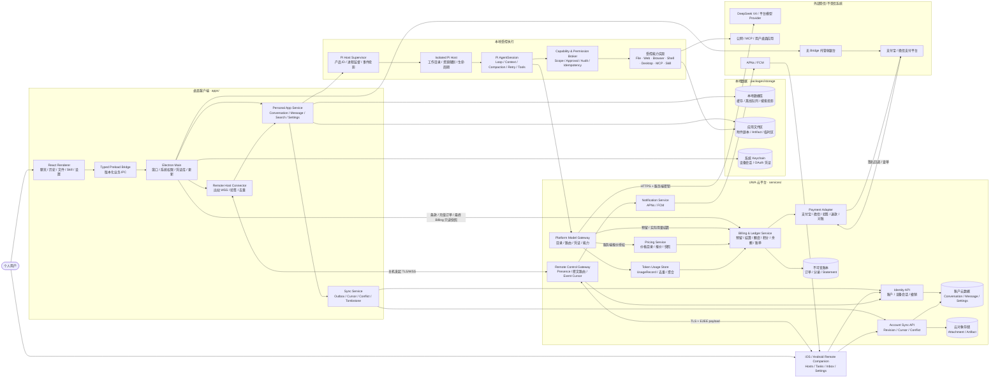

### 2.1 M1 当前已实现拓扑


M1 没有 localhost App Service、Renderer 网络业务 API、Platform Model Gateway、账户云或账单调用。
Pi Host 已直接加载 `@earendil-works/pi-coding-agent@0.84.4`；每次生成使用 Pi
`AgentSession` 和 Pi 原生事件。受支持启动路径必须先准备好真实 Platform Model Gateway 与
默认 `platform/auto`，不能让用户进入“模型未配置”状态；宿主内部仍保留配置不变量检查，
用于阻止错误发布或损坏的启动链路继续运行。应用重启时未完成助手消息以
`APP_SERVICE_RESTARTED` 失败状态恢复，并保留已落盘的部分文本。

确定性测试只在测试文件中注入 Pi 的 `faux` Model Provider；生产源码没有替代 harness
或固定回答模型。

### 2.2 M2 当前本地已实现拓扑

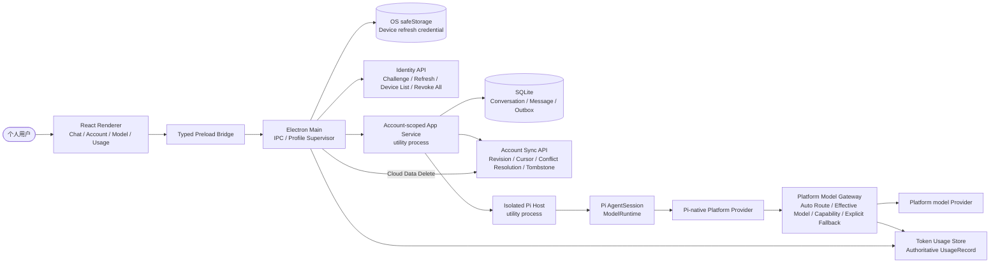

账户登录后 Main 切换到账户独立 Profile；用户可查看/定向撤销设备或退出全部设备。旧 utility process 的退出事件按进程实例隔离，
不会误杀新 Profile。Conversation、Branch、Message 与选模在同一 SQLite 事务写入 Outbox。
同步活跃期间产生的新流式终态会触发下一轮 drain；云端旧快照不得覆盖本地 pending/conflict
版本；本机缓存清理、设备退出和云端数据删除保持三个独立边界。模型请求只通过 Pi 原生
Provider 进入 Platform Gateway，上游凭证不进入客户端；Renderer 同时显示选择模型、实际
模型、降级原因和账户 Token 聚合。

M2 同时冻结 `RemoteHost`、一次性配对、签名/加密命令、回执、`AttentionRequest`、脱敏加密
事件和游标的 V1 Schema；Remote Connector、Relay 和移动端仍属于 M6。

### 2.3 M3 当前本地已实现拓扑

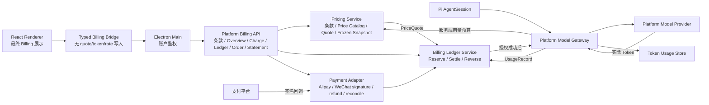

客户端没有创建报价、提交 Token、提交费率、提交 Usage 估计或写余额/账本的 Bridge/API。
客户端选择模型并发送普通消息；Gateway 在调用上游 Provider 前，以服务端上下文计算预算、
生成冻结报价并预留资金。Provider 返回的实际 Token 由 Gateway 写入 Usage Store，再在同一
服务端协调链结算唯一 Charge。Renderer 只重新读取最终资产、费用、订单、账本和账单快照。

### 2.4 M4 当前本地已实现拓扑

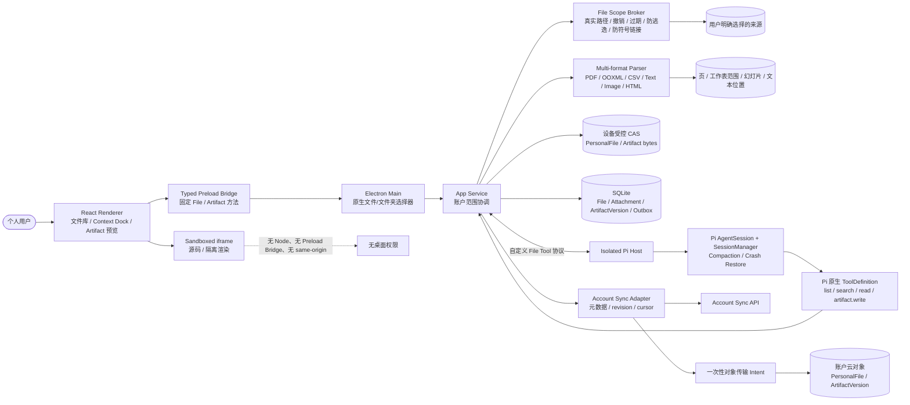

原始路径 Grant 只保存在授权设备；解析前先把字节复制到内容寻址的应用区。账户同步载荷只含
账户元数据、引用、校验值和云对象 ID，不包含 `rootPath`、`sourceScopeId` 或本地 `objectRef`。
另一设备恢复为无源路径 Grant 的云端副本。ArtifactVersion 以稳定 ID 对应不可变云对象，上传/
下载 Intent 同时绑定账户、设备会话和设备，短时且只能消费一次。

Pi Host 使用维护中的 Pi `SessionManager` 保存每个 Conversation 的内部 Session，损坏注册表可从
Pi Session 头恢复；Conversation/Message SQLite 仍是产品历史真值。Pi 不获得原始文件系统工具，
只注册四个产品文件工具，实际读取和成果写入全部回到 App Service 与 File Scope Broker。

### 2.5 M5 当前本地已实现拓扑（Browser 为 legacy）

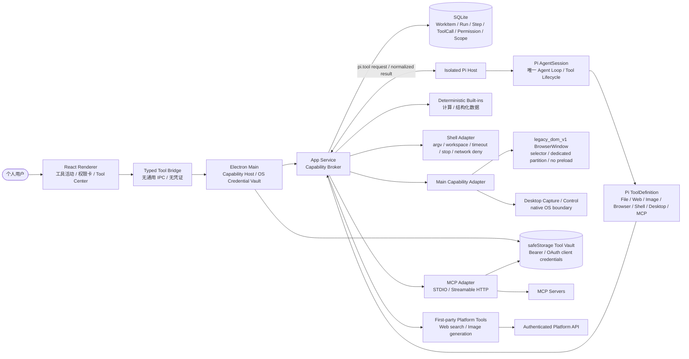

Pi 生成工具调用并等待结果；App Service 不建立第二套步骤规划器。Broker 把每个操作映射为
capability/resource/action/risk，审批绑定完整 payload digest，副作用绑定宿主派生的幂等键。
L4/L5 操作只能逐次授权。Browser/Desktop 仅在 Main 执行，Shell 子进程由 App Service 唯一拥有，
MCP 凭证只存在 OS 加密 Vault。启动恢复会终止中断运行、过期待批权限并撤销临时 Scope。

上图冻结的是 M5 checkpoint，其中 Browser 路径已由 ADR-V2-017 和 BCU-003 supersede，不能再用来
描述当前默认 Browser runtime。BCU-001 新增严格 V2 合同；BCU-002 实现 Observation registry、精确
surface 身份和单动作分层内核；BCU-003 已把内核接到 Main Host 与 Pi ToolDefinition。当前实现/目标
拓扑如下，实线为本地已验证路径，虚线为待交付路径：

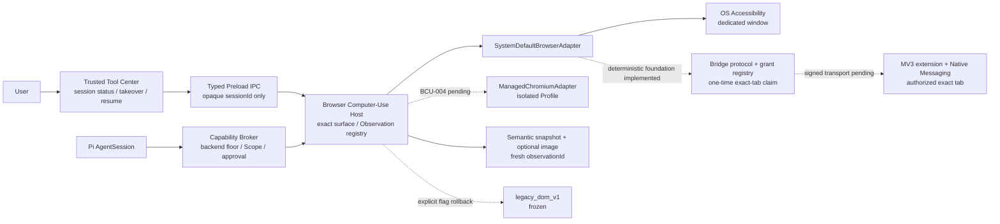

当前 macOS AX 实线路径按“语义动作 → 原生输入 → 视觉坐标”执行，截图用于基线、异常、坐标、高风险
和最终验证，不是唯一观察通道。它已经以系统默认 Chrome 完成真实“百度搜索 phonescloud”烟测，
并完成代表性 `Backspace`、滚动、前进/后退和刷新原生动作矩阵；精确窗口输入 monitor、自动暂停和
可信 Tool Center fresh-baseline 恢复也已通过确定性测试，且 Renderer 不接收 URL、标题、截图、
Observation 或网页元素，证据见
[BCU-003 checkpoint](evidence/bcu-003-2026-08-27.md)。2026-08-28 已确认 Computer Use 合成事件不会
被真人接管 monitor 接受，并用物理点击通过精确窗口暂停/恢复门禁，见
[live gates PASS](evidence/bcu-003-live-input-2026-08-28.md)；真实 Main/Preload/Renderer/Pi Tool
Center 接管/恢复/关窗也已联调通过。虚线 Bridge、托管 Chromium、签名安装权限和 Windows 仍须经
BCU-003 closure 至 BCU-006 单独验证。Bridge 虚线中的协议/授权内核已有确定性测试，但 MV3 扩展、
Native Messaging/Main owner-only 传输、可信连接 UI 和真实标签页烟测尚未接通，不能视为运行时
Bridge 可用；证据边界见
[Bridge foundation](evidence/bcu-003-browser-bridge-foundation-2026-08-28.md)。

### 2.6 M6 当前本地已实现拓扑

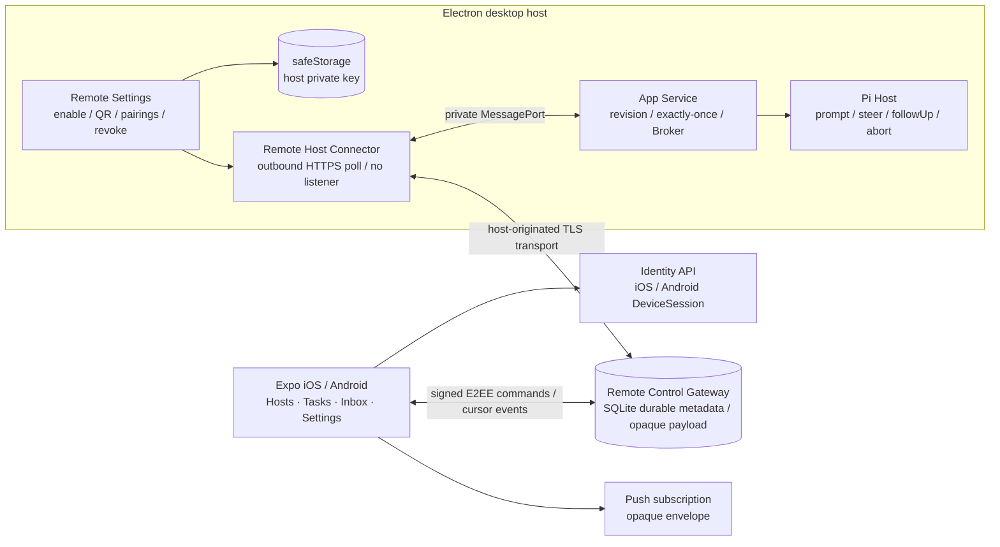

手机和主机使用 X25519 密钥协商、HKDF-SHA256、XChaCha20-Poly1305 业务加密与 Ed25519 命令
签名；配对证明绑定同一账户的一次性 Challenge。Gateway 只持久化 Presence、路由元数据、
密文、TTL、回执和游标，不持有设备私钥。Connector 没有监听端口，验签/解密后还会复核
revision、sequence、撤销和时效，再通过私有 MessagePort 调用 App Service。

Gateway 和 Connector 都按至少一次传输设计；App Service 以 command ID 与 payload digest
持久化最终应用结果，重投不再次调用 Pi、工具或计费链路。Start、Steer、Queue、Stop 分别
落到 Pi 的 `prompt()`、`steer()`、`followUp()`、`abort()`；远程审批回到同一 Broker，Scope
同时绑定账户、主机、Conversation 和精确待批请求。桌面主机密钥由 Electron `safeStorage`
保护，移动私钥与序列由 SecureStore 的仅本机解锁等级保存。

当前本地实现使用出站 HTTPS 轮询作为 TLS 传输适配器；生产 WSS/HTTPS 部署、APNs/FCM
Provider、iOS/Android 真机、Windows/macOS 主机组合和移动附件完整闭环仍是发布环境门禁。

### 2.7 M8 DeepSeek 真实 Provider 当前拓扑

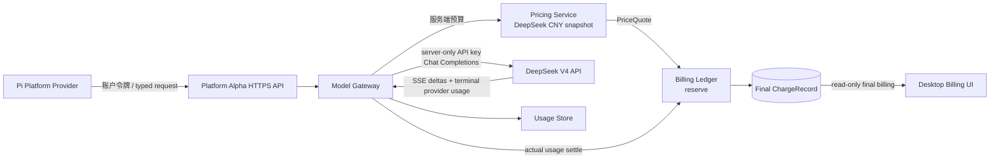

DeepSeek 密钥只由 Model Gateway 进程从服务端环境读取。缓存命中与未命中 Token 在服务端拆分，
价格快照、预留和结算均不经过 Renderer。HTTP 客户端断开会传播 AbortSignal 并释放预留；Provider
输出上限、内容过滤和资源中断保留明确终态。当前真实调用使用 SSE Chat Completions；Platform
Alpha 转发统一流事件，Pi Provider 投影 `message.delta`，Renderer 直接增量展示并在用户未上滚
时跟随回复。真实长请求 Stop/失败和供应商账单对账仍是 M8 外部门禁。

### 2.8 M9 发布与更新拓扑

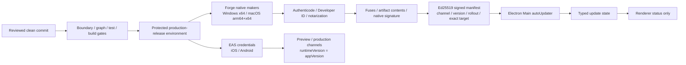

发布私钥、原生证书和 EAS 凭证只进入受保护发布环境。桌面包只带公钥、key ID 和 HTTPS Manifest
地址；Renderer 不接触 feed URL。移动端不承载 Pi、Token/报价计算或账本逻辑。发布失败先停止
灰度/撤回，再从已知良好源码构建更高版本；客户端不会为了回滚接受未签名降级。

## 3. 主链路

### 3.1 聊天与收费模型调用

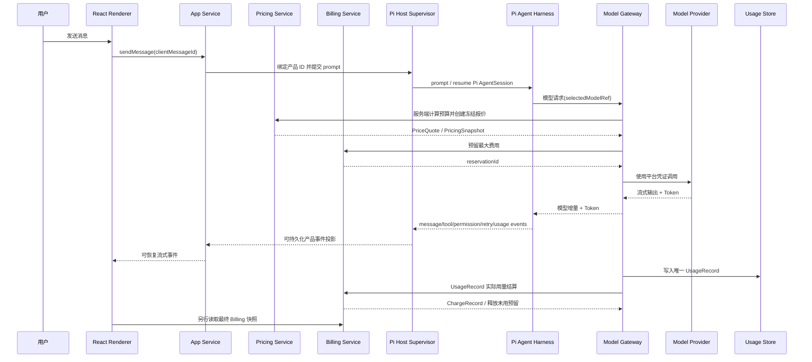

关键约束：消息先以稳定 ID 落盘；收费执行必须先预留；Token、预算、费率、报价和结算只在
服务端形成，客户端只读最终 Billing；模型凭证只在服务端；Pi 完整负责 Agent Loop、Session、
上下文压缩、内部重试和工具调用生命周期；V2 只监督宿主并投影产品状态；重试不能产生第二条
有效 UsageRecord 或 ChargeRecord。

### 3.2 云同步

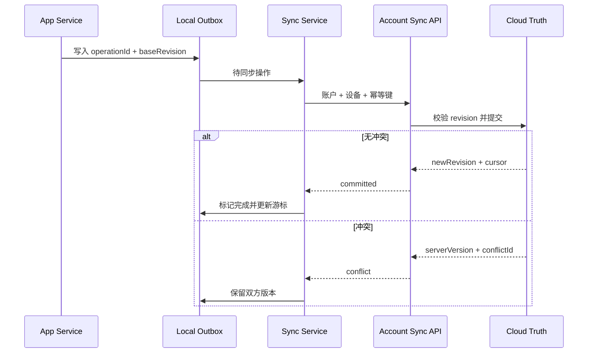

同步只负责账户内容，包括 Project 元数据、目录逻辑占位和 Conversation 归属。项目目录和其他设备权限、绝对路径、Cookie、Shell 历史、平台密钥、商业余额和账本均不进入普通离线同步队列。

### 3.3 手机 Remote 控制

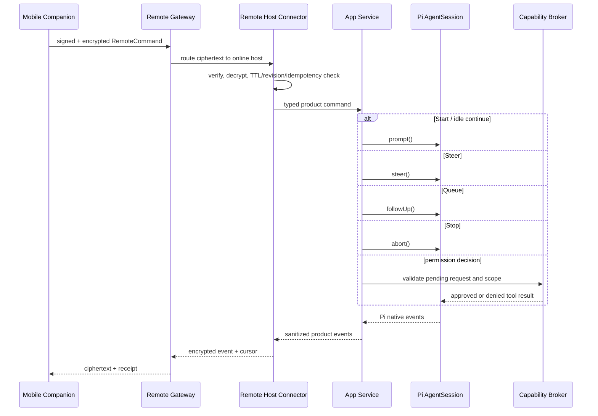

Relay 的投递重放只解决网络至少一次语义，不是 Agent 队列。Pi 仍唯一决定 `steer()` 与 `followUp()` 的运行时顺序；桌面 Broker 仍是审批和设备副作用的最终边界。主机离线时 Remote 只读取已同步历史，不接受新执行或审批。完整合同见 [15-remote-control-contract.md](15-remote-control-contract.md)。

## 4. 信任边界

| 区域 | 信任级别 | 可以做什么 | 明确禁止 |
| --- | --- | --- | --- |
| React Renderer | 不可信 Web 环境 | 展示、输入、调用窄 Bridge | Node、文件系统、进程、密钥、账本写入 |
| Preload Bridge | 最小桥接层 | 版本化 DTO、参数校验、业务动作 | 暴露原始 `ipcRenderer` 或通用执行接口 |
| Electron Main | 桌面权限 Broker | 窗口、系统对话框、Keychain、进程监督 | AI 长任务、文档解析、支付事实判定 |
| App Service | 本地业务协调 | 本地缓存、项目/对话、同步队列、模型/账单 API | 修改服务端余额、保存 Provider 密钥 |
| Mobile Companion | 不可信远程控制端 | 展示账户内容、发送签名产品命令、作出受限用户决定 | 直接访问 Pi/桌面、扩大 Scope、保存主机凭证 |
| Remote Host Connector | 网络隔离边界 | 出站连接、设备挑战、验签/解密/去重、加密产品事件 | 公开监听、直接调用 Pi、替 Broker 批准 |
| Pi Host | 不可信执行区 | 在授权工作目录运行 Pi `AgentSession` | 扫描 Home、读取全局凭证、任意网络 |
| Capability & Permission Broker | 能力安全边界 | 接受 Pi 工具调用，执行 Scope、审批、沙箱、审计和副作用幂等 | 自行规划 Agent 步骤；Skill/MCP/Shell 绕过权限系统 |
| 云平台 | 账户与商业真值 | 身份、同步、模型路由、用量、账本、支付 | 接受客户端提交的余额或支付成功状态 |
| Remote Gateway | 不可信内容 Relay | Presence、密文路由、短 TTL 重投、游标、回执 | 解密正文、规划任务、持有设备私钥或永久保存本地运行详情 |

## 5. 数据真值

| 数据 | 唯一真值 | 本地状态 |
| --- | --- | --- |
| Project、Conversation 归属、Message、可同步设置 | 账户云数据 | 缓存、离线队列、搜索投影 |
| 项目目录和其他本地文件权限/绝对路径 | 当前设备 | 不同步；新设备显示重连占位 |
| Attachment、Artifact 内容 | 云对象存储 + 受控本地副本 | 可重建缓存或设备副本 |
| Pi Session/AgentSession | Pi Host 内部引用 | 不是用户历史真值 |
| 模型 Token | UsageRecord | 只读展示缓存 |
| 费用 | ChargeRecord + PricingSnapshot | 只读展示缓存 |
| 额度、积分、充值余额 | 不可变账本投影 | 不进入离线写队列 |
| 支付结果 | 服务端查单/验签回调 | 客户端只轮询和展示 |
| Remote 配对/撤销 | Identity API 设备注册 | 手机和主机保留受保护私钥与只读配对投影 |
| Remote 命令应用结果 | 桌面 App Service + Pi/Broker 产品事件 | Gateway 只保留短期密文与回执；手机按游标缓存 |
| WorkItem、ExecutionRun、RunStep、ToolCall | Pi 活动的 App Service 产品投影 | 可恢复状态与审计，不是执行计划真值 |
| 本地 Capability Scope 与 PermissionRequest | 当前桌面设备 Broker | 不跨设备同步权限；高风险授权逐次绑定 payload |
| MCP Bearer/OAuth 凭证 | Electron Main OS 凭证库 | App Service 只使用 credentialRef；Renderer/Pi/SQLite 无密钥 |

## 6. 仓库映射

```text
apps/desktop                     Electron Main / Preload / React Renderer
apps/mobile                      React Native + Expo Remote Companion
packages/app-service             Personal App Service 核心与 utility-process 入口
packages/pi-host                 Pi AgentSession 组合与 utility-process 入口
packages/remote-host             Remote Host Connector 核心与 utility-process 入口
services/identity-api            账户与设备会话
services/account-sync-api        云同步 API
services/object-store-api        账户范围文件/成果对象与一次性传输 Intent
services/model-gateway           平台模型目录与统一调用
services/token-usage-store       UsageRecord 与 Token 聚合
services/pricing-service         价格目录、报价与快照
services/billing-ledger-service  预留、结算、额度、积分、余额、账本与账单
services/payment-adapter         支付宝/微信支付、退款与对账
services/remote-control-gateway  Presence、配对协调、密文命令/事件路由与回执
services/notification-service    APNs/FCM 推送令牌与不透明通知
packages/domain                  Conversation-first 领域模型
packages/contracts               IPC/API/Event Schema
packages/tool-sdk                Capability Broker、风险策略与 Tool Adapters
packages/skills                  Skill 包与生命周期
packages/ui-react                React UI 基础
packages/storage                 本地/云存储抽象
packages/file-service            File Scope Broker、解析、引用、Artifact 与受控对象区
packages/observability           脱敏日志、Trace 和诊断
packages/release                 Ed25519 清单、版本/通道/平台选择与灰度资格
```

M8 将 `packages/observability` 接入 Electron Main：Desktop、Renderer 和包含 Pi/Remote 握手的
App Service 进程组就绪/重启只产生白名单生命周期信号，Main 汇总脱敏后向 Renderer 提供预览，
并经原生保存对话框导出。个人数据从当前账户 Profile 的 SQLite 白名单表和受控对象区单独导出；
服务端 Usage、报价、费用、余额和账单不落入客户端导出，也不由客户端重新计算。

## 7. Legacy 边界

旧系统已整理到 `v1-backup/`，不出现在 V2 主调用链，仅作为可恢复归档和行为参考。V2 新代码不得直接依赖旧 Control Plane 的 Organization、企业 Project、Task、Workflow 或审批模型。个人项目按 [26-personal-projects-plan.md](26-personal-projects-plan.md) 使用独立的轻量领域模型。

## 8. M1 至 M9 本地已实现映射

- 根 workspace 使用 npm 11；`apps`/`services` 只通过 `packages` 共享合同和实现。
- Electron 44 + Forge 7 + Vite 6 分别构建 Main、Preload、App Service、Pi Host 和
  Renderer；当前产物为未签名开发包。
- Renderer 使用 React 19、HashRouter、TanStack Query 和安全 Markdown，只能调用冻结的
  类型化 Preload Bridge；没有 Node、原始 IPC 或本地服务端口。
- Main 以独立 utility process 监督 App Service 和 Pi Host；进程间使用私有
  MessagePort、256-bit 启动 nonce、版本化合同和有界重启。
- App Service 独占 `node:sqlite`，实现迁移校验、Conversation/Message/Part、分支、revision、
  幂等键、单调事件、中断恢复，以及账户内容 Outbox、cursor、冲突和墓碑。本地数据库不包含
  可复用账户凭证。
- Pi Host 直接运行维护中的 Pi 0.84.4，使用 `AgentSession`、`SessionManager`、原生流式事件和
  `abort()`；M4 注册 Pi 原生文件 ToolDefinition，并保留 Pi 的上下文压缩和崩溃恢复语义，
  不建立平行 harness。
- `packages/file-service` 实现设备级 File Scope Broker、内容寻址副本、多格式解析器、稳定引用和
  Artifact 版本；Renderer 只通过冻结 Bridge 调用，HTML 预览使用无 `allow-same-origin` 的 sandbox。
- `packages/tool-sdk` 实现 L0-L5 风险策略、精确 payload 授权、Scope 检查、副作用幂等，以及
  Web、平台图片、Shell、legacy Browser/Desktop Host 和官方 SDK MCP Adapter；高风险动作不能
  持久授权。`packages/contracts` 已增加 `browser_computer_use_v2`，但其新 Host 尚未接通。
- Tool Repository 把 Pi 活动投影为 WorkItem/ExecutionRun/RunStep/ToolCall/PermissionRequest；
  启动恢复回收子进程、隔离窗口和临时授权，但不接管 Pi 的工具顺序、重试或 Agent Loop。
- Tool Center 显示按 namespace 分组的内置/平台/本地/MCP 工具、运行活动与可撤销 Scope；
  Renderer 不能读取 MCP 密钥或调用通用进程/桌面接口。
- `services/object-store-api` 以账户/会话/设备绑定的一次性短时 Intent 传输 PersonalFile 与
  ArtifactVersion 字节；同步 payload 不携带绝对路径、原设备 Grant 或本地对象引用。
- Identity API、Account Sync API、Model Gateway、Token Usage Store 和 Platform Alpha HTTP
  组合层均已实现账户作用域；服务之间只通过 `packages/contracts` 端口连接。
- Main 使用 Electron `safeStorage` 异步接口保护可复用 DeviceSession 凭证；访问令牌只在 Main
  内存中流转，Renderer、SQLite 同步 payload 和 Pi 历史均不持有凭证。
- Token Usage Store 以账户和稳定 dedupe key 去重，保留输入、缓存、输出、推理和总 Token 的
  `null + missingReason` 语义；消息、对话和账户聚合不把未知冒充为 0。
- Model Gateway 在服务端调用 Pricing 和 Billing 端口完成报价、预留与 Usage 结算；Renderer、
  Preload 和 App Service 没有 token/rate/estimate/quote 写入方法。未知收费字段形成待核算 Charge，
  不使用客户端或本地估算。
- Billing Ledger Service 分离额度、积分和现金科目，所有入账与结算使用整数最小币种单位和
  追加式平衡分录；投影可从账本重建，已生成自然月 Statement 不可覆盖。
- Payment Adapter 对支付宝/微信服务端回调验签、限时、防重放，入账/退款使用稳定幂等键；
  对账只产生稳定差异，不自动修改余额。
- Pi 测试 Provider 只存在于测试代码；生产路径只有 Pi harness。
- Windows x64、macOS arm64 和 macOS x64 进入 CI 打包矩阵；本地交叉打包不替代原生双平台运行证据。
- `packages/release` 对严格清单执行 Ed25519 验签、版本/通道/架构与灰度判断；Electron Main
  是唯一更新检查方，Renderer 只得到状态。受保护发布工作流持有原生/EAS 凭证并在发布前执行
  签名、Fuse、产物、供应链和证据台账门禁。

Remote M2 协议合同已由 M6 本地实现落地为移动端、Connector、Gateway、密文命令/事件、
推送订阅与 Pi 映射；真机、生产推送和主机发布矩阵尚未宣称通过。该目标态不改变已冻结的
Pi 唯一 harness 和私有进程边界。

规范性细节见 [ADR 索引](adr/README.md) 和 [Electron/App Service 威胁模型](security/electron-threat-model.md)。

## 9. 当前下一步

本地架构已推进到 M9 发布基础。下一步只补真实环境证据：M8 目标用户、真实长请求 Stop/失败
与账单对账，Windows/macOS 签名安装升级回滚，iOS/Android 商店、生产 APNs/FCM 与 Remote 真机，
以及性能、安全、隐私、支付、税务和保留评审。全部通过后由用户明确批准 stable 发布。
