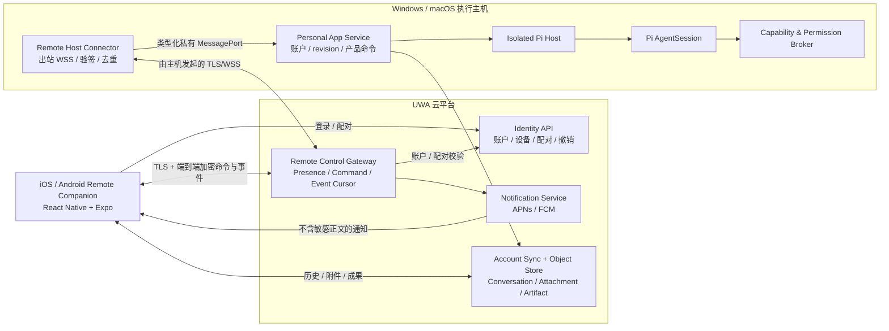

# V1 Remote Control 合同

> 状态：`LOCAL_ALPHA_COMPLETE / RELEASE_MATRIX_PENDING`
>
> 更新日期：2026-09-14（Asia/Shanghai）
>
> 合同类型：iOS/Android 手机控制面、桌面执行主机、Pi 原生命令映射、远程安全与发布门禁

## 1. 产品结论

`已确定`：UWA V1 提供与 Codex Remote 同类的手机远程控制能力。

- Windows/macOS 桌面客户端是唯一执行主机，提供本地项目、文件 Scope、凭证、工具、浏览器、Shell、桌面能力和 Pi harness。
- iOS/Android Remote Companion 是控制面，用于发起、查看、引导、排队、停止、审批和审阅任务。
- 手机端不是独立 AI 运行时、远程桌面、SSH/终端模拟器，也不加载 Pi。
- Remote Relay 只连接手机与用户已配对的桌面主机；它不实现 Agent Loop、Session、队列、重试、工具生命周期或权限决策。
- 桌面主机必须开机、联网且 UWA Remote 已启用。V1 不承诺远程唤醒、无人值守登录或主机离线执行。

产品心智固定为：

```text
手机 = 控制面
桌面 = 执行面
Pi = 唯一 agent harness
V2 = 产品状态、传输、权限与安全边界
```

## 2. V1 用户能力

### 2.1 必须支持

1. 在手机上查看已配对主机、在线状态、当前工作区和活动任务。
2. 选择在线主机和该主机已授权的工作区，开始新对话或继续已有对话。
3. 查看流式回答、任务状态、工具活动、费用状态和需要关注的事项。
4. 使用 `Steer` 在当前工作进行中改变方向，使用 `Queue` 排队下一条指令，使用 `Stop` 终止当前 Pi 执行。
5. 回复 Pi/产品提出的问题，允许或拒绝待审批动作。
6. 审阅回答、文件差异、测试结果、终端输出、截图和 Artifact，并回到对应对话继续处理。
7. 从手机拍照、选择图片/文件并作为账户附件提交给指定对话。
8. 接收“需要审批、需要补充、任务完成、任务失败”的推送通知，并通过深链接回到准确对象。
9. 在多个已配对桌面主机之间切换，查看和撤销手机/主机配对。

### 2.2 明确不做

- 不在手机端运行 Pi、Shell、浏览器自动化、MCP、Skill 脚本或桌面控制。
- 不传输桌面完整画面，不提供鼠标键盘接管或任意终端会话。
- 不从手机浏览桌面任意文件系统，也不能在手机上新增本地文件夹 Scope 或操作系统权限。
- 不在 Relay 中保存或解释 Pi 原始事件、Prompt 私有结构、工具私有协议或完整本地凭证。
- 不因手机指令创建第二套任务调度器、Agent 队列或 SessionManager。
- 不在主机离线时接受会造成稍后意外执行的新任务或审批。

## 3. 目标拓扑



### 3.1 部署单元

| 单元 | 职责 | 明确禁止 |
| --- | --- | --- |
| `apps/mobile` | 登录、主机列表、任务/对话、Queue/Steer/Stop、审批、审阅、附件和通知 | 加载 Pi、直接访问桌面或保存桌面凭证 |
| Remote Host Connector | 主机在线状态、出站连接、设备挑战、命令验签/解密/去重、事件加密 | 公开监听端口、直接调用 Pi、绕过 App Service/Broker |
| `remote-control-gateway` | 配对协调、Presence、密文路由、短期重放、游标和投递回执 | 读取业务正文、规划任务、替用户批准、持久保存本地敏感内容 |
| Notification Service | APNs/FCM 设备令牌和不透明提醒 | 在推送载荷写入 Prompt、Diff、终端、路径或审批详情 |
| Personal App Service | 校验账户、主机、revision、执行状态和计费前置条件；把产品命令映射到 Pi/Broker | 建立第二套 Agent Loop 或执行队列 |
| Pi Host | 执行 Pi 原生会话动作并投影 Pi 事件 | 接收公网连接、认识手机/配对协议 |

Remote Host Connector 作为桌面端受监督 utility process 运行，只通过私有、版本化 MessagePort 与 App Service 通信。它不得开放 localhost 或公网业务端口。

## 4. Pi 唯一 Harness 映射

手机只发送产品命令；App Service 在校验后调用现有 Pi Host 合同。映射是规范性的：

| 手机动作 | 产品命令 | Pi/Broker 行为 |
| --- | --- | --- |
| 开始或空闲后继续 | `task.start` / `session.prompt` | Pi `AgentSession.prompt()` |
| Steer | `session.steer` | Pi `AgentSession.steer()`；在当前 assistant turn 的工具调用结束后、下一次模型调用前注入 |
| Queue | `session.follow_up` | Pi `AgentSession.followUp()`；等待当前工作和已有 follow-up 完成后提交 |
| Stop | `session.abort` | Pi `AgentSession.abort()` |
| 允许/拒绝 | `permission.decide` | V2 Broker 校验请求、Scope、风险、时效和设备证明后回复 Pi 工具等待点 |
| 回答问题 | `attention.respond` | 作为明确的 `prompt`、`steer` 或 `followUp` 提交，取决于用户选择和会话状态 |

约束：

- V2 不维护与 Pi `steer`/`followUp` 平行的运行时队列。
- Relay 的短期传输重放不是 Agent 队列；命令到达桌面后只由 Pi 决定运行语义。
- Pi 的 `queue_update`、消息、工具、压缩、重试、用量和 Session 事件只投影为稳定产品事件，不把原始 payload 发给手机。
- 手机断线、重复提交或多控制器竞争不得导致 Pi 指令、工具副作用、UsageRecord 或 ChargeRecord 重复。

## 5. 远程命令与事件合同

### 5.1 领域对象

- `RemoteHost`：桌面主机、平台、版本、能力摘要和 Presence。
- `RemoteDevicePairing`：手机与主机的账户内配对、设备公钥、创建/过期/撤销状态。
- `RemoteConnectionRequest`：手机发起、目标桌面决定的首次连接申请；包含设备公钥证明、5 分钟有效期和明确的批准/拒绝/过期结果。
- `RemoteCommand`：一次有时效、可验签、可去重的产品命令。
- `RemoteCommandReceipt`：`submitted | accepted | applied | rejected | expired`。
- `AttentionRequest`：问题或审批请求，状态为 `pending | approved | denied | expired`。
- `RemoteEventCursor`：手机按主机/对话补读产品事件的位置。
- `PushSubscription`：设备平台、推送令牌引用、状态和最后轮换时间。

`RemoteHost` Presence 状态固定为 `online | degraded | offline | revoked`。`offline` 不是可执行状态。

### 5.2 命令信封

每个命令至少包含：

```text
commandId
pairingId
controllerDeviceId
hostDeviceId
conversationId?
generationId?
kind
baseRevision
sessionSequence
issuedAt
expiresAt
idempotencyKey
encryptedPayload
signature
```

- 服务端按账户、配对、主机和时效做第一层拒绝；主机完成签名、revision、序列和幂等复核。
- 投递语义为至少一次；主机按 `commandId + idempotencyKey` 去重，结果可安全重放。
- 每个会话使用单调 `sessionSequence` 和 `baseRevision`。过期、乱序或基于旧状态的冲突命令明确拒绝，不使用“最后写入者获胜”。
- 审批命令不允许离线排队；Queue/Steer 只可在主机在线时接受，并使用短 TTL 覆盖瞬时断线。

### 5.3 产品事件

手机可接收以下脱敏产品事件：

- `host.presence_changed`
- `conversation.updated`
- `message.delta | completed | stopped | failed`
- `run.status_changed`
- `tool.status_changed`
- `attention.requested | resolved | expired`
- `artifact.created | version_created`
- `review.available`
- `usage.pending | recorded`

Diff、测试、终端和截图以短期加密资源引用传递；推送只携带不透明对象 ID。事件必须能按游标补读，但本地敏感详情到期后不可由 Relay 永久恢复。

手机提交命令后，Gateway 的投递回执不等于桌面已执行。Connector 使用加密的 `conversation.updated` 事件返回 `commandId`、命令种类、`applied/rejected` 和当前会话 revision；拒绝原因也保留在密文内。手机等到桌面确认才清空输入，失败保留草稿；确认超时明确提示先检查任务状态，避免重复提交。会话事件附带最新 revision，消息快照与流式增量按消息 ID 合并，主动停止与执行失败分开显示。

远程新任务和继续对话在 App Service 内通过现有私有 Main IPC 获取桌面配置的模型执行上下文。BYOK Key 只流经桌面本地凭证库、App Service 和 Pi Host，不进入手机、Relay 或命令结果。继续对话保留已有的模型引用；缺少可用配置时，在创建新消息前拒绝并提示到电脑设置模型。桌面渲染层的新任务模型下拉框偏好不属于本次手机端同步范围。

## 6. 配对、身份与密钥

1. 用户在桌面端开启 Remote。登录同一 openerx 账户的手机自动发现电脑，在主机列表中点击“申请连接”。
2. 手机使用本机设备私钥签名申请，证明绑定账户、申请 ID、目标电脑、手机 ID 和手机公钥。Gateway 从已认证的账户设备会话读取手机名称与平台，保存有效期为 5 分钟的 `pending` 申请；申请阶段不授予远控权限。
3. 桌面设置展示申请，其他页面显示待确认通知。用户明确点击“允许此手机”或“拒绝”；只有目标主机对应的设备会话可以决定。批准前复核手机公钥证明和手机会话的有效状态，批准后建立包含双方公钥的 `RemoteDevicePairing`。
4. 后续连接复用仍有效的配对与系统凭证库中的设备私钥。手机只使用账户、手机 ID 和当前本机公钥均匹配的配对；新手机或丢失私钥的手机需要重新授权。
5. “使用二维码快捷配对”保留为可选入口，打开时生成 2 分钟有效的一次性二维码。手机扫描后仍校验同账户、一次性 nonce 和设备私钥证明；二维码不再是默认连接的必经步骤。
6. 拒绝、过期的申请不能被改为批准；重复批准不会生成额外配对，也不会恢复已撤销的配对。关闭 Remote 会使本机未决申请失效，并阻止旧二维码完成配对。手机可查看拒绝或过期结果并重新申请。
7. 设备私钥保留在手机和桌面的系统凭证库中。账户策略要求的 MFA/Passkey 验证是独立要求，不能由扫码或桌面确认替代；本次连接流程不新增其实现。

连接期间，桌面主进程提前续期账户访问令牌，并通过私有 MessagePort 更新 App Service 和现有 Connector 的授权；不重建配对或重启 Connector。手机提前续期，回到前台时也检查有效期；退出或切换账户后，旧续期结果不得恢复会话。Refresh 凭证仍只在各设备的系统凭证边界保存。

申请 API 为 `POST/GET /api/v2/remote/connection-requests` 和 `POST /api/v2/remote/connection-requests/:requestId/decision`。列表只返回当前设备作为目标主机或发起手机的申请。默认配对有效期保持 90 天，可单独撤销；连接授权不扩大本机工具与文件权限。

二维码不得包含可长期复用的访问令牌。Relay 不持有设备私钥；业务正文和敏感运行详情使用已配对设备密钥端到端加密。

## 7. 远程审批边界

- 手机只能处理主机已经产生且仍为 `pending` 的 `AttentionRequest`，不能预先授予空白权限。
- 手机审批不能扩大桌面现有文件 Scope、网络目标、工作区或操作系统权限。
- V1 手机端只提供“本次”和“当前对话”Scope；不创建设备级“始终允许”。
- L3/L4 审批显示精确目标、动作、风险和有效期，并要求设备解锁或生物识别。
- L5 每次均重新认证；删除、购买、凭证修改等动作可按策略要求回到桌面确认。
- 操作系统权限弹窗、密码管理器解锁、支付认证和新的本地文件夹授权必须在桌面主机完成。
- Broker 是最终授权者；手机上的“允许”只是带设备证明的用户决定，不能绕过主机当前策略、Scope、撤销或安全失败。

## 8. 在线、断线与多设备语义

| 情况 | V1 行为 |
| --- | --- |
| 主机在线 | 可开始、Queue、Steer、Stop、审批和查看实时事件 |
| 主机短暂断网 | 显示 `degraded`；已接受命令按短 TTL 重投，过期后失败 |
| 主机离线/休眠/应用退出 | 历史仍可从云端读取；不接受新执行或审批 |
| 手机断线 | 主机继续已接受的 Pi 工作；恢复后按游标补读产品事件 |
| 多台手机同时控制 | 按 `sessionSequence + baseRevision` 串行接受；冲突者刷新后重试 |
| 主机被撤销 | 立即断开 Relay；未应用命令过期；账户内容按普通同步/删除合同处理 |

V1 不提供 Wake-on-LAN、云端代跑、本地登录解锁或主机离线命令邮箱。

## 9. 移动端体验合同

主导航固定为：

- `Hosts`：主机列表、在线状态、版本、当前工作区和配对管理。
- `Tasks`：新任务、活动任务、历史对话和搜索。
- `Inbox`：待回答、待审批、完成和失败提醒。
- `Settings`：账户、通知、设备、隐私和退出。

活动任务页必须把 `Queue` 和 `Steer` 分开表达：

- `Steer`：改变正在进行的工作，可能影响下一次模型调用。
- `Queue`：不打断当前工作，完成后再执行。

手机审阅界面适合阅读和决策，不复制桌面 IDE：Diff 只读、终端只读、截图可缩放、Artifact 可预览/分享或回到桌面继续。任何因主机离线、过期、冲突或策略拒绝而未执行的动作必须显示准确结果。

### 9.1 2026-09-14 本地移动端修复

- 输入区避让系统键盘，任务页展示用户消息、回答、执行状态和最近任务；收件箱可进入对应任务，审批使用该请求所属的会话。
- 登录提供更换邮箱、重发验证码和中文错误；命令失败保留草稿，连接错误不覆盖底部导航。访问令牌刷新合并并发请求，旧控制器的请求使用当前有效授权。
- 通知被拒绝后显示关闭状态和系统设置入口。系统设置跳转位置可能因平台不同，界面提示用户找到 openerx 后开启通知。
- 当前仅支持文字任务。未完成上传链路的附件按钮已移除，并提示先在电脑添加文件。最近任务来自手机保留的加密事件，不代表完整历史同步。

该修复已经通过 iOS 原生模拟器与本地桌面、模拟模型的任务创建、继续、停止、键盘、登录恢复及通知拒绝路径检查；iOS/Android 导出和相关自动化测试通过。真实模型服务、手机真机、相机扫码、推送送达、系统生物识别与完整远程审批仍按第 11.2 节执行发布验证。

## 10. 安全与隐私门禁

- 主机和手机只发起出站 TLS/WSS；桌面不开放公网或 localhost Remote 监听端口。
- 账户、设备、配对、主机、对话和对象引用逐层鉴权，跨账户访问为零。
- 命令签名、端到端加密、过期、重放、乱序、篡改和撤销测试全部通过。
- 推送通知不包含 Prompt、回答、Diff、路径、终端、截图、审批目标、Token 或凭证。
- Relay 日志只记录脱敏路由元数据、结果码和 Trace；不记录解密正文。
- 丢失手机被撤销后不能建立连接、补读敏感事件、审批或控制主机。
- Remote 命令不能绕过报价/预留、模型网关、Broker、系统权限或计费幂等。
- 主机端 Remote 可一键关闭，并立即清理活动连接和短期传输令牌。
- 安全审计关联 `accountId`、`controllerDeviceId`、`hostDeviceId`、`pairingId`、`commandId`、`attentionRequestId` 和最终决策。

## 11. 交付与验收

Remote Control 在 [13-development-plan.md](13-development-plan.md) 的 M6 独立交付，依赖 M2 账户/设备、M3 收费前置条件、M4 文件/Artifact 和 M5 工具/长任务。

### 11.1 当前实现状态

2026-08-26 的本地 Alpha 检查点已经实现：

- Expo iOS/Android Hosts、Tasks、Inbox、Settings 构建，以及 SecureStore 设备私钥、主机选择、
  配对/撤销、命令和加密事件游标；
- 同账户一次性二维码 Challenge、X25519/Ed25519/HKDF/XChaCha20-Poly1305 协议、严格验签、
  TTL、sequence、revision、撤销和持久化去重；
- 不开放监听端口的受监督 Connector、只路由密文的 Gateway、回执、Presence、PushSubscription
  和不透明推送信封；
- Start/Steer/Queue/Stop 到 Pi 原生 API 的映射，以及绑定精确待批请求、Conversation、风险、
  解锁/生物识别证明的同一 Broker 决策；
- Electron 桌面到模拟移动控制器的 E2E，覆盖真实平台模型调用、服务端报价/结算、事件解密、
  重投只应用一次、只形成一次 Charge、撤销、关闭 Remote 和桌面密钥加密保存。

可复现命令和证据见 [M6 checkpoint](evidence/m6-2026-08-26.md)。这是本地实现检查点，不把
Hermes 导出或模拟移动控制器当作 iOS/Android 真机证据，也不改变下列发布硬门禁。

### 11.2 发布硬门禁

发布前必须有：

1. iOS 与 Android 真机；Windows x64、macOS arm64/x64 主机组合 E2E。
2. 首次申请、目标桌面批准/拒绝、跨账户或其他设备代批、申请过期、重复请求、重启后复用授权、二维码过期、设备撤销、手机丢失和主机关闭 Remote 测试。
3. Start、Queue、Steer、Stop、问题回复、允许、拒绝、过期、冲突和重复投递测试。
4. 主机休眠、应用退出、网络切换、手机断线和事件游标恢复测试。
5. Diff、测试、终端、截图、Artifact 和手机附件的权限、加密、过期与打开测试。
6. 多手机、多主机、跨账户、乱序、重放和 Relay 故障注入测试。
7. 证明同一远程命令不会重复调用 Pi、重复产生工具副作用、UsageRecord 或 ChargeRecord。
8. 依赖图和代码扫描证明手机、Relay、Connector 中不存在第二套 harness、SessionManager 或 Agent 队列。

Remote Alpha 退出标准：所有上述硬门禁通过；目标用户可以仅通过手机发起并监督一项真实桌面任务，安全完成 Queue/Steer/Stop 与一次远程审批，并在主机离线时得到准确、无副作用的失败结果。

## 12. 官方参照

本合同按 2026-08-25 可访问的 OpenAI 官方资料定义同类产品能力，不依赖 Codex 私有协议或实现：

- [Codex Remote](https://learn.chatgpt.com/docs/remote)
- [Remote connections](https://learn.chatgpt.com/docs/remote-connections)
- [Mastering remote engineering work from your phone](https://developers.openai.com/blog/mastering-codex-remote-for-engineering)

官方资料确认的核心心智是手机作为控制面、桌面继续提供本地环境与执行能力；主机需要在线，并通过安全 Relay 连接而不是公开暴露主机。本合同在此基础上采用 UWA 产品命令、Pi 原生 API 和 V2 安全边界。
