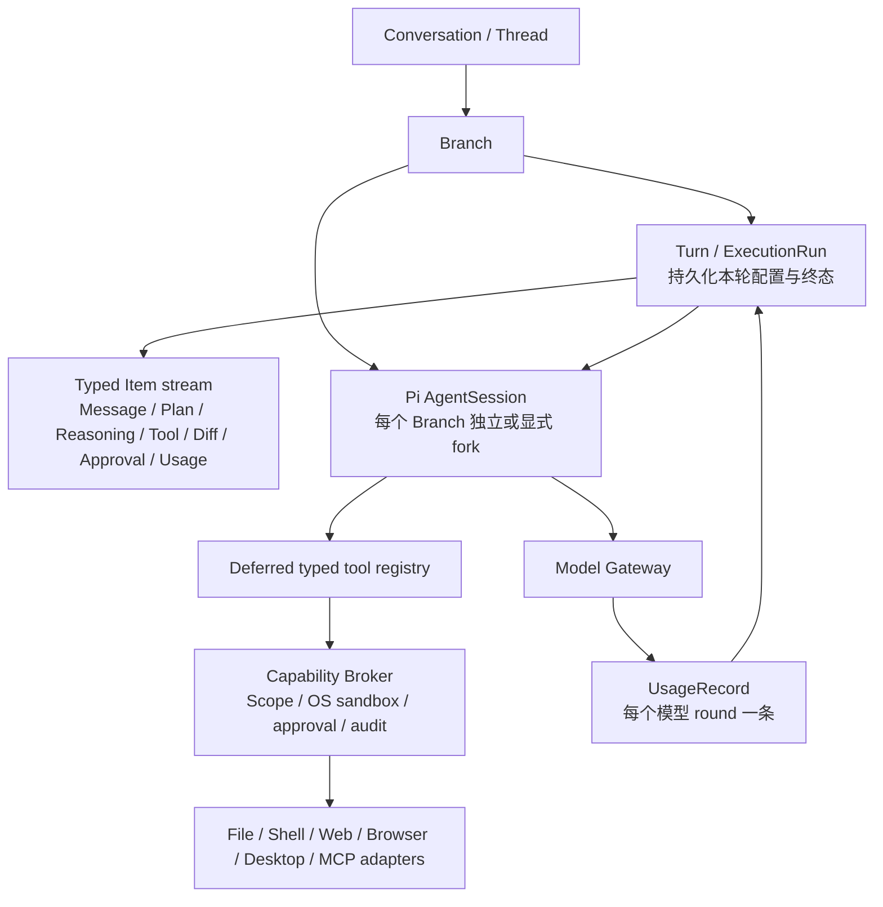

# OpenerX V2 按 Codex 实现方式的能力评估

> 状态：`P0 + CX-101–CX-109 + CX-110-D1/D2/D3 + CX-111 IMPLEMENTED / LOCAL VERIFIED`；完整 CX-110/P2 仍未完成
>
> 评估日期：2026-08-26（Asia/Shanghai）
>
> 实现验证：2026-08-27 17:12（Asia/Shanghai）
>
> 代码基线：`HEAD 1264cc0` 加当前 CX-111 工作树
>
> 本文最初用于给出取舍、错误判断、目标架构和验收门禁；当前版本同时记录按本文完成的 P0、CX-101 至 CX-109、CX-110-D1/D2/D3 与 CX-111 实现状态。整个 P1、完整 CX-110 和 P2 仍不得因合同、夹具或局部测试而宣称完成。

## 1. 结论

当前答案不是“Pi 中的各种处理能力，OpenerX 都已经支持”。

OpenerX 已经具备一套方向正确的骨架：Pi 是唯一 Agent Harness，Renderer 权限收窄，模型调用、计费和 Usage 由服务端控制，工具统一经过 Capability Broker，文件采用受控副本和稳定引用，Skill 与 MCP 也已有安装、传输和审计基础。

评估时若按 Codex 的实现方式衡量，存在两类关键缺口：

1. **实现语义错误**：分支与 Pi Session 不一致、历史图片跨轮次/跨分支重复注入、Shell 并非始终处于操作系统沙箱、指定应用截图实际截取整个主屏、图片类工具结果被压成 JSON 文本、停止与 Usage 生命周期不完整、图片生成复用了 Web 搜索权限名、通用副作用被过度声明为幂等。
2. **能力声明超出实际证据**：原始评估时，工作区补丁式编辑、Office 文件端到端创建/编辑/原生预览、按需工具发现、真实 Web/图片服务、第三方 MCP OAuth、Windows 原生沙箱与应用控制只有部分合同、适配器、夹具或本地测试，不能视为 Codex 等价能力已经完成。

2026-08-26 已实现并本地验证 `CX-001` 至 `CX-010`；2026-08-27 又实现并本地验证 `CX-101` 至 `CX-109`，完成 `CX-110-D1` 桌面 MCP OAuth Authorization Code + PKCE、`CX-110-D2` 桌面运行时 Host readiness/macOS 原生矩阵、`CX-110-D3` Developer ID 签名 macOS arm64 生命周期，以及 `CX-111` Codex 式审批收敛。因此当前结论更新为：**P0 正确性和安全阻断已关闭，Codex 式工作区、工具协议、有界 Office Agent 生产链、丰富 Run Item 回放、风险/沙箱/审批分离、桌面 OAuth 主进程边界、fail-closed Host 工具暴露和签名 macOS 本地生命周期已形成检查点；Apple 公证/分发、第三方实网与 Windows 原生证据仍未完成；多 Agent、定时任务、云端执行仍暂不实现。**

## 2. “按 Codex 实现方式”的判定标准

本文评估的是架构语义和安全边界，不要求复制 Codex 的全部产品功能或 UI。

当前官方资料给出的核心基线是：

- [Codex App Server](https://learn.chatgpt.com/docs/app-server) 将一次会话表达为 Thread，将一次用户操作表达为 Turn，并把消息、计划、推理、命令、文件修改、MCP 调用、审批、压缩等表达为有类型的 Item；Turn 有完成、中断和失败等明确终态。
- [Agent approvals and security](https://learn.chatgpt.com/docs/agent-approvals-security) 将文件系统沙箱、网络策略和审批策略分开，并要求沙箱由操作系统强制执行。
- [AGENTS.md](https://learn.chatgpt.com/docs/agent-configuration/agents-md) 使用从全局、项目到嵌套目录的分层项目指令，并按作用域覆盖。
- [Agent Skills](https://learn.chatgpt.com/docs/build-skills) 采用渐进式披露：初始只暴露名称与描述，真正使用时才加载完整 `SKILL.md` 和相关资源。
- [MCP](https://learn.chatgpt.com/docs/extend/mcp?surface=cli) 把远端能力呈现为独立、带模式和审批策略的工具，而不是让模型拼接任意 JSON 调用一个总入口。
- [Subagents](https://learn.chatgpt.com/docs/agent-configuration/subagents) 适合边界清楚、可并行的子任务，不应在单 Agent 的会话、权限和工具语义尚未正确时默认扩张。

据此，一项能力只有同时满足以下条件，才能标记为“已按 Codex 方式支持”：

1. 有稳定且类型化的产品合同，而不是只靠 Prompt 约定。
2. 每次执行有可持久化、可恢复、可中断的 Turn/Run 身份和终态。
3. 模型看到的上下文、工具和附件与当前分支、当前 Turn 精确一致。
4. 文件、网络、桌面和外部副作用具有可证明的沙箱与审批边界。
5. 工具输入输出保留文本、图片、文件、来源和差异等原始类型。
6. 有真实端到端证据；合同测试、模拟传输、预制夹具和离线渲染只能证明对应的局部切片。

## 3. 应保留的现有设计

| 现有设计 | 判定 | 理由与代码证据 |
| --- | --- | --- |
| Pi 是唯一 Agent Harness | 保留 | `packages/pi-host` 是唯一 Pi 导入边界；桌面、移动端和 Remote 没有第二套推理循环。 |
| 产品 Conversation/Message 与 Pi 内部 Session 分离 | 保留并修正映射 | 产品数据不依赖 Pi 私有存储是正确的；问题只在当前映射粒度停留在 Conversation，没有覆盖 Branch/Turn。 |
| Renderer 禁用 Node、启用隔离和沙箱 | 保留 | `apps/desktop/src/main/security.ts` 与窄 Preload Bridge 是正确的桌面安全起点。 |
| Capability Broker 统一工具、Scope、审批和审计 | 保留并加强 | `packages/tool-sdk/src/broker.ts` 已形成单一策略入口；需要补真实沙箱、结果类型和不确定副作用状态。 |
| 模型目录、Provider 凭据、Usage 和计费在服务端 | 保留 | 客户端不持有 Provider API Key；模型调用的每一轮已有独立 UsageRecord 与去重键。 |
| 文件进入受控内容库，原路径不进入模型 | 保留 | File Service 的受控副本、哈希、稳定引用和不可变 ArtifactVersion 是正确边界。 |
| Skill 包复制、校验、挂载并由 Pi Resource Loader 加载 | 保留 | 已符合渐进加载方向；后续补项目级指令和更细的能力声明即可。 |
| MCP 使用官方 SDK 的 STDIO/Streamable HTTP 传输 | 保留底层传输 | 传输层方向正确；模型侧的“一个巨型 MCP 工具”需要改为独立工具注册。 |
| 禁用任意 Pi Extension、Theme、Prompt Template 和原始内置工具 | 当前保留 | 在 OpenerX 自己的信任、工作区和工具合同完善前，`noExtensions`、`noContextFiles`、`noTools: "builtin"` 是安全选择。 |
| Remote 复用同一个 App Service/Broker | 保留 | Remote 不应另造权限或执行内核，当前复用方向正确。 |

## 4. 评估时已确认的错误：P0

以下不是“以后可以增强”，而是当前实现语义与产品声明不一致。它们应在继续扩张能力前修复。

| ID | 当前错误 | 影响 | 必须采用的修正 |
| --- | --- | --- | --- |
| CX-001 | **产品 Branch 与 Pi Session 失配。** `ProductSessionRegistry` 只按 `conversationId` 保存一个 Session；`createProductPiSession()` 仅在 Session 为空时注入产品历史；`chat.activateBranch` 只切换数据库活动分支。 | 编辑、重新生成或切换分支后，模型可能继续看到旧分支上下文，形成事实串线和隐私泄漏。 | 映射改为 `Conversation/Branch → Pi Thread/Session`；创建分支时按精确 cutoff fork；激活分支时切换对应 Session；禁止依赖“Session 非空就忽略产品历史”。 |
| CX-002 | **图片附件按整个 Conversation 收集，并在每个 Turn 全量重发。** `modelImages(conversationId)` 读取该会话所有图片，未按 Message 和 Branch 过滤；Pi 的持久 Session 又会保留前轮图片。 | 同一图片反复计费和占用上下文；不同分支附件可能互相泄漏；超过总大小后，后续纯文本消息也会失败。 | 将附件作为有类型的 Message Part 持久化；只重放当前活动分支中应出现的历史 Part；当前用户消息的新图片只注入一次。 |
| CX-003 | **Shell 不是始终由操作系统沙箱强制。** macOS 仅在 `allowNetwork=false` 时使用 `sandbox-exec`；允许网络时退化为 policy。其他平台主要依赖命令黑名单，Node/Python 等进程可以绕过网络和文件限制。 | 获得网络权限会连带失去文件系统隔离；Windows/Linux 上声明的工作区和网络限制不可证明。 | 文件系统与网络策略解耦；每次 Shell 都进入平台原生沙箱，只暴露批准的读写根；为 macOS/Windows 建立真实逃逸测试，平台不支持时拒绝执行而不是降级。 |
| CX-004 | **“指定应用截图”实际截取整个主屏。** Desktop `screenshot` 忽略 `operation.application` 的捕获范围，只在结果元数据中回填应用名。 | 工具语义错误，并可能无意收集其他窗口、通知和敏感信息。 | 必须按目标应用/窗口捕获；找不到目标时显式失败；审批中展示真实捕获目标和范围。 |
| CX-005 | **图片、截图、文件和结构化工具结果被统一 `JSON.stringify` 成文本。** Capability、File、Skill 工具都返回单一 text content。 | 图片生成、浏览器截图和桌面截图对模型而言是大段 Base64 文本，不是视觉输入；Token 急剧膨胀，工具链无法正确理解媒体。 | 定义统一 `ToolResultContent[]`，至少支持 `text`、`image`、`file/resource`、`artifact`、`source/citation`；传输、Pi 返回、存储和 UI 必须端到端保留类型。 |
| CX-006 | **没有覆盖所有生成的第一类 Turn/ExecutionRun。** `ToolAppService.#ensureProjection()` 只在首个工具请求时创建 WorkItem/Run，纯聊天没有 Run；AssistantMessage 同时承担生成占位和最终输出。 | 无法统一审计每次执行的配置、Item、Usage、停止、失败和恢复，也无法稳定实现计划、差异和审批时间线。 | 每次 send/edit/regenerate 都先创建持久化 Turn/ExecutionRun；Run 快照保存 Branch、模型、思考强度、工具集、Skill、权限和状态；Message/Plan/Reasoning/ToolCall/Diff/Approval/Usage 均作为 Item 关联 Run。 |
| CX-007 | **停止和 Usage 生命周期不闭合。** `chat.stop` 先把 Message 标记 stopped 并清除 generation 映射，再调用 Pi abort；随后到达的真实终态会被丢弃。Pi Host 只把最后一轮 Usage 放在 completed 事件上，App Service 又不保存 `frame.usage`。 | UI 的“已停止”不是运行时确认；失败/中断 Turn 的本地审计缺 Usage；多轮工具调用只显示最后一轮，尽管服务端已逐轮记账。 | 状态改为 `cancelling → interrupted/failed/completed`，以 Pi/Provider 终态确认收口；Run 关联每轮 UsageRecord ID，并显示聚合；失败和中断也必须保留已发生的 Usage。 |
| CX-008 | **图片生成复用 `web.search` 权限能力名。** `image_generate` 在策略中声明 `capability: "web.search"`。 | 权限说明、Scope 管理和审计分类错误，未来的宽 Scope 可能造成越权组合。 | 增加独立的 `image.generate` 能力、Scope 和审计标签；迁移已有权限记录，不复用 Web 搜索授权。 |
| CX-009 | **通用外部副作用被过度声明为幂等。** Broker 只在适配器成功返回后写入 side-effect cache；若外部动作已发生、进程在本地 commit 前崩溃，重放仍会再次执行。 | Shell、浏览器提交、桌面发送/购买和任意 MCP 写操作可能重复；“committed side effects do not replay”不能覆盖不确定窗口。 | 只对支持服务端 idempotency key 的适配器承诺幂等；其他高影响动作采用 `outcome_unknown`、禁止自动重试并提供查询/对账；审批不能消除 exactly-once 不可能性。 |
| CX-010 | **当前完整发布门禁为红。** 2026-08-26 22:39 的 `npm run check:v2` 在发布包检查阶段报 `RELEASE_RENDERER_UPDATE_SECRET_BOUNDARY`。 | 当前工作树不能宣称可发布或 M9 完整通过；问题可能是运行时 Schema/合同被打入 Renderer，也可能是实际边界穿透，在查明前都必须阻断。 | 查出 `manifestUrl`、`publicKeyPem` 或 `feedUrl` 进入 Renderer bundle 的依赖路径；将更新配置与验签数据保持在 Main；门禁重新全绿后才解除阻断。 |

### 4.1 P0 的目标结构

这里不要求把 Codex App Server 原样搬进项目，但必须保留等价语义：Conversation 可以映射 Thread，ExecutionRun 可以映射 Turn，现有 Message、RunStep、ToolCall、PermissionRequest 可以演进为 Item；不能继续让这些对象只在发生工具调用时才出现。

### 4.2 P0 实现状态

| ID | 当前状态 | 实现结果 |
| --- | --- | --- |
| CX-001 | PASS | Pi Session Registry 升级为按 Branch 持久化；新分支用精确分支历史初始化，Pi 工具请求同时校验 Conversation、Branch 和 Generation。 |
| CX-002 | PASS | 文件与图片按当前分支可见 Message ID 过滤；历史图片作为对应消息的类型化 Part 恢复，当前用户图片仅在当前 Prompt 注入。 |
| CX-003 | PASS（平台边界明确） | macOS Shell 无论是否允许网络都强制进入 `sandbox-exec`，文件与网络规则独立；未实现原生沙箱的平台直接返回 unavailable，不再降级为命令黑名单。 |
| CX-004 | PASS（本地合同验证） | Desktop 捕获只请求 window source，按指定目标选择；找不到目标显式失败，不再回退到主屏。真实敏感旁路窗口的像素级矩阵仍归入 CX-110。 |
| CX-005 | PASS | 新增端到端 `ToolResultContent[]`；text/image/file/artifact/source 从 Adapter、Broker、存储、Pi 到 Renderer 保持原始类型，媒体不再进入 JSON/Base64 文本详情。 |
| CX-006 | PASS | 每次 send/edit/regenerate 在 Prompt 前创建持久 WorkItem/ExecutionRun；纯聊天也有 Branch、模型和 thinking 快照。 |
| CX-007 | PASS | Message 与 Run 都采用 `cancelling → interrupted/failed/completed`；Generation 映射保留到 Pi 终态；每个模型 round 的 UsageRecord 在完成、失败和中断事件中持久化并在 Run UI 聚合。 |
| CX-008 | PASS | 图片生成使用独立 `image.generate` Scope/审批/审计；v11 migration 将旧目标资源上的 `web.search` Scope 和 PermissionRequest 迁移为新能力。 |
| CX-009 | PASS | 不确定外部副作用在执行前写 attempt journal；进程中断或提交窗口错误恢复为 `outcome_unknown`，同一 idempotency key 禁止自动重放。 |
| CX-010 | PASS | Renderer 的运行时模型常量改走无发布 Secret Schema 的合同子路径；完整 `npm run check:v2` 已恢复为绿色。 |

详细代码、测试和限制见 `docs/v2/evidence/p0-codex-alignment-2026-08-26.md`。

## 5. 应实现的能力：P1

这些能力不是当前代码必然错误，但若 OpenerX 继续保留 `docs/v2/10-codex-capability-baseline.md` 中的 Codex 能力声明，就必须真实实现并取得端到端证据。

| ID | 应实现能力 | 当前状态 | Codex 对齐后的完成定义 |
| --- | --- | --- | --- |
| CX-101 | 用户授权的工作区 | PASS（本地）——可信 Desktop Main 选择目录；授权的读写、网络、有效期和撤销状态可见。模型只获得 grant ID/相对路径；失效根隔离，Shell 仍由 OS 沙箱约束。 | 用户显式授予一个或多个根目录；读写、网络和有效期可见；路径、符号链接和子进程均不能逃逸。 |
| CX-102 | 代码读取、搜索、补丁和差异 | PASS（本地）——受 Scope 的 list/search/read、SHA-256 Patch、typed diff、变更找回和 hash-guarded undo 已接入 Pi/Broker/存储/UI；中断写入可恢复。 | 提供受 Scope 限制的 list/search/read、`apply_patch`、diff、撤销和审阅；修改前后目标清楚，可恢复，不静默覆盖。 |
| CX-103 | 项目指令发现 | PASS（本地）——保持 `noContextFiles: true`，由 OpenerX 在授权根内加载全局→项目→嵌套 `AGENTS.md`，记录 digest/作用域/Run 来源，并在 Patch 前强制确认。 | 仅在已授权工作区内加载全局→项目→嵌套目录指令，记录来源与作用域；不直接开启 Pi 的任意上下文文件扫描。 |
| CX-104 | 独立、类型化的 MCP 工具 | PASS（本地 fixture）——每个启用工具按 namespace/Schema/annotations 独立注册；调用前重新验证描述符；只读直通、写入逐次审批，禁用后下一 Turn 消失。 | 连接后把每个允许的 MCP tool 注册为带命名空间、JSON Schema、只读/写入注解和单独审批策略的工具；支持 allow/deny 与禁用，不让模型手写 JSON 字符串。 |
| CX-105 | 工具按需发现和延迟加载 | PASS（本地）——Run 固化 available/initial 两套工具表；Pi 初始只激活任务相关 Schema 与 `openerx_tool_search`，命中后在同一 Turn 动态激活；Skill 资源继续按需读取。 | 初始只暴露当前任务相关工具或一个受控 tool-search 机制；已选 Skill 才加载其详细资源；减少上下文成本和误调用面。 |
| CX-106 | 模型能力与宿主工具能力分离 | PASS——Model Catalog 只声明模型输入/函数/结构化能力；Host Tool Availability 由本 Turn 工具集表达；推理级别不再强制包含 `off`。 | 模型只声明输入模态、函数调用、结构化输出、上下文和真实推理级别；Web、Shell、MCP、Browser、图片生成属于 Host Tool Availability；允许不支持关闭推理的模型。 |
| CX-107 | 每 Turn 的模型/思考配置快照 | PASS——每次 send/edit/regenerate 在 Prompt 前固化 requested model、thinking、工具集、Skill 和初始指令；Usage 回填 effective model/fallback，历史 Run 不受默认值修改。 | 每个 Turn 固化 requested/effective model、思考强度、回退理由、工具集和 Skill；后续修改 Conversation 默认值不能改写历史。 |
| CX-108 | Office 成果端到端工作流 | PASS（本地）——Documents/Spreadsheets/Presentations/PDF Skill 通过独立类型化工具创建和修改真实二进制，追加不可变版本；每页/表/幻灯片同时生成客户端 SVG 与 Pi PNG。8 个自然语言创建/修改 Turn、原生打开和逐画布视觉检查通过。live Provider、任意第三方 Office 预览和 Windows Microsoft Office 仍归 CX-110/发布矩阵。 | 通过文档/表格/演示/PDF Skill 真正生成和编辑二进制文件，渲染为页面/工作表/幻灯片进行视觉验收，客户端显示忠实预览；测试必须从 Agent 请求开始，而不是只检查预制夹具。 |
| CX-109 | 丰富的 Item 与结果投影 | PASS（本地）——v13 `run_items` 持久化 Model/安全 Reasoning/Plan/Tool/Command/Source/Diff/Approval/Compaction/Retry；Capability 与 File/Office 工具保存类型化输入和结果引用，失败命令保留输出；UI 可选择 Run 回放。原始 `thinking_delta` 不进入产品投影。 | 持久保存有类型的工具输入输出引用、来源、计划、推理摘要、命令输出、文件差异、审批和压缩事件；UI 可按 Run 回放。 |
| CX-110 | 真实平台和原生矩阵 | **IN PROGRESS；D1/D2/D3 PASS（桌面本地）**——D1 完成 Main-owned Authorization Code + PKCE；D2 将工具目录接到实时 Host readiness，并验证当前 Mac 的 Browser/Shell/Desktop 原生矩阵；D3 完成 Developer ID 签名 macOS arm64 的 TCC/Accessibility、精确 CGWindow 身份、TextEdit 正向与身份错配负向操作，以及隔离安装/升级/真回滚的数据保持。仍不覆盖 Apple 公证/DMG/Gatekeeper、第三方实网和 Windows 原生矩阵。 | 对真实服务、真实 OAuth 授权码流程、签名 macOS/Windows 包及原生控制分别形成日期化端到端证据；不可用时产品明确显示 unavailable。 |
| CX-111 | Codex 式审批收敛 | PASS（本地）——风险、OS 沙箱与审批策略拆分为 `automatic / scope / per_call`；已授权工作区内 Patch/Shell、第一方 Web/图片、隔离浏览器观察和只读 MCP 不再重复弹窗；Desktop 普通交互按应用和当前对话复用 Scope；上传、提交、发送、删除、购买、MCP 写入、清凭据及 Skill 脚本仍逐次确认。 | 已有 Scope 内安全动作持续执行；越出 Scope、外部写入、破坏性/付费动作停下；Scope 不能跨对话或由 Remote/Renderer 扩大。 |

## 6. 当前不应实现或不应直接开放：P2

| 能力 | 当前决定 | 原因 |
| --- | --- | --- |
| 多 Agent / Subagent 默认并行 | 延后 | 先保证单 Agent 的 Branch、Turn、权限、Usage 和停止语义正确；之后只为边界明确、以读取为主的任务显式启用。 |
| 定时任务、后台 Automation | 延后 | 需要独立的调度、凭据生命周期、无人值守审批和失败通知合同，不应复用交互式 Turn 偷跑。 |
| 云端 Agent 执行 | 延后 | 当前产品边界是桌面唯一执行端；云执行会改变数据、权限、计费和恢复模型。 |
| Voice、GitHub PR Review、企业管理 | 不纳入当前 V2 | 它们是独立产品面，不是 Pi Harness 正确性的前置条件。 |
| BYOK、本地模型、任意 Provider 插件 | 延后 | 先稳定服务端目录、Usage、回退和计费语义；再决定是否扩展信任边界。 |
| 任意 Pi Extension、Theme、Prompt Template | 继续禁用 | 不是 OpenerX 核心能力，并会绕开已定义的安装、权限和审计体系。 |
| 原始 Pi 文件系统/Shell 内置工具 | 继续禁用 | 应由 OpenerX 的工作区 Scope、Patch 工具和 Capability Broker 替代。 |
| 自动连接任意 MCP 并默认信任全部工具 | 禁止 | MCP Server 与每个工具都需要显式来源、启用状态、权限注解和审批策略。 |

## 7. 对现有“已完成”文档的修正意见

P0、CX-101 至 CX-109、CX-110-D1/D2/D3 与 CX-111 已按本文形成本地实现检查点，但既有能力文档仍应按以下口径解释：

1. `docs/v2/10-codex-capability-baseline.md` 是**目标矩阵**，不是实现状态。FILE-02、FILE-04/FILE-05、TOOL-01、TOOL-05、TOOL-07 和 TOOL-08 的 CX-101 至 CX-109 本地切片已有日期化证据；任意第三方 Office 文件预览、live Provider 和 Windows/macOS 发布级证据仍不能据此宣称完成。
2. `docs/v2/evidence/m4-2026-08-26.md` 继续证明解析、受控存储、版本和真实 Office 夹具质量；Agent 创建/修改与全画布预览应以新的 CX-108 证据为准，不能仍用 parsed text 或 M4 预制夹具代替。
3. `docs/v2/evidence/m5-2026-08-26.md` 的 PASS 应继续限定为 local implementation checkpoint；CX-111 证明审批语义本地收敛，CX-110-D1 的本机 OAuth+MCP 协议 fixture 证明授权码实现，CX-110-D2 证明当前 Mac 的 Host readiness、Browser/Shell/Desktop 本机切片，CX-110-D3 证明签名 macOS arm64 的本地 TCC/生命周期/受控交互；Web/图片 live Provider、任意第三方 MCP、Apple 公证分发或 Windows 原生安全仍需要独立证据。
4. `docs/v2/13-development-plan.md` 的 milestone 退出条件已增加本文的 P0/CX-101 至 CX-109 与 CX-110-D1/D2/D3 检查点；“合同存在、测试通过、夹具可读”仍不能单独推出完整 P1 或发布级“Codex 能力已实现”。
5. 在上述文档修订前，本文优先解释“是否按 Codex 方式完成”，但不替代原产品合同和发布合同。

## 8. 实施顺序

### 阶段 A：停止扩张，关闭发布与安全阻断（已完成）

1. 修复 CX-010，让当前 `npm run check:v2` 全绿。
2. 修复 CX-003、CX-004、CX-008、CX-009。
3. 暂停把 Web、图片、Desktop、Shell 或 MCP 标为 production ready，直到对应门禁通过。

退出条件：发布包检查通过；Shell 在允许/禁止网络两种状态都保持文件系统沙箱；应用截图不再捕获主屏；高影响副作用有明确的未知结果状态。

### 阶段 B：统一 Thread / Branch / Turn / Item 语义（已完成 P0 范围）

1. 修复 CX-001、CX-002、CX-006、CX-007。
2. 为每个生成创建持久 Run，并把 Branch 映射到独立/显式 fork 的 Pi Session。
3. 将附件和工具结果改为有类型的 Item/Content Part。

退出条件：分支、附件、停止、失败、Usage 和进程重启都能按同一个 Run 身份恢复和审计。

### 阶段 C：补齐 Codex 式工作区和工具协议（已完成本地实现检查点）

1. 实现 CX-101 至 CX-107。
2. 工作区读取、搜索、Patch、Diff 与项目指令都经过 Scope。
3. MCP 改为独立、可发现、可禁用、可审批的工具。
4. 通过 CX-111 将风险、OS 沙箱和审批频率拆分；已授权范围内自动执行，外部写入和高影响动作逐次确认。

退出条件：模型只看到当前 Turn 需要的工具；每个改动都有 diff；每个 MCP 调用都有真实工具名、Schema 和权限分类。

### 阶段 D：成果生产与真实环境验证

1. CX-108、CX-109 与 CX-110-D1/D2/D3 已完成本地检查点；继续按桌面优先关闭 CX-110 剩余项。
2. 已通过 Skill 交付有界 DOCX/XLSX/PPTX/PDF 的生成、修改、渲染和视觉验证；继续补 live 模型与双平台原生证据。
3. 下一步补 live Provider、第三方实网 OAuth、Apple 公证/DMG/Gatekeeper 分发安装与 Windows 原生矩阵。

退出条件：不再用预制夹具或模拟传输替代真实用户流程；每项能力有日期化、可复现的端到端证据。

## 9. 必须增加的验收用例

### P0 验收

- **分支隔离**：主分支写入“代号为红”，新分支改为“代号为蓝”，来回切换后模型必须分别回答红/蓝，Pi Session 文件和请求上下文不得混用。
- **图片隔离**：分支 A 上传图片 A，分支 B 上传图片 B；每个模型请求只能包含本分支可见图片，且每张新图只注入一次。
- **Shell 逃逸**：分别用 Node/Python 尝试读取工作区外文件和访问网络；在 macOS 与 Windows 的每种批准组合下验证允许项成功、未允许项由 OS 拒绝。
- **桌面截图**：打开目标应用与包含敏感标记的旁路窗口；返回截图不得包含旁路窗口像素。
- **类型化视觉结果**：图片生成/浏览器/桌面截图到达模型时必须是 image content，不得在模型上下文出现 Base64 JSON 文本。
- **多轮 Usage**：一次“模型→工具→模型”产生两条 UsageRecord，Run 聚合为两轮；内容过滤、失败和用户中断仍保留已经产生的 Usage。
- **停止确认**：UI 先显示 cancelling，只有 Pi/Provider 终态到达后显示 interrupted；晚到事件不能因为 generation 映射已删除而丢失。
- **副作用不确定性**：模拟外部动作成功后、本地 commit 前崩溃；重启后不得自动重放，状态必须是 `outcome_unknown` 并要求查询或人工确认。
- **发布门禁**：`npm run check:v2` 完整通过，Renderer 包不包含 Main-only 更新配置字段或值。

### P1 验收

- **工作区 Patch**：模型读取用户授权仓库、搜索目标、应用补丁、展示 diff；符号链接和子进程无法越界。
- **项目指令层级**：全局、仓库和嵌套目录规则按作用域覆盖，Run 记录实际采用的指令来源。
- **MCP 工具发现**：连接 fixture 后模型看到两个独立工具；只读工具无需写审批，写工具需要单独审批；禁用后工具从下一 Turn 消失。
- **审批收敛**：授权工作区后 Patch/无外网 Shell 不再产生第二次 PermissionRequest；隔离浏览器观察自动，上传/提交仍逐次；Desktop Scope 不能跨 Conversation，伪造 Scope ID 必须 fail closed。
- **每 Turn 配置**：同一 Conversation 连续使用不同模型/思考级别，历史 Run 的配置和 Usage 不随默认值修改。
- **Office 端到端**：从自然语言请求开始生成 DOCX/XLSX/PPTX/PDF，打开真实产物、渲染全部页/表/幻灯片并完成视觉检查；不接受仅检查 zip/XML 或预制 fixture。
- **真实服务矩阵**：Web/图片、OAuth MCP、签名 macOS/Windows 包分别记录服务地址类型、日期、结果、失败边界和证据路径。

## 10. 本次质量证据

2026-08-27 17:12（Asia/Shanghai）对当前 P0 + CX-101 至 CX-109 + CX-110-D1/D2/D3 + CX-111 工作树运行 `npm run check:v2`，结果为 `exit 0`：

- V2 边界检查：222 个源文件，没有导入 Legacy 或兄弟 app/service 实现。
- Release Graph：162 个 production 文件，13 个 Pi import 仍只存在于 `packages/pi-host`，45 条 workspace edges 合法。
- Local release readiness、318 个文件的 Biome lint 和全部 workspace TypeScript 检查通过。
- 全部 workspace 266 个测试加根目录 61 个测试，合计 327 个；CX-111 新增真实 WorkspaceGrant Patch 自动执行、Browser 自动/逐次分界、Desktop Conversation Scope 和伪造 Scope fail-closed 覆盖，同时保留 D3 的签名身份、原生权限与生命周期覆盖。
- iOS/Android 导出、Electron production bundle、Darwin arm64/x64 与 Windows x64 Fuse、release artifact 校验通过。
- 通用 `check:v2` 仍按预期生成并标记本地 unsigned 包；独立 D3 门禁随后以 Developer ID 重建 arm64 包并执行签名生命周期。release readiness 仍保留 12 组外部证据，不能据此宣称完整 P1、Apple 公证发布、第三方实网 OAuth、live Provider、任意 Office 文件预览或 Windows 原生沙箱已完成。

评估时的 `RELEASE_RENDERER_UPDATE_SECRET_BOUNDARY` 已由 CX-010 修复，完整门禁不再在 `verify:release-artifacts` 失败。

## 11. 下一步建议

P0、CX-101 至 CX-109、CX-110-D1/D2/D3 与 CX-111 已完成本地实现检查点，下一步继续按桌面优先推进：

1. 补 Apple 公证/stapling、DMG/Gatekeeper 和真实分发安装，但继续保持正式凭据与发布批准 Gate。
2. 补 live Provider、第三方实网 OAuth、任意第三方 Office 预览和 Windows 原生 Shell/Desktop；全部外部证据齐备后才能更新完整 P1/PASS。

CX-101 至 CX-107 的证据见 `docs/v2/evidence/p1-codex-alignment-cx101-107-2026-08-27.md`；CX-108 的代码、真实成果、原生打开、测试、门禁结果与限制见 `docs/v2/evidence/p1-codex-alignment-cx108-2026-08-27.md`；CX-109 的合同、迁移、Pi/File 投影、隐私边界和 Run 回放见 `docs/v2/evidence/p1-codex-alignment-cx109-2026-08-27.md`；CX-110-D1 的桌面 OAuth 进程边界、协议夹具和限制见 `docs/v2/evidence/p1-codex-alignment-cx110-desktop-oauth-2026-08-27.md`；CX-110-D2 的运行时状态、macOS 原生矩阵和真实 Electron 证据见 `docs/v2/evidence/p1-codex-alignment-cx110-desktop-runtime-2026-08-27.md`；CX-110-D3 的 Developer ID 身份、TCC、受控交互与安装生命周期见 `docs/v2/evidence/p1-codex-alignment-cx110-desktop-signed-lifecycle-2026-08-27.md`；CX-111 的审批策略、作用域和未放宽边界见 `docs/v2/evidence/p1-codex-alignment-cx111-approvals-2026-08-27.md`。
