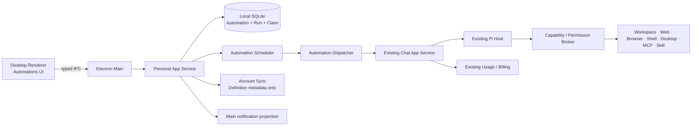

# OpenERX Codex 式自动化执行方案

> 状态：`IMPLEMENTING / LOCAL_ALPHA_LOGIN_STARTUP`
>
> 方案日期：2026-08-29
>
> 当前边界：本地桌面主链路已进入实现；尚未达到跨设备或 production-ready
>
> 范围影响：此文件保留自动化技术设计。变更应同步公共合同、权限与测试；当前范围见
> [公共架构](../ARCHITECTURE.md)，正式验收见 [桌面发布门禁](../RELEASE_GATES.md)。

## 1. 目标与依据

用户可以把一条自然语言任务保存为自动化，并按指定时间在桌面执行主机上自动启动。用户能够查看
下次执行时间、历史运行、实时进度、产物、费用、失败原因和待处理事项，并可暂停、恢复、立即运行、
编辑或删除自动化。

本方案参考 Codex/ChatGPT 当前公开呈现的自动化方向：重复工作流、持续目标、后台执行和可审阅产物；
具体产品命名、协议和实现均使用 OpenERX 自有设计。公开依据见
[OpenAI 官方用例文档](https://learn.chatgpt.com/use-cases?category=data&category=engineering&category=front-end&category=integrations&category=ios&category=macos&search=Automation&task_type=analysis&task_type=code&task_type=testing&team=engineering&team=operations&team=sales)。

### 1.0 实施进度（2026-08-29）

已完成本地 Alpha 主链路：Automation 合同与严格 IPC、SQLite 定义/运行/Claim、一次/日/周调度、
`chat.send` 真实执行复用、运行事件对账、权限等待收敛为 `needs_attention`、桌面管理界面、运行历史、
系统通知与点击深链、定义编辑、未来 5 次执行预览、1/5/30 分钟瞬时错误退避重试，以及 App Service
重启失败对账测试。Windows 已完成后台驻留和登录启动阶段：关闭主窗口只隐藏到系统托盘，App Service
与 Scheduler 继续运行；用户可显式开启“登录 Windows 后自动运行”，系统登录后以后台参数静默启动到
托盘并恢复调度。该设置默认关闭，以 Windows 登录启动项状态为真值；用户从托盘或应用菜单明确退出时
停止当前进程。自动化仍不能在关机、休眠、注销或进程被终止期间运行。

仍未完成的发布范围包括：`outcome_unknown` 副作用对账、账户切换与主机迁移、同步/Remote 投影、
双平台真实通知和休眠唤醒 E2E。下述阶段与验收矩阵继续作为后续实现和发布门禁，不因本地 Alpha
可用而视为完成。

### 1.1 首版必须实现

- 创建一次性或重复自动化，支持本地时区、自然语言描述和表单配置。
- 支持 `一次`、`每天`、`每周` 和高级日历规则；内部保存规范化调度表达式。
- 允许绑定现有 Conversation，也允许每次创建独立 Conversation。
- 到期后由在线且已解锁的桌面执行主机自动启动真实 Pi Run。
- 复用模型选择、Thinking、工作区、Skill、MCP、工具、权限、Usage 和 Billing 现有链路。
- 提供列表、详情、运行历史、失败重试、暂停、恢复、立即运行、编辑和删除。
- 系统通知运行完成、失败、错过和需要用户处理的审批。
- 重启恢复时不重复执行；并发、补跑和重试行为可预测、可审计。

### 1.2 首版明确不做

- 不在 OpenERX 云端运行 Agent，不把 Relay、手机或同步服务变成执行主机。
- 不远程唤醒已关机、休眠或未登录的桌面设备。
- 不新建 Agent Loop、SessionManager 或工具生命周期；全部执行仍由 Pi Host 负责。
- 不允许自动化绕过登录、验证码、支付、发送、发布、删除等逐次确认动作。
- 不允许使用失效 Workspace Grant、撤销的 MCP/Skill 授权或跨设备继承的本地绝对路径。
- 不承诺 OpenERX 进程被明确退出或终止期间准点执行；Windows 关闭主窗口后由系统托盘保持进程，
  用户可选择注册登录启动项，但该能力不能远程唤醒设备或跨越关机、休眠与注销状态。

## 2. 产品语义

### 2.1 两种自动化类型

| 类型 | 用户心智 | 执行目标 | 首版建议 |
| --- | --- | --- | --- |
| `heartbeat` | 在同一项长期工作上定期跟进 | 绑定固定 Conversation/Branch，保留连续上下文 | 首批实现 |
| `standalone` | 每次按模板产生一项独立工作 | 每次创建新 Conversation，并关联回自动化 | 首批实现 |

`heartbeat` 适合“每天检查这个项目的进度并继续处理”；`standalone` 适合“每周生成一份独立报告”。
二者都只是调度和产品投影差异，不能形成第二套 Agent Runtime。

### 2.2 状态模型

自动化定义状态：

```text
active <-> paused
active/paused -> deleted
active -> disabled_by_system
disabled_by_system -> active（用户修复并确认后）
```

单次运行状态：

```text
scheduled -> claimed -> starting -> running -> succeeded
                                      |        -> failed
                                      |        -> cancelled
                                      |        -> needs_attention
scheduled -> missed
claimed/starting/running -> interrupted -> retry_scheduled | failed
```

`needs_attention` 是终态，不在无人值守状态下无限等待审批。用户处理后通过“重新运行”创建新的
AutomationRun，旧运行保持不可变审计记录。

### 2.3 调度语义

- 用户输入按 IANA 时区保存，不能只保存 UTC 偏移；界面始终显示规则时区和用户当前时区。
- 内部优先使用受限 RRULE；高级表达式也必须经过解析、预览和边界校验，不直接执行任意 Cron 字符串。
- 创建和编辑时展示未来 5 次执行时间，夏令时切换必须有确定结果。
- 同一自动化默认 `maxConcurrentRuns = 1`；上一次仍在运行时，新一次记为 `skipped_overlap`，不排无限队列。
- 桌面主机离线期间默认不补跑；恢复后把已过期触发记为 `missed`。可选 `catchUpPolicy = latest_once`，
  只补最近一次且需要用户显式开启。
- Electron Main 监听系统 `suspend` / `resume`，恢复后立即把休眠窗口交给 App Service 对账；休眠期间到期的
  触发不受常规定时扫描的 5 分钟容差影响。对账合并离线积压，不逐条重放；`latest_once` 的
  `scheduledFor` 必须指向恢复时刻之前最近的一次计划时间。
- 自动重试仅覆盖确定可重试的瞬时错误，默认指数退避 1 分钟、5 分钟、30 分钟，最多 3 次；
  权限拒绝、余额不足、配置失效和结果不确定不自动重试。

## 3. 总体架构



### 3.1 组件职责

| 组件 | 新增职责 | 禁止承担的职责 |
| --- | --- | --- |
| `packages/contracts` | Automation Definition/Run/Event、命令和错误码 Schema | 调度或执行逻辑 |
| `packages/storage` | 定义、运行、触发、Claim、幂等和迁移 | 调用 Pi 或工具 |
| `packages/app-service` | Scheduler、Dispatcher、恢复、重试、事件投影 | 自建 Agent Loop |
| `packages/pi-host` | 继续执行一次真实 Run | 感知 RRULE、补跑或通知 |
| `apps/desktop/main` | 生命周期、系统通知、可信 IPC、主机 readiness | 保存 Renderer 私有状态作为真值 |
| `apps/desktop/renderer` | 自动化创建、列表、详情和历史 UI | 自行计算到期并触发执行 |
| Sync Service | 同步自动化定义和用户设置 | 云端触发本地执行 |

Scheduler 放在 Personal App Service，而不是 Renderer：Renderer 关闭、刷新或窗口隐藏不能改变到期判断；
App Service 重启后从数据库重建计时器。Electron Main 仍负责进程监督和系统通知。

### 3.2 执行链路

1. Scheduler 用数据库时间扫描 `nextRunAt <= now` 的 active 定义。
2. 在一个事务中创建 AutomationRun，并通过唯一键
   `(automationId, scheduledFor, attemptGroup)` 防止重复触发。
3. Dispatcher 原子 Claim 运行，记录 `claimedByHostId`、租约和 fencing token。
4. 校验账户、主机、Conversation、模型、余额、Workspace Grant、Skill/MCP 和工具 readiness 快照。
5. 生成稳定 `idempotencyKey`，调用现有 `chat.send`/Run 创建链路；不得直接调用模型网关。
6. Chat/Pi 事件投影回 AutomationRun；Usage、Charge、Artifact 和 Diff 继续使用现有真值。
7. 终态提交后计算并持久化下一次执行时间，再发送系统通知。
8. 崩溃恢复时先按 generation/run 身份对账；无法证明未发生副作用时标记 `outcome_unknown`，禁止自动重放。

## 4. 领域模型

建议新增 `packages/contracts/src/automation.ts`，核心对象如下：

```ts
type AutomationDefinition = {
  id: EntityId;
  ownerProfileId: string;
  name: string;
  prompt: string;
  kind: "heartbeat" | "standalone";
  status: "active" | "paused" | "disabled_by_system" | "deleted";
  schedule: {
    mode: "once" | "rrule";
    expression: string;
    timezone: string;
    startAt: string;
  };
  target: {
    conversationId: EntityId | null;
    branchId: EntityId | null;
    workspaceGrantIds: EntityId[];
  };
  execution: {
    modelRef: string;
    thinkingLevel: ThinkingLevel;
    skillInstallationId: EntityId | null;
    maxConcurrentRuns: 1;
    catchUpPolicy: "skip" | "latest_once";
    retryPolicy: "transient_3" | "none";
  };
  nextRunAt: string | null;
  lastRunAt: string | null;
  createdAt: string;
  updatedAt: string;
  revision: number;
};

type AutomationRun = {
  id: EntityId;
  automationId: EntityId;
  scheduledFor: string;
  trigger: "schedule" | "manual" | "catch_up" | "retry";
  status:
    | "scheduled" | "claimed" | "starting" | "running"
    | "succeeded" | "failed" | "cancelled" | "missed"
    | "needs_attention" | "interrupted" | "retry_scheduled";
  conversationId: EntityId | null;
  branchId: EntityId | null;
  generationId: EntityId | null;
  executionRunId: EntityId | null;
  attempt: number;
  claimedByHostId: string | null;
  leaseExpiresAt: string | null;
  promptSnapshot: string;
  configSnapshot: JsonValue;
  failureCode: string | null;
  actionRequired: boolean;
  createdAt: string;
  startedAt: string | null;
  finishedAt: string | null;
};
```

### 4.1 数据表与约束

- `automation_definitions`：定义和下一触发时间；软删除，账户隔离。
- `automation_runs`：不可变运行身份、状态、快照和关联 Run。
- `automation_run_attempts`：每次 Claim、租约、错误和重试记录。
- `automation_events`：顺序化产品事件，供 Renderer/Remote 增量读取。
- `automation_notification_deliveries`：通知幂等、状态和错误。
- `automation_outbox`：定义同步和通知投影，不承载执行命令。

关键唯一约束：

- `(owner_profile_id, automation_id)` 账户隔离。
- `(automation_id, scheduled_for, attempt_group)` 防重复触发。
- `(automation_run_id, attempt)` 防重复尝试。
- `generation_id` 和 `execution_run_id` 非空时唯一，保证恢复对账只有一个归属。

## 5. API 与事件合同

在 `chatCommandEnvelopeSchema` 同级增加以下命令，所有输入均使用严格 Zod Schema：

| 命令 | 用途 |
| --- | --- |
| `automation.create` | 创建定义并返回未来触发预览 |
| `automation.list` | 按状态列出定义 |
| `automation.get` | 获取定义、下次执行和最近运行 |
| `automation.update` | revision 乐观锁更新 |
| `automation.pause` / `automation.resume` | 暂停或恢复 |
| `automation.runNow` | 创建 manual AutomationRun |
| `automation.delete` | 软删除并取消尚未 Claim 的运行 |
| `automation.runs.list` / `automation.run.get` | 运行历史与详情 |
| `automation.run.cancel` | 取消 scheduled/running 运行，运行中复用现有 abort |
| `automation.schedule.preview` | 解析规则并返回未来 5 次时间 |

新增事件至少包括：

```text
automation.created / updated / paused / resumed / deleted
automation.run.scheduled / claimed / started / progressed
automation.run.needs_attention / retry_scheduled
automation.run.succeeded / failed / cancelled / missed
automation.notification.delivered / failed
```

事件只投影稳定产品字段；Pi 原始 payload、凭据、绝对路径和模型内部推理不得进入 Renderer 或同步层。

## 6. 权限、安全与计费

### 6.1 无人值守权限规则

- 创建自动化时显示能力预检摘要，但这不是对未来高风险操作的一揽子批准。
- 仅能自动使用在执行时仍有效、且策略允许后台使用的已授权 Scope。
- 读取授权工作区、无外网受限 Shell、已授权只读 MCP 可按现有策略自动执行。
- 外部写入、发送、发布、购买、删除、凭据变化、敏感字段提交等逐次确认动作必须转为
  `needs_attention`，不弹出无限期阻塞的模态框。
- Browser/Desktop 需要真人接管、登录或敏感输入时立即停止本次运行并通知用户。
- 权限撤销对下一工具调用立即生效；Scheduler 不缓存可越过 Broker 的权限结论。

### 6.2 账户、同步与设备

- 自动化定义可以随账户同步；本地 Workspace Grant、绝对路径、设备凭据和桌面权限不跨设备同步。
- 每个定义有 `preferredHostId` 或默认主机归属；同一时刻只允许一个主机通过租约 Claim。
- 首版若不提供云端租约服务，则自动化限定为“创建它的本机执行”，同步到其他设备只读展示并要求
  用户显式迁移执行主机，避免双机重复执行。
- 登出、账户切换或设备撤销时暂停相关自动化并撤销未启动 Claim。

### 6.3 费用与配额

- 每次 AutomationRun 使用现有报价、预留、UsageRecord、Charge 和退款/冲正链路。
- 创建时展示“每次运行均可能产生费用”，但不能把创建动作当作无限额度授权。
- 执行前余额或额度不足直接 `needs_attention`；不能先执行后绕过预留。
- 运行历史展示模型、Token、金额、币种和 Charge ID；通知不展示敏感金额明细，除非用户开启。

## 7. 桌面体验

左侧导航新增 `自动化`，不把自动化混入普通对话列表。

### 7.1 列表页

- 分组：运行中、即将执行、已暂停、需要处理。
- 每项显示名称、规则、下次时间、上次结果、执行主机和快捷暂停开关。
- 顶部提供“新建自动化”；空状态提供日报、文件巡检、项目跟进三个模板。

### 7.2 创建/编辑页

- 必填：名称、任务描述、执行时间、时区、自动化类型。
- 可选：Conversation、工作区、模型、Thinking、Skill、执行主机、补跑和重试策略。
- 保存前展示未来 5 次运行、预计能力、可能费用和不能后台自动批准的动作。
- 自然语言时间只作为输入辅助；提交前必须转成明确规则让用户确认。

### 7.3 详情页

- 顶部：状态、下次执行、暂停/恢复、立即运行、编辑、删除。
- 中部：任务文本、调度规则、目标上下文和权限摘要。
- 下部：按时间倒序展示 Run；可进入对应 Conversation、Diff、Artifact、测试、Usage 和错误详情。

系统通知点击后直接打开对应 AutomationRun；`needs_attention` 通知打开明确的处理页，而不是静默继续。

## 8. 实施阶段

### AUTO-000：合同冻结与边界门禁

1. 批准 heartbeat/standalone、桌面唯一执行、离线补跑和后台审批语义。
2. 修订受影响的 V2 合同、总体架构、威胁模型和发布门禁。
3. 增加边界检查，禁止 Scheduler 直接依赖模型网关、Pi internals 或 Tool Adapter。

退出条件：产品和安全合同不再与“定时任务不纳入 V1”冲突；所有依赖方向明确。

### AUTO-001：合同、存储与调度内核

1. 新增 Automation Schema、命令、事件和错误码。
2. 新增 SQLite 迁移、Repository、唯一约束和时区/RRULE 解析器。
3. 实现单进程 Scheduler、原子 Claim、租约、重启恢复、重叠跳过和 missed/catch-up。

退出条件：使用 fake clock 跨重启、DST、重复 tick、系统时间跳变和并发 Claim 测试全部通过。

### AUTO-002：真实执行与对账

1. Dispatcher 通过 `chat.send` 现有入口启动任务。
2. 绑定 AutomationRun、Generation、ExecutionRun、Usage 和 Charge。
3. 实现停止、瞬时失败重试、崩溃恢复和 `outcome_unknown` 对账。

退出条件：真实 Pi fixture 可从到期触发完成一条任务；进程在工具副作用前后崩溃均不重复执行。

### AUTO-003：权限、通知与桌面 UI

1. 实现后台权限判定和 `needs_attention` 收敛。
2. 实现列表、创建/编辑、详情、历史和未来时间预览。
3. 接入 Windows/macOS 系统通知和深链。

退出条件：用户可完整创建、观察、暂停、恢复、立即运行和删除；高风险动作不会无人值守通过。

### AUTO-004：同步、主机归属与 Remote 只读控制

1. 同步定义元数据，不同步本地授权。
2. 实现创建主机归属与显式迁移。
3. 手机端先提供查看、暂停、恢复、取消和审阅；手机不执行调度。

退出条件：双设备不会重复 Claim；主机离线和授权缺失均准确显示且无副作用。

### AUTO-005：发布级验证

1. Windows/macOS 真实长任务、休眠/唤醒、断网、崩溃、更新和账户切换矩阵。
2. Billing、通知、Browser/Desktop、Shell、MCP 和 Skill 组合验证。
3. 性能、隐私导出/删除、诊断脱敏、迁移回滚和签名包验证。

退出条件：新增 Golden Tasks、双平台 E2E 和 `npm run check:v2` 全绿，并形成日期化证据；外部门禁未通过时不得标记 production ready。

## 9. 测试与验收矩阵

| ID | 场景 | 硬性结果 |
| --- | --- | --- |
| AUTO-GT-01 | 创建每天 09:00 自动化 | 未来 5 次时间正确，保存 IANA 时区 |
| AUTO-GT-02 | DST 跳时/重叠 | 不重复，不落到不存在的本地时间 |
| AUTO-GT-03 | Scheduler 重复 tick | 同一 scheduledFor 只产生一个 Run |
| AUTO-GT-04 | App Service 触发后崩溃 | 恢复后对账，不重复调用 Pi |
| AUTO-GT-05 | 上一运行未结束 | 新触发为 skipped_overlap，不无限排队 |
| AUTO-GT-06 | 主机离线后恢复 | 默认 missed；latest_once 最多补一次 |
| AUTO-GT-07 | 工作区授权已撤销 | needs_attention，零文件访问 |
| AUTO-GT-08 | 自动化尝试发送/购买/删除 | needs_attention，零外部副作用 |
| AUTO-GT-09 | 瞬时网络错误 | 按 1/5/30 分钟重试，最多三次 |
| AUTO-GT-10 | 工具成功、本地提交前崩溃 | outcome_unknown，不自动重放 |
| AUTO-GT-11 | 余额不足 | 执行前停止，不产生未授权 Charge |
| AUTO-GT-12 | heartbeat 连续两次运行 | 使用同一 Conversation/Branch，历史有序 |
| AUTO-GT-13 | standalone 连续两次运行 | 创建两个独立 Conversation，可追溯到同一定义 |
| AUTO-GT-14 | 用户立即运行并取消 | 复用 abort，终态和 Usage 完整 |
| AUTO-GT-15 | 双设备同步同一定义 | 仅归属主机执行一次 |
| AUTO-GT-16 | 删除自动化 | 未开始触发取消，历史按隐私合同保留或删除 |
| AUTO-GT-17 | 系统通知 | 点击准确打开对应 Run，重复事件不重复通知 |
| AUTO-GT-18 | 账户登出/设备撤销 | 定义暂停，Claim 撤销，本地权限不泄漏 |

## 10. 可观测性与运维

新增但不包含 Prompt 正文、凭据或本地绝对路径的指标：

- `automation_due_total`、`automation_claim_total`、`automation_duplicate_prevented_total`
- `automation_start_lag_ms`、`automation_run_duration_ms`
- `automation_missed_total`、`automation_retry_total`、`automation_needs_attention_total`
- `automation_outcome_unknown_total`、`automation_notification_failure_total`

诊断包仅输出哈希化 automation/run ID、状态、时间、错误码、主机/版本和租约元数据。日志不得记录
Prompt、文件内容、MCP 参数、截图、Token 或支付信息。

## 11. 主要风险与决策点

| 风险/决策 | 建议结论 |
| --- | --- |
| 应用关闭时是否执行 | Windows 关闭主窗口后托盘驻留并继续；明确退出、进程终止、关机或休眠时不执行；登录自启动另行评审 |
| 多设备谁执行 | 首版绑定创建主机；迁移需显式确认 |
| 无人值守审批 | 仅复用仍有效的低风险授权；高风险统一 needs_attention |
| 离线补跑 | 默认跳过；用户可选只补最近一次 |
| 同一 Conversation 并发 | 单自动化并发 1；目标 Conversation 有活跃 Run 时跳过或 needs_attention |
| 规则格式 | 对外友好表单/自然语言，对内受限 RRULE + IANA 时区 |
| 自动重试副作用 | 只有执行前或证明无副作用的瞬时失败可重试 |
| 云端调度 | 不纳入首版；若未来加入，云端只能发安全唤醒信号，不能绕过本地主机 Claim 与权限 |

## 12. 建议首个纵向切片

用 AUTO-001 + AUTO-002 的最小组合先完成：

1. 本机创建一个 `standalone` 每日自动化。
2. SQLite 保存定义并计算 `nextRunAt`。
3. fake clock 到期后原子创建并 Claim AutomationRun。
4. 通过现有 `chat.send` 启动不带高风险工具的真实 Pi fixture。
5. 将 Conversation、ExecutionRun、Usage 和终态关联回 AutomationRun。
6. 重启 App Service，证明同一触发不会执行第二次。

这个切片验证最关键的架构结论：自动化只是可靠调度和审计层，真正的 Agent 执行仍完整复用现有
Conversation → Chat App Service → Pi Host → Broker → Billing 主链路。
