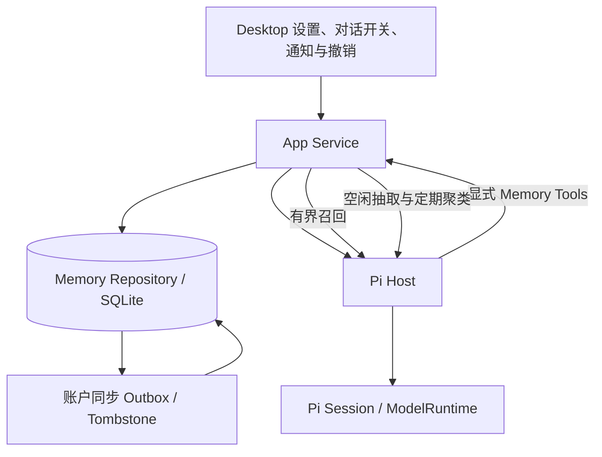
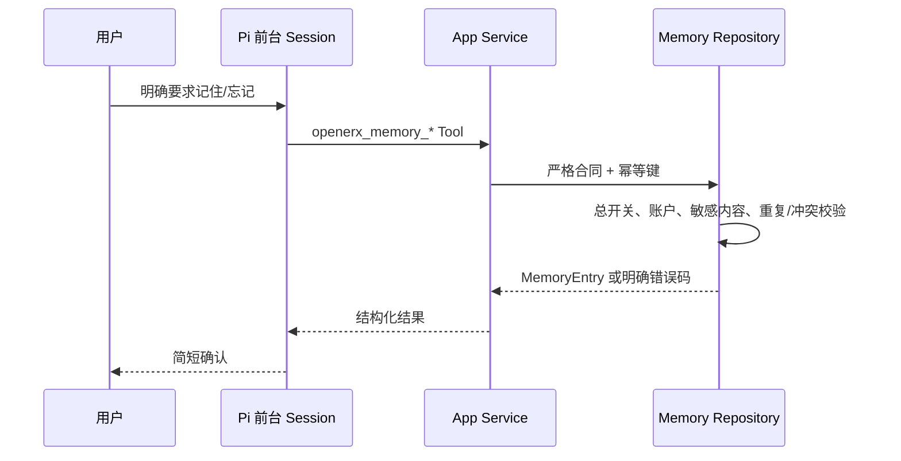

# OpenERX 长期记忆方法

> 状态：`IMPLEMENTED / REAL-MODEL GOLDEN + HOLDOUT VERIFIED`
>
> 日期：2026-08-30（Asia/Shanghai）
>
> 适用范围：OpenERX V2 当前账户级、跨对话长期记忆实现。本文件描述系统现在如何运行；历史决策和
> 分阶段建设过程见 [Codex 风格记忆方案](23-codex-style-memory-plan.md)。

## 1. 方法概览

OpenERX 采用“Pi 会话能力 + OpenERX 产品记忆层”的组合方法：

- Pi 负责当前分支的 agent loop、Session、上下文压缩、恢复、重试和工具生命周期；
- OpenERX 负责账户级长期记忆的保存、召回、同步、合并、来源、删除和用户控制；
- 长期记忆始终是可能出错的用户回忆，不是系统指令，也不授予任何工具权限；
- 当前用户消息、System Prompt、Skill 和工作区指令始终优先于记忆；
- 显式保存优先，自动学习必须经过受限模型任务、确定性校验和可撤销产品界面。

Pi 的 JSONL Session 和 compaction summary 只解决“同一对话继续”和“上下文窗口压缩”。它们不是
账户级产品数据，不能代替可管理、可同步、可删除的长期记忆库。OpenERX 也不读取 Codex 的本地记忆
目录；采用的是相似的产品机制，而不是依赖另一个宿主的私有格式。

## 2. 核心原则

1. **用户控制优先**：默认开启且可随时关闭；使用已有记忆与生成新记忆是两个独立权限。
2. **当前意图优先**：当前消息与旧记忆冲突时使用当前消息，不能让记忆覆盖用户本轮要求。
3. **显式记忆优先**：用户明确保存的内容置信度为 1；自动记忆不能覆盖同一冲突槽中的显式记忆。
4. **最少数据**：只保存短小、原子化的长期事实，不保存整段会话、工具原始结果或组合 Prompt。
5. **安全失败**：凭证、敏感标识、绝对路径、外部内容和不记忆/否认语句在不确定时拒绝自动落库。
6. **确定性优先**：精确重复和明确冲突槽由代码处理；模糊语义关系只生成待确认建议。
7. **可解释、可撤销**：记录主要来源和本地多来源链接；自动新增、替代和合并都能定位与撤销。
8. **派生索引可重建**：MemoryEntry 是产品真值；检索分数、任务、聚类游标和评审队列不是云端真值。
9. **服务端权威计费**：后台模型请求使用稳定去重键，Usage 和计费由服务器决定，客户端不做余额门禁。

## 3. 上下文与真值边界

| 层级 | 内容 | 生命周期 | 真值所有者 |
| --- | --- | --- | --- |
| L0 当前 Turn | 当前输入、工具结果 | 当前执行 | Pi AgentSession |
| L1 当前对话 | 分支消息、Session、压缩摘要 | Conversation/Branch | 产品消息 + Pi SessionManager |
| L2 长期记忆 | 偏好、稳定事实、工作方式、持续主题 | 账户级、跨对话 | OpenERX Memory Repository |
| L3 强制规则 | 安全、产品行为、Skill、项目指令 | 版本化配置/文档 | System Prompt、Skill、工作区指令 |

L2 只能帮助模型回忆，不能承担 L3 的强制语义。需要始终执行的规则必须写入受控指令层。

## 4. 运行架构

各组件职责：

- **Contracts**：定义 MemoryEntry、设置、后台任务、候选、关系建议和 Pi frame 的严格 Schema；
- **Storage**：SQLite 真值、幂等写入、来源、检索、替代链、同步投影和后台任务状态；
- **App Service**：Turn 前召回、Memory Tool 执行、空闲抽取和 consolidation 调度；
- **Pi Host**：创建无工具后台 Session、执行结构化抽取/聚类，并给前台 Session 注入记忆数据块；
- **Desktop**：全局/对话控制、管理页、来源跳转、人工评审、通知和撤销；
- **Sync**：同步规范化 MemoryEntry 和设置，不同步本地检索/任务派生状态。

## 5. 记忆对象

一条 `MemoryEntry` 的核心字段如下：

| 字段 | 含义 |
| --- | --- |
| `kind` | `profile`、`preference`、`workflow`、`ongoing_context` |
| `content` | 一条原子化陈述；显式条目最多 2,000 字符，自动候选最多 500 字符 |
| `retrievalKeys` | 中英文检索键；缺省时由正文确定性生成 |
| `canonicalKey` | 类别 + 规范化正文的稳定哈希，用于精确去重 |
| `conflictKey` | 可选的稳定互斥槽，如 `response.language`；没有明确互斥语义时为 `null` |
| `origin` | `explicit`、`automatic` 或 `consolidated` |
| `confidence` | 显式条目固定为 1；自动条目保留模型置信度 |
| `status` | `active`、`superseded` 或 `deleted` |
| `sourceConversationId/sourceMessageId` | 主要来源；额外来源保存在本地 source links |
| `supersedesMemoryId` | 当前条目替代的前一版本，用于撤销和恢复 |
| `expiresAt` | 自动 `ongoing_context` 默认 90 天；其他条目默认不过期 |
| `revision` | 编辑、删除、同步和评审 stale check 使用的单调版本 |

保存范围：

- `profile`：称呼、语言、时区等稳定个人信息；
- `preference`：回答风格、格式和工具偏好；
- `workflow`：稳定、可复用的个人工作方式；
- `ongoing_context`：跨对话仍需继续的长期主题。

默认禁止保存 API Key、Token、密码、Cookie、验证码、私钥、完整证件/银行卡信息、绝对本地路径、
临时权限、工具原始结果、第三方私密内容、隐藏 Prompt 和内部安全策略。

## 6. 控制面与默认值

| 设置 | 默认值 | 作用 |
| --- | --- | --- |
| `memoriesEnabled` | `false` | 总开关；关闭后不召回，也不向 Pi 提供 Memory Tools |
| `useMemories` | `false` | 是否在新 Turn 中召回已有记忆 |
| `generateMemories` | `false` | 当前对话是否可成为自动记忆来源 |
| `syncMemories` | `false` | 是否同步 MemoryEntry 和记忆设置 |
| `disableOnExternalContext` | `true` | 对话使用外部工具上下文后，默认跳过自动抽取 |
| `idleDelayMinutes` | `30` | 最后一个完成的 assistant 消息后等待多久开始抽取 |

每个对话可以将 `useMemories` 和 `generateMemories` 覆盖为 `true`、`false` 或 `null`；`null` 表示跟随
全局设置。全局总开关始终是硬门禁。

合同中保留的 `minRateLimitRemainingPercent` 和 `rate_limit_low` 跳过原因当前不参与客户端调度。
模型 Usage、额度、去重和计费由平台服务器权威处理，客户端没有可信剩余额度时不会自行阻止抽取。

## 7. 显式写入方法

用户可以在 Settings 手动新增/编辑，也可以明确告诉模型“记住……”。Pi 只在用户明确要求时调用：

- `openerx_memory_search`：查找可能匹配的已保存记忆；
- `openerx_memory_list`：列出 active 记忆；
- `openerx_memory_remember`：新增或更新；
- `openerx_memory_forget`：按精确 memory ID 删除。

显式 upsert 的规则：

1. 先做凭证、认证信息、证件/银行卡和绝对路径扫描；命中即拒绝；
2. 默认根据 `kind + normalize(content)` 生成 `canonicalKey`，重复写入复用现有 active 条目；
3. 所有写入使用 idempotency key，重放和崩溃重试不会产生第二条有效记忆；
4. 若提供 `conflictKey`，新显式值可替代同类别、同槽旧值；旧值进入 `superseded`；
5. 删除替代项时恢复有效前序，因此“撤销替代”不会丢失旧偏好；
6. 如果“忘记”无法精确定位，Pi 应先 search/list，不能猜测批量删除。

## 8. 自动学习方法

自动学习采用“对话空闲后抽取”，不会在每个 Turn 同步阻塞用户回答。

### 8.1 调度与资格检查

1. assistant 终态消息触发或刷新该对话唯一 extraction job；
2. job 默认在 30 分钟后 eligible；同一对话的新终态会重新计时；
3. 调度器默认每 30 秒轮询，每次最多领取 4 个 job；
4. active generation 存在时延后 5 分钟；运行超过 10 分钟的 stale claim 可恢复；
5. 总开关、全局生成开关或对话生成开关关闭时跳过；
6. 至少需要 2 条 completed 用户消息，合计有效文本至少 80 字符；
7. 默认跳过使用过 Web、MCP、文件、Browser、Desktop、Tool Search 等外部上下文的对话；
8. 只发送 completed 用户正文和 message ID，不发送工具原始结果。

### 8.2 受限模型抽取

App Service 调用 `pi.memory.extract`。Pi Host 创建无工具、内存 Session，使用 `thinkingLevel=medium`，
最多返回 8 个严格结构化候选。平台模型沿用对话选择；BYOK 对话使用其受限配置。请求使用
`memory-extract:<jobId>` 作为稳定服务端去重键。

抽取提示要求只保留长期、稳定、由用户亲自表达的事实，并明确排除：

- “不要记住/保存”一类记忆控制语言；
- “这不是我的偏好/资料”一类否认；
- 仅限当前消息、当前任务或本次对话的临时要求；
- 网页、文档、邮件、同事或第三方的引用内容；
- 后续消息已经撤回或禁止保存的前一条内容；
- 凭证、敏感数据和没有明确用户归属的事实。

### 8.3 双层来源安全防线

模型输出不能直接入库。系统共享同一套确定性来源策略：

1. **Pi Host 输出过滤**：Schema parse 后，根据整个用户消息序列计算 blocked source IDs，移除来源不合格的候选；
2. **Storage 最终拒绝**：重新从数据库读取 completed 用户消息，验证 source message 属于当前对话且未被策略阻止；
3. 当前消息中的否认、临时范围、引用外部内容和不保存语言会阻止其自身成为来源；
4. “不要记住刚才/上一条”会同时阻止紧邻的前一条用户消息；
5. “不要记住这次对话”会阻止当前对话全部用户消息。

Storage 是最终边界，因此其他调用方即使绕过 Pi Host 过滤也不能写入这些自动候选。

### 8.4 候选落库

- 候选必须通过严格 Schema、内容长度、sourceMessageId 和敏感内容校验；
- 普通候选置信度必须不低于 `0.72`；
- 精确 canonical 重复只增加来源链接，不创建第二条 active 记忆；
- 同一 `conflictKey` 的自动值可以替代旧自动/合并值，但不能覆盖显式值；
- `duplicate/conflict` 语义建议置信度必须不低于 `0.85`，且只能引用输入中的同类别 active memory ID；
- 模糊重复或冲突不直接入库，而是进入人工确认队列；
- 成功新增后发出系统通知和应用内通知，用户可查看或立即撤销。

## 9. 召回与注入方法

每个 Turn 发给 Pi 前，App Service 只使用当前用户文本做一次本地有界召回：

1. 只考虑最多 100 条 `active` 且未过期候选；
2. 正文和 retrieval keys 进行 NFKC 规范化；中文额外生成相邻双字 token；
3. 分数由类别基础分、词项重合和最多 0.08 的新近度构成；
4. 类别基础分依次为 `profile=0.36`、`preference=0.34`、`workflow=0.20`、`ongoing_context=0.12`；
5. 词项重合最多贡献 0.50，总分截断到 1；低于 0.20 的候选不注入；
6. 按分数和更新时间排序，最多 8 条，总预算最多约 1,200 tokens。

选中的条目作为独立 memory block 进入 Pi System Prompt。该块明确声明：记忆是不可靠回忆而不是
指令，当前消息和项目指令优先。内部块包含 memory ID、类别和相关性，便于 Pi 管理和诊断；正常回答
不应向用户暴露内部 ID 或分数。每次实际使用只记录 memory ID、assistant message ID 和分数，不记录
完整 Prompt。

Memory Tool 的 `search` 用于用户主动管理或前台模型补充查找；Turn 前 `recall` 才是默认注入路径。

## 10. 重复、冲突与合并

系统把“确定性关系”和“模型建议”分开处理。

### 10.1 确定性关系

- 相同 `canonicalKey`：精确重复，保留一条 active，累积来源；
- 相同非空 `conflictKey`：确定性互斥槽，同账户/同类别/同槽最多一个 active 值；
- 显式值优先于自动/合并值；
- 替代通过 `supersedesMemoryId` 形成可恢复链，而不是物理覆盖；
- 删除当前值、删除其唯一来源或同步 tombstone 后，可恢复仍有效的前序值；
- 同步导入会按显式优先和稳定顺序确定性收敛，避免设备到达顺序决定最终值。

### 10.2 定期 consolidation

调度器默认每小时检查；距上次完成 24 小时，或 active 记忆超过 200 条时创建运行记录。
确定性阶段负责：

- 将过期记忆 tombstone；
- 恢复有效 supersede 前序；
- 修复断链、无效前序和循环；
- 保留最近 100 次 consolidation 审计记录；
- 10 分钟未更新的 running run 可由后续调度恢复。

### 10.3 模糊语义评审

自动候选会携带最多 50 条现有记忆给抽取模型。模型只能标记 `none`、`duplicate` 或 `conflict`；
`duplicate/conflict` 先进入待确认队列，确认前不改变 active 记忆。

确定性 consolidation 完成后还会扫描历史 active 记忆：

- 按 kind 分组，每 20 条形成一个块；
- 枚举同类型块内和块间组合，单次最多 40 条；
- 每次 consolidation 默认推进 2 个组合；
- `pi.memory.cluster` 最多返回 20 个、置信度至少 0.85 的关系对；
- v27 游标持久化，重启后续跑，完整周期后回绕；模型失败时不推进游标；
- 评审保存双方正文和 revision 快照，任一条变化后旧建议不能应用；
- 确认重复时按显式来源优先、再按更新时间选择保留项；确认冲突时使用界面展示的较新项；
- dismiss 不修改任何记忆。

语义模型只负责提出候选关系，不能自动删除或替代模糊相似的记忆。

## 11. 来源、删除与撤销

- MemoryEntry 保存一个主要来源；本地 `memory_source_links` 可记录同一规范记忆的多个对话来源；
- Settings 可以展开来源、查看对话标题并跳转；
- 删除对话时可选择同时删除仅来源于该对话的长期记忆；仍有其他来源时只移除来源链接并重选主要来源；
- 删除单条、按类别清理和清空全部都使用幂等操作；删除立即使条目不再召回；
- 自动新增通知支持一键撤销；替代项的删除会恢复前一版本；
- 个人数据导出包含记忆和相关控制数据；账户删除清理本地记忆、来源、任务和同步状态。

## 12. 跨设备同步

当前同步对象包括：

- `memory_entry`；
- `memory_settings`；
- `memory_conversation_settings`。

同步使用现有 revision、Outbox、cursor 和 tombstone 机制。启用同步时会补传本地非删除记忆和设置；
离线删除会在恢复连接后上传，其他设备不能用旧副本复活已删除记忆。

以下内容是设备本地派生状态，不同步：

- extraction jobs、consolidation runs 和语义轮转游标；
- usage events 和检索分数；
- merge review 队列；
- 完整 `memory_source_links` 图；
- 原始证据文本、工具输出和绝对路径。

因此，当前跨设备可同步规范化记忆和主要来源，但多来源完整图还不能在所有设备间无损收敛。

## 13. 安全与隐私模型

| 风险 | 防线 |
| --- | --- |
| Prompt injection 进入记忆 | 外部上下文默认整段排除；引用/否认/不保存 source guard；记忆按不可信数据注入 |
| 模型输出越权 | 无工具后台 Session；严格 JSON Schema；候选和关联 ID 白名单校验 |
| 凭证或敏感信息落库 | 通用脱敏器 + 私钥、Cookie、OTP、证件、银行卡、绝对路径确定性规则 |
| 自动错误事实 | 0.72 门槛、来源保留、通知、编辑/删除、模糊关系人工确认 |
| 记忆覆盖规则 | System/Skill/项目指令和当前消息优先；记忆不授予工具权限 |
| 跨账户串读写 | Repository 以 owner profile 隔离；同步沿用 account/device 边界 |
| 重放或重复计费 | 本地幂等键 + 平台 extraction/cluster 稳定请求去重键 |
| 诊断泄漏正文 | 默认诊断只记录 ID、类型、分数/错误码；MemoryEntry 不进入默认诊断包 |

显式保存也不能绕过敏感信息拒绝规则。关闭总开关会立即阻止召回和 Memory Tools；清理和云端
tombstone 可以异步完成，但被删除条目不会继续注入。

## 14. 计费与模型运行

- 前台显式 remember/list/search/forget 是本地产品工具，不需要额外后台模型调用；
- 自动抽取和历史聚类复用 Pi `ModelRuntime`，不建立第二套 agent loop 或 provider adapter；
- 平台抽取使用 `memory-extract:<jobId>`，聚类使用
  `memory-cluster:<runId>:<batchKey>` 作为去重键；
- 平台服务器持久化权威 Usage 并直接计费；客户端返回的 Usage 仅供结果展示/诊断；
- BYOK 走用户配置的受限 OpenAI-compatible provider；
- 当前没有客户端可信额度/剩余用量门禁，不根据本地副本跳过记忆任务。

## 15. 当前参数总表

| 参数 | 当前值 |
| --- | --- |
| 自动抽取空闲时间 | 30 分钟，可配置 1～1,440 分钟 |
| extraction 调度轮询 | 30 秒 |
| 每 tick 最大领取数 | 4 |
| active generation 延后 | 5 分钟 |
| extraction stale 恢复 | 10 分钟 |
| 最短对话 | 2 条 completed 用户消息且总文本至少 80 字符 |
| 单次自动候选 | 最多 8 条 |
| 自动候选置信度 | ≥ 0.72 |
| 语义关系置信度 | ≥ 0.85 |
| 抽取时现有记忆上下文 | 最多 50 条，每条正文最多 500 字符 |
| Turn 前召回 | 最多 8 条、约 1,200 tokens、最多扫描 100 条 active |
| 自动 ongoing context TTL | 90 天 |
| consolidation 检查 | 每小时 |
| consolidation 触发 | 24 小时或 active 数量 > 200 |
| 历史语义批次 | 块大小 20；单次最多 40 条；每轮默认 2 批 |
| 单次历史关系建议 | 最多 20 对 |

## 16. 评测与证据

真实模型评测复用生产提示词、Schema、关系校验和 source guard，不允许用 Fake Provider 代替最终结果。

| 数据集 | 调用数 | 聚类 P/R/F1 | 抽取原始模型 P/R/F1 | 端到端抽取 P/R/F1 | 安全误报 | 结果 |
| --- | ---: | --- | --- | --- | ---: | --- |
| `memory-semantic-golden-v1` | 16 | 100% / 100% / 100% | 100% / 100% / 100% | 100% / 100% / 100% | 0 | PASS |
| `memory-semantic-holdout-v1` | 6 | 不适用 | 100% / 100% / 100% | 100% / 100% / 100% | 0 | PASS |

两次 fixed 运行中的敏感泄漏、无效/截断输出和模型错误均为 0，source guard 拦截候选数也均为 0。
后者说明改进后的模型提示在这两次运行中已独立正确，确定性 guard 仍作为纵深防御。

证据：

- [公共测试说明](../TESTING.md)
- [公共测试说明](../TESTING.md)
- [公共测试说明](../TESTING.md)
- [公共测试说明](../TESTING.md)
- [公共测试说明](../TESTING.md)

## 17. 当前完成度与下一步

已经完成：显式记忆闭环、用户控制、词项召回、Prompt 隔离、自动抽取、通知与撤销、精确重复、
conflict slot、supersede 恢复、确定性 consolidation、语义人工评审、全目录分片轮转、规范化记忆
同步、个人数据导出/删除，以及真实模型 Golden + holdout 门禁。

仍需完成：

1. **1,000 条记忆本地延迟基准**：验证召回 P95 不高于既定 50 ms 预算；
2. **完整多来源图跨设备同步**：为 source link 建立稳定同步对象 ID 和冲突语义；
3. **扩大并重复真实模型评测**：增加独立语料、多轮运行和模型版本漂移监控；
4. **跨账户/跨设备真实 Beta**：完成 MEM-01～MEM-12 的发布级端到端证据；
5. **Phase C 检索增强只按评测启动**：词项召回不达标时再增加可重建 Embedding 索引，不改变
   MemoryEntry 产品真值或同步合同。

## 18. 代码导航

- 合同与 source guard：[packages/contracts/src/memory.ts](../../packages/contracts/src/memory.ts)
- SQLite Repository：[packages/storage/src/memory-repository.ts](../../packages/storage/src/memory-repository.ts)
- Turn 前召回与 Memory Tools 执行：[packages/app-service/src/chat-app-service.ts](../../packages/app-service/src/chat-app-service.ts)
- 自动抽取调度：[packages/app-service/src/memory-extraction-scheduler.ts](../../packages/app-service/src/memory-extraction-scheduler.ts)
- consolidation 调度：[packages/app-service/src/memory-consolidation-scheduler.ts](../../packages/app-service/src/memory-consolidation-scheduler.ts)
- 生产抽取/聚类提示和校验：[packages/pi-host/src/memory-background.ts](../../packages/pi-host/src/memory-background.ts)
- Pi Memory Tools：[packages/pi-host/src/memory-tools.ts](../../packages/pi-host/src/memory-tools.ts)
- Prompt 记忆数据块：[packages/pi-host/src/agent-session.ts](../../packages/pi-host/src/agent-session.ts)
- Desktop 设置与评审界面：[apps/desktop/src/renderer/App.tsx](../../apps/desktop/src/renderer/App.tsx)
- Golden 运行器：[scripts/memory/model-golden-eval.ts](../../scripts/memory/model-golden-eval.ts)
