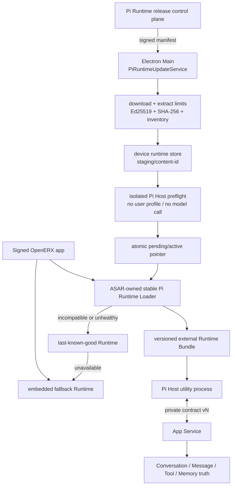
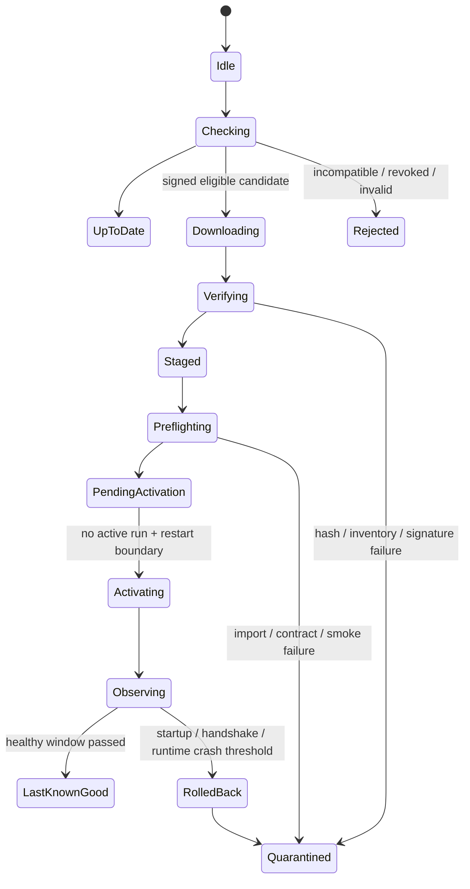

# Pi Runtime 独立远程升级方案

> 状态：`PROPOSED / PIRU-001 LOCAL PASS`
>
> 日期：2026-08-30（Asia/Shanghai）
>
> 首个目标：`@earendil-works/pi-* 0.84.3 → 0.84.4`
>
> 适用面：Windows x64、macOS arm64/x64 桌面执行主机；iOS/Android Remote Companion 不运行 Pi

## 1. 结论

OpenERX 应把 Pi 从“随整个桌面应用一起更新的源码依赖”演进成“应用内置兜底 Runtime +
设备级版本化 Runtime Bundle”。更新控制器继续由 Electron Main 持有，使用单独的 HTTPS +
Ed25519 信任根下载精确构建产物；候选包在非活动目录完成验签、哈希、兼容性和进程预检后，
只在没有活动 Run 时于下一次 Pi Host 启动原子切换。启动、握手或确定性运行时健康检查失败时，
自动回到上一已知良好版本；内置 Runtime 永不被远程更新删除。

升级前的应用版本不能立即通过远程文件把 Pi `0.84.3` 替换为 `0.84.4`：

- `packages/pi-host`、根 `package.json` 和 Desktop 开发依赖当时都锁定 `0.84.3`；
- Vite 把 Pi 与 OpenERX Host 适配代码一起构建成 `.vite/build/pi-host.js`；
- `AppServiceSupervisor` 从应用包内部用 `utilityProcess.fork()` 启动该入口；
- Electron 已启用 `OnlyLoadAppFromAsar` 和 ASAR 完整性 Fuse。

因此需要一次普通桌面应用升级，先交付稳定 Runtime Loader、外部 Bundle 验证器和回滚状态机。
这次引导版本之后，兼容的 Pi 小版本才可以独立远程升级。不能用下载上游 `pi` CLI、执行
`npm install -g` 或修改应用 ASAR 的方式绕过这一步。

## 2. 参考方案与采用边界

### 2.1 Codex / ChatGPT Desktop 可复用原则

OpenAI 官方文档说明桌面应用默认自行检查和安装更新；组织可以关闭应用内更新，改由 MDM 或
软件分发平台部署经过批准的版本，同时需要测试新版本、跟踪已安装版本并及时发布安全修复。
Codex Changelog 也按精确 CLI 版本发布可重复的安装命令。

本机当前 Codex 安装还可以观察到两个有用的实现形态，但它们不是 OpenAI 的公开兼容合同：

- Windows 商店应用壳和 `%LOCALAPPDATA%/OpenAI/Codex/bin/<content-id>/codex.exe` 分离；
- CLI、Command Runner、Sandbox Setup 和 Code Mode Host 位于同一个版本化目录，文件有有效的
  OpenAI Authenticode 签名，进程从该精确目录启动；
- 其他本地 Runtime 也使用 `<runtime>/<content-id>/.../manifest.json` 的版本化目录布局。

OpenERX 采用其中的稳定原则：应用壳与高频 Runtime 解耦、目录不可变、精确版本启动、先验证后
激活、保留旧版本。不会依赖 Codex 的私有 URL、目录名、协议或服务端实现。

### 2.2 Pi 社区自身的托管升级机制

Pi `0.84.3` 已加入实验性的 managed install 更新：获取精确版本的 `package.json` 与 lockfile，
在 `staging/update-*` 中执行 `npm ci --ignore-scripts`，运行 `pi --version` 预检，将目录移动到
`releases/<version>`，最后以 rename 原子替换 `current-version`；失败时不改动当前版本，并用锁阻止
并发更新。

OpenERX 复用它的状态机思想，但不在用户机器执行 npm：

- 客户端只下载 CI 已构建、已锁依赖、已测试和已签名的 OpenERX Pi Runtime Bundle；
- Bundle 包含 Pi 和匹配的 OpenERX 适配层，不把上游 `pi` CLI 当作产品 Agent Host；
- 客户端不运行 install script，不解析任意 npm/git 依赖，不接收用户提供的更新 URL；
- 激活验证不仅检查版本，还检查 OpenERX Host 合同、运行环境和启动握手。

### 2.3 明确不采用

1. **不修改正在运行的 Pi 模块。** Node ESM 缓存、活动 `AgentSession`、Tool Call 和 MessagePort
   无法在进程内可靠热替换。
2. **不让 Renderer 下载或选择 Runtime。** Manifest URL、公钥、Artifact URL 和本地真实路径只在
   Main/受控发布进程存在。
3. **不直接运行上游 CLI/RPC。** 这会绕开现有 Pi Host 的事件投影、平台 Model Provider、文件、
   Memory、Capability Broker、权限、Usage 和 Remote 映射。
4. **不远程替换 `@openerx/contracts` 或 Main Supervisor。** IPC 合同演进仍通过桌面应用升级。
5. **不把一次 npm 发布自动视为可发布 Runtime。** Pi API 兼容性必须先通过 OpenERX 回归和审批。
6. **不支持未签名降级。** 回滚只切换到本机已经验签的 LKG/内置版本，或发布更高的修复版本。

## 3. 目标与非目标

### 3.1 目标

- 独立发布兼容的 Pi patch/minor，不等待整个 Electron 应用重新签名和分发；
- Windows x64、macOS arm64/x64 使用同一发布和灰度控制面；
- 下载失败、断电、进程崩溃、协议错配和坏包都不能破坏当前可用 Runtime；
- Conversation、Message、Artifact、Memory、Billing、Remote 和 Skill 数据不随 Runtime 切换迁移；
- 更新可暂停、撤回、自动回滚、人工钉住和审计；
- 用户只看到版本、通道、进度、待重启/已回滚和脱敏错误码。

### 3.2 非目标

- 不支持任意 Pi 版本或用户自带 Pi 构建；
- 不在 V1 引入多 harness 抽象；Pi 仍是唯一生产 Agent Harness；
- 不允许 Runtime Bundle 增加新的 OS 权限、Main 能力或 IPC 消息；
- 不在一次远程 Runtime 更新中迁移 OpenERX SQLite Schema；
- 不替代桌面应用自身的 Squirrel/ZIP/DMG 签名更新；
- 首版不做运行中 Session 的无感迁移。

## 4. 目标架构



信任和职责分层：

| 组件 | 随应用更新 | 可远程 Runtime 更新 | 权限/职责 |
| --- | --- | --- | --- |
| Main `PiRuntimeUpdateService` | 是 | 否 | 检查、下载、验签、预检、激活、回滚、审计 |
| ASAR Runtime Loader | 是 | 否 | 读取已验证指针、再次校验兼容性、加载精确入口 |
| `@openerx/contracts` | 是 | 否 | App Service ↔ Pi Host 严格协议 |
| OpenERX Pi Adapter | 内置一份 | 是 | 把特定 Pi API 映射到稳定 Loader/Host 合同 |
| `@earendil-works/pi-*` | 内置一份 | 是 | AgentSession、Loop、压缩、重试和工具生命周期 |
| Conversation/Message/SQLite | 否 | 否 | 产品真值，不由 Runtime 包拥有或迁移 |

## 5. Runtime Bundle 规范

### 5.1 产物

每个平台/架构发布一个不可变 ZIP，例如：

```text
openerx-pi-runtime-1.0.0-pi-0.84.4-win32-x64.zip
openerx-pi-runtime-1.0.0-pi-0.84.4-darwin-arm64.zip
openerx-pi-runtime-1.0.0-pi-0.84.4-darwin-x64.zip
```

解压后内容固定：

```text
runtime.json
pi-runtime.mjs
sbom.cdx.json
THIRD_PARTY_NOTICES.txt
```

`pi-runtime.mjs` 是 CI 从精确 lockfile 构建的单入口 Bundle，包含指定 Pi 版本和版本匹配的
OpenERX Pi Adapter。生产客户端不安装 node_modules。若未来确实需要原生 addon，必须作为 manifest
inventory 中的平台文件单独签名/哈希，并增加 Electron/Node Module ABI 精确门禁；首版优先保持纯
JS Bundle。

### 5.2 Manifest

使用独立于桌面安装包更新的 `Pi Runtime signing key`。外层沿用 Ed25519 signed envelope；Payload
至少包含：

```json
{
  "schemaVersion": 1,
  "product": "OpenERXPiRuntime",
  "keyId": "openerx-pi-runtime-2026-01",
  "runtimeReleaseId": "piru-20260830-0001",
  "runtimeReleaseVersion": "1.0.0",
  "piVersion": "0.84.4",
  "adapterVersion": "1.0.0",
  "channel": "internal",
  "publishedAt": "2026-08-30T12:00:00.000Z",
  "rolloutPercentage": 0,
  "minimumAppVersion": "2.0.0-alpha.1",
  "maximumAppVersionExclusive": "2.1.0",
  "hostContractVersions": [10],
  "loaderApiVersion": 1,
  "revokedRuntimeReleaseIds": [],
  "releaseNotesUrl": "https://releases.openerx.example/pi/1.0.0/notes",
  "artifacts": [
    {
      "platform": "win32",
      "arch": "x64",
      "kind": "zip",
      "downloadUrl": "https://releases.openerx.example/pi/1.0.0/win32-x64.zip",
      "sha256": "<64 lowercase hex>",
      "sizeBytes": 1,
      "contentId": "<full artifact sha256>",
      "entry": "pi-runtime.mjs",
      "nodeMajor": 24,
      "electronMajor": 44
    }
  ]
}
```

规则：

- `runtimeReleaseId` 是不可复用的发布身份；`runtimeReleaseVersion` 是 OpenERX Bundle 版本，不能只用
  上游 `piVersion`；同一个 Pi 版本可能因
  Adapter、构建或安全修复需要重新发布；
- 客户端必须同时检查 App 范围、Host Contract、Loader API、平台、架构、Node/Electron 运行环境；
- `rolloutPercentage` 使用设备稳定 ID + key ID + Runtime Release Version 计算确定性 cohort；
- `revokedRuntimeReleaseIds` 只用于阻止或撤销外部 Runtime，不能撤销应用内置兜底；
- Artifact 必须先发布到不可变 URL，Manifest 最后发布；禁止覆盖同 URL 的字节；
- 清单限制 1 MiB，Artifact 默认限制 100 MiB、10,000 个文件、解压后 300 MiB，并拒绝绝对路径、
  `..`、符号链接、硬链接、设备文件和重复规范化路径；
- 公钥和 Manifest URL 随签名应用进入 Main 配置，私钥只存在于受保护发布环境。

## 6. 设备目录与状态

Runtime 位于 Electron `userData` 下的设备级、禁止同步目录；不放进 Conversation/Account 云同步：

```text
runtime/pi/
  state.json
  update.lock
  releases/
    <content-id>/
      runtime.json
      pi-runtime.mjs
      sbom.cdx.json
      THIRD_PARTY_NOTICES.txt
  staging/
    <download-id>/
  quarantine/
    <content-id>.json
```

`state.json` 使用 temp file + fsync + rename 原子提交，并保存：

- `embeddedPiVersion`；
- `activeRuntimeReleaseId`；
- `pendingRuntimeReleaseId`；
- `lastKnownGoodRuntimeReleaseId`；
- 每个候选的首次/最近启动时间、成功启动次数、Runtime-origin crash 次数；
- `lastCheckedAt`、`lastRollbackAt` 和脱敏 reason code；
- 用户/管理策略的 channel、自动更新和临时 pin 状态。

状态损坏时 fail closed：忽略外部指针并启动内置 Runtime。Runtime 目录只允许当前用户写入；Main
在每次启动前重新校验 `runtime.json` 和入口哈希，不能只信任之前写入的 `state.json`。

## 7. 检查、下载、激活与回滚状态机



### 7.1 检查与下载

1. 应用启动后延迟检查，并支持用户手动检查；同一设备只允许一个更新锁。
2. Main 以 `cache: no-store` 获取 Manifest，验证 schema、key ID、Ed25519、时间、channel、版本和
   cohort，再选择精确平台 Artifact。
3. 下载只写 staging，支持断点续传时必须绑定 URL、ETag、期望大小和 digest；信息变化则丢弃分片。
4. 解压到新的 content-id 目录，逐文件执行路径和大小限制，最后校验 Artifact SHA-256、内部
   runtime inventory 与 `runtime.json`。
5. 已存在的 content-id 也必须重验，不因目录存在而直接激活。

### 7.2 客户端预检

预检用独立临时目录和一次性 nonce 启动候选 Pi Host，不传真实账户 Token、BYOK Key、Conversation
历史、Workspace、Skill 或 MCP：

- Bundle 可导入且只导出规定的 Loader API；
- 报告值与 manifest 中的 `piVersion`、`adapterVersion`、Host Contract 和 entry digest 一致；
- Pi 关键构造器和 OpenERX ToolDefinition 可加载；
- `pi-host.ready` 在 10 秒内完成，退出和端口关闭能回收资源；
- 不使用 faux Provider 发起模型调用；行为级测试在 CI/发布门禁完成，生产包继续排除假 Provider。

### 7.3 激活

MVP 只在以下安全点激活：

- 所有交互 Run、Automation、后台 Memory 提取/聚类和 Tool request 都已终态；
- App Service 已将产品投影落库；
- 用户选择“重启以更新”，或下一次桌面应用冷启动。

激活只原子修改 `pending/active` 指针，不覆盖目录。首版不迁移正在运行的 Pi Session；产品会在新
Runtime 下以 Conversation/Branch 历史重建 Session。Remote 在激活窗口收到 Start/Steer/Queue 时
返回明确的 `PI_RUNTIME_RESTARTING` 可重试状态，不能静默丢命令。

### 7.4 健康观察与 LKG

候选在以下条件全部满足后才能成为 LKG：

- 连续 3 次 Pi Host 启动握手成功；
- 24 小时内没有 Runtime-origin crash loop 或 IPC invariant failure；
- 至少一个真实 Turn 到达 `completed` 或用户主动 `stopped`，事件序列和 Usage 终态合法；
- 没有发生 Session 解析损坏、Tool Call/result 顺序错误或重复终态。

模型鉴权、额度不足、Provider 5xx、用户取消、网络断开和工具业务失败不触发 Runtime 回滚。只有
`PI_RUNTIME_*`、Host Contract 错配、入口导入失败、进程崩溃和确定性事件不变量失败计入回滚预算。

### 7.5 自动与人工回滚

- 候选启动/握手连续失败 2 次，或 5 分钟内发生 2 次 Runtime-origin crash，立即切换 LKG；
- 没有 LKG 时启动应用内置 Runtime；
- 回滚后把候选加入本机 quarantine，同一 content-id 不自动重试；
- 服务端可把 rollout 设为 0 并在签名 Manifest 中撤销 release id；已激活客户端下次检查后切回
  LKG/内置版本；
- 人工“恢复内置 Runtime”始终可用，但不删除用户数据；
- 修复发布使用更高 `runtimeReleaseVersion`。不通过伪造旧版本或关闭验签实现回滚。

## 8. Pi Host 合同调整

当前 `pi-host.ready` 只返回 `contractVersion` 与 nonce，不足以证明实际加载了哪套 Runtime。引导应用
版本需要新增：

```ts
interface PiRuntimeIdentity {
  runtimeReleaseId: string; // "embedded" 或 signed release id
  runtimeReleaseVersion: string;
  piVersion: string;
  adapterVersion: string;
  loaderApiVersion: 1;
  hostContractVersion: 10;
  entrySha256: string;
}
```

建议的代码边界：

```text
packages/pi-host-loader/        # 稳定 Loader，随应用发布，不直接依赖 Pi
packages/pi-runtime/            # 版本匹配 Adapter，直接依赖精确 Pi 版本
packages/pi-runtime-update/     # Manifest、Store、Verifier、Activation policy
apps/desktop/src/main/
  pi-runtime-update-service.ts  # Main-only 控制器
  app-service-supervisor.ts     # 从 Loader 解析后的精确 Runtime 启动
```

拆分后仍满足 ADR-V2-007：Pi 是唯一 Harness；Loader API 是单一 Pi Host 的版本边界，不是多 Harness
插件接口。`packages/pi-runtime` 可以随 Bundle 更新，`contracts`、Main 与 Loader 只能随 App 更新。

Host Ready 还需要回传 Runtime Identity，App Service 必须精确校验预期 nonce、Host Contract 和
Runtime Release ID。任何错配都在读取用户数据或接受 Prompt 前退出。

## 9. `0.84.4` 专项兼容性门禁

从 Pi `v0.84.3` 到 `v0.84.4` 的上游差异为 112 个文件，包含 2,786 行新增和 378 行删除。与
OpenERX 直接相关的变化至少有：

- 大 Tool Result 可在 Tool 执行后、下一次 Assistant Response 前触发自动压缩；
- Session JSONL 缺少尾换行时会自动修复；
- 运行中 `triggerTurn: false` 的 Custom Message 延后到 Tool Result 之后写入；
- OpenAI-compatible reasoning details 的流式合并与 replay 修复；
- Compaction/branch summary 不再强制 `toolChoice: none`；
- DeepSeek V4 Flash Vision 实验模型目录；
- Windows shell abort、Proxy、Mistral fragmented Tool Call 等修复。

因此 `0.84.4` 不能只跑 TypeScript 和启动烟测，发布门禁必须覆盖：

| Gate | 必须证明 |
| --- | --- |
| 依赖锁 | 根、`packages/pi-host`/新 `pi-runtime`、Desktop 的 Pi 包全部精确为 `0.84.4`；lockfile 无混合 `0.84.3` |
| AgentSession | prompt、stream、stop、retry、steer、follow-up、queue 的事件顺序与单终态 |
| Tool continuation | Tool Call → progress → Tool Result → 下一轮 assistant；大结果触发压缩时仍保持顺序 |
| Compaction | 自动/手动压缩、branch summary、Token/Usage、活动投影和中断恢复 |
| Session recovery | 无尾换行、崩溃恢复、Branch 隔离、旧 `0.84.3` Session 样本读取 |
| Reasoning security | 原始 thinking/reasoning replay 元数据不进入产品事件、日志、Remote 或诊断包 |
| Model adapters | 平台 DeepSeek SSE、BYOK OpenAI-compatible、图片输入、Tool Choice 和 Usage 对账 |
| Product tools | File、Memory、Skill、MCP、Browser、Brokered Bash、Desktop 和类型化结果 |
| Packaging | 三个目标产物只含生产 Runtime；无 faux Provider、source map、测试入口或未列明文件 |
| Upgrade lifecycle | 断点下载、坏签名、坏哈希、协议错配、预检失败、激活、崩溃回滚、撤回和数据保持 |

版本升级必须保存日期化证据和上游 tag commit：

- `v0.84.3`: `4e58f324fae8ebfa98a3d45181fb248072a2afac`
- `v0.84.4`: `b79e4cc834970cca69daebffab7df1da7d1e52c4`

## 10. 发布与灰度

### 10.1 通道

- `internal`：开发/测试设备，允许手工立即激活；
- `preview`：签名候选与受控 Beta；
- `stable`：只接收已完成所有 Gate 和批准的 Runtime。

通道只能由签名应用配置或受管理策略收窄；普通用户不能把 stable 客户端指向任意 URL。管理员可
关闭 Runtime 自动更新并通过设备管理分发批准的 Runtime，但仍必须使用 OpenERX 签名 Bundle。

### 10.2 推广顺序

1. CI 构建三个平台/架构 Bundle，生成 SBOM、哈希、测试和签名证据；
2. 内部固定设备下载、预检、激活、冷启动、首个真实 Turn 和回滚演练；
3. Preview：1% → 10% → 50% → 100%，每档至少观察 24 小时；
4. Stable：1% → 5% → 25% → 100%，每档按 crash/turn/tool/rollback 指标审批；
5. Artifact 先发布，Manifest 最后发布；保留当前与上一 LKG 的不可变 Manifest/Artifact；
6. rollout 归零和撤回只阻止/回退 Runtime，不删除审计记录或用户数据。

### 10.3 观测指标

- check/download/verify/preflight/activate 成功率和耗时；
- 按 App/Pi/Runtime Release/平台/架构聚合的 Pi Host 启动与崩溃率；
- 首个 delta、Turn 完成、Stop、Tool continuation 和 Compaction 成功率；
- 自动回滚率、回滚原因、quarantine 数量和 LKG 年龄；
- Runtime 版本覆盖率和被管理策略禁用的设备比例。

遥测不得包含 Prompt、Message、文件内容、Tool 参数/输出、API Key、绝对路径或 Session JSONL。

## 11. 密钥、供应链和应急

- Runtime Manifest 使用与桌面应用更新分离的 Ed25519 key，降低单一密钥的影响面；
- 构建从锁定 tag/commit 和 npm integrity 开始，在受保护 runner 上执行，输出 SBOM、依赖清单、
  source commit、构建命令和 Artifact digest；
- 发布工作流必须确认根依赖和 Bundle 内报告的 Pi 版本一致，禁止 semver range 漂移；
- 客户端不信任 `runtime.json` 自报版本，必须与签名 Manifest 和实际预检报告三方一致；
- Runtime signing key 轮换使用随桌面应用发布的 bridge key set；密钥疑似泄露时立即 rollout 归零、
  撤销所有受影响外部 Runtime，并回到内置版本；
- Runtime 不能增加 OS entitlement、网络白名单或 Broker 权限。需要这些能力时必须升级整个应用并
  重新完成原生签名/公证门禁。

## 12. 分阶段实施

| 阶段 | 交付 | 退出条件 |
| --- | --- | --- |
| PIRU-001 Baseline | 在当前结构中把 Pi 更新到 `0.84.4`，完成专项兼容测试和日期化证据 | `LOCAL PASS`；依赖、Pi Host、Session/Tool/Compaction、真实 DeepSeek 和 Bundle 构建已验证，完整工作区例外见[公共测试说明](../TESTING.md)；尚不宣称远程更新或发布完成 |
| PIRU-002 Loader SPIKE | 证明签名 Windows/macOS 包可由 ASAR Loader 加载外部已验签 ESM Bundle | 三平台/架构 import、MessagePort、Fuse、签名、公证/安装态和失败回退实测通过 |
| PIRU-003 Bundle Split | 拆分稳定 Loader、Pi Adapter/Runtime，增加 Runtime Identity 与兼容性合同 | 内置 Bundle 行为与当前 `pi-host.js` 等价；Release graph 仍只有一个 Harness |
| PIRU-004 Update Core | Manifest Schema、签名、下载、解压防护、Store、锁、预检、原子指针 | 单元/集成测试覆盖所有失败注入，坏候选不改变 active |
| PIRU-005 Lifecycle | 安全点激活、Supervisor 重启、LKG、quarantine、自动/人工回滚 | 活动 Run 不丢终态；Conversation/Message/Memory/Artifact/Remote 数据保持 |
| PIRU-006 UI/Admin | Settings 状态、手工检查、待重启、恢复内置、channel/pin 管理策略 | Renderer 无 URL/公钥/路径；无权限用户不能扩大通道或绕过签名 |
| PIRU-007 Release | 三平台 CI、SBOM、Manifest、灰度、撤回、密钥轮换和 runbook | Internal/Preview 完整演练后才允许 Stable 1% |

### 12.1 `0.84.4` 推荐落地顺序

1. 先执行 PIRU-001，把 `0.84.4` 当作普通源码依赖升级验证；这一步能立即获得上游修复，也建立
   后续 Runtime Gate 基线。
2. 引导应用版本实现 PIRU-002 至 PIRU-006，并始终内置已经验证的 Pi Runtime。
3. 为验证远程链路，可把同一 Pi `0.84.4` 以更高的 `runtimeReleaseVersion` 重新构建成 internal
   Bundle，执行下载/激活/回滚演练；不能把“Pi 版本没变”误写成升级成功证据。
4. 第一个面向用户的独立 Runtime 更新优先选择后续兼容 patch。若产品必须把外部 `0.84.4` 作为
   首个远程升级，Loader 引导应用应保留 `0.84.3` 内置兜底，并在完整 Gate 后从 internal 灰度；
   但用户仍需先安装这个引导应用版本。

## 13. 验收标准

方案完成必须同时满足：

1. 当前、候选、LKG 和内置 Pi/Adapter/Contract 版本可诊断但不泄露路径；
2. Manifest 篡改、Artifact 篡改、路径穿越、超限、平台/架构/ABI/合同错配全部 fail closed；
3. 断网、下载中断、磁盘满、进程中止和系统重启后 active Runtime 不受损；
4. 运行中不会热替换；重启窗口的本地和 Remote 命令得到明确可重试结果；
5. 候选启动或运行时健康失败能在不打开数据库迁移的情况下自动恢复 LKG/内置版本；
6. Conversation、Message、ToolCall、Artifact、Memory、Skill、Billing 和同步真值保持；
7. Renderer/Remote/模型上下文无法获得更新 URL、公钥、Runtime 真实路径或控制激活；
8. 三平台签名安装态完成 internal → preview → stable 灰度、撤回和密钥轮换演练；
9. 远程更新失败不会阻止用户用内置 Runtime 启动和读取历史；
10. PIRU-001 至 PIRU-007 均有自动测试、日期化证据和明确发布审批。

## 14. 上游参考

- [OpenAI：Manage app updates](https://learn.chatgpt.com/docs/enterprise/manage-app-updates)
- [OpenAI：ChatGPT & Codex changelog](https://learn.chatgpt.com/docs/changelog)
- [Pi v0.84.4 coding-agent changelog](https://github.com/earendil-works/pi/blob/v0.84.4/packages/coding-agent/CHANGELOG.md)
- [Pi v0.84.4 managed self-update implementation](https://github.com/earendil-works/pi/blob/v0.84.4/packages/coding-agent/src/package-manager-cli.ts)
- [Electron Fuses](https://www.electronjs.org/docs/latest/tutorial/fuses)
- [ADR-V2-007: Pi owns the agent harness](adr/007-pi-harness-boundary.md)
- [ADR-V2-016: Signed release candidates, updates and rollback](adr/016-signed-release-and-update.md)
