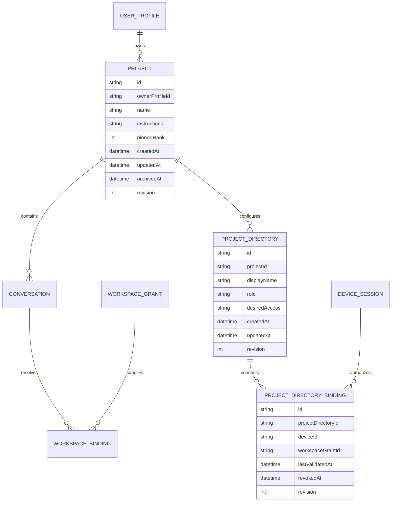

# UWA 2.0 个人项目功能方案

> 状态：`LOCAL IMPLEMENTATION COMPLETE / PRJ-001 TO PRJ-012 PASS / EXTERNAL RELEASE GATES PENDING`
>
> 修订日期：2026-09-04
>
> 适用范围：Windows/macOS 桌面执行主机、账户同步与 iOS/Android Remote Companion

## 1. 决策摘要

UWA V1 增加可选的“个人项目（Project）”能力。项目是一个可复用的个人上下文容器，用于组织对话、项目说明和本机目录；它不是团队空间、代码仓库、任务调度器或新的 Agent Runtime。

冻结以下产品决定：

1. 启动仍直接进入新对话，创建项目不是开始使用 UWA 的前置条件。
2. 项目可以不绑定目录，也可以绑定多个目录。
3. 项目存在目录时必须恰有一个主目录；其余为附加目录。
4. 项目内新对话自动继承项目说明和当前设备可用的项目目录。
5. 对话可额外添加仅对本对话生效的目录，不反向修改项目配置。
6. 项目名称、说明、对话归属和目录的逻辑占位可同步；绝对路径、目录句柄和设备授权只保存在授权设备。
7. 另一设备恢复项目后，未重新连接的目录显示“需要在此设备重新连接”，不得伪造原设备权限。
8. 项目目录继续通过现有 Capability Broker、WorkspaceGrant 和操作系统沙箱执行，不给 Pi、Renderer 或 Remote 新增权限旁路。
9. 项目归档不删除磁盘文件；V1 UI 不提供不可恢复的项目硬删除。
10. V1 只实现个人项目，不实现成员、角色、共享、团队知识、组织策略、项目计费或项目自动化。

## 2. Codex 对标与 UWA 取舍

参考 Codex 官方项目行为：项目可以没有文件夹，可以关联多个文件夹并指定一个主文件夹；新任务默认从主文件夹开始，主文件夹用于 Git 和 `AGENTS.md`、Skill、`config.toml` 等自动发现，附加文件夹可用于搜索、读取和编辑；实际访问仍受沙箱保护。官方说明见 [Codex Projects](https://learn.chatgpt.com/zh-Hans/docs/projects)。

UWA 采用相同的“项目组织层 + 主/附加目录”心智，但做以下 V1 取舍：

| 能力 | UWA V1 决定 |
| --- | --- |
| 项目与对话 | 一个对话最多属于一个项目，也可以不属于项目 |
| 项目与目录 | 零到多个；有目录时恰有一个主目录 |
| 默认工作目录 | 项目的主目录；无可用主目录时使用既有对话默认工作区 |
| 项目说明 | 作为可同步、可编辑的项目级上下文，在每轮生成前解析 |
| 指令自动发现 | 首版沿用当前分层指令解析；主目录参与自动发现，附加目录只提供授权访问 |
| Git/worktree | 不把项目等同仓库；不在本功能中创建 Git worktree 或分支 |
| 目录索引 | 不做全量后台索引或文件监听；继续按需搜索、读取和编辑 |
| 协作 | 仅当前个人账户；不提供成员、角色和共享项目 |

## 3. 用户体验与信息架构

### 3.1 侧栏

左侧栏在“新对话”和“搜索”之后增加可折叠的“项目”区：

- `+ 新建项目`
- 已置顶项目
- 最近项目
- `查看全部项目`

最近对话仍保留，并显示项目归属。用户不需要先进入项目才能新建普通对话。

### 3.2 新建项目

新建流程使用一个轻量对话框：

1. 输入项目名称，必填，1 至 80 个字符。
2. 可选填写项目说明，最多 20,000 个字符；明确提示不要保存密码或 API Key。
3. 可选选择一个目录。第一个目录自动成为主目录。
4. 创建后进入项目首页；用户可以立即开始对话，也可以继续添加目录。

目录选择必须使用 Electron Main 的系统目录选择器。Renderer 只能收到经类型化 Bridge 返回的授权结果，不能自行访问文件系统。

### 3.3 项目首页

项目首页包含：

- 项目名称、说明和同步状态。
- `在此项目中开始对话` 主按钮。
- 对话列表：继续、重命名、移出项目、归档。
- 目录列表：主目录、附加目录、访问范围、当前设备状态、修改主目录、在此设备断开、移出项目。
- 项目设置：重命名、编辑说明、置顶、归档。

项目首页不是 Dashboard，不展示 Agent 队列、运行图、Provider Key 或治理面板。

### 3.4 项目内新对话

从项目首页或侧栏项目上的 `+` 创建对话时：

- `Conversation.projectId` 在创建时写入，不依赖标题推断。
- 项目主目录成为本轮默认工作目录。
- 项目附加目录进入允许读取/写入的附加 Scope。
- 项目说明作为单独的、可审计的上下文层注入。
- 输入框上方显示项目胶囊；上下文抽屉区分“来自项目”和“仅此对话”。

如果当前设备没有可用项目主目录，仍允许纯聊天，但在模型尝试使用目录前必须显示重连提示并 fail closed。

### 3.5 现有对话归入项目

用户可把一个现有对话移入项目或移出项目：

- 移入项目只改变后续轮次的上下文，不重写历史消息和已有成果。
- 如果项目带来新的目录权限，确认页必须列出将继承的目录和访问范围。
- 移出项目会在下一轮移除项目说明与项目继承目录，但保留用户为该对话单独添加的目录。
- 正在执行的轮次不允许改变归属；可在停止/完成后操作。

### 3.6 目录管理

- 第一个目录自动成为主目录。
- 添加第二个及后续目录时默认为附加目录。
- 用户可以把任一可用目录设为主目录，原主目录自动降为附加目录。
- 把主目录移出项目时，如仍有其他目录，必须先选择新的主目录或由用户确认使用推荐项；不得静默选择。
- 移出最后一个目录后，项目退回无目录状态，项目和对话仍可使用。
- “在此设备断开”只撤销本机 Binding/Grant，保留可同步的 ProjectDirectory 占位；“移出项目”写入逻辑目录墓碑，各设备同步后撤销对应本机 Binding/Grant。
- 目录访问范围为 `read_only | read_write`；默认 `read_write`，网络默认关闭。
- 项目级目录授权默认持续到用户撤销、目录失效、设备撤销或安全策略变更。

## 4. 领域模型

### 4.1 Project

| 字段 | 规则 |
| --- | --- |
| `id` | 稳定 UUID，服务端和本地相同 |
| `ownerProfileId` | 当前个人账户；V1 不增加成员表 |
| `name` | 必填，去除首尾空白，1–80 字符 |
| `instructions` | 可选纯文本，最多 20,000 字符，可同步，不应包含秘密 |
| `pinnedRank` | 可空；账户范围的侧栏排序 |
| `createdAt/updatedAt/archivedAt` | 归档可恢复；归档项目不接受新对话 |
| `revision` | 乐观并发与同步冲突检测 |

### 4.2 ProjectDirectory

这是可同步的逻辑目录配置，不包含真实路径或可执行授权。

| 字段 | 规则 |
| --- | --- |
| `id` | 稳定逻辑目录 ID |
| `projectId` | 所属项目 |
| `displayName` | 用户可理解的目录名称，可同步但不得用于授权 |
| `role` | `primary | additional`；项目存在目录时恰有一个 primary |
| `desiredAccess` | `read_only | read_write`，用于另一设备重连时提示期望范围 |
| `createdAt/updatedAt/revision` | 云同步、排序和冲突检测 |

### 4.3 ProjectDirectoryBinding

这是逻辑目录在某台设备上的本地连接，不是云端可直接执行的路径记录。

| 字段 | 规则 |
| --- | --- |
| `id` | 设备内稳定 UUID |
| `projectDirectoryId` | 对应可同步的 ProjectDirectory |
| `deviceId` | 取得授权的 Windows/macOS 设备 |
| `workspaceGrantId` | 指向当前设备既有 WorkspaceGrant；真实路径、access、network 与有效期由 Grant 持有 |
| `lastValidatedAt` | 最近一次 canonicalize 和可用性检查时间 |
| `revokedAt` | 本机连接撤销状态，不删除云端逻辑目录 |
| `revision` | 本地并发控制 |

ProjectDirectoryBinding 整体禁止同步。云端 ProjectDirectory 不包含 `rootPath`、目录句柄、Grant、canonical hash 或可用于恢复权限的令牌。

### 4.4 Conversation

在现有 Conversation 上新增：

- `projectId?: string | null`

不变量：

- 一个对话最多属于一个项目。
- 对话与项目必须属于同一 `ownerProfileId`。
- 项目归档后，历史对话保持可读；继续执行前需要恢复项目或把对话移出项目。
- 删除对话不删除项目；归档项目不删除对话、成果或本地文件。

### 4.5 WorkspaceGrant 与 WorkspaceBinding

现有 `WorkspaceGrant` 和 `workspace_bindings` 继续是执行时安全真值。增加以下来源语义：

- `default`：应用为无显式目录的对话提供的默认工作区。
- `project`：从当前项目目录解析得到。
- `user_added`：用户只为当前对话单独添加。

建议在 `workspace_bindings` 增加：

- `project_directory_binding_id nullable`
- `source_revision nullable`

它们用于幂等重建项目继承关系，不替代 `workspace_grant_id`。

## 5. 每轮上下文解析

发送消息前按固定顺序生成不可变的 Generation Context：

1. 读取 Conversation 与可选 Project 的同一 revision 快照。
2. 解析当前设备可用的项目主目录和附加目录。
3. 将项目目录惰性协调为该对话的 `WorkspaceGrant + WorkspaceBinding(source=project)`。
4. 合并对话级 `source=user_added` 目录；项目主目录优先成为 active execution grant。
5. 无项目主目录时使用仍有效的对话级主目录；两者都不存在时使用既有默认工作区。
6. 按既有层级解析项目说明、主目录指令和对话上下文。
7. 冻结 `activeExecutionGrantId`、`additionalExecutionGrantIds`、访问范围、网络策略和 revision。
8. 交给现有 Pi Host 与 Broker 执行。

当前轮次开始后，即使用户修改项目目录或撤销授权，运行快照也不被中途改写；撤销操作应尽快终止仍能安全取消的相关工具，并保证下一轮不再使用旧授权。若终止结果未知，沿用现有 `outcome_unknown` 恢复合同。

## 6. API、IPC 与命令合同

新增传输无关的业务命令；桌面端通过 Preload Bridge 暴露同名类型化能力：

| 命令 | 作用 |
| --- | --- |
| `project.list` | 列出活跃/归档项目、置顶顺序和当前设备目录状态 |
| `project.get` | 读取项目详情与分页对话 |
| `project.create` | 创建可无目录项目；支持创建后绑定首个目录 |
| `project.update` | 重命名、编辑说明、置顶或取消置顶 |
| `project.archive` / `project.restore` | 可恢复归档与恢复 |
| `project.directory.choose` | Main 打开系统目录选择器并请求授权 |
| `project.directory.list` | 返回脱敏后、当前设备可见的目录状态 |
| `project.directory.update` | 修改访问范围、网络策略或角色 |
| `project.directory.disconnect` | 只撤销当前设备的 Binding/Grant，保留逻辑目录占位 |
| `project.directory.remove` | 墓碑化 ProjectDirectory，并在各设备同步后撤销派生 Binding/Grant |
| `conversation.moveToProject` | 原子修改 `projectId`，支持移出项目 |

关键请求字段：

- 所有写命令必须带 `operationId` 和 `expectedRevision`。
- 创建项目支持 `name`、`instructions?`，但不接受 Renderer 直接提交任意本地路径。
- `project.directory.choose` 创建新逻辑目录时不接受 Renderer 直接提交任意本地路径；重连已有逻辑目录时必须带 `projectDirectoryId`。
- 目录授权结果由 Main/App Service 产生，包含稳定目录 Binding ID，不把原生句柄暴露给 Renderer。
- `chat.create` 和 `chat.send` 接受可选 `projectId`；发送时服务端/App Service 必须再次校验 Conversation 的真实归属，不能信任客户端覆盖。

错误码至少包括：

- `PROJECT_NOT_FOUND`
- `PROJECT_ARCHIVED`
- `PROJECT_REVISION_CONFLICT`
- `PROJECT_DIRECTORY_RECONNECT_REQUIRED`
- `PROJECT_PRIMARY_DIRECTORY_REQUIRED`
- `PROJECT_DIRECTORY_UNAVAILABLE`
- `PROJECT_MOVE_BLOCKED_BY_ACTIVE_RUN`
- `PROJECT_SCOPE_MISMATCH`

## 7. 存储、同步与迁移

### 7.1 本地数据库迁移

在当前 v30 之后新增 v31：

1. 新建 `projects` 表。
2. 新建可同步的 `project_directories` 表，约束每个非空项目恰有一个 `primary` 逻辑目录。
3. 新建设备级 `project_directory_bindings` 表，以 `project_directory_id + device_id` 关联既有 `workspace_grant_id`。
4. 为 `conversations` 增加 nullable `project_id` 与索引。
5. 为 `workspace_bindings` 增加 nullable `project_directory_binding_id`、`source_revision`。
6. Repository 事务负责主目录切换、Binding/Grant 协调和跨 SQLite 版本的一致性。

迁移必须是加法式的。现有对话 `project_id = null`，启动和历史行为不变。

当前版本在真实 Project 对象出现前曾把手动对话目录标为 `source=project`。v31 必须把这些旧记录迁移为 `source=user_added`；只有带 `project_directory_binding_id` 的新记录才可使用 `source=project`。

### 7.2 同步白名单

同步：

- Project 元数据、说明、置顶/归档状态和 revision。
- Conversation 的 `projectId`。
- 项目目录逻辑占位、显示名、主/附加角色和期望访问范围。

不同步：

- ProjectDirectoryBinding 整体，以及 `rootPath`、canonical path/hash、目录句柄。
- WorkspaceGrant、ToolGrant、操作系统权限。
- 项目目录内容、Git 状态、后台索引或文件监听结果。

另一设备同步到 ProjectDirectory 后，以 `reconnect_required` 展示。用户选择本机目录后才创建新的设备级 Binding 和 Grant。

### 7.3 冲突规则

- 项目名称、说明和排序使用 revision 冲突；不能静默最后写入覆盖。
- Conversation 归属冲突保留两端操作并要求用户选择最终项目。
- 同一设备的主目录切换在单个 Repository 事务中完成。
- 不同设备可各自绑定不同本地路径，但逻辑目录角色保持一致。

## 8. 安全与 Remote 边界

- 项目不是授权主体。实际读写始终要求当前设备有效的 WorkspaceGrant。
- Renderer 不能提交、拼接或校验绝对路径；Main/App Service 必须 canonicalize 并检查真实目录。
- 项目说明按用户内容处理，进入同步前经过现有秘密检测与大小限制；它不能提升工具权限。
- 项目目录不能扩大 Browser、Desktop、MCP 或网络权限；这些能力继续独立授权。
- 项目切换或对话移动不得使正在运行的任务跳到另一目录。
- 手机 Remote 可以选择项目、开始项目对话和查看目录状态，但不能浏览主机目录、重新连接目录、改变读写范围或建立新 Grant。
- 主机离线或目录不可用时，Remote 只允许查看已同步内容，不得将目录操作排队等待未来执行。

## 9. 实施切片

建议按下列顺序交付，避免先做页面、后补安全语义：

| 顺序 | ID | 工作项 | 主要产物 | 退出条件 |
| --- | --- | --- | --- | --- |
| 1 | PRJ-001 ✅ | 合同与类型 | Project、ProjectDirectory、Directory Binding、命令和错误 Schema | 本地通过；见 [PRJ-001/002 证据](evidence/prj-001-002-2026-09-04.md) |
| 2 | PRJ-002 ✅ | SQLite v31 | 表、索引、旧 source 迁移、Repository | 本地通过；见 [PRJ-001/002 证据](evidence/prj-001-002-2026-09-04.md) |
| 3 | PRJ-003 ✅ | Project App Service | CRUD、归档、排序、对话移动、revision | 本地通过；见 [PRJ-003 证据](evidence/prj-003-2026-09-04.md) |
| 4 | PRJ-004 ✅ | 目录授权 | 系统选择器、主/附加角色、撤销与重连 | 本地通过；见 [PRJ-004 证据](evidence/prj-004-2026-09-04.md) |
| 5 | PRJ-005 ✅ | Generation 继承 | 项目 Binding 到现有 Grant 的惰性协调 | 本地通过；见 [PRJ-005 证据](evidence/prj-005-2026-09-04.md) |
| 6 | PRJ-006 ✅ | Main/Preload | 最小类型化 Bridge 与 sender 校验 | 本地通过；见 [PRJ-006 证据](evidence/prj-006-2026-09-04.md) |
| 7 | PRJ-007 ✅ | 桌面 UI | 拆分 ProjectSidebar、ProjectHome、ProjectSettings | 本地通过；见 [PRJ-007 证据](evidence/prj-007-2026-09-04.md) |
| 8 | PRJ-008 ✅ | 对话上下文 UI | 项目胶囊、来源标识、移动与权限差异确认 | 本地通过；见 [PRJ-008 证据](evidence/prj-008-2026-09-04.md) |
| 9 | PRJ-009 ✅ | 云同步 | 白名单、墓碑、冲突和跨设备目录占位 | 本地双副本通过；见 [PRJ-009 证据](evidence/prj-009-2026-09-04.md) |
| 10 | PRJ-010 ✅ | Remote | 项目选择与只读目录状态 | 本地通过；见 [PRJ-010 证据](evidence/prj-010-2026-09-04.md) |
| 11 | PRJ-011 ✅ | 质量与恢复 | 单元、契约、Electron E2E、崩溃恢复 | 本地通过；见 [PRJ-011 证据](evidence/prj-011-2026-09-04.md) |
| 12 | PRJ-012 ✅ | 证据与发布 | 日期化证据、机器门禁、更新说明 | 本地通过；见 [PRJ-012 证据](evidence/prj-012-2026-09-04.md) |

建议由 1 名工程师顺序完成需要 6–8 个工程日；Renderer 拆分与同步可在 PRJ-004 之后并行。该估算不包含真实双设备、签名安装包和 Remote 真机发布证据时间。

当前检查点：PRJ-001 至 PRJ-012 已完成本地实现、专项测试、Electron E2E、日期化证据和机器发布门禁；项目已加入 Personal Beta、M9 Release Gate 和更新说明。手机协议没有目录路径、重连或授权写接口。`releaseClaim` 与 `publishAllowed` 仍为 `false`，真实双设备、Remote 真机、签名安装包跨平台矩阵和明确发布批准未完成前，不得宣称 stable 发布。

## 10. 验收门禁

### 10.1 产品门禁

- 用户不创建项目也能完成原有新对话流程。
- 可创建无目录项目，并在项目中完成纯聊天。
- 可绑定两个目录、切换主目录，并在一次任务中读取两个授权范围。
- 普通新对话不继承任何项目目录。
- 对话移入/移出项目只影响后续轮次，历史消息和成果不丢失。
- 归档项目后历史可读；恢复后可继续。

### 10.2 权限门禁

- 未授权路径、路径穿越、符号链接逃逸和失效目录全部 fail closed。
- 项目附加目录不能成为未声明的 Shell cwd。
- 撤销目录后下一轮无法访问；正在运行轮次遵循冻结/取消合同。
- `read_only` 项目目录不能被 Patch、Shell 或其他工具写入。
- 项目切换不能继承 Browser、Desktop、MCP、网络或其他对话的 Grant。

### 10.3 同步与恢复门禁

- 项目元数据和对话归属可在 Windows/macOS 间恢复。
- 数据库、同步 payload、日志、诊断包和 Remote 事件中不存在另一设备的绝对路径。
- 新设备显示目录重连状态，未重连时不能执行目录工具。
- 两设备同时改名、移动对话和切换主目录具有明确冲突结果。
- App Service 在项目创建、目录授权或对话移动中间崩溃后，事务可重放且不产生双主目录。

### 10.4 工程门禁

- contracts、storage、app-service、main、preload、renderer、sync 和 remote 专项测试通过。
- lint、typecheck、test、build 与 Electron E2E 通过。
- `App.tsx` 不继续承载完整项目功能；新增 UI 使用独立组件和 hooks。
- 新 API 无原始 IPC、任意路径、账户越权或 Pi 私有 Session 泄漏。

## 11. 明确不在本切片

- Git 仓库管理、worktree、分支创建、提交或 PR 工作流。
- 团队项目、成员、角色、邀请、共享对话和协作评论。
- 项目级模型预算、计费、订阅或管理员策略。
- 项目自动化、定时任务、无人值守运行和远程唤醒。
- 项目目录全文索引、持续文件监听或云端镜像。
- 跨设备自动路径映射、网络盘自动重连或目录内容同步。

以上能力需要独立产品合同，不得借“项目”入口提前扩展权限或运行时范围。
