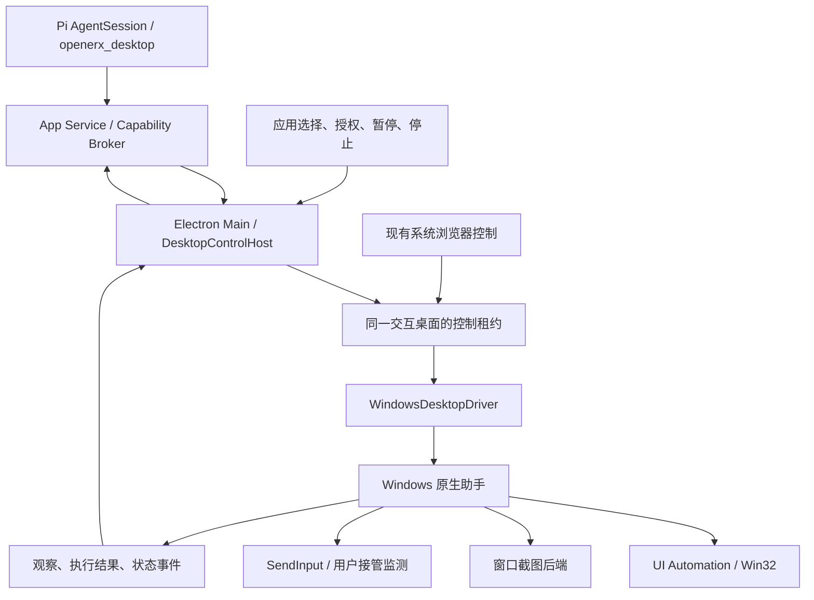

# Windows 桌面控制实施方案（参考 Codex）

最新进展（2026-09-08）：本机开发构建已通过真实记事本/计算器自动来回切换和最小化恢复，无需人工逐窗口切前台；接管误报已修复。见 [WDC-004 最终验收](evidence/wdc-004-automatic-foreground-passed-2026-09-08.md)。测试时 SAC 由用户关闭，完整发布验收仍待完成。以下状态与说明保留此前各阶段的设计和历史。

状态：`FOUNDATION IMPLEMENTED / RELEASE BLOCKED`
日期：2026-09-05
范围：当前 UWA / OpenERX V2 主线。下文保留设计基线；2026-09-05 已实现首个 Windows x64 版本。2026-09-16 起当前源码在普通启动时默认检测并启用原生桌面助手，无需设置开发环境变量；`OPENERX_WINDOWS_DESKTOP_CONTROL=0` 或 `false` 可显式关闭。助手完整性、交互会话和操作授权检查仍然生效。首次实现及历史验收限制见 [实现记录](evidence/wdc-001-windows-desktop-control-2026-09-05.md)，不得将后续计划视为已交付能力；既有安装包需要更新才会采用新的默认行为。

2026-09-08 更新：原辅助程序现已能正常运行，人工辅助前台模式下的真实记事本输入保存、计算器 `1+2=3` 已分别验证。自动前台切换及完整发布验收仍未完成，见 [最新重试记录](evidence/wdc-002-windows-desktop-retry-2026-09-08.md)。

同日后续：已实现自动激活、UIA 焦点回退、最小化恢复及切前台期间的接管监控；最终新构建再次被本机应用控制阻止，真实自动切换验收未通过，见 [自动前台实现记录](evidence/wdc-003-automatic-foreground-2026-09-08.md)。

建议在现有 `openerx_desktop → Capability Broker → Electron Main` 链路中增加独立 Windows 原生助手，以 UI Automation 语义操作为主、窗口截图验证和原生输入为补充。Pi 继续负责 Agent Loop。首版采用前台控制，完成选择应用、观察、操作、验证、用户接管和停止的完整闭环。

## 1. 当前代码基础与实际缺口

| 位置 | 已有基础 / 缺口 | 本次实施方向 |
| --- | --- | --- |
| `apps/desktop/src/main/desktop-tool-availability.ts` | `win32` 始终返回不可用 | 改为助手、交互桌面、截图和输入能力的真实探测 |
| `apps/desktop/src/main/tool-capability-host.ts` | 桌面 Windows 交互分支直接抛错；入口检查取消，但 `#desktop` 未接收 signal | 抽出平台 Driver；取消贯穿原生执行 |
| `packages/pi-host/src/capability-tools.ts` | 已有工具，仅支持截图、点击、输入、单键及业务动作；身份依赖 `bundleId` | 增加应用发现、会话、观察、滚动、组合键等跨平台合同 |
| `packages/contracts/src/tool.ts` | 现有 Desktop 操作 Schema 以 macOS 参数为中心 | 引入版本化 Desktop 请求，保留旧 macOS 兼容 |
| `apps/desktop/src/main/desktop-capture-registry.ts` | 已有 captureId、60 秒 TTL、应用绑定、图片坐标检查 | 增加会话归属、窗口身份、DPI、几何变化和观察版本 |
| `packages/tool-sdk/src/policy.ts`、`broker.ts` | 已有应用 Scope、审批、副作用去重和结果不确定状态 | 复用这些机制；适配新操作和应用身份 |
| `apps/desktop/src/main/browser-computer-use/electron-windows-system-browser-driver.ts` | 已有 Windows 浏览器驱动 | 提取可复用原生能力，浏览器继续保留自身策略 |
| `apps/desktop/native/windows-browser-accessibility.ps1` | 已有 UIA、精确窗口截图、原生输入和用户输入监测 | 复用实现经验及测试夹具，逐步迁移为通用助手 |
| `packages/app-service/src/tool-app-service.ts`、`apps/desktop/src/renderer/App.tsx` | 已有工具可用性投影和 Windows 未实现提示 | 补应用选择、控制状态、权限管理和故障原因 |

仓库的 [Windows 浏览器验收记录](evidence/bcu-003-windows-system-browser-2026-08-29.md)记载了本机 Edge/Chrome 真实验证，但尚未覆盖多屏/DPI等完整矩阵；它不能作为任意桌面应用已可控的证据。旧桌面 PowerShell 模拟控制曾因应用身份约束不足被移除，见 [CX110 记录](evidence/p1-codex-alignment-cx110-desktop-signed-lifecycle-2026-08-27.md)。

另有一处文案漂移：Pi 工具描述仍写“每次交互审批”，而当前 `policy.ts` 与安全合同已经支持普通交互按应用/对话 Scope 复用。实施时同步工具描述、Schema、策略和 UI。

## 2. Codex 参考边界

Codex 当前官方资料确认：Windows 计算机使用在活动桌面前台执行，需要保持目标应用可见、设备解锁；支持应用权限管理和持久允许列表。桌面和浏览器有不同入口，结构化工具不足时才使用桌面操作。[官方说明](https://learn.chatgpt.com/zh-Hans/docs/computer-use)、[Windows 使用方式](https://learn.chatgpt.com/zh-Hans/use-cases/use-your-computer-with-codex)。

本方案参考这些产品行为。以下 UIA、C#、IPC、租约和截图选型是针对本仓库的工程建议；官方资料未据此公开 Codex 内部实现，也不能据此假定有可直接嵌入的 Codex Windows 控制 SDK。

首版面向 Windows 10/11 x64 的普通桌面应用。Windows 11 x64 先完成开发验证，Windows 10 支持须有对应真实验收；ARM64 独立安排。单台主机的同一交互桌面同时只由一个任务控制。锁屏、UAC 安全桌面、管理员应用及断开的交互会话明确返回不可用或用户接管；无人值守登录和后台独立桌面留作后续能力。

## 3. 架构与选型



**原生助手建议使用 C# + .NET，按架构自包含发布，随 Electron 安装包交付。** 延续现有 PowerShell 内嵌 C# / UIA 的知识基础，同时把生命周期、协议、超时和版本管理放到一个可测试组件中。首轮验证锁定 .NET 工具链、Windows 最低构建号和 UIA/截图互操作依赖；暂不把 NativeAOT 作为上线前提。

助手是 Electron Main 启动的普通用户子进程，通过私有 stdio 上的版本化 JSON-RPC 通信；stdout 只放协议，stderr 放经过清理的诊断。Main 管理请求 ID、大小限制、超时、取消、协议握手、父进程退出及重启。助手路径来自安装资源目录并受发布完整性校验约束；不从工作目录或 PATH 随意寻找可执行文件。

UIA 使用独立 MTA 工作线程，输入监测使用单独事件线程；可能挂起的 UIA/截图工作应可通过隔离 worker 回收，避免阻塞主程序和停止通道。微软明确建议桌面 UIA 客户端在独立 MTA 线程上执行自动化调用。[Microsoft UIA 线程说明](https://learn.microsoft.com/en-us/windows/win32/winauto/uiauto-threading)。

现有浏览器保持独立 Adapter。初期只共享控制租约与经过验证的原生基础，通用 Desktop 跑通后再迁移浏览器调用至助手，并完整回归现有 BCU 用例。浏览器的 Document、URL、WebArea、签名白名单和专属窗口关闭规则不直接套用到普通应用。

第一版直接复用现有内置工具与 Broker；将来如果需要向其他客户端开放，再增加同一 Driver 的 MCP 外壳。

## 4. 原生能力实现

| 能力 | 建议实现 | 关键约束 |
| --- | --- | --- |
| 应用发现/启动 | 顶层窗口枚举、可执行文件身份、打包应用 AUMID | 可读名称只用于选择；启动只接受宿主解析出的应用，不执行模型提供的 Shell |
| 窗口绑定 | HWND + PID + 进程创建时间 + 规范化路径；打包应用另绑定包身份 | 防进程/句柄复用；窗口标题只作展示，不作身份依据 |
| 控件观察 | UIA Control View；role/name/state/bounds/patterns | 限定窗口根、节点数量/深度/时限；节点引用与本次 observation 绑定 |
| 语义操作 | Invoke、Value、Selection、ExpandCollapse、Scroll 等 Pattern | 每次复核引用、可见性、可用性和所属窗口；失败后重新观察 |
| 文字输入 | 区分 `set_value` 替换全文与 `type_text` 在光标处输入；后者按能力选文本接口或 Unicode SendInput | 不能把 SetValue 当作追加输入；验证中文、换行、emoji；默认不借用剪贴板 |
| 键鼠动作 | SendInput 支持点击/双击/右键、组合键、滚动、拖动 | 每段输入前检查前台窗口与命中目标；检查返回数量并释放已注入的按键 |
| 窗口截图 | 抽象 `WindowCaptureBackend`，按精确 HWND 获取图片 | 截图须带窗口身份、原点、大小、DPI和时间；失败不能静默退为整屏抓取 |
| 人工接管 | 输入 Hook、前台/会话变化事件 | 租约期间真实键鼠操作触发暂停；自有注入事件使用标记排除 |

截图分两条经过能力探测的路径：已有验证覆盖的应用先使用带超时的 `PrintWindow`；GPU/自绘窗口验证 Windows Graphics Capture。仓库已有 Chrome 首帧超时记录，不能把 WGC 当作无需验证的默认答案。`CreateForWindow` 要求 Windows 10 1903 起，因此更早 Windows 10 构建若仍在产品支持范围，必须保留已验证替代路径，或单独提出最低版本调整。[Microsoft 截图接口要求](https://learn.microsoft.com/en-us/windows/win32/api/windows.graphics.capture.interop/nf-windows-graphics-capture-interop-igraphicscaptureiteminterop-createforwindow)。

助手统一使用明确的物理像素坐标与 Per-Monitor DPI 感知。图片缩放比例、窗口矩形、显示器布局变化均使旧坐标失效；多屏负坐标不得截成零。前台激活可能被 Windows 拒绝，应转入“请切换到目标窗口”，不能假定 `SetForegroundWindow` 一定成功。[Microsoft 前台窗口限制](https://learn.microsoft.com/en-us/windows/win32/api/winuser/nf-winuser-setforegroundwindow)。

普通权限助手不能通过 SendInput 操作更高完整性级别的应用。对此在执行前探测，并显示需要用户处理；不默认提升整个 Electron 进程。[Microsoft SendInput / UIPI 说明](https://learn.microsoft.com/en-us/windows/win32/api/winuser/nf-winuser-sendinput)。

## 5. 工具与观察合同

保留模型侧工具名 `openerx_desktop`，新增 `desktop_control_v2` 请求合同；旧 Desktop 操作通过兼容适配器继续服务 macOS。V2 使用宿主签发的 `appRef / sessionId / observationId / elementRef`，不要求模型生成 HWND、路径或 bundleId。操作采用 discriminated union，各动作只接收必要参数。

建议动作：

- `list_apps` / `list_windows`：返回最少应用元数据和不透明引用；详细窗口信息在授权后读取。
- `open_app` / `attach`：打开选定应用或绑定已有窗口；在批准后创建会话。
- `observe`：返回一组关联的 UIA 元素和窗口截图。
- `invoke` / `set_value` / `type_text` / `key` / `scroll` / `click` / `drag`：执行单次、范围受限的动作。
- `detach`：释放控制，不默认关闭用户的应用。

`pause / resume / stop` 为宿主用户控制接口；模型不能自行恢复用户暂停的任务。仅宿主创建的窗口才能进入显式关闭流程。

观察记录由 Main/助手保管，至少绑定：

```text
host + conversation + generation + session + leaseEpoch
appIdentity + processStartTime + pid + hwnd + windowGeneration
observationId + observedAt + imageSize + pixelTransform + windowBounds
layoutRevision + elementRefs + inputState
```

上述执行归属来自可信宿主上下文，不能信任模型填入的 conversation/run ID。图片和 UIA 是关联观察，不宣称原子快照：观察前后检查窗口/布局变化，变化时重取。

一次操作流程：验证授权和租约 → 验证观察及目标 → 验证前台/命中位置 → 执行动作 → 等待有限时间的状态变化 → 返回新观察。保留 TTL，同时让窗口移动、缩放、换屏、导航/布局变化、人工接管、授权撤销主动使旧引用失效。

先用结构化集成或文件工具完成其擅长的工作；Desktop 的 UIA 负责控件定位，截图负责视觉验证和自绘控件定位。只有当前选用模型支持图像输入时才开放视觉坐标兜底；否则提供语义控制能力及明确降级状态。沿用现有 Pi/模型适配，不另建 Agent Loop，也不强制更换为某个 OpenAI 模型。

## 6. 权限、并发与结果确认

普通模式沿用现有应用 Scope：首次确认可包含读取及普通交互，后续同一对话范围内复用；发送、提交、删除、购买依照现有策略审批。已有 `full_access` 的审批语义保持一致并单独回归；身份、会话、锁屏和用户接管检查不因它而跳过。持久允许作为桌面端可撤销选项，与当前对话授权分别显示。

持久授权以已解析的应用身份保存，经典应用不能只凭 `notepad.exe` 这样的文件名匹配；结合规范化安装路径和可用的发布者信息。打包应用使用包身份/AUMID并复核实际执行窗口，兼容承载进程和应用更新。旧 `bundleId` 仅迁移为 macOS 身份，不复用于 Windows。

所有系统浏览器和桌面原生输入共用 Main 的 `DesktopControlLease`，以 host/交互会话/conversation/generation 绑定。每次切换控制面释放或转移租约，并要求重新观察。其他任务显示“正在等待桌面控制”，不能并发抢鼠标。

租约期间用户的真实键鼠输入立即暂停，即使输入发生在另一应用；这需要扩展当前浏览器仅关注绑定窗口的监测方式。暂停/停止清空待执行动作并使观察失效；只释放助手自己按下的键，恢复必须由用户发起并重新观察。监测丢失也暂停。

敏感字段优先通过 UIA 属性识别并对图片作像素遮罩；无法识别的自绘内容不能承诺全部自动脱敏，按应用能力限制或交给用户。登录、密码、2FA和系统权限对话框进入接管。桌面文本、图片及可访问性名称都是待处理数据，不能作为扩大权限的指令。

不能仅靠模型声明 `click` 或 `submit` 判断真实业务影响：Enter、按钮 Invoke 和坐标点击都可能提交。结合观察内容、目标控件语义和任务上下文判断，无法可靠判断的潜在提交边界交用户确认；原生 OS API 无法保证理解任意应用的业务含义。

继续使用 Broker 的副作用账本。助手报告“未派发 / 已派发 / 已验证 / 结果不确定”；已经派发但超时或取消的发送/购买不能盲目重试，应先重新观察并核对结果。截图、控件变化或文件落盘等外部证据用于确认成功，不能把 `SendInput` 返回成功视作任务完成。

## 7. 用户界面与生命周期

用户输入“用记事本整理这段内容”后：识别/选择应用 → 首次显示应用授权卡 → 显示“正在控制记事本” → 边操作边更新窗口预览 → 展示结果。切换到另一个未授权应用时再确认应用范围，不对每次普通点击重复弹窗。

状态至少包括：未启用、助手不可用、等待应用授权、等待控制权、控制中、用户已接管、等待解锁、目标权限不足、已停止、结果待核实。控制条包含当前任务、目标应用、暂停和停止，并提供经冲突检测的全局停止快捷键。

取消链路必须贯穿：聊天 Stop / Remote Stop → Broker → MainCapabilityClient → Main → Driver → 助手/worker → 释放自有输入与控制租约。UIA 挂起时助手能隔离/回收 worker；Main 退出时通过进程生命周期机制回收子进程。取消只能停止后续动作，不能撤回已提交到外部应用的副作用。

Remote 复用现有端到端加密控制链路和桌面最终授权，主机必须仍有有效交互会话。桌面解锁、系统权限处理和持久应用授权继续在本机完成。

## 8. 建议代码落点

新增文件建议：

```text
packages/contracts/src/desktop-control.ts
apps/desktop/src/main/desktop-control/host.ts
apps/desktop/src/main/desktop-control/driver.ts
apps/desktop/src/main/desktop-control/windows-driver.ts
apps/desktop/src/main/desktop-control/observation-registry.ts
apps/desktop/src/main/desktop-control/control-lease.ts
apps/desktop/native/windows-desktop-helper/
apps/desktop/scripts/build-windows-desktop-helper.mjs
apps/desktop/scripts/e2e-windows-desktop-control.mts
```

同步修改现有 `tool.ts`、Pi 工具定义、`policy.ts`、Main 能力 Host、主进程通信合同、可用性探测、Renderer/Preload、相关 Scope 存储及 Forge 打包配置。`desktop.ts` 现有原生权限字段偏向 macOS，应通过新增 Windows 应用授权/运行状态合同表达 Windows 能力，避免伪造一套 macOS 系统权限提示。

## 9. 分阶段交付与验收

| 阶段 | 交付 | 退出条件 | 估算人日 |
| --- | --- | --- | --- |
| WDC-001 | 合同、平台 Driver、助手协议/生命周期、租约骨架、feature flag | macOS 原合同回归；Windows 默认仍关闭，探测故障可解释 | 3–4 |
| WDC-002 | 应用身份、窗口绑定、UIA观察、截图、DPI映射 | 记事本/计算器可被唯一选中并观察；同名窗口和旧观察不误用 | 4–6 |
| WDC-003 | 输入/语义动作、接管、取消、共享租约、动作后验证 | 记事本中文编辑并保存到已授权临时目录、计算器运算通过；停止及抢焦点测试通过 | 5–7 |
| WDC-004 | 权限与控制 UI、持久授权、Remote状态、跨应用及模态窗口 | 本地应用流程连贯；Office/WPS/文件对话框按实际支持能力验收 | 5–7 |
| WDC-005 | Windows 10/11、DPI/多屏、安装包、升级与回滚 | 发布矩阵和真实模型任务有证据，关闭 feature flag 后停止控制并释放资源 | 4–6 |

合计约 **21–30 人日**；这是方案估算。熟悉仓库的 TypeScript/Electron 与 Windows 工程师各一名配合，考虑串行依赖和测试，按 **3–5 周**安排更合理。前 3 阶段构成最小闭环，不能只完成可用性开关或工具 mock 就宣布支持 Windows。

验收至少覆盖：

- **真实任务**：记事本打开/绑定、中文与 emoji、多次编辑、另存新文件；计算器结果；文件选择/保存弹窗；一项 Office 或 WPS 任务；浏览器与桌面切换。只使用专门测试数据，结果通过控件值、截图和落盘内容交叉检查。
- **身份与布局**：同名应用、两个同名窗口、程序重启、旧 PID/HWND、模态窗口、最小化、遮挡、100/125/150/200% 缩放、混合 DPI 双屏、负坐标和窗口跨屏。
- **生命周期**：人工抢焦点、真实输入暂停、助手自身输入不误暂停、取消中的拖动/组合键、UIA挂起、截图黑帧/超时、助手崩溃、应用退出、锁屏和远程会话变化。
- **授权与副作用**：跨对话引用拒绝、应用授权撤销、持久授权重启保留、未知应用身份拒绝、潜在提交确认、完整权限模式回归、超时发送不重试、截图敏感区域处理。
- **并发与回归**：两个任务抢同一桌面、Browser/Desktop共用租约、macOS原用例、Windows Edge/Chrome现有 BCU用例。
- **发布**：真实安装包内助手存在且完整性验证成功，Windows版本/架构探测正确，干净用户环境启动、升级协议兼容和回滚均有证据。

建议性能验收目标（需在 WDC-002 实测校准）：常见窗口暖态观察 p95 ≤ 2 秒；正常输入路径本机 Stop 后 ≤ 500 ms 停止继续派发；挂起工作进程在 watchdog 时限内回收。系统已接收的原子输入或外部应用已生效的动作不在撤回保证内。

本轮仅做了代码与公开资料核对，未运行桌面控制、自动化测试或发布操作。实施应从 WDC-001 与记事本/计算器的可观察闭环开始。
