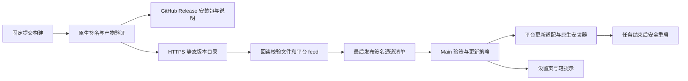

# 开源桌面版自动更新方案

日期：2026-09-08。状态：提案，尚未实施。

建议沿用现有 **Electron Forge + Electron Main 更新服务 + 签名清单 + 平台原生更新器**，补齐静态更新源、发布流水线、下载策略和安全重启。GitHub Releases 保存公开安装包与版本说明，HTTPS 静态存储提供固定版本的更新文件及通道入口。首个交付目标是 Windows x64 官方直装版从旧版本完整升级到新版本，再覆盖 macOS arm64/x64。

2026-09-08 补充：根据“参考 Codex 做少量更新”的需求，将减少下载量纳入方案。推荐 **先做 Windows 安装包差分下载，再实现 Pi Runtime 独立更新**；完整安装包始终作为首次安装和差分失败的兜底。详见第 8 节，目前仍是方案调整。

本方案把“开源桌面版”理解为项目维护者发布的官方独立安装包。源码开发运行、第三方自行构建和 Microsoft Store 安装分别处理；自动更新不依赖登录、订阅或平台计费服务。

## 1. 项目现状与需要补齐的部分

以下是对当前工作区的只读检查结果，包含已有未提交修改，不代表已发布版本的行为。

| 位置 | 已有能力 | 本次需要补齐 |
| --- | --- | --- |
| `apps/desktop/package.json`、`forge.config.ts` | Electron 44.0.0、Forge 7.11.2；Windows Squirrel、macOS DMG/ZIP | 保持当前打包栈；补最终安装器和更新器签名检查、平台 feed |
| `apps/desktop/src/main/update-service.ts` | 获取并验证 Ed25519 清单、版本/通道/架构/灰度筛选，调用原生更新器 | 超时、周期调度、候选状态持久化、并发约束、撤回与实际更新包校验边界 |
| `apps/desktop/src/main/index.ts` | 正式包启动时检查一次；Store 禁用自有更新器 | 延迟检查、恢复后检查，以及与托盘、后台任务统一的安装退出流程 |
| `apps/desktop/src/preload/index.ts`、Renderer `App.tsx` | 更新状态订阅、设置页“检查更新”“安装并重启” | 全局轻提示、更新说明、下载设置、Store/开发包的准确文案 |
| `packages/release`、`packages/contracts/src/release.ts` | 签名清单、SemVer 比较、灰度分桶、类型化桥接 | 兼容版本与强制提示语义拆分；明确暂停/撤回优先级；更新包 inventory |
| `.github/workflows/v2-release.yml` | 三个平台候选构建和验证，Actions artifact 保存 14 天 | 公开版本发布、长期托管、feed/清单生成、通道提升及撤回 |

已有 [ADR-016](adr/016-signed-release-and-update.md) 和 [发布手册](release/01-release-runbook.md) 可以复用，但候选包构建成功不等于线上自动更新已经可用。

三个需要在实施前明确的现状问题：

1. Windows MakerSquirrel 没有显式接入现有 packager 的签名参数；现有签名检查主要查主程序和 helper，不能据此认定最终 `Setup.exe`、Squirrel `Update.exe` 已正确签名。
2. 当前服务验签之后主要把 `artifact.feedUrl` 交给原生更新器，清单里的 `downloadUrl/sha256/sizeBytes` 没有在客户端用于验证实际下载字节；示例中 Windows 记录的还是首装 EXE，而实际自动更新使用 NUPKG。
3. 当前 `minimumVersion` 分支会绕过灰度比例，低于它的客户端即使遇到 `rolloutPercentage=0` 仍可能更新。因此现有“设为 0 即停止更新”的手册规则需要同步修正。

## 2. 分发范围与技术选择

| 安装来源 | 更新方式 |
| --- | --- |
| 官方 Windows x64 EXE 直装版 | Squirrel；首装提供 Setup.exe，自动更新提供 RELEASES + full.nupkg |
| 官方 macOS arm64/x64 直装版 | 首装提供 DMG；自动更新提供对应架构 ZIP 和 Squirrel.Mac feed |
| Microsoft Store MSIX | 交由 Store 管理；设置页显示“由 Microsoft Store 管理更新”，提供商店入口 |
| 开发运行、普通自编译包 | 默认关闭官方自动更新，显示构建版本和项目发布页 |
| Fork 的独立发行版 | 构建时配置自己的产品身份、更新源、公钥和签名身份；不自动覆盖为官方包 |

首个阶段覆盖整个桌面应用升级及其差分下载。后续 Pi Runtime 独立更新继续遵循 [已有专项方案](25-pi-runtime-remote-update-plan.md)，与本方案协同推进，不混用清单、版本或激活流程。当前没有 Linux 打包链路，本期不扩展平台范围。

| 可选路线 | 评价 | 决定 |
| --- | --- | --- |
| `update-electron-app` + `update.electronjs.org` | 对公开 GitHub 项目接入简单；公共服务按自身规则选择正式 Release，不能直接替代当前签名清单和通道控制 | 适合简化发行版，当前主线不直接接入第二套调度器 |
| 现有更新服务 + 静态 HTTPS feed | 复用最多；支持版本固定、preview/stable 分离和本地灰度判断，不需要新增业务服务 | **推荐** |
| 切换 electron-builder / electron-updater | 会同时影响安装器、构建、旧版迁移和签名验证 | 本次不迁移 |

公共更新服务对 GitHub Release 状态的筛选及基本接入条件见 [update-electron-app 官方说明](https://github.com/electron/update-electron-app)。静态更新源是 [Forge 官方支持的路线](https://www.electronforge.io/advanced/auto-update)。

## 3. 发布与更新架构



建议使用一个项目控制的更新域名，底层选择现有对象存储/CDN。域名和存储产品尚未确定，以下只表示路径结构：

```text
channels/stable/manifest.json
channels/preview/manifest.json
releases/<version>/win32/x64/RELEASES
releases/<version>/win32/x64/UWA-<version>-full.nupkg
releases/<version>/win32/x64/UWASetup-<version>.exe
releases/<version>/darwin/arm64/RELEASES.json
releases/<version>/darwin/arm64/UWA-<version>-arm64.zip
releases/<version>/darwin/x64/RELEASES.json
releases/<version>/darwin/x64/UWA-<version>-x64.zip
```

- 版本目录发布后禁止覆盖，保留旧包；仅通道入口可更新，使用原子替换和短缓存。每次通道修订另存不可变副本。
- 每个版本的 feed 只指向该版本、该平台和该架构，不把可变的 `latest` feed 交给原生更新器。
- Windows inventory 同时记录 RELEASES、完整 NUPKG 和首装 EXE 的事实；自动更新包与人工下载包分开建模。引导版先验证完整包链路，随后在 Windows 阶段加入 `*-delta.nupkg`，差分失败仍可使用同一目标版本的完整包。
- macOS 采用静态 `RELEASES.json` 时，为原生适配增加 `serverType: "json"`；两种架构分别生成、验证 feed。ZIP 更新与 DMG 首装分别验收。参考 [Forge ZIP maker](https://www.electronforge.io/config/makers/zip) 和 [Squirrel.Mac feed 格式](https://github.com/Squirrel/Squirrel.Mac#update-file-json-format)。
- 更新不需要客户端 GitHub Token；不把账户 Token 附到更新请求。镜像必须分发相同发布字节，不改变签名校验规则。

### 信任与校验边界

继续保留 HTTPS、Ed25519 清单验签、精确产品/通道/平台/架构/版本选择。官方 Windows 直装包具备原生签名；macOS 使用 Developer ID 签名、公证，最终产物通过验证。清单私钥与平台签名凭据只进入受保护的发布环境。

必须区分三件事：**清单验签、CI 回读文件哈希、客户端安装前验证同一份包字节**。前两项不能替代第三项，也不能笼统假设 Windows 和 macOS 原生更新器有相同的签名验证行为。

实施第一阶段用固定的 Electron/Forge 版本验证平台实际行为：篡改 feed、替换 NUPKG/ZIP、返回同签名身份的其他版本，均应在应用接受候选前被拒绝。若原生链路不能保证已签清单与安装字节绑定，则在 Main 增加受控 staging：下载到非活动目录、验证 inventory 的 SHA-256/大小，再通过经过验证的平台适配把**同一份字节**交给原生安装器。不能“先下载校验，再让原生更新器从远端重新下载”。不自研应用文件替换器，也不通过更新修改正在运行的 ASAR。

staging 的本地 feed 形式、权限、生命周期和 macOS ATS 兼容性需要平台实验确定；这项实验是公开启用自动下载前的验收项。如果适配尚未通过，先提供版本提示和官方安装包入口，不把未验证路径标为自动更新完成。

## 4. 默认用户体验

建议默认 **自动检查并后台下载，用户决定何时立即重启**。下载后的原生候选可能随下一次正常退出/启动应用，文案必须明确“稍后”是下次退出/启动时更新，并非永久冻结版本。Electron 的自动下载与安装时机见 [autoUpdater 文档](https://www.electronjs.org/docs/latest/api/auto-updater)。

| 场景 | 建议行为 |
| --- | --- |
| 启动 | 应用可交互后延迟 30–60 秒检查，避免阻塞启动；Squirrel 首次安装启动避开安装器锁 |
| 长时间驻留托盘 | 每 6 小时检查，增加少量随机延迟；唤醒/恢复网络后仅在超过检查间隔时补查 |
| 手动检查 | 立即检查当前通道；仍遵守暂停、撤回和版本限制，不绕过灰度 |
| 检测到新版本 | 后台下载；关闭自动下载时仅展示版本和“下载更新”按钮 |
| 下载中 | 优先显示真实字节进度；原生路径没有可靠进度时显示不定进度，不伪造百分比 |
| 下载完成 | 全局轻提示“新版本已准备好”，可查看更新说明、稍后处理或立即重启 |
| 有活动任务 | 显示“任务运行中，结束后可重启”；首版不自动停止任务，也不自动在空闲瞬间重启 |
| 检查/下载失败 | 后台失败不反复弹窗；设置页保留状态与重试入口，提供官方发布页兜底 |

设置页保留当前版本、更新状态、上次检查时间；新增自动检查/自动下载设置和版本说明入口。默认 stable；preview 先通过明确标识的预览安装包提供，首版不做一键跨通道降级。

关闭自动下载时，检查只获取清单，不调用会自动下载的原生 `checkForUpdates()`；“下载更新”才开始原生流程。已进入原生待安装状态的包，不承诺能通过切换设置撤销。

## 5. 客户端状态与安全重启

主进程是唯一更新控制者；Renderer 只接收用户可理解的状态，发起检查、下载、重启和查看说明等受限操作。

```text
idle → checking → up_to_date / available
available → downloading → verifying → downloaded
downloaded → waiting_for_idle / preparing_restart → 原生更新 → 新版本启动确认
任一操作失败 → error（保留可用的当前版本与已验证候选信息）
```

- 加入检查请求超时、流式清单大小上限和下载停滞检测；网络失败指数退避，同一轮不重复调用原生更新器。
- 修正平台适配器：当前自定义接口声明 Promise 并强转原生对象，而 Electron 类型中的 `checkForUpdates()` 返回 `void`。完成与失败必须由原生事件驱动，不能把 `await checkForUpdates()` 当下载完成；原生路径也不能依赖未提供的 `download-progress` 事件。
- 严格要求 Windows Squirrel 与 macOS ZIP 更新包；修正现有“找不到首选格式就退回其他格式”的选择逻辑，缺少正确格式时明确提示人工下载安装。
- 持久化设置、最近检查时间、目标版本/发布身份及待安装状态；启动后与原生状态核对，不能仅凭 JSON 里的 `downloaded` 就允许安装。
- 已有候选时再次检查不得把待安装状态抹成“最新”；每轮使用操作标识过滤过期结果。平台事件能提供版本时核对它，但不把事件版本当作包字节校验。
- 灰度继续使用本地稳定随机标识，不上传账户或任务数据。不要求新增使用遥测；脱敏诊断只记录版本、平台、耗时和错误码。
- 更新重启走统一退出协调：先进入维护状态，阻止新的本地/Remote/Automation 任务进入；确认活动 Run、工具和后台写入已完成，刷新必要状态，关闭子进程，再调用原生安装器。
- 任一准备步骤失败则撤销维护状态，继续运行当前应用。用户需要处理长任务时，由现有任务界面显式停止后再更新。
- 安装入口预先设置退出原因，适配 `before-quit`、平台更新退出事件与关闭到托盘行为；不同平台分别做真机验证，不单凭通用 API 文档推断退出顺序。
- 新版本确认版本号、App Service/Pi Host 启动及存储可读取后，才记录升级完成。保留会话、项目目录绑定、凭据、Skill、任务状态和设备身份；数据迁移使用事务及适用的升级前备份。

## 6. 发布、撤回与旧版本接入

发布顺序：固定提交与版本 → 构建及签名 → 验证最终产物 → 生成 inventory 与平台 feed → 上传并回读校验 → 签署清单 → 最后提升通道。GitHub 发布作业单独授予所需写权限，构建作业保持最小权限。

当前 workflow 同时覆盖桌面、移动端和整体产品发布门禁。建议增加独立桌面发布流程及适用的验收清单，保留桌面签名、数据升级、恢复验证和发布批准要求；不要直接删改已有整体 stable 门禁来绕过它。具体拆分应作为本方案实施变更说明的一部分。

撤回规则需要更新合同：

- 增加优先于版本/灰度规则的暂停或撤回标识；`rollout=0` 不再承担含糊的全局停更语义。
- 将现有 `minimumVersion` 拆解为明确的兼容下限与推荐升级规则；首版只做提醒，不强制杀进程或停止本地功能。
- 修改 schema 时同步设计旧客户端可解析的清单入口；现有严格 schema 会拒绝未知字段，不能直接给所有旧包推送新结构。
- preview 验证后，stable 从小比例逐步放量。首批可用人工测试和明确反馈观察，不依赖尚不存在的遥测系统。
- 撤回只能阻止尚未接受的候选，不能保证取消已经交给原生更新器的包；立即发布更高版本修复，并保留人工恢复入口。
- 故障恢复优先使用“旧的良好源码构建为更高修复版本”。恢复旧安装包前确认数据 schema 兼容，不能承诺任意版本自动降级。

首次接入特别重要：如果用户当前安装的是更新关闭的开发包、未配置正式源的旧包或不同安装身份的包，无法仅在服务器新增清单就让它获得自动更新。需要先手动安装一次含正式配置的引导版本，验证其保留原用户目录；此后才能自动升级。实施前抽查真实已分发包，不能用当前源码推断旧包已经具备接入条件。

现有产品显示名包含 UWA、商店名为 OpenERX；本期沿用既有直装包身份，不顺便改 Squirrel package ID、exe 名、macOS bundle ID 或用户数据目录。确需更名时另做迁移验收。

## 7. 实施拆分与验收

| 阶段 | 交付内容 | 完成标准 |
| --- | --- | --- |
| P0 平台与旧包验证 | 抽查已分发安装包；验证完整产物签名、feed 格式、字节绑定和退出时序；确定 staging 是否必需 | 有上一版到候选版的可复现路径，确认签名凭据与更新源可用；不兼容旧包有引导安装办法 |
| P1 Windows 直装闭环 | 发布 inventory/feed、HTTPS 托管、签名清单、调度与下载设置、提示、安全重启和引导版本；修正最低版本语义、最小暂停/撤回能力及旧 schema 兼容 | 已安装的 Windows x64 旧版通过公开源升到新版，数据保持，失败可恢复；首次公开启用前已验证停更，不受最低版本规则绕过 |
| P1b Windows 差分下载 | 基于精确旧包生成 delta，清单记录基线与目标，差分失败回退完整包；测量实际网络传输 | 相邻版本差分升级、旧包缺失/损坏及跨版本全量回退通过；实际下载量有记录，安装结果与目标发布一致 |
| P2 macOS 双架构 | ZIP feed、签名/公证验证、退出与应用安装位置兼容 | arm64/x64 分别从旧版升级；架构不混用，坏包不安装 |
| P3 稳定发布运营 | preview/stable 门禁、灰度、暂停撤回、恢复演练、发布文档 | 验证分批放量、停止新更新、发布高版本修复及手动恢复 |

必须覆盖的验收用例：

1. 正常升级、已是最新版、不同通道、错误架构、暂停/撤回、旧清单 schema 与版本比较。
2. 清单篡改、feed 指错版本、实际包哈希不符、签名身份错误、最终 Setup/Update/helper 签名缺失。
3. 离线、网络中断、磁盘空间不足、清单超时、下载中退出、连续点击检查以及已有待安装包再次检查。
4. 活动任务、Remote 命令、Automation、托盘驻留、关闭窗口、重启准备失败和升级后进程正常回收。
5. 原有会话、文件关联、项目路径绑定、凭据、Skill 和设备身份保留；迁移失败可诊断、可恢复。
6. Store 包不请求官方直装源；开发包和 Fork 不误接官方更新；更新入口不依赖账户登录。

单元测试验证策略、状态机和合同，集成测试验证发布文件一致性；真正的安装/升级/中断恢复必须用已安装的签名包在 Windows 和两种 macOS 架构上验证，不能用 mock 事件或 `forge start` 代替。

实施前需落实：官方 GitHub 发布仓库、更新域名与存储、Ed25519 清单签名密钥对及 keyId/受保护保管配置、Windows 直装签名凭据、Apple 签名/公证凭据、现有用户安装包样本。这些不影响当前方案评审，但会影响实际上线时间。

## 8. 参考 Codex 的小体积更新

### 8.1 能确认的参考事实

本次查看的 [OpenAI 更新管理文档](https://learn.chatgpt.com/docs/enterprise/manage-app-updates) 说明桌面应用可自行检查和安装更新；[Codex 发布记录](https://learn.chatgpt.com/docs/changelog) 单独列出 CLI 版本。这些页面没有确立桌面端采用何种二进制差分算法，不能据此声称 OpenERX 会复制 Codex 的内部更新协议。

2026-09-08 本机只读检查可观察到：

- 桌面进程位于 `WindowsApps/OpenAI.Codex_26.901.6511.0_x64__…/app/ChatGPT.exe`。
- 执行进程来自 `%LOCALAPPDATA%/OpenAI/Codex/bin/8e5b6932251c2c1c/codex.exe`，同目录另有 code-mode host、command runner 和 sandbox setup；`codex.exe` 的 Authenticode 验证有效，签名主体为 OpenAI OpCo, LLC。
- 这能证明应用包与执行组件在本机分开放置和运行；不能证明上述目录必然通过差分下载、何时更新或怎样回滚。

可采用的设计是：稳定应用壳与高频运行时分开，按精确构建身份保存候选，验证兼容性后在安全点切换。以下实现选择属于 OpenERX 自己的方案。

### 8.2 两种更新方式配合

| 变更内容 | 下载方式 | 生效方式 |
| --- | --- | --- |
| UI、主进程或应用功能修复 | Windows 优先下载相对已安装基线的差分包；不适用时下载完整包 | 重建完整目标应用，经验证后重启 |
| 兼容的 Pi Runtime/Adapter 修复 | Loader 引导版就绪后，仅下载匹配平台与主机合同的 Runtime Bundle | 无活动任务时，在下一次受控 Runtime 启动边界切换 |
| Electron、原生 helper、权限或 IPC/数据库不兼容变更 | 走完整应用发布；是否差分取决于兼容性及实测收益 | 应用重启及必要的数据迁移 |

独立 Runtime 包在逻辑上仍是一个完整组件，只是省掉未变化的 Electron 和应用壳；它与“二进制补丁”是两种不同的减小下载方式。首版不增加远程 Renderer/ASAR 热替换。

### 8.3 Windows：优先用现有 Squirrel 差分能力

本地已安装的 Forge 7.11.2 MakerSquirrel 支持透传 `remoteReleases`、`noDelta`，并收集生成的 `*-delta.nupkg`；electron-winstaller 会先拉取旧发布包再执行 Squirrel 打包。当前项目尚未配置 `remoteReleases`。证据为 `node_modules/@electron-forge/maker-squirrel/src/MakerSquirrel.ts:48` 与 `node_modules/electron-winstaller/lib/index.js:272`，因此无需为差分下载先迁移整个打包框架。

实施流程：

1. 保留不可变的上一正式完整 NUPKG；构建时固定其版本、平台、架构和校验值，`remoteReleases` 指向这份精确基线，不指向构建过程中可能变化的通道入口。
2. 从最终签名的目标构建产物生成完整包和差分包；不在生成补丁后再修改被补丁覆盖的文件。
3. 签名清单记录目标完整包、差分包、基线身份及校验信息；重建后按目标文件 inventory 和原生签名验证，不能只验证补丁下载成功。若重建归档的压缩字节不稳定，应校验明确的目标文件集合，不能未经测试承诺重建 ZIP/NUPKG 的字节级重现。
4. 首批只保证相邻已验证版本的差分升级。跨多个旧版、缓存包缺失或基线损坏，使用同一目标完整包；不增加无界补丁链。
5. 原生差分流程与第 3 节的验证适配一起验证：安装字节不能绕过已签清单，必须把差分重建纳入受控候选路径；无法满足时先保留全量已验证路径。
6. 差分包接近全量体积、应用失败或下载重试超过限额时回退全量。用户界面仍是一套“下载更新/准备重启”体验，不要求用户选择补丁类型。

验证应记录真实传输字节；CI 生成了小补丁，不代表客户端没有再次下载完整包。下载变小也不等于安装磁盘占用变小，仍需预留候选重建和恢复空间。

macOS 不能直接使用 Windows 的 NUPKG。[Electron 44.0.0 的 DEPS](https://raw.githubusercontent.com/electron/electron/v44.0.0/DEPS) 固定 Squirrel.Mac 为 `8d808803bc89ec0e2aa1450474856dfee3b00c6b`；[该版本 SQRLUpdater.m](https://raw.githubusercontent.com/Squirrel/Squirrel.Mac/8d808803bc89ec0e2aa1450474856dfee3b00c6b/Squirrel/SQRLUpdater.m) 的更新流程下载完整 ZIP、解压并验证应用。当前应用壳因此保留完整 ZIP 路线，不能拿上游最新分支的新能力当作当前包已经支持。通过 Pi Runtime 独立更新同样可以减少日常 macOS 下载量；壳的差分能力另行评估。

### 8.4 Pi Runtime：减少整包发布的频率

已有专项方案目前只完成 `PIRU-001` 的依赖升级与本地基线验证；Loader、远程下载、候选激活和回退不能标为已实现。继续推进 `PIRU-002` 到 `PIRU-007`，与完整应用更新共用维护时段协调，但使用独立版本和签名合同。

先交付一次含稳定 Loader 的应用版本。后续 Runtime 包下载到非活动版本目录，经过验签、文件校验、Host 合同兼容检查和预检后，只在无活动任务的启动边界启用；失败时使用上一已验证 Runtime 或内置兜底。需要修改 Main、IPC 或数据库时，仍发应用更新。

当前工作区 `.vite/build/pi-host-ElfTILhV.js` 大小约 4.86 MiB，可作为拆分粒度的参考，不能将该文件大小当作独立 Runtime 下载量：实际发布包还需要相关 chunks、Adapter、清单与兼容信息，应以构建和压缩后的产物测量。

验收增加三组对照：只改 UI、只改 Pi、升级 Electron；分别记录全量大小、实际差分/组件下载量、重建耗时和失败回退结果。具体能节省多少，需要两次真实构建后测量，不预先承诺固定百分比。
