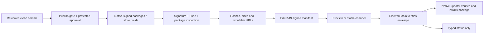

# ADR-V2-016: Signed release candidates, updates and rollback

- Status: Accepted and M9 local foundation implemented
- Date: 2026-08-26
- Owners: Desktop Foundation, Mobile and Observability & Release
- Extends: ADR-V2-002

## Context

V1 has four native surfaces: Windows x64, macOS arm64/x64, iOS and Android. A local package proves
only that the source can be bundled. It does not prove publisher identity, Apple notarization, store
review, production push delivery, safe upgrade or rollback. Release automation must therefore keep
local reproducibility separate from credential-backed publication.

## Decision

1. `internal`, `preview` and `stable` are distinct channels. `stable` is blocked until M8 external
   Beta, all M9 external evidence and explicit user approval are recorded.
2. Desktop release mode requires native signing credentials and embeds only an HTTPS manifest URL,
   key ID and Ed25519 public key. The private manifest key and native signing credentials stay in the
   protected release environment.
3. Electron Main downloads at most 1 MiB of manifest JSON, validates the strict schema, key ID,
   Ed25519 signature, channel, publication time, version, rollout cohort and exact platform/architecture
   before handing a feed URL to the native updater. Preload exposes typed state only; Renderer never
   receives the feed URL or public-key material.
4. Windows uses Authenticode-signed Squirrel output. macOS uses Developer ID signing, Apple notarization
   and a stapled ticket. A release candidate fails if native signature verification, Fuse verification,
   package-content inspection or source-map exclusion fails.
5. iOS and Android use EAS remote credentials and channel-bound store builds. `runtimeVersion` follows
   the application version, so an update cannot cross an incompatible native runtime. iOS declares its
   privacy manifest in application configuration.
6. The signed release manifest is an inventory and authorization envelope. Artifact bytes and feed
   metadata are retained immutably; the platform package signature remains the install-time trust root.
7. A bad rollout is stopped by setting rollout to zero and withdrawing the affected store/update
   candidate. Desktop rollback is normally a higher-version roll-forward built from the last known-good
   source. Previous signed installers remain available for supervised manual recovery; the client never
   accepts an unsigned downgrade.
8. Key rotation uses a bridge release: a release signed by the old manifest key embeds the next public
   key, then later manifests switch key IDs. Loss of the active private key stops updates until a signed
   bridge or a newly installed native package establishes the next trust root.

## Release state flow

## Consequences

- `.github/workflows/v2-release.yml` may build protected preview candidates for collecting native
  evidence, but its stable publish gate deliberately fails while external evidence or explicit approval
  is missing.
- Local CI continues producing unsigned artifacts and labels them as such.
- A release cannot be declared from a successful build alone; the evidence ledger and runbook approval
  record are mandatory.
- Mobile over-the-air updates and store binaries share channels but still require native-runtime and
  store-policy compatibility checks.

## Upstream references

- [Electron autoUpdater](https://www.electronjs.org/docs/latest/api/auto-updater/)
- [Electron Forge code signing](https://www.electronforge.io/guides/code-signing)
- [Expo app credentials](https://docs.expo.dev/app-signing/app-credentials/)
- [EAS Update deployment](https://docs.expo.dev/eas-update/deployment/)
- [Expo runtime versions](https://docs.expo.dev/eas-update/runtime-versions/)
- [Expo Apple privacy manifests](https://docs.expo.dev/guides/apple-privacy/)
